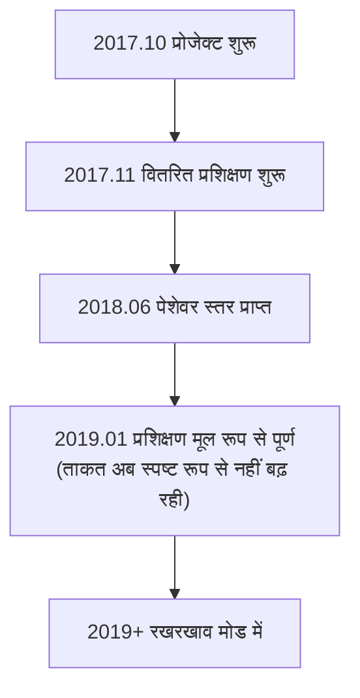

# अन्य गो AI परिचय

AlphaGo और KataGo के अलावा, गो AI क्षेत्र में कई महत्वपूर्ण प्रोजेक्ट हैं। यह लेख मुख्य व्यावसायिक AI और ओपन-सोर्स AI का परिचय देगा, पूरे पारिस्थितिकी तंत्र को समझने में मदद करेगा।

## व्यावसायिक गो AI

### Zen (तेनगेन)

**डेवलपर**: ओजिमा योजी (Yoji Ojima) / जापान
**पहला प्रकाशन**: 2009
**लाइसेंस**: व्यावसायिक

Zen AlphaGo से पहले सबसे मजबूत गो प्रोग्रामों में से एक था, पारंपरिक MCTS युग में ही पेशेवर स्तर पर था।

#### विकास इतिहास

| समय | संस्करण | मील का पत्थर |
|------|------|--------|
| 2009 | Zen 1.0 | पहला प्रकाशन |
| 2011 | Zen 4 | शौकिया 6-डान स्तर |
| 2012 | Zen 5 | 4 पत्थर हैंडीकैप में ताकेमिया मासाकी 9-डान को हराया |
| 2016 | Zen 7 | डीप लर्निंग तकनीक अपनाई |
| 2017+ | Deep Zen Go | AlphaGo आर्किटेक्चर संयोजन |

#### तकनीकी विशेषताएं

- **हाइब्रिड आर्किटेक्चर**: पारंपरिक हेयुरिस्टिक और डीप लर्निंग संयोजन
- **व्यावसायिक अनुकूलन**: उपभोक्ता हार्डवेयर के लिए अनुकूलित
- **उच्च स्थिरता**: वर्षों के व्यावसायिक उपयोग से सिद्ध
- **मल्टी-प्लेटफॉर्म**: Windows, macOS दोनों पर चलता है

#### उत्पाद रूप

- **Tengen (तेनगेन नो गो)**: डेस्कटॉप सॉफ्टवेयर, कीमत लगभग 10,000 येन
- **ऑनलाइन खेल**: KGS पर Zen19 अकाउंट के रूप में सक्रिय था

---

### Fine Art (जुएई)

**डेवलपर**: Tencent AI Lab / चीन
**पहला प्रकाशन**: 2016
**लाइसेंस**: गैर-सार्वजनिक

Fine Art टेनसेंट द्वारा विकसित गो AI है, चीनी गो जगत पर महत्वपूर्ण प्रभाव।

#### विकास इतिहास

| समय | घटना |
|------|------|
| 2016 नवंबर | पहली बार दिखाई दिया, Wild Fox Go पर खेला |
| 2017 मार्च | UEC कप कंप्यूटर गो टूर्नामेंट चैंपियन |
| 2017 | चीनी राष्ट्रीय गो टीम द्वारा प्रशिक्षण उपकरण के रूप में अपनाया |
| 2018 | विश्व AI गो टूर्नामेंट चैंपियन |
| वर्तमान तक | राष्ट्रीय टीम प्रशिक्षण सहायता के रूप में जारी |

#### तकनीकी विशेषताएं

- **बड़े पैमाने पर प्रशिक्षण**: टेनसेंट क्लाउड कम्प्यूटिंग संसाधन उपयोग
- **शीर्ष मानव खिलाड़ियों के साथ सहयोग**: बहुत सारा पेशेवर मार्गदर्शन
- **समृद्ध वास्तविक खेल अनुभव**: Wild Fox Go पर बड़ी संख्या में गेम
- **शिक्षण सुविधा एकीकरण**: रिव्यू विश्लेषण सुविधा

#### प्रभाव

Fine Art का चीनी पेशेवर गो पर गहरा प्रभाव:

- राष्ट्रीय टीम का मानक प्रशिक्षण उपकरण बना
- पेशेवर खिलाड़ियों की तैयारी विधि बदली
- AI-सहायित प्रशिक्षण को बढ़ावा दिया

---

### Golaxy (शिंगझेन)

**डेवलपर**: चीन Shenkke Technology / Tsinghua विश्वविद्यालय टीम
**पहला प्रकाशन**: 2018
**लाइसेंस**: व्यावसायिक

Golaxy "सबसे मानव-जैसा AI" के लक्ष्य से डिज़ाइन किया गया, शैली मानव खिलाड़ियों के करीब।

#### तकनीकी विशेषताएं

- **मानव-जैसी शैली**: जानबूझकर मानव जैसी चालें प्रशिक्षित
- **समायोज्य कठिनाई**: विभिन्न स्तर के प्रतिद्वंद्वी अनुकरण
- **शिक्षण-केंद्रित**: शिक्षण उपयोग को ध्यान में रखकर डिज़ाइन
- **हैंडीकैप गेम विशेषज्ञ**: हैंडीकैप गेम में विशेष अनुकूलन

#### उत्पाद उपयोग

- **Yike Go**: Yike App में एकीकृत
- **शिक्षण प्लेटफॉर्म**: ऑनलाइन गो शिक्षण के लिए
- **स्तर परीक्षण**: मानकीकृत स्तर मूल्यांकन

---

### अन्य व्यावसायिक AI

| नाम | डेवलपर | विशेषता |
|------|--------|------|
| **CGI** | NCTU (ताइवान) | शैक्षणिक अनुसंधान केंद्रित |
| **Dolbaram** | NHN (कोरिया) | कोरियाई गो प्लेटफॉर्म में एकीकृत |
| **AQ** | AQ टीम (जापान) | ओपन-सोर्स से व्यावसायिक |

## ओपन-सोर्स गो AI

### Leela Zero

**डेवलपर**: Gian-Carlo Pascutto / बेल्जियम
**पहला प्रकाशन**: 2017
**लाइसेंस**: GPL-3.0
**GitHub**: https://github.com/leela-zero/leela-zero

Leela Zero AlphaGo Zero को सफलतापूर्वक दोहराने वाला पहला ओपन-सोर्स प्रोजेक्ट है, समुदाय द्वारा वितरित प्रशिक्षण।

#### विकास इतिहास



#### तकनीकी विशेषताएं

- **सटीक पुनर्निर्माण**: AlphaGo Zero पेपर के अनुसार सख्ती से लागू
- **वितरित प्रशिक्षण**: विश्वभर के स्वयंसेवकों ने GPU योगदान दिया
- **पूर्ण पारदर्शी**: सभी प्रशिक्षण डेटा और मॉडल सार्वजनिक
- **मानक GTP**: सभी GTP गो सॉफ्टवेयर के साथ संगत

#### प्रशिक्षण आंकड़े

| आइटम | मान |
|------|------|
| कुल स्व-खेल गेम | लगभग 1.8 करोड़ |
| प्रशिक्षण इटरेशन | लगभग 270 |
| योगदानकर्ता | हजारों |
| प्रशिक्षण अवधि | लगभग 1.5 वर्ष |

#### उपयोग विधि

```bash
# इंस्टॉल
brew install leela-zero  # macOS

# चलाएं
leelaz --gtp --weights best-network.gz

# GTP कमांड
genmove black
play white D4
```

#### वर्तमान स्थिति

हालांकि Leela Zero अब सक्रिय प्रशिक्षण में नहीं, लेकिन:
- कोड अभी भी AlphaGo Zero सीखने का उत्कृष्ट संसाधन
- प्रशिक्षित मॉडल अभी भी उपयोग योग्य
- समुदाय अभी भी मूल सुविधाएं बनाए रखता है

---

### ELF OpenGo

**डेवलपर**: Facebook AI Research (FAIR)
**पहला प्रकाशन**: 2018
**लाइसेंस**: BSD
**GitHub**: https://github.com/pytorch/ELF

ELF OpenGo Facebook द्वारा विकसित गो AI है, बड़े पैमाने पर वितरित प्रशिक्षण क्षमता प्रदर्शित करता है।

#### तकनीकी विशेषताएं

- **ELF फ्रेमवर्क**: Facebook के ELF (Extensive, Lightweight, and Flexible) गेम रिसर्च प्लेटफॉर्म पर आधारित
- **बड़े पैमाने पर प्रशिक्षण**: 2000 GPU से प्रशिक्षण
- **PyTorch कार्यान्वयन**: Facebook के अपने डीप लर्निंग फ्रेमवर्क का उपयोग
- **अनुसंधान केंद्रित**: मुख्य उद्देश्य अनुसंधान, व्यावहारिक नहीं

#### प्रदर्शन

- KGS पर शीर्ष स्तर
- पेशेवर 9-डान से स्थिर जीत दर
- शीर्ष कॉन्फ्रेंस में पेपर प्रकाशित

#### वर्तमान स्थिति

- प्रोजेक्ट अब सक्रिय रखरखाव में नहीं
- कोड और मॉडल अभी भी डाउनलोड योग्य
- मुख्य मूल्य शैक्षणिक संदर्भ में

---

### SAI (Sensible Artificial Intelligence)

**डेवलपर**: SAI टीम / यूरोप
**पहला प्रकाशन**: 2019
**लाइसेंस**: MIT
**GitHub**: https://github.com/sai-dev/sai

SAI Leela Zero पर आधारित सुधारित संस्करण है, प्रयोगात्मक सुविधाओं पर केंद्रित।

#### तकनीकी विशेषताएं

- **सुधारित प्रशिक्षण विधियां**: विभिन्न प्रशिक्षण अनुकूलन प्रयोग
- **अधिक नियम समर्थन**: Leela Zero से अधिक गो नियम समर्थित
- **प्रयोगात्मक सुविधाएं**: नए नेटवर्क आर्किटेक्चर और प्रशिक्षण तकनीकें परीक्षण

#### वर्तमान स्थिति

- छोटे पैमाने पर समुदाय रखरखाव जारी
- मुख्य रूप से प्रयोग और सीखने के लिए

---

### PhoenixGo

**डेवलपर**: Tencent WeChat टीम
**पहला प्रकाशन**: 2018
**लाइसेंस**: BSD-3
**GitHub**: https://github.com/Tencent/PhoenixGo

PhoenixGo टेनसेंट का ओपन-सोर्स गो AI है, 2018 विश्व AI गो टूर्नामेंट चैंपियन रहा।

#### तकनीकी विशेषताएं

- **व्यावसायिक-स्तर गुणवत्ता**: टेनसेंट आंतरिक प्रोजेक्ट से उत्पन्न
- **TensorFlow कार्यान्वयन**: मुख्यधारा फ्रेमवर्क का उपयोग
- **मल्टी-प्लेटफॉर्म समर्थन**: Linux, Windows, macOS
- **वितरित समर्थन**: मल्टी-मशीन मल्टी-GPU वातावरण में चल सकता है

#### उपयोग विधि

```bash
# कंपाइल
bazel build //src:mcts_main

# चलाएं
./mcts_main --gtp --config_path=config.conf
```

---

### MiniGo

**डेवलपर**: Google Brain
**पहला प्रकाशन**: 2018
**लाइसेंस**: Apache-2.0
**GitHub**: https://github.com/tensorflow/minigo

MiniGo Google का शैक्षिक उद्देश्य वाला ओपन-सोर्स गो AI है, अधिक लोगों को AlphaGo सिद्धांत समझाने के लिए।

#### तकनीकी विशेषताएं

- **शिक्षा केंद्रित**: स्पष्ट और पढ़ने योग्य कोड
- **TensorFlow कार्यान्वयन**: Google आधिकारिक उदाहरण
- **पूर्ण दस्तावेज़**: विस्तृत तकनीकी विवरण
- **Colab समर्थन**: Google Colab में सीधे चला सकते हैं

#### उपयुक्त परिदृश्य

- AlphaGo Zero आर्किटेक्चर सीखना
- गेम में रीइनफोर्समेंट लर्निंग अनुप्रयोग समझना
- अपने प्रोजेक्ट का शुरुआती बिंदु

## विभिन्न AI विशेषता तुलना

### ताकत तुलना (अनुमानित)

| AI | ताकत स्तर | नोट |
|----|---------|------|
| KataGo | शीर्ष सुपरह्यूमन | निरंतर प्रशिक्षण जारी |
| Fine Art | शीर्ष सुपरह्यूमन | गैर-सार्वजनिक |
| Leela Zero | सुपरह्यूमन | प्रशिक्षण रुका |
| ELF OpenGo | सुपरह्यूमन | प्रशिक्षण रुका |
| PhoenixGo | लगभग सुपरह्यूमन | प्रशिक्षण रुका |
| Zen | पेशेवर स्तर | व्यावसायिक उत्पाद |
| Golaxy | पेशेवर स्तर | समायोज्य कठिनाई |

### सुविधा तुलना

| सुविधा | KataGo | Leela Zero | PhoenixGo | Zen |
|------|--------|------------|-----------|------|
| ओपन-सोर्स | ✓ | ✓ | ✓ | ✗ |
| अंक भविष्यवाणी | ✓ | ✗ | ✗ | △ |
| मल्टी-रूल समर्थन | ✓ | ✗ | ✗ | ✗ |
| Analysis API | ✓ | ✗ | ✗ | ✗ |
| CPU मोड | ✓ | ✓ | ✓ | ✓ |
| निरंतर अपडेट | ✓ | ✗ | ✗ | △ |

### उपयुक्त परिदृश्य सुझाव

| आवश्यकता | अनुशंसित चयन | कारण |
|------|---------|------|
| सामान्य खेल/विश्लेषण | KataGo | सबसे मजबूत और सबसे पूर्ण सुविधाएं |
| AlphaGo सीखना | Leela Zero / MiniGo | स्पष्ट कोड |
| व्यावसायिक अनुप्रयोग | Zen / स्व-प्रशिक्षित KataGo | स्पष्ट लाइसेंस |
| शिक्षण सहायता | KataGo / Golaxy | समृद्ध विश्लेषण सुविधाएं |
| अनुसंधान प्रयोग | KataGo / SAI | प्रशिक्षण संशोधित कर सकते हैं |

## भविष्य के विकास रुझान

### तकनीकी रुझान

1. **अधिक कुशल प्रशिक्षण विधियां**
   - जैसा KataGo ने दक्षता वृद्धि दिखाई
   - कम संसाधनों में अधिक मजबूत

2. **बेहतर व्याख्यात्मकता**
   - AI यह चाल क्यों खेला, समझाना
   - मनुष्यों को AI की सोच समझने में मदद

3. **मानव शैली संयोजन**
   - विशिष्ट खिलाड़ी शैली जैसा AI प्रशिक्षण
   - शिक्षण और अनुसंधान के लिए

4. **क्रॉस-गेम सार्वभौमिकता**
   - जैसा AlphaZero ने दिखाया
   - एक फ्रेमवर्क कई खेलों पर लागू

### अनुप्रयोग रुझान

1. **सार्वभौमिकता**
   - अधिक गो प्रेमी AI विश्लेषण उपयोग
   - मोबाइल जैसे उपकरणों पर भी चल सकता है

2. **पेशेवरीकरण**
   - पेशेवर खिलाड़ी गहराई से AI प्रशिक्षण पर निर्भर
   - AI सहायता मानकीकृत

3. **व्यावसायीकरण**
   - अधिक AI-सहायित गो उत्पाद
   - शिक्षण, विश्लेषण, साथी जैसी सेवाएं

## सारांश

गो AI पारिस्थितिकी तंत्र समृद्ध और विविध:

- **सबसे मजबूत और सबसे पूर्ण सुविधाएं चाहिए**: KataGo चुनें
- **AI सिद्धांत सीखना चाहते हैं**: Leela Zero या MiniGo कोड अध्ययन करें
- **व्यावसायिक अनुप्रयोग आवश्यकता**: Zen या स्व-प्रशिक्षित मॉडल मूल्यांकन करें
- **विशेष आवश्यकता**: परिस्थिति अनुसार चुनें या संयोजन करें

अब व्यावहारिक भाग में प्रवेश करें, [KataGo इंस्टॉल और उपयोग](/docs/for-engineers/katago-source/) करना सीखें!
