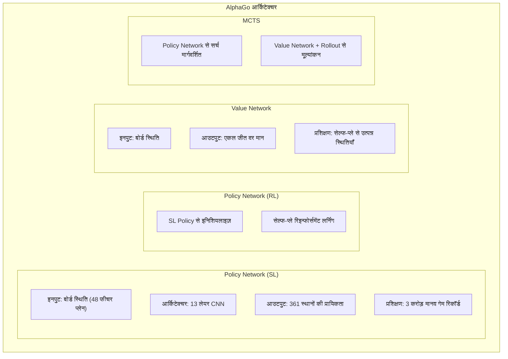
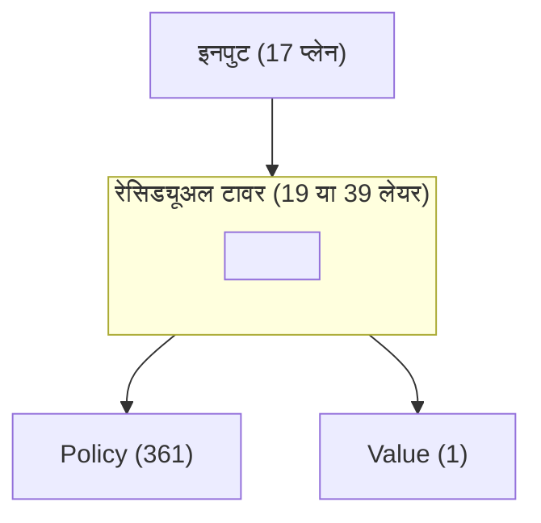
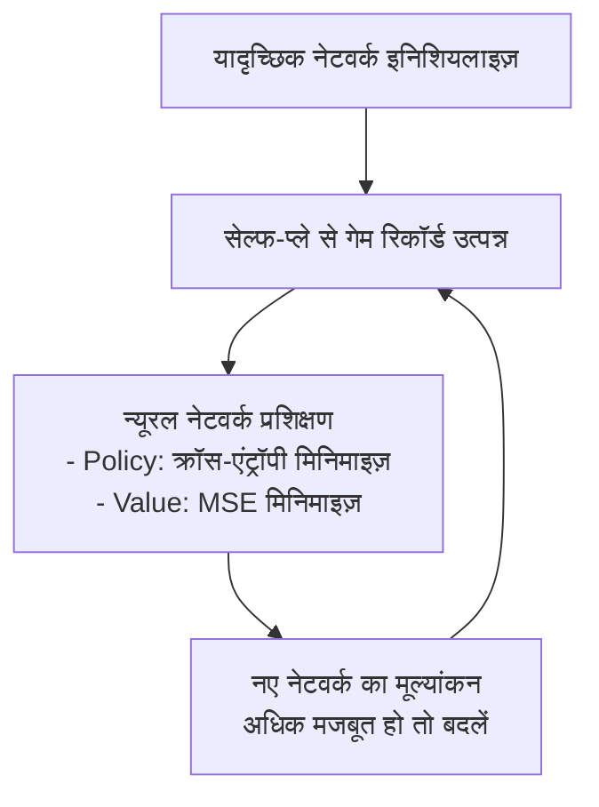

# मुख्य पेपर गाइड

यह लेख गो AI विकास इतिहास के सबसे महत्वपूर्ण पेपरों का संकलन करता है, त्वरित समझ के लिए सारांश और तकनीकी बिंदु प्रदान करता है।

---

## पेपर अवलोकन

### टाइमलाइन

```
2006  Coulom - MCTS का गो में पहला अनुप्रयोग
2016  Silver et al. - AlphaGo (Nature)
2017  Silver et al. - AlphaGo Zero (Nature)
2017  Silver et al. - AlphaZero
2019  Wu - KataGo
2020+ विभिन्न सुधार और अनुप्रयोग
```

### पढ़ने की सिफारिश

| लक्ष्य | सुझाया पेपर |
|------|---------|
| मूल बातें समझना | AlphaGo (2016) |
| सेल्फ-प्ले समझना | AlphaGo Zero (2017) |
| सार्वभौमिक विधि समझना | AlphaZero (2017) |
| कार्यान्वयन संदर्भ | KataGo (2019) |

---

## 1. MCTS का जन्म (2006)

### पेपर जानकारी

```
शीर्षक: Efficient Selectivity and Backup Operators in Monte-Carlo Tree Search
लेखक: Rémi Coulom
प्रकाशन: Computers and Games 2006
```

### मुख्य योगदान

मोंटे कार्लो विधि का गो में पहला व्यवस्थित अनुप्रयोग:

```
पहले: शुद्ध यादृच्छिक सिमुलेशन, ट्री संरचना नहीं
बाद में: सर्च ट्री निर्माण + UCB चयन + आंकड़े वापसी
```

### मुख्य अवधारणाएं

#### UCB1 फॉर्मूला

```
चयन स्कोर = औसत जीत दर + C × √(ln(N) / n)

जहाँ:
- N: पैरेंट नोड विज़िट काउंट
- n: चाइल्ड नोड विज़िट काउंट
- C: अन्वेषण स्थिरांक
```

#### MCTS चार चरण

```
1. Selection: UCB से नोड चुनें
2. Expansion: नया नोड विस्तारित करें
3. Simulation: अंत तक यादृच्छिक सिमुलेशन
4. Backpropagation: जीत/हार वापस करें
```

### प्रभाव

- गो AI को एमेच्योर दान स्तर तक पहुंचाया
- बाद के सभी गो AI का आधार बना
- UCB अवधारणा ने PUCT के विकास को प्रभावित किया

---

## 2. AlphaGo (2016)

### पेपर जानकारी

```
शीर्षक: Mastering the game of Go with deep neural networks and tree search
लेखक: Silver, D., Huang, A., Maddison, C.J., et al.
प्रकाशन: Nature, 2016
DOI: 10.1038/nature16961
```

### मुख्य योगदान

**डीप लर्निंग और MCTS का पहला संयोजन**, मानव विश्व चैंपियन को हराया।

### सिस्टम आर्किटेक्चर



### तकनीकी बिंदु

#### 1. सुपरवाइज़्ड लर्निंग Policy Network

```python
# इनपुट फीचर्स (48 प्लेन)
- अपने पत्थरों की स्थिति
- प्रतिद्वंद्वी के पत्थरों की स्थिति
- लिबर्टी की संख्या
- कैप्चर के बाद की स्थिति
- वैध चाल स्थान
- हाल की चालों की स्थिति
...
```

#### 2. रिइन्फोर्समेंट लर्निंग सुधार

```
SL Policy → सेल्फ-प्ले → RL Policy

RL Policy, SL Policy से ~80% जीत दर से मजबूत
```

#### 3. Value Network प्रशिक्षण

```
ओवरफिटिंग रोकने की कुंजी:
- प्रत्येक गेम से केवल एक स्थिति लें
- समान स्थितियों का दोहराव टालें
```

#### 4. MCTS इंटीग्रेशन

```
लीफ नोड मूल्यांकन = 0.5 × Value Network + 0.5 × Rollout

Rollout तेज Policy Network उपयोग करता है (कम सटीक लेकिन तेज)
```

### मुख्य आंकड़े

| आइटम | मान |
|------|------|
| SL Policy सटीकता | 57% |
| RL Policy vs SL Policy जीत दर | 80% |
| प्रशिक्षण GPU | 176 |
| गेम GPU | 48 TPU |

---

## 3. AlphaGo Zero (2017)

### पेपर जानकारी

```
शीर्षक: Mastering the game of Go without human knowledge
लेखक: Silver, D., Schrittwieser, J., Simonyan, K., et al.
प्रकाशन: Nature, 2017
DOI: 10.1038/nature24270
```

### मुख्य योगदान

**मानव गेम रिकॉर्ड की बिल्कुल आवश्यकता नहीं**, शून्य से स्व-शिक्षण।

### AlphaGo से अंतर

| पहलू | AlphaGo | AlphaGo Zero |
|------|---------|--------------|
| मानव गेम रिकॉर्ड | आवश्यक | **आवश्यक नहीं** |
| नेटवर्क संख्या | 4 | **1 ड्यूअल-हेड** |
| इनपुट फीचर्स | 48 प्लेन | **17 प्लेन** |
| Rollout | उपयोग | **उपयोग नहीं** |
| रेसिड्यूअल नेटवर्क | नहीं | **हाँ** |
| प्रशिक्षण समय | कई महीने | **3 दिन** |

### मुख्य नवाचार

#### 1. एकल ड्यूअल-हेड नेटवर्क



#### 2. सरलीकृत इनपुट फीचर्स

```python
# केवल 17 फीचर प्लेन आवश्यक
features = [
    current_player_stones,      # अपने पत्थर
    opponent_stones,            # प्रतिद्वंद्वी के पत्थर
    history_1_player,           # इतिहास स्थिति 1
    history_1_opponent,
    ...                         # इतिहास स्थिति 2-7
    color_to_play               # किसकी बारी
]
```

#### 3. शुद्ध Value Network मूल्यांकन

```
Rollout अब उपयोग नहीं
लीफ नोड मूल्यांकन = Value Network आउटपुट

अधिक सरल, अधिक तेज
```

#### 4. प्रशिक्षण प्रक्रिया



### सीखने की प्रगति

```
प्रशिक्षण समय    Elo
─────────────────
3 घंटे      शुरुआती
24 घंटे     AlphaGo Lee से आगे
72 घंटे     AlphaGo Master से आगे
```

---

## 4. AlphaZero (2017)

### पेपर जानकारी

```
शीर्षक: Mastering Chess and Shogi by Self-Play with a General Reinforcement Learning Algorithm
लेखक: Silver, D., Hubert, T., Schrittwieser, J., et al.
प्रकाशन: arXiv:1712.01815 (बाद में Science, 2018 में प्रकाशित)
```

### मुख्य योगदान

**सार्वभौमिकरण**: एक ही एल्गोरिथम गो, शतरंज, शोगी पर लागू।

### सार्वभौमिक आर्किटेक्चर

```
इनपुट एनकोडिंग (गेम-विशिष्ट) → रेसिड्यूअल नेटवर्क (सार्वभौमिक) → ड्यूअल-हेड आउटपुट (सार्वभौमिक)
```

### क्रॉस-गेम अनुकूलन

| गेम | इनपुट प्लेन | एक्शन स्पेस | प्रशिक्षण समय |
|------|---------|---------|---------|
| गो | 17 | 362 | 40 दिन |
| शतरंज | 119 | 4672 | 9 घंटे |
| शोगी | 362 | 11259 | 12 घंटे |

### MCTS सुधार

#### PUCT फॉर्मूला

```
चयन स्कोर = Q(s,a) + c(s) × P(s,a) × √N(s) / (1 + N(s,a))

c(s) = log((1 + N(s) + c_base) / c_base) + c_init
```

#### अन्वेषण नॉइज़

```python
# रूट नोड पर Dirichlet नॉइज़ जोड़ें
P(s,a) = (1 - ε) × p_a + ε × η_a

η ~ Dir(α)
α = 0.03 (गो), 0.3 (शतरंज), 0.15 (शोगी)
```

---

## 5. KataGo (2019)

### पेपर जानकारी

```
शीर्षक: Accelerating Self-Play Learning in Go
लेखक: David J. Wu
प्रकाशन: arXiv:1902.10565
```

### मुख्य योगदान

**50 गुना दक्षता वृद्धि**, व्यक्तिगत डेवलपर्स को भी शक्तिशाली गो AI प्रशिक्षित करने की सुविधा।

### मुख्य नवाचार

#### 1. सहायक प्रशिक्षण लक्ष्य

```
कुल लॉस = Policy Loss + Value Loss +
         Score Loss + Ownership Loss + ...

सहायक लक्ष्य नेटवर्क को तेजी से कन्वर्ज कराते हैं
```

#### 2. ग्लोबल फीचर्स

```python
# ग्लोबल पूलिंग लेयर
global_features = global_avg_pool(conv_features)
# लोकल फीचर्स के साथ संयोजन
combined = concat(conv_features, broadcast(global_features))
```

#### 3. Playout Cap रैंडमाइज़ेशन

```
पारंपरिक: प्रत्येक सर्च में निश्चित N बार
KataGo: N किसी वितरण से यादृच्छिक रूप से लिया जाता है

नेटवर्क को विभिन्न सर्च गहराइयों में अच्छा प्रदर्शन सिखाता है
```

#### 4. प्रोग्रेसिव बोर्ड साइज़

```python
if training_step < 1000000:
    board_size = random.choice([9, 13, 19])
else:
    board_size = 19
```

### दक्षता तुलना

| मेट्रिक | AlphaZero | KataGo |
|------|-----------|--------|
| सुपर-ह्यूमन स्तर तक पहुंचने के GPU दिन | 5000 | **100** |
| दक्षता वृद्धि | आधार | **50 गुना** |

---

## 6. विस्तारित पेपर

### MuZero (2020)

```
शीर्षक: Mastering Atari, Go, Chess and Shogi by Planning with a Learned Model
योगदान: वातावरण डायनामिक्स मॉडल सीखना, गेम नियमों की आवश्यकता नहीं
```

### EfficientZero (2021)

```
शीर्षक: Mastering Atari Games with Limited Data
योगदान: नमूना दक्षता में बड़ी वृद्धि
```

### Gumbel AlphaZero (2022)

```
शीर्षक: Policy Improvement by Planning with Gumbel
योगदान: बेहतर पॉलिसी सुधार विधि
```

---

## पेपर पढ़ने की सिफारिश

### प्रारंभिक क्रम

```
1. AlphaGo (2016) - मूल आर्किटेक्चर समझें
2. AlphaGo Zero (2017) - सेल्फ-प्ले समझें
3. KataGo (2019) - कार्यान्वयन विवरण समझें
```

### उन्नत क्रम

```
4. AlphaZero (2017) - सार्वभौमिकरण
5. MuZero (2020) - वर्ल्ड मॉडल सीखना
6. MCTS मूल पेपर - आधार समझें
```

### पढ़ने की तकनीकें

1. **पहले सार और निष्कर्ष देखें**: मुख्य योगदान तुरंत समझें
2. **चित्र देखें**: समग्र आर्किटेक्चर समझें
3. **विधि भाग देखें**: तकनीकी विवरण समझें
4. **अपेंडिक्स देखें**: कार्यान्वयन विवरण और हाइपरपैरामीटर खोजें

---

## संसाधन लिंक

### पेपर PDF

| पेपर | लिंक |
|------|------|
| AlphaGo | [Nature](https://www.nature.com/articles/nature16961) |
| AlphaGo Zero | [Nature](https://www.nature.com/articles/nature24270) |
| AlphaZero | [Science](https://www.science.org/doi/10.1126/science.aar6404) |
| KataGo | [arXiv](https://arxiv.org/abs/1902.10565) |

### ओपन सोर्स कार्यान्वयन

| प्रोजेक्ट | लिंक |
|------|------|
| KataGo | [GitHub](https://github.com/lightvector/KataGo) |
| Leela Zero | [GitHub](https://github.com/leela-zero/leela-zero) |
| MiniGo | [GitHub](https://github.com/tensorflow/minigo) |

---

## आगे पढ़ें

- [न्यूरल नेटवर्क आर्किटेक्चर विस्तृत व्याख्या](../neural-network) — नेटवर्क डिज़ाइन की गहन समझ
- [MCTS कार्यान्वयन विवरण](../mcts-implementation) — सर्च एल्गोरिथम कार्यान्वयन
- [KataGo प्रशिक्षण तंत्र विश्लेषण](../training) — प्रशिक्षण प्रक्रिया विस्तृत व्याख्या
