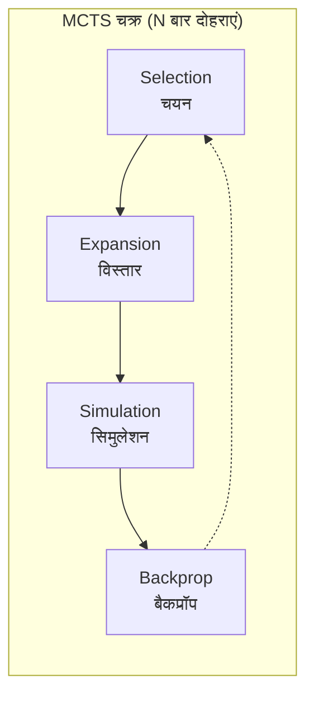
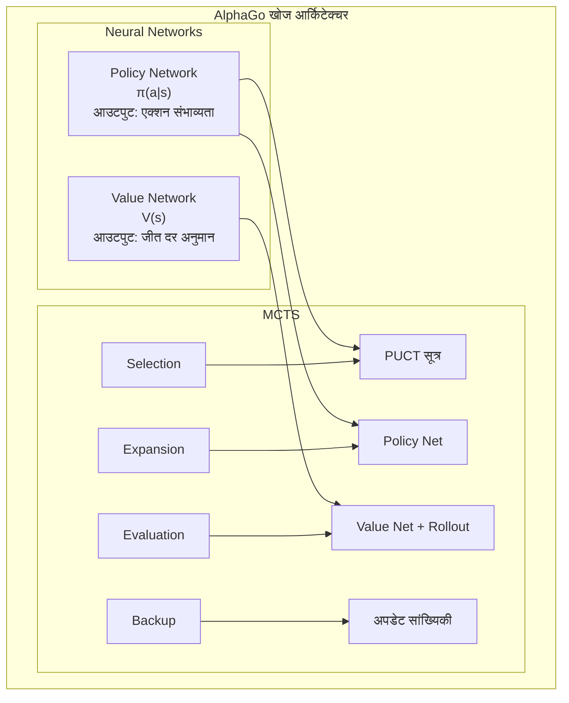

import { MCTSTree } from '@site/src/components/D3Charts';

# MCTS और न्यूरल नेटवर्क का संयोजन

पिछले लेखों में, हमने न्यूरल नेटवर्क (Policy Network और Value Network) और रीइन्फोर्समेंट लर्निंग की अवधारणाओं का अलग-अलग परिचय दिया। अब, आइए AlphaGo के मुख्य नवाचार का अन्वेषण करें—**मोंटे कार्लो ट्री सर्च (MCTS) को न्यूरल नेटवर्क के साथ कैसे पूर्णता से जोड़ा जाए**।

यह संयोजन AlphaGo की सफलता की कुंजी है: न्यूरल नेटवर्क "अंतर्ज्ञान" प्रदान करते हैं, MCTS "तर्क" प्रदान करता है, दोनों एक-दूसरे के पूरक हैं।

---

## पारंपरिक MCTS की समीक्षा

### MCTS क्या है?

**मोंटे कार्लो ट्री सर्च (Monte Carlo Tree Search, MCTS)** एक यादृच्छिक सैंपलिंग आधारित खोज एल्गोरिथम है, जो विशेष रूप से गेम AI के लिए उपयुक्त है।

MCTS का मुख्य विचार है: **सभी संभावित चालों की गणना करने के बजाय, बड़ी संख्या में यादृच्छिक गेम सिमुलेट करें, और प्रत्येक चाल की गुणवत्ता का अनुमान लगाने के लिए सांख्यिकी का उपयोग करें**।

### चार चरण

पारंपरिक MCTS में चार चरण होते हैं, जो लगातार दोहराए जाते हैं:



आइए प्रत्येक चरण को विस्तार से समझें:

### 1. Selection (चयन)

रूट नोड से शुरू करते हुए, ट्री में नीचे की ओर जाएं, "सबसे आशाजनक" चाइल्ड नोड का चयन करें, जब तक लीफ नोड तक नहीं पहुंच जाते।

चयन का मानदंड **UCB1 (Upper Confidence Bound)** सूत्र है:

$$\text{UCB1}(s, a) = \bar{X}_{s,a} + c \sqrt{\frac{\ln N_s}{N_{s,a}}}$$

जहां:
- $\bar{X}_{s,a}$: नोड $(s, a)$ से शुरू होने वाला औसत रिटर्न (**एक्सप्लॉइटेशन टर्म**)
- $\sqrt{\frac{\ln N_s}{N_{s,a}}}$: एक्सप्लोरेशन बोनस (**एक्सप्लोरेशन टर्म**)
- $N_s$: पैरेंट नोड की विज़िट संख्या
- $N_{s,a}$: चाइल्ड नोड की विज़िट संख्या
- $c$: एक्सप्लोरेशन और एक्सप्लॉइटेशन को संतुलित करने का स्थिरांक

इस सूत्र की बुद्धिमत्ता यह है:
- कम विज़िट वाले नोड्स को अधिक एक्सप्लोरेशन बोनस मिलता है
- विज़िट संख्या बढ़ने के साथ, चयन अधिक वास्तविक मूल्य वाले नोड्स की ओर झुकता है

### 2. Expansion (विस्तार)

लीफ नोड पर पहुंचने के बाद, एक अन-एक्सप्लोर्ड एक्शन चुनें, नया चाइल्ड नोड बनाएं।

```
विस्तार से पहले:                 विस्तार के बाद:
     ○ (रूट)                      ○ (रूट)
    /│\                         /│\
   ○ ○ ○                       ○ ○ ○
  /│              →           /│
 ○ ○                         ○ ○
   ↑                            \
   लीफ नोड                        ● (नया नोड)
```

### 3. Simulation (सिमुलेशन/Rollout)

नए नोड से शुरू करते हुए, किसी रणनीति (आमतौर पर यादृच्छिक या सरल ह्यूरिस्टिक) का उपयोग करके गेम को तेज़ी से पूरा करें, परिणाम प्राप्त करें।

यही "मोंटे कार्लो" नाम का स्रोत है—**परिणाम का अनुमान लगाने के लिए यादृच्छिक सिमुलेशन का उपयोग**।

पारंपरिक MCTS की rollout रणनीति हो सकती है:
- **शुद्ध यादृच्छिक**: वैध चालों का एकसमान यादृच्छिक चयन
- **हल्का ह्यूरिस्टिक**: स्पष्ट रूप से खराब चालों को फ़िल्टर करने के लिए सरल नियमों का उपयोग

### 4. Backpropagation (बैकप्रॉपगेशन)

सिमुलेशन परिणाम (जीत/हार) को पथ के साथ वापस भेजें, प्रत्येक नोड की सांख्यिकीय जानकारी अपडेट करें:

```
अपडेट सामग्री:
- विज़िट संख्या: N(s, a) ← N(s, a) + 1
- संचित मूल्य: W(s, a) ← W(s, a) + z
- औसत मूल्य: Q(s, a) = W(s, a) / N(s, a)
```

जहां $z$ सिमुलेशन परिणाम है (+1 या -1)।

### पारंपरिक MCTS की सीमाएं

पारंपरिक MCTS का Go में प्रदर्शन सीमित है, मुख्य समस्याएं हैं:

1. **Rollout गुणवत्ता खराब**: यादृच्छिक सिमुलेशन अक्सर अतार्किक गेम उत्पन्न करते हैं
2. **बड़ी संख्या में सिमुलेशन की आवश्यकता**: प्रत्येक चाल के लिए दसियों हज़ार सिमुलेशन की आवश्यकता हो सकती है
3. **अशुद्ध मूल्यांकन**: केवल जीत/हार सांख्यिकी पर निर्भर, सूचना उपयोग दक्षता कम
4. **पैटर्न का उपयोग नहीं कर सकता**: हर बार नए सिरे से खोज, अनुभव संचित नहीं करता

इन समस्याओं को AlphaGo में न्यूरल नेटवर्क द्वारा सुंदर ढंग से हल किया गया।

---

## न्यूरल नेटवर्क MCTS को कैसे सुधारते हैं

### समग्र आर्किटेक्चर

AlphaGo दो न्यूरल नेटवर्क को MCTS में एकीकृत करता है:



### Policy Network की भूमिका

**Policy Network Expansion चरण में भूमिका निभाता है**।

पारंपरिक MCTS में विस्तार करते समय, सभी अन-एक्सप्लोर्ड एक्शन्स को समान रूप से महत्वपूर्ण माना जाता है। लेकिन Policy Network **प्रायर संभाव्यता (prior probability)** प्रदान करता है:

$$P(s, a) = \pi_\theta(a|s)$$

यह MCTS को उन चालों का पहले अन्वेषण करने देता है जो "बेहतर दिखती हैं", खोज दक्षता को काफी बढ़ाता है।

उदाहरण के लिए, एक स्थिति में:
- "टेनगेन" में केवल 0.01% संभाव्यता हो सकती है
- "कॉर्नर जोसेकी" में 15% संभाव्यता हो सकती है
- "बड़ा क्षेत्र" में 10% संभाव्यता हो सकती है

MCTS उच्च संभाव्यता वाली चालों का पहले अन्वेषण करेगा, स्पष्ट रूप से खराब विकल्पों पर समय बर्बाद नहीं करेगा।

### Value Network की भूमिका

**Value Network Evaluation चरण में भूमिका निभाता है**।

पारंपरिक MCTS को मूल्यांकन प्राप्त करने के लिए पूरे गेम का सिमुलेशन पूरा करना होता है। लेकिन Value Network किसी भी स्थिति की जीत दर का सीधे मूल्यांकन कर सकता है:

$$v(s) = V_\phi(s)$$

यह एक मास्टर से स्थिति का मूल्यांकन करवाने जैसा है, दो शुरुआती खिलाड़ियों को पूरा गेम खेलने और फिर परिणाम देखने के बजाय।

AlphaGo का मूल संस्करण Value Network और Rollout का मिश्रित उपयोग करता है:

$$V(s_L) = (1 - \lambda) \cdot v_\theta(s_L) + \lambda \cdot z_L$$

जहां:
- $v_\theta(s_L)$: Value Network का मूल्यांकन
- $z_L$: Rollout का परिणाम
- $\lambda$: मिश्रण गुणांक (AlphaGo $\lambda = 0.5$ का उपयोग करता है)

### खोज ट्री का विज़ुअलाइज़ेशन

आइए एक MCTS खोज ट्री को विज़ुअलाइज़ करें:

<MCTSTree width={700} height={450} showPUCT={true} interactive={true} />

इस विज़ुअलाइज़ेशन में, आप देख सकते हैं:
- नोड का आकार विज़िट संख्या को दर्शाता है
- नीला पथ MCTS द्वारा चयनित सर्वोत्तम पथ है
- प्रत्येक नोड विज़िट संख्या N और औसत मूल्य Q दिखाता है

---

## खोज प्रक्रिया का विस्तृत विवरण

### पूर्ण प्रवाह

आइए एक पूर्ण MCTS सिमुलेशन को ट्रेस करें:

```
एल्गोरिथम: AlphaGo MCTS एकल सिमुलेशन

इनपुट: रूट नोड s_root, Policy Network π, Value Network V

1. Selection (चयन)
   s = s_root
   पथ = []

   while s लीफ नोड नहीं है:
       # PUCT सूत्र का उपयोग करके एक्शन चुनें
       a* = argmax_a [Q(s,a) + U(s,a)]

       जहां U(s,a) = c_puct · P(s,a) · √N(s) / (1 + N(s,a))

       पथ.append((s, a*))
       s = एक्शन a* निष्पादित करने के बाद की स्थिति

2. Expansion (विस्तार)
   यदि s टर्मिनल स्थिति नहीं है:
       # Policy Network का उपयोग करके प्रायर संभाव्यता की गणना करें
       P(s, ·) = π(·|s)

       # सभी वैध एक्शन्स के लिए चाइल्ड नोड बनाएं
       for a in वैध_एक्शन:
           चाइल्ड नोड (s, a) बनाएं
           P(s,a), N(s,a)=0, W(s,a)=0 सेट करें

3. Evaluation (मूल्यांकन)
   # Value Network और Rollout का मिश्रण
   v = V(s)                          # Value Network मूल्यांकन
   z = rollout(s)                    # Rollout परिणाम
   value = (1-λ)·v + λ·z             # मिश्रण

   # AlphaGo Zero केवल Value Network का उपयोग करने के लिए सरलीकृत
   # value = V(s)

4. Backpropagation (बैकप्रॉपगेशन)
   for (s', a') in रिवर्स(पथ):
       N(s', a') += 1
       W(s', a') += value
       Q(s', a') = W(s', a') / N(s', a')
       value = -value                 # परिप्रेक्ष्य बदलें
```

### चयन चरण का विस्तृत विवरण

चयन चरण **PUCT सूत्र** का उपयोग करता है (अगले लेख में विस्तार से चर्चा की जाएगी):

$$a^* = \arg\max_a \left[ Q(s,a) + c_{\text{puct}} \cdot P(s,a) \cdot \frac{\sqrt{N(s)}}{1 + N(s,a)} \right]$$

यह सूत्र संतुलित करता है:
- **Q(s,a)**: ज्ञात औसत मूल्य (एक्सप्लॉइटेशन)
- **U(s,a)**: एक्सप्लोरेशन बोनस, प्रायर संभाव्यता और विज़िट संख्या का संयोजन (एक्सप्लोरेशन)

### विस्तार चरण का विस्तृत विवरण

लीफ नोड पर पहुंचने पर, Policy Network का उपयोग करके नए नोड को इनिशियलाइज़ करें:

```python
def expand(state, policy_network):
    # सभी वैध एक्शन्स की संभाव्यता प्राप्त करें
    action_probs = policy_network(state)

    # अवैध एक्शन्स फ़िल्टर करें और पुनः नॉर्मलाइज़ करें
    legal_actions = get_legal_actions(state)
    legal_probs = action_probs[legal_actions]
    legal_probs = legal_probs / legal_probs.sum()

    # चाइल्ड नोड बनाएं
    for action, prob in zip(legal_actions, legal_probs):
        child = create_node(
            state=apply_action(state, action),
            prior=prob,
            visit_count=0,
            value_sum=0
        )
        add_child(current_node, action, child)
```

### मूल्यांकन चरण का विस्तृत विवरण

AlphaGo का मूल संस्करण दो प्रकार के मूल्यांकन का मिश्रित उपयोग करता है:

**Value Network मूल्यांकन**:
- स्थिति को सीधे इनपुट करें, जीत दर आउटपुट करें
- तेज़ गणना (एक न्यूरल नेटवर्क इन्फरेंस)
- समग्र परिप्रेक्ष्य से मूल्यांकन प्रदान करता है

**Rollout मूल्यांकन**:
- फास्ट रणनीति (Fast Rollout Policy) का उपयोग करके गेम पूरा करें
- धीमी गणना लेकिन पूर्ण गेम परिणाम प्रदान करता है
- कुछ रणनीतियों की खोज कर सकता है जो न्यूरल नेटवर्क चूक सकता है

```python
def evaluate(state, value_network, rollout_policy, lambda_mix=0.5):
    # Value Network मूल्यांकन
    v = value_network(state)

    # Rollout मूल्यांकन
    current = state
    while not is_terminal(current):
        action = rollout_policy(current)
        current = apply_action(current, action)
    z = get_result(current)

    # मिश्रण
    return (1 - lambda_mix) * v + lambda_mix * z
```

AlphaGo Zero ने Rollout हटा दिया, केवल Value Network का उपयोग करता है। इसने सिस्टम को सरल बनाया और दक्षता बढ़ाई।

### बैकप्रॉपगेशन का विस्तृत विवरण

मूल्यांकन परिणाम को पथ के साथ वापस भेजें, सांख्यिकी अपडेट करें:

```python
def backpropagate(path, value):
    for state, action in reversed(path):
        # विज़िट संख्या अपडेट करें
        state.visit_count[action] += 1
        # मूल्य योग अपडेट करें
        state.value_sum[action] += value
        # औसत मूल्य अपडेट करें
        state.Q[action] = state.value_sum[action] / state.visit_count[action]
        # परिप्रेक्ष्य बदलें (प्रतिद्वंद्वी का लाभ मेरा नुकसान है)
        value = -value
```

`value = -value` इस चरण पर ध्यान दें: Go एक शून्य-योग खेल है, एक पक्ष की जीत दूसरे की हार है।

---

## कम्प्यूटेशनल संसाधन आवंटन

### खोज संख्या

AlphaGo प्रत्येक चाल पर बड़ी संख्या में MCTS सिमुलेशन करता है:

| संस्करण | प्रति चाल सिमुलेशन | सोचने का समय |
|------|-------------|---------|
| AlphaGo Fan | ~100,000 | मिनट स्तर |
| AlphaGo Lee | ~100,000 | मिनट स्तर |
| AlphaGo Zero (प्रशिक्षण) | 1,600 | सेकंड स्तर |
| AlphaGo Zero (मैच) | ~1,600 | सेकंड स्तर |

AlphaGo Zero कम सिमुलेशन के साथ मजबूत खेल प्राप्त करता है, यह न्यूरल नेटवर्क गुणवत्ता में सुधार का परिणाम है।

### समय आवंटन रणनीति

विभिन्न स्थितियों को अलग-अलग सोचने के समय की आवश्यकता हो सकती है:

```python
def allocate_time(game_state, remaining_time):
    # बुनियादी आवंटन
    num_moves_remaining = estimate_remaining_moves(game_state)
    base_time = remaining_time / num_moves_remaining

    # समायोजन कारक
    complexity = estimate_complexity(game_state)
    importance = estimate_importance(game_state)

    # जटिल या महत्वपूर्ण स्थितियों को अधिक समय दें
    allocated_time = base_time * complexity * importance

    # सुनिश्चित करें कि टाइमआउट न हो
    return min(allocated_time, remaining_time * 0.3)
```

वास्तविक मैचों में, AlphaGo महत्वपूर्ण स्थितियों (जैसे जीत/हार के निर्णायक क्षण) पर अधिक सोचने का समय लगाता है।

### समानांतर खोज

MCTS स्वाभाविक रूप से समानांतर करने के लिए उपयुक्त है:

**वर्चुअल लॉस (Virtual Loss)** तकनीक:

```
जब एक थ्रेड पथ P का अन्वेषण कर रहा है:
1. अस्थायी रूप से मान लें कि यह पथ हार गया (virtual loss)
2. अन्य थ्रेड्स अन्य पथों का अन्वेषण करने की ओर झुकेंगे
3. जब परिणाम आता है, वास्तविक सांख्यिकी अपडेट करें और वर्चुअल लॉस हटाएं
```

यह सुनिश्चित करता है कि कई थ्रेड्स एक ही पथ को बार-बार न खोजें।

```python
def parallel_mcts_simulation(root, num_threads=8):
    virtual_losses = {}

    def simulate(thread_id):
        # चयन चरण (वर्चुअल लॉस के साथ)
        path = []
        node = root
        while not node.is_leaf():
            action = select_with_virtual_loss(node, virtual_losses)
            add_virtual_loss(node, action, virtual_losses)
            path.append((node, action))
            node = node.children[action]

        # विस्तार और मूल्यांकन
        value = expand_and_evaluate(node)

        # बैकप्रॉपगेट और वर्चुअल लॉस हटाएं
        backpropagate(path, value)
        remove_virtual_losses(path, virtual_losses)

    # कई सिमुलेशन समानांतर में निष्पादित करें
    threads = [Thread(target=simulate, args=(i,)) for i in range(num_threads)]
    for t in threads:
        t.start()
    for t in threads:
        t.join()
```

### GPU बैच प्रोसेसिंग

न्यूरल नेटवर्क इन्फरेंस GPU पर सबसे कुशल तरीके से बैच प्रोसेसिंग है। AlphaGo **बैच मूल्यांकन** का उपयोग करता है:

```
बैच के बिना:
  सिमुलेशन 1 → मूल्यांकन 1 → सिमुलेशन 2 → मूल्यांकन 2 → ...
  GPU उपयोग कम

बैच के साथ:
  32 स्थितियां एकत्र करें जिनका मूल्यांकन करना है
  → एक साथ GPU को भेजें
  → 32 परिणाम वापस लें
  GPU उपयोग अधिक
```

इसके लिए अधिक जटिल शेड्यूलिंग की आवश्यकता है, लेकिन थ्रूपुट में काफी वृद्धि होती है।

---

## तापमान और अंतिम चयन

### प्रशिक्षण के दौरान तापमान

सेल्फ-प्ले प्रशिक्षण के दौरान, AlphaGo एक्सप्लोरेशन को नियंत्रित करने के लिए **तापमान** का उपयोग करता है:

$$\pi(a) = \frac{N(s,a)^{1/\tau}}{\sum_{a'} N(s,a')^{1/\tau}}$$

जहां $\tau$ तापमान पैरामीटर है।

- $\tau = 1$: संभाव्यता विज़िट संख्या के समानुपाती (विविधता बनाए रखें)
- $\tau \to 0$: सबसे अधिक विज़िट वाले एक्शन का चयन करें (निर्धारित चयन)

AlphaGo Zero की रणनीति:
- **पहले 30 चालें**: $\tau = 1$, ओपनिंग विविधता बनाए रखें
- **उसके बाद**: $\tau \to 0$, सर्वोत्तम चाल चुनें

### मैच के दौरान चयन

वास्तविक मैचों में, चयन आमतौर पर निर्धारित होता है:

```python
def select_move(root, temperature=0):
    if temperature == 0:
        # सबसे अधिक विज़िट वाले एक्शन का चयन करें
        return argmax(root.visit_counts)
    else:
        # तापमान-समायोजित संभाव्यता वितरण से सैंपल करें
        probs = root.visit_counts ** (1 / temperature)
        probs = probs / probs.sum()
        return np.random.choice(actions, p=probs)
```

### जीत दर पर विचार

कभी-कभी केवल विज़िट संख्या के बजाय औसत मूल्य भी माना जाता है:

```python
def select_move_with_value(root, temperature=0):
    # विज़िट संख्या और मूल्य का मिश्रण
    scores = root.visit_counts * (1 + root.Q_values)
    scores = scores / scores.sum()

    if temperature == 0:
        return argmax(scores)
    else:
        probs = scores ** (1 / temperature)
        probs = probs / probs.sum()
        return np.random.choice(actions, p=probs)
```

---

## शुद्ध न्यूरल नेटवर्क से तुलना

### खोज की आवश्यकता क्यों है?

एक स्वाभाविक प्रश्न है: **यदि न्यूरल नेटवर्क पहले से ही अच्छी चालों की भविष्यवाणी कर सकता है, तो खोज की आवश्यकता क्यों है?**

उत्तर है: **खोज न्यूरल नेटवर्क की गलतियों को सुधार सकती है और बेहतर चालें खोज सकती है**।

| विधि | फायदे | नुकसान |
|------|------|------|
| शुद्ध न्यूरल नेटवर्क | तेज़, सहज | ब्लाइंड स्पॉट हो सकते हैं |
| शुद्ध MCTS | गहन विश्लेषण कर सकता है | धीमा, मूल्यांकन की आवश्यकता |
| न्यूरल नेटवर्क + MCTS | दोनों के फायदे | अधिक गणना |

### प्रायोगिक साक्ष्य

DeepMind के प्रयोग दिखाते हैं:

```
शुद्ध Policy Network: ~3000 Elo
Policy + कुछ MCTS: ~3500 Elo
Policy + Value + MCTS: ~4500 Elo
```

खोज महत्वपूर्ण खेल क्षमता सुधार प्रदान करती है।

### खोज का मूल्य

खोज विशेष रूप से इन स्थितियों में मूल्यवान है:

1. **सामरिक गणना**: जटिल हमलों और कैप्चर को पढ़ना
2. **पूर्वाग्रह सुधार**: न्यूरल नेटवर्क की व्यवस्थित गलतियों को ठीक करना
3. **दुर्लभ स्थितियों को संभालना**: जो न्यूरल नेटवर्क ने प्रशिक्षण में नहीं देखी हों
4. **अंतर्ज्ञान को सत्यापित करना**: पुष्टि करना कि "अच्छी दिखने वाली" चाल वास्तव में अच्छी है

---

## AlphaGo के विभिन्न संस्करणों में अंतर

### AlphaGo Fan/Lee

```
आर्किटेक्चर:
- SL Policy Network (सुपरवाइज्ड लर्निंग)
- RL Policy Network (रीइन्फोर्समेंट लर्निंग)
- Value Network
- Fast Rollout Policy

खोज के दौरान:
- SL Policy Network की प्रायर संभाव्यता का उपयोग
- Value Network और Rollout मूल्यांकन का मिश्रण
```

### AlphaGo Master

```
आर्किटेक्चर:
- बड़ा न्यूरल नेटवर्क
- अधिक प्रशिक्षण डेटा
- बेहतर विशेषताएं

खोज के दौरान:
- AlphaGo Lee के समान
- मजबूत नेटवर्क = कम खोज की आवश्यकता
```

### AlphaGo Zero

```
आर्किटेक्चर:
- एकल डुअल-हेड ResNet
- शून्य से प्रशिक्षण
- कोई Rollout नहीं

खोज के दौरान:
- पॉलिसी हेड प्रायर संभाव्यता प्रदान करता है
- वैल्यू हेड सीधे मूल्यांकन करता है
- अधिक संक्षिप्त, अधिक मजबूत
```

### विकास सारांश

```
AlphaGo Fan (2015)
    │
    │ + बड़ा नेटवर्क, अधिक प्रशिक्षण
    ▼
AlphaGo Lee (2016)
    │
    │ + अधिक सेल्फ-प्ले
    ▼
AlphaGo Master (2017)
    │
    │ + मानव डेटा हटाया, एकीकृत नेटवर्क, Rollout हटाया
    ▼
AlphaGo Zero (2017)
    │
    │ + अन्य खेलों में सामान्यीकरण
    ▼
AlphaZero (2018)
```

---

## कार्यान्वयन संबंधी विचार

### मेमोरी प्रबंधन

MCTS ट्री बहुत बड़ा हो सकता है:

```
मान लें:
- प्रति चाल औसत 200 वैध एक्शन
- खोज गहराई 10
- पूर्ण विस्तार: 200^10 ≈ 10^23 नोड (असंभव)

वास्तविक दृष्टिकोण:
- केवल विज़िट किए गए नोड्स का विस्तार करें
- कम विज़िट वाले नोड्स को नियमित रूप से साफ करें
- पिछली चाल के खोज ट्री का पुन: उपयोग करें
```

### ट्री का पुन: उपयोग

जब प्रतिद्वंद्वी चाल चलता है, खोज ट्री के हिस्से का पुन: उपयोग कर सकते हैं:

```python
def reuse_tree(root, opponent_move):
    if opponent_move in root.children:
        new_root = root.children[opponent_move]
        # अनावश्यक अन्य शाखाओं को साफ करें
        for action in root.children:
            if action != opponent_move:
                delete_subtree(root.children[action])
        return new_root
    else:
        # प्रतिद्वंद्वी ने अप्रत्याशित चाल चली, फिर से शुरू करना होगा
        return create_new_root()
```

### न्यूरल नेटवर्क कैश

एक ही स्थिति का कई बार मूल्यांकन हो सकता है, दोहराव से बचने के लिए कैश का उपयोग करें:

```python
class NeuralNetworkCache:
    def __init__(self, max_size=100000):
        self.cache = LRUCache(max_size)

    def evaluate(self, state, network):
        state_hash = hash(state)
        if state_hash in self.cache:
            return self.cache[state_hash]
        else:
            result = network(state)
            self.cache[state_hash] = result
            return result
```

### सममिति का उपयोग

Go बोर्ड में 8-गुना सममिति है, इसका उपयोग खोज को बढ़ाने के लिए किया जा सकता है:

```python
def evaluate_with_symmetry(state, network):
    # सभी सममित रूपांतरण उत्पन्न करें
    symmetries = generate_symmetries(state)  # 8 संस्करण

    # सभी संस्करणों का मूल्यांकन करें
    values = [network(s) for s in symmetries]

    # औसत (अधिक स्थिर)
    return np.mean(values)
```

---

## खोज गहराई और चौड़ाई

### गतिशील समायोजन

MCTS स्वचालित रूप से गहराई और चौड़ाई को संतुलित करता है:

- **चौड़ाई**: Policy Network की प्रायर संभाव्यता द्वारा नियंत्रित
- **गहराई**: Value Network की सटीकता द्वारा निर्धारित

जब न्यूरल नेटवर्क बहुत अच्छा होता है:
- उच्च विश्वसनीयता वाली चालों का गहन अन्वेषण होता है
- कम विश्वसनीयता वाली चालें जल्दी बाहर हो जाती हैं
- खोज स्वाभाविक रूप से महत्वपूर्ण शाखाओं पर केंद्रित होती है

### पारंपरिक खोज से तुलना

| विधि | गहराई नियंत्रण | चौड़ाई नियंत्रण |
|------|---------|---------|
| Minimax | निश्चित गहराई | Alpha-Beta प्रूनिंग |
| पारंपरिक MCTS | सिमुलेशन द्वारा निर्धारित | UCB1 |
| AlphaGo MCTS | Policy + Value मार्गदर्शित | PUCT + Policy |

AlphaGo की खोज अधिक "बुद्धिमान" है—यह जानती है कि कहां गहराई में जाना है, कहां जल्दी छोड़ना है।

---

## एनिमेशन संदर्भ

इस लेख में शामिल मुख्य अवधारणाएं और एनिमेशन नंबर:

| नंबर | अवधारणा | भौतिकी/गणित समकक्ष |
|------|------|--------------|
| C5 | MCTS चार चरण | ट्री सर्च |

---

## सारांश

MCTS और न्यूरल नेटवर्क का संयोजन AlphaGo का मुख्य नवाचार है। हमने सीखा:

1. **पारंपरिक MCTS**: Selection, Expansion, Simulation, Backpropagation
2. **न्यूरल नेटवर्क सुधार**: Policy Network विस्तार का मार्गदर्शन करता है, Value Network Rollout की जगह लेता है
3. **खोज प्रक्रिया**: PUCT चयन, बैच मूल्यांकन, बैकप्रॉपगेशन
4. **संसाधन आवंटन**: सिमुलेशन संख्या, समय प्रबंधन, समानांतर खोज
5. **तापमान चयन**: प्रशिक्षण और मैच के लिए अलग-अलग रणनीतियां
6. **कार्यान्वयन विवरण**: मेमोरी प्रबंधन, ट्री पुन: उपयोग, कैश

अगले लेख में, हम PUCT सूत्र के गणितीय विवरण का गहन अन्वेषण करेंगे।

---

## आगे पढ़ने के लिए

- **अगला लेख**: [PUCT सूत्र का विस्तृत विवरण](../puct-formula) — MCTS चयन का गणितीय सिद्धांत
- **पिछला लेख**: [सेल्फ-प्ले](../self-play) — सेल्फ-प्ले की कार्यप्रणाली और प्रभाव
- **संबंधित**: [Policy Network का विस्तृत विवरण](../policy-network) — रणनीति नेटवर्क की वास्तुकला

---

## संदर्भ

1. Silver, D., et al. (2016). "Mastering the game of Go with deep neural networks and tree search." *Nature*, 529, 484-489.
2. Silver, D., et al. (2017). "Mastering the game of Go without human knowledge." *Nature*, 550, 354-359.
3. Coulom, R. (2006). "Efficient Selectivity and Backup Operators in Monte-Carlo Tree Search." *Computers and Games*.
4. Kocsis, L., & Szepesvari, C. (2006). "Bandit based Monte-Carlo Planning." *ECML*.
5. Browne, C., et al. (2012). "A Survey of Monte Carlo Tree Search Methods." *IEEE TCIAIG*.
6. Rosin, C. D. (2011). "Multi-armed bandits with episode context." *Annals of Mathematics and Artificial Intelligence*.
