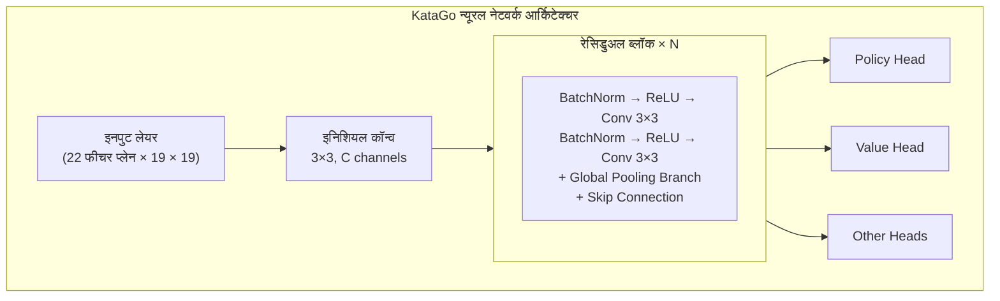
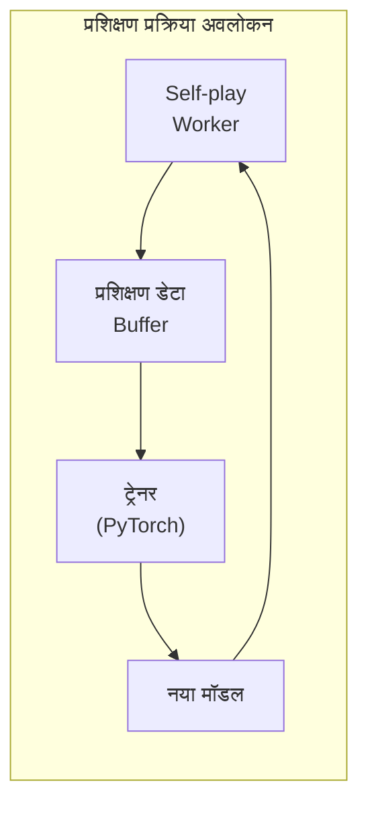

# KataGo सोर्स कोड आर्किटेक्चर

यह लेख KataGo के सोर्स कोड संरचना का गहन विश्लेषण करता है, आंतरिक कार्यान्वयन समझने में मदद करता है। चाहे आप कोड योगदान करना चाहते हों, सुविधाएं संशोधित करना चाहते हों, या इसकी तकनीक अपने प्रोजेक्ट में लागू करना चाहते हों, यह आवश्यक संदर्भ सामग्री है।

## प्रोजेक्ट डायरेक्टरी संरचना

```
KataGo/
├── cpp/                    # C++ कोर कोड
│   ├── main.cpp           # मुख्य प्रोग्राम एंट्री
│   ├── command/           # विभिन्न एक्ज़ीक्यूशन मोड
│   ├── core/              # कोर यूटिलिटी क्लास
│   ├── game/              # गो नियम और बोर्ड
│   ├── search/            # MCTS सर्च इंजन
│   ├── neuralnet/         # न्यूरल नेटवर्क इंटरफेस
│   ├── dataio/            # डेटा I/O
│   ├── configs/           # कॉन्फ़िग उदाहरण
│   └── tests/             # यूनिट टेस्ट
├── python/                 # Python प्रशिक्षण कोड
│   ├── train.py           # प्रशिक्षण मुख्य प्रोग्राम
│   ├── model.py           # मॉडल परिभाषा
│   ├── data_processing_pytorch.py
│   └── configs/           # प्रशिक्षण कॉन्फ़िग
├── docs/                   # दस्तावेज़
└── scripts/               # सहायक स्क्रिप्ट
```

### cpp/ डायरेक्टरी विस्तार

```
cpp/
├── main.cpp                # प्रोग्राम एंट्री, कमांड लाइन पार्सिंग
├── command/
│   ├── gtp.cpp            # GTP प्रोटोकॉल कार्यान्वयन
│   ├── analysis.cpp       # Analysis Engine कार्यान्वयन
│   ├── benchmark.cpp      # बेंचमार्क
│   ├── genconfig.cpp      # कॉन्फ़िग जनरेशन
│   └── selfplay.cpp       # स्व-खेल
├── core/
│   ├── global.h           # ग्लोबल कॉन्स्टेंट और सेटिंग
│   ├── hash.h             # Zobrist हैश
│   ├── rand.h             # रैंडम नंबर जनरेशन
│   ├── logger.h           # लॉगिंग सिस्टम
│   ├── config_parser.h    # कॉन्फ़िग पार्सिंग
│   └── threadsafe*.h      # थ्रेड-सेफ यूटिलिटी
├── game/
│   ├── board.h/cpp        # बोर्ड रिप्रेजेंटेशन और बुनियादी ऑपरेशन
│   ├── rules.h/cpp        # गो नियम
│   ├── boardhistory.h/cpp # गेम हिस्ट्री
│   └── graphhash.h/cpp    # पोजीशन हैश
├── search/
│   ├── search.h/cpp       # सर्च इंजन मुख्य क्लास
│   ├── searchnode.h/cpp   # सर्च ट्री नोड
│   ├── searchparams.h     # सर्च पैरामीटर
│   ├── mutexpool.h        # लॉक पूल
│   ├── searchresults.h    # सर्च परिणाम
│   └── asyncbot.h/cpp     # एसिंक्रोनस बॉट
├── neuralnet/
│   ├── nninputs.h/cpp     # न्यूरल नेटवर्क इनपुट फीचर
│   ├── nneval.h/cpp       # न्यूरल नेटवर्क इवैल्यूएशन
│   ├── nninterface.h      # बैकएंड एब्स्ट्रैक्ट इंटरफेस
│   ├── cudabackend.cpp    # CUDA बैकएंड
│   ├── openclbackend.cpp  # OpenCL बैकएंड
│   ├── eigenbackend.cpp   # Eigen(CPU) बैकएंड
│   └── modelversion.h     # मॉडल वर्जन मैनेजमेंट
└── dataio/
    ├── sgf.h/cpp          # SGF फ़ाइल प्रोसेसिंग
    ├── numpywrite.h/cpp   # NumPy फॉर्मेट आउटपुट
    └── trainingwrite.h/cpp # प्रशिक्षण डेटा लेखन
```

## न्यूरल नेटवर्क आर्किटेक्चर

### नेटवर्क संरचना अवलोकन



### इनपुट फीचर (nninputs.cpp)

KataGo 22 फीचर प्लेन इनपुट के रूप में उपयोग करता है:

```cpp
// मुख्य इनपुट फीचर श्रेणियां
enum {
  // बोर्ड स्थिति
  INPUT_FEATURE_STONE_OUR,      // हमारे पत्थर
  INPUT_FEATURE_STONE_OPP,      // प्रतिद्वंद्वी के पत्थर

  // लिबर्टी संबंधित (1-8 लिबर्टी)
  INPUT_FEATURE_LIBERTIES_1,
  INPUT_FEATURE_LIBERTIES_2,
  // ...
  INPUT_FEATURE_LIBERTIES_8_OR_MORE,

  // हिस्ट्री स्थिति
  INPUT_FEATURE_LAST_MOVE,      // पिछली चाल स्थिति
  INPUT_FEATURE_SECOND_LAST_MOVE,

  // नियम संबंधित
  INPUT_FEATURE_KOMI,           // कोमी
  INPUT_FEATURE_RULES,          // नियम एनकोडिंग
  // ...
};
```

### ग्लोबल पूलिंग ब्रांच

KataGo का एक नवाचार रेसिडुअल ब्लॉक में ग्लोबल पूलिंग जोड़ना है:

```cpp
// सरलीकृत ग्लोबल पूलिंग कार्यान्वयन अवधारणा
class GlobalPoolingResBlock {
public:
  void forward(Tensor& x) {
    // मानक रेसिडुअल पथ
    Tensor regular_out = regular_conv_path(x);

    // ग्लोबल पूलिंग पथ
    Tensor global_mean = global_avg_pool(x);  // [batch, C]
    Tensor global_max = global_max_pool(x);    // [batch, C]
    Tensor global_features = concat(global_mean, global_max);

    // ग्लोबल फीचर प्रोसेस
    global_features = dense_layer(global_features);  // [batch, C]

    // स्पेशल डायमेंशन में ब्रॉडकास्ट और रेगुलर पथ के साथ मर्ज
    Tensor global_broadcast = broadcast_to_spatial(global_features);
    x = regular_out + global_broadcast;
  }
};
```

### आउटपुट हेड

```cpp
// Policy Head: चाल प्रोबेबिलिटी भविष्यवाणी
class PolicyHead {
  // आउटपुट: 19×19+1 (pass सहित)
  // softmax नॉर्मलाइजेशन उपयोग
};

// Value Head: जीत/हार भविष्यवाणी
class ValueHead {
  // आउटपुट: 3 (जीत/हार/ड्रॉ प्रोबेबिलिटी)
  // softmax नॉर्मलाइजेशन उपयोग
};

// Score Head: अंक भविष्यवाणी
class ScoreHead {
  // आउटपुट: सतत मान (अपेक्षित अंक अंतर)
};

// Ownership Head: क्षेत्र भविष्यवाणी
class OwnershipHead {
  // आउटपुट: 19×19 (प्रत्येक बिंदु स्वामित्व, tanh)
};
```

## सर्च इंजन कार्यान्वयन

### MCTS कोर क्लास

```cpp
// search/search.h
class Search {
public:
  // खोज निष्पादित करें
  void runWholeSearch(Player pla);

  // सर्वोत्तम चाल प्राप्त करें
  Loc getBestMove();

  // विश्लेषण परिणाम प्राप्त करें
  AnalysisData getAnalysisData();

private:
  SearchParams params;          // सर्च पैरामीटर
  SearchNode* rootNode;         // रूट नोड
  NNEvaluator* nnEval;         // न्यूरल नेटवर्क इवैल्यूएटर
  std::mutex* mutexPool;       // लॉक पूल
};
```

### सर्च नोड संरचना

```cpp
// search/searchnode.h
struct SearchNode {
  // नोड स्टैटिस्टिक्स
  std::atomic<int64_t> visits;           // विज़िट संख्या
  std::atomic<double> valueSumWeight;    // वैल्यू संचयी वेट
  std::atomic<double> valueSum;          // वैल्यू संचयी योग

  // चाइल्ड नोड
  std::atomic<int> numChildren;
  SearchChildPointer* children;          // चाइल्ड नोड पॉइंटर एरे

  // न्यूरल नेटवर्क आउटपुट कैश
  std::shared_ptr<NNOutput> nnOutput;
};

struct SearchChildPointer {
  Loc moveLoc;                           // चाल स्थिति
  std::atomic<SearchNode*> node;         // चाइल्ड नोड पॉइंटर
  std::atomic<int64_t> edgeVisits;       // एज विज़िट संख्या
};
```

### PUCT चयन एल्गोरिदम

```cpp
// एक्सप्लोर करने के लिए चाइल्ड नोड चुनें
int Search::selectChildToDescend(SearchNode* node, Player pla) {
  int bestIdx = -1;
  double bestValue = -1e100;

  for (int i = 0; i < node->numChildren; i++) {
    SearchChildPointer& child = node->children[i];

    // Q मान गणना (exploitation)
    double q = getChildQ(child);

    // U मान गणना (exploration)
    double prior = getPrior(node, child.moveLoc);
    double parentVisits = node->visits.load();
    double childVisits = child.edgeVisits.load();

    double u = params.cpuctExploration * prior *
               sqrt(parentVisits) / (1.0 + childVisits);

    // PUCT सूत्र
    double value = q + u;

    if (value > bestValue) {
      bestValue = value;
      bestIdx = i;
    }
  }

  return bestIdx;
}
```

### पैरलल सर्च कार्यान्वयन

```cpp
void Search::runWholeSearch(Player pla) {
  // मल्टीपल सर्च थ्रेड शुरू करें
  std::vector<std::thread> threads;
  for (int i = 0; i < params.numSearchThreads; i++) {
    threads.emplace_back([this, pla]() {
      runSingleSearchThread(pla);
    });
  }

  // सभी थ्रेड पूरा होने की प्रतीक्षा
  for (auto& t : threads) {
    t.join();
  }
}

void Search::runSingleSearchThread(Player pla) {
  while (!shouldStop()) {
    // पथ चुनें
    std::vector<SearchNode*> path;
    SearchNode* leaf = selectAndDescend(rootNode, path);

    // नोड एक्सपैंड करें
    expandNode(leaf);

    // न्यूरल नेटवर्क इवैल्यूएशन
    NNOutput output = nnEval->evaluate(leaf->board);

    // वैल्यू वापस प्रसारित करें
    backpropagateValue(path, output.value);
  }
}
```

### वर्चुअल लॉस

पैरलल सर्च में मल्टी-थ्रेड समान पथ चुनने से बचने के लिए:

```cpp
void Search::applyVirtualLoss(SearchNode* node) {
  // इस नोड के मूल्यांकन मान को अस्थायी रूप से कम करें
  // ताकि अन्य थ्रेड अलग पथ चुनें
  node->virtualLoss.fetch_add(1);
}

void Search::removeVirtualLoss(SearchNode* node) {
  node->virtualLoss.fetch_sub(1);
}
```

## प्रशिक्षण प्रक्रिया अवलोकन

### प्रशिक्षण डेटा जनरेशन



### स्व-खेल (cpp/command/selfplay.cpp)

```cpp
// Self-play मुख्य लूप
void runSelfPlayLoop() {
  while (true) {
    // नवीनतम मॉडल लोड करें
    loadLatestModel();

    // एक गेम खेलें
    GameData gameData = playSingleGame();

    // प्रशिक्षण डेटा सेव करें
    writeTrainingData(gameData);
  }
}

GameData playSingleGame() {
  Board board;
  BoardHistory history;
  GameData gameData;

  while (!history.isGameOver()) {
    // MCTS से चाल चुनें
    Search search(board, history, params);
    search.runWholeSearch(history.currentPla);

    // MCTS परिणाम प्रशिक्षण लक्ष्य के रूप में
    MoveData moveData;
    moveData.policyTarget = search.getPolicyDistribution();
    moveData.valueTarget = search.getValue();

    // चाल निष्पादित करें
    Loc move = search.sampleMove();
    board.playMove(move, history.currentPla);

    gameData.moves.push_back(moveData);
  }

  // अंतिम परिणाम भरें
  gameData.finalScore = history.finalScore();
  return gameData;
}
```

### प्रशिक्षण डेटा फॉर्मेट

```cpp
// dataio/trainingwrite.h
struct TrainingRow {
  // इनपुट फीचर
  float inputFeatures[NUM_FEATURES][BOARD_SIZE][BOARD_SIZE];

  // प्रशिक्षण लक्ष्य
  float policyTarget[BOARD_SIZE * BOARD_SIZE + 1];  // pass सहित
  float valueTarget[3];                              // जीत/हार/ड्रॉ
  float scoreTarget;                                 // अंक
  float ownershipTarget[BOARD_SIZE][BOARD_SIZE];    // क्षेत्र

  // मेटाडेटा
  int turn;
  int rules;
  float komi;
};
```

### Python प्रशिक्षण प्रोग्राम (python/train.py)

```python
# प्रशिक्षण मुख्य लूप (सरलीकृत)
def train():
    model = KataGoModel(config)
    optimizer = torch.optim.SGD(model.parameters(), lr=config.lr)

    for epoch in range(config.num_epochs):
        for batch in data_loader:
            # फॉरवर्ड पास
            policy_pred, value_pred, score_pred, ownership_pred = model(batch.input)

            # लॉस गणना
            policy_loss = cross_entropy(policy_pred, batch.policy_target)
            value_loss = cross_entropy(value_pred, batch.value_target)
            score_loss = mse_loss(score_pred, batch.score_target)
            ownership_loss = mse_loss(ownership_pred, batch.ownership_target)

            # कुल लॉस (भारित योग)
            total_loss = (
                policy_loss +
                config.value_weight * value_loss +
                config.score_weight * score_loss +
                config.ownership_weight * ownership_loss
            )

            # बैकवर्ड पास
            optimizer.zero_grad()
            total_loss.backward()
            optimizer.step()

        # चेकपॉइंट सेव करें
        save_checkpoint(model, epoch)
```

### मॉडल परिभाषा (python/model.py)

```python
class KataGoModel(nn.Module):
    def __init__(self, config):
        super().__init__()

        # इनिशियल कॉन्वोल्यूशन
        self.initial_conv = nn.Conv2d(
            config.input_channels,
            config.trunk_channels,
            kernel_size=3, padding=1
        )

        # रेसिडुअल ब्लॉक
        self.blocks = nn.ModuleList([
            ResBlock(config.trunk_channels, use_global_pooling=True)
            for _ in range(config.num_blocks)
        ])

        # आउटपुट हेड
        self.policy_head = PolicyHead(config)
        self.value_head = ValueHead(config)
        self.score_head = ScoreHead(config)
        self.ownership_head = OwnershipHead(config)

    def forward(self, x):
        # ट्रंक नेटवर्क
        x = self.initial_conv(x)
        for block in self.blocks:
            x = block(x)

        # आउटपुट हेड
        policy = self.policy_head(x)
        value = self.value_head(x)
        score = self.score_head(x)
        ownership = self.ownership_head(x)

        return policy, value, score, ownership
```

## मुख्य डेटा संरचनाएं

### Board (game/board.h)

```cpp
class Board {
public:
  // बोर्ड स्थिति
  Color stones[MAX_BOARD_AREA];    // प्रत्येक बिंदु का रंग
  Chain chains[MAX_BOARD_AREA];    // चेन जानकारी

  // को
  Loc koLoc;

  // चाल निष्पादित करें
  void playMove(Loc loc, Color pla);

  // वैधता जांच
  bool isLegal(Loc loc, Color pla) const;

  // लिबर्टी गणना
  int getLiberties(Loc loc) const;
};

struct Chain {
  int liberties;                   // लिबर्टी संख्या
  int numStones;                   // पत्थर संख्या
  Loc head;                        // लिंक्ड लिस्ट हेड
};
```

### BoardHistory (game/boardhistory.h)

```cpp
class BoardHistory {
public:
  std::vector<Board> boards;       // हिस्ट्री बोर्ड स्थिति
  std::vector<Move> moves;         // चाल हिस्ट्री
  Rules rules;                     // नियम
  Player currentPla;               // वर्तमान खिलाड़ी

  // गेम स्थिति
  bool isGameOver() const;
  float finalScore() const;
};
```

### NNOutput (neuralnet/nneval.h)

```cpp
struct NNOutput {
  // Policy
  float policyProbs[MAX_BOARD_AREA + 1];  // pass सहित

  // Value
  float whiteWinProb;
  float whiteLossProb;
  float noResultProb;

  // Score
  float whiteScoreMean;
  float whiteScoreStdev;

  // Ownership
  float ownership[MAX_BOARD_AREA];  // -1 से 1
};
```

## विकास और डीबगिंग

### डीबग संस्करण कंपाइल

```bash
cd cpp
mkdir build_debug && cd build_debug
cmake .. -DCMAKE_BUILD_TYPE=Debug -DUSE_BACKEND=OPENCL
make -j$(nproc)
```

### यूनिट टेस्ट चलाएं

```bash
./katago runtests
```

### सामान्य डीबगिंग विधियां

```cpp
// 1. लॉगिंग उपयोग करें
#include "core/logger.h"
Logger::log("Debug message", value);

// 2. kata-debug-print GTP कमांड उपयोग करें
// विस्तृत सर्च जानकारी आउटपुट

// 3. कंपाइल समय sanitizers सक्षम करें
cmake .. -DCMAKE_CXX_FLAGS="-fsanitize=address"
```

### प्रदर्शन विश्लेषण

```bash
# perf उपयोग करें (Linux)
perf record ./katago benchmark -model model.bin.gz
perf report

# Instruments उपयोग करें (macOS)
instruments -t "Time Profiler" ./katago benchmark -model model.bin.gz
```

## आगे पढ़ें

- [KataGo GitHub](https://github.com/lightvector/KataGo)
- [KataGo पेपर](https://arxiv.org/abs/1902.10565)
- [KataGo Discord](https://discord.gg/bqkZAz3) - डेवलपर्स से बातचीत
- [KataGo Training](https://katagotraining.org/) - प्रशिक्षण प्रगति देखें

KataGo के सोर्स कोड आर्किटेक्चर समझने के बाद, आपके पास गहन अनुसंधान या ओपन-सोर्स प्रोजेक्ट में योगदान की क्षमता है। यदि आप आगे जानना चाहते हैं, KataGo का GitHub सोर्स कोड सीधे पढ़ने और समुदाय चर्चा में भाग लेने की सिफारिश है।
