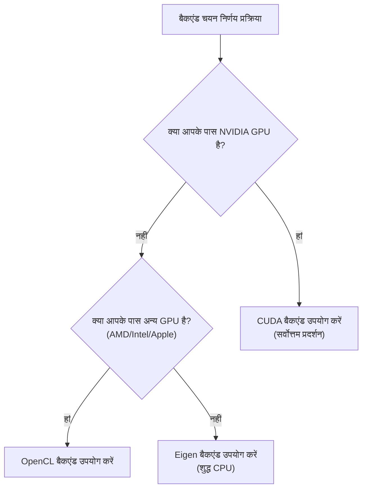

# KataGo इंस्टॉलेशन और सेटअप

यह लेख विभिन्न प्लेटफॉर्म पर KataGo इंस्टॉल करने का विस्तृत विवरण देता है, जिसमें सिस्टम आवश्यकताएं, इंस्टॉलेशन चरण, मॉडल चयन और कॉन्फ़िगरेशन फ़ाइल विवरण शामिल हैं।

## सिस्टम आवश्यकताएं

### हार्डवेयर आवश्यकताएं

#### GPU (अनुशंसित)

| GPU प्रकार | समर्थन स्थिति | अनुशंसित बैकएंड |
|---------|---------|---------|
| NVIDIA (CUDA) | सर्वोत्तम समर्थन | CUDA |
| NVIDIA (CUDA नहीं) | अच्छा समर्थन | OpenCL |
| AMD | अच्छा समर्थन | OpenCL |
| Intel इंटीग्रेटेड | बुनियादी समर्थन | OpenCL |
| Apple Silicon | अच्छा समर्थन | Metal / OpenCL |

#### CPU मोड

यदि उपयुक्त GPU नहीं है, Eigen बैकएंड से शुद्ध CPU चला सकते हैं:
- कम प्रदर्शन (लगभग 10-30 playouts/sec)
- सीखने, परीक्षण और कम तीव्रता उपयोग के लिए उपयुक्त
- AVX2 इंस्ट्रक्शन सेट समर्थन आवश्यक (अधिकांश आधुनिक CPU समर्थित)

### सॉफ्टवेयर आवश्यकताएं

| ऑपरेटिंग सिस्टम | संस्करण आवश्यकता |
|---------|---------|
| **Linux** | Ubuntu 18.04+, CentOS 7+ या अन्य आधुनिक डिस्ट्रो |
| **macOS** | 10.14+ (Mojave या नया) |
| **Windows** | Windows 10 या नया |

### बैकएंड चयन गाइड



## macOS इंस्टॉलेशन

### विधि 1: Homebrew (अनुशंसित)

सबसे सरल इंस्टॉलेशन विधि, सभी डिपेंडेंसी स्वचालित रूप से संभालती है।

```bash
# KataGo इंस्टॉल
brew install katago

# इंस्टॉलेशन सत्यापित
katago version
```

Homebrew संस्करण डिफ़ॉल्ट रूप से OpenCL बैकएंड उपयोग करता है, Intel Mac और Apple Silicon दोनों पर चलता है।

### विधि 2: सोर्स से कंपाइल

कस्टम विकल्प या नवीनतम सुविधाएं चाहने वालों के लिए उपयुक्त।

#### डिपेंडेंसी इंस्टॉल

```bash
# CMake और कंपाइल टूल्स इंस्टॉल
brew install cmake

# OpenCL के लिए
# macOS में OpenCL बिल्ट-इन है, अतिरिक्त इंस्टॉलेशन नहीं
```

#### कंपाइल चरण

```bash
# सोर्स क्लोन
git clone https://github.com/lightvector/KataGo.git
cd KataGo/cpp

# बिल्ड डायरेक्टरी बनाएं
mkdir build && cd build

# कंपाइल विकल्प सेट करें (OpenCL बैकएंड)
cmake .. -DUSE_BACKEND=OPENCL

# कंपाइल
make -j$(sysctl -n hw.ncpu)

# कंपाइल पूर्ण, एक्ज़ीक्यूटेबल build/katago में है
./katago version
```

#### Apple Silicon विशेष निर्देश

M1/M2/M3 Mac पर, OpenCL या Metal बैकएंड अनुशंसित:

```bash
# OpenCL बैकएंड (अनुशंसित, बेहतर संगतता)
cmake .. -DUSE_BACKEND=OPENCL

# Metal बैकएंड (प्रयोगात्मक, संभवतः बेहतर प्रदर्शन)
cmake .. -DUSE_BACKEND=METAL
```

## Linux इंस्टॉलेशन

### विधि 1: प्री-कंपाइल्ड संस्करण (अनुशंसित)

GitHub Releases से प्री-कंपाइल्ड संस्करण डाउनलोड करें:

```bash
# OpenCL संस्करण डाउनलोड (अधिकांश के लिए उपयुक्त)
wget https://github.com/lightvector/KataGo/releases/download/v1.15.3/katago-v1.15.3-opencl-linux-x64.zip

# या CUDA संस्करण डाउनलोड (NVIDIA GPU)
wget https://github.com/lightvector/KataGo/releases/download/v1.15.3/katago-v1.15.3-cuda11.1-linux-x64.zip

# अनज़िप
unzip katago-v1.15.3-*.zip

# एक्ज़ीक्यूट परमिशन दें
chmod +x katago

# इंस्टॉलेशन सत्यापित
./katago version
```

### विधि 2: सोर्स से कंपाइल

#### CUDA बैकएंड (NVIDIA GPU)

```bash
# डिपेंडेंसी इंस्टॉल
sudo apt update
sudo apt install cmake g++ libzip-dev

# CUDA इंस्टॉल (यदि नहीं है)
# NVIDIA आधिकारिक गाइड देखें: https://developer.nvidia.com/cuda-downloads

# क्लोन और कंपाइल
git clone https://github.com/lightvector/KataGo.git
cd KataGo/cpp
mkdir build && cd build

# CUDA बैकएंड सेट करें
cmake .. -DUSE_BACKEND=CUDA

# कंपाइल
make -j$(nproc)
```

#### OpenCL बैकएंड (सामान्य GPU)

```bash
# डिपेंडेंसी इंस्टॉल
sudo apt update
sudo apt install cmake g++ libzip-dev ocl-icd-opencl-dev

# OpenCL ड्राइवर इंस्टॉल
# NVIDIA: CUDA के साथ आता है
# AMD: sudo apt install mesa-opencl-icd
# Intel: sudo apt install intel-opencl-icd

# क्लोन और कंपाइल
git clone https://github.com/lightvector/KataGo.git
cd KataGo/cpp
mkdir build && cd build

cmake .. -DUSE_BACKEND=OPENCL
make -j$(nproc)
```

#### Eigen बैकएंड (शुद्ध CPU)

```bash
# डिपेंडेंसी इंस्टॉल
sudo apt update
sudo apt install cmake g++ libzip-dev libeigen3-dev

# क्लोन और कंपाइल
git clone https://github.com/lightvector/KataGo.git
cd KataGo/cpp
mkdir build && cd build

cmake .. -DUSE_BACKEND=EIGEN
make -j$(nproc)
```

## Windows इंस्टॉलेशन

### विधि 1: प्री-कंपाइल्ड संस्करण (अनुशंसित)

1. [KataGo Releases](https://github.com/lightvector/KataGo/releases) पर जाएं
2. उपयुक्त संस्करण डाउनलोड करें:
   - `katago-v1.15.3-cuda11.1-windows-x64.zip` (NVIDIA GPU + CUDA)
   - `katago-v1.15.3-opencl-windows-x64.zip` (अन्य GPU)
   - `katago-v1.15.3-eigen-windows-x64.zip` (शुद्ध CPU)
3. निर्दिष्ट डायरेक्टरी में अनज़िप करें
4. कमांड प्रॉम्प्ट में टेस्ट करें:

```cmd
cd C:\path\to\katago
katago.exe version
```

### विधि 2: सोर्स से कंपाइल

#### वातावरण तैयारी

1. [Visual Studio 2019/2022](https://visualstudio.microsoft.com/) इंस्टॉल करें (C++ टूल्स सहित)
2. [CMake](https://cmake.org/download/) इंस्टॉल करें
3. CUDA उपयोग करने पर, [CUDA Toolkit](https://developer.nvidia.com/cuda-toolkit) इंस्टॉल करें

#### कंपाइल चरण

```cmd
# Developer Command Prompt में चलाएं

git clone https://github.com/lightvector/KataGo.git
cd KataGo\cpp
mkdir build
cd build

# CUDA बैकएंड
cmake .. -G "Visual Studio 17 2022" -A x64 -DUSE_BACKEND=CUDA

# या OpenCL बैकएंड
cmake .. -G "Visual Studio 17 2022" -A x64 -DUSE_BACKEND=OPENCL

# कंपाइल
cmake --build . --config Release
```

## मॉडल डाउनलोड और चयन

KataGo को चलाने के लिए न्यूरल नेटवर्क मॉडल फ़ाइल आवश्यक है। आधिकारिक रूप से विभिन्न आकार के मॉडल उपलब्ध हैं।

### डाउनलोड स्थान

आधिकारिक मॉडल डाउनलोड पेज: https://katagotraining.org/

या सीधे प्रशिक्षण सर्वर से डाउनलोड:

```bash
# छोटा मॉडल (परीक्षण और कमज़ोर हार्डवेयर के लिए)
curl -L -o kata-b18c384.bin.gz \
  "https://media.katagotraining.org/uploaded/networks/models/kata1/kata1-b18c384nbt-s9996604416-d4316597426.bin.gz"

# मध्यम मॉडल (अनुशंसित, प्रदर्शन और गति में संतुलन)
curl -L -o kata-b40c256.bin.gz \
  "https://media.katagotraining.org/uploaded/networks/models/kata1/kata1-b40c256-s11840935168-d2898845681.bin.gz"

# बड़ा मॉडल (सबसे मजबूत, शक्तिशाली GPU आवश्यक)
curl -L -o kata-b60c320.bin.gz \
  "https://media.katagotraining.org/uploaded/networks/models/kata1/kata1-b60c320-s11318001920-d2792783831.bin.gz"
```

### मॉडल तुलना

| मॉडल | नेटवर्क आकार | फ़ाइल आकार | ताकत | उपयुक्त परिदृश्य |
|------|---------|---------|------|---------|
| b10c128 | 10 blocks, 128 channels | ~20 MB | शौकिया उच्च डान | CPU, कमज़ोर GPU, त्वरित परीक्षण |
| b18c384 | 18 blocks, 384 channels | ~140 MB | पेशेवर स्तर | सामान्य GPU, दैनिक विश्लेषण |
| b40c256 | 40 blocks, 256 channels | ~250 MB | सुपरह्यूमन स्तर | मध्य-उच्च GPU, गहन विश्लेषण |
| b60c320 | 60 blocks, 320 channels | ~500 MB | शीर्ष सुपरह्यूमन | उच्च GPU, शीर्ष विश्लेषण |

### चयन सुझाव

```
आपका GPU क्या है?
├─ RTX 3080/4080/4090 → b60c320 या b40c256
├─ RTX 3060/3070 → b40c256 या b18c384
├─ GTX 1660/2060 → b18c384
├─ एंट्री-लेवल GPU → b18c384 या b10c128
└─ शुद्ध CPU → b10c128
```

## बुनियादी कॉन्फ़िगरेशन फ़ाइल विवरण

KataGo `.cfg` फॉर्मेट कॉन्फ़िगरेशन फ़ाइल उपयोग करता है। आधिकारिक उदाहरण `cpp/configs/` डायरेक्टरी में हैं।

### महत्वपूर्ण कॉन्फ़िगरेशन फ़ाइलें

| फ़ाइल | उपयोग |
|------|------|
| `gtp_example.cfg` | GTP मोड उदाहरण कॉन्फ़िग |
| `analysis_example.cfg` | Analysis Engine उदाहरण कॉन्फ़िग |
| `default_gtp.cfg` | GTP मोड डिफ़ॉल्ट कॉन्फ़िग |

### मुख्य कॉन्फ़िगरेशन आइटम

```ini
# =============
# न्यूरल नेटवर्क सेटिंग
# =============

# न्यूरल नेटवर्क मॉडल फ़ाइल पथ
# रिलेटिव या एब्सोल्यूट पथ उपयोग कर सकते हैं
# model = /path/to/model.bin.gz

# =============
# खोज सेटिंग
# =============

# प्रति चाल अधिकतम खोज विज़िट
# बढ़ाने से ताकत बढ़ती है लेकिन धीमा होता है
maxVisits = 500

# प्रति चाल अधिकतम सोचने का समय (सेकंड)
# 0 = असीमित (maxVisits द्वारा नियंत्रित)
maxTime = 0

# प्रति चाल उपयोग किए जाने वाले थ्रेड्स की संख्या
numSearchThreads = 6

# =============
# नियम सेटिंग
# =============

# गो नियम
# chinese = चीनी नियम
# japanese = जापानी नियम
# korean = कोरियाई नियम
# tromp-taylor = Tromp-Taylor नियम
# aga = AGA नियम
rules = chinese

# कोमी
komi = 7.5

# =============
# GPU सेटिंग
# =============

# उपयोग किए जाने वाले GPU नंबर (0 से शुरू)
# मल्टी-GPU कॉमा से अलग: 0,1,2
# -1 = स्वचालित चयन
nnDeviceIdxs = 0

# प्रति GPU थ्रेड का बैच साइज़
# बड़ा बैच GPU उपयोग बढ़ा सकता है
numNNServerThreadsPerModel = 1

# =============
# एडवांस्ड सेटिंग
# =============

# MCTS एक्सप्लोरेशन कॉन्स्टेंट
# बड़ा मान एक्सप्लोरेशन बढ़ाता है, छोटा मान एक्सप्लॉइटेशन
cpuctExploration = 1.0

# रूट नोड Dirichlet नॉइज़
# एक्सप्लोरेशन विविधता बढ़ाने के लिए
rootNoiseEnabled = true
rootDirichletNoisePruneFactor = 0.25
```

### GTP मोड कॉन्फ़िग उदाहरण

`my_gtp_config.cfg` बनाएं:

```ini
# मॉडल पथ
# model आमतौर पर कमांड लाइन पर निर्दिष्ट, यहां छोड़ सकते हैं

# खोज सेटिंग
maxVisits = 1000
numSearchThreads = 4

# नियम
rules = chinese
komi = 7.5

# GPU सेटिंग
nnDeviceIdxs = 0

# लॉग
logDir = ./logs
logToStderr = false
```

### Analysis Engine कॉन्फ़िग उदाहरण

`my_analysis_config.cfg` बनाएं:

```ini
# खोज सेटिंग
maxVisits = 500
numSearchThreads = 8

# रिपोर्ट सेटिंग
# प्रति विश्लेषण अधिकतम वेरिएशन संख्या
maxMoves = 10

# नियम (API कॉल में ओवरराइड हो सकते हैं)
rules = chinese
komi = 7.5

# GPU सेटिंग
nnDeviceIdxs = 0
numNNServerThreadsPerModel = 2

# विश्लेषण सुविधाएं
reportAnalysisWinratesAs = BLACK

# ओनरशिप मैप
# सक्षम करने पर प्रत्येक बिंदु का स्वामित्व भविष्यवाणी मिलती है
analysisOwnership = true
```

## पहली बार चलाना

### GTP मोड टेस्ट

```bash
# GTP मोड चलाएं
katago gtp -model /path/to/model.bin.gz -config /path/to/config.cfg

# config नहीं होने पर, KataGo डिफ़ॉल्ट मान उपयोग करेगा
katago gtp -model /path/to/model.bin.gz
```

सफल शुरुआत के बाद, GTP कमांड से टेस्ट करें:

```
name
= KataGo

version
= 1.15.3

boardsize 19
=

genmove black
= Q16

quit
=
```

### Analysis Engine टेस्ट

```bash
# Analysis Engine चलाएं
katago analysis -model /path/to/model.bin.gz -config /path/to/config.cfg
```

JSON क्वेरी इनपुट करें:

```json
{"id":"test1","initialStones":[],"moves":[],"rules":"chinese","komi":7.5,"boardXSize":19,"boardYSize":19,"analyzeTurns":[0]}
```

### बेंचमार्क टेस्ट

अपने हार्डवेयर प्रदर्शन टेस्ट करें:

```bash
# बेंचमार्क चलाएं
katago benchmark -model /path/to/model.bin.gz

# कॉन्फ़िग निर्दिष्ट करें
katago benchmark -model /path/to/model.bin.gz -config /path/to/config.cfg
```

बेंचमार्क आउटपुट करता है:
- प्रति सेकंड खोज विज़िट (visits/sec)
- न्यूरल नेटवर्क इंफरेंस स्पीड
- अनुशंसित थ्रेड सेटिंग

## सामान्य समस्या समाधान

### GPU संबंधित

**समस्या: GPU नहीं मिला**

```bash
# OpenCL डिवाइस जांचें
clinfo

# या KataGo को दिखने वाले डिवाइस सूचीबद्ध करें
katago gpuinfo
```

**समस्या: CUDA इनिशियलाइजेशन विफल**

- CUDA संस्करण और KataGo कंपाइल संस्करण मेल खाते हैं, सुनिश्चित करें
- GPU ड्राइवर अपडेट करें
- CUDA_PATH एनवायरनमेंट वेरिएबल जांचें

### मेमोरी संबंधित

**समस्या: मेमोरी अपर्याप्त**

```ini
# GPU मेमोरी उपयोग कम करें
nnMaxBatchSize = 8  # डिफ़ॉल्ट 16 या अधिक हो सकता है
nnCacheSizePowerOfTwo = 20  # कैश साइज़ कम करें
```

### प्रदर्शन संबंधित

**समस्या: बहुत धीमा**

1. GPU उपयोग हो रहा है, CPU नहीं, सुनिश्चित करें
2. `numSearchThreads` कम करें
3. छोटा मॉडल उपयोग करें
4. अन्य प्रोग्राम GPU उपयोग कर रहे हैं, जांचें

## अगला कदम

सेटअप पूर्ण होने के बाद, आगे पढ़ें:
- [सामान्य कमांड](./commands.md) - KataGo उपयोग करना सीखें
- [सोर्स कोड आर्किटेक्चर](./architecture.md) - आंतरिक कार्यान्वयन समझें
