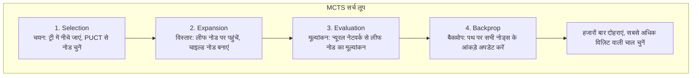

# MCTS कार्यान्वयन विवरण

यह लेख KataGo में मोंटे कार्लो ट्री सर्च (MCTS) के कार्यान्वयन विवरण की गहन व्याख्या करता है, जिसमें डेटा संरचनाएं, चयन रणनीतियाँ और पैरेललाइज़ेशन तकनीकें शामिल हैं।

---

## MCTS चार चरण समीक्षा



---

## नोड डेटा संरचना

### मूल डेटा

प्रत्येक MCTS नोड को स्टोर करना होगा:

```python
class MCTSNode:
    def __init__(self, state, parent=None, prior=0.0):
        # मूल जानकारी
        self.state = state              # बोर्ड स्थिति
        self.parent = parent            # पैरेंट नोड
        self.children = {}              # चाइल्ड नोड डिक्शनरी {action: node}
        self.action = None              # इस नोड तक पहुंचने की चाल

        # सांख्यिकीय जानकारी
        self.visit_count = 0            # N(s): विज़िट काउंट
        self.value_sum = 0.0            # W(s): मूल्य योग
        self.prior = prior              # P(s,a): प्रायर प्रायिकता

        # पैरेलल सर्च के लिए
        self.virtual_loss = 0           # वर्चुअल लॉस
        self.is_expanded = False        # विस्तारित है या नहीं

    @property
    def value(self):
        """Q(s) = W(s) / N(s)"""
        if self.visit_count == 0:
            return 0.0
        return self.value_sum / self.visit_count
```

### मेमोरी ऑप्टिमाइज़ेशन

KataGo मेमोरी उपयोग कम करने के लिए कई तकनीकों का उपयोग करता है:

```python
# Python dict के बजाय numpy array का उपयोग
class OptimizedNode:
    __slots__ = ['visit_count', 'value_sum', 'prior', 'children_indices']

    def __init__(self):
        self.visit_count = np.int32(0)
        self.value_sum = np.float32(0.0)
        self.prior = np.float32(0.0)
        self.children_indices = None  # विलंबित आवंटन
```

---

## Selection: PUCT चयन

### PUCT फॉर्मूला

```
चयन स्कोर = Q(s,a) + U(s,a)

जहाँ:
Q(s,a) = W(s,a) / N(s,a)              # औसत मूल्य
U(s,a) = c_puct × P(s,a) × √(N(s)) / (1 + N(s,a))  # अन्वेषण पद
```

### पैरामीटर विवरण

| प्रतीक | अर्थ | विशिष्ट मान |
|------|------|--------|
| Q(s,a) | चाल a का औसत मूल्य | [-1, +1] |
| P(s,a) | न्यूरल नेटवर्क की प्रायर प्रायिकता | [0, 1] |
| N(s) | पैरेंट नोड विज़िट काउंट | पूर्णांक |
| N(s,a) | चाल a का विज़िट काउंट | पूर्णांक |
| c_puct | अन्वेषण स्थिरांक | 1.0 ~ 2.5 |

### कार्यान्वयन

```python
def select_child(self, c_puct=1.5):
    """PUCT स्कोर सबसे अधिक वाले चाइल्ड नोड का चयन करें"""
    best_score = -float('inf')
    best_action = None
    best_child = None

    # पैरेंट नोड विज़िट काउंट का वर्गमूल
    sqrt_parent_visits = math.sqrt(self.visit_count)

    for action, child in self.children.items():
        # Q मान (औसत मूल्य)
        if child.visit_count > 0:
            q_value = child.value_sum / child.visit_count
        else:
            q_value = 0.0

        # U मान (अन्वेषण पद)
        u_value = c_puct * child.prior * sqrt_parent_visits / (1 + child.visit_count)

        # कुल स्कोर
        score = q_value + u_value

        if score > best_score:
            best_score = score
            best_action = action
            best_child = child

    return best_action, best_child
```

### अन्वेषण vs उपयोग का संतुलन

```
प्रारंभिक: N(s,a) छोटा
├── U(s,a) बड़ा → अन्वेषण प्रमुख
└── उच्च प्रायर प्रायिकता वाली चालें पहले अन्वेषित

बाद में: N(s,a) बड़ा
├── U(s,a) छोटा → उपयोग प्रमुख
└── Q(s,a) प्रभावी, ज्ञात अच्छी चालें चुनें
```

---

## Expansion: नोड विस्तार

### विस्तार शर्तें

लीफ नोड पर पहुंचने पर, न्यूरल नेटवर्क से विस्तार करें:

```python
def expand(self, policy_probs, legal_moves):
    """नोड विस्तार करें, सभी वैध चालों के चाइल्ड नोड बनाएं"""
    for action in legal_moves:
        if action not in self.children:
            prior = policy_probs[action]  # न्यूरल नेटवर्क द्वारा पूर्वानुमानित प्रायिकता
            child_state = self.state.play(action)
            self.children[action] = MCTSNode(
                state=child_state,
                parent=self,
                prior=prior
            )

    self.is_expanded = True
```

### वैध चाल फ़िल्टरिंग

```python
def get_legal_moves(state):
    """सभी वैध चालें प्राप्त करें"""
    legal = []
    for i in range(361):
        x, y = i // 19, i % 19
        if state.is_legal(x, y):
            legal.append(i)

    # पास जोड़ें
    legal.append(361)

    return legal
```

---

## Evaluation: न्यूरल नेटवर्क मूल्यांकन

### एकल मूल्यांकन

```python
def evaluate(self, state):
    """न्यूरल नेटवर्क से स्थिति का मूल्यांकन करें"""
    # इनपुट फीचर्स एनकोड करें
    features = encode_state(state)  # (22, 19, 19)
    features = torch.tensor(features).unsqueeze(0)  # (1, 22, 19, 19)

    # न्यूरल नेटवर्क इन्फरेंस
    with torch.no_grad():
        output = self.network(features)

    policy = output['policy'][0].numpy()  # (362,)
    value = output['value'][0].item()     # स्केलर

    return policy, value
```

### बैच मूल्यांकन (मुख्य ऑप्टिमाइज़ेशन)

GPU बैच इन्फरेंस में सबसे कुशल है:

```python
class BatchedEvaluator:
    def __init__(self, network, batch_size=8):
        self.network = network
        self.batch_size = batch_size
        self.pending = []  # मूल्यांकन के लिए लंबित (state, callback) सूची

    def request_evaluation(self, state, callback):
        """मूल्यांकन अनुरोध, बैच पूर्ण होने पर स्वचालित निष्पादन"""
        self.pending.append((state, callback))

        if len(self.pending) >= self.batch_size:
            self.flush()

    def flush(self):
        """बैच मूल्यांकन निष्पादित करें"""
        if not self.pending:
            return

        # बैच इनपुट तैयार करें
        states = [s for s, _ in self.pending]
        features = torch.stack([encode_state(s) for s in states])

        # बैच इन्फरेंस
        with torch.no_grad():
            outputs = self.network(features)

        # परिणाम कॉलबैक करें
        for i, (_, callback) in enumerate(self.pending):
            policy = outputs['policy'][i].numpy()
            value = outputs['value'][i].item()
            callback(policy, value)

        self.pending.clear()
```

---

## Backpropagation: बैकप्रोप अपडेट

### मूल बैकप्रोप

```python
def backpropagate(self, value):
    """लीफ नोड से रूट नोड तक बैकप्रोप, सांख्यिकीय जानकारी अपडेट करें"""
    node = self

    while node is not None:
        node.visit_count += 1
        node.value_sum += value

        # वैकल्पिक दृष्टिकोण: प्रतिद्वंद्वी का मूल्य विपरीत है
        value = -value

        node = node.parent
```

### दृष्टिकोण बदलाव का महत्व

```
काले का दृष्टिकोण: value = +0.6 (काले के पक्ष में)

बैकप्रोप पथ:
लीफ नोड (काले की बारी): value_sum += +0.6
    ↑
पैरेंट नोड (सफेद की बारी): value_sum += -0.6  ← सफेद के लिए प्रतिकूल
    ↑
ग्रैंडपैरेंट नोड (काले की बारी): value_sum += +0.6
    ↑
...
```

---

## पैरेललाइज़ेशन: वर्चुअल लॉस

### समस्या

मल्टी-थ्रेड सर्च करते समय, सभी एक ही नोड चुन सकते हैं:

```
Thread 1: नोड A चुनें (Q=0.6, N=100)
Thread 2: नोड A चुनें (Q=0.6, N=100) ← दोहराव!
Thread 3: नोड A चुनें (Q=0.6, N=100) ← दोहराव!
```

### समाधान: वर्चुअल लॉस

नोड चुनते समय, पहले "वर्चुअल लॉस" जोड़ें, ताकि अन्य थ्रेड्स इसे न चुनें:

```python
VIRTUAL_LOSS = 3  # वर्चुअल लॉस मान

def select_with_virtual_loss(self):
    """वर्चुअल लॉस के साथ चयन"""
    action, child = self.select_child()

    # वर्चुअल लॉस जोड़ें
    child.visit_count += VIRTUAL_LOSS
    child.value_sum -= VIRTUAL_LOSS  # हारने का नाटक करें

    return action, child

def backpropagate_with_virtual_loss(self, value):
    """बैकप्रोप करते समय वर्चुअल लॉस हटाएं"""
    node = self

    while node is not None:
        # वर्चुअल लॉस हटाएं
        node.visit_count -= VIRTUAL_LOSS
        node.value_sum += VIRTUAL_LOSS

        # सामान्य अपडेट
        node.visit_count += 1
        node.value_sum += value

        value = -value
        node = node.parent
```

### प्रभाव

```
Thread 1: नोड A चुनें, वर्चुअल लॉस जोड़ें
         A का Q मान अस्थायी रूप से गिरता है

Thread 2: नोड B चुनें (क्योंकि A बुरा दिखता है)

Thread 3: नोड C चुनें

→ विभिन्न थ्रेड्स विभिन्न शाखाओं का अन्वेषण करते हैं, दक्षता बढ़ती है
```

---

## पूर्ण सर्च कार्यान्वयन

```python
class MCTS:
    def __init__(self, network, c_puct=1.5, num_simulations=800):
        self.network = network
        self.c_puct = c_puct
        self.num_simulations = num_simulations
        self.evaluator = BatchedEvaluator(network)

    def search(self, root_state):
        """MCTS सर्च निष्पादित करें"""
        root = MCTSNode(root_state)

        # रूट नोड विस्तार करें
        policy, value = self.evaluate(root_state)
        legal_moves = get_legal_moves(root_state)
        root.expand(policy, legal_moves)

        # सिमुलेशन निष्पादित करें
        for _ in range(self.num_simulations):
            node = root
            path = [node]

            # Selection: ट्री में नीचे जाएं
            while node.is_expanded and node.children:
                action, node = node.select_child(self.c_puct)
                path.append(node)

            # Expansion + Evaluation
            if not node.is_expanded:
                policy, value = self.evaluate(node.state)
                legal_moves = get_legal_moves(node.state)

                if legal_moves:
                    node.expand(policy, legal_moves)

            # Backpropagation
            for n in reversed(path):
                n.visit_count += 1
                n.value_sum += value
                value = -value

        # सबसे अधिक विज़िट वाली चाल चुनें
        best_action = max(root.children.items(),
                         key=lambda x: x[1].visit_count)[0]

        return best_action

    def evaluate(self, state):
        features = encode_state(state)
        features = torch.tensor(features).unsqueeze(0)

        with torch.no_grad():
            output = self.network(features)

        return output['policy'][0].numpy(), output['value'][0].item()
```

---

## उन्नत तकनीकें

### Dirichlet नॉइज़

प्रशिक्षण के दौरान रूट नोड पर नॉइज़ जोड़ें, अन्वेषण बढ़ाएं:

```python
def add_dirichlet_noise(root, alpha=0.03, epsilon=0.25):
    """रूट नोड पर Dirichlet नॉइज़ जोड़ें"""
    noise = np.random.dirichlet([alpha] * len(root.children))

    for i, child in enumerate(root.children.values()):
        child.prior = (1 - epsilon) * child.prior + epsilon * noise[i]
```

### तापमान पैरामीटर

चाल चयन की यादृच्छिकता को नियंत्रित करें:

```python
def select_action_with_temperature(root, temperature=1.0):
    """विज़िट काउंट और तापमान के अनुसार चाल चुनें"""
    visits = np.array([c.visit_count for c in root.children.values()])
    actions = list(root.children.keys())

    if temperature == 0:
        # लालची चयन
        return actions[np.argmax(visits)]
    else:
        # विज़िट काउंट के प्रायिकता वितरण के अनुसार चुनें
        probs = visits ** (1 / temperature)
        probs = probs / probs.sum()
        return np.random.choice(actions, p=probs)
```

### ट्री पुन: उपयोग

नई चाल पिछले सर्च ट्री का पुन: उपयोग कर सकती है:

```python
def reuse_tree(root, action):
    """सबट्री का पुन: उपयोग करें"""
    if action in root.children:
        new_root = root.children[action]
        new_root.parent = None
        return new_root
    else:
        return None  # नया ट्री बनाना होगा
```

---

## प्रदर्शन ऑप्टिमाइज़ेशन सारांश

| तकनीक | प्रभाव |
|------|------|
| **बैच मूल्यांकन** | GPU उपयोग 10% → 80%+ |
| **वर्चुअल लॉस** | मल्टी-थ्रेड दक्षता 3-5x वृद्धि |
| **ट्री पुन: उपयोग** | कोल्ड स्टार्ट कम, 30%+ गणना बचत |
| **मेमोरी पूल** | मेमोरी आवंटन ओवरहेड कम |

---

## आगे पढ़ें

- [न्यूरल नेटवर्क आर्किटेक्चर विस्तृत व्याख्या](../neural-network) — मूल्यांकन फंक्शन का स्रोत
- [GPU बैकएंड और अनुकूलन](../gpu-optimization) — बैच इन्फरेंस का हार्डवेयर ऑप्टिमाइज़ेशन
- [मुख्य पेपर गाइड](../papers) — PUCT फॉर्मूला का सैद्धांतिक आधार
