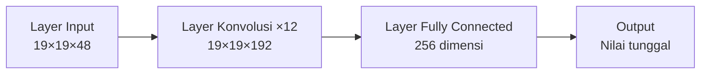
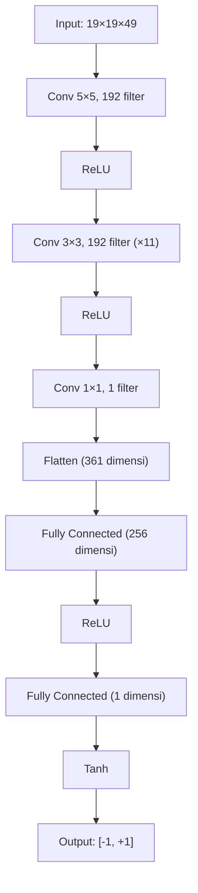
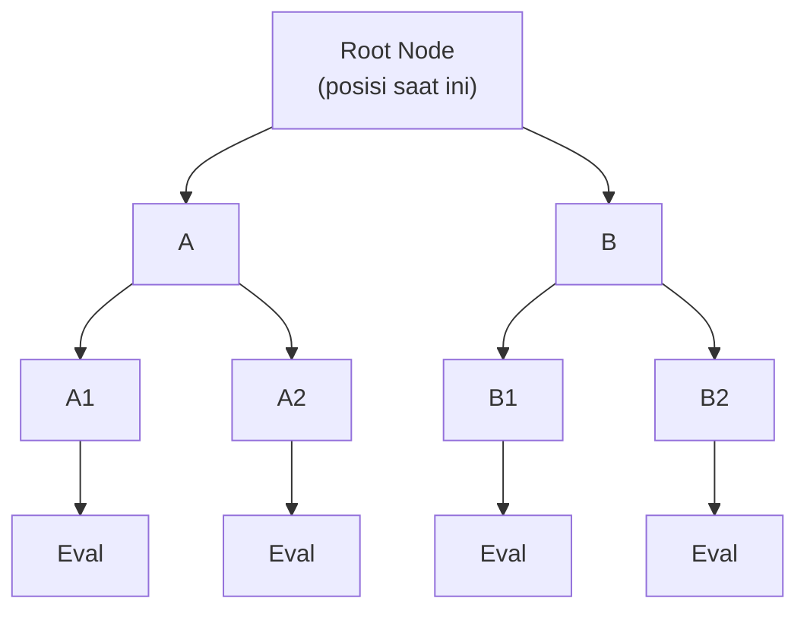
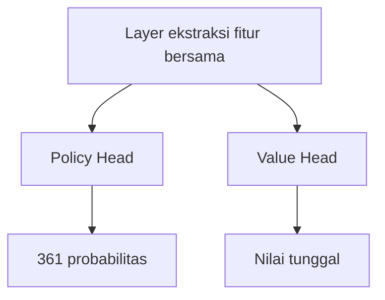

# Penjelasan Detail Value Network

Jika Policy Network memberitahu AlphaGo "langkah berikutnya harus di mana", maka Value Network menjawab pertanyaan yang lebih fundamental:

> **"Permainan ini, apakah saya akan menang?"**

---

## Apa itu Value Network?

### Fungsi Inti

Value Network adalah deep convolutional neural network, tugasnya adalah:

> **Diberikan state papan saat ini, memprediksi win rate akhir**

Dinyatakan secara matematis:

```
v = f_θ(s)
```

Di mana:
- `s`: State papan saat ini
- `f_θ`: Value Network (θ adalah parameter jaringan)
- `v`: Nilai antara -1 sampai +1

### Makna Output

| Nilai Output | Makna |
|--------|------|
| +1 | Pemain saat ini pasti menang |
| +0.5 | Pemain saat ini sekitar 75% win rate |
| 0 | Win rate kedua pemain sama |
| -0.5 | Pemain saat ini sekitar 25% win rate |
| -1 | Pemain saat ini pasti kalah |

### Mengapa Memerlukan Nilai Tunggal?

#### Membandingkan Pilihan Berbeda

Saat bermain, kita sering perlu memilih di antara beberapa opsi. Value Network membuat perbandingan ini menjadi sederhana:

```
Nilai posisi Opsi A: 0.3
Nilai posisi Opsi B: 0.5
Nilai posisi Opsi C: 0.2

→ Pilih B (nilai tertinggi)
```

Tanpa nilai tunggal, bagaimana kita membandingkan "menangkap satu grup lawan" dan "mengepung area besar" mana yang lebih baik?

#### Menggantikan Banyak Simulasi

Dalam Monte Carlo tree search tradisional, mengevaluasi satu posisi memerlukan **simulasi acak (rollout)**:

1. Mulai dari posisi saat ini
2. Kedua pemain bermain secara acak sampai akhir permainan
3. Catat menang/kalah
4. Ulangi ribuan kali, hitung win rate

Ini sangat lambat. Value Network dapat memberikan evaluasi dengan **satu forward propagation**, kecepatannya jauh lebih tinggi.

| Metode | Waktu Evaluasi | Presisi |
|------|---------|------|
| 1000 simulasi acak | ~2000 milidetik | Lebih rendah |
| 15000 simulasi acak | ~30000 milidetik | Menengah |
| Value Network | ~3 milidetik | Tinggi (setara 15000 simulasi) |

---

## Arsitektur Jaringan

### Kesamaan dengan Policy Network

Arsitektur Value Network sangat mirip dengan Policy Network, keduanya adalah deep convolutional neural network:



### Layer Input

Sama dengan Policy Network, input adalah tensor fitur **19×19×49**:

- **19×19**: Ukuran papan
- **49**: 48 feature plane + 1 plane menunjukkan giliran siapa

1 plane tambahan ini penting: Value Network perlu tahu giliran siapa, karena nilai posisi yang sama berlawanan untuk hitam dan putih.

### Layer Konvolusi

Sama dengan Policy Network:
- **12 layer konvolusi**
- **192 filter**
- **Kernel 3×3** (layer pertama 5×5)
- **Fungsi aktivasi ReLU**

### Perbedaan Layer Output

Ini adalah perbedaan kunci antara Value Network dan Policy Network:

#### Output Policy Network
```
19×19×192 → Konvolusi 1×1 → 19×19×1 → Flatten → 361 dimensi → Softmax → Distribusi probabilitas
```

#### Output Value Network
```
19×19×192 → Konvolusi 1×1 → 19×19×1 → Flatten → 361 dimensi → Fully Connected 256 → ReLU → Fully Connected 1 → Tanh → Nilai tunggal
```

### Fungsi Aktivasi Tanh

Layer terakhir Value Network menggunakan fungsi **Tanh** (hyperbolic tangent):

```
Tanh(x) = (e^x - e^(-x)) / (e^x + e^(-x))
```

Rentang output Tanh adalah **(-1, +1)**, tepat sesuai dengan menang/kalah.

#### Mengapa Tanh Bukan Sigmoid?

Rentang output Sigmoid adalah (0, 1), juga bisa mewakili win rate. Tapi Tanh memiliki beberapa keuntungan:

1. **Simetri**: Berpusat di 0, output bisa positif atau negatif
2. **Gradien lebih baik**: Gradien mendekati 1 di sekitar 0
3. **Semantik jelas**: Nilai positif menang, nilai negatif kalah, nol seri

### Diagram Arsitektur Lengkap



### Jumlah Parameter

| Layer | Perhitungan | Jumlah Parameter |
|---|------|---------|
| Layer konvolusi | Sama dengan Policy Network | ~3.9M |
| Fully connected 1 | 361×256 + 256 | 92,672 |
| Fully connected 2 | 256×1 + 1 | 257 |
| **Total** | | **~4.0M** |

Sekitar 4 juta parameter, sedikit lebih banyak dari Policy Network.

---

## Tantangan Training

### Masalah Overfitting

Training Value Network jauh lebih sulit dari Policy Network. Masalah utamanya adalah **overfitting**.

#### Apa itu Overfitting?

Overfitting mengacu pada model yang "menghafal" data training, bukan belajar generalisasi. Manifestasinya:
- Performa sangat baik di training set
- Performa sangat buruk di test set

#### Mengapa Value Network Mudah Overfitting?

Pertimbangkan data dari satu permainan:

```
Posisi 1 → Posisi 2 → Posisi 3 → ... → Posisi 200 → Hasil: Hitam menang
```

Jika langsung menggunakan data ini untuk training:
- 200 posisi ini memiliki korelasi yang kuat
- Mereka berasal dari permainan yang sama, memiliki hasil yang sama
- Model mungkin belajar "mengenali" permainan ini, bukan memahami posisi

DeepMind menemukan: jika menggunakan catatan permainan manusia yang sama untuk melatih Policy dan Value Network, Value Network akan mengalami overfitting parah.

### Solusi: Data Self-Play

Solusi DeepMind adalah menggunakan **self-play** untuk menghasilkan data training baru:

```
1. Gunakan RL Policy Network yang sudah dilatih untuk self-play
2. Ambil hanya satu posisi dari setiap permainan (menghindari korelasi)
3. Label posisi ini adalah hasil akhir permainan tersebut
4. Hasilkan 30 juta sampel seperti ini
```

#### Mengapa Ini Dapat Menyelesaikan Overfitting?

1. **Jumlah data besar**: 30 juta posisi independen
2. **Tanpa korelasi**: Hanya mengambil satu posisi per permainan
3. **Distribusi berbeda**: Distribusi posisi self-play berbeda dari catatan permainan manusia

### Pembuatan Data Training

```python
# Pseudocode
training_data = []

for game_id in range(30_000_000):
    # Self-play satu permainan
    states, result = self_play(rl_policy_network)

    # Pilih satu posisi secara acak
    random_index = random.randint(0, len(states) - 1)
    state = states[random_index]

    # Catat posisi dan hasil
    training_data.append((state, result))
```

---

## Tujuan dan Metode Training

### Loss Mean Squared Error

Value Network menggunakan **Mean Squared Error (MSE)** sebagai fungsi loss:

```
L(θ) = (1/n) × Σ (v_θ(s) - z)²
```

Di mana:
- `v_θ(s)`: Nilai yang diprediksi model
- `z`: Hasil aktual (+1 atau -1)

#### Mengapa MSE Bukan Cross-Entropy?

- **Cross-entropy** cocok untuk masalah klasifikasi (label diskrit)
- **MSE** cocok untuk masalah regresi (nilai kontinu)

Meskipun hasil hanya +1 atau -1, prediksi model adalah nilai kontinu (angka apapun antara -1 dan +1). MSE membuat model belajar memprediksi nilai mendekati +1 atau -1.

### Proses Training

```python
# Pseudocode
for epoch in range(num_epochs):
    for batch in dataloader:
        states, outcomes = batch

        # Forward propagation
        values = network(states)  # (batch, 1)

        # Menghitung loss (MSE)
        loss = mse_loss(values, outcomes)

        # Backpropagation
        loss.backward()
        optimizer.step()
```

Detail training:
- **Optimizer**: SGD with momentum
- **Learning rate**: 0.003
- **Batch size**: 32
- **Waktu training**: Sekitar 1 minggu (50 GPU)

---

## Analisis Akurasi

### Perbandingan dengan Simulasi Acak

DeepMind melakukan perbandingan detail dalam papernya:

| Metode Evaluasi | Error Prediksi |
|---------|---------|
| 1000 simulasi acak | Lebih tinggi |
| 15000 simulasi acak | Menengah |
| Value Network | Setara 15000 simulasi |

Ini berarti satu evaluasi Value Network ≈ 15000 simulasi acak, tapi sekitar 1000 kali lebih cepat.

### Akurasi di Berbagai Tahap

Akurasi Value Network bergantung pada progres permainan:

| Tahap | Sisa Langkah | Kesulitan Prediksi | Akurasi |
|------|---------|---------|--------|
| Pembukaan | ~300 | Sangat sulit | Lebih rendah |
| Pertengahan | ~150 | Sulit | Menengah |
| Yose | ~50 | Lebih mudah | Lebih tinggi |
| Akhir | ~10 | Mudah | Sangat tinggi |

Ini secara intuitif masuk akal: semakin dekat ke akhir permainan, semakin pasti hasilnya.

### Distribusi Output

Distribusi output Value Network yang terlatih dengan baik:

```
        Frekuensi
          |
          |    *
          |   * *
          |  *   *
          | *     *
          |*       *
          +----+----+---- Nilai Output
         -1    0   +1

Sebagian besar output terkonsentrasi di sekitar -1 dan +1
(karena sebagian besar posisi memiliki kecenderungan menang/kalah yang jelas)
```

### Posisi Tidak Pasti

Ketika output Value Network mendekati 0, menunjukkan posisi sangat kompleks, menang/kalah tidak pasti. Posisi ini biasanya:
- Dalam pertarungan besar
- Kedua pihak seimbang
- Ada beberapa kemungkinan variasi

Dalam MCTS, node ini akan mendapat lebih banyak sumber daya pencarian (karena ketidakpastian tinggi).

---

## Peran dalam MCTS

### Evaluasi Leaf Node

Value Network memainkan peran kunci dalam tahap **Evaluation** MCTS:



*A1, A2, B1, B2 adalah leaf node*

Ketika MCTS mencapai leaf node, perlu mengevaluasi nilai posisi ini. Ada dua metode:

1. **Simulasi acak (Rollout)**: Dari leaf node bermain acak sampai akhir permainan
2. **Evaluasi Value Network**: Langsung menggunakan neural network untuk memprediksi

AlphaGo menggabungkan keduanya:

```
V(leaf) = (1-λ) × V_network(leaf) + λ × V_rollout(leaf)
```

Di mana λ = 0.5, yaitu masing-masing setengah bobot.

#### Mengapa Menggabungkan?

- **Value Network** lebih akurat, tapi mungkin memiliki bias sistematis
- **Simulasi acak** kurang akurat, tapi memberikan estimasi independen
- Menggabungkan keduanya dapat saling melengkapi

### Penyederhanaan AlphaGo Zero

AlphaGo Zero kemudian sepenuhnya meninggalkan simulasi acak:

```
V(leaf) = V_network(leaf)
```

Ini sangat menyederhanakan sistem, sekaligus kekuatan bermain lebih kuat. Ini membuktikan Value Network cukup andal, tidak perlu "asuransi" simulasi acak.

### Backpropagation Update

Setelah mengevaluasi leaf node, nilai ini akan dibackpropagate sepanjang jalur:

```
v3 = V(leaf) = 0.6
      ↑
Q value A2 diperbarui
      ↑
Q value A diperbarui
      ↑
Statistik root node diperbarui
```

Setiap node mempertahankan Q value yang merupakan rata-rata semua evaluasi leaf node yang melewatinya:

```
Q(s, a) = (1/N(s,a)) × Σ V(leaf)
```

---

## Analisis Visualisasi

### Permukaan Nilai

Bayangkan papan 3×3 yang disederhanakan. Value Network mempelajari "permukaan nilai":

| Posisi Hitam / Posisi Putih | 1 | 2 | 3 |
|:---------------------------:|:---:|:---:|:---:|
| **1** | +0.3 | -0.1 | +0.2 |
| **2** | -0.2 | +0.5 | -0.3 |
| **3** | +0.1 | -0.2 | +0.4 |

Permukaan ini memberitahu kita nilai setiap kombinasi posisi. Nilai positif menguntungkan hitam, nilai negatif menguntungkan putih.

### Evolusi Selama Proses Training

Seiring training berlangsung, prediksi Value Network secara bertahap menjadi lebih akurat:

```
       Error Prediksi
          |
     1.0  |*
          | *
     0.5  |  *
          |   *
     0.1  |    * * * * *
          +─────────────── Langkah Training
          0   100K  500K  1M
```

Error akan turun dengan cepat, kemudian stabil.

### Identifikasi Posisi Sulit

Value Network dapat membantu mengidentifikasi posisi sulit:

| Output | Makna | Strategi Respons |
|------|------|---------|
| Mendekati +1 | Sangat unggul | Bermain solid |
| Mendekati -1 | Sangat tertinggal | Cari peluang comeback |
| Mendekati 0 | Posisi kompleks | Perlu kalkulasi mendalam |

AlphaGo akan menginvestasikan lebih banyak waktu berpikir di posisi mendekati 0.

---

## Poin Implementasi

### Implementasi PyTorch

```python
import torch
import torch.nn as nn
import torch.nn.functional as F

class ValueNetwork(nn.Module):
    def __init__(self, input_channels=49, num_filters=192, num_layers=12):
        super().__init__()

        # Layer konvolusi pertama (5×5)
        self.conv1 = nn.Conv2d(input_channels, num_filters,
                               kernel_size=5, padding=2)

        # Layer konvolusi tengah (3×3)×11
        self.conv_layers = nn.ModuleList([
            nn.Conv2d(num_filters, num_filters,
                     kernel_size=3, padding=1)
            for _ in range(num_layers - 1)
        ])

        # Layer konvolusi output
        self.conv_out = nn.Conv2d(num_filters, 1, kernel_size=1)

        # Layer fully connected
        self.fc1 = nn.Linear(361, 256)
        self.fc2 = nn.Linear(256, 1)

    def forward(self, x):
        # x: (batch, 49, 19, 19)

        # Layer konvolusi
        x = F.relu(self.conv1(x))
        for conv in self.conv_layers:
            x = F.relu(conv(x))
        x = self.conv_out(x)

        # Flatten
        x = x.view(x.size(0), -1)  # (batch, 361)

        # Layer fully connected
        x = F.relu(self.fc1(x))
        x = torch.tanh(self.fc2(x))

        return x.squeeze(-1)  # (batch,)
```

### Loop Training

```python
def train_value_network(model, optimizer, states, outcomes):
    """
    states: (batch, 49, 19, 19) - Fitur papan
    outcomes: (batch,) - Hasil permainan (+1 atau -1)
    """
    # Forward propagation
    values = model(states)  # (batch,)

    # Loss MSE
    loss = F.mse_loss(values, outcomes)

    # Backpropagation
    optimizer.zero_grad()
    loss.backward()
    optimizer.step()

    # Menghitung akurasi (prediksi menang/kalah yang benar)
    predictions = (values > 0).float() * 2 - 1  # Konversi ke +1/-1
    accuracy = (predictions == outcomes).float().mean()

    return loss.item(), accuracy.item()
```

### Teknik Menghindari Overfitting

```python
# 1. Augmentasi data (8 simetri)
def augment(state, outcome):
    augmented = []
    for rotation in [0, 90, 180, 270]:
        s = rotate(state, rotation)
        augmented.append((s, outcome))
        augmented.append((flip(s), outcome))
    return augmented

# 2. Dropout
class ValueNetworkWithDropout(ValueNetwork):
    def __init__(self, *args, dropout_rate=0.5, **kwargs):
        super().__init__(*args, **kwargs)
        self.dropout = nn.Dropout(dropout_rate)

    def forward(self, x):
        # ... layer konvolusi ...
        x = self.dropout(x)  # Dropout sebelum layer fully connected
        # ... layer fully connected ...

# 3. Early Stopping
best_val_loss = float('inf')
patience = 10
counter = 0

for epoch in range(max_epochs):
    train_loss = train_one_epoch()
    val_loss = evaluate()

    if val_loss < best_val_loss:
        best_val_loss = val_loss
        save_model()
        counter = 0
    else:
        counter += 1
        if counter >= patience:
            print("Early stopping!")
            break
```

---

## Kolaborasi dengan Policy Network

### Hubungan Komplementer

Policy Network dan Value Network saling melengkapi di AlphaGo:

| Jaringan | Pertanyaan yang Dijawab | Output | Peran MCTS |
|------|-----------|------|----------|
| Policy | Langkah berikutnya di mana? | Distribusi probabilitas | Membimbing arah pencarian |
| Value | Permainan ini akan menang? | Nilai tunggal | Mengevaluasi leaf node |

### Jaringan Dual-Head yang Bersatu

Di AlphaGo Zero, dua jaringan ini digabungkan menjadi satu **jaringan dual-head**:



Keuntungan desain ini:
- **Parameter sharing**: Mengurangi komputasi
- **Feature sharing**: Policy dan Value menggunakan fitur yang sama
- **Training lebih stabil**: Dua objektif saling meregularisasi

Lihat [Dual-Head Network dan Residual Network](../dual-head-resnet) untuk detail.

---

## Korespondensi Animasi

Konsep inti yang dibahas dalam artikel ini dan nomor animasi:

| Nomor | Konsep | Korespondensi Fisika/Matematika |
|------|------|--------------|
| E2 | Value Network | Permukaan potensial |
| D4 | Fungsi nilai | Expected reward |
| C6 | Evaluasi leaf node | Function approximation |
| H3 | Temporal difference | Bootstrap learning |

---

## Bacaan Lanjutan

- **Artikel sebelumnya**: [Penjelasan Detail Policy Network](../policy-network) — Bagaimana policy network memilih langkah
- **Artikel berikutnya**: [Desain Fitur Input](../input-features) — Penjelasan detail 48 feature plane
- **Topik lanjutan**: [Kombinasi MCTS dan Neural Network](../mcts-neural-combo) — Alur pencarian lengkap

---

## Poin Kunci

1. **Value Network memprediksi win rate**: Output nilai tunggal antara -1 dan +1
2. **Output Tanh**: Memastikan output dalam rentang yang benar
3. **Loss MSE**: Mendekati nilai prediksi ke hasil aktual
4. **Tantangan overfitting**: Memerlukan data self-play untuk menghindari
5. **Menggantikan simulasi acak**: Satu evaluasi ≈ 15000 simulasi

Value Network adalah "kemampuan penilaian" AlphaGo — memungkinkan AI mengevaluasi baik/buruknya posisi apapun, tanpa perlu menghabiskan semua kemungkinan.

---

## Referensi

1. Silver, D., et al. (2016). "Mastering the game of Go with deep neural networks and tree search." *Nature*, 529, 484-489.
2. Silver, D., et al. (2017). "Mastering the game of Go without human knowledge." *Nature*, 551, 354-359.
3. Sutton, R. S., & Barto, A. G. (2018). *Reinforcement Learning: An Introduction*. MIT Press.
4. Tesauro, G. (1995). "Temporal difference learning and TD-Gammon." *Communications of the ACM*, 38(3), 58-68.
