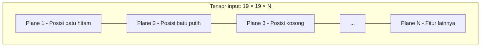

# Desain Fitur Input

Neural network hanya dapat memproses angka. Untuk membuatnya memahami Go, kita memerlukan cara untuk "menerjemahkan" papan menjadi angka.

Proses penerjemahan ini adalah **desain fitur input**.

AlphaGo menggunakan 48 feature plane, AlphaGo Zero menyederhanakan menjadi 17, dan KataGo mengoptimalkan menjadi 22. Artikel ini akan menganalisis secara detail pertimbangan di balik pilihan desain ini.

---

## Apa itu Feature Plane?

### Konsep Dasar

Satu **feature plane** adalah matriks 19×19, setiap elemen mewakili atribut tertentu dari posisi yang sesuai di papan.

Misalnya, feature plane "posisi batu hitam":

```
State papan:               Feature plane (batu hitam):
  A B C D E               A B C D E
1 . . . . .            1  0 0 0 0 0
2 . ● . . .            2  0 1 0 0 0
3 . . ○ . .    →       3  0 0 0 0 0
4 . . . ● .            4  0 0 0 1 0
5 . . . . .            5  0 0 0 0 0
```

- Posisi dengan batu hitam = 1
- Posisi tanpa batu hitam = 0

### Multiple Feature Plane

Neural network memerlukan berbagai informasi, jadi kita menumpuk beberapa feature plane:



Ini mirip dengan gambar berwarna yang memiliki tiga channel R, G, B. "Gambar" Go memiliki N channel.

---

## 48 Feature Plane AlphaGo

### Daftar Lengkap

AlphaGo menggunakan 48 feature plane, dibagi menjadi beberapa kategori besar:

#### 1. Posisi Batu (3 plane)

| Plane | Nama | Deskripsi |
|------|------|------|
| 1 | Batu hitam | Ada batu hitam = 1, sebaliknya = 0 |
| 2 | Batu putih | Ada batu putih = 1, sebaliknya = 0 |
| 3 | Titik kosong | Titik kosong = 1, sebaliknya = 0 |

#### 2. Riwayat (16 plane)

| Plane | Nama | Deskripsi |
|------|------|------|
| 4-11 | Riwayat batu hitam | Posisi batu hitam 1-8 langkah lalu |
| 12-19 | Riwayat batu putih | Posisi batu putih 1-8 langkah lalu |

Mengapa memerlukan riwayat?
- **Penentuan ko**: Perlu tahu apakah bisa langsung mengambil kembali
- **Niat langkah**: Beberapa langkah terakhir mengungkapkan rencana kedua pemain
- **Informasi temporal**: CNN sendiri tidak memproses waktu, plane riwayat melengkapi ini

#### 3. Fitur Liberty (8 plane)

| Plane | Nama | Deskripsi |
|------|------|------|
| 20-23 | 1-4 liberty (kita) | String kita memiliki 1/2/3/4 liberty = 1 |
| 24-27 | 1-4 liberty (lawan) | String lawan memiliki 1/2/3/4 liberty = 1 |

Jumlah liberty adalah konsep taktis paling penting di Go:
- **1 liberty**: Di-atari, akan segera ditangkap
- **2 liberty**: State berbahaya
- **3 liberty**: Perlu perhatian
- **4+ liberty**: Sementara aman

#### 4. Fitur Atari (8 plane)

| Plane | Nama | Deskripsi |
|------|------|------|
| 28-31 | Posisi atari (kita) | Bermain di sini bisa atari 1/2/3/4 batu lawan |
| 32-35 | Posisi atari (lawan) | Bermain di sini bisa atari 1/2/3/4 batu kita |

Atari adalah taktik paling umum di Go:
- Atari lebih banyak batu = ancaman lebih besar
- Atari ukuran berbeda memerlukan respons berbeda

#### 5. Fitur Ladder (8 plane)

| Plane | Nama | Deskripsi |
|------|------|------|
| 36-39 | Terkait ladder (kita) | Posisi terkait ladder kita |
| 40-43 | Terkait ladder (lawan) | Posisi terkait ladder lawan |

Ladder adalah taktik terkenal di Go:
- Mengejar batu lawan sepanjang diagonal
- Perlu menentukan "ladder menguntungkan" atau "ladder tidak menguntungkan"
- Ini memerlukan visi global, tantangan untuk program Go tradisional

#### 6. Fitur Legalitas (1 plane)

| Plane | Nama | Deskripsi |
|------|------|------|
| 44 | Posisi legal | Bisa bermain legal = 1 |

Ini mencegah jaringan menghasilkan langkah ilegal:
- Tidak bisa bermain di posisi yang sudah ada batu
- Tidak bisa bermain di titik terlarang (bunuh diri dan tidak menangkap)
- Tidak bisa langsung mengambil kembali ko

#### 7. Fitur Tepi/Sudut (4 plane)

| Plane | Nama | Deskripsi |
|------|------|------|
| 45 | Jarak 1 dari tepi | Di garis 1 = 1 |
| 46 | Jarak 2 dari tepi | Di garis 2 = 1 |
| 47 | Jarak 3 dari tepi | Di garis 3 = 1 |
| 48 | Jarak 4+ dari tepi | Di garis 4 atau lebih dalam = 1 |

Tepi dan sudut memiliki makna khusus di Go:
- **Garis 1**: Garis kematian, batu mudah dikelilingi
- **Garis 2**: Garis hidup, tapi efisiensi rendah
- **Garis 3**: Garis teritori, solid
- **Garis 4**: Garis influence, mengejar pengaruh

### Mengapa Memerlukan Begitu Banyak Fitur?

Filosofi desain DeepMind adalah **menyediakan informasi sebanyak mungkin**, membiarkan jaringan memutuskan mana yang berguna:

```
Papan asli → 48 feature plane → Neural network → Keputusan

Tugas feature engineer: Mengenkode pengetahuan Go menjadi fitur
Tugas neural network: Belajar mengkombinasikan fitur ini
```

Ini adalah strategi "mengoper bola ke neural network" — manusia bertanggung jawab atas desain fitur, jaringan bertanggung jawab belajar kombinasi.

---

## Penyederhanaan AlphaGo Zero: 17 Feature Plane

### Perubahan Revolusioner

AlphaGo Zero sangat menyederhanakan fitur input:

| Versi | Jumlah Feature Plane | Menggunakan Pengetahuan Manusia |
|------|-----------|-------------|
| AlphaGo | 48 | Banyak (liberty, ladder, dll.) |
| AlphaGo Zero | 17 | Hampir tidak ada |

### Komposisi 17 Plane

#### 1. Riwayat Posisi Batu (16 plane)

| Plane | Nama | Deskripsi |
|------|------|------|
| 1-8 | Batu hitam T-0 sampai T-7 | Posisi batu hitam di saat ini dan 7 langkah terakhir |
| 9-16 | Batu putih T-0 sampai T-7 | Posisi batu putih di saat ini dan 7 langkah terakhir |

#### 2. Warna (1 plane)

| Plane | Nama | Deskripsi |
|------|------|------|
| 17 | Giliran siapa | Giliran hitam = semua 1, giliran putih = semua 0 |

### Mengapa Bisa Sesederhana Ini?

Wawasan inti AlphaGo Zero:

> **Jika diberikan sumber daya komputasi dan waktu training yang cukup, neural network dapat mempelajari fitur ini sendiri**

Konsep "liberty", "atari", "ladder" ini, manusia butuh ribuan tahun untuk mengembangkannya. Tapi AlphaGo Zero membuktikan, neural network dapat mempelajarinya sendiri dalam beberapa hari — bahkan mungkin mempelajari representasi yang lebih baik dari manusia.

### Perbandingan Efek

Yang mengejutkan, AlphaGo Zero dengan fitur lebih sedikit justru lebih kuat:

| Versi | Jumlah Fitur | Waktu Training | Kekuatan Akhir |
|------|--------|---------|---------|
| AlphaGo Master | 48 | Beberapa bulan | Sekitar 5185 Elo |
| AlphaGo Zero | 17 | 40 hari | Sekitar 5185 Elo |
| AlphaGo Zero (3 hari) | 17 | 3 hari | Melampaui manusia |

Lebih sedikit pengetahuan manusia, justru membawa performa lebih kuat.

### Mengapa Pengetahuan Manusia Justru Menjadi Beban?

#### 1. Pengetahuan Manusia Mungkin Salah

Aturan Go yang dirangkum manusia bersifat empiris, mungkin bukan optimal. Misalnya:
- "Sudut emas, tepi perak, tengah rumput" — tapi beberapa posisi tengah lebih penting
- "Ladder tidak menguntungkan jangan jalan" — tapi kadang bisa sengaja korbankan batu

#### 2. Encoding Fitur Membatasi Representasi

Ketika kita mengenkode "liberty" menjadi empat plane 1-4 liberty, kita secara implisit mengasumsikan "jumlah liberty" adalah cara klasifikasi yang penting. Tapi mungkin ada cara klasifikasi yang lebih baik, dan encoding ini mencegah jaringan menemukannya.

#### 3. Bottleneck Representasi

48 plane menggunakan lebih banyak sumber daya komputasi. Jika beberapa fitur redundan, sumber daya ini terbuang.

---

## Optimisasi KataGo: 22 Feature Plane

### Keseimbangan Pragmatis

KataGo, berdasarkan AlphaGo Zero, menambahkan sedikit pengetahuan manusia pilihan:

| Item | AlphaGo Zero | KataGo |
|------|-------------|--------|
| Plane riwayat | 16 | 5 |
| Posisi batu | Ya | Ya |
| Giliran siapa | Ya | Ya |
| State ko | Tidak | Ya |
| Varian aturan | Tidak | Ya (komi, aturan bunuh diri, dll.) |
| **Total** | 17 | 22 |

### Daftar Fitur KataGo

#### Fitur Dasar (5)

| Plane | Nama | Deskripsi |
|------|------|------|
| 1 | Batu hitam | Posisi batu hitam saat ini |
| 2 | Batu putih | Posisi batu putih saat ini |
| 3 | Titik kosong | Posisi titik kosong saat ini |
| 4 | Giliran siapa (1) | Plane konstanta selalu 1 |
| 5 | Giliran siapa (2) | Giliran hitam = 1, giliran putih = 0 |

#### Fitur Riwayat (5)

| Plane | Nama | Deskripsi |
|------|------|------|
| 6 | Posisi langkah terakhir | Posisi langkah terakhir lawan |
| 7 | Posisi langkah ke-2 terakhir | Posisi langkah terakhir kita |
| 8 | Posisi langkah ke-3 terakhir | Posisi langkah ke-2 terakhir lawan |
| 9 | Posisi langkah ke-4 terakhir | Posisi langkah ke-2 terakhir kita |
| 10 | Posisi langkah ke-5 terakhir | Posisi langkah ke-3 terakhir lawan |

#### Fitur Ko (3)

| Plane | Nama | Deskripsi |
|------|------|------|
| 11 | Titik terlarang ko | Titik terlarang ko saat ini |
| 12 | Titik ko potensial (kita) | Bermain di sini akan menghasilkan ko |
| 13 | Titik ko potensial (lawan) | Lawan bermain di sini akan menghasilkan ko |

#### Fitur Aturan (9)

| Plane | Nama | Deskripsi |
|------|------|------|
| 14-22 | Encoding aturan | Komi, aturan bunuh diri, super ko, dll. |

### Mengapa Menambahkan Fitur Ini?

Penulis KataGo lightvector menjelaskan:

#### 1. Ko Terlalu Penting

Ko adalah salah satu konsep paling kompleks di Go. Murni mempelajari aturan ko dari state papan mentah memerlukan banyak sampel. Menandai titik terlarang ko secara eksplisit dapat mempercepat pembelajaran.

#### 2. Keberagaman Aturan

Go memiliki berbagai aturan:
- **Komi**: Aturan China 7.5 moku, aturan Jepang 6.5 moku
- **Aturan bunuh diri**: Beberapa aturan mengizinkan bunuh diri
- **Super ko**: Cara berbeda menangani siklus panjang

Mengenkode aturan secara eksplisit dalam input memungkinkan satu jaringan menangani semua varian.

#### 3. Efisiensi Training

Menambahkan sedikit pengetahuan manusia dapat sangat mempercepat training. KataGo mencapai kekuatan dengan 50 GPU-hari yang AlphaGo Zero butuhkan 5000+ TPU-hari.

---

## Filosofi Desain Fitur

### Tiga Pendekatan

| Pendekatan | Representatif | Jumlah Fitur | Pengetahuan Manusia | Kebutuhan Komputasi |
|------|------|--------|---------|---------|
| Banyak pengetahuan manusia | AlphaGo | 48 | Banyak | Menengah |
| Minimal pengetahuan manusia | AlphaGo Zero | 17 | Hampir tidak ada | Sangat tinggi |
| Pengetahuan manusia moderat | KataGo | 22 | Sedikit pilihan | Lebih rendah |

### Pertimbangan Trade-off

#### Ketika Sumber Daya Terbatas

Jika sumber daya komputasi terbatas (situasi kebanyakan peneliti), menambahkan beberapa pengetahuan manusia adalah bijaksana:
- Mempercepat konvergensi training
- Mengurangi data training yang dibutuhkan
- Menghindari menemukan kembali roda

#### Ketika Mengejar Batas

Jika sumber daya komputasi melimpah, mengurangi pengetahuan manusia mungkin mencapai kekuatan lebih tinggi:
- Menghindari bias manusia
- Menemukan strategi yang tidak diketahui manusia
- Benar-benar "dari nol"

### Pelajaran

Evolusi seri AlphaGo mengajarkan kita:

1. **Feature engineering masih penting** — tapi bentuknya berubah
2. **End-to-end learning adalah tren** — biarkan jaringan mempelajari fitur sendiri
3. **Tidak ada jawaban tunggal yang benar** — tergantung sumber daya dan tujuan

---

## Contoh Implementasi

### Ekstraksi Fitur (Gaya AlphaGo)

```python
import numpy as np

def extract_features_alphago(board, history, current_player):
    """
    Mengekstrak 48 feature plane gaya AlphaGo

    board: Papan 19×19, 0=kosong, 1=hitam, 2=putih
    history: Riwayat 8 langkah terakhir
    current_player: 1=hitam, 2=putih
    """
    features = np.zeros((48, 19, 19))

    # 1-3: Posisi batu
    features[0] = (board == 1)  # Batu hitam
    features[1] = (board == 2)  # Batu putih
    features[2] = (board == 0)  # Titik kosong

    # 4-19: Posisi riwayat
    for i, hist_board in enumerate(history[:8]):
        features[3 + i] = (hist_board == 1)      # Riwayat batu hitam
        features[11 + i] = (hist_board == 2)     # Riwayat batu putih

    # 20-27: Fitur liberty
    liberties = compute_liberties(board)
    for i, lib_count in enumerate([1, 2, 3, 4]):
        my_color = current_player
        opp_color = 3 - current_player
        features[19 + i] = (liberties == lib_count) & (board == my_color)
        features[23 + i] = (liberties == lib_count) & (board == opp_color)

    # 28-35: Fitur atari
    capture_counts = compute_captures(board)
    for i, cap_count in enumerate([1, 2, 3, 4]):
        features[27 + i] = (capture_counts[current_player] == cap_count)
        features[31 + i] = (capture_counts[3-current_player] == cap_count)

    # 36-43: Fitur ladder (disederhanakan)
    ladder_status = compute_ladder(board)
    # ... implementasi detail diabaikan ...

    # 44: Posisi legal
    features[43] = compute_legal_moves(board, current_player)

    # 45-48: Jarak tepi
    for i in range(19):
        for j in range(19):
            dist = min(i, j, 18-i, 18-j)
            if dist == 0:
                features[44, i, j] = 1
            elif dist == 1:
                features[45, i, j] = 1
            elif dist == 2:
                features[46, i, j] = 1
            else:
                features[47, i, j] = 1

    return features
```

### Ekstraksi Fitur (Gaya AlphaGo Zero)

```python
def extract_features_zero(board_history, current_player):
    """
    Mengekstrak 17 feature plane gaya AlphaGo Zero

    board_history: Daftar state papan 8 langkah terakhir
    current_player: 1=hitam, 2=putih
    """
    features = np.zeros((17, 19, 19))

    # 1-8: Posisi batu hitam di T-0 sampai T-7
    for i, board in enumerate(board_history[:8]):
        features[i] = (board == 1)

    # 9-16: Posisi batu putih di T-0 sampai T-7
    for i, board in enumerate(board_history[:8]):
        features[8 + i] = (board == 2)

    # 17: Giliran siapa
    if current_player == 1:  # Hitam
        features[16] = np.ones((19, 19))
    else:
        features[16] = np.zeros((19, 19))

    return features
```

### Perbandingan Performa

```python
import time

# Simulasi 1000 ekstraksi fitur
board = np.random.randint(0, 3, (19, 19))
history = [np.random.randint(0, 3, (19, 19)) for _ in range(8)]

# Gaya AlphaGo (dengan komputasi kompleks)
start = time.time()
for _ in range(1000):
    features = extract_features_alphago(board, history, 1)
alphago_time = time.time() - start

# Gaya AlphaGo Zero (sederhana)
start = time.time()
for _ in range(1000):
    features = extract_features_zero(history, 1)
zero_time = time.time() - start

print(f"Gaya AlphaGo: {alphago_time:.2f}s")
print(f"Gaya AlphaGo Zero: {zero_time:.2f}s")
# Hasil tipikal: Gaya AlphaGo 5-10 kali lebih lambat
```

---

## Visualisasi Feature Plane

### Contoh Posisi Aktual

```
Papan aktual:
   A B C D E F G H J K L M N O P Q R S T
19 . . . . . . . . . . . . . . . . . . .
18 . . . . . . . . . . . . . . . . . . .
17 . . . ● . . . . . . . . . . . ○ . . .
16 . . . . . . . . . . . . . . . . . . .
15 . . . . . . . . . . . . . . . . . . .
...

Feature plane 1 (batu hitam):
   A B C D E F G H J K L M N O P Q R S T
19 0 0 0 0 0 0 0 0 0 0 0 0 0 0 0 0 0 0 0
18 0 0 0 0 0 0 0 0 0 0 0 0 0 0 0 0 0 0 0
17 0 0 0 1 0 0 0 0 0 0 0 0 0 0 0 0 0 0 0
16 0 0 0 0 0 0 0 0 0 0 0 0 0 0 0 0 0 0 0
...

Feature plane 2 (batu putih):
   A B C D E F G H J K L M N O P Q R S T
19 0 0 0 0 0 0 0 0 0 0 0 0 0 0 0 0 0 0 0
18 0 0 0 0 0 0 0 0 0 0 0 0 0 0 0 0 0 0 0
17 0 0 0 0 0 0 0 0 0 0 0 0 0 0 0 1 0 0 0
16 0 0 0 0 0 0 0 0 0 0 0 0 0 0 0 0 0 0 0
...
```

### Inspirasi dari Feature Plane

Mengamati feature plane yang berbeda dapat memahami apa yang "dilihat" model:

| Fitur | Makna Intuitif | Apa yang Mungkin Dipelajari Model |
|------|---------|---------------|
| Posisi batu hitam/putih | Siapa di mana | Bentuk batu, konektivitas |
| Riwayat | Apa yang baru terjadi | Niat langkah, arah pertarungan |
| Jumlah liberty | Siapa berbahaya | Target serangan/pertahanan |
| Atari | Peluang taktis | Taktik lokal |
| Jarak tepi | Pentingnya posisi | Pemilihan titik pembukaan, joseki sudut |

---

## Korespondensi Animasi

Konsep inti yang dibahas dalam artikel ini dan nomor animasi:

| Nomor | Konsep | Korespondensi Fisika/Matematika |
|------|------|--------------|
| A8 | Encoding fitur | Representasi tensor |
| A10 | Normalisasi input | Feature engineering |
| D1 | Input konvolusi | Gambar multi-channel |
| E3 | Penyederhanaan Zero | Representasi minimal |

---

## Bacaan Lanjutan

- **Artikel sebelumnya**: [Penjelasan Detail Value Network](../value-network) — Bagaimana mengevaluasi nilai posisi
- **Artikel berikutnya**: [Kombinasi CNN dan Go](../cnn-and-go) — Bagaimana CNN memproses papan
- **Topik terkait**: [Representasi Papan Permainan](../board-representation) — Struktur data level lebih rendah

---

## Poin Kunci

1. **Feature plane adalah representasi digital papan**: Setiap plane adalah matriks 19×19
2. **AlphaGo menggunakan 48 plane**: Mencakup banyak pengetahuan Go manusia
3. **AlphaGo Zero menyederhanakan menjadi 17**: Membuktikan jaringan dapat mempelajari fitur sendiri
4. **KataGo mengoptimalkan menjadi 22**: Menyeimbangkan efisiensi dan performa
5. **Desain fitur adalah trade-off**: Pengetahuan manusia vs sumber daya komputasi

Desain fitur input adalah jembatan yang menghubungkan "Go yang dipahami manusia" dengan "angka yang dapat diproses mesin".

---

## Referensi

1. Silver, D., et al. (2016). "Mastering the game of Go with deep neural networks and tree search." *Nature*, 529, 484-489.
2. Silver, D., et al. (2017). "Mastering the game of Go without human knowledge." *Nature*, 551, 354-359.
3. Wu, D. (2019). "Accelerating Self-Play Learning in Go." *arXiv:1902.10565*.
4. KataGo Documentation: [https://github.com/lightvector/KataGo](https://github.com/lightvector/KataGo)
