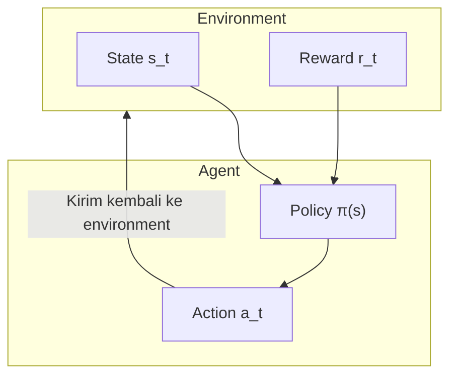

# Pengantar Reinforcement Learning

Di artikel sebelumnya, kita memperkenalkan bagaimana AlphaGo menggunakan supervised learning untuk belajar dari catatan permainan manusia. Tetapi supervised learning memiliki keterbatasan fundamental: **ia hanya dapat meniru manusia, tidak dapat melampaui manusia**.

Untuk membuat AI melampaui manusia, kita membutuhkan metode pembelajaran yang berbeda—**Reinforcement Learning (RL)**.

Artikel ini akan membawa Anda memahami konsep inti reinforcement learning dari nol, meletakkan dasar untuk self-play dan integrasi MCTS selanjutnya.

---

## Apa itu Reinforcement Learning?

### Perbandingan dengan Metode Pembelajaran Lain

Machine learning terutama memiliki tiga paradigma:

| Paradigma | Cara Belajar | Contoh |
|-----------|--------------|--------|
| **Supervised Learning** | Belajar dari data berlabel | Klasifikasi gambar, prediksi langkah berikutnya |
| **Unsupervised Learning** | Menemukan struktur dari data tidak berlabel | Clustering, reduksi dimensi |
| **Reinforcement Learning** | Belajar dari pengalaman interaksi | Bermain catur, bermain game, kontrol robot |

Keunikan reinforcement learning adalah: **Tidak ada yang memberitahu Anda jawaban yang benar, Anda harus menemukan sendiri melalui trial and error**.

### Contoh Intuitif

Bayangkan Anda sedang mengajar seekor anjing trik baru:

1. Anjing melakukan tindakan tertentu (mungkin acak)
2. Jika tindakan benar, Anda memberinya makanan (reward positif)
3. Jika tindakan salah, Anda tidak memberi makanan atau berkata "tidak" dengan pelan (reward negatif atau nol)
4. Setelah banyak percobaan, anjing belajar tindakan mana yang membawa reward

Inilah esensi reinforcement learning: **Belajar cara bertindak melalui sinyal reward**.

### Penerapan Reinforcement Learning dalam Go

Dalam Go:
- Setiap langkah adalah sebuah "tindakan"
- Di akhir permainan, menang atau kalah adalah "reward"
- AI perlu belajar: langkah mana yang pada akhirnya akan mengarah ke kemenangan?

Tetapi ada tantangan besar di sini: **Reward yang tertunda**. Satu permainan mungkin berlangsung lebih dari 200 langkah, tetapi Anda hanya tahu menang atau kalah di akhir. Bagaimana mengetahui berapa banyak kontribusi langkah ke-50 terhadap hasil akhir?

Ini adalah salah satu masalah paling inti dari reinforcement learning, yang kita sebut **Credit Assignment Problem**.

---

## Konsep Inti

### Agent dan Environment

Arsitektur dasar reinforcement learning mencakup dua protagonis:



**Agent (Agen)**:
- Subjek yang membuat keputusan
- Dalam Go, ini adalah AI yang bermain
- Memiliki "policy" yang menentukan tindakan apa yang diambil di setiap state

**Environment (Lingkungan)**:
- Objek yang berinteraksi dengan Agent
- Dalam Go, ini adalah papan + lawan
- Menerima tindakan Agent, mengembalikan state baru dan reward

### State (Status)

**State s** adalah deskripsi lengkap dari environment. Dalam Go:
- State mencakup: posisi papan saat ini, giliran siapa, status ko, dll.
- Ruang state sangat besar: sekitar $10^{170}$ kemungkinan state

State harus memiliki **properti Markov**: masa depan hanya bergantung pada state saat ini, tidak bergantung pada sejarah.

### Action (Tindakan)

**Action a** adalah perilaku yang dapat diambil Agent. Dalam Go:
- Setiap titik kosong adalah tindakan yang mungkin
- Ditambah "pass", total ada $19 \times 19 + 1 = 362$ tindakan
- Tetapi sebenarnya banyak posisi yang ilegal (seperti bunuh diri, ko)

### Reward

**Reward r** adalah umpan balik environment terhadap tindakan. Dalam Go:
- Menang: $+1$
- Kalah: $-1$
- Selama permainan: $0$ (ini adalah bagian yang paling menantang!)

Kelangkaan sinyal reward adalah salah satu kesulitan utama reinforcement learning Go.

### Policy (Kebijakan)

**Policy π** adalah pedoman perilaku Agent, memberitahunya apa yang harus dilakukan di setiap state.

Policy dapat berupa:
- **Policy deterministik**: $a = \pi(s)$, setiap state sesuai dengan satu tindakan unik
- **Policy stokastik**: $a \sim \pi(a|s)$, memberikan distribusi probabilitas tindakan

Di AlphaGo, Policy Network adalah policy stokastik, menghasilkan probabilitas penempatan di setiap posisi.

---

## Markov Decision Process (MDP)

### Definisi MDP

**Markov Decision Process (MDP)** adalah kerangka matematis reinforcement learning.

MDP didefinisikan oleh tuple lima $(S, A, P, R, \gamma)$:

| Simbol | Makna | Korespondensi dalam Go |
|--------|-------|------------------------|
| $S$ | Ruang state | Semua kemungkinan posisi papan |
| $A$ | Ruang tindakan | Semua posisi penempatan legal |
| $P(s'|s,a)$ | Probabilitas transisi | Perubahan posisi setelah langkah berikutnya |
| $R(s,a,s')$ | Fungsi reward | Hasil menang/kalah |
| $\gamma$ | Faktor diskon | Pentingnya reward masa depan |

### Properti Markov

Asumsi inti MDP adalah **Properti Markov**:

$$P(s_{t+1}|s_t, a_t, s_{t-1}, a_{t-1}, \ldots, s_0) = P(s_{t+1}|s_t, a_t)$$

Dalam bahasa sederhana: **Masa depan hanya bergantung pada sekarang, tidak bergantung pada masa lalu**.

Apakah Go memenuhi properti ini?

Secara permukaan, ya—selama Anda tahu state papan saat ini, Anda tahu semua langkah legal. Tetapi sebenarnya, Go memiliki **aturan ko**, yang memerlukan mengingat state langkah sebelumnya. AlphaGo menangani masalah ini dengan mengkodekan 8 langkah sebelumnya ke dalam fitur input.

### Go adalah MDP Deterministik

Go memiliki properti khusus: **Transisi bersifat deterministik**.

Dalam permainan papan, ketika Anda membuat langkah, perubahan state papan sepenuhnya ditentukan (tidak seperti permainan dadu yang memiliki keacakan). Jadi:

$$P(s'|s,a) = \begin{cases} 1 & \text{jika } s' \text{ adalah state setelah mengeksekusi } a \\ 0 & \text{sebaliknya} \end{cases}$$

Tetapi jangan lupa, Go adalah **permainan dua pemain**, langkah lawan membawa "ketidakpastian". Ini membuat masalah menjadi **MDP adversarial**.

### Desain Reward

Desain fungsi reward sangat penting untuk reinforcement learning. Dalam Go, desain paling alami adalah:

$$R(s_T) = \begin{cases} +1 & \text{jika AI menang} \\ -1 & \text{jika AI kalah} \end{cases}$$

Di mana $T$ adalah langkah waktu akhir permainan.

**Sparse reward** ini membawa tantangan besar:
- Satu permainan mungkin memiliki 200-300 langkah
- Hanya langkah terakhir yang memberitahu menang atau kalah
- Bagaimana menilai apakah langkah tertentu di tengah bagus atau buruk?

Beberapa penelitian mencoba merancang **dense reward**, seperti:
- Reward penangkapan batu
- Reward estimasi wilayah
- Reward penilaian situasi

Tetapi keberhasilan AlphaGo menunjukkan: **Bahkan hanya menggunakan menang/kalah akhir sebagai reward, melalui self-play yang cukup, AI masih dapat belajar taktik tengah permainan yang halus**.

---

## Value Function

### Mengapa Membutuhkan Value Function?

Tujuan reinforcement learning adalah memaksimalkan **cumulative reward**. Tetapi reward tertunda, kita membutuhkan cara untuk mengevaluasi "seberapa baik state saat ini".

Inilah peran **Value Function**.

### State Value Function V(s)

**State value function** $V^\pi(s)$ didefinisikan sebagai: mulai dari state $s$, mengikuti policy $\pi$, ekspektasi cumulative reward yang dapat diperoleh.

$$V^\pi(s) = \mathbb{E}_\pi \left[ \sum_{t=0}^{\infty} \gamma^t r_{t+1} \mid s_0 = s \right]$$

Di mana:
- $\mathbb{E}_\pi$ menunjukkan nilai ekspektasi di bawah policy $\pi$
- $\gamma \in [0, 1]$ adalah **faktor diskon**, membuat reward jangka pendek lebih penting daripada reward jangka panjang
- $r_{t+1}$ adalah reward yang diperoleh di langkah waktu $t+1$

Dalam Go, $V(s)$ dapat diinterpretasikan sebagai: **Probabilitas AI menang mulai dari posisi saat ini**. Value Network AlphaGo mempelajari fungsi ini.

### Action Value Function Q(s,a)

**Action value function** $Q^\pi(s,a)$ lebih lanjut mengevaluasi nilai mengambil tindakan $a$ di state $s$:

$$Q^\pi(s,a) = \mathbb{E}_\pi \left[ \sum_{t=0}^{\infty} \gamma^t r_{t+1} \mid s_0 = s, a_0 = a \right]$$

$Q(s,a)$ dapat diinterpretasikan sebagai: **Probabilitas menang akhirnya dengan memainkan langkah ini di posisi saat ini**.

### Hubungan antara V dan Q

Kedua fungsi ini memiliki hubungan erat:

$$V^\pi(s) = \sum_a \pi(a|s) Q^\pi(s,a)$$

Artinya, nilai state = rata-rata tertimbang dari semua kemungkinan tindakan, dengan bobot ditentukan oleh policy.

Jika kita tahu policy optimal $\pi^*$:

$$V^*(s) = \max_a Q^*(s,a)$$

Nilai state optimal = nilai Q dari tindakan terbaik.

### Persamaan Bellman

Value function memenuhi hubungan rekursif yang elegan—**Bellman Equation**:

$$V^\pi(s) = \sum_a \pi(a|s) \sum_{s'} P(s'|s,a) \left[ R(s,a,s') + \gamma V^\pi(s') \right]$$

Dalam bahasa sederhana: **Nilai state saat ini = reward langsung + nilai state berikutnya yang didiskon**.

Persamaan ini adalah dasar teoretis dari dynamic programming dan banyak algoritma reinforcement learning.

### Value Network AlphaGo

Di AlphaGo, Value Network mempelajari $V(s)$—mengevaluasi tingkat kemenangan posisi saat ini.

```
Input: State papan s (tensor fitur 19×19×17)
Output: Estimasi tingkat kemenangan V(s) ∈ [-1, 1] (menggunakan aktivasi tanh)
```

Tujuan pelatihan Value Network adalah memprediksi hasil akhir:

$$L = \mathbb{E} \left[ (V_\theta(s) - z)^2 \right]$$

Di mana $z \in \{-1, +1\}$ adalah hasil aktual permainan.

---

## Policy Gradient Methods

### Dari Value ke Policy

Metode reinforcement learning tradisional (seperti Q-Learning) adalah "berbasis nilai": pertama pelajari value function, kemudian turunkan policy darinya.

Tetapi dalam masalah dengan ruang tindakan besar seperti Go, mempelajari policy secara langsung mungkin lebih efektif. Inilah ide **Policy Gradient**.

### Parameterisasi Policy

Kita menggunakan neural network untuk merepresentasikan policy:

$$\pi_\theta(a|s)$$

Di mana $\theta$ adalah parameter jaringan. Jaringan menerima state $s$ sebagai input, menghasilkan probabilitas setiap tindakan.

Di AlphaGo, ini adalah Policy Network:
- Input: State papan
- Output: Probabilitas penempatan di 361 posisi (plus pass)

### Policy Gradient Theorem

Kita ingin menemukan parameter optimal $\theta^*$ yang memaksimalkan ekspektasi cumulative reward:

$$J(\theta) = \mathbb{E}_{\pi_\theta} \left[ \sum_t r_t \right]$$

**Policy Gradient Theorem** memberitahu kita cara menghitung gradien $J$ terhadap $\theta$:

$$\nabla_\theta J(\theta) = \mathbb{E}_{\pi_\theta} \left[ \sum_t \nabla_\theta \log \pi_\theta(a_t|s_t) \cdot G_t \right]$$

Di mana $G_t = \sum_{k=t}^{T} \gamma^{k-t} r_k$ adalah cumulative reward mulai dari waktu $t$.

### Pemahaman Intuitif

Rumus ini dapat dipahami seperti ini:

1. **$\nabla_\theta \log \pi_\theta(a_t|s_t)$**: Bagaimana menyesuaikan parameter untuk meningkatkan probabilitas tindakan $a_t$
2. **$G_t$**: Total return yang dibawa tindakan ini

Jadi:
- Jika $G_t > 0$ (hasil bagus), tingkatkan probabilitas tindakan ini
- Jika $G_t < 0$ (hasil buruk), kurangi probabilitas tindakan ini

Inilah salah satu solusi untuk **credit assignment**!

### Algoritma REINFORCE

**REINFORCE** adalah algoritma policy gradient paling sederhana:

```
Algoritma: REINFORCE

1. Inisialisasi parameter policy network θ

2. Ulangi:
   a. Gunakan policy saat ini π_θ untuk menyelesaikan satu permainan, kumpulkan trajectory:
      τ = (s_0, a_0, r_1, s_1, a_1, r_2, ..., s_T)

   b. Hitung cumulative return untuk setiap langkah:
      G_t = r_{t+1} + γ·r_{t+2} + γ²·r_{t+3} + ...

   c. Hitung policy gradient:
      ∇J = (1/T) Σ_t ∇_θ log π_θ(a_t|s_t) · G_t

   d. Update parameter:
      θ ← θ + α · ∇J
```

Dalam Go, ini berarti:
1. Biarkan AI bermain satu permainan sendiri
2. Jika akhirnya menang ($G = +1$), tingkatkan probabilitas semua langkah yang dimainkan
3. Jika akhirnya kalah ($G = -1$), kurangi probabilitas semua langkah yang dimainkan
4. Ulangi proses ini jutaan kali

### Baseline

Satu masalah REINFORCE adalah **variance tinggi**. Bayangkan satu permainan yang dimenangkan, mungkin juga ada beberapa langkah buruk di dalamnya, tetapi probabilitas semuanya akan ditingkatkan.

Solusinya adalah memperkenalkan **baseline**:

$$\nabla_\theta J = \mathbb{E} \left[ \sum_t \nabla_\theta \log \pi_\theta(a_t|s_t) \cdot (G_t - b(s_t)) \right]$$

Pilihan umum adalah membuat $b(s_t) = V(s_t)$, inilah **Advantage Function**:

$$A(s_t, a_t) = G_t - V(s_t)$$

Advantage function mengukur: "Seberapa baik tindakan ini dibandingkan rata-rata?"

- $A > 0$: Tindakan ini lebih baik dari yang diharapkan, tingkatkan probabilitasnya
- $A < 0$: Tindakan ini lebih buruk dari yang diharapkan, kurangi probabilitasnya

AlphaGo menggunakan Value Network untuk menghitung baseline, inilah mengapa perlu melatih Policy Network dan Value Network secara bersamaan.

---

## Exploration vs Exploitation

### Dilema

Reinforcement learning menghadapi dilema klasik: **Exploration vs Exploitation**.

- **Exploitation**: Berdasarkan apa yang diketahui saat ini, pilih tindakan yang terlihat terbaik
- **Exploration**: Coba tindakan yang tidak pasti, mungkin menemukan strategi yang lebih baik

Exploitation murni akan terjebak di optimum lokal; exploration murni akan membuang waktu di langkah yang jelas buruk.

### Tantangan dalam Go

Dalam Go, masalah ini sangat serius:

1. **Ruang tindakan besar**: 361 kemungkinan penempatan
2. **Reward sparse**: Hanya tahu bagus atau buruk di akhir
3. **Dampak jangka panjang**: Dampak satu langkah mungkin baru terlihat setelah puluhan langkah

### Strategi ε-Greedy

Metode exploration paling sederhana:

$$\pi(a|s) = \begin{cases} 1 - \varepsilon + \frac{\varepsilon}{|A|} & \text{jika } a = \arg\max Q(s,a) \\ \frac{\varepsilon}{|A|} & \text{sebaliknya} \end{cases}$$

Dengan probabilitas $1-\varepsilon$ pilih tindakan terbaik, dengan probabilitas $\varepsilon$ pilih secara acak.

Tetapi ini terlalu kasar untuk Go—memilih posisi secara acak, sebagian besar waktu adalah langkah buruk.

### Softmax Exploration

Metode yang lebih baik adalah menggunakan **distribusi softmax**:

$$\pi(a|s) = \frac{\exp(Q(s,a)/\tau)}{\sum_{a'} \exp(Q(s,a')/\tau)}$$

Di mana $\tau$ adalah **parameter suhu**:
- $\tau \to 0$: Mendekati strategi greedy (exploitation murni)
- $\tau \to \infty$: Mendekati acak seragam (exploration murni)
- $\tau = 1$: Menyeimbangkan exploration dan exploitation

AlphaGo menggunakan teknik serupa dalam self-play training untuk meningkatkan keragaman.

### UCB dan PUCT

Dalam MCTS, exploration dan exploitation ditangani oleh rumus **UCB (Upper Confidence Bound)**. AlphaGo menggunakan variannya **PUCT**:

$$\text{score}(s,a) = Q(s,a) + c_{\text{puct}} \cdot P(s,a) \cdot \frac{\sqrt{N(s)}}{1 + N(s,a)}$$

Rumus ini akan dijelaskan secara detail di [Detail Rumus PUCT](../puct-formula).

### Intrinsic Exploration

AlphaGo juga memiliki mekanisme exploration implisit: **Self-play itu sendiri adalah exploration**.

Karena neural network menghasilkan distribusi probabilitas, bukan tindakan deterministik, setiap self-play akan menghasilkan permainan yang berbeda. Ini secara alami membawa:

- **Keragaman taktik**: Posisi yang sama mungkin mencoba langkah berbeda
- **Evolusi gaya**: Seiring pelatihan, AI mungkin "menemukan" joseki yang belum pernah dicoba manusia
- **Koreksi diri**: Jika langkah tertentu selalu kalah, probabilitasnya akan berkurang secara bertahap

---

## Kekhususan Reinforcement Learning Go

### Perbandingan dengan Bidang Lain

Reinforcement learning Go memiliki karakteristik unik:

| Karakteristik | Go | Kontrol Robot | Video Game |
|---------------|-----|---------------|------------|
| Ruang state | Diskrit, sangat besar | Kontinu | Diskrit, menengah |
| Ruang tindakan | Diskrit, besar | Kontinu | Diskrit, kecil |
| Transisi | Deterministik | Stokastik | Deterministik atau stokastik |
| Reward | Sangat sparse | Dapat dirancang | Cukup padat |
| Model environment | Diketahui (aturan) | Tidak diketahui | Sebagian diketahui |
| Adversarial | Permainan informasi sempurna | Biasanya tidak | Mungkin ada |

### Transisi Deterministik

Aturan Go sepenuhnya diketahui. Ketika Anda membuat langkah, state berikutnya ditentukan. Ini berarti:

- **Dapat disimulasikan dengan tepat**: Tidak perlu mempelajari model environment
- **Dapat di-rollback dengan sempurna**: MCTS dapat mencari dengan tepat
- **Tidak perlu menangani keacakan environment**: Menyederhanakan banyak masalah

### Informasi Sempurna

Go adalah **permainan informasi sempurna**—kedua pemain dapat melihat papan lengkap. Ini berbeda dengan poker (informasi tersembunyi), membuat masalah dalam beberapa aspek lebih sederhana:

- Tidak perlu menangani informasi tersembunyi lawan
- Dapat menggunakan kerangka Minimax
- Representasi state lebih langsung

### Kemungkinan Self-Play

Karena aturan diketahui dan deterministik, AI dapat **bermain melawan dirinya sendiri** tanpa membutuhkan lawan nyata. Ini membawa:

- **Data pelatihan tak terbatas**: Dapat menghasilkan permainan baru kapan saja
- **Level lawan stabil**: Lawan adalah dirinya sendiri, level setara
- **Peningkatan progresif**: Seiring diri sendiri menjadi lebih kuat, lawan juga menjadi lebih kuat

Inilah kunci keberhasilan AlphaGo, yang akan kita bahas secara detail di artikel berikutnya [Self-Play](../self-play).

### Credit Assignment Jangka Panjang

Reward Go sangat sparse (hanya menang/kalah akhir), sementara satu permainan mungkin memiliki 200-300 langkah. Ini membawa **masalah credit assignment** yang serius:

Satu langkah bagus di langkah ke-50, bagaimana mengalokasikan kredit dengan benar ketika menang di langkah ke-250?

Solusi AlphaGo menggabungkan beberapa teknik:
1. **Value Network**: Mengevaluasi tingkat kemenangan posisi tengah, memberikan umpan balik langsung
2. **MCTS**: Pencarian untuk memverifikasi apakah setiap langkah bagus atau buruk
3. **Banyak permainan**: Mempelajari credit assignment melalui statistik

### Simetri

Papan Go memiliki 8-fold symmetry (4 rotasi x 2 refleksi). AlphaGo memanfaatkan ini untuk **augmentasi data**:

- Setiap posisi pelatihan dapat menghasilkan 8 varian
- Sangat meningkatkan data pelatihan efektif
- Memastikan jaringan mempelajari fitur yang invarian terhadap simetri

---

## Perbandingan Algoritma

### Berbasis Nilai vs Berbasis Policy

| Metode | Kelebihan | Kekurangan | Skenario Cocok |
|--------|-----------|------------|----------------|
| **Berbasis Nilai** (Q-Learning) | Efisiensi sampel tinggi | Sulit menangani ruang tindakan besar | Ruang tindakan kecil |
| **Berbasis Policy** (REINFORCE) | Dapat menangani ruang tindakan besar | Variance tinggi, efisiensi sampel rendah | Ruang tindakan besar |
| **Actor-Critic** | Menyeimbangkan keduanya | Perlu melatih dua jaringan secara bersamaan | Keumuman kuat |

### Pilihan AlphaGo

AlphaGo menggunakan varian arsitektur **Actor-Critic**:

- **Policy Network** (Actor): Langsung menghasilkan probabilitas tindakan
- **Value Network** (Critic): Mengevaluasi nilai state

Tetapi tidak menggunakan cara update Actor-Critic tradisional, melainkan:

1. **Supervised learning**: Pertama pelajari Policy Network awal dari catatan manusia
2. **Policy gradient**: Perkuat Policy Network melalui self-play
3. **Regression learning**: Latih Value Network dengan data self-play
4. **Integrasi MCTS**: Gabungkan kedua jaringan dalam permainan aktual

Metode campuran ini menggabungkan kelebihan berbagai teknik, salah satu kunci keberhasilan AlphaGo.

---

## Pertimbangan Implementasi

### Stabilitas Pelatihan

Metode policy gradient terkadang tidak stabil. Teknik umum termasuk:

**Gradient Clipping**:
```python
# Batasi norma gradien
max_grad_norm = 0.5
torch.nn.utils.clip_grad_norm_(policy_net.parameters(), max_grad_norm)
```

**Learning Rate Decay**:
```python
# Turunkan learning rate seiring pelatihan
scheduler = torch.optim.lr_scheduler.StepLR(optimizer, step_size=100, gamma=0.9)
```

**Algoritma Lanjutan seperti PPO/TRPO**:
Membatasi perubahan policy setiap update, mencegah catastrophic forgetting.

### Manajemen Memori

Permainan Go panjang, perlu menyimpan banyak trajectory. Strategi umum:

**Experience Replay**:
```python
# Simpan pengalaman masa lalu
replay_buffer = ReplayBuffer(max_size=1000000)

# Random sampling untuk pelatihan
batch = replay_buffer.sample(batch_size=256)
```

**Prioritized Experience Replay**:
Prioritaskan replay pengalaman yang "mengejutkan" (TD error besar).

### Paralelisasi

Reinforcement learning dapat sangat diparalelkan:

- **Multi-threaded play**: Jalankan beberapa permainan secara bersamaan
- **Distributed training**: Beberapa mesin berlatih secara bersamaan
- **Asynchronous update**: Algoritma seperti A3C

Pelatihan AlphaGo menggunakan ratusan GPU dan TPU, menjalankan ribuan self-play secara bersamaan.

---

## Korespondensi Animasi

Konsep inti dalam artikel ini dan nomor animasi terkait:

| Nomor | Konsep | Korespondensi Fisika/Matematika |
|-------|--------|--------------------------------|
| H1 | Interaksi Agent-Environment | Rantai Markov |
| H4 | Policy gradient | Optimisasi stokastik |
| H6 | Exploration dan exploitation | Multi-armed bandit |

---

## Ringkasan

Reinforcement learning adalah teknologi kunci untuk AlphaGo melampaui manusia. Kita telah mempelajari:

1. **Kerangka dasar**: Agent, Environment, State, Action, Reward
2. **MDP**: Markov Decision Process, dasar matematis reinforcement learning
3. **Value function**: $V(s)$ dan $Q(s,a)$, mengevaluasi kebaikan state dan tindakan
4. **Policy gradient**: Metode mengoptimalkan policy secara langsung, algoritma REINFORCE
5. **Exploration vs exploitation**: Trade-off inti dalam proses pembelajaran
6. **Karakteristik Go**: Tantangan dan peluang dari deterministik, informasi sempurna, sparse reward

Di artikel berikutnya, kita akan mengeksplorasi secara mendalam bagaimana AlphaGo memanfaatkan **self-play** untuk mencapai kekuatan yang melampaui manusia.

---

## Bacaan Lanjutan

- **Artikel berikutnya**: [Self-Play](../self-play) — Mengapa AI dapat menjadi lebih kuat dengan bermain melawan dirinya sendiri
- **Terkait**: [Detail Value Network](../value-network) — Implementasi neural network dari value function
- **Lanjutan**: [Detail Rumus PUCT](../puct-formula) — Rumus matematis exploration dan exploitation

---

## Referensi

1. Sutton, R. S., & Barto, A. G. (2018). *Reinforcement Learning: An Introduction* (2nd ed.). MIT Press.
2. Silver, D. (2015). ["Lectures on Reinforcement Learning"](https://www.davidsilver.uk/teaching/). University College London.
3. Schulman, J., et al. (2017). "Proximal Policy Optimization Algorithms." *arXiv preprint*.
4. Williams, R. J. (1992). "Simple statistical gradient-following algorithms for connectionist reinforcement learning." *Machine Learning*, 8(3-4), 229-256.
5. Silver, D., et al. (2016). "Mastering the game of Go with deep neural networks and tree search." *Nature*, 529, 484-489.
