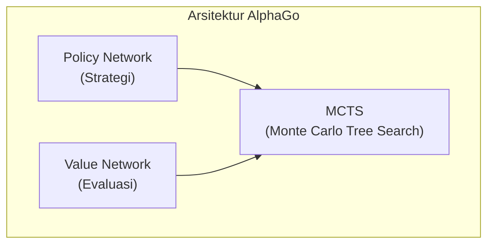
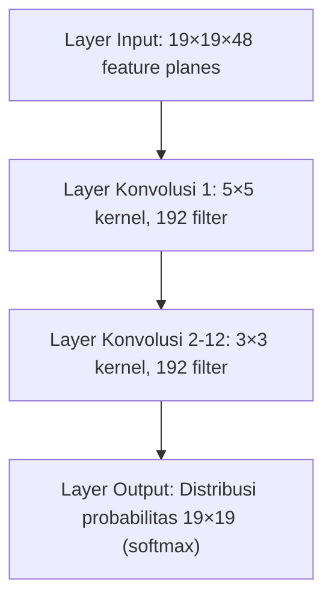
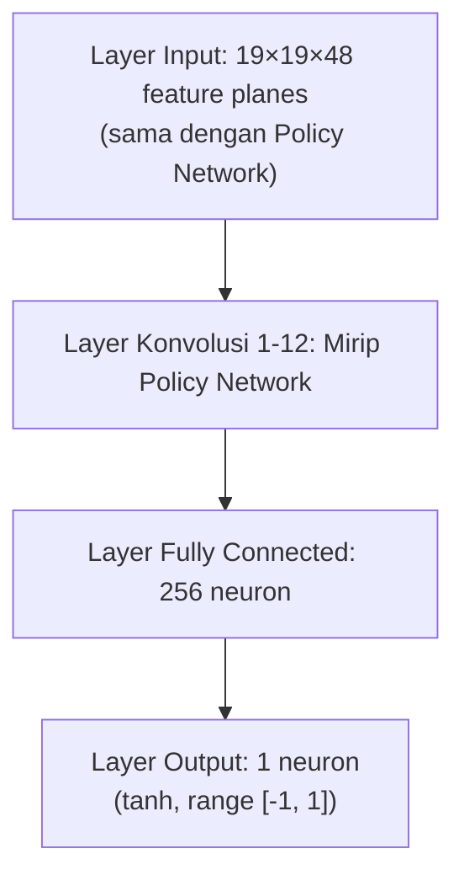
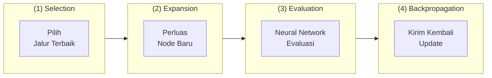
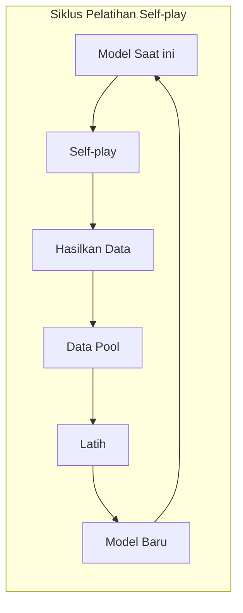
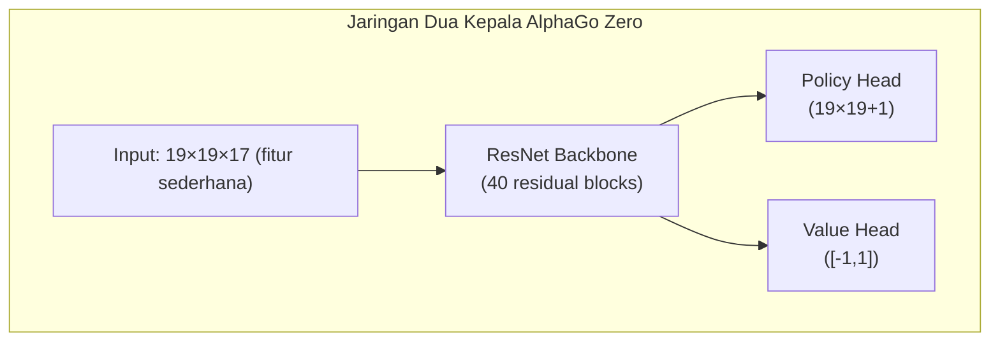

# Pembahasan Makalah AlphaGo

Artikel ini menganalisis secara mendalam makalah klasik yang diterbitkan DeepMind di Nature "Mastering the game of Go with deep neural networks and tree search", serta makalah lanjutan AlphaGo Zero dan AlphaZero.

## Signifikansi Sejarah AlphaGo

Go telah lama dianggap sebagai tantangan "Cawan Suci" kecerdasan buatan. Berbeda dengan catur internasional, ruang pencarian Go sangat besar:

| Permainan | Rata-rata Branching Factor | Rata-rata Panjang Permainan | State Space |
|------|-------------|-------------|----------|
| Catur Internasional | ~35 | ~80 | ~10^47 |
| Go | ~250 | ~150 | ~10^170 |

Metode brute-force search tradisional sama sekali tidak dapat diterapkan pada Go. AlphaGo mengalahkan Lee Sedol pada 2016 membuktikan kekuatan kombinasi deep learning dan reinforcement learning.

### Peristiwa Tonggak

- **Oktober 2015**: AlphaGo Fan mengalahkan juara Eropa Fan Hui 5:0 (profesional 2-dan)
- **Maret 2016**: AlphaGo Lee mengalahkan juara dunia Lee Sedol 4:1 (profesional 9-dan)
- **Mei 2017**: AlphaGo Master mengalahkan peringkat satu dunia Ke Jie 3:0
- **Oktober 2017**: AlphaGo Zero dipublikasikan, pelatihan self-play murni, melampaui semua versi sebelumnya

## Arsitektur Teknis Inti

Inovasi inti AlphaGo adalah menggabungkan tiga teknologi kunci:



### Policy Network (Jaringan Strategi)

Policy Network bertanggung jawab memprediksi probabilitas bermain di setiap posisi, digunakan untuk memandu arah pencarian.

#### Arsitektur Jaringan



#### Fitur Input

AlphaGo menggunakan 48 feature planes sebagai input:

| Fitur | Jumlah Plane | Deskripsi |
|------|--------|------|
| Warna batu | 3 | Batu hitam, batu putih, titik kosong |
| Jumlah liberti | 8 | 1 liberti, 2 liberti, ..., 8 liberti atau lebih |
| Liberti setelah penangkapan | 8 | Berapa liberti setelah menangkap |
| Jumlah tangkapan | 8 | Berapa batu yang dapat ditangkap di posisi itu |
| Ko | 1 | Apakah posisi ko |
| Legalitas bermain | 1 | Apakah posisi itu dapat dimainkan |
| Posisi 1-8 langkah terakhir | 8 | Posisi beberapa langkah sebelumnya |
| Giliran siapa | 1 | Saat ini giliran hitam atau putih |

#### Metode Pelatihan

Pelatihan Policy Network dibagi dua tahap:

**Tahap Pertama: Supervised Learning (SL Policy Network)**
- Menggunakan 30 juta permainan dari server Go KGS
- Tujuan: Memprediksi langkah berikutnya pemain manusia
- Mencapai akurasi prediksi 57%

**Tahap Kedua: Reinforcement Learning (RL Policy Network)**
- Mulai dari SL Policy Network
- Self-play melawan versi sebelumnya
- Optimisasi menggunakan algoritma REINFORCE

```python
# Simplified Policy Gradient update
# reward: +1 menang, -1 kalah
loss = -log(policy[action]) * reward
```

### Value Network (Jaringan Nilai)

Value Network mengevaluasi tingkat kemenangan posisi saat ini, digunakan untuk mengurangi kedalaman pencarian.

#### Arsitektur Jaringan



#### Metode Pelatihan

Value Network dilatih menggunakan 30 juta posisi dari self-play RL Policy Network:

- Sampel acak satu posisi dari setiap permainan
- Gunakan hasil akhir menang-kalah sebagai label
- Gunakan fungsi loss MSE

```python
# Pelatihan Value Network
value_prediction = value_network(position)
loss = (value_prediction - game_outcome) ** 2
```

**Mengapa hanya mengambil satu sampel per permainan?**

Jika mengambil banyak sampel, posisi berdekatan dari permainan yang sama akan sangat berkorelasi, menyebabkan overfitting. Sampling acak memastikan keragaman data pelatihan.

## Monte Carlo Tree Search (MCTS)

MCTS adalah inti pengambilan keputusan AlphaGo, menggabungkan neural network untuk pencarian langkah terbaik yang efisien.

### Empat Langkah MCTS



### Formula Seleksi (PUCT)

AlphaGo menggunakan formula PUCT (Predictor + UCT) untuk memilih cabang yang akan dieksplorasi:

```
a = argmax[Q(s,a) + u(s,a)]

u(s,a) = c_puct * P(s,a) * sqrt(N(s)) / (1 + N(s,a))
```

Di mana:
- **Q(s,a)**: Nilai rata-rata aksi a (exploitation)
- **P(s,a)**: Probabilitas prior yang diprediksi Policy Network
- **N(s)**: Jumlah kunjungan parent node
- **N(s,a)**: Jumlah kunjungan aksi tersebut
- **c_puct**: Konstanta eksplorasi, menyeimbangkan exploration dan exploitation

### Penjelasan Detail Proses Pencarian

1. **Selection**: Dari root node, gunakan formula PUCT untuk memilih aksi, sampai mencapai leaf node
2. **Expansion**: Perluas child node baru di leaf node, gunakan Policy Network untuk menginisialisasi probabilitas prior
3. **Evaluation**: Gabungkan evaluasi Value Network dan simulasi bermain cepat (Rollout) untuk mengevaluasi nilai
4. **Backpropagation**: Kirim nilai evaluasi kembali melalui jalur, perbarui nilai Q dan N

### Rollout (Bermain Cepat)

AlphaGo (bukan versi Zero) juga menggunakan jaringan strategi kecil dan cepat untuk simulasi:

```
Leaf node → Bermain acak cepat sampai akhir permainan → Hitung menang-kalah
```

Nilai evaluasi akhir menggabungkan Value Network dan Rollout:

```
V = λ * v_network + (1-λ) * v_rollout
```

AlphaGo menggunakan λ = 0.5, memberikan bobot yang sama untuk keduanya.

## Metode Pelatihan Self-play

Self-play adalah strategi pelatihan inti AlphaGo, memungkinkan AI terus meningkat melalui bermain melawan dirinya sendiri.

### Siklus Pelatihan



### Mengapa Self-play Efektif?

1. **Data tak terbatas**: Tidak dibatasi oleh jumlah catatan permainan manusia
2. **Kesulitan adaptif**: Kekuatan lawan meningkat seiring dengan diri sendiri
3. **Eksplorasi inovasi**: Tidak dibatasi pola pikir manusia yang ada
4. **Tujuan jelas**: Langsung mengoptimalkan tingkat kemenangan, bukan meniru manusia

## Perbaikan AlphaGo Zero

AlphaGo Zero yang dipublikasikan tahun 2017 membawa perbaikan revolusioner:

### Perbedaan Utama

| Fitur | AlphaGo | AlphaGo Zero |
|------|---------|--------------|
| Pelatihan awal | Supervised learning catatan manusia | Sepenuhnya dari nol |
| Arsitektur jaringan | Policy/Value terpisah | Jaringan tunggal dua kepala |
| Struktur jaringan | CNN biasa | ResNet |
| Feature engineering | 48 fitur handcrafted | 17 fitur sederhana |
| Rollout | Diperlukan | Tidak diperlukan |
| Waktu pelatihan | Berbulan-bulan | 3 hari melampaui manusia |

### Penyederhanaan Arsitektur



### Fitur Input yang Disederhanakan

AlphaGo Zero hanya menggunakan 17 feature planes:

- 8 planes: Posisi batu diri sendiri untuk 8 langkah terakhir
- 8 planes: Posisi batu lawan untuk 8 langkah terakhir
- 1 plane: Giliran siapa saat ini (semua 0 atau semua 1)

### Perbaikan Pelatihan

1. **Self-play murni**: Tidak menggunakan data manusia sama sekali
2. **Langsung gunakan probabilitas MCTS sebagai target pelatihan**: Bukan menang-kalah biner
3. **Tanpa Rollout**: Sepenuhnya bergantung pada Value Network
4. **Pelatihan jaringan tunggal**: Policy dan Value berbagi parameter, saling memperkuat

## Generalisasi AlphaZero

AlphaZero yang dipublikasikan akhir 2017 menerapkan arsitektur yang sama pada Go, catur internasional, dan shogi Jepang:

### Fitur Utama

- **Nol pengetahuan domain**: Tidak menggunakan pengetahuan domain spesifik selain aturan permainan
- **Arsitektur terpadu**: Satu set algoritma yang sama berlaku untuk berbagai jenis catur
- **Pelatihan lebih cepat**:
  - Go: 8 jam melampaui AlphaGo Lee
  - Catur internasional: 4 jam melampaui Stockfish
  - Shogi: 2 jam melampaui Elmo

### Perbedaan dengan AlphaGo Zero

| Fitur | AlphaGo Zero | AlphaZero |
|------|-------------|-----------|
| Target permainan | Hanya Go | Go, catur internasional, shogi |
| Pemanfaatan simetri | Memanfaatkan 8-fold simetri Go | Tidak mengasumsikan simetri |
| Tuning hyperparameter | Dioptimalkan untuk Go | Pengaturan universal |
| Metode pelatihan | Self-play model terbaik | Self-play model terbaru |

## Poin Penting Implementasi

Jika Anda ingin mengimplementasikan sistem serupa, berikut pertimbangan utama:

### Sumber Daya Komputasi

Pelatihan AlphaGo memerlukan sumber daya komputasi yang besar:

- **AlphaGo Lee**: 176 GPU + 48 TPU
- **AlphaGo Zero**: 4 TPU (pelatihan) + 1 TPU (self-play)
- **AlphaZero**: 5000 TPU (pelatihan)

### Hyperparameter Utama

```python
# Terkait MCTS
num_simulations = 800     # Jumlah simulasi pencarian per langkah
c_puct = 1.5              # Konstanta eksplorasi
temperature = 1.0         # Parameter suhu untuk memilih aksi

# Terkait pelatihan
batch_size = 2048
learning_rate = 0.01      # Dengan decay
l2_regularization = 1e-4
```

### Masalah Umum

1. **Pelatihan tidak stabil**: Gunakan learning rate lebih kecil, tingkatkan batch size
2. **Overfitting**: Pastikan keragaman data pelatihan, gunakan regularisasi
3. **Efisiensi pencarian**: Optimalkan batch inference GPU, paralelisasi MCTS

## Bacaan Lanjutan

- [Makalah asli: Mastering the game of Go with deep neural networks and tree search](https://www.nature.com/articles/nature16961)
- [Makalah AlphaGo Zero: Mastering the game of Go without human knowledge](https://www.nature.com/articles/nature24270)
- [Makalah AlphaZero: A general reinforcement learning algorithm that masters chess, shogi, and Go through self-play](https://www.science.org/doi/10.1126/science.aar6404)

Setelah memahami teknologi AlphaGo, selanjutnya mari kita lihat [bagaimana KataGo melakukan perbaikan berdasarkan ini](./katago-paper.md).

