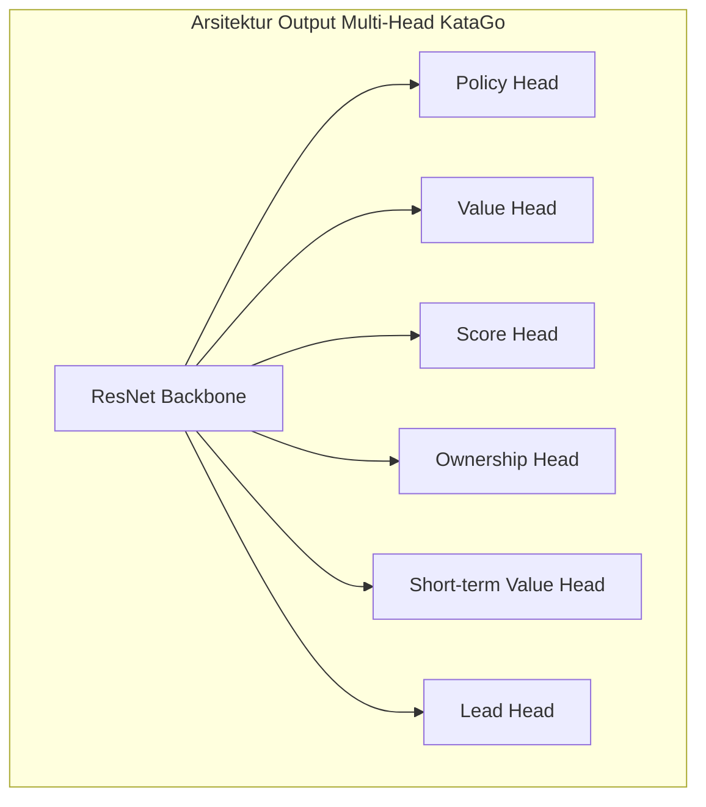
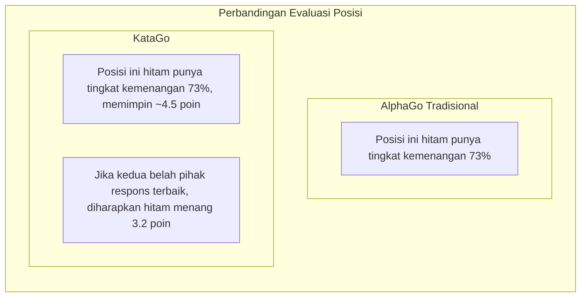

# Pembahasan Makalah KataGo

KataGo dikembangkan oleh David Wu, makalahnya "Accelerating Self-Play Learning in Go" diterbitkan pada tahun 2019. KataGo mencapai kemampuan bermain yang melampaui ELF OpenGo dengan sumber daya komputasi lebih sedikit, menjadi AI Go open source terkuat saat ini.

## Titik Inovasi KataGo

KataGo tidak membuat perubahan revolusioner pada arsitektur neural network, melainkan melakukan optimisasi sistematis pada metode pelatihan dan tugas tambahan, mencapai peningkatan efisiensi yang signifikan.

### Ikhtisar Inovasi Inti

| Titik Inovasi | Efek |
|--------|------|
| Target pelatihan tambahan | Mempercepat pembelajaran, menyediakan lebih banyak sinyal supervisi |
| Struktur global pooling | Menangkap informasi global dengan lebih baik |
| Dukungan berbagai aturan | Satu model beradaptasi dengan berbagai aturan pertandingan |
| Randomisasi Playout Cap | Meningkatkan efisiensi pelatihan |
| Perbaikan augmentasi data | Meningkatkan keragaman data pelatihan |

## Metode Pelatihan yang Lebih Efisien

### Target Pelatihan Tambahan (Auxiliary Training Targets)

AlphaGo Zero tradisional hanya memiliki dua target pelatihan:
1. Policy: Memprediksi distribusi probabilitas bermain MCTS
2. Value: Memprediksi hasil menang-kalah permainan

KataGo menambahkan beberapa target pelatihan tambahan, menyediakan sinyal pembelajaran yang lebih kaya:



#### Penjelasan Setiap Output Head

| Output Head | Dimensi | Target Prediksi |
|--------|------|----------|
| **Policy** | 19×19+1 | Probabilitas bermain di setiap posisi (termasuk Pass) |
| **Value** | 3 | Probabilitas menang/kalah/seri |
| **Score** | Nilai kontinu | Prediksi selisih poin akhir |
| **Ownership** | 19×19 | Kepemilikan akhir setiap titik (wilayah hitam/putih) |
| **Short-term Value** | 1 | Tingkat kemenangan yang diharapkan dalam jangka pendek |
| **Lead** | 1 | Seberapa banyak poin memimpin saat ini |

### Mengapa Target Tambahan Efektif?

1. **Sinyal supervisi lebih padat**: Value hanya menyediakan satu nilai, sedangkan Ownership menyediakan 361 titik supervisi
2. **Mengurangi overfitting**: Multi-task learning memiliki efek regularisasi
3. **Mempercepat konvergensi**: Tugas tambahan membantu jaringan lebih cepat mempelajari representasi fitur yang berguna
4. **Menyediakan gradien lebih baik**: Menghindari masalah vanishing gradient

### Randomisasi Playout Cap

AlphaGo Zero setiap langkah tetap melakukan 800 simulasi MCTS. KataGo memperkenalkan randomisasi:

```python
# Cara tradisional
num_playouts = 800  # Tetap

# Cara KataGo
playout_cap = random.choice([
    100, 200, 300, 400, 500, 600, 700, 800
])
```

**Manfaat**:
- Data pelatihan lebih beragam
- Model belajar membuat penilaian yang masuk akal di berbagai kedalaman pencarian
- Performa tetap baik saat bermain nyata meskipun jumlah pencarian lebih sedikit

### Perbaikan Augmentasi Data

Metode tradisional memanfaatkan 8-fold simetri Go (4 rotasi × 2 mirror) untuk augmentasi data. KataGo lebih meningkatkan:

- **Transformasi simetri acak**: Pilih transformasi simetri secara acak setiap sampling
- **Randomisasi state historis**: Pilih acak cara representasi papan historis
- **Randomisasi warna**: Tukar acak perspektif hitam-putih

## Dukungan Berbagai Aturan Go

Ini adalah salah satu fitur penting KataGo. Aturan Go berbeda mempengaruhi keputusan strategis:

### Perbedaan Aturan Utama

| Sistem Aturan | Cara Menghitung | Komi | Aturan Ko | Bunuh Diri |
|---------|---------|------|---------|------|
| Aturan Tiongkok | Counting stones | 7.5 poin | Simple ko | Dilarang |
| Aturan Jepang | Counting territory | 6.5 poin | Superko | Dilarang |
| Aturan Korea | Counting territory | 6.5 poin | Superko | Dilarang |
| Aturan Ing | Counting stones | 8 poin | Aturan ko khusus | Dilarang |
| Tromp-Taylor | Counting stones | Adjustable | Superko | Diizinkan |
| Aturan AGA | Stones/territory | 7.5 poin | Superko | Dilarang |
| Aturan New Zealand | Counting stones | 7 poin | Simple ko | Diizinkan |

### Implementasi Teknis

KataGo mengkodekan informasi aturan sebagai fitur input:

```python
# Contoh fitur input terkait aturan
rule_features = {
    'komi': 7.5,           # Nilai komi
    'scoring_rule': 'area', # Counting stones/territory
    'ko_rule': 'simple',    # Aturan pertempuran ko
    'suicide_allowed': False,
    'tax_rule': 'none',     # Apakah ada "pajak mata"
    # ...
}
```

Jaringan belajar menyesuaikan strategi berdasarkan aturan berbeda. Misalnya:
- Counting territory lebih menekankan kontrol wilayah
- Saat bunuh diri diizinkan dapat digunakan untuk taktik khusus
- Komi berbeda mempengaruhi pilihan pembukaan

## Prediksi Tingkat Kemenangan dan Poin Secara Bersamaan

Ini adalah salah satu fitur paling praktis KataGo, sangat bernilai untuk pengajaran dan analisis Go.

### Value vs Score



### Nilai Aplikasi Praktis

1. **Penilaian posisi lebih presisi**:
   - Tingkat kemenangan 80% tapi hanya memimpin 1 poin → Masih ada variabel
   - Tingkat kemenangan 80% dan memimpin 20 poin → Permainan sudah ditentukan

2. **Bantuan pengajaran**:
   - Membuat siswa memahami satu langkah "rugi berapa poin"
   - Membandingkan selisih poin cara bermain berbeda

3. **Analisis permainan handicap**:
   - Evaluasi akurat apakah handicap sesuai
   - Menilai apakah harus menyerang atau bertahan

### Score Distribution

KataGo tidak hanya memprediksi satu angka poin, tetapi memprediksi distribusi poin lengkap:

```
Contoh distribusi poin:
├─ Hitam menang 10 poin atau lebih: 15%
├─ Hitam menang 5-10 poin: 25%
├─ Hitam menang 0-5 poin: 20%
├─ Putih menang 0-5 poin: 18%
├─ Putih menang 5-10 poin: 15%
└─ Putih menang 10 poin atau lebih: 7%

Nilai harapan: Hitam +3.2 poin
Standar deviasi: ±8.5 poin
```

Informasi distribusi ini dapat lebih baik mencerminkan kompleksitas dan ketidakpastian posisi.

## Ownership Map (Peta Kepemilikan)

Ownership memprediksi apakah setiap titik di akhir permainan milik hitam atau putih:

```
                  Ownership Map
    A B C D E F G H J K L M N O P Q R S T
19  ○ ○ ○ ○ ○ ○ · · · · · · · ● ● ● ● ● ●
18  ○ ○ ○ ○ ○ ○ · · · · · · · ● ● ● ● ● ●
17  ○ ○ ○ ○ ○ · · · · · · · · · ● ● ● ● ●
16  ○ ○ ○ ╋ · · · · · ╋ · · · · · ╋ ● ● ●
...

Legenda: ○ = Wilayah putih  ● = Wilayah hitam  · = Belum ditentukan
```

### Skenario Aplikasi

- **Analisis posisi**: Sekilas melihat area pengaruh kedua belah pihak
- **Penilaian hidup-mati**: Menilai apakah kelompok batu masih bisa diselamatkan
- **Perhitungan yose**: Mengevaluasi nilai yose di berbagai tempat
- **Demonstrasi pengajaran**: Visualisasi konsep wilayah

## Perbandingan Perbedaan dengan AlphaGo

| Aspek | AlphaGo Zero | KataGo |
|------|-------------|--------|
| **Target pelatihan** | Policy + Value | Target tambahan berganda |
| **Output informasi** | Tingkat kemenangan | Tingkat kemenangan + Poin + Wilayah |
| **Dukungan aturan** | Aturan tunggal | Berbagai aturan |
| **Struktur jaringan** | ResNet konvolusi murni | Ditambah global pooling |
| **Jumlah pencarian** | Tetap | Diacak |
| **Efisiensi pelatihan** | Baseline | Sekitar 50x peningkatan efisiensi |
| **Tingkat open source** | Deskripsi makalah | Open source lengkap |

### Perbandingan Efisiensi Pelatihan

```
Sumber daya yang dibutuhkan untuk mencapai level ELF OpenGo:

ELF OpenGo:
- 2000 GPU
- 2 minggu pelatihan

KataGo:
- 1 GPU (atau puluhan GPU untuk percepatan)
- Beberapa hari sampai beberapa minggu

Peningkatan efisiensi: Sekitar 50-100x
```

## Detail Arsitektur Jaringan

### Global Pooling

CNN tradisional hanya dapat melihat informasi lokal, KataGo menambahkan layer global pooling untuk menangkap fitur global:

```python
class GlobalPoolingBlock(nn.Module):
    def forward(self, x):
        # x: [batch, channels, 19, 19]

        # Global average pooling
        global_avg = x.mean(dim=[2, 3])  # [batch, channels]

        # Global max pooling
        global_max = x.max(dim=2)[0].max(dim=1)[0]  # [batch, channels]

        # Gabungkan fitur global
        global_features = torch.cat([global_avg, global_max], dim=1)

        # Proses fitur global
        global_features = dense_layer(global_features)  # [batch, C]

        # Broadcast kembali ke dimensi spasial dan gabung dengan jalur reguler
        global_broadcast = broadcast_to_spatial(global_features)
        return torch.cat([x, global_broadcast], dim=1)
```

**Manfaat**:
- Dapat merasakan situasi global (seperti siapa yang memimpin)
- Lebih baik menangani posisi yang memerlukan penilaian global
- Sangat membantu untuk prediksi poin

### Ukuran Jaringan

KataGo menyediakan model dengan ukuran berbeda:

| Model | Jumlah Residual Block | Jumlah Channel | Parameter | Skenario Cocok |
|------|---------|--------|--------|----------|
| b10c128 | 10 | 128 | ~5M | Operasi CPU |
| b15c192 | 15 | 192 | ~15M | GPU umum |
| b20c256 | 20 | 256 | ~35M | GPU menengah |
| b40c256 | 40 | 256 | ~70M | GPU high-end |
| b60c320 | 60 | 320 | ~150M | GPU top-tier |

## Performa Aktual

### Evaluasi Kemampuan Bermain

Performa KataGo di berbagai tes:

- Melampaui semua jaringan Leela Zero
- Mempertahankan tingkat kemenangan tinggi saat bermain melawan profesional 9-dan
- Peringkat pertama di CGOS (Computer Go Server)

### Fitur Analisis

Mode analisis KataGo menyediakan:

```json
{
  "moveInfos": [
    {
      "move": "Q16",
      "visits": 3420,
      "winrate": 0.573,
      "scoreLead": 2.8,
      "pv": ["Q16", "D4", "Q4", "D16"],
      "ownership": [...]
    }
  ],
  "rootInfo": {
    "winrate": 0.48,
    "scoreLead": -0.5,
    "visits": 10000
  }
}
```

## Bacaan Lanjutan

- [Makalah KataGo: Accelerating Self-Play Learning in Go](https://arxiv.org/abs/1902.10565)
- [Proyek GitHub KataGo](https://github.com/lightvector/KataGo)
- [Log pelatihan dan analisis KataGo](https://katagotraining.org/)

Setelah memahami fitur teknis KataGo, mari kita lihat [perkembangan AI Go lainnya](./zen.md), untuk memiliki pemahaman yang lebih komprehensif tentang seluruh industri.

