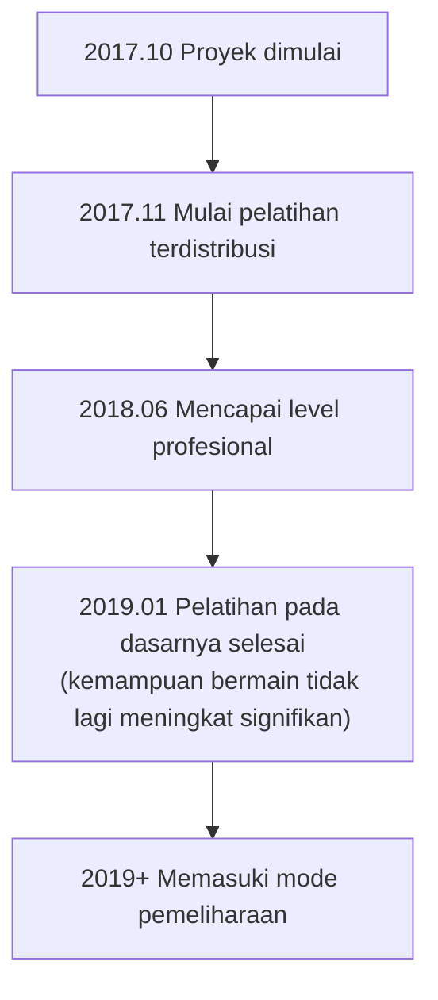

# Pengenalan AI Go Lainnya

Selain AlphaGo dan KataGo, bidang AI Go masih memiliki banyak proyek penting. Artikel ini akan memperkenalkan AI komersial dan open source utama, membantu Anda memahami seluruh ekosistem.

## AI Go Komersial

### Tengen (Zen)

**Pengembang**: Yoji Ojima / Jepang
**Pertama kali dipublikasikan**: 2009
**Lisensi**: Lisensi komersial

Tengen adalah salah satu program Go terkuat sebelum AlphaGo, sudah mencapai level profesional di era MCTS tradisional.

#### Sejarah Perkembangan

| Waktu | Versi | Tonggak Sejarah |
|------|------|--------|
| 2009 | Zen 1.0 | Pertama kali dirilis |
| 2011 | Zen 4 | Mencapai level amatir 6-dan |
| 2012 | Zen 5 | Mengalahkan Takemiya Masaki 9-dan dengan handicap 4 batu |
| 2016 | Zen 7 | Mengadopsi teknologi deep learning |
| 2017+ | Deep Zen Go | Menggabungkan arsitektur AlphaGo |

#### Fitur Teknis

- **Arsitektur hybrid**: Menggabungkan heuristik tradisional dan deep learning
- **Optimisasi komersial**: Dioptimalkan untuk hardware consumer
- **Stabilitas tinggi**: Terverifikasi melalui bertahun-tahun penggunaan komersial
- **Dukungan multi-platform**: Dapat berjalan di Windows, macOS

#### Bentuk Produk

- **Tengen no Go**: Software desktop, harga sekitar 10.000 Yen
- **Bermain online**: Pernah aktif di KGS dengan akun Zen19

---

### Jueyi (Fine Art)

**Pengembang**: Tencent AI Lab / Tiongkok
**Pertama kali dipublikasikan**: 2016
**Lisensi**: Tidak terbuka

Jueyi adalah AI Go yang dikembangkan Tencent, memiliki pengaruh penting di dunia Go Tiongkok.

#### Sejarah Perkembangan

| Waktu | Peristiwa |
|------|------|
| November 2016 | Pertama kali muncul, bermain di Yehu Go |
| Maret 2017 | Juara UEC Cup Computer Go Tournament |
| 2017 | Diadopsi tim nasional Go Tiongkok sebagai alat pelatihan |
| 2018 | Juara World AI Go Tournament |
| Berlanjut hingga sekarang | Terus menjadi bantuan pelatihan tim nasional |

#### Fitur Teknis

- **Pelatihan skala besar**: Menggunakan sumber daya cloud computing Tencent
- **Bekerja sama dengan pemain top manusia**: Mendapat banyak bimbingan profesional
- **Pengalaman bermain nyata kaya**: Mengumpulkan banyak permainan di Yehu Go
- **Integrasi fungsi pengajaran**: Menyediakan fitur analisis review

#### Pengaruh

Pengaruh Jueyi pada Go profesional Tiongkok sangat mendalam:

- Menjadi alat pelatihan standar tim nasional
- Mengubah cara persiapan pemain profesional
- Mendorong popularisasi pelatihan berbantuan AI

---

### Xingzhen (Golaxy)

**Pengembang**: Shenzhen Deepin Technology / Tim Universitas Tsinghua, Tiongkok
**Pertama kali dipublikasikan**: 2018
**Lisensi**: Lisensi komersial

Xingzhen memiliki tujuan desain "AI paling mirip manusia", gaya bermainnya lebih mendekati pemain manusia.

#### Fitur Teknis

- **Gaya bermain manusiawi**: Sengaja dilatih untuk bermain lebih seperti manusia
- **Kesulitan dapat disesuaikan**: Dapat mensimulasikan lawan dari berbagai tingkat
- **Berorientasi pengajaran**: Desain mempertimbangkan aplikasi pengajaran
- **Spesialisasi permainan handicap**: Memiliki optimisasi khusus untuk permainan handicap

#### Aplikasi Produk

- **Yike Go**: Terintegrasi dalam aplikasi Yike
- **Platform pengajaran**: Digunakan untuk pengajaran Go online
- **Tes tingkat**: Menyediakan evaluasi tingkat terstandar

---

### AI Komersial Lainnya

| Nama | Pengembang | Fitur |
|------|--------|------|
| **Shizifengbo** | Lin Zaifan (Taiwan) | Pernah menjuarai UEC Cup |
| **CGI** | Universitas Chiao Tung (Taiwan) | Berorientasi penelitian akademis |
| **Dolbaram** | NHN Korea | Terintegrasi dalam platform Go Korea |
| **AQ** | Tim AQ Jepang | Menjadi komersial setelah open source |

## AI Go Open Source

### Leela Zero

**Pengembang**: Gian-Carlo Pascutto / Belgia
**Pertama kali dipublikasikan**: 2017
**Lisensi**: GPL-3.0
**GitHub**: https://github.com/leela-zero/leela-zero

Leela Zero adalah proyek open source pertama yang berhasil mereplikasi AlphaGo Zero, dilatih secara terdistribusi oleh komunitas.

#### Sejarah Perkembangan



#### Fitur Teknis

- **Reproduksi setia**: Diimplementasikan ketat sesuai makalah AlphaGo Zero
- **Pelatihan terdistribusi**: Sukarelawan global berkontribusi komputasi GPU
- **Sepenuhnya transparan**: Semua data pelatihan dan model terbuka
- **GTP standar**: Kompatibel dengan semua software Go GTP

#### Statistik Pelatihan

| Item | Nilai |
|------|------|
| Total permainan self-play | Sekitar 18 juta permainan |
| Iterasi pelatihan | Sekitar 270 kali |
| Kontributor yang berpartisipasi | Ribuan orang |
| Durasi pelatihan | Sekitar 1,5 tahun |

#### Cara Penggunaan

```bash
# Instalasi
brew install leela-zero  # macOS

# Menjalankan
leelaz --gtp --weights best-network.gz

# Perintah GTP
genmove black
play white D4
```

#### Status Saat Ini

Meskipun Leela Zero sudah tidak aktif dilatih, tetapi:
- Kode masih merupakan sumber belajar yang bagus untuk AlphaGo Zero
- Model yang sudah dilatih masih dapat digunakan
- Komunitas masih memelihara fungsi dasar

---

### ELF OpenGo

**Pengembang**: Facebook AI Research (FAIR)
**Pertama kali dipublikasikan**: 2018
**Lisensi**: BSD
**GitHub**: https://github.com/pytorch/ELF

ELF OpenGo adalah AI Go yang dikembangkan Facebook, menunjukkan kemampuan pelatihan terdistribusi skala besar.

#### Fitur Teknis

- **Framework ELF**: Berdasarkan platform penelitian game ELF (Extensive, Lightweight, and Flexible) Facebook
- **Pelatihan skala besar**: Menggunakan 2000 GPU untuk pelatihan
- **Implementasi PyTorch**: Menggunakan framework deep learning milik Facebook
- **Berorientasi penelitian**: Tujuan utama adalah penelitian bukan praktis

#### Performa

- Mencapai level puncak di KGS
- Memiliki tingkat kemenangan stabil saat bermain melawan profesional 9-dan
- Makalah diterbitkan di konferensi top

#### Status Saat Ini

- Proyek sudah tidak aktif dipelihara
- Kode dan model masih dapat diunduh
- Nilai utama dalam referensi akademis

---

### SAI (Sensible Artificial Intelligence)

**Pengembang**: Tim SAI / Eropa
**Pertama kali dipublikasikan**: 2019
**Lisensi**: MIT
**GitHub**: https://github.com/sai-dev/sai

SAI adalah versi perbaikan berdasarkan Leela Zero, fokus pada fitur eksperimental.

#### Fitur Teknis

- **Metode pelatihan yang diperbaiki**: Mengeksperimen berbagai optimisasi pelatihan
- **Dukungan lebih banyak aturan**: Mendukung lebih banyak aturan Go daripada Leela Zero
- **Fitur eksperimental**: Menguji arsitektur jaringan dan teknik pelatihan baru

#### Status Saat Ini

- Masih ada pemeliharaan komunitas skala kecil
- Terutama digunakan untuk eksperimen dan pembelajaran

---

### PhoenixGo

**Pengembang**: Tim WeChat Tencent
**Pertama kali dipublikasikan**: 2018
**Lisensi**: BSD-3
**GitHub**: https://github.com/Tencent/PhoenixGo

PhoenixGo adalah AI Go open source Tencent, pernah memenangkan World AI Go Tournament 2018.

#### Fitur Teknis

- **Kualitas komersial**: Berasal dari proyek internal Tencent
- **Implementasi TensorFlow**: Menggunakan framework mainstream
- **Dukungan multi-platform**: Linux, Windows, macOS
- **Dukungan terdistribusi**: Dapat berjalan di lingkungan multi-mesin multi-kartu

#### Cara Penggunaan

```bash
# Kompilasi
bazel build //src:mcts_main

# Menjalankan
./mcts_main --gtp --config_path=config.conf
```

---

### MiniGo

**Pengembang**: Google Brain
**Pertama kali dipublikasikan**: 2018
**Lisensi**: Apache-2.0
**GitHub**: https://github.com/tensorflow/minigo

MiniGo adalah AI Go bersifat edukatif yang di-open source Google, bertujuan membuat lebih banyak orang memahami prinsip AlphaGo.

#### Fitur Teknis

- **Berorientasi edukasi**: Kode jelas dan mudah dibaca
- **Implementasi TensorFlow**: Contoh resmi Google
- **Dokumentasi lengkap**: Ada penjelasan teknis detail
- **Dukungan Colab**: Dapat langsung dijalankan di Google Colab

#### Skenario Cocok

- Mempelajari arsitektur AlphaGo Zero
- Memahami aplikasi reinforcement learning dalam permainan
- Sebagai titik awal proyek sendiri

## Perbandingan Fitur Berbagai AI

### Perbandingan Kemampuan Bermain (Perkiraan)

| AI | Level Kemampuan | Catatan |
|----|---------|------|
| KataGo | Super manusia tingkat atas | Terus dilatih |
| Jueyi | Super manusia tingkat atas | Tidak terbuka |
| Leela Zero | Super manusia | Sudah berhenti dilatih |
| ELF OpenGo | Super manusia | Sudah berhenti dilatih |
| PhoenixGo | Hampir super manusia | Sudah berhenti dilatih |
| Tengen | Level profesional | Produk komersial |
| Xingzhen | Level profesional | Kesulitan dapat disesuaikan |

### Perbandingan Fitur

| Fitur | KataGo | Leela Zero | PhoenixGo | Tengen |
|------|--------|------------|-----------|------|
| Open source | ✓ | ✓ | ✓ | ✗ |
| Prediksi poin | ✓ | ✗ | ✗ | △ |
| Dukungan multi-aturan | ✓ | ✗ | ✗ | ✗ |
| Analysis API | ✓ | ✗ | ✗ | ✗ |
| Mode CPU | ✓ | ✓ | ✓ | ✓ |
| Terus diperbarui | ✓ | ✗ | ✗ | △ |

### Saran Skenario Cocok

| Kebutuhan | Pilihan yang Direkomendasikan | Alasan |
|------|---------|------|
| Bermain/analisis umum | KataGo | Terkuat dan fitur terlengkap |
| Mempelajari AlphaGo | Leela Zero / MiniGo | Kode jelas |
| Aplikasi komersial | Tengen / KataGo pelatihan sendiri | Lisensi jelas |
| Bantuan pengajaran | KataGo / Xingzhen | Memiliki fitur analisis kaya |
| Eksperimen penelitian | KataGo / SAI | Dapat memodifikasi pelatihan |

## Tren Perkembangan Masa Depan

### Tren Teknis

1. **Metode pelatihan lebih efisien**
   - Seperti peningkatan efisiensi yang ditunjukkan KataGo
   - Sumber daya lebih sedikit mencapai kemampuan lebih tinggi

2. **Interpretabilitas lebih baik**
   - Menjelaskan mengapa AI bermain langkah ini
   - Membantu manusia memahami pemikiran AI

3. **Kombinasi dengan gaya manusia**
   - Melatih AI bergaya seperti pemain tertentu
   - Untuk pengajaran dan penelitian

4. **Universalitas lintas permainan**
   - Seperti yang ditunjukkan AlphaZero
   - Satu framework berlaku untuk berbagai permainan

### Tren Aplikasi

1. **Popularisasi**
   - Lebih banyak penggemar Go menggunakan analisis AI
   - Perangkat seperti ponsel juga bisa menjalankan

2. **Profesionalisasi**
   - Pemain profesional sangat bergantung pada pelatihan AI
   - Bantuan AI menjadi standar

3. **Komersialisasi**
   - Lebih banyak produk Go berbantuan AI
   - Layanan pengajaran, analisis, sparring, dll.

## Ringkasan

Ekosistem AI Go kaya dan beragam:

- **Ingin kemampuan terkuat dan fitur terlengkap**: Pilih KataGo
- **Ingin mempelajari prinsip AI**: Pelajari kode Leela Zero atau MiniGo
- **Kebutuhan aplikasi komersial**: Evaluasi Tengen atau latih model sendiri
- **Kebutuhan khusus**: Pilih atau kombinasikan penggunaan berdasarkan situasi spesifik

Selanjutnya, mari kita masuk ke sesi praktik, pelajari cara [menginstal dan menggunakan KataGo](/docs/for-engineers/katago-source/)!

