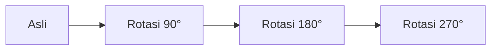
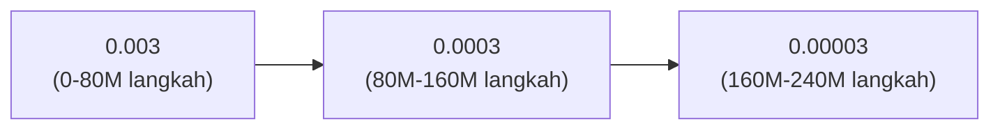

import { EloChart } from '@site/src/components/D3Charts';

# Tahap Supervised Learning

Sebelum AlphaGo dapat bermain melawan dirinya sendiri, ia perlu "melihat" sejumlah besar catatan permainan manusia terlebih dahulu. Proses ini disebut **supervised learning**.

Dengan menganalisis 30 juta posisi permainan manusia, Policy Network AlphaGo mencapai **akurasi prediksi 57%**—mampu menebak langkah selanjutnya pemain ahli manusia lebih dari separuh waktu.

Ini mungkin tidak terdengar mengejutkan, tetapi mengingat setiap posisi rata-rata memiliki 250 langkah legal, ini adalah pencapaian yang luar biasa.

---

## Mengapa Memulai dari Catatan Permainan Manusia?

### Titik Awal Pembelajaran

Bayangkan Anda ingin mengajar seseorang yang sama sekali tidak tahu Go cara bermain. Apa yang akan Anda lakukan?

**Rencana A: Eksplorasi Acak**
```
Biarkan dia bermain sembarangan, perlahan menemukan apa yang merupakan langkah bagus
→ Efisiensi sangat rendah, mungkin tidak pernah bisa belajar
```

**Rencana B: Lihat Bagaimana Ahli Bermain**
```
Biarkan dia menonton banyak pertandingan pemain profesional, meniru cara mereka bermain
→ Setelah memiliki dasar, baru eksplorasi sendiri
```

AlphaGo memilih Rencana B. Supervised learning adalah versi matematis dari "melihat bagaimana ahli bermain".

### Nilai Catatan Permainan Manusia

Manusia telah menghabiskan ribuan tahun mengembangkan teori Go. Pengetahuan ini semua dikodekan dalam catatan permainan:

- **Joseki pembukaan**: Cara pembukaan yang telah diverifikasi dalam jangka panjang
- **Taktik permainan tengah**: Kebijaksanaan transisi serangan dan pertahanan
- **Teknik yose**: Esensi perhitungan poin
- **Visi besar**: Intuisi penilaian keseluruhan

Supervised learning memungkinkan AlphaGo "mewarisi" kebijaksanaan manusia ini, tanpa perlu meraba-raba dari nol.

---

## Sumber Data Pelatihan

### KGS Go Server

Data pelatihan AlphaGo terutama berasal dari **KGS Go Server** (juga dikenal sebagai Kiseido Go Server), platform Go online yang terkenal.

#### Karakteristik KGS

| Fitur | Deskripsi |
|-------|-----------|
| Pengguna | Terutama pemain amatir, juga ada pemain profesional |
| Rentang kekuatan | Dari pemula hingga 9 dan profesional |
| Catatan permainan | Menyimpan catatan SGF lengkap |
| Periode aktif | 2000 hingga sekarang |

#### Mengapa Memilih KGS?

1. **Volume data besar**: Jutaan catatan permainan
2. **Format seragam**: Format SGF mudah diurai
3. **Memiliki label kekuatan**: Setiap pengguna memiliki peringkat
4. **Keragaman**: Pemain dengan gaya berbeda

### 30 Juta Posisi

Dari catatan permainan KGS, DeepMind mengekstrak sekitar **30 juta posisi**:

```
Data mentah:
- Sekitar 160.000 catatan permainan
- Setiap permainan sekitar 200 langkah
- Total ~32 juta posisi

Penyaringan data:
- Filter permainan peringkat rendah
- Filter posisi menyerah di tengah permainan
- Akhirnya sekitar 30 juta posisi berkualitas tinggi
```

### Format Data

Setiap sampel pelatihan berisi:

```python
{
    "board_state": [[0, 1, 2, ...], ...],  # Papan 19×19
    "features": [...],                      # 48 bidang fitur
    "next_move": 123,                       # Posisi yang dimainkan manusia (0-360)
    "game_result": 1,                       # 1=hitam menang, -1=putih menang
    "player_rank": "5d",                    # Peringkat pemain yang memainkan langkah ini
}
```

---

## Pra-pemrosesan Data

### Parsing SGF

SGF (Smart Game Format) adalah format standar untuk catatan permainan Go:

```
(;GM[1]FF[4]CA[UTF-8]AP[CGoban:3]ST[2]
RU[Japanese]SZ[19]KM[6.50]
PW[White]PB[Black]
;B[pd];W[dd];B[pq];W[dp];B[qk];W[nc]...
)
```

Perlu mengurai:
- Ukuran papan (SZ[19])
- Setiap langkah (B[pd], W[dd]...)
- Hasil permainan (RE[B+2.5])

```python
def parse_sgf(sgf_string):
    """Mengurai catatan permainan SGF"""
    moves = []
    # Ekstrak semua langkah
    pattern = r';([BW])\[([a-s]{2})\]'
    for match in re.finditer(pattern, sgf_string):
        color = match.group(1)  # 'B' or 'W'
        coord = match.group(2)  # 'pd', 'dd', etc.

        # Konversi koordinat
        x = ord(coord[0]) - ord('a')
        y = ord(coord[1]) - ord('a')

        moves.append((color, x, y))

    return moves
```

### Ekstraksi Fitur

Untuk setiap posisi, ekstrak 48 bidang fitur (lihat detail di [Desain Fitur Input](../input-features)):

```python
def extract_features(board, history, current_player):
    """Ekstrak 48 bidang fitur"""
    features = np.zeros((48, 19, 19))

    # Posisi batu
    features[0] = (board == 1)  # Batu hitam
    features[1] = (board == 2)  # Batu putih
    features[2] = (board == 0)  # Titik kosong

    # Riwayat
    for i, hist in enumerate(history[:8]):
        features[3+i] = (hist == 1)
        features[11+i] = (hist == 2)

    # Kebebasan, atari, tangkapan tangga, dll...
    # (implementasi detail dihilangkan)

    return features
```

### Augmentasi Data

Papan Go memiliki **8-fold symmetry** (4 rotasi x 2 refleksi). Setiap sampel asli dapat menjadi 8:



*Masing-masing di-flip horizontal lagi, mendapatkan 8 sampel pelatihan yang setara*

Ini meningkatkan data pelatihan efektif 8 kali lipat, sekaligus memastikan model mempelajari pola yang tidak bergantung pada arah tertentu.

```python
def augment(state, action):
    """Augmentasi 8-fold symmetry"""
    augmented = []

    for rotation in [0, 1, 2, 3]:  # 0, 90, 180, 270 derajat
        rotated_state = np.rot90(state, rotation, axes=(1, 2))
        rotated_action = rotate_action(action, rotation)
        augmented.append((rotated_state, rotated_action))

        # Flip horizontal
        flipped_state = np.flip(rotated_state, axis=2)
        flipped_action = flip_action(rotated_action)
        augmented.append((flipped_state, flipped_action))

    return augmented
```

---

## Fungsi Loss

### Cross-Entropy Loss

Supervised learning menggunakan **Cross-Entropy Loss** untuk melatih Policy Network:

```
L(θ) = -Σ log p_θ(a | s)
```

Di mana:
- `s`: Status papan
- `a`: Posisi yang sebenarnya dimainkan manusia (label)
- `p_θ(a | s)`: Probabilitas model memprediksi posisi tersebut

### Pemahaman Intuitif

Cross-entropy loss mengukur "perbedaan antara prediksi model dan label":

| Skenario | Prediksi Model | Loss | Deskripsi |
|----------|----------------|------|-----------|
| Prediksi sempurna | probabilitas a = 1.0 | 0 | Terbaik |
| Yakin dan benar | probabilitas a = 0.9 | 0.1 | Sangat bagus |
| Tidak yakin tapi benar | probabilitas a = 0.5 | 0.7 | Cukup |
| Prediksi salah | probabilitas a = 0.1 | 2.3 | Sangat buruk |
| Sepenuhnya salah | probabilitas a = 0.01 | 4.6 | Terburuk |

Fungsi loss mendorong model untuk meningkatkan probabilitas posisi yang benar.

### Perbandingan dengan MSE

Mengapa tidak menggunakan Mean Squared Error (MSE)?

```python
# MSE:
loss_mse = (prediction - target)^2

# Cross-Entropy:
loss_ce = -log(prediction[target])
```

| Karakteristik | MSE | Cross-Entropy |
|---------------|-----|---------------|
| Tipe target | Regresi (nilai kontinu) | Klasifikasi (distribusi probabilitas) |
| Perilaku gradien | Error lebih besar, gradien lebih besar | Ketika yakin tapi salah, gradien lebih besar |
| Skenario cocok | Value Network | Policy Network |

Policy Network menghasilkan distribusi probabilitas dari 361 kelas, cross-entropy adalah pilihan alami.

---

## Proses Pelatihan

### Konfigurasi Hardware

DeepMind menggunakan sumber daya komputasi yang besar:

| Sumber Daya | Jumlah |
|-------------|--------|
| GPU | 50 |
| Waktu pelatihan | Sekitar 3 minggu |
| Ukuran batch | 16 |
| Total langkah pelatihan | ~340M |

### Optimizer

Menggunakan **Stochastic Gradient Descent (SGD) + Momentum**:

```python
optimizer = torch.optim.SGD(
    model.parameters(),
    lr=0.003,         # Learning rate awal
    momentum=0.9,     # Koefisien momentum
    weight_decay=1e-4 # Regularisasi L2
)
```

#### Mengapa Menggunakan SGD daripada Adam?

Pada 2016, SGD + momentum masih merupakan pilihan utama untuk tugas gambar. Sebenarnya, penelitian selanjutnya (termasuk KataGo) menemukan bahwa optimizer tipe Adam mungkin lebih baik.

### Jadwal Learning Rate

Learning rate secara bertahap menurun selama proses pelatihan:

```python
scheduler = torch.optim.lr_scheduler.StepLR(
    optimizer,
    step_size=80_000_000,  # Setiap 80M langkah
    gamma=0.1              # Learning rate dikalikan 0.1
)
```



### Loop Pelatihan

```python
def train_epoch(model, dataloader, optimizer):
    model.train()
    total_loss = 0
    correct = 0
    total = 0

    for batch in dataloader:
        states, actions = batch

        # Forward pass
        policy = model(states)  # (batch, 361)

        # Hitung loss
        loss = F.cross_entropy(policy, actions)

        # Backward pass
        optimizer.zero_grad()
        loss.backward()
        optimizer.step()

        # Statistik
        total_loss += loss.item()
        predictions = policy.argmax(dim=1)
        correct += (predictions == actions).sum().item()
        total += actions.size(0)

    accuracy = correct / total
    avg_loss = total_loss / len(dataloader)

    return avg_loss, accuracy
```

### Kurva Pelatihan

Proses pelatihan tipikal:

```
Akurasi
60% |                    ......**********
    |              ......*
50% |        ......*
    |    ....*
40% |  ..*
    |..*
30% |*
    +───────────────────────────────────── Langkah pelatihan
    0       100M     200M     300M     340M
```

Loss dan akurasi akan meningkat dengan cepat, kemudian cenderung stabil.

---

## Analisis Hasil

### Akurasi 57%

Setelah pelatihan lengkap, Policy Network mencapai **akurasi top-1 57.0%**.

#### Apa itu Akurasi Top-1?

```
Prediksi: Model menghasilkan 361 probabilitas
Top-1: Posisi dengan probabilitas tertinggi
Akurasi: Proporsi posisi ini sama dengan posisi yang sebenarnya dimainkan manusia
```

57% berarti: Model memiliki lebih dari separuh kemungkinan untuk menebak langkah selanjutnya pemain ahli manusia.

### Perbandingan dengan Program Lain

| Program | Akurasi Top-1 | Deskripsi |
|---------|---------------|-----------|
| Pilihan acak | 0.4% | Baseline |
| Fitur tradisional + model linear | ~24% | Level 2008 |
| CNN dangkal | ~44% | Level 2014 |
| **AlphaGo Policy Network** | **57%** | Terobosan 2016 |
| AlphaGo Zero | ~60% | 2017 |

CNN dalam DeepMind meningkatkan 13 poin persentase dibandingkan metode terbaik sebelumnya.

### Evaluasi Kekuatan

Kekuatan bermain hanya menggunakan Policy Network (tanpa pencarian):

<EloChart mode="training" width={600} height={350} />

| Konfigurasi | Rating Elo | Perkiraan Level |
|-------------|------------|-----------------|
| Terkuat tradisional (Pachi) | ~2500 | Amatir 4-5 dan |
| SL Policy Network | ~2800 | Amatir 6-7 dan |

Supervised learning murni sudah mencapai level amatir tinggi, ini adalah terobosan besar pada 2016.

### Akurasi vs Kekuatan

Menariknya, akurasi dan kekuatan bukanlah hubungan linear:

```
Akurasi:  44% → 57% (peningkatan 13%)
Elo:     ~2500 → ~2800 (peningkatan ~300)

Rasio peningkatan akurasi: 13% / 44% ≈ 30%
Rasio peningkatan Elo: 300 / 2500 ≈ 12%
```

Peningkatan kecil dalam akurasi dapat membawa peningkatan kekuatan yang signifikan, karena:
- Pilihan yang benar di posisi kritis lebih penting
- Menghindari kesalahan jelas lebih penting daripada membuat banyak langkah bagus

---

## Keterbatasan Supervised Learning

### Masalah 1: Efek Ceiling

Supervised learning hanya dapat mencapai "level manusia", tidak dapat melampauinya:

```
Tujuan SL Policy: Meniru manusia
          ↓
Jika manusia memiliki kebiasaan yang salah
          ↓
SL Policy juga akan mempelajari kesalahan ini
```

Misalnya, jika pemain dalam data pelatihan jarang memainkan langkah non-tradisional seperti "Langkah 37", SL Policy juga tidak akan mempelajarinya.

### Masalah 2: Tidak Dapat Membedakan Langkah Bagus dan Buruk

Supervised learning hanya melihat "apa yang dimainkan manusia", tidak peduli apakah langkah itu bagus atau tidak:

```
Posisi A: Manusia memainkan K10 (sebenarnya langkah buruk)
Posisi B: Manusia memainkan Q4 (langkah bagus)

SL Policy memperlakukan keduanya sama, keduanya harus dipelajari
```

Data pelatihan mencakup permainan pemain amatir, yang mengandung banyak kesalahan. SL Policy akan mempelajari kesalahan ini.

### Masalah 3: Eksplorasi yang Tidak Memadai

SL Policy hanya mempelajari langkah yang sudah diketahui manusia:

```
Set langkah manusia: {A, B, C, D, E}
           ↓
SL Policy hanya akan memilih di antara langkah-langkah ini
           ↓
Mungkin ada langkah yang lebih baik F, tapi tidak pernah ditemukan
```

Ini adalah keterbatasan fundamental supervised learning: hanya dapat mempelajari apa yang ada dalam data pelatihan.

### Solusi: Reinforcement Learning

Untuk melampaui manusia, AlphaGo melakukan **reinforcement learning** setelah supervised learning:

```
SL Policy (level manusia)
      ↓ Self-play
RL Policy (melampaui manusia)
```

Lihat detail di [Pengantar Reinforcement Learning](../reinforcement-intro) dan [Self-Play](../self-play).

---

## Poin Implementasi

### Kode Pelatihan Lengkap

```python
import torch
import torch.nn as nn
import torch.optim as optim
from torch.utils.data import DataLoader, Dataset

class GoDataset(Dataset):
    def __init__(self, data_path):
        # Muat data yang telah diproses
        self.states = np.load(f"{data_path}/states.npy")
        self.actions = np.load(f"{data_path}/actions.npy")

    def __len__(self):
        return len(self.states)

    def __getitem__(self, idx):
        state = torch.FloatTensor(self.states[idx])
        action = torch.LongTensor([self.actions[idx]])[0]
        return state, action

def train_policy_network():
    # Model
    model = PolicyNetwork(input_channels=48, num_filters=192, num_layers=12)
    model = model.cuda()

    # Data
    dataset = GoDataset("data/kgs")
    dataloader = DataLoader(
        dataset, batch_size=16, shuffle=True, num_workers=4
    )

    # Optimizer
    optimizer = optim.SGD(
        model.parameters(),
        lr=0.003,
        momentum=0.9,
        weight_decay=1e-4
    )
    scheduler = optim.lr_scheduler.StepLR(optimizer, step_size=80_000_000, gamma=0.1)

    # Loop pelatihan
    best_accuracy = 0

    for epoch in range(100):
        model.train()
        total_loss = 0
        correct = 0
        total = 0

        for states, actions in dataloader:
            states = states.cuda()
            actions = actions.cuda()

            # Forward pass
            policy = model(states)
            loss = nn.functional.cross_entropy(policy, actions)

            # Backward pass
            optimizer.zero_grad()
            loss.backward()
            optimizer.step()
            scheduler.step()

            # Statistik
            total_loss += loss.item()
            predictions = policy.argmax(dim=1)
            correct += (predictions == actions).sum().item()
            total += actions.size(0)

        accuracy = correct / total
        print(f"Epoch {epoch}: Loss={total_loss/len(dataloader):.4f}, Acc={accuracy:.4f}")

        # Simpan model terbaik
        if accuracy > best_accuracy:
            best_accuracy = accuracy
            torch.save(model.state_dict(), "best_policy.pth")

    print(f"Best accuracy: {best_accuracy:.4f}")
```

### Kode Evaluasi

```python
def evaluate_policy(model, test_dataloader):
    model.eval()

    correct_top1 = 0
    correct_top5 = 0
    total = 0

    with torch.no_grad():
        for states, actions in test_dataloader:
            states = states.cuda()
            actions = actions.cuda()

            policy = model(states)

            # Akurasi Top-1
            top1_pred = policy.argmax(dim=1)
            correct_top1 += (top1_pred == actions).sum().item()

            # Akurasi Top-5
            top5_pred = policy.topk(5, dim=1)[1]
            for i, action in enumerate(actions):
                if action in top5_pred[i]:
                    correct_top5 += 1

            total += actions.size(0)

    print(f"Top-1 Accuracy: {correct_top1/total:.4f}")
    print(f"Top-5 Accuracy: {correct_top5/total:.4f}")
```

### Masalah Umum dan Solusi

| Masalah | Gejala | Solusi |
|---------|--------|--------|
| Overfitting | Akurasi pelatihan tinggi, akurasi pengujian rendah | Tambah augmentasi data, Dropout |
| Pelatihan tidak stabil | Loss berfluktuasi drastis | Kurangi learning rate, tingkatkan ukuran batch |
| Konvergensi lambat | Akurasi stagnan | Sesuaikan learning rate, periksa data |
| Memori tidak cukup | Error OOM | Kurangi ukuran batch, gunakan mixed precision |

---

## Korespondensi Animasi

Konsep inti dalam artikel ini dan nomor animasi terkait:

| Nomor | Konsep | Korespondensi Fisika/Matematika |
|-------|--------|--------------------------------|
| D3 | Supervised learning | Maximum likelihood estimation |
| D5 | Cross-entropy loss | KL divergence |
| D6 | Gradient descent | Optimisasi |
| A6 | Pra-pemrosesan data | Standardisasi |

---

## Bacaan Lanjutan

- **Artikel sebelumnya**: [CNN dan Permainan Go](../cnn-and-go) — Bagaimana convolutional neural network memproses papan
- **Artikel berikutnya**: [Pengantar Reinforcement Learning](../reinforcement-intro) — Kunci untuk melampaui manusia
- **Topik terkait**: [Detail Policy Network](../policy-network) — Detail arsitektur jaringan

---

## Poin Penting

1. **Catatan KGS adalah sumber data pelatihan**: Sekitar 30 juta posisi berkualitas tinggi
2. **Cross-entropy loss mendorong pembelajaran**: Membuat model meningkatkan probabilitas posisi yang benar
3. **Akurasi 57% adalah terobosan besar**: Melampaui metode terbaik sebelumnya sebesar 13 poin persentase
4. **Augmentasi 8-fold symmetry**: Secara efektif meningkatkan data pelatihan
5. **Supervised learning memiliki ceiling**: Tidak dapat melampaui level data pelatihan

Supervised learning adalah "titik awal" AlphaGo—ia mewarisi kebijaksanaan Go ribuan tahun manusia, meletakkan dasar untuk reinforcement learning selanjutnya.

---

## Referensi

1. Silver, D., et al. (2016). "Mastering the game of Go with deep neural networks and tree search." *Nature*, 529, 484-489.
2. Maddison, C. J., et al. (2014). "Move Evaluation in Go Using Deep Convolutional Neural Networks." *arXiv:1412.6564*.
3. Clark, C., & Storkey, A. (2015). "Training Deep Convolutional Neural Networks to Play Go." *ICML*.
4. KGS Game Archives: [https://www.gokgs.com/archives.jsp](https://www.gokgs.com/archives.jsp)
