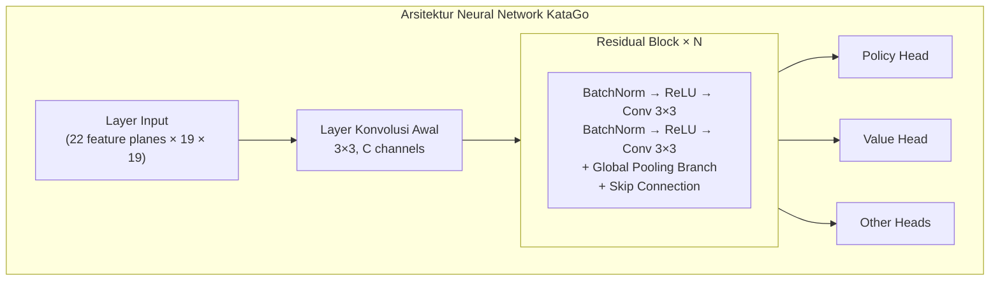
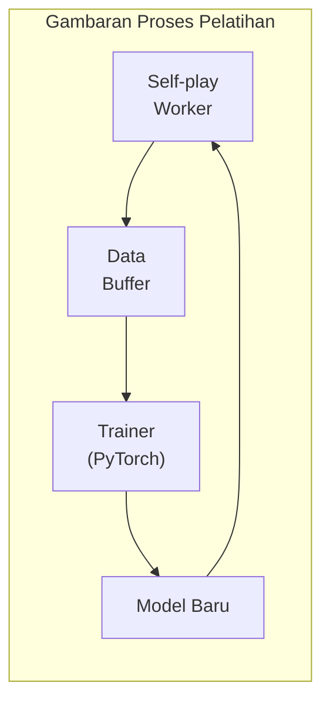

# Arsitektur Kode Sumber KataGo

Artikel ini menganalisis secara mendalam struktur kode sumber KataGo, membantu Anda memahami implementasi internalnya. Baik Anda ingin berkontribusi kode, memodifikasi fitur, atau menerapkan teknologinya ke proyek Anda sendiri, ini adalah referensi wajib baca.

## Struktur Direktori Proyek

```
KataGo/
├── cpp/                    # Kode inti C++
│   ├── main.cpp           # Entry point program utama
│   ├── command/           # Berbagai mode eksekusi
│   ├── core/              # Kelas utilitas inti
│   ├── game/              # Aturan Go dan papan
│   ├── search/            # Mesin pencarian MCTS
│   ├── neuralnet/         # Interface neural network
│   ├── dataio/            # I/O data
│   ├── configs/           # Contoh file konfigurasi
│   └── tests/             # Unit test
├── python/                 # Kode pelatihan Python
│   ├── train.py           # Program pelatihan utama
│   ├── model.py           # Definisi model
│   ├── data_processing_pytorch.py
│   └── configs/           # Konfigurasi pelatihan
├── docs/                   # Dokumentasi
└── scripts/               # Skrip pembantu
```

### Penjelasan Detail Direktori cpp/

```
cpp/
├── main.cpp                # Entry point program, parsing argumen command line
├── command/
│   ├── gtp.cpp            # Implementasi protokol GTP
│   ├── analysis.cpp       # Implementasi Analysis Engine
│   ├── benchmark.cpp      # Benchmark
│   ├── genconfig.cpp      # Generasi file konfigurasi
│   └── selfplay.cpp       # Self-play
├── core/
│   ├── global.h           # Konstanta dan pengaturan global
│   ├── hash.h             # Hash Zobrist
│   ├── rand.h             # Generator bilangan acak
│   ├── logger.h           # Sistem log
│   ├── config_parser.h    # Parser file konfigurasi
│   └── threadsafe*.h      # Utilitas thread-safe
├── game/
│   ├── board.h/cpp        # Representasi dan operasi dasar papan
│   ├── rules.h/cpp        # Aturan Go
│   ├── boardhistory.h/cpp # Histori permainan
│   └── graphhash.h/cpp    # Hash posisi
├── search/
│   ├── search.h/cpp       # Kelas utama mesin pencarian
│   ├── searchnode.h/cpp   # Node pohon pencarian
│   ├── searchparams.h     # Parameter pencarian
│   ├── mutexpool.h        # Pool lock
│   ├── searchresults.h    # Hasil pencarian
│   └── asyncbot.h/cpp     # Bot asinkron
├── neuralnet/
│   ├── nninputs.h/cpp     # Fitur input neural network
│   ├── nneval.h/cpp       # Evaluasi neural network
│   ├── nninterface.h      # Interface abstraksi backend
│   ├── cudabackend.cpp    # Backend CUDA
│   ├── openclbackend.cpp  # Backend OpenCL
│   ├── eigenbackend.cpp   # Backend Eigen (CPU)
│   └── modelversion.h     # Manajemen versi model
└── dataio/
    ├── sgf.h/cpp          # Pemrosesan file SGF
    ├── numpywrite.h/cpp   # Output format NumPy
    └── trainingwrite.h/cpp # Penulisan data pelatihan
```

## Arsitektur Neural Network

### Gambaran Struktur Jaringan



### Fitur Input (nninputs.cpp)

KataGo menggunakan 22 feature planes sebagai input:

```cpp
// Kategori fitur input utama
enum {
  // Status papan
  INPUT_FEATURE_STONE_OUR,      // Batu kita
  INPUT_FEATURE_STONE_OPP,      // Batu lawan

  // Terkait liberti (1-8 liberti)
  INPUT_FEATURE_LIBERTIES_1,
  INPUT_FEATURE_LIBERTIES_2,
  // ...
  INPUT_FEATURE_LIBERTIES_8_OR_MORE,

  // Status historis
  INPUT_FEATURE_LAST_MOVE,      // Posisi langkah terakhir
  INPUT_FEATURE_SECOND_LAST_MOVE,

  // Terkait aturan
  INPUT_FEATURE_KOMI,           // Komi
  INPUT_FEATURE_RULES,          // Encoding aturan
  // ...
};
```

### Branch Global Pooling

Salah satu inovasi KataGo adalah menambahkan global pooling dalam residual block:

```cpp
// Konsep implementasi global pooling yang disederhanakan
class GlobalPoolingResBlock {
public:
  void forward(Tensor& x) {
    // Jalur residual standar
    Tensor regular_out = regular_conv_path(x);

    // Jalur global pooling
    Tensor global_mean = global_avg_pool(x);  // [batch, C]
    Tensor global_max = global_max_pool(x);    // [batch, C]
    Tensor global_features = concat(global_mean, global_max);

    // Memproses fitur global
    global_features = dense_layer(global_features);  // [batch, C]

    // Broadcast kembali ke dimensi spasial dan gabung dengan jalur reguler
    Tensor global_broadcast = broadcast_to_spatial(global_features);
    x = regular_out + global_broadcast;
  }
};
```

### Output Head

```cpp
// Policy Head: Memprediksi probabilitas langkah
class PolicyHead {
  // Output: 19×19+1 (termasuk pass)
  // Menggunakan normalisasi softmax
};

// Value Head: Memprediksi hasil menang-kalah
class ValueHead {
  // Output: 3 (probabilitas menang/kalah/seri)
  // Menggunakan normalisasi softmax
};

// Score Head: Memprediksi poin
class ScoreHead {
  // Output: Nilai kontinu (prediksi selisih poin)
};

// Ownership Head: Memprediksi wilayah
class OwnershipHead {
  // Output: 19×19 (kepemilikan setiap titik, tanh)
};
```

## Implementasi Mesin Pencarian

### Kelas Inti MCTS

```cpp
// search/search.h
class Search {
public:
  // Menjalankan pencarian
  void runWholeSearch(Player pla);

  // Mendapatkan langkah terbaik
  Loc getBestMove();

  // Mendapatkan hasil analisis
  AnalysisData getAnalysisData();

private:
  SearchParams params;          // Parameter pencarian
  SearchNode* rootNode;         // Node root
  NNEvaluator* nnEval;         // Evaluator neural network
  std::mutex* mutexPool;       // Pool lock
};
```

### Struktur Node Pencarian

```cpp
// search/searchnode.h
struct SearchNode {
  // Statistik node
  std::atomic<int64_t> visits;           // Jumlah kunjungan
  std::atomic<double> valueSumWeight;    // Bobot akumulasi nilai
  std::atomic<double> valueSum;          // Jumlah akumulasi nilai

  // Child node
  std::atomic<int> numChildren;
  SearchChildPointer* children;          // Array pointer child node

  // Cache output neural network
  std::shared_ptr<NNOutput> nnOutput;
};

struct SearchChildPointer {
  Loc moveLoc;                           // Posisi langkah
  std::atomic<SearchNode*> node;         // Pointer child node
  std::atomic<int64_t> edgeVisits;       // Kunjungan edge
};
```

### Algoritma Seleksi PUCT

```cpp
// Memilih child node untuk dieksplorasi
int Search::selectChildToDescend(SearchNode* node, Player pla) {
  int bestIdx = -1;
  double bestValue = -1e100;

  for (int i = 0; i < node->numChildren; i++) {
    SearchChildPointer& child = node->children[i];

    // Menghitung nilai Q (exploitation)
    double q = getChildQ(child);

    // Menghitung nilai U (exploration)
    double prior = getPrior(node, child.moveLoc);
    double parentVisits = node->visits.load();
    double childVisits = child.edgeVisits.load();

    double u = params.cpuctExploration * prior *
               sqrt(parentVisits) / (1.0 + childVisits);

    // Formula PUCT
    double value = q + u;

    if (value > bestValue) {
      bestValue = value;
      bestIdx = i;
    }
  }

  return bestIdx;
}
```

### Implementasi Pencarian Paralel

```cpp
void Search::runWholeSearch(Player pla) {
  // Menjalankan beberapa thread pencarian
  std::vector<std::thread> threads;
  for (int i = 0; i < params.numSearchThreads; i++) {
    threads.emplace_back([this, pla]() {
      runSingleSearchThread(pla);
    });
  }

  // Menunggu semua thread selesai
  for (auto& t : threads) {
    t.join();
  }
}

void Search::runSingleSearchThread(Player pla) {
  while (!shouldStop()) {
    // Memilih jalur
    std::vector<SearchNode*> path;
    SearchNode* leaf = selectAndDescend(rootNode, path);

    // Memperluas node
    expandNode(leaf);

    // Evaluasi neural network
    NNOutput output = nnEval->evaluate(leaf->board);

    // Backpropagation nilai
    backpropagateValue(path, output.value);
  }
}
```

### Virtual Loss

Digunakan untuk menghindari multiple thread memilih jalur yang sama dalam pencarian paralel:

```cpp
void Search::applyVirtualLoss(SearchNode* node) {
  // Sementara mengurangi nilai evaluasi node ini
  // Membuat thread lain cenderung memilih jalur berbeda
  node->virtualLoss.fetch_add(1);
}

void Search::removeVirtualLoss(SearchNode* node) {
  node->virtualLoss.fetch_sub(1);
}
```

## Gambaran Proses Pelatihan

### Generasi Data Pelatihan



### Self-play (cpp/command/selfplay.cpp)

```cpp
// Loop utama self-play
void runSelfPlayLoop() {
  while (true) {
    // Memuat model terbaru
    loadLatestModel();

    // Memainkan satu permainan
    GameData gameData = playSingleGame();

    // Menyimpan data pelatihan
    writeTrainingData(gameData);
  }
}

GameData playSingleGame() {
  Board board;
  BoardHistory history;
  GameData gameData;

  while (!history.isGameOver()) {
    // Menggunakan MCTS untuk memilih langkah
    Search search(board, history, params);
    search.runWholeSearch(history.currentPla);

    // Mendapatkan hasil MCTS sebagai target pelatihan
    MoveData moveData;
    moveData.policyTarget = search.getPolicyDistribution();
    moveData.valueTarget = search.getValue();

    // Menjalankan langkah
    Loc move = search.sampleMove();
    board.playMove(move, history.currentPla);

    gameData.moves.push_back(moveData);
  }

  // Mengisi hasil akhir
  gameData.finalScore = history.finalScore();
  return gameData;
}
```

### Format Data Pelatihan

```cpp
// dataio/trainingwrite.h
struct TrainingRow {
  // Fitur input
  float inputFeatures[NUM_FEATURES][BOARD_SIZE][BOARD_SIZE];

  // Target pelatihan
  float policyTarget[BOARD_SIZE * BOARD_SIZE + 1];  // Termasuk pass
  float valueTarget[3];                              // Menang/kalah/seri
  float scoreTarget;                                 // Poin
  float ownershipTarget[BOARD_SIZE][BOARD_SIZE];    // Wilayah

  // Metadata
  int turn;
  int rules;
  float komi;
};
```

### Program Pelatihan Python (python/train.py)

```python
# Loop pelatihan utama (disederhanakan)
def train():
    model = KataGoModel(config)
    optimizer = torch.optim.SGD(model.parameters(), lr=config.lr)

    for epoch in range(config.num_epochs):
        for batch in data_loader:
            # Forward pass
            policy_pred, value_pred, score_pred, ownership_pred = model(batch.input)

            # Menghitung loss
            policy_loss = cross_entropy(policy_pred, batch.policy_target)
            value_loss = cross_entropy(value_pred, batch.value_target)
            score_loss = mse_loss(score_pred, batch.score_target)
            ownership_loss = mse_loss(ownership_pred, batch.ownership_target)

            # Total loss (weighted sum)
            total_loss = (
                policy_loss +
                config.value_weight * value_loss +
                config.score_weight * score_loss +
                config.ownership_weight * ownership_loss
            )

            # Backward pass
            optimizer.zero_grad()
            total_loss.backward()
            optimizer.step()

        # Menyimpan checkpoint
        save_checkpoint(model, epoch)
```

### Definisi Model (python/model.py)

```python
class KataGoModel(nn.Module):
    def __init__(self, config):
        super().__init__()

        # Konvolusi awal
        self.initial_conv = nn.Conv2d(
            config.input_channels,
            config.trunk_channels,
            kernel_size=3, padding=1
        )

        # Residual block
        self.blocks = nn.ModuleList([
            ResBlock(config.trunk_channels, use_global_pooling=True)
            for _ in range(config.num_blocks)
        ])

        # Output head
        self.policy_head = PolicyHead(config)
        self.value_head = ValueHead(config)
        self.score_head = ScoreHead(config)
        self.ownership_head = OwnershipHead(config)

    def forward(self, x):
        # Jaringan trunk
        x = self.initial_conv(x)
        for block in self.blocks:
            x = block(x)

        # Setiap output head
        policy = self.policy_head(x)
        value = self.value_head(x)
        score = self.score_head(x)
        ownership = self.ownership_head(x)

        return policy, value, score, ownership
```

## Struktur Data Utama

### Board (game/board.h)

```cpp
class Board {
public:
  // Status papan
  Color stones[MAX_BOARD_AREA];    // Warna setiap titik
  Chain chains[MAX_BOARD_AREA];    // Informasi rantai batu

  // Ko
  Loc koLoc;

  // Menjalankan langkah
  void playMove(Loc loc, Color pla);

  // Pemeriksaan legalitas
  bool isLegal(Loc loc, Color pla) const;

  // Perhitungan liberti
  int getLiberties(Loc loc) const;
};

struct Chain {
  int liberties;                   // Jumlah liberti
  int numStones;                   // Jumlah batu
  Loc head;                        // Head linked list
};
```

### BoardHistory (game/boardhistory.h)

```cpp
class BoardHistory {
public:
  std::vector<Board> boards;       // Histori status papan
  std::vector<Move> moves;         // Histori langkah
  Rules rules;                     // Aturan
  Player currentPla;               // Giliran siapa saat ini

  // Status permainan
  bool isGameOver() const;
  float finalScore() const;
};
```

### NNOutput (neuralnet/nneval.h)

```cpp
struct NNOutput {
  // Policy
  float policyProbs[MAX_BOARD_AREA + 1];  // Termasuk pass

  // Value
  float whiteWinProb;
  float whiteLossProb;
  float noResultProb;

  // Score
  float whiteScoreMean;
  float whiteScoreStdev;

  // Ownership
  float ownership[MAX_BOARD_AREA];  // -1 sampai 1
};
```

## Pengembangan dan Debugging

### Kompilasi Versi Test

```bash
cd cpp
mkdir build_debug && cd build_debug
cmake .. -DCMAKE_BUILD_TYPE=Debug -DUSE_BACKEND=OPENCL
make -j$(nproc)
```

### Menjalankan Unit Test

```bash
./katago runtests
```

### Metode Debugging Umum

```cpp
// 1. Menggunakan log
#include "core/logger.h"
Logger::log("Debug message", value);

// 2. Menggunakan perintah GTP kata-debug-print
// Output informasi pencarian detail

// 3. Mengaktifkan sanitizers saat kompilasi
cmake .. -DCMAKE_CXX_FLAGS="-fsanitize=address"
```

### Analisis Performa

```bash
# Menggunakan perf (Linux)
perf record ./katago benchmark -model model.bin.gz
perf report

# Menggunakan Instruments (macOS)
instruments -t "Time Profiler" ./katago benchmark -model model.bin.gz
```

## Bacaan Lanjutan

- [KataGo GitHub](https://github.com/lightvector/KataGo)
- [Makalah KataGo](https://arxiv.org/abs/1902.10565)
- [KataGo Discord](https://discord.gg/bqkZAz3) - Berkomunikasi dengan pengembang
- [KataGo Training](https://katagotraining.org/) - Melihat progres pelatihan

Setelah memahami arsitektur kode sumber KataGo, Anda sudah memiliki kemampuan untuk meneliti lebih dalam atau berkontribusi pada proyek open source. Jika ingin memahami lebih lanjut, disarankan untuk langsung membaca kode sumber di GitHub KataGo dan berpartisipasi dalam diskusi komunitas.

