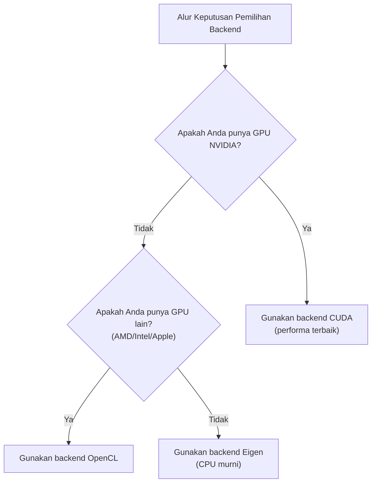

# Instalasi dan Konfigurasi KataGo

Artikel ini akan menjelaskan secara detail cara menginstal KataGo di berbagai platform, termasuk kebutuhan sistem, langkah instalasi, pemilihan model, dan penjelasan file konfigurasi.

## Kebutuhan Sistem

### Kebutuhan Hardware

#### GPU (Direkomendasikan)

| Jenis GPU | Status Dukungan | Backend yang Disarankan |
|---------|---------|---------|
| NVIDIA (CUDA) | Dukungan terbaik | CUDA |
| NVIDIA (tanpa CUDA) | Dukungan baik | OpenCL |
| AMD | Dukungan baik | OpenCL |
| Intel Integrated | Dukungan dasar | OpenCL |
| Apple Silicon | Dukungan baik | Metal / OpenCL |

#### Mode CPU

Jika tidak ada GPU yang cocok, dapat menggunakan backend Eigen untuk menjalankan dengan CPU murni:
- Performa lebih rendah (sekitar 10-30 playouts/sec)
- Cocok untuk belajar, testing, dan penggunaan intensitas rendah
- Memerlukan dukungan instruksi AVX2 (sebagian besar CPU modern mendukung)

### Kebutuhan Software

| Sistem Operasi | Persyaratan Versi |
|---------|---------|
| **Linux** | Ubuntu 18.04+, CentOS 7+ atau distribusi modern lainnya |
| **macOS** | 10.14+ (Mojave atau lebih baru) |
| **Windows** | Windows 10 atau lebih baru |

### Panduan Pemilihan Backend



## Instalasi macOS

### Metode 1: Homebrew (Direkomendasikan)

Cara instalasi paling sederhana, menangani semua dependensi secara otomatis.

```bash
# Instal KataGo
brew install katago

# Konfirmasi instalasi berhasil
katago version
```

Versi Homebrew secara default menggunakan backend OpenCL, dapat berjalan di Intel Mac dan Apple Silicon.

### Metode 2: Kompilasi dari Kode Sumber

Cocok untuk pengguna yang memerlukan opsi kustom atau fitur terbaru.

#### Instal Dependensi

```bash
# Instal CMake dan alat kompilasi
brew install cmake

# Jika menggunakan OpenCL
# macOS sudah memiliki dukungan OpenCL bawaan, tidak perlu instalasi tambahan
```

#### Langkah Kompilasi

```bash
# Clone kode sumber
git clone https://github.com/lightvector/KataGo.git
cd KataGo/cpp

# Buat direktori kompilasi
mkdir build && cd build

# Atur opsi kompilasi (backend OpenCL)
cmake .. -DUSE_BACKEND=OPENCL

# Kompilasi
make -j$(sysctl -n hw.ncpu)

# Setelah kompilasi selesai, file executable ada di build/katago
./katago version
```

#### Catatan Khusus Apple Silicon

Di Mac M1/M2/M3, disarankan menggunakan backend OpenCL atau Metal:

```bash
# Backend OpenCL (direkomendasikan, kompatibilitas lebih baik)
cmake .. -DUSE_BACKEND=OPENCL

# Backend Metal (eksperimental, mungkin performa lebih baik)
cmake .. -DUSE_BACKEND=METAL
```

## Instalasi Linux

### Metode 1: Versi Precompiled (Direkomendasikan)

Unduh versi precompiled dari GitHub Releases:

```bash
# Unduh versi OpenCL (cocok untuk sebagian besar kasus)
wget https://github.com/lightvector/KataGo/releases/download/v1.15.3/katago-v1.15.3-opencl-linux-x64.zip

# Atau unduh versi CUDA (GPU NVIDIA)
wget https://github.com/lightvector/KataGo/releases/download/v1.15.3/katago-v1.15.3-cuda11.1-linux-x64.zip

# Ekstrak
unzip katago-v1.15.3-*.zip

# Berikan izin eksekusi
chmod +x katago

# Konfirmasi instalasi
./katago version
```

### Metode 2: Kompilasi dari Kode Sumber

#### Backend CUDA (GPU NVIDIA)

```bash
# Instal dependensi
sudo apt update
sudo apt install cmake g++ libzip-dev

# Instal CUDA (jika belum terinstal)
# Silakan lihat panduan resmi NVIDIA: https://developer.nvidia.com/cuda-downloads

# Clone dan kompilasi
git clone https://github.com/lightvector/KataGo.git
cd KataGo/cpp
mkdir build && cd build

# Atur backend CUDA
cmake .. -DUSE_BACKEND=CUDA

# Kompilasi
make -j$(nproc)
```

#### Backend OpenCL (GPU Universal)

```bash
# Instal dependensi
sudo apt update
sudo apt install cmake g++ libzip-dev ocl-icd-opencl-dev

# Instal driver OpenCL
# NVIDIA: terinstal bersama CUDA
# AMD: sudo apt install mesa-opencl-icd
# Intel: sudo apt install intel-opencl-icd

# Clone dan kompilasi
git clone https://github.com/lightvector/KataGo.git
cd KataGo/cpp
mkdir build && cd build

cmake .. -DUSE_BACKEND=OPENCL
make -j$(nproc)
```

#### Backend Eigen (CPU Murni)

```bash
# Instal dependensi
sudo apt update
sudo apt install cmake g++ libzip-dev libeigen3-dev

# Clone dan kompilasi
git clone https://github.com/lightvector/KataGo.git
cd KataGo/cpp
mkdir build && cd build

cmake .. -DUSE_BACKEND=EIGEN
make -j$(nproc)
```

## Instalasi Windows

### Metode 1: Versi Precompiled (Direkomendasikan)

1. Kunjungi [KataGo Releases](https://github.com/lightvector/KataGo/releases)
2. Unduh versi yang sesuai:
   - `katago-v1.15.3-cuda11.1-windows-x64.zip` (GPU NVIDIA + CUDA)
   - `katago-v1.15.3-opencl-windows-x64.zip` (GPU lainnya)
   - `katago-v1.15.3-eigen-windows-x64.zip` (CPU murni)
3. Ekstrak ke direktori yang ditentukan
4. Test di command prompt:

```cmd
cd C:\path\to\katago
katago.exe version
```

### Metode 2: Kompilasi dari Kode Sumber

#### Persiapan Lingkungan

1. Instal [Visual Studio 2019/2022](https://visualstudio.microsoft.com/) (termasuk alat C++)
2. Instal [CMake](https://cmake.org/download/)
3. Jika menggunakan CUDA, instal [CUDA Toolkit](https://developer.nvidia.com/cuda-toolkit)

#### Langkah Kompilasi

```cmd
# Jalankan di Developer Command Prompt

git clone https://github.com/lightvector/KataGo.git
cd KataGo\cpp
mkdir build
cd build

# Backend CUDA
cmake .. -G "Visual Studio 17 2022" -A x64 -DUSE_BACKEND=CUDA

# Atau backend OpenCL
cmake .. -G "Visual Studio 17 2022" -A x64 -DUSE_BACKEND=OPENCL

# Kompilasi
cmake --build . --config Release
```

## Unduh dan Pilih Model

KataGo memerlukan file model neural network untuk dapat berjalan. Resmi menyediakan model dengan berbagai ukuran.

### Lokasi Unduh

Halaman unduh model resmi: https://katagotraining.org/

Atau langsung unduh dari server pelatihan:

```bash
# Model lebih kecil (cocok untuk testing dan hardware lemah)
curl -L -o kata-b18c384.bin.gz \
  "https://media.katagotraining.org/uploaded/networks/models/kata1/kata1-b18c384nbt-s9996604416-d4316597426.bin.gz"

# Model menengah (direkomendasikan, menyeimbangkan performa dan kecepatan)
curl -L -o kata-b40c256.bin.gz \
  "https://media.katagotraining.org/uploaded/networks/models/kata1/kata1-b40c256-s11840935168-d2898845681.bin.gz"

# Model besar (kemampuan terkuat, memerlukan GPU kuat)
curl -L -o kata-b60c320.bin.gz \
  "https://media.katagotraining.org/uploaded/networks/models/kata1/kata1-b60c320-s11318001920-d2792783831.bin.gz"
```

### Perbandingan Model

| Model | Ukuran Jaringan | Ukuran File | Kemampuan | Skenario Cocok |
|------|---------|---------|------|---------|
| b10c128 | 10 blocks, 128 channels | ~20 MB | Amatir tingkat tinggi | CPU, GPU lemah, testing cepat |
| b18c384 | 18 blocks, 384 channels | ~140 MB | Level profesional | GPU umum, analisis harian |
| b40c256 | 40 blocks, 256 channels | ~250 MB | Level super manusia | GPU menengah-tinggi, analisis mendalam |
| b60c320 | 60 blocks, 320 channels | ~500 MB | Level super manusia teratas | GPU high-end, analisis top |

### Saran Pemilihan

```
GPU Anda adalah?
├─ RTX 3080/4080/4090 → b60c320 atau b40c256
├─ RTX 3060/3070 → b40c256 atau b18c384
├─ GTX 1660/2060 → b18c384
├─ GPU entry-level → b18c384 atau b10c128
└─ CPU murni → b10c128
```

## Penjelasan File Konfigurasi Dasar

KataGo menggunakan file konfigurasi format `.cfg`. Resmi menyediakan contoh file konfigurasi di direktori `cpp/configs/`.

### File Konfigurasi Penting

| File | Kegunaan |
|------|------|
| `gtp_example.cfg` | Contoh konfigurasi mode GTP |
| `analysis_example.cfg` | Contoh konfigurasi Analysis Engine |
| `default_gtp.cfg` | Konfigurasi default mode GTP |

### Item Konfigurasi Inti

```ini
# =============
# Pengaturan Neural Network
# =============

# Path file model neural network
# Dapat menggunakan path relatif atau absolut
# model = /path/to/model.bin.gz

# =============
# Pengaturan Pencarian
# =============

# Jumlah kunjungan pencarian maksimum per langkah
# Meningkatkan nilai ini akan meningkatkan kemampuan tapi memperlambat kecepatan
maxVisits = 500

# Waktu berpikir maksimum per langkah (detik)
# 0 berarti tidak terbatas (dikontrol oleh maxVisits)
maxTime = 0

# Jumlah thread yang digunakan per langkah
numSearchThreads = 6

# =============
# Pengaturan Aturan
# =============

# Aturan Go
# chinese = Aturan Tiongkok
# japanese = Aturan Jepang
# korean = Aturan Korea
# tromp-taylor = Aturan Tromp-Taylor
# aga = Aturan AGA
rules = chinese

# Komi
komi = 7.5

# =============
# Pengaturan GPU
# =============

# Nomor GPU yang digunakan (mulai dari 0)
# Multi GPU dapat dipisahkan dengan koma: 0,1,2
# -1 berarti pilih otomatis
nnDeviceIdxs = 0

# Ukuran batch per thread GPU
# Batch lebih besar dapat meningkatkan utilisasi GPU
numNNServerThreadsPerModel = 1

# =============
# Pengaturan Lanjutan
# =============

# Konstanta eksplorasi MCTS
# Nilai lebih besar meningkatkan eksplorasi, lebih kecil meningkatkan eksploitasi
cpuctExploration = 1.0

# Noise Dirichlet pada root node
# Digunakan untuk meningkatkan keragaman eksplorasi
rootNoiseEnabled = true
rootDirichletNoisePruneFactor = 0.25
```

### Contoh Konfigurasi Mode GTP

Buat `my_gtp_config.cfg`:

```ini
# Path model
# model biasanya ditentukan di command line, di sini bisa diabaikan

# Pengaturan pencarian
maxVisits = 1000
numSearchThreads = 4

# Aturan
rules = chinese
komi = 7.5

# Pengaturan GPU
nnDeviceIdxs = 0

# Log
logDir = ./logs
logToStderr = false
```

### Contoh Konfigurasi Analysis Engine

Buat `my_analysis_config.cfg`:

```ini
# Pengaturan pencarian
maxVisits = 500
numSearchThreads = 8

# Pengaturan laporan
# Jumlah variasi maksimum yang dilaporkan setiap analisis
maxMoves = 10

# Aturan (dapat di-override saat panggilan API)
rules = chinese
komi = 7.5

# Pengaturan GPU
nnDeviceIdxs = 0
numNNServerThreadsPerModel = 2

# Fitur analisis
reportAnalysisWinratesAs = BLACK

# Peta kepemilikan
# Setelah diaktifkan dapat memperoleh prediksi kepemilikan setiap titik
analysisOwnership = true
```

## Menjalankan Pertama Kali

### Test Mode GTP

```bash
# Jalankan mode GTP
katago gtp -model /path/to/model.bin.gz -config /path/to/config.cfg

# Jika tidak ada config, KataGo akan menggunakan nilai default
katago gtp -model /path/to/model.bin.gz
```

Setelah berhasil dijalankan, masukkan perintah GTP untuk test:

```
name
= KataGo

version
= 1.15.3

boardsize 19
=

genmove black
= Q16

quit
=
```

### Test Analysis Engine

```bash
# Jalankan Analysis Engine
katago analysis -model /path/to/model.bin.gz -config /path/to/config.cfg
```

Masukkan query JSON:

```json
{"id":"test1","initialStones":[],"moves":[],"rules":"chinese","komi":7.5,"boardXSize":19,"boardYSize":19,"analyzeTurns":[0]}
```

### Benchmark

Test performa hardware Anda:

```bash
# Jalankan benchmark
katago benchmark -model /path/to/model.bin.gz

# Tentukan file konfigurasi
katago benchmark -model /path/to/model.bin.gz -config /path/to/config.cfg
```

Benchmark akan menghasilkan:
- Kunjungan pencarian per detik (visits/sec)
- Kecepatan inferensi neural network
- Pengaturan thread yang disarankan

## Troubleshooting Masalah Umum

### Terkait GPU

**Masalah: Tidak menemukan GPU**

```bash
# Periksa perangkat OpenCL
clinfo

# Atau list perangkat yang dilihat KataGo
katago gpuinfo
```

**Masalah: Inisialisasi CUDA gagal**

- Konfirmasi versi CUDA sesuai dengan versi kompilasi KataGo
- Perbarui driver GPU
- Periksa variabel environment CUDA_PATH

### Terkait Memori

**Masalah: Memori tidak cukup**

```ini
# Kurangi penggunaan memori GPU
nnMaxBatchSize = 8  # Default mungkin 16 atau lebih tinggi
nnCacheSizePowerOfTwo = 20  # Kurangi ukuran cache
```

### Terkait Performa

**Masalah: Kecepatan terlalu lambat**

1. Konfirmasi menggunakan GPU bukan CPU
2. Kurangi `numSearchThreads`
3. Gunakan model yang lebih kecil
4. Periksa apakah ada program lain yang menggunakan GPU

## Langkah Selanjutnya

Setelah konfigurasi selesai, silakan lanjutkan membaca:
- [Perintah Umum](./commands.md) - Pelajari cara menggunakan KataGo
- [Arsitektur Kode Sumber](./architecture.md) - Pahami implementasi internal

