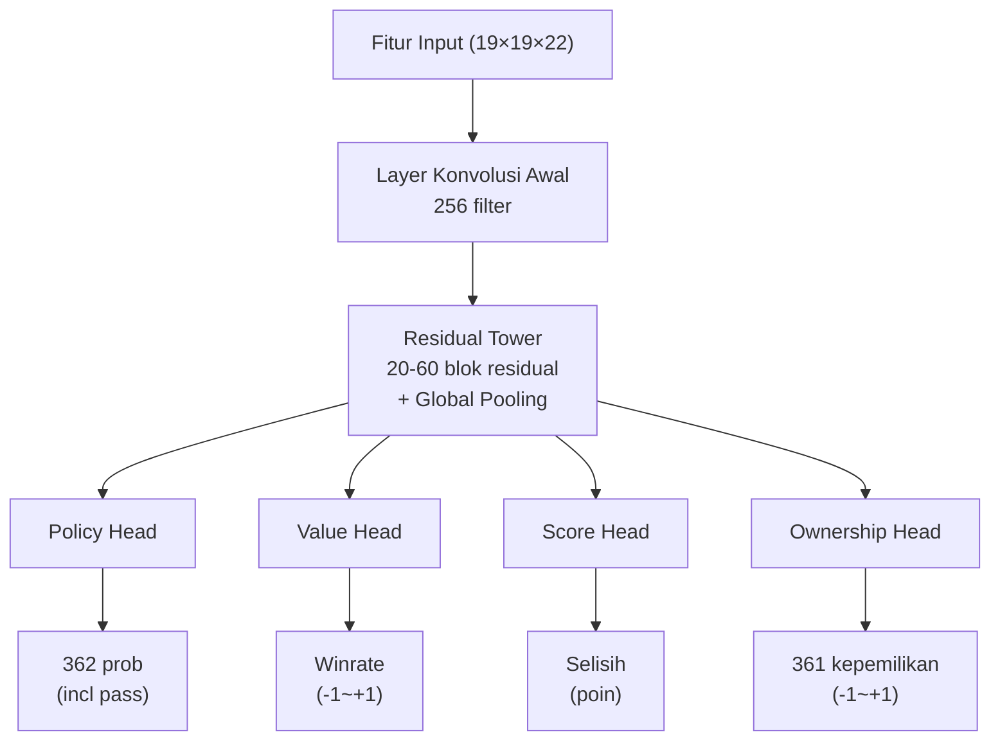
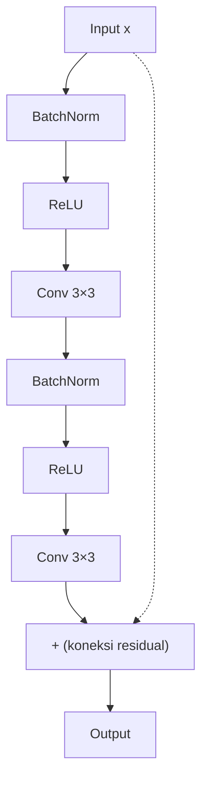

# Detail Arsitektur Neural Network

Artikel ini menganalisis secara mendalam arsitektur lengkap neural network KataGo, dari encoding fitur input hingga desain multi-head output.

---

## Gambaran Arsitektur

KataGo menggunakan desain **neural network tunggal dengan multi-head output**:



---

## Encoding Fitur Input

### Gambaran Feature Plane

KataGo menggunakan **22 feature plane** (19×19×22), setiap plane adalah matriks 19×19:

| Plane | Konten | Deskripsi |
|-------|--------|-----------|
| 0 | Batu sendiri | 1 = ada batu sendiri, 0 = tidak ada |
| 1 | Batu lawan | 1 = ada batu lawan, 0 = tidak ada |
| 2 | Titik kosong | 1 = kosong, 0 = ada batu |
| 3-10 | Status historis | Perubahan papan 8 langkah terakhir |
| 11 | Titik ko | 1 = titik ini adalah ko, 0 = boleh dimainkan |
| 12-17 | Encoding liberty | Grup dengan 1, 2, 3... liberty |
| 18-21 | Encoding aturan | Aturan Tiongkok/Jepang, komi, dll |

### Stacking Status Historis

Agar neural network memahami **perubahan dinamis** posisi, KataGo menumpuk status papan 8 langkah terakhir:

```python
# Encoding status historis (konsep)
def encode_history(game_history, current_player):
    features = []

    for t in range(8):  # 8 langkah terakhir
        if t < len(game_history):
            board = game_history[-(t+1)]
            # Encode batu sendiri/lawan pada waktu tersebut
            features.append(encode_board(board, current_player))
        else:
            # Histori tidak cukup, isi dengan nol
            features.append(np.zeros((19, 19)))

    return np.stack(features, axis=0)
```

### Encoding Aturan

KataGo mendukung berbagai aturan, memberitahu neural network melalui feature plane:

```python
# Encoding aturan (konsep)
def encode_rules(rules, komi):
    rule_features = np.zeros((4, 19, 19))

    # Tipe aturan (one-hot)
    if rules == "chinese":
        rule_features[0] = 1.0
    elif rules == "japanese":
        rule_features[1] = 1.0

    # Normalisasi Komi
    normalized_komi = komi / 15.0  # Normalisasi ke [-1, 1]
    rule_features[2] = normalized_komi

    # Pemain saat ini
    rule_features[3] = 1.0 if current_player == BLACK else 0.0

    return rule_features
```

---

## Backbone Network: Residual Tower

### Struktur Blok Residual

KataGo menggunakan struktur **Pre-activation ResNet**:



### Contoh Kode

```python
class ResidualBlock(nn.Module):
    def __init__(self, channels):
        super().__init__()
        self.bn1 = nn.BatchNorm2d(channels)
        self.conv1 = nn.Conv2d(channels, channels, 3, padding=1)
        self.bn2 = nn.BatchNorm2d(channels)
        self.conv2 = nn.Conv2d(channels, channels, 3, padding=1)

    def forward(self, x):
        residual = x

        out = self.bn1(x)
        out = F.relu(out)
        out = self.conv1(out)

        out = self.bn2(out)
        out = F.relu(out)
        out = self.conv2(out)

        return out + residual  # Koneksi residual
```

### Layer Global Pooling

Salah satu inovasi kunci KataGo: menambahkan **global pooling** dalam blok residual, memungkinkan network melihat informasi global:

```python
class GlobalPoolingBlock(nn.Module):
    def __init__(self, channels):
        super().__init__()
        self.conv = nn.Conv2d(channels, channels, 3, padding=1)
        self.fc = nn.Linear(channels, channels)

    def forward(self, x):
        # Jalur lokal
        local = self.conv(x)

        # Jalur global
        global_pool = x.mean(dim=[2, 3])  # Global average pooling
        global_fc = self.fc(global_pool)
        global_broadcast = global_fc.unsqueeze(2).unsqueeze(3)
        global_broadcast = global_broadcast.expand(-1, -1, 19, 19)

        # Penggabungan
        return local + global_broadcast
```

**Mengapa perlu global pooling?**

Konvolusi tradisional hanya melihat lokal (receptive field 3×3), bahkan dengan banyak layer, persepsi terhadap informasi global tetap terbatas. Global pooling memungkinkan network langsung "melihat":
- Perbedaan jumlah batu di seluruh papan
- Distribusi pengaruh global
- Penilaian situasi keseluruhan

---

## Desain Output Head

### Policy Head (Head Kebijakan)

Menghasilkan probabilitas langkah untuk setiap posisi:

```python
class PolicyHead(nn.Module):
    def __init__(self, in_channels):
        super().__init__()
        self.conv = nn.Conv2d(in_channels, 2, 1)  # Konvolusi 1×1
        self.bn = nn.BatchNorm2d(2)
        self.fc = nn.Linear(2 * 19 * 19, 362)  # 361 + pass

    def forward(self, x):
        out = F.relu(self.bn(self.conv(x)))
        out = out.view(out.size(0), -1)
        out = self.fc(out)
        return F.softmax(out, dim=1)  # Distribusi probabilitas
```

**Format Output**: Vektor 362 dimensi
- Indeks 0-360: Probabilitas langkah untuk 361 posisi papan
- Indeks 361: Probabilitas pass

### Value Head (Head Nilai)

Menghasilkan winrate posisi saat ini:

```python
class ValueHead(nn.Module):
    def __init__(self, in_channels):
        super().__init__()
        self.conv = nn.Conv2d(in_channels, 1, 1)
        self.bn = nn.BatchNorm2d(1)
        self.fc1 = nn.Linear(19 * 19, 256)
        self.fc2 = nn.Linear(256, 1)

    def forward(self, x):
        out = F.relu(self.bn(self.conv(x)))
        out = out.view(out.size(0), -1)
        out = F.relu(self.fc1(out))
        out = torch.tanh(self.fc2(out))  # Output -1 sampai +1
        return out
```

**Format Output**: Nilai tunggal [-1, +1]
- +1: Pasti menang
- -1: Pasti kalah
- 0: Seimbang

### Score Head (Head Skor)

Eksklusif KataGo, memprediksi selisih poin akhir:

```python
class ScoreHead(nn.Module):
    def __init__(self, in_channels):
        super().__init__()
        self.conv = nn.Conv2d(in_channels, 1, 1)
        self.bn = nn.BatchNorm2d(1)
        self.fc1 = nn.Linear(19 * 19, 256)
        self.fc2 = nn.Linear(256, 1)

    def forward(self, x):
        out = F.relu(self.bn(self.conv(x)))
        out = out.view(out.size(0), -1)
        out = F.relu(self.fc1(out))
        out = self.fc2(out)  # Output tanpa batasan
        return out
```

**Format Output**: Nilai tunggal (poin)
- Positif: Unggul
- Negatif: Tertinggal

### Ownership Head (Head Kepemilikan)

Memprediksi kepemilikan akhir setiap titik:

```python
class OwnershipHead(nn.Module):
    def __init__(self, in_channels):
        super().__init__()
        self.conv1 = nn.Conv2d(in_channels, 32, 1)
        self.bn = nn.BatchNorm2d(32)
        self.conv2 = nn.Conv2d(32, 1, 1)

    def forward(self, x):
        out = F.relu(self.bn(self.conv1(x)))
        out = torch.tanh(self.conv2(out))  # Setiap titik -1 sampai +1
        return out.view(out.size(0), -1)  # Flatten menjadi 361
```

**Format Output**: Vektor 361 dimensi, setiap nilai dalam [-1, +1]
- +1: Titik tersebut milik kita
- -1: Titik tersebut milik lawan
- 0: Netral atau area sengketa

---

## Perbedaan dengan AlphaZero

| Aspek | AlphaZero | KataGo |
|-------|-----------|--------|
| **Output Head** | 2 (Policy + Value) | **4** (+ Score + Ownership) |
| **Global Pooling** | Tidak ada | **Ada** |
| **Fitur Input** | 17 plane | **22 plane** (termasuk encoding aturan) |
| **Blok Residual** | ResNet standar | **Pre-activation + Global Pooling** |
| **Dukungan Multi-aturan** | Tidak ada | **Ada** (melalui encoding fitur) |

---

## Skala Model

KataGo menyediakan model dengan berbagai skala:

| Model | Jumlah Blok Residual | Jumlah Channel | Jumlah Parameter | Kasus Penggunaan |
|-------|---------------------|----------------|------------------|------------------|
| b10c128 | 10 | 128 | ~5M | CPU, pengujian cepat |
| b18c384 | 18 | 384 | ~75M | GPU umum |
| b40c256 | 40 | 256 | ~95M | GPU high-end |
| b60c320 | 60 | 320 | ~200M | GPU top-tier |

**Konvensi Penamaan**: `b{jumlah_blok_residual}c{jumlah_channel}`

---

## Implementasi Network Lengkap

```python
class KataGoNetwork(nn.Module):
    def __init__(self, num_blocks=18, channels=384):
        super().__init__()

        # Konvolusi awal
        self.initial_conv = nn.Conv2d(22, channels, 3, padding=1)
        self.initial_bn = nn.BatchNorm2d(channels)

        # Residual tower
        self.residual_blocks = nn.ModuleList([
            ResidualBlock(channels) for _ in range(num_blocks)
        ])

        # Blok global pooling (sisipkan satu setiap beberapa blok residual)
        self.global_pooling_blocks = nn.ModuleList([
            GlobalPoolingBlock(channels) for _ in range(num_blocks // 6)
        ])

        # Output head
        self.policy_head = PolicyHead(channels)
        self.value_head = ValueHead(channels)
        self.score_head = ScoreHead(channels)
        self.ownership_head = OwnershipHead(channels)

    def forward(self, x):
        # Konvolusi awal
        out = F.relu(self.initial_bn(self.initial_conv(x)))

        # Residual tower
        gp_idx = 0
        for i, block in enumerate(self.residual_blocks):
            out = block(out)

            # Sisipkan global pooling setiap 6 blok residual
            if (i + 1) % 6 == 0 and gp_idx < len(self.global_pooling_blocks):
                out = self.global_pooling_blocks[gp_idx](out)
                gp_idx += 1

        # Output head
        policy = self.policy_head(out)
        value = self.value_head(out)
        score = self.score_head(out)
        ownership = self.ownership_head(out)

        return {
            'policy': policy,
            'value': value,
            'score': score,
            'ownership': ownership
        }
```

---

## Bacaan Lanjutan

- [Detail Implementasi MCTS](../mcts-implementation) — Kombinasi pencarian dan neural network
- [Analisis Mekanisme Pelatihan KataGo](../training) — Bagaimana network dilatih
- [Panduan Paper Kunci](../papers) — Derivasi matematis dari paper asli
