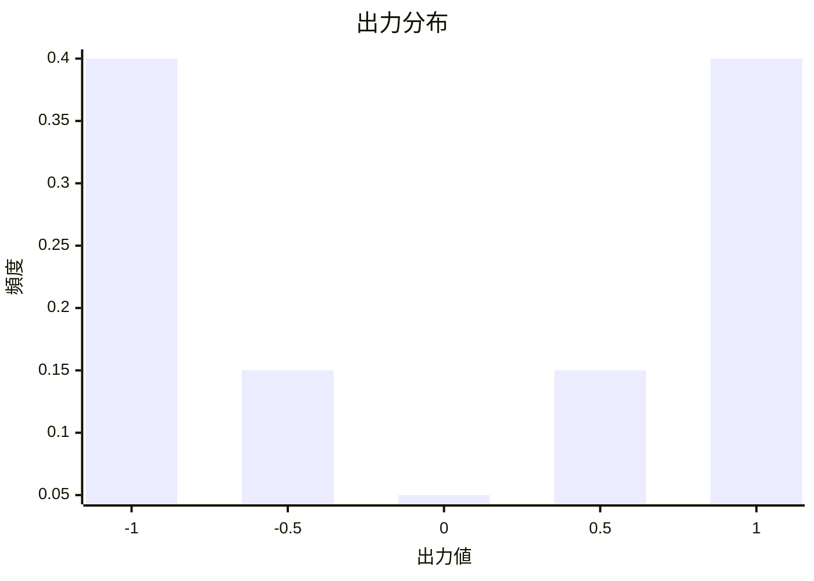
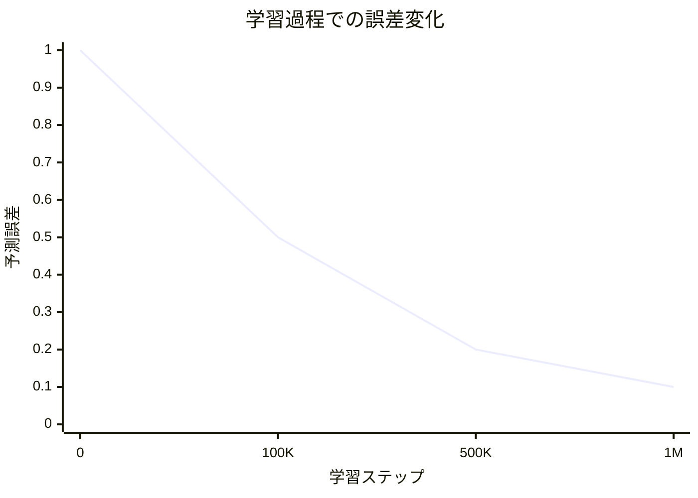
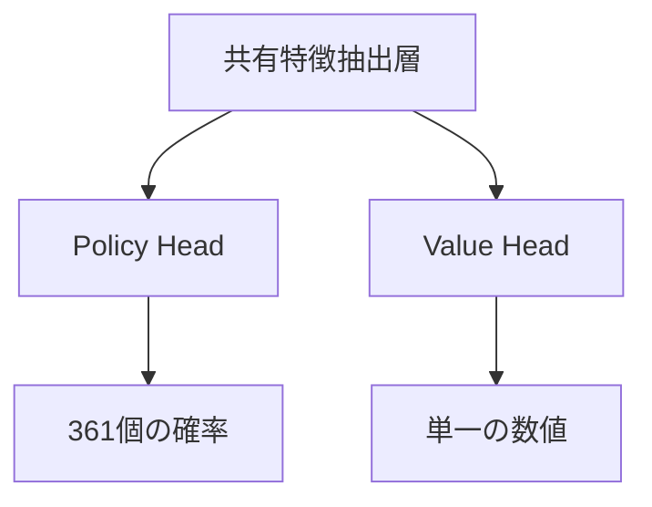

# Value Network 詳解

Policy Network が AlphaGo に「次の一手はどこに打つべきか」を教えるなら、Value Network はより根本的な問いに答えます：

> **「この対局、勝てるだろうか？」**

---

## Value Network とは何か？

### 中心的な機能

Value Network は深層畳み込みニューラルネットワークであり、その役割は：

> **現在の盤面状態を入力として、最終的な勝率を予測する**

数学的に表すと：

```
v = f_θ(s)
```

ここで：
- `s`：現在の盤面状態
- `f_θ`：Value Network（θ はネットワークパラメータ）
- `v`：-1 から +1 の間の数値

### 出力の意味

| 出力値 | 意味 |
|--------|------|
| +1 | 現在のプレイヤーが必勝 |
| +0.5 | 現在のプレイヤーの勝率約 75% |
| 0 | 双方の勝率が同等 |
| -0.5 | 現在のプレイヤーの勝率約 25% |
| -1 | 現在のプレイヤーが必敗 |

### なぜ単一の数値が必要なのか？

#### 異なる選択肢の比較

対局中、複数の選択肢から選ぶ必要がよくあります。Value Network はこの比較をシンプルにします：

```
選択肢 A の局面価値：0.3
選択肢 B の局面価値：0.5
選択肢 C の局面価値：0.2

→ B を選択（最高の価値）
```

単一の数値がなければ、「相手の石を取る」と「大きな地を囲う」のどちらが良いかをどう比較すればよいでしょうか？

#### 大量のシミュレーションを置き換える

従来のモンテカルロ木探索では、局面を評価するために **ランダムシミュレーション（rollout）** が必要でした：

1. 現在の局面から開始
2. 双方がゲーム終了までランダムに打つ
3. 勝敗を記録
4. 数千回繰り返し、勝率を計算

これは非常に遅いです。Value Network は**一度の順伝播**で評価を出せるため、速度は桁違いに速くなります。

| 方法 | 評価時間 | 精度 |
|------|---------|------|
| 1000 回ランダムシミュレーション | ~2000 ミリ秒 | 低 |
| 15000 回ランダムシミュレーション | ~30000 ミリ秒 | 中 |
| Value Network | ~3 ミリ秒 | 高（15000 回シミュレーションと同等） |

---

## ネットワークアーキテクチャ

### Policy Network との類似性

Value Network のアーキテクチャは Policy Network と非常に似ており、どちらも深層畳み込みニューラルネットワークです：

```
入力層 → 畳み込み層 ×12 → 全結合層 → 出力
   ↓         ↓           ↓         ↓
19×19×48   19×19×192    256次元     単一の数値
```

### 入力層

Policy Network と同様に、入力は **19×19×49** の特徴テンソルです：

- **19×19**：盤面サイズ
- **49**：48 個の特徴平面 + 1 個の現在の手番を示す平面

追加の 1 個の平面は重要です：Value Network は誰の手番かを知る必要があります。なぜなら、同じ局面でも黒と白では価値が逆だからです。

### 畳み込み層

Policy Network と同様：
- **12 層の畳み込み層**
- **192 個のフィルター**
- **3×3 のカーネル**（第1層は 5×5）
- **ReLU 活性化関数**

### 出力層の違い

これが Value Network と Policy Network の重要な違いです：

#### Policy Network の出力
```
19×19×192 → 1×1 畳み込み → 19×19×1 → フラット化 → 361次元 → Softmax → 確率分布
```

#### Value Network の出力
```
19×19×192 → 1×1 畳み込み → 19×19×1 → フラット化 → 361次元 → 全結合256 → ReLU → 全結合1 → Tanh → 単一の数値
```

### Tanh 活性化関数

Value Network の最終層は **Tanh**（双曲線正接）関数を使用します：

```
Tanh(x) = (e^x - e^(-x)) / (e^x + e^(-x))
```

Tanh の出力範囲は **(-1, +1)** で、ちょうど勝敗に対応します。

#### なぜ Sigmoid ではなく Tanh なのか？

Sigmoid の出力範囲は (0, 1) で、勝率を表すこともできます。しかし Tanh にはいくつかの利点があります：

1. **対称性**：0 を中心とし、正負両方の出力が可能
2. **勾配が良い**：0 付近で勾配が 1 に近い
3. **意味が明確**：正の値は勝ち、負の値は負け、ゼロは互角

### 完全なアーキテクチャ図

```
入力: 19×19×49
        ↓
    Conv 5×5, 192 filters
        ↓
    ReLU
        ↓
    Conv 3×3, 192 filters (×11)
        ↓
    ReLU
        ↓
    Conv 1×1, 1 filter
        ↓
    フラット化 (361 次元)
        ↓
    全結合 (256 次元)
        ↓
    ReLU
        ↓
    全結合 (1 次元)
        ↓
    Tanh
        ↓
出力: [-1, +1]
```

### パラメータ数

| 層 | 計算 | パラメータ数 |
|---|------|---------|
| 畳み込み層 | Policy Network と同じ | ~3.9M |
| 全結合層 1 | 361×256 + 256 | 92,672 |
| 全結合層 2 | 256×1 + 1 | 257 |
| **合計** | | **~4.0M** |

約 400 万個のパラメータで、Policy Network よりわずかに多いです。

---

## 学習の課題

### 過学習問題

Value Network の学習は Policy Network よりもはるかに困難です。主な問題は**過学習**です。

#### 過学習とは？

過学習とは、モデルが学習データを「記憶」してしまい、汎化できなくなることです。症状は：
- 学習セットでは良好なパフォーマンス
- テストセットでは悪いパフォーマンス

#### なぜ Value Network は過学習しやすいのか？

一局のデータを考えてみましょう：

```
局面 1 → 局面 2 → 局面 3 → ... → 局面 200 → 結果：黒勝
```

このデータをそのまま学習に使用すると：
- これらの 200 の局面は強い相関がある
- 同じ対局からで、同じ結果を持つ
- モデルはこの対局を「認識」することを学び、局面を理解しない可能性がある

DeepMind は、同じ人間の棋譜で Policy と Value Network を学習すると、Value Network が深刻な過学習を起こすことを発見しました。

### 解決策：自己対局データ

DeepMind の解決策は**自己対局**で新しい学習データを生成することでした：

```
1. 学習済みの RL Policy Network で自己対局
2. 各対局から 1 つの局面のみを取得（相関を避ける）
3. その局面のラベルは対局の最終結果
4. このような 3000 万サンプルを生成
```

#### なぜこれで過学習を解決できるのか？

1. **データ量が多い**：3000 万の独立した局面
2. **相関がない**：各対局から 1 つの局面のみ
3. **分布が異なる**：自己対局の局面分布は人間の棋譜とは異なる

### 学習データの生成

```python
# 疑似コード
training_data = []

for game_id in range(30_000_000):
    # 一局自己対局
    states, result = self_play(rl_policy_network)

    # ランダムに 1 つの局面を選択
    random_index = random.randint(0, len(states) - 1)
    state = states[random_index]

    # 局面と結果を記録
    training_data.append((state, result))
```

---

## 学習目標と方法

### 平均二乗誤差損失

Value Network は**平均二乗誤差（MSE）**を損失関数として使用します：

```
L(θ) = (1/n) × Σ (v_θ(s) - z)²
```

ここで：
- `v_θ(s)`：モデルが予測する価値
- `z`：実際の結果（+1 または -1）

#### なぜ交差エントロピーではなく MSE なのか？

- **交差エントロピー**は分類問題（離散ラベル）に適している
- **MSE** は回帰問題（連続値）に適している

結果は +1 または -1 のみですが、モデルが予測するのは連続値（-1 から +1 の間の任意の数）です。MSE はモデルに +1 または -1 に近い値を予測させます。

### 学習プロセス

```python
# 疑似コード
for epoch in range(num_epochs):
    for batch in dataloader:
        states, outcomes = batch

        # 順伝播
        values = network(states)  # (batch, 1)

        # 損失計算（MSE）
        loss = mse_loss(values, outcomes)

        # 逆伝播
        loss.backward()
        optimizer.step()
```

学習の詳細：
- **オプティマイザ**：SGD with momentum
- **学習率**：0.003
- **バッチサイズ**：32
- **学習時間**：約 1 週間（50 GPUs）

---

## 精度分析

### ランダムシミュレーションとの比較

DeepMind は論文で詳細な比較を行いました：

| 評価方法 | 予測誤差 |
|---------|---------|
| 1000 回ランダムシミュレーション | 高 |
| 15000 回ランダムシミュレーション | 中 |
| Value Network | 15000 回シミュレーションと同等 |

これは、1 回の Value Network 評価 ≈ 15000 回のランダムシミュレーションを意味しますが、速度は約 1000 倍高速です。

### 各段階の精度

Value Network の精度はゲームの進行に依存します：

| 段階 | 残り手数 | 予測難易度 | 精度 |
|------|---------|---------|--------|
| 序盤 | ~300 | 非常に難しい | 低 |
| 中盤 | ~150 | 難しい | 中 |
| ヨセ | ~50 | やや易 | 高 |
| 終局 | ~10 | 簡単 | 非常に高 |

これは直感的に理にかなっています：ゲーム終了に近づくほど、結果は確定的になります。

### 出力分布

よく学習された Value Network の出力分布：



ほとんどの出力は -1 と +1 付近に集中（ほとんどの局面には明確な勝敗傾向があるため）。

### 不確実な局面

Value Network の出力が 0 に近い場合、局面が非常に複雑で勝敗が不明であることを示します。これらの局面は通常：
- 大規模な戦い中
- 双方が互角
- 複数の可能な変化が存在

MCTS では、これらのノードにより多くの探索リソースが割り当てられます（不確実性が高いため）。

---

## MCTS における役割

### 葉ノードの評価

Value Network は MCTS の **Evaluation** フェーズで重要な役割を果たします：

```
MCTS 探索木：

        ルートノード（現在の局面）
           /    \
         A        B
        /  \    /  \
       A1  A2  B1  B2 ← 葉ノード
        ↓   ↓   ↓   ↓
       評価  評価  評価  評価
```

MCTS が葉ノードに到達したとき、この局面の価値を評価する必要があります。2 つの方法があります：

1. **ランダムシミュレーション（Rollout）**：葉ノードからゲーム終了までランダムに打つ
2. **Value Network 評価**：ニューラルネットワークで直接予測

AlphaGo は両者を組み合わせます：

```
V(leaf) = (1-λ) × V_network(leaf) + λ × V_rollout(leaf)
```

ここで λ = 0.5、つまり各半分の重み付けです。

#### なぜ組み合わせるのか？

- **Value Network** はより正確だが、系統的なバイアスがある可能性
- **ランダムシミュレーション** は精度が低いが、独立した推定を提供
- 両者を組み合わせることで補完

### AlphaGo Zero の簡略化

後の AlphaGo Zero ではランダムシミュレーションを完全に廃止：

```
V(leaf) = V_network(leaf)
```

これによりシステムが大幅に簡略化され、同時に棋力も向上しました。これは Value Network が十分に信頼できることを証明し、ランダムシミュレーションの「保険」は不要でした。

### バックアップ更新

葉ノードを評価した後、この値はパスに沿ってバックアップされます：

```
v3 = V(leaf) = 0.6
      ↑
A2 の Q 値更新
      ↑
A の Q 値更新
      ↑
ルートノードの統計更新
```

各ノードが維持する Q 値は、それを通過したすべての葉ノード評価の平均です：

```
Q(s, a) = (1/N(s,a)) × Σ V(leaf)
```

---

## 可視化分析

### 価値曲面

簡略化された 3×3 の盤面を想像してください。Value Network が学習したのは「価値曲面」です：

| 黒石位置＼白石位置 | 1 | 2 | 3 |
|:---:|:---:|:---:|:---:|
| **1** | +0.3 | -0.1 | +0.2 |
| **2** | -0.2 | +0.5 | -0.3 |
| **3** | +0.1 | -0.2 | +0.4 |

この曲面は各位置の組み合わせの価値を示しています。正の値は黒に有利、負の値は白に有利です。

### 学習過程での変化

学習が進むにつれて、Value Network の予測は徐々に正確になります：




### 難しい局面の識別

Value Network は難しい局面を識別するのに役立ちます：

| 出力 | 意味 | 対応戦略 |
|------|------|---------|
| +1 に近い | 大優勢 | 堅実な打ち方 |
| -1 に近い | 大劣勢 | 逆転の機会を探す |
| 0 に近い | 複雑な局面 | 深い読みが必要 |

AlphaGo は 0 に近い局面により多くの思考時間を投入します。

---

## 実装のポイント

### PyTorch 実装

```python
import torch
import torch.nn as nn
import torch.nn.functional as F

class ValueNetwork(nn.Module):
    def __init__(self, input_channels=49, num_filters=192, num_layers=12):
        super().__init__()

        # 第1畳み込み層（5×5）
        self.conv1 = nn.Conv2d(input_channels, num_filters,
                               kernel_size=5, padding=2)

        # 中間畳み込み層（3×3）×11
        self.conv_layers = nn.ModuleList([
            nn.Conv2d(num_filters, num_filters,
                     kernel_size=3, padding=1)
            for _ in range(num_layers - 1)
        ])

        # 出力畳み込み層
        self.conv_out = nn.Conv2d(num_filters, 1, kernel_size=1)

        # 全結合層
        self.fc1 = nn.Linear(361, 256)
        self.fc2 = nn.Linear(256, 1)

    def forward(self, x):
        # x: (batch, 49, 19, 19)

        # 畳み込み層
        x = F.relu(self.conv1(x))
        for conv in self.conv_layers:
            x = F.relu(conv(x))
        x = self.conv_out(x)

        # フラット化
        x = x.view(x.size(0), -1)  # (batch, 361)

        # 全結合層
        x = F.relu(self.fc1(x))
        x = torch.tanh(self.fc2(x))

        return x.squeeze(-1)  # (batch,)
```

### 学習ループ

```python
def train_value_network(model, optimizer, states, outcomes):
    """
    states: (batch, 49, 19, 19) - 盤面特徴
    outcomes: (batch,) - ゲーム結果（+1 または -1）
    """
    # 順伝播
    values = model(states)  # (batch,)

    # MSE 損失
    loss = F.mse_loss(values, outcomes)

    # 逆伝播
    optimizer.zero_grad()
    loss.backward()
    optimizer.step()

    # 正解率の計算（勝敗の正しい予測）
    predictions = (values > 0).float() * 2 - 1  # +1/-1 に変換
    accuracy = (predictions == outcomes).float().mean()

    return loss.item(), accuracy.item()
```

### 過学習を避けるテクニック

```python
# 1. データ拡張（8重対称性）
def augment(state, outcome):
    augmented = []
    for rotation in [0, 90, 180, 270]:
        s = rotate(state, rotation)
        augmented.append((s, outcome))
        augmented.append((flip(s), outcome))
    return augmented

# 2. Dropout
class ValueNetworkWithDropout(ValueNetwork):
    def __init__(self, *args, dropout_rate=0.5, **kwargs):
        super().__init__(*args, **kwargs)
        self.dropout = nn.Dropout(dropout_rate)

    def forward(self, x):
        # ... 畳み込み層 ...
        x = self.dropout(x)  # 全結合層の前に dropout
        # ... 全結合層 ...

# 3. 早期停止（Early Stopping）
best_val_loss = float('inf')
patience = 10
counter = 0

for epoch in range(max_epochs):
    train_loss = train_one_epoch()
    val_loss = evaluate()

    if val_loss < best_val_loss:
        best_val_loss = val_loss
        save_model()
        counter = 0
    else:
        counter += 1
        if counter >= patience:
            print("Early stopping!")
            break
```

---

## Policy Network との協調

### 相補関係

Policy Network と Value Network は AlphaGo において補完し合います：

| ネットワーク | 答える質問 | 出力 | MCTS での役割 |
|------|-----------|------|----------|
| Policy | 次の一手はどこに？ | 確率分布 | 探索方向のガイド |
| Value | この対局は勝てる？ | 単一の数値 | 葉ノードの評価 |

### 統一されたデュアルヘッドネットワーク

AlphaGo Zero では、これら 2 つのネットワークは 1 つの**デュアルヘッドネットワーク**に統合されました：



この設計の利点：
- **パラメータ共有**：計算量の削減
- **特徴共有**：Policy と Value が同じ特徴を使用
- **学習の安定性**：2 つの目標が互いに正則化

詳細は [デュアルヘッドネットワークと残差ネットワーク](../dual-head-resnet) を参照。

---

## アニメーション対応

本記事で扱う中心的な概念とアニメーション番号：

| 番号 | 概念 | 物理/数学対応 |
|------|------|--------------|
| E2 | Value Network | ポテンシャル曲面 |
| D4 | 価値関数 | 期待報酬 |
| C6 | 葉ノード評価 | 関数近似 |
| H3 | 時間差分 | ブートストラップ学習 |

---

## 関連記事

- **前の記事**：[Policy Network 詳解](../policy-network) — ポリシーネットワークが着手をどう選択するか
- **次の記事**：[入力特徴の設計](../input-features) — 48 個の特徴平面の詳解
- **発展トピック**：[MCTS とニューラルネットワークの結合](../mcts-neural-combo) — 完全な探索フロー

---

## キーポイント

1. **Value Network は勝率を予測**：-1 から +1 の間の単一の数値を出力
2. **Tanh 出力**：出力が正しい範囲内にあることを保証
3. **MSE 損失**：予測値を実際の結果に近づける
4. **過学習の課題**：自己対局データで回避が必要
5. **ランダムシミュレーションを置き換える**：1 回の評価 ≈ 15000 回のシミュレーション

Value Network は AlphaGo の「判断力」です——これにより AI はすべての可能性を尽くさずとも、任意の局面の良し悪しを評価できるようになります。

---

## 参考文献

1. Silver, D., et al. (2016). "Mastering the game of Go with deep neural networks and tree search." *Nature*, 529, 484-489.
2. Silver, D., et al. (2017). "Mastering the game of Go without human knowledge." *Nature*, 551, 354-359.
3. Sutton, R. S., & Barto, A. G. (2018). *Reinforcement Learning: An Introduction*. MIT Press.
4. Tesauro, G. (1995). "Temporal difference learning and TD-Gammon." *Communications of the ACM*, 38(3), 58-68.
