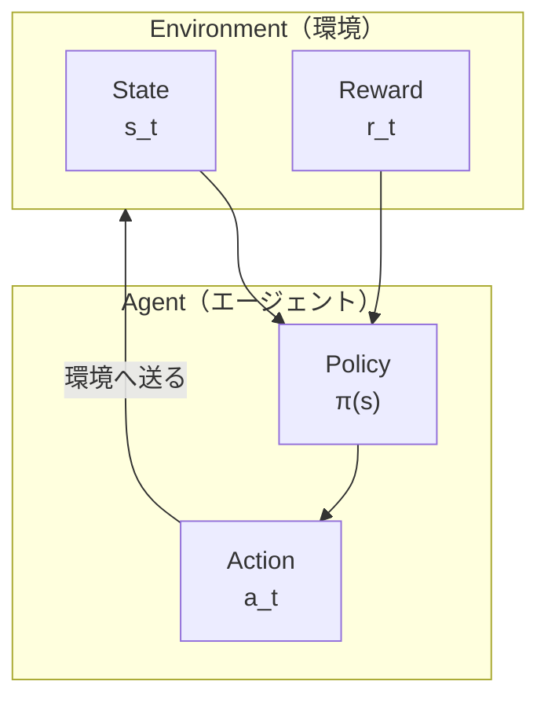

# 強化学習入門

前の記事では、AlphaGo が教師あり学習を用いて人間の棋譜から学習する方法を紹介しました。しかし、教師あり学習には根本的な制限があります：**人間を模倣することしかできず、人間を超えることはできません**。

AI が人間を超えるためには、異なる学習方法が必要です——**強化学習（Reinforcement Learning, RL）**。

この記事では、強化学習の核心概念をゼロから理解し、後の自己対局と MCTS 統合の基礎を築きます。

---

## 強化学習とは？

### 他の学習方法との比較

機械学習には主に3つのパラダイムがあります：

| パラダイム | 学習方法 | 例 |
|------|---------|------|
| **教師あり学習** | ラベル付きデータから学習 | 画像分類、次の一手予測 |
| **教師なし学習** | ラベルなしデータから構造を発見 | クラスタリング、次元削減 |
| **強化学習** | インタラクション経験から学習 | 囲碁、ゲーム、ロボット制御 |

強化学習のユニークな点：**正解を教えてくれる人がいないため、試行錯誤を通じて自分で発見しなければならない**。

### 直感的な例

子犬に新しい芸を教えることを想像してください：

1. 犬がある行動をする（ランダムかもしれない）
2. 行動が正しければ、おやつを与える（正の報酬）
3. 行動が間違っていれば、おやつを与えないか「違う」と言う（負または零の報酬）
4. 何度も試行した後、犬はどの行動が報酬につながるかを学ぶ

これが強化学習の本質です：**報酬信号を通じて行動を学習する**。

### 囲碁における強化学習の応用

囲碁では：
- 各手が「行動」
- 対局終了時の勝敗が「報酬」
- AI は学習する必要がある：どの着手が最終的に勝利につながるか？

ここに大きな課題があります：**報酬の遅延**。一局の碁は200手以上かかることがありますが、最後にならないと勝敗がわかりません。50手目に打った一手が、最終結果にどれだけ貢献したかをどう判断するのでしょうか？

これが強化学習の最も核心的な問題の一つであり、**Credit Assignment Problem（貢献度分配問題）** と呼ばれます。

---

## 核心概念

### Agent（エージェント）と Environment（環境）

強化学習の基本アーキテクチャには2つの主役があります：



**Agent（エージェント）**：
- 意思決定を行う主体
- 囲碁では、打つ AI
- 「Policy（方策）」を持ち、どの状態でどの行動を取るかを決定

**Environment（環境）**：
- Agent が相互作用する対象
- 囲碁では、碁盤 + 対戦相手
- Agent の行動を受け取り、新しい状態と報酬を返す

### State（状態）

**状態 s** は環境の完全な記述です。囲碁では：
- 状態には：現在の盤面、手番、コウの状態などが含まれる
- 状態空間は極めて大きい：約 $10^{170}$ 通りの可能な状態

状態は**マルコフ性**を持つ必要があります：未来は現在の状態のみに依存し、過去には依存しない。

### Action（行動）

**行動 a** は Agent が取れる振る舞いです。囲碁では：
- 各空点が可能な行動
- 「パス」を加えると、$19 \times 19 + 1 = 362$ 種類の行動
- 実際には多くの位置が非合法（自殺手、コウなど）

### Reward（報酬）

**報酬 r** は環境からの行動に対するフィードバックです。囲碁では：
- 勝利：$+1$
- 敗北：$-1$
- 対局中：$0$（これが最も難しいところ！）

報酬信号のスパース性が囲碁強化学習の主な困難の一つです。

### Policy（方策）

**Policy π** は Agent の行動規則であり、各状態で何をすべきかを示します。

方策には以下があります：
- **決定論的方策**：$a = \pi(s)$、各状態に対して唯一の行動が対応
- **確率的方策**：$a \sim \pi(a|s)$、行動の確率分布を出力

AlphaGo では、Policy Network が確率的方策であり、各位置への着手確率を出力します。

---

## マルコフ決定過程（MDP）

### MDP の定義

**マルコフ決定過程（Markov Decision Process, MDP）** は強化学習の数学的フレームワークです。

MDP は五つ組 $(S, A, P, R, \gamma)$ で定義されます：

| 記号 | 意味 | 囲碁での対応 |
|------|------|-------------|
| $S$ | 状態空間 | すべての可能な盤面 |
| $A$ | 行動空間 | すべての合法な着手位置 |
| $P(s'|s,a)$ | 遷移確率 | 次の一手後の盤面変化 |
| $R(s,a,s')$ | 報酬関数 | 勝敗結果 |
| $\gamma$ | 割引率 | 将来の報酬の重要性 |

### マルコフ性

MDP の核心仮定は**マルコフ性（Markov Property）** です：

$$P(s_{t+1}|s_t, a_t, s_{t-1}, a_{t-1}, \ldots, s_0) = P(s_{t+1}|s_t, a_t)$$

平たく言えば：**未来は現在のみに依存し、過去には依存しない**。

囲碁はこの性質を満たすでしょうか？

表面上は、はい——現在の盤面状態を知っていれば、すべての合法手がわかります。しかし実際には、囲碁には**コウ規則**があり、前の一手の状態を記憶する必要があります。AlphaGo は直前8手の盤面を入力特徴にエンコードすることでこの問題を処理しています。

### 囲碁は決定論的 MDP

囲碁には特殊な性質があります：**遷移が決定論的**。

ボードゲームでは、一手打つと、盤面状態の変化は完全に決定的です（サイコロゲームのようなランダム性がない）。よって：

$$P(s'|s,a) = \begin{cases} 1 & \text{if } s' \text{ is the state after executing } a \\ 0 & \text{otherwise} \end{cases}$$

ただし、囲碁は**二人ゲーム**であり、対戦相手の着手が「不確実性」をもたらします。これにより問題は**対抗的 MDP** になります。

### 報酬設計

報酬関数の設計は強化学習において極めて重要です。囲碁では、最も自然な設計は：

$$R(s_T) = \begin{cases} +1 & \text{if AI wins} \\ -1 & \text{if AI loses} \end{cases}$$

ここで $T$ は対局終了のタイムステップです。

この**スパース報酬**は大きな課題をもたらします：
- 一局の碁は200〜300手に及ぶことがある
- 最後の一手でやっと勝敗がわかる
- 途中の一手の良し悪しをどう判断するか？

いくつかの研究では**密な報酬**の設計を試みています、例えば：
- 石を取る報酬
- 地の見積もり報酬
- 形勢判断報酬

しかし、AlphaGo の成功が示すのは：**終局の勝敗のみを報酬として使っても、十分な自己対局を通じて、AI は精妙な中盤戦術を学ぶことができる**。

---

## 価値関数

### なぜ価値関数が必要か？

強化学習の目標は**累積報酬**を最大化することです。しかし報酬は遅延されるため、「現在の状態がどれだけ良いか」を評価する方法が必要です。

これが**価値関数（Value Function）** の役割です。

### 状態価値関数 V(s)

**状態価値関数** $V^\pi(s)$ は次のように定義されます：状態 $s$ から始めて、方策 $\pi$ に従って、期待される累積報酬。

$$V^\pi(s) = \mathbb{E}_\pi \left[ \sum_{t=0}^{\infty} \gamma^t r_{t+1} \mid s_0 = s \right]$$

ここで：
- $\mathbb{E}_\pi$ は方策 $\pi$ の下での期待値
- $\gamma \in [0, 1]$ は**割引率**で、近い将来の報酬を遠い将来より重要視する
- $r_{t+1}$ はタイムステップ $t+1$ で得られる報酬

囲碁では、$V(s)$ は次のように解釈できます：**現在の局面から始めて、AI が勝つ確率**。AlphaGo の Value Network はこの関数を学習しています。

### 行動価値関数 Q(s,a)

**行動価値関数** $Q^\pi(s,a)$ はさらに進んで、状態 $s$ で行動 $a$ を取ることの価値を評価します：

$$Q^\pi(s,a) = \mathbb{E}_\pi \left[ \sum_{t=0}^{\infty} \gamma^t r_{t+1} \mid s_0 = s, a_0 = a \right]$$

$Q(s,a)$ は次のように解釈できます：**現在の局面でこの一手を打って、最終的に勝つ確率**。

### V と Q の関係

これら二つの関数には密接な関係があります：

$$V^\pi(s) = \sum_a \pi(a|s) Q^\pi(s,a)$$

つまり、状態価値 = すべての可能な行動の加重平均で、重みは方策によって決まります。

最適方策 $\pi^*$ がわかれば：

$$V^*(s) = \max_a Q^*(s,a)$$

最適状態価値 = 最適行動の Q 値。

### Bellman 方程式

価値関数は優雅な再帰関係——**Bellman 方程式（Bellman Equation）** を満たします：

$$V^\pi(s) = \sum_a \pi(a|s) \sum_{s'} P(s'|s,a) \left[ R(s,a,s') + \gamma V^\pi(s') \right]$$

平たく言えば：**現在の状態の価値 = 即時報酬 + 割引された次の状態の価値**。

この方程式は動的計画法と多くの強化学習アルゴリズムの理論的基礎です。

### AlphaGo の Value Network

AlphaGo では、Value Network は $V(s)$——現在の局面の勝率を評価することを学習しています。

```
入力：盤面状態 s（19×19×17 の特徴テンソル）
出力：勝率推定 V(s) ∈ [-1, 1]（tanh 活性化を使用）
```

Value Network の訓練目標は最終結果を予測することです：

$$L = \mathbb{E} \left[ (V_\theta(s) - z)^2 \right]$$

ここで $z \in \{-1, +1\}$ は対局の実際の結果です。

---

## Policy Gradient 法

### 価値から方策へ

伝統的な強化学習手法（Q-Learning など）は「価値ベース」です：まず価値関数を学習し、そこから方策を導出します。

しかし、囲碁のように行動空間が巨大な問題では、方策を直接学習する方がより効果的かもしれません。これが**Policy Gradient（方策勾配）** 法のアプローチです。

### 方策のパラメータ化

ニューラルネットワークで方策を表現します：

$$\pi_\theta(a|s)$$

ここで $\theta$ はネットワークパラメータです。ネットワークは状態 $s$ を入力し、各行動の確率を出力します。

AlphaGo では、これが Policy Network です：
- 入力：盤面状態
- 出力：361 箇所の着手確率（+ パス）

### Policy Gradient 定理

最適なパラメータ $\theta^*$ を見つけて、期待累積報酬を最大化したい：

$$J(\theta) = \mathbb{E}_{\pi_\theta} \left[ \sum_t r_t \right]$$

**Policy Gradient 定理**は $J$ の $\theta$ に関する勾配の計算方法を示します：

$$\nabla_\theta J(\theta) = \mathbb{E}_{\pi_\theta} \left[ \sum_t \nabla_\theta \log \pi_\theta(a_t|s_t) \cdot G_t \right]$$

ここで $G_t = \sum_{k=t}^{T} \gamma^{k-t} r_k$ は時刻 $t$ からの累積報酬です。

### 直感的理解

この式は次のように理解できます：

1. **$\nabla_\theta \log \pi_\theta(a_t|s_t)$**：行動 $a_t$ の確率を増やすためにパラメータをどう調整するか
2. **$G_t$**：この行動がもたらした総リターン

よって：
- $G_t > 0$（良い結果）なら、この行動の確率を増やす
- $G_t < 0$（悪い結果）なら、この行動の確率を減らす

これが**Credit Assignment** の一つの解決策です！

### REINFORCE アルゴリズム

**REINFORCE** は最もシンプルな Policy Gradient アルゴリズムです：

```
アルゴリズム：REINFORCE

1. 方策ネットワークパラメータ θ を初期化

2. 繰り返し：
   a. 現在の方策 π_θ で一局の対局を完了し、軌跡を収集：
      τ = (s_0, a_0, r_1, s_1, a_1, r_2, ..., s_T)

   b. 各ステップの累積リターンを計算：
      G_t = r_{t+1} + γ·r_{t+2} + γ²·r_{t+3} + ...

   c. 方策勾配を計算：
      ∇J = (1/T) Σ_t ∇_θ log π_θ(a_t|s_t) · G_t

   d. パラメータを更新：
      θ ← θ + α · ∇J
```

囲碁では、これは以下を意味します：
1. AI に一局自分と対局させる
2. 最終的に勝てば（$G = +1$）、打ったすべての手の確率を増やす
3. 最終的に負ければ（$G = -1$）、打ったすべての手の確率を減らす
4. このプロセスを数百万回繰り返す

### Baseline（ベースライン）

REINFORCE の問題の一つは**分散が大きい**ことです。勝った碁でも、中にはいくつか悪い手があるかもしれませんが、それらの確率も増やされてしまいます。

解決策は**ベースライン（baseline）** を導入することです：

$$\nabla_\theta J = \mathbb{E} \left[ \sum_t \nabla_\theta \log \pi_\theta(a_t|s_t) \cdot (G_t - b(s_t)) \right]$$

一般的な選択は $b(s_t) = V(s_t)$ とすることで、これが**Advantage Function（アドバンテージ関数）** です：

$$A(s_t, a_t) = G_t - V(s_t)$$

アドバンテージ関数は：「この行動は平均よりどれだけ良いか？」を測定します。

- $A > 0$：この行動は期待より良い、確率を増やす
- $A < 0$：この行動は期待より悪い、確率を減らす

AlphaGo は Value Network を使ってベースラインを計算しています。これが Policy Network と Value Network を同時に訓練する必要がある理由です。

---

## 探索と活用

### ジレンマ

強化学習は古典的なジレンマに直面します：**探索と活用（Exploration vs. Exploitation）**。

- **活用（Exploitation）**：現在わかっていることに基づいて、最良と思われる行動を選ぶ
- **探索（Exploration）**：不確実な行動を試して、より良い方策を発見する可能性

純粋な活用は局所最適に陥り、純粋な探索は明らかに悪い手に時間を浪費します。

### 囲碁における課題

囲碁では、この問題は特に深刻です：

1. **行動空間が巨大**：361 種類の可能な着手
2. **報酬がスパース**：終局でしか良し悪しがわからない
3. **長期的影響**：一手の影響は数十手後まで現れないことがある

### ε-Greedy 方策

最もシンプルな探索方法：

$$\pi(a|s) = \begin{cases} 1 - \varepsilon + \frac{\varepsilon}{|A|} & \text{if } a = \arg\max Q(s,a) \\ \frac{\varepsilon}{|A|} & \text{otherwise} \end{cases}$$

$1-\varepsilon$ の確率で最良行動を選び、$\varepsilon$ の確率でランダムに選択。

しかし、囲碁には粗すぎます——ランダムに位置を選んで打つと、ほとんどの場合悪い手になります。

### Softmax 探索

より良い方法は **softmax 分布**を使うことです：

$$\pi(a|s) = \frac{\exp(Q(s,a)/\tau)}{\sum_{a'} \exp(Q(s,a')/\tau)}$$

ここで $\tau$ は**温度パラメータ**です：
- $\tau \to 0$：貪欲方策に近い（純粋な活用）
- $\tau \to \infty$：一様ランダムに近い（純粋な探索）
- $\tau = 1$：探索と活用のバランス

AlphaGo は自己対局訓練で多様性を増やすために類似の技術を使用しています。

### UCB と PUCT

MCTS では、探索と活用は **UCB（Upper Confidence Bound）** 式で処理されます。AlphaGo はその変形 **PUCT** を使用しています：

$$\text{score}(s,a) = Q(s,a) + c_{\text{puct}} \cdot P(s,a) \cdot \frac{\sqrt{N(s)}}{1 + N(s,a)}$$

この式は [PUCT 式の詳細](../puct-formula) で詳しく説明します。

### 本質的探索（Intrinsic Exploration）

AlphaGo にはもう一つの暗黙的な探索メカニズムがあります：**自己対局そのものが探索**です。

ニューラルネットワークは決定論的行動ではなく確率分布を出力するため、各自己対局は異なる棋局を生成します。これにより自然に以下がもたらされます：

- **戦術の多様性**：同じ局面でも異なる着手を試みる可能性
- **スタイルの進化**：訓練に伴い、AI は人間が試したことのない定石を「発見」するかもしれない
- **自己修正**：ある着手が常に負けると、確率は徐々に下がる

---

## 囲碁強化学習の特殊性

### 他の分野との比較

囲碁強化学習にはいくつかの独特な特性があります：

| 特性 | 囲碁 | ロボット制御 | ビデオゲーム |
|------|------|-----------|----------|
| 状態空間 | 離散、極大 | 連続 | 離散、中程度 |
| 行動空間 | 離散、大 | 連続 | 離散、小 |
| 遷移 | 決定論的 | 確率的 | 決定論的または確率的 |
| 報酬 | 極めてスパース | 設計可能 | 中程度の密度 |
| 環境モデル | 既知（ルール） | 未知 | 部分的に既知 |
| 対抗性 | 完全情報ゲーム | 通常なし | あり得る |

### 決定論的遷移

囲碁のルールは完全に既知です。一手打つと、次の状態は決定的です。これは以下を意味します：

- **正確にシミュレート可能**：環境モデルを学習する必要がない
- **完全にバックトラック可能**：MCTS は正確に探索できる
- **環境の確率性を処理する必要がない**：多くの問題が単純化される

### 完全情報

囲碁は**完全情報ゲーム**——双方が完全な盤面を見ることができます。これはポーカー（不完全情報）とは異なり、いくつかの点で問題を単純化します：

- 相手の隠された情報を処理する必要がない
- Minimax フレームワークを使用可能
- 状態表現がより直接的

### 自己対局の可能性

ルールが既知で決定論的なため、AI は実際の対戦相手なしで**自分自身と対局**できます。これにより以下がもたらされます：

- **無限の訓練データ**：いつでも新しい対局を生成可能
- **安定した対戦相手のレベル**：対戦相手は自分自身、レベルは同等
- **段階的な向上**：自分が強くなるにつれ、対戦相手も強くなる

これが AlphaGo 成功の鍵であり、次の記事 [自己対局](../self-play) で詳しく議論します。

### 長期的な Credit Assignment

囲碁の報酬は極めてスパース（終局の勝敗のみ）で、一局の碁は200〜300手に及ぶことがあります。これは厳しい**Credit Assignment Problem** をもたらします：

50手目の良い一手が、250手目で勝利したとき、どう正しく功績を分配するか？

AlphaGo の解決策は複数の技術を組み合わせることです：
1. **Value Network**：中間局面の勝率を評価し、即時フィードバックを提供
2. **MCTS**：各手の良し悪しを探索で検証
3. **大量の対局**：統計を通じて Credit Assignment を学習

### 対称性

碁盤には8重対称性（4回転 × 2鏡映）があります。AlphaGo はこれを**データ拡張**に活用しています：

- 各訓練局面から8つのバリエーションを生成可能
- 有効な訓練データを大幅に増加
- ネットワークが対称性不変の特徴を学習することを保証

---

## アルゴリズムの比較

### 価値ベース vs 方策ベース

| 手法 | 利点 | 欠点 | 適した場面 |
|------|------|------|---------|
| **価値ベース** (Q-Learning) | サンプル効率が高い | 大きな行動空間では困難 | 行動空間が小さい |
| **方策ベース** (REINFORCE) | 大きな行動空間を処理可能 | 分散が大きい、サンプル効率が低い | 行動空間が大きい |
| **Actor-Critic** | 両者のバランス | 二つのネットワークを同時に訓練 | 汎用性が高い |

### AlphaGo の選択

AlphaGo は **Actor-Critic** アーキテクチャの変形を使用しています：

- **Policy Network**（Actor）：直接行動確率を出力
- **Value Network**（Critic）：状態価値を評価

しかし、伝統的な Actor-Critic の更新方法は使わず：

1. **教師あり学習**：まず人間の棋譜から初期 Policy Network を学習
2. **Policy Gradient**：自己対局を通じて Policy Network を強化
3. **回帰学習**：自己対局データで Value Network を訓練
4. **MCTS 統合**：実際の対局で両ネットワークを組み合わせる

このハイブリッドアプローチは複数の技術の利点を組み合わせており、AlphaGo 成功の鍵の一つです。

---

## 実装の考慮事項

### 訓練の安定性

Policy Gradient 法は時々不安定になることがあります。一般的な技術には：

**Gradient Clipping（勾配クリッピング）**：
```python
# 勾配のノルムを制限
max_grad_norm = 0.5
torch.nn.utils.clip_grad_norm_(policy_net.parameters(), max_grad_norm)
```

**学習率減衰**：
```python
# 訓練の進行に伴い学習率を下げる
scheduler = torch.optim.lr_scheduler.StepLR(optimizer, step_size=100, gamma=0.9)
```

**PPO/TRPO などの先進アルゴリズム**：
各更新での方策変化を制限し、破滅的忘却を防ぐ。

### メモリ管理

囲碁の対局は長く、大量の軌跡を保存する必要があります。一般的な戦略：

**Experience Replay（経験再生）**：
```python
# 過去の経験を保存
replay_buffer = ReplayBuffer(max_size=1000000)

# ランダムサンプリングで訓練
batch = replay_buffer.sample(batch_size=256)
```

**Prioritized Experience Replay**：
「意外な」経験（TD 誤差が大きい）を優先的に再生。

### 並列化

強化学習は高度に並列化できます：

- **マルチスレッド対局**：複数の対局を同時に実行
- **分散訓練**：複数のマシンで同時に訓練
- **非同期更新**：A3C などのアルゴリズム

AlphaGo の訓練では数百の GPU と TPU を使用し、数千局の自己対局を同時に行いました。

---

## アニメーション対応

本記事で扱う核心概念とアニメーション番号：

| 番号 | 概念 | 物理/数学対応 |
|------|------|--------------|
| 🎬 H1 | Agent-Environment インタラクション | マルコフ連鎖 |
| 🎬 H4 | Policy Gradient | 確率的最適化 |
| 🎬 H6 | 探索と活用 | 多腕バンディット |

---

## まとめ

強化学習は AlphaGo が人間を超える鍵となる技術です。以下を学びました：

1. **基本フレームワーク**：Agent、Environment、State、Action、Reward
2. **MDP**：マルコフ決定過程、強化学習の数学的基礎
3. **価値関数**：$V(s)$ と $Q(s,a)$、状態と行動の良し悪しを評価
4. **Policy Gradient**：方策を直接最適化する手法、REINFORCE アルゴリズム
5. **探索と活用**：学習過程における核心的なトレードオフ
6. **囲碁の特性**：決定論的、完全情報、スパース報酬の課題と機会

次の記事では、AlphaGo が**自己対局**を活用して人間を超える棋力を達成する方法を深く探ります。

---

## さらに読む

- **次の記事**：[自己対局](../self-play) — なぜ AI は自分と対局することで強くなれるのか
- **関連**：[Value Network 詳解](../value-network) — 価値関数のニューラルネットワーク実装
- **上級**：[PUCT 式詳解](../puct-formula) — 探索と活用の数学的公式

---

## 参考文献

1. Sutton, R. S., & Barto, A. G. (2018). *Reinforcement Learning: An Introduction* (2nd ed.). MIT Press.
2. Silver, D. (2015). ["Lectures on Reinforcement Learning"](https://www.davidsilver.uk/teaching/). University College London.
3. Schulman, J., et al. (2017). "Proximal Policy Optimization Algorithms." *arXiv preprint*.
4. Williams, R. J. (1992). "Simple statistical gradient-following algorithms for connectionist reinforcement learning." *Machine Learning*, 8(3-4), 229-256.
5. Silver, D., et al. (2016). "Mastering the game of Go with deep neural networks and tree search." *Nature*, 529, 484-489.
