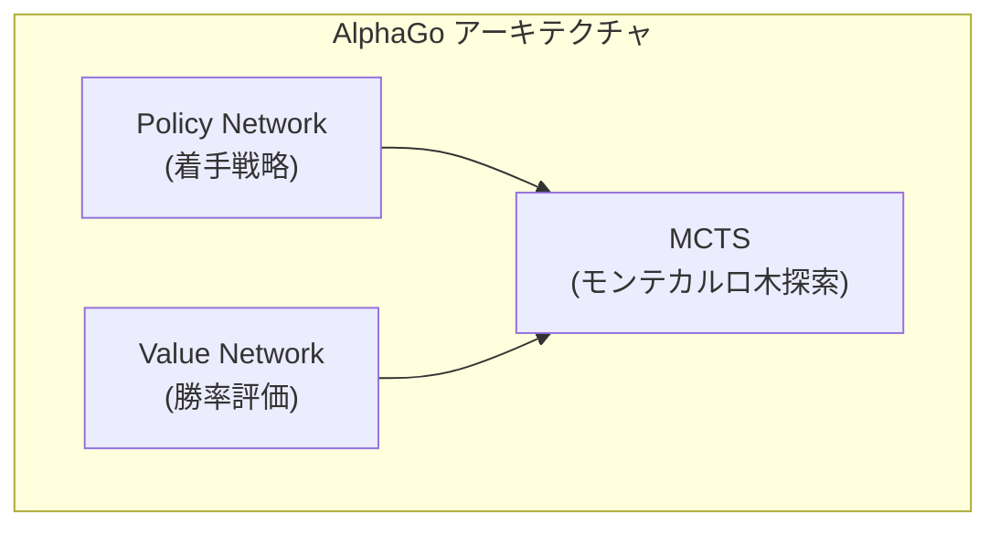
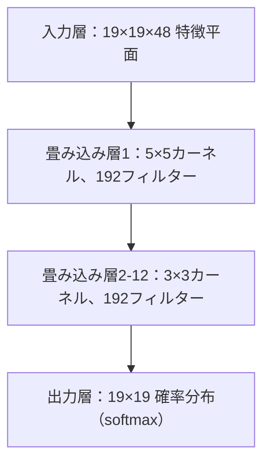
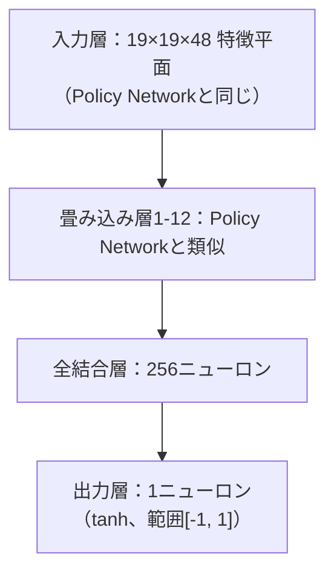
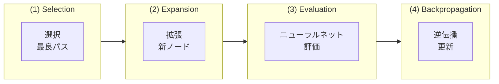
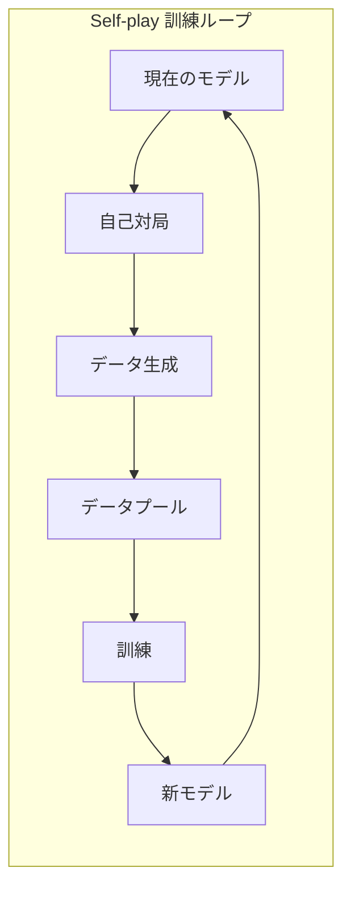
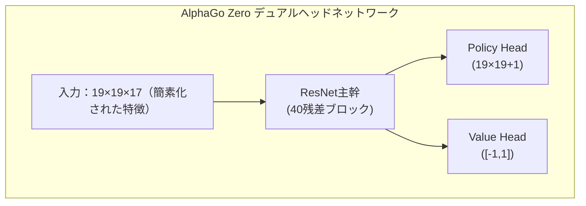

# AlphaGo論文解説

本稿ではDeepMindがNatureに発表した古典論文『Mastering the game of Go with deep neural networks and tree search』、および後続のAlphaGo ZeroとAlphaZero論文を深く解析します。

## AlphaGoの歴史的意義

囲碁は長い間、人工知能の「聖杯」的挑戦と見なされてきました。チェスとは異なり、囲碁の探索空間は極めて膨大です：

| ゲーム | 平均分岐因子 | 平均ゲーム長 | 状態空間 |
|------|-------------|-------------|----------|
| チェス | 約35 | 約80 | 約10^47 |
| 囲碁 | 約250 | 約150 | 約10^170 |

従来の総当たり探索法は囲碁では全く実行不可能です。2016年のAlphaGoによるイ・セドル戦勝利は、深層学習と強化学習の組み合わせの強力な威力を証明しました。

### マイルストーンイベント

- **2015年10月**：AlphaGo Fanがヨーロッパチャンピオン樊麾（プロ二段）に5:0で勝利
- **2016年3月**：AlphaGo Leeが世界チャンピオンのイ・セドル（プロ九段）に4:1で勝利
- **2017年5月**：AlphaGo Masterが世界ランキング1位の柯潔に3:0で勝利
- **2017年10月**：AlphaGo Zero発表、純粋な自己対局訓練で、以前のすべてのバージョンを超越

## 核心技術アーキテクチャ

AlphaGoの核心的革新は3つの重要技術の組み合わせにあります：



### Policy Network（方策ネットワーク）

Policy Networkは各位置の着手確率を予測し、探索方向を導きます。

#### ネットワークアーキテクチャ



#### 入力特徴

AlphaGoは48の特徴平面を入力として使用します：

| 特徴 | 平面数 | 説明 |
|------|--------|------|
| 石の色 | 3 | 黒石、白石、空点 |
| 呼吸点数 | 8 | 1気、2気、...、8気以上 |
| アタリ後の呼吸点数 | 8 | 取った後何気になるか |
| 取れる石数 | 8 | その位置で何子取れるか |
| コウ | 1 | コウ争い位置かどうか |
| 着手合法性 | 1 | その位置に打てるか |
| 直前1-8手の位置 | 8 | 過去数手の着点位置 |
| 手番 | 1 | 現在黒か白の手番 |

#### 訓練方法

Policy Networkの訓練は2段階に分かれます：

**第1段階：教師あり学習（SL Policy Network）**
- KGS囲碁サーバーの3000万局の棋譜を使用
- 目標：人間棋士の次の手を予測
- 57%の予測精度を達成

**第2段階：強化学習（RL Policy Network）**
- SL Policy Networkから開始
- 以前のバージョンの自分と対局
- REINFORCEアルゴリズムで最適化

```python
# 簡略化したPolicy Gradient更新
# reward: +1 勝利, -1 敗北
loss = -log(policy[action]) * reward
```

### Value Network（価値ネットワーク）

Value Networkは現在局面の勝率を評価し、探索深さを削減します。

#### ネットワークアーキテクチャ



#### 訓練方法

Value NetworkはRL Policy Networkの自己対局で生成された3000万局面で訓練されます：

- 各対局からランダムに1局面をサンプリング
- 最終勝敗をラベルとして使用
- MSE損失関数を使用

```python
# Value Network訓練
value_prediction = value_network(position)
loss = (value_prediction - game_outcome) ** 2
```

**なぜ各局1サンプルだけか？**

複数サンプルを取ると、同一対局の隣接局面は高度に相関し、過学習を引き起こします。ランダムサンプリングは訓練データの多様性を確保します。

## モンテカルロ木探索（MCTS）

MCTSはAlphaGoの意思決定の核心で、ニューラルネットワークと組み合わせて効率的に最善手を探索します。

### MCTSの4ステップ



### 選択公式（PUCT）

AlphaGoはPUCT（Predictor + UCT）公式を使用して探索する枝を選択します：

```
a = argmax[Q(s,a) + u(s,a)]

u(s,a) = c_puct * P(s,a) * sqrt(N(s)) / (1 + N(s,a))
```

各項の意味：
- **Q(s,a)**：行動aの平均価値（exploitation）
- **P(s,a)**：Policy Networkが予測した事前確率
- **N(s)**：親ノードの訪問回数
- **N(s,a)**：その行動の訪問回数
- **c_puct**：探索定数、explorationとexploitationのバランス

### 探索プロセス詳解

1. **Selection**：ルートノードから開始、PUCT公式で行動を選択、葉ノードまで
2. **Expansion**：葉ノードで新しい子ノードを展開、Policy Networkで事前確率を初期化
3. **Evaluation**：Value Network評価と高速ロールアウト（Rollout）を組み合わせて価値を評価
4. **Backpropagation**：評価値をパスに沿って逆伝播、Q値とN値を更新

### Rollout（高速プレイアウト）

AlphaGo（非Zeroバージョン）は小型の高速方策ネットワークも使用してシミュレーションを行います：

```
葉ノード → 終局まで高速ランダムプレイアウト → 勝敗計算
```

最終評価値はValue NetworkとRolloutを組み合わせます：

```
V = λ * v_network + (1-λ) * v_rollout
```

AlphaGoはλ = 0.5を使用し、両者に等しい重みを与えます。

## Self-play訓練方法

Self-playはAlphaGoの核心訓練戦略で、AIが自分と対局することで継続的に向上します。

### 訓練ループ



### なぜSelf-playが有効か？

1. **無限のデータ**：人間の棋譜数に制限されない
2. **適応的難易度**：対戦相手の強さが自分と同期して向上
3. **革新の探索**：人間固有の思考パターンに制限されない
4. **明確な目標**：人間を模倣するのではなく、直接勝率を最適化

## AlphaGo Zeroの改良

2017年に発表されたAlphaGo Zeroは革命的な改良をもたらしました：

### 主な違い

| 特性 | AlphaGo | AlphaGo Zero |
|------|---------|--------------|
| 初期訓練 | 人間棋譜の教師あり学習 | 完全にゼロから |
| ネットワークアーキテクチャ | 分離したPolicy/Value | 単一のデュアルヘッドネットワーク |
| ネットワーク構造 | 通常のCNN | ResNet |
| 特徴工学 | 48の手作り特徴 | 17のシンプルな特徴 |
| Rollout | 必要 | 不要 |
| 訓練時間 | 数ヶ月 | 3日で人類超え |

### アーキテクチャの簡素化



### 簡素化された入力特徴

AlphaGo Zeroは17の特徴平面のみを使用：

- 8平面：自分の直近8手の石の位置
- 8平面：相手の直近8手の石の位置
- 1平面：現在どちらの手番か（全0または全1）

### 訓練の改良

1. **純粋なSelf-play**：人間データを一切使用しない
2. **直接MCTSの確率を訓練目標として使用**：二値の勝敗ではなく
3. **Rolloutなし**：完全にValue Networkに依存
4. **単一ネットワーク訓練**：PolicyとValueがパラメータを共有、相互強化

## AlphaZeroの汎用化

2017年末に発表されたAlphaZeroは同じアーキテクチャを囲碁、チェス、将棋に適用：

### 主な特徴

- **ドメイン知識ゼロ**：ゲームルール以外、ドメイン固有の知識を使用しない
- **統一アーキテクチャ**：同じアルゴリズムが異なるボードゲームに適用
- **より高速な訓練**：
  - 囲碁：8時間でAlphaGo Leeを超越
  - チェス：4時間でStockfishを超越
  - 将棋：2時間でElmoを超越

### AlphaGo Zeroとの違い

| 特性 | AlphaGo Zero | AlphaZero |
|------|-------------|-----------|
| 対象ゲーム | 囲碁のみ | 囲碁、チェス、将棋 |
| 対称性利用 | 囲碁の8重対称を利用 | 対称性を仮定しない |
| ハイパーパラメータ調整 | 囲碁向けに最適化 | 汎用設定 |
| 訓練方法 | 最強モデルで自己対局 | 最新モデルで自己対局 |

## 実装のポイント

類似システムを実装したい場合、以下が重要な考慮事項です：

### 計算リソース

AlphaGoの訓練には膨大な計算リソースが必要です：

- **AlphaGo Lee**：176 GPU + 48 TPU
- **AlphaGo Zero**：4 TPU（訓練）+ 1 TPU（自己対局）
- **AlphaZero**：5000 TPU（訓練）

### 重要なハイパーパラメータ

```python
# MCTS関連
num_simulations = 800     # 各手の探索シミュレーション回数
c_puct = 1.5              # 探索定数
temperature = 1.0         # 行動選択の温度パラメータ

# 訓練関連
batch_size = 2048
learning_rate = 0.01      # 減衰あり
l2_regularization = 1e-4
```

### よくある問題

1. **訓練の不安定性**：より小さい学習率を使用、batch sizeを増やす
2. **過学習**：訓練データの多様性を確保、正則化を使用
3. **探索効率**：GPUバッチ推論を最適化、MCTSを並列化

## 参考文献

- [原論文：Mastering the game of Go with deep neural networks and tree search](https://www.nature.com/articles/nature16961)
- [AlphaGo Zero論文：Mastering the game of Go without human knowledge](https://www.nature.com/articles/nature24270)
- [AlphaZero論文：A general reinforcement learning algorithm that masters chess, shogi, and Go through self-play](https://www.science.org/doi/10.1126/science.aar6404)

AlphaGoの技術を理解した後、次は[KataGoがこれを基にどう改良したか](./katago-paper.md)を見ていきましょう。

