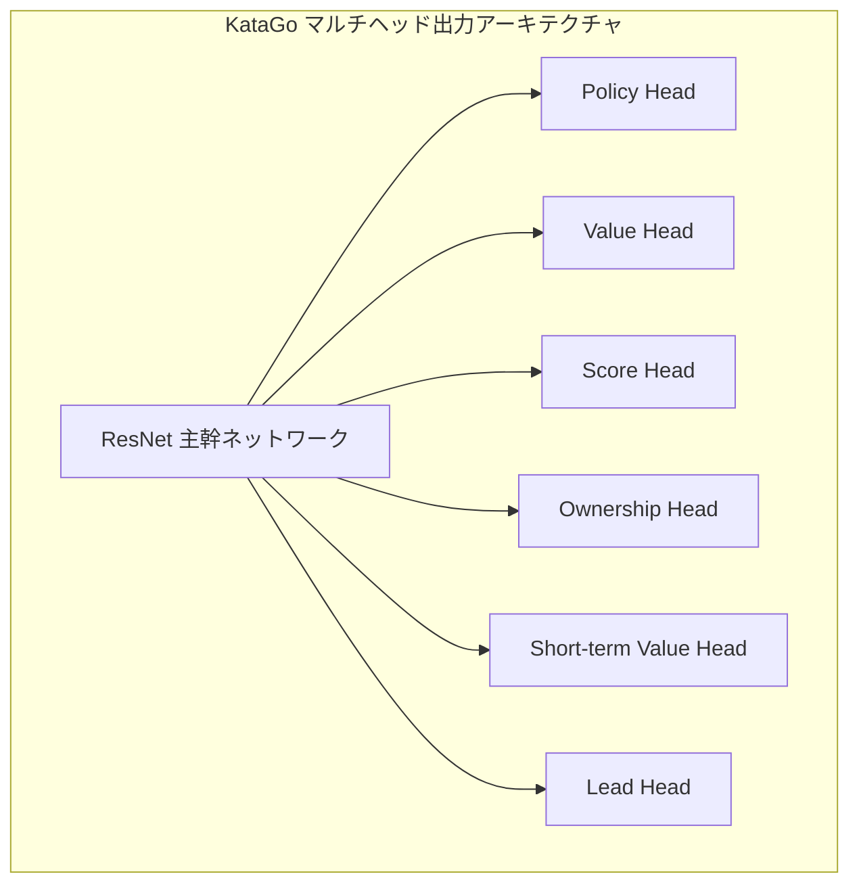
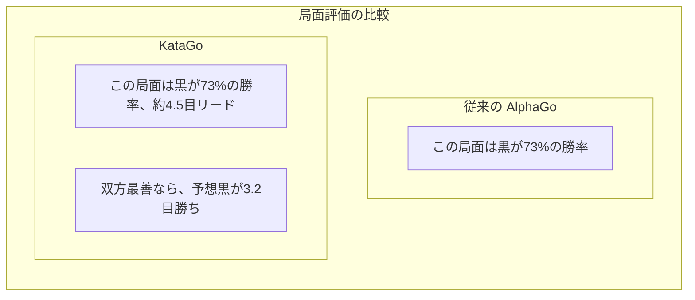

# KataGo論文解説

KataGoはDavid Wuが開発したオープンソース囲碁AIで、その論文『Accelerating Self-Play Learning in Go』は2019年に発表されました。KataGoはより少ない計算リソースでELF OpenGoを超える棋力を達成し、現在最も強力なオープンソース囲碁AIです。

## KataGoの革新点

KataGoはニューラルネットワークアーキテクチャで革命的な変更をしたわけではなく、訓練方法と補助タスクで体系的な最適化を行い、顕著な効率向上を実現しました。

### 核心的革新の概要

| 革新点 | 効果 |
|--------|------|
| 補助訓練目標 | 学習を加速し、より多くの監視信号を提供 |
| グローバルプーリング構造 | グローバル情報をより良く捕捉 |
| 複数ルールサポート | 単一モデルで異なる試合ルールに適応 |
| Playout Capランダム化 | 訓練効率を向上 |
| 改良されたデータ拡張 | 訓練データの多様性を増加 |

## より効率的な訓練方法

### 補助訓練目標（Auxiliary Training Targets）

従来のAlphaGo Zeroは2つの訓練目標のみでした：
1. Policy：MCTSの着手確率分布を予測
2. Value：ゲームの勝敗を予測

KataGoは複数の補助訓練目標を追加し、より豊富な学習信号を提供します：



#### 各出力ヘッドの説明

| 出力ヘッド | 次元 | 予測目標 |
|--------|------|----------|
| **Policy** | 19×19+1 | 各位置の着手確率（パス含む） |
| **Value** | 3 | 勝/負/引き分けの確率 |
| **Score** | 連続値 | 最終目数差の予測 |
| **Ownership** | 19×19 | 各点の最終帰属（黒/白の領地） |
| **Short-term Value** | 1 | 短期的な予想勝率 |
| **Lead** | 1 | 現在何目リードしているか |

### なぜ補助目標が有効か？

1. **より密な監視信号**：Valueは1つの数値のみ、Ownershipは361の監視点を提供
2. **過学習の削減**：マルチタスク学習は正則化効果がある
3. **収束の加速**：補助タスクがネットワークの有用な特徴表現学習を加速
4. **より良い勾配を提供**：勾配消失問題を回避

### Playout Capランダム化

AlphaGo Zeroは各手固定で800回のMCTSシミュレーションを行います。KataGoはランダム化を導入：

```python
# 従来方式
num_playouts = 800  # 固定

# KataGo方式
playout_cap = random.choice([
    100, 200, 300, 400, 500, 600, 700, 800
])
```

**メリット**：
- 訓練データがより多様化
- モデルが異なる探索深度で合理的な判断を学ぶ
- 実際の対局で探索量が少なくても良いパフォーマンス

### データ拡張の改良

従来の方法は囲碁の8重対称性（4回回転×2回ミラー）を利用してデータを拡張します。KataGoはさらに改良：

- **ランダム対称変換**：各サンプリング時にランダムに対称変換を選択
- **履歴状態ランダム化**：履歴盤面の表現方法をランダムに選択
- **色ランダム化**：黒白の視点をランダムに交換

## 複数囲碁ルールのサポート

これはKataGoの重要な特徴の1つです。異なる囲碁ルールは戦略的決定に影響します：

### 主なルールの違い

| ルール体系 | 計点方式 | コミ | コウルール | 自殺 |
|---------|---------|------|---------|------|
| 中国ルール | 数子法 | 7.5目 | 単純コウ | 禁止 |
| 日本ルール | 数目法 | 6.5目 | スーパーコウ | 禁止 |
| 韓国ルール | 数目法 | 6.5目 | スーパーコウ | 禁止 |
| 応氏ルール | 数子法 | 8点 | 特殊コウ規則 | 禁止 |
| Tromp-Taylor | 数子法 | 調整可 | スーパーコウ | 許可 |
| AGAルール | 数子/数目 | 7.5目 | スーパーコウ | 禁止 |
| NZルール | 数子法 | 7目 | 単純コウ | 許可 |

### 技術的実装

KataGoはルール情報を入力特徴としてエンコードします：

```python
# ルール関連入力特徴の例
rule_features = {
    'komi': 7.5,           # コミ値
    'scoring_rule': 'area', # 数子/数目
    'ko_rule': 'simple',    # コウ規則
    'suicide_allowed': False,
    'tax_rule': 'none',     # 「眼」税があるか
    # ...
}
```

ネットワークは異なるルールに応じて戦略を調整することを学びます。例えば：
- 数目法ではより実地コントロールを重視
- 自殺が許可されると特殊戦術に使える
- 異なるコミは布石選択に影響

## 勝率と目数の同時予測

これはKataGoの最も実用的な機能の1つで、囲碁の教育と分析に非常に価値があります。

### Value vs Score



### 実用的価値

1. **より精密な局面判断**：
   - 勝率80%だが1目しかリードしていない → まだ変数あり
   - 勝率80%で20目リード → 大勢は決した

2. **教育支援**：
   - 学生に一手が「何目損したか」を理解させる
   - 異なる打ち方の目数差を比較

3. **置き碁分析**：
   - 置き石が適切かを正確に評価
   - 攻めるべきか守るべきかを判断

### Score Distribution

KataGoは単一の目数だけでなく、完全な目数分布を予測します：

```
目数分布の例：
├─ 黒10目以上勝ち：15%
├─ 黒5-10目勝ち：25%
├─ 黒0-5目勝ち：20%
├─ 白0-5目勝ち：18%
├─ 白5-10目勝ち：15%
└─ 白10目以上勝ち：7%

期待値：黒 +3.2目
標準偏差：±8.5目
```

この分布情報は局面の複雑さと不確実性をより良く反映できます。

## Ownership Map（領地マップ）

Ownershipは各点が終局時に黒方か白方に帰属するかを予測します：

```
                  Ownership Map
    A B C D E F G H J K L M N O P Q R S T
19  ○ ○ ○ ○ ○ ○ · · · · · · · ● ● ● ● ● ●
18  ○ ○ ○ ○ ○ ○ · · · · · · · ● ● ● ● ● ●
17  ○ ○ ○ ○ ○ · · · · · · · · · ● ● ● ● ●
16  ○ ○ ○ ╋ · · · · · ╋ · · · · · ╋ ● ● ●
...

凡例：○ = 白方の領地  ● = 黒方の領地  · = 未定
```

### 応用シーン

- **局面分析**：一目で双方の勢力範囲がわかる
- **死活判断**：ある塊がまだ救えるか判断
- **ヨセ計算**：各所のヨセの価値を評価
- **教育デモ**：領地概念を視覚化して展示

## AlphaGoとの違い比較

| 側面 | AlphaGo Zero | KataGo |
|------|-------------|--------|
| **訓練目標** | Policy + Value | 複数の補助目標 |
| **出力情報** | 勝率 | 勝率 + 目数 + 領地 |
| **ルールサポート** | 単一ルール | 複数ルール |
| **ネットワーク構造** | 純粋な畳み込みResNet | グローバルプーリング追加 |
| **探索量** | 固定 | ランダム化 |
| **訓練効率** | 基準 | 約50倍の効率向上 |
| **オープンソース度** | 論文記述のみ | 完全オープンソース |

### 訓練効率比較

```
ELF OpenGoレベル到達に必要なリソース：

ELF OpenGo:
- 2000 GPU
- 2週間訓練

KataGo:
- 1 GPU（または数十GPU加速）
- 数日〜数週間

効率向上：約50-100倍
```

## ネットワークアーキテクチャの詳細

### グローバルプーリング（Global Pooling）

従来のCNNはローカル情報しか見えませんが、KataGoはグローバルプーリング層を追加してグローバル特徴を捕捉：

```python
class GlobalPoolingBlock(nn.Module):
    def forward(self, x):
        # x: [batch, channels, 19, 19]

        # グローバル平均プーリング
        global_avg = x.mean(dim=[2, 3])  # [batch, channels]

        # グローバル最大プーリング
        global_max = x.max(dim=2)[0].max(dim=1)[0]  # [batch, channels]

        # グローバル特徴を結合
        global_features = torch.cat([global_avg, global_max], dim=1)

        # グローバル特徴を処理
        global_features = dense_layer(global_features)  # [batch, C]

        # グローバル特徴を空間次元にブロードキャスト
        global_features = global_features.view(batch, -1, 1, 1)
        global_features = global_features.expand(-1, -1, 19, 19)

        return torch.cat([x, global_features], dim=1)
```

**メリット**：
- 全局の形勢（誰がリードしているかなど）を感知できる
- 全局判断が必要な局面をより良く処理
- 目数予測に特に有用

### ネットワークスケール

KataGoは異なるサイズのモデルを提供：

| モデル | 残差ブロック数 | チャネル数 | パラメータ数 | 適用シーン |
|------|---------|--------|--------|----------|
| b10c128 | 10 | 128 | 約5M | CPU実行 |
| b15c192 | 15 | 192 | 約15M | 一般GPU |
| b20c256 | 20 | 256 | 約35M | 中級GPU |
| b40c256 | 40 | 256 | 約70M | 上級GPU |
| b60c320 | 60 | 320 | 約150M | ハイエンドGPU |

## 実際のパフォーマンス

### 棋力評価

KataGoの各種テストでのパフォーマンス：

- すべてのLeela Zeroネットワークを超越
- プロ九段との対局で高勝率を維持
- CGOS（Computer Go Server）でランキング1位

### 分析機能

KataGoの分析モードが提供する情報：

```json
{
  "moveInfos": [
    {
      "move": "Q16",
      "visits": 3420,
      "winrate": 0.573,
      "scoreLead": 2.8,
      "pv": ["Q16", "D4", "Q4", "D16"],
      "ownership": [...]
    }
  ],
  "rootInfo": {
    "winrate": 0.48,
    "scoreLead": -0.5,
    "visits": 10000
  }
}
```

## 参考文献

- [KataGo論文：Accelerating Self-Play Learning in Go](https://arxiv.org/abs/1902.10565)
- [KataGo GitHubプロジェクト](https://github.com/lightvector/KataGo)
- [KataGo訓練ログと分析](https://katagotraining.org/)

KataGoの技術特徴を理解した後、[その他の囲碁AIの発展](./zen.md)を見て、業界全体をより包括的に認識しましょう。

