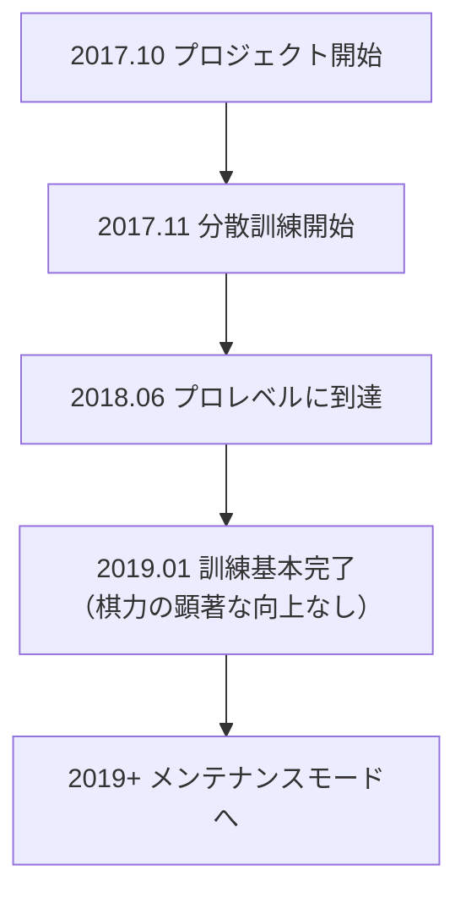

# その他の囲碁AI紹介

AlphaGoとKataGo以外にも、囲碁AI分野には多くの重要なプロジェクトがあります。本稿では主な商用AIとオープンソースAIを紹介し、エコシステム全体の理解を助けます。

## 商用囲碁AI

### 天頂（Zen）

**開発者**：尾島陽児（Yoji Ojima）/ 日本
**初発表**：2009年
**ライセンス**：商用ライセンス

天頂はAlphaGo以前で最強の囲碁プログラムの1つで、従来のMCTS時代にすでにプロレベルに達していました。

#### 発展経緯

| 時期 | バージョン | マイルストーン |
|------|------|--------|
| 2009 | Zen 1.0 | 初リリース |
| 2011 | Zen 4 | アマ六段レベルに到達 |
| 2012 | Zen 5 | 四子で武宮正樹九段に勝利 |
| 2016 | Zen 7 | 深層学習技術を採用 |
| 2017+ | Deep Zen Go | AlphaGoアーキテクチャを結合 |

#### 技術的特徴

- **ハイブリッドアーキテクチャ**：従来のヒューリスティックと深層学習を結合
- **商用最適化**：消費者向けハードウェア向けに最適化
- **高い安定性**：多年の商用利用で検証済み
- **マルチプラットフォーム**：Windows、macOSで実行可能

#### 製品形態

- **天頂の碁（Tengen）**：デスクトップソフト、約10,000円
- **ネット対局**：かつてKGSでZen19アカウントで活動

---

### 絶芸（Fine Art）

**開発者**：テンセントAI Lab / 中国
**初発表**：2016年
**ライセンス**：非公開

絶芸はテンセントが開発した囲碁AIで、中国囲碁界で重要な影響力を持っています。

#### 発展経緯

| 時期 | イベント |
|------|------|
| 2016年11月 | 初登場、野狐囲碁網で対局 |
| 2017年3月 | UEC杯コンピュータ囲碁大会優勝 |
| 2017年 | 中国ナショナルチームが訓練ツールとして採用 |
| 2018年 | 世界人工知能囲碁大会優勝 |
| 現在まで | ナショナルチームの訓練補助として継続使用 |

#### 技術的特徴

- **大規模訓練**：テンセントのクラウドコンピューティングリソースを使用
- **トップ棋士との協力**：大量の専門的指導を受けた
- **豊富な実戦経験**：野狐囲碁で大量の対局を蓄積
- **教育機能統合**：検討分析機能を提供

#### 影響力

絶芸の中国プロ囲碁への影響は深遠です：

- ナショナルチームの標準訓練ツールに
- プロ棋士の試合準備方法を変えた
- AI支援訓練の普及を推進

---

### 星陣（Golaxy）

**開発者**：中国深客科技 / 清華大学チーム
**初発表**：2018年
**ライセンス**：商用ライセンス

星陣は「最も人間らしいAI」を設計目標とし、棋風が人間棋士に近いです。

#### 技術的特徴

- **人間化された棋風**：意図的に人間らしい打ち方に訓練
- **調整可能な難易度**：異なる段位の相手をシミュレート可能
- **教育指向**：設計時に教育応用を考慮
- **置き碁専門**：置き碁で特別な最適化

#### 製品応用

- **弈客囲碁**：弈客アプリに統合
- **教育プラットフォーム**：オンライン囲碁教育に使用
- **段位テスト**：標準化された段位評価を提供

---

### その他の商用AI

| 名称 | 開発者 | 特徴 |
|------|--------|------|
| **石子旋風** | 林在範（台湾） | UEC杯優勝経験あり |
| **CGI** | 交通大学（台湾） | 学術研究指向 |
| **Dolbaram** | NHN（韓国） | 韓国囲碁プラットフォームに統合 |
| **AQ** | 日本AQチーム | オープンソース後に商用化 |

## オープンソース囲碁AI

### Leela Zero

**開発者**：Gian-Carlo Pascutto / ベルギー
**初発表**：2017年
**ライセンス**：GPL-3.0
**GitHub**：https://github.com/leela-zero/leela-zero

Leela ZeroはAlphaGo Zeroを最初に成功裏に再現したオープンソースプロジェクトで、コミュニティの分散訓練によるものです。

#### 発展経緯



#### 技術的特徴

- **忠実な再現**：AlphaGo Zero論文に厳密に従って実装
- **分散訓練**：世界中のボランティアがGPU計算を貢献
- **完全透明**：すべての訓練データとモデルを公開
- **標準GTP**：すべてのGTP囲碁ソフトと互換

#### 訓練統計

| 項目 | 数値 |
|------|------|
| 総自己対局数 | 約1800万局 |
| 訓練イテレーション | 約270回 |
| 貢献者数 | 数千人 |
| 訓練期間 | 約1.5年 |

#### 使用方法

```bash
# インストール
brew install leela-zero  # macOS

# 実行
leelaz --gtp --weights best-network.gz

# GTPコマンド
genmove black
play white D4
```

#### 現状

Leela Zeroは積極的な訓練を終えていますが：
- コードはAlphaGo Zero学習の優れたリソース
- 訓練済みモデルはまだ使用可能
- コミュニティが基本機能をメンテナンス中

---

### ELF OpenGo

**開発者**：Facebook AI Research (FAIR)
**初発表**：2018年
**ライセンス**：BSD
**GitHub**：https://github.com/pytorch/ELF

ELF OpenGoはFacebookが開発した囲碁AIで、大規模分散訓練の能力を示しました。

#### 技術的特徴

- **ELFフレームワーク**：FacebookのELF（Extensive, Lightweight, and Flexible）ゲーム研究プラットフォームに基づく
- **大規模訓練**：2000 GPUを使用して訓練
- **PyTorch実装**：Facebook独自の深層学習フレームワークを使用
- **研究指向**：主目的は実用ではなく研究

#### パフォーマンス

- KGSでトップレベルに到達
- プロ九段との対局で安定した勝率
- 論文はトップカンファレンスで発表

#### 現状

- プロジェクトは積極的メンテナンス終了
- コードとモデルはダウンロード可能
- 主な価値は学術参考

---

### SAI（Sensible Artificial Intelligence）

**開発者**：SAIチーム / ヨーロッパ
**初発表**：2019年
**ライセンス**：MIT
**GitHub**：https://github.com/sai-dev/sai

SAIはLeela Zeroベースの改良版で、実験的機能に焦点を当てています。

#### 技術的特徴

- **改良された訓練方法**：各種訓練最適化を実験
- **より多くのルールサポート**：Leela Zeroより多くの囲碁ルールをサポート
- **実験的機能**：新しいネットワークアーキテクチャと訓練技術をテスト

#### 現状

- 小規模コミュニティがメンテナンス中
- 主に実験と学習に使用

---

### PhoenixGo

**開発者**：テンセントWeChatチーム
**初発表**：2018年
**ライセンス**：BSD-3
**GitHub**：https://github.com/Tencent/PhoenixGo

PhoenixGoはテンセントがオープンソース化した囲碁AIで、2018年世界人工知能囲碁大会で優勝しました。

#### 技術的特徴

- **商用品質**：テンセント内部プロジェクト由来
- **TensorFlow実装**：主流フレームワークを使用
- **マルチプラットフォーム**：Linux、Windows、macOS
- **分散サポート**：マルチマシン・マルチGPU環境で実行可能

#### 使用方法

```bash
# コンパイル
bazel build //src:mcts_main

# 実行
./mcts_main --gtp --config_path=config.conf
```

---

### MiniGo

**開発者**：Google Brain
**初発表**：2018年
**ライセンス**：Apache-2.0
**GitHub**：https://github.com/tensorflow/minigo

MiniGoはGoogleがオープンソース化した教育目的の囲碁AIで、より多くの人にAlphaGoの原理を理解させることを目的としています。

#### 技術的特徴

- **教育指向**：コードが明確で読みやすい
- **TensorFlow実装**：Google公式サンプル
- **完全なドキュメント**：詳細な技術説明あり
- **Colabサポート**：Google Colabで直接実行可能

#### 適用シーン

- AlphaGo Zeroアーキテクチャを学ぶ
- ゲームにおける強化学習の応用を理解
- 自分のプロジェクトの出発点として

## 各AIの特徴比較

### 棋力比較（概算）

| AI | 棋力レベル | 備考 |
|----|---------|------|
| KataGo | トップ超人 | 訓練継続中 |
| 絶芸 | トップ超人 | 非公開 |
| Leela Zero | 超人 | 訓練終了 |
| ELF OpenGo | 超人 | 訓練終了 |
| PhoenixGo | 準超人 | 訓練終了 |
| 天頂 | プロレベル | 商用製品 |
| 星陣 | プロレベル | 難易度調整可 |

### 機能比較

| 機能 | KataGo | Leela Zero | PhoenixGo | 天頂 |
|------|--------|------------|-----------|------|
| オープンソース | ✓ | ✓ | ✓ | ✗ |
| 目数予測 | ✓ | ✗ | ✗ | △ |
| マルチルール | ✓ | ✗ | ✗ | ✗ |
| Analysis API | ✓ | ✗ | ✗ | ✗ |
| CPUモード | ✓ | ✓ | ✓ | ✓ |
| 継続更新 | ✓ | ✗ | ✗ | △ |

### 適用シーン提案

| ニーズ | 推奨選択 | 理由 |
|------|---------|------|
| 一般対局/分析 | KataGo | 最強で機能最全 |
| AlphaGoを学ぶ | Leela Zero / MiniGo | コードが明確 |
| 商用応用 | 天頂 / 自己訓練KataGo | ライセンスが明確 |
| 教育支援 | KataGo / 星陣 | 豊富な分析機能 |
| 研究実験 | KataGo / SAI | 訓練を修正可能 |

## 将来の発展トレンド

### 技術トレンド

1. **より効率的な訓練方法**
   - KataGoが示した効率向上のように
   - より少ないリソースでより高い棋力

2. **より良い説明可能性**
   - AIがなぜこの手を打つか説明
   - 人間がAIの思考を理解するのを助ける

3. **人間スタイルとの結合**
   - 特定棋士のスタイルに似たAIを訓練
   - 教育と研究に使用

4. **ゲーム間の汎用性**
   - AlphaZeroが示したように
   - 単一フレームワークで複数ゲームに適用

### 応用トレンド

1. **普及化**
   - より多くの囲碁愛好家がAI分析を使用
   - スマホなどでも実行可能

2. **専門化**
   - プロ棋手がAI訓練に深く依存
   - AI支援の標準化

3. **商業化**
   - より多くのAI支援囲碁製品
   - 教育、分析、陪練などのサービス

## まとめ

囲碁AIのエコシステムは豊かで多様です：

- **最強の棋力と最全の機能が欲しい**：KataGoを選択
- **AIの原理を学びたい**：Leela ZeroまたはMiniGoのコードを研究
- **商用応用ニーズ**：天頂を評価または自己訓練モデル
- **特殊ニーズ**：具体的状況に応じて選択または組み合わせ

次は実践編に入り、[KataGoのインストールと使用方法](/docs/for-engineers/katago-source/)を学びましょう！

