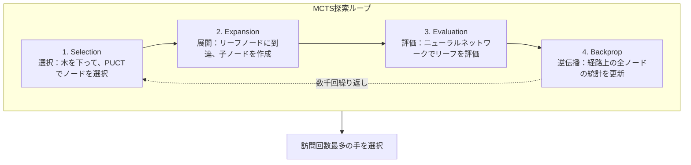

# MCTS実装詳細

本記事では、KataGoにおけるモンテカルロ木探索（MCTS）の実装詳細を、データ構造、選択戦略、並列化技術を含めて詳しく解説します。

---

## MCTSの4ステップ復習



---

## ノードのデータ構造

### コアデータ

各MCTSノードは以下を保存する必要があります：

```python
class MCTSNode:
    def __init__(self, state, parent=None, prior=0.0):
        # 基本情報
        self.state = state              # 盤面状態
        self.parent = parent            # 親ノード
        self.children = {}              # 子ノード辞書 {action: node}
        self.action = None              # このノードに到達した手

        # 統計情報
        self.visit_count = 0            # N(s)：訪問回数
        self.value_sum = 0.0            # W(s)：価値の合計
        self.prior = prior              # P(s,a)：事前確率

        # 並列探索用
        self.virtual_loss = 0           # 仮想損失
        self.is_expanded = False        # 展開済みかどうか

    @property
    def value(self):
        """Q(s) = W(s) / N(s)"""
        if self.visit_count == 0:
            return 0.0
        return self.value_sum / self.visit_count
```

### メモリ最適化

KataGoはメモリ使用量を削減するために複数の技術を使用しています：

```python
# Python dictの代わりにnumpy配列を使用
class OptimizedNode:
    __slots__ = ['visit_count', 'value_sum', 'prior', 'children_indices']

    def __init__(self):
        self.visit_count = np.int32(0)
        self.value_sum = np.float32(0.0)
        self.prior = np.float32(0.0)
        self.children_indices = None  # 遅延割り当て
```

---

## Selection：PUCT選択

### PUCT公式

```
選択スコア = Q(s,a) + U(s,a)

ここで：
Q(s,a) = W(s,a) / N(s,a)              # 平均価値
U(s,a) = c_puct × P(s,a) × √(N(s)) / (1 + N(s,a))  # 探索項
```

### パラメータの説明

| 記号 | 意味 | 典型値 |
|------|------|--------|
| Q(s,a) | 手aの平均価値 | [-1, +1] |
| P(s,a) | ニューラルネットワークの事前確率 | [0, 1] |
| N(s) | 親ノードの訪問回数 | 整数 |
| N(s,a) | 手aの訪問回数 | 整数 |
| c_puct | 探索定数 | 1.0 ~ 2.5 |

### 実装

```python
def select_child(self, c_puct=1.5):
    """PUCTスコア最大の子ノードを選択"""
    best_score = -float('inf')
    best_action = None
    best_child = None

    # 親ノードの訪問回数の平方根
    sqrt_parent_visits = math.sqrt(self.visit_count)

    for action, child in self.children.items():
        # Q値（平均価値）
        if child.visit_count > 0:
            q_value = child.value_sum / child.visit_count
        else:
            q_value = 0.0

        # U値（探索項）
        u_value = c_puct * child.prior * sqrt_parent_visits / (1 + child.visit_count)

        # 総スコア
        score = q_value + u_value

        if score > best_score:
            best_score = score
            best_action = action
            best_child = child

    return best_action, best_child
```

### 探索と活用のバランス

```
初期：N(s,a)が小さい
├── U(s,a)が大きい → 探索が主体
└── 高い事前確率の手が優先的に探索される

後期：N(s,a)が大きい
├── U(s,a)が小さい → 活用が主体
└── Q(s,a)が支配し、既知の良い手を選択
```

---

## Expansion：ノード展開

### 展開条件

リーフノードに到達したとき、ニューラルネットワークで展開します：

```python
def expand(self, policy_probs, legal_moves):
    """ノードを展開し、全ての合法手の子ノードを作成"""
    for action in legal_moves:
        if action not in self.children:
            prior = policy_probs[action]  # ニューラルネットワーク予測の確率
            child_state = self.state.play(action)
            self.children[action] = MCTSNode(
                state=child_state,
                parent=self,
                prior=prior
            )

    self.is_expanded = True
```

### 合法手のフィルタリング

```python
def get_legal_moves(state):
    """全ての合法手を取得"""
    legal = []
    for i in range(361):
        x, y = i // 19, i % 19
        if state.is_legal(x, y):
            legal.append(i)

    # パスを追加
    legal.append(361)

    return legal
```

---

## Evaluation：ニューラルネットワーク評価

### 単一評価

```python
def evaluate(self, state):
    """ニューラルネットワークで局面を評価"""
    # 入力特徴をエンコード
    features = encode_state(state)  # (22, 19, 19)
    features = torch.tensor(features).unsqueeze(0)  # (1, 22, 19, 19)

    # ニューラルネットワーク推論
    with torch.no_grad():
        output = self.network(features)

    policy = output['policy'][0].numpy()  # (362,)
    value = output['value'][0].item()     # スカラー

    return policy, value
```

### バッチ評価（重要な最適化）

GPUはバッチ推論で最も効率的です：

```python
class BatchedEvaluator:
    def __init__(self, network, batch_size=8):
        self.network = network
        self.batch_size = batch_size
        self.pending = []  # 評価待ちの (state, callback) リスト

    def request_evaluation(self, state, callback):
        """評価をリクエストし、バッチが満たされたら自動実行"""
        self.pending.append((state, callback))

        if len(self.pending) >= self.batch_size:
            self.flush()

    def flush(self):
        """バッチ評価を実行"""
        if not self.pending:
            return

        # バッチ入力を準備
        states = [s for s, _ in self.pending]
        features = torch.stack([encode_state(s) for s in states])

        # バッチ推論
        with torch.no_grad():
            outputs = self.network(features)

        # 結果をコールバック
        for i, (_, callback) in enumerate(self.pending):
            policy = outputs['policy'][i].numpy()
            value = outputs['value'][i].item()
            callback(policy, value)

        self.pending.clear()
```

---

## Backpropagation：逆伝播更新

### 基本的な逆伝播

```python
def backpropagate(self, value):
    """リーフノードからルートノードまで逆伝播し、統計情報を更新"""
    node = self

    while node is not None:
        node.visit_count += 1
        node.value_sum += value

        # 視点の交代：相手の価値は逆になる
        value = -value

        node = node.parent
```

### 視点交代の重要性

```
黒の視点：value = +0.6（黒有利）

逆伝播経路：
リーフノード（黒の手番）: value_sum += +0.6
    ↑
親ノード（白の手番）: value_sum += -0.6  ← 白にとっては不利
    ↑
祖父ノード（黒の手番）: value_sum += +0.6
    ↑
...
```

---

## 並列化：仮想損失

### 問題

マルチスレッドで同時探索すると、全て同じノードを選択する可能性があります：

```
Thread 1: ノードAを選択（Q=0.6, N=100）
Thread 2: ノードAを選択（Q=0.6, N=100）← 重複！
Thread 3: ノードAを選択（Q=0.6, N=100）← 重複！
```

### 解決策：仮想損失

ノード選択時に、まず「仮想損失」を追加して、他のスレッドがそれを選びたくなくなるようにします：

```python
VIRTUAL_LOSS = 3  # 仮想損失値

def select_with_virtual_loss(self):
    """仮想損失付きの選択"""
    action, child = self.select_child()

    # 仮想損失を追加
    child.visit_count += VIRTUAL_LOSS
    child.value_sum -= VIRTUAL_LOSS  # 負けたと仮定

    return action, child

def backpropagate_with_virtual_loss(self, value):
    """逆伝播時に仮想損失を除去"""
    node = self

    while node is not None:
        # 仮想損失を除去
        node.visit_count -= VIRTUAL_LOSS
        node.value_sum += VIRTUAL_LOSS

        # 通常の更新
        node.visit_count += 1
        node.value_sum += value

        value = -value
        node = node.parent
```

### 効果

```
Thread 1: ノードAを選択、仮想損失を追加
         Aの Q値が一時的に低下

Thread 2: ノードBを選択（Aが悪く見えるため）

Thread 3: ノードCを選択

→ 異なるスレッドが異なる分岐を探索し、効率が向上
```

---

## 完全な探索実装

```python
class MCTS:
    def __init__(self, network, c_puct=1.5, num_simulations=800):
        self.network = network
        self.c_puct = c_puct
        self.num_simulations = num_simulations
        self.evaluator = BatchedEvaluator(network)

    def search(self, root_state):
        """MCTS探索を実行"""
        root = MCTSNode(root_state)

        # ルートノードを展開
        policy, value = self.evaluate(root_state)
        legal_moves = get_legal_moves(root_state)
        root.expand(policy, legal_moves)

        # シミュレーションを実行
        for _ in range(self.num_simulations):
            node = root
            path = [node]

            # Selection：木を下る
            while node.is_expanded and node.children:
                action, node = node.select_child(self.c_puct)
                path.append(node)

            # Expansion + Evaluation
            if not node.is_expanded:
                policy, value = self.evaluate(node.state)
                legal_moves = get_legal_moves(node.state)

                if legal_moves:
                    node.expand(policy, legal_moves)

            # Backpropagation
            for n in reversed(path):
                n.visit_count += 1
                n.value_sum += value
                value = -value

        # 訪問回数最多の手を選択
        best_action = max(root.children.items(),
                         key=lambda x: x[1].visit_count)[0]

        return best_action

    def evaluate(self, state):
        features = encode_state(state)
        features = torch.tensor(features).unsqueeze(0)

        with torch.no_grad():
            output = self.network(features)

        return output['policy'][0].numpy(), output['value'][0].item()
```

---

## 高度な技術

### ディリクレノイズ

訓練時にルートノードにノイズを追加して探索を増やします：

```python
def add_dirichlet_noise(root, alpha=0.03, epsilon=0.25):
    """ルートノードにディリクレノイズを追加"""
    noise = np.random.dirichlet([alpha] * len(root.children))

    for i, child in enumerate(root.children.values()):
        child.prior = (1 - epsilon) * child.prior + epsilon * noise[i]
```

### 温度パラメータ

手の選択のランダム性を制御します：

```python
def select_action_with_temperature(root, temperature=1.0):
    """訪問回数と温度に基づいて手を選択"""
    visits = np.array([c.visit_count for c in root.children.values()])
    actions = list(root.children.keys())

    if temperature == 0:
        # 貪欲選択
        return actions[np.argmax(visits)]
    else:
        # 訪問回数の確率分布に基づいて選択
        probs = visits ** (1 / temperature)
        probs = probs / probs.sum()
        return np.random.choice(actions, p=probs)
```

### 木の再利用

新しい手で以前の探索木を再利用できます：

```python
def reuse_tree(root, action):
    """部分木を再利用"""
    if action in root.children:
        new_root = root.children[action]
        new_root.parent = None
        return new_root
    else:
        return None  # 新しい木を作成する必要あり
```

---

## パフォーマンス最適化のまとめ

| 技術 | 効果 |
|------|------|
| **バッチ評価** | GPU使用率が10% → 80%以上に |
| **仮想損失** | マルチスレッド効率が3-5倍向上 |
| **木の再利用** | コールドスタートを削減、計算を30%以上節約 |
| **メモリプール** | メモリ割り当てオーバーヘッドを削減 |

---

## 関連記事

- [ニューラルネットワークアーキテクチャ詳解](../neural-network) — 評価関数の元
- [GPUバックエンドと最適化](../gpu-optimization) — バッチ推論のハードウェア最適化
- [重要論文ガイド](../papers) — PUCT公式の理論的基礎
