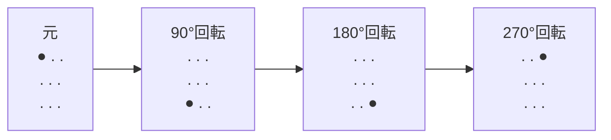
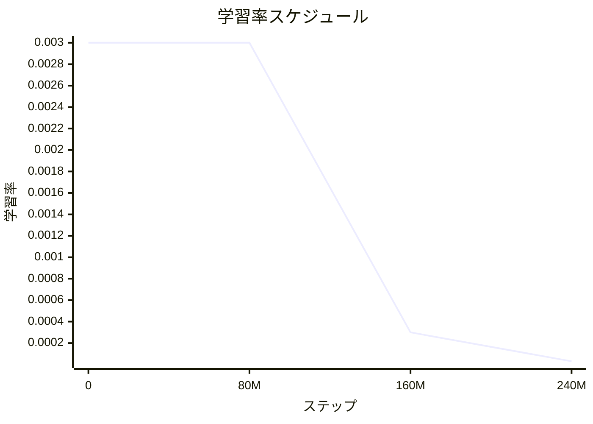
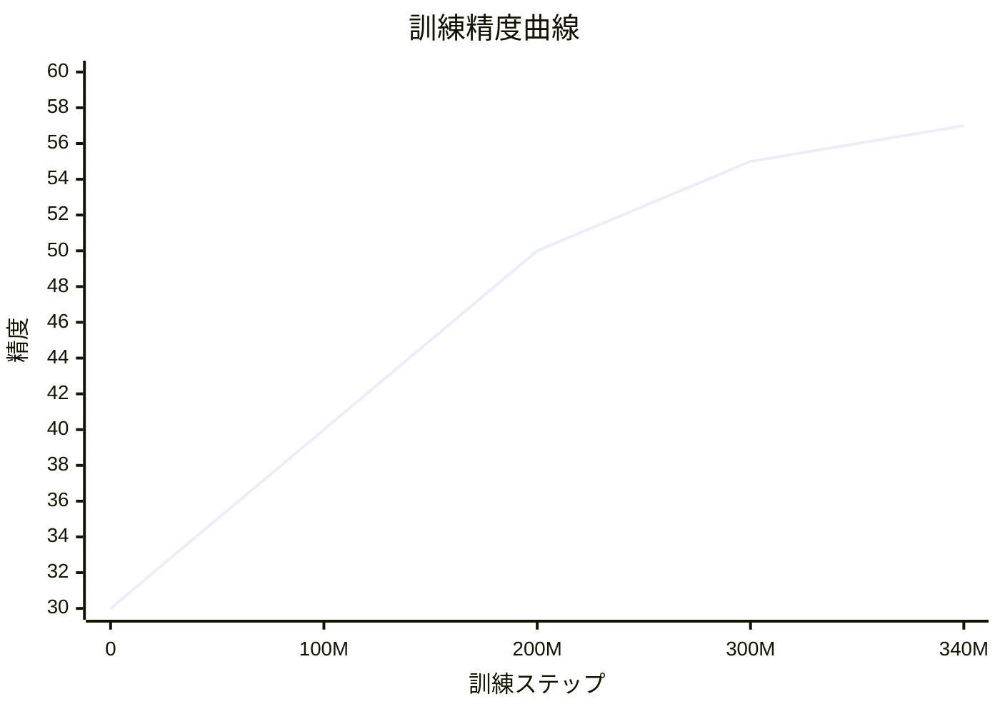

import { EloChart } from '@site/src/components/D3Charts';

# 教師あり学習フェーズ

AlphaGoが自己対局できるようになる前に、まず大量の人間の棋譜を「見る」必要がありました。このプロセスを**教師あり学習**と呼びます。

3000万の人間の対局局面を分析することで、AlphaGoのPolicy Networkは**57%の予測精度**を達成しました——半分以上のケースで、人間エキスパートの次の一手を当てることができます。

これはあまり印象的に聞こえないかもしれませんが、各局面に平均250通りの合法手があることを考えると、これは驚くべき成果です。

---

## なぜ人間の棋譜から始めるのか？

### 学習の出発点

囲碁を全く知らない人に囲碁を教えることを想像してください。どうしますか？

**方法A：ランダム探索**
```
好き勝手に打たせて、徐々に良い手を発見させる
→ 効率が極めて低く、永遠に学べない可能性がある
```

**方法B：上手の打ち方を見る**
```
大量のプロ棋士の対局を見せて、その打ち方を模倣させる
→ 基礎ができてから、自分で探索する
```

AlphaGoは方法Bを選びました。教師あり学習は「上手の打ち方を見る」の数学的バージョンです。

### 人間の棋譜の価値

人間は数千年かけて囲碁理論を発展させてきました。この知識はすべて棋譜に符号化されています：

- **定石**：長期間検証された序盤の打ち方
- **中盤戦術**：攻防転換の知恵
- **ヨセ技術**：目数計算の精髄
- **大局観**：全局判断の直感

教師あり学習により、AlphaGoはこれらの人間の知恵を「継承」し、ゼロから手探りする必要がなくなります。

---

## 訓練データの出典

### KGS Go Server

AlphaGoの訓練データは主に**KGS Go Server**（Kiseido Go Serverとも呼ばれる）から来ています。これは有名なオンライン囲碁プラットフォームです。

#### KGSの特徴

| 特性 | 説明 |
|------|------|
| ユーザー | アマチュア棋士が中心、プロ棋士も参加 |
| 棋力範囲 | 入門から九段まで |
| 対局記録 | 完全なSGF棋譜を保存 |
| 活動期間 | 2000年から現在まで |

#### なぜKGSを選んだのか？

1. **データ量が多い**：数百万局の棋譜
2. **フォーマットが統一**：SGFフォーマットで解析しやすい
3. **棋力ラベルあり**：各ユーザーにレーティングがある
4. **多様性**：異なるスタイルの棋士

### 3000万局面

KGSの棋譜から、DeepMindは約**3000万の局面**を抽出しました：

```
元データ:
- 約16万局の棋譜
- 各局約200手
- 合計 〜3200万局面

データ選別:
- 低段位の対局をフィルタリング
- 中途投了の局面をフィルタリング
- 最終的に約3000万の高品質局面
```

### データフォーマット

各訓練サンプルには以下が含まれます：

```python
{
    "board_state": [[0, 1, 2, ...], ...],  # 19×19 盤面
    "features": [...],                      # 48の特徴プレーン
    "next_move": 123,                       # 人間が打った位置 (0-360)
    "game_result": 1,                       # 1=黒勝ち, -1=白勝ち
    "player_rank": "5d",                    # この手を打った人の段位
}
```

---

## データ前処理

### SGF解析

SGF（Smart Game Format）は囲碁棋譜の標準フォーマットです：

```
(;GM[1]FF[4]CA[UTF-8]AP[CGoban:3]ST[2]
RU[Japanese]SZ[19]KM[6.50]
PW[White]PB[Black]
;B[pd];W[dd];B[pq];W[dp];B[qk];W[nc]...
)
```

解析が必要な項目：
- 盤面サイズ（SZ[19]）
- 各手（B[pd], W[dd]...）
- 対局結果（RE[B+2.5]）

```python
def parse_sgf(sgf_string):
    """SGF棋譜を解析"""
    moves = []
    # すべての着手を抽出
    pattern = r';([BW])\[([a-s]{2})\]'
    for match in re.finditer(pattern, sgf_string):
        color = match.group(1)  # 'B' or 'W'
        coord = match.group(2)  # 'pd', 'dd', etc.

        # 座標を変換
        x = ord(coord[0]) - ord('a')
        y = ord(coord[1]) - ord('a')

        moves.append((color, x, y))

    return moves
```

### 特徴抽出

各局面について、48の特徴プレーンを抽出します（詳細は[入力特徴量の設計](../input-features)を参照）：

```python
def extract_features(board, history, current_player):
    """48の特徴プレーンを抽出"""
    features = np.zeros((48, 19, 19))

    # 石の位置
    features[0] = (board == 1)  # 黒石
    features[1] = (board == 2)  # 白石
    features[2] = (board == 0)  # 空点

    # 履歴記録
    for i, hist in enumerate(history[:8]):
        features[3+i] = (hist == 1)
        features[11+i] = (hist == 2)

    # 呼吸点数、アタリ、シチョウなど...
    # (詳細な実装は省略)

    return features
```

### データ拡張

囲碁盤には**8重の対称性**（4回の回転 × 2回の鏡映）があります。各元サンプルは8つになります：



*それぞれを水平反転して、8つの等価な訓練サンプルを得る*

これにより有効な訓練データが8倍に増加し、同時にモデルが学習するパターンが特定の方向に依存しないことを保証します。

```python
def augment(state, action):
    """8重対称性拡張"""
    augmented = []

    for rotation in [0, 1, 2, 3]:  # 0, 90, 180, 270度
        rotated_state = np.rot90(state, rotation, axes=(1, 2))
        rotated_action = rotate_action(action, rotation)
        augmented.append((rotated_state, rotated_action))

        # 水平反転
        flipped_state = np.flip(rotated_state, axis=2)
        flipped_action = flip_action(rotated_action)
        augmented.append((flipped_state, flipped_action))

    return augmented
```

---

## 損失関数

### クロスエントロピー損失

教師あり学習では**クロスエントロピー損失（Cross-Entropy Loss）**を使用してPolicy Networkを訓練します：

```
L(θ) = -Σ log p_θ(a | s)
```

ここで：
- `s`：盤面状態
- `a`：人間が実際に打った位置（ラベル）
- `p_θ(a | s)`：モデルがその位置を予測する確率

### 直感的理解

クロスエントロピー損失は「モデル予測とラベルの差」を測定します：

| シナリオ | モデル予測 | 損失 | 説明 |
|------|---------|------|------|
| 完璧な予測 | aの確率 = 1.0 | 0 | 最良 |
| 自信があり正解 | aの確率 = 0.9 | 0.1 | とても良い |
| 不確かだが正解 | aの確率 = 0.5 | 0.7 | まあまあ |
| 誤った予測 | aの確率 = 0.1 | 2.3 | 悪い |
| 完全に誤り | aの確率 = 0.01 | 4.6 | 最悪 |

損失関数がモデルに正しい位置の確率を上げるよう駆動します。

### MSEとの比較

なぜ平均二乗誤差（MSE）を使わないのか？

```python
# MSE：
loss_mse = (prediction - target)^2

# Cross-Entropy：
loss_ce = -log(prediction[target])
```

| 特性 | MSE | Cross-Entropy |
|------|-----|---------------|
| ターゲットタイプ | 回帰（連続値） | 分類（確率分布） |
| 勾配の振る舞い | 誤差が大きいほど勾配も大きい | 自信を持って間違えた時、勾配がより大きい |
| 適したシナリオ | Value Network | Policy Network |

Policy Networkの出力は361クラスの確率分布なので、クロスエントロピーは自然な選択です。

---

## 訓練プロセス

### ハードウェア構成

DeepMindは大量の計算リソースを使用しました：

| リソース | 数量 |
|------|------|
| GPU | 50台 |
| 訓練時間 | 約3週間 |
| バッチサイズ | 16 |
| 総訓練ステップ | 〜340M |

### 最適化アルゴリズム

**確率的勾配降下法（SGD）+ モメンタム**を使用：

```python
optimizer = torch.optim.SGD(
    model.parameters(),
    lr=0.003,         # 初期学習率
    momentum=0.9,     # モメンタム係数
    weight_decay=1e-4 # L2正則化
)
```

#### なぜAdamではなくSGDなのか？

2016年時点では、SGD + momentumは画像タスクの主流の選択でした。実際、後の研究（KataGoを含む）ではAdam系の最適化アルゴリズムの方が良い可能性があることがわかっています。

### 学習率スケジューリング

学習率は訓練過程で徐々に減衰します：

```python
scheduler = torch.optim.lr_scheduler.StepLR(
    optimizer,
    step_size=80_000_000,  # 80Mステップごと
    gamma=0.1              # 学習率を0.1倍
)
```



### 訓練ループ

```python
def train_epoch(model, dataloader, optimizer):
    model.train()
    total_loss = 0
    correct = 0
    total = 0

    for batch in dataloader:
        states, actions = batch

        # 順伝播
        policy = model(states)  # (batch, 361)

        # 損失計算
        loss = F.cross_entropy(policy, actions)

        # 逆伝播
        optimizer.zero_grad()
        loss.backward()
        optimizer.step()

        # 統計
        total_loss += loss.item()
        predictions = policy.argmax(dim=1)
        correct += (predictions == actions).sum().item()
        total += actions.size(0)

    accuracy = correct / total
    avg_loss = total_loss / len(dataloader)

    return avg_loss, accuracy
```

### 訓練曲線

典型的な訓練過程：



損失と精度は急速に向上し、その後安定します。

---

## 結果分析

### 57%精度

完全な訓練の後、Policy Networkは**57.0%のtop-1精度**を達成しました。

#### top-1精度とは？

```
予測: モデルが361個の確率を出力
Top-1: 確率が最も高い位置
精度: この位置が人間が実際に打った位置と等しい割合
```

57%は次のことを意味します：モデルは半分以上の確率で人間エキスパートの次の一手を当てることができます。

### 他のプログラムとの比較

| プログラム | Top-1精度 | 説明 |
|------|-------------|------|
| ランダム選択 | 0.4% | ベースライン |
| 従来の特徴 + 線形モデル | 〜24% | 2008年レベル |
| 浅いCNN | 〜44% | 2014年レベル |
| **AlphaGo Policy Network** | **57%** | 2016年ブレークスルー |
| AlphaGo Zero | 〜60% | 2017年 |

DeepMindの深いCNNは、以前の最良の方法より13ポイント向上しました。

### 棋力評価

Policy Networkのみを使用（探索なし）で対局した場合の棋力：

<EloChart mode="training" width={600} height={350} />

| 構成 | Eloレーティング | おおよその級位 |
|------|---------|---------|
| 従来最強（Pachi） | 〜2500 | アマチュア4-5段 |
| SL Policy Network | 〜2800 | アマチュア6-7段 |

純粋な教師あり学習だけでアマチュア高段レベルに達しており、これは2016年の重大なブレークスルーでした。

### 精度 vs 棋力

興味深いことに、精度と棋力は線形関係ではありません：

```
精度:  44% → 57%（13%向上）
Elo:    〜2500 → 〜2800（〜300向上）

精度向上率：13% / 44% ≒ 30%
Elo向上率：300 / 2500 ≒ 12%
```

精度の小さな向上が顕著な棋力向上をもたらす可能性があります。なぜなら：
- 重要な局面での正しい選択がより重要
- 明らかな悪手を避けることは良い手を多く打つより重要

---

## 教師あり学習の限界

### 問題1：天井効果

教師あり学習は「人間レベル」にしか達せず、それを超えることはできません：

```
SL Policyの目標：人間を模倣する
          ↓
人間に誤った習慣がある場合
          ↓
SL Policyもこれらの誤りを学ぶ
```

例えば、訓練データの棋士が「37手目」のような非伝統的な手をあまり打たない場合、SL Policyもそれを学びません。

### 問題2：良い手と悪い手を区別できない

教師あり学習は「人間が何を打ったか」だけを見て、その手が良いかどうかは関係ありません：

```
局面A：人間がK10に打った（実は悪手）
局面B：人間がQ4に打った（良い手）

SL Policyは同等に扱い、両方を学ぶ
```

訓練データにはアマチュア棋士の対局が含まれており、多くの誤りがあります。SL Policyはこれらの誤りを学んでしまいます。

### 問題3：探索不足

SL Policyは人間が既に知っている打ち方だけを学習します：

```
人間の着手集合: {A, B, C, D, E}
           ↓
SL Policyはこれらの着手からのみ選択
           ↓
より良い着手Fが存在するかもしれないが、発見されていない
```

これは教師あり学習の根本的な限界です：訓練データに存在するものしか学べません。

### 解決策：強化学習

人間を超えるために、AlphaGoは教師あり学習の後に**強化学習**を行います：

```
SL Policy（人間レベル）
      ↓ 自己対局
RL Policy（人間を超える）
```

詳しくは[強化学習入門](../reinforcement-intro)と[自己対局](../self-play)を参照してください。

---

## 実装のポイント

### 完全な訓練コード

```python
import torch
import torch.nn as nn
import torch.optim as optim
from torch.utils.data import DataLoader, Dataset

class GoDataset(Dataset):
    def __init__(self, data_path):
        # 前処理済みデータを読み込み
        self.states = np.load(f"{data_path}/states.npy")
        self.actions = np.load(f"{data_path}/actions.npy")

    def __len__(self):
        return len(self.states)

    def __getitem__(self, idx):
        state = torch.FloatTensor(self.states[idx])
        action = torch.LongTensor([self.actions[idx]])[0]
        return state, action

def train_policy_network():
    # モデル
    model = PolicyNetwork(input_channels=48, num_filters=192, num_layers=12)
    model = model.cuda()

    # データ
    dataset = GoDataset("data/kgs")
    dataloader = DataLoader(
        dataset, batch_size=16, shuffle=True, num_workers=4
    )

    # 最適化アルゴリズム
    optimizer = optim.SGD(
        model.parameters(),
        lr=0.003,
        momentum=0.9,
        weight_decay=1e-4
    )
    scheduler = optim.lr_scheduler.StepLR(optimizer, step_size=80_000_000, gamma=0.1)

    # 訓練ループ
    best_accuracy = 0

    for epoch in range(100):
        model.train()
        total_loss = 0
        correct = 0
        total = 0

        for states, actions in dataloader:
            states = states.cuda()
            actions = actions.cuda()

            # 順伝播
            policy = model(states)
            loss = nn.functional.cross_entropy(policy, actions)

            # 逆伝播
            optimizer.zero_grad()
            loss.backward()
            optimizer.step()
            scheduler.step()

            # 統計
            total_loss += loss.item()
            predictions = policy.argmax(dim=1)
            correct += (predictions == actions).sum().item()
            total += actions.size(0)

        accuracy = correct / total
        print(f"Epoch {epoch}: Loss={total_loss/len(dataloader):.4f}, Acc={accuracy:.4f}")

        # 最良モデルを保存
        if accuracy > best_accuracy:
            best_accuracy = accuracy
            torch.save(model.state_dict(), "best_policy.pth")

    print(f"Best accuracy: {best_accuracy:.4f}")
```

### 評価コード

```python
def evaluate_policy(model, test_dataloader):
    model.eval()

    correct_top1 = 0
    correct_top5 = 0
    total = 0

    with torch.no_grad():
        for states, actions in test_dataloader:
            states = states.cuda()
            actions = actions.cuda()

            policy = model(states)

            # Top-1精度
            top1_pred = policy.argmax(dim=1)
            correct_top1 += (top1_pred == actions).sum().item()

            # Top-5精度
            top5_pred = policy.topk(5, dim=1)[1]
            for i, action in enumerate(actions):
                if action in top5_pred[i]:
                    correct_top5 += 1

            total += actions.size(0)

    print(f"Top-1 Accuracy: {correct_top1/total:.4f}")
    print(f"Top-5 Accuracy: {correct_top5/total:.4f}")
```

### よくある問題と解決策

| 問題 | 症状 | 解決策 |
|------|------|---------|
| 過学習 | 訓練精度は高いがテスト精度は低い | データ拡張、Dropoutを追加 |
| 訓練不安定 | 損失が激しく変動 | 学習率を下げる、バッチサイズを増やす |
| 収束が遅い | 精度が停滞 | 学習率を調整、データを確認 |
| メモリ不足 | OOMエラー | バッチサイズを減らす、混合精度を使用 |

---

## アニメーション対応

この記事で扱う核心概念とアニメーション番号：

| 番号 | 概念 | 物理/数学対応 |
|------|------|--------------|
| D3 | 教師あり学習 | 最尤推定 |
| D5 | クロスエントロピー損失 | KLダイバージェンス |
| D6 | 勾配降下 | 最適化 |
| A6 | データ前処理 | 標準化 |

---

## 関連記事

- **前の記事**：[CNNと囲碁の融合](../cnn-and-go) — 畳み込みニューラルネットワークが盤面をどう処理するか
- **次の記事**：[強化学習入門](../reinforcement-intro) — 人間を超える鍵
- **関連トピック**：[Policy Network詳解](../policy-network) — ネットワークアーキテクチャの詳細

---

## 重要ポイント

1. **KGS棋譜が訓練データの出典**：約3000万の高品質局面
2. **クロスエントロピー損失が訓練を駆動**：モデルに正しい位置の確率を上げさせる
3. **57%精度は重大なブレークスルー**：以前の最良の方法より13ポイント向上
4. **8重対称性拡張**：有効な訓練データを増加
5. **教師あり学習には天井がある**：訓練データのレベルを超えられない

教師あり学習はAlphaGoの「出発点」——人間の数千年の囲碁の知恵を継承し、後続の強化学習の基盤を築きます。

---

## 参考資料

1. Silver, D., et al. (2016). "Mastering the game of Go with deep neural networks and tree search." *Nature*, 529, 484-489.
2. Maddison, C. J., et al. (2014). "Move Evaluation in Go Using Deep Convolutional Neural Networks." *arXiv:1412.6564*.
3. Clark, C., & Storkey, A. (2015). "Training Deep Convolutional Neural Networks to Play Go." *ICML*.
4. KGS Game Archives: [https://www.gokgs.com/archives.jsp](https://www.gokgs.com/archives.jsp)
