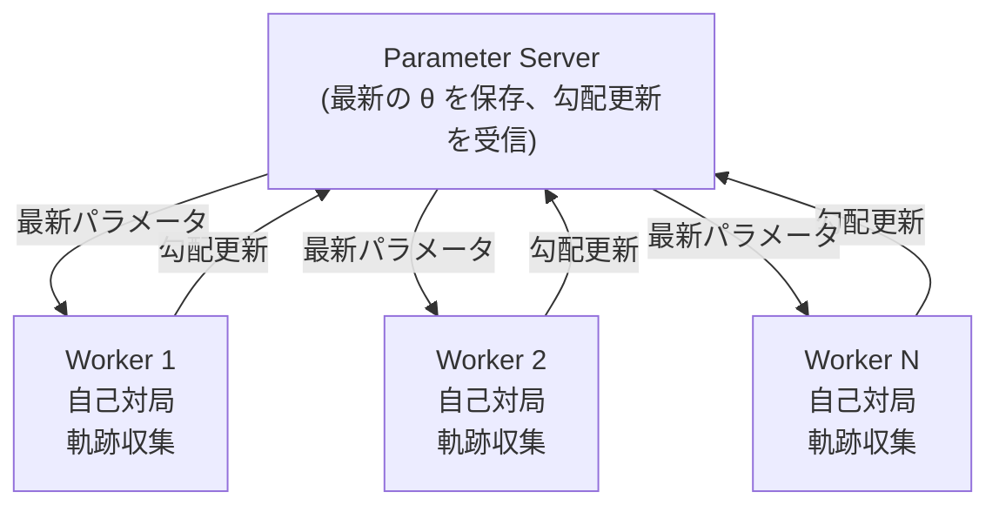

import { EloChart } from '@site/src/components/D3Charts';

# 自己対局

前の記事では、強化学習の基本概念を紹介しました。ここでは、AlphaGo 成功の鍵の一つである**自己対局（Self-Play）** を探求しましょう。

これは一見矛盾した概念です：**AI はどうやって自分と対局することで強くなれるのでしょうか？**

その答えは深遠かつエレガントで、ゲーム理論、進化動力学、そして学習の本質に関わっています。

---

## なぜ自己対局は有効なのか？

### 直感的な説明

あなたが囲碁初心者で、無人島で一人で練習していると想像してください：

1. 一局の碁を打ち、自分で黒と白の両方を担当する
2. 対局後、どの手が良くてどの手が悪かったかを分析する
3. 次の対局では、前回の間違いを避けようとする
4. このプロセスを数百万回繰り返す

直感的に、これには問題があるように思えます：
- レベルが低ければ、黒も白も悪い手を打つが、何を学べるのか？
- 「間違った均衡」に陥らないか——双方が悪い手を打つが互いに相殺する？

しかし実際には、自己対局は継続的な進歩を生み出すことができます。理由は以下の通りです：

### 段階的な弱点の発見

重要な洞察：**たとえ両方が同じ AI でも、各対局の結果には情報が含まれている**。

```
局面 A：AI は着手 X を選び、最終的に勝利
局面 A：AI は着手 Y を選び、最終的に敗北

→ 結論：局面 A では、X は Y より良い
```

大量の対局を統計することで、AI は各局面でどの選択がより優れているかを学習できます。これが**Policy Gradient** の本質です：良い選択は強化され、悪い選択は抑制されます。

### 対抗的学習

自己対局には特別な性質があります：**訓練相手が自動的にあなたのレベルに適応する**。

```
訓練サイクル 1：AI は効果的な戦術 T を発見
訓練サイクル 2：相手としての AI は T を防ぐ方法を学ぶ
訓練サイクル 3：元の AI はより良い戦術 T' を探さざるを得ない
```

これは**軍拡競争（Arms Race）** を形成し、双方が互いの弱点を継続的に発見し克服します。

### 人間の棋譜との比較

| 訓練方法 | 利点 | 欠点 |
|---------|------|------|
| **人間の棋譜** | 人間の知恵の結晶を学ぶ | 人間のレベルに制限される |
| **自己対局** | 向上に上限がない | 局所最適に陥る可能性 |
| **両者の組み合わせ** | 素早いスタート + 継続的向上 | 最良の戦略 |

AlphaGo オリジナル版は、まず人間の棋譜で教師あり学習を行い、次に自己対局で強化学習を行いました。AlphaGo Zero は、自己対局のみでも超人的なレベルに達することを証明しました。

---

## ゲーム理論の視点

### ナッシュ均衡

ゲーム理論において、**ナッシュ均衡（Nash Equilibrium）** は安定状態です：この状態では、どのプレイヤーも一方的に戦略を変更する動機がありません。

囲碁のような**ゼロサム、完全情報ゲーム**では、ナッシュ均衡には特別な意味があります：

$$\pi^* = \arg\max_\pi \min_{\pi'} V(\pi, \pi')$$

ここで $V(\pi, \pi')$ は戦略 $\pi$ が戦略 $\pi'$ と対戦したときの期待値です。

これが有名な **Minimax 原理**です：最良の戦略は、最悪の場合でも最も良く機能する戦略です。

### 自己対局とナッシュ均衡

理論的には、自己対局が収束すれば、ナッシュ均衡に収束するはずです。囲碁のような決定論的ゲームでは、ナッシュ均衡は**完璧な着手**です。

しかし、囲碁の状態空間は大きすぎます（$10^{170}$）、真のナッシュ均衡を見つけることは不可能です。自己対局は実際にはこの均衡を**近似**しています。

### 仮想対局（Fictitious Play）

自己対局はゲーム理論の**仮想対局**概念に関連しています：

1. 各プレイヤーは相手の過去の戦略を観察
2. 相手の戦略の平均分布を計算
3. この平均分布に対する最良の応答を選択

ある条件下では、仮想対局がナッシュ均衡に収束することが証明できます。

AlphaGo の自己対局は、この概念のニューラルネットワーク実装と見なすことができます。

---

## 自己対局のメカニズム

### 基本的な流れ

AlphaGo の自己対局の流れ：

```
アルゴリズム：Self-Play Training

初期化：Policy Network π_θ（教師あり学習またはランダム初期化から開始可能）

収束するまで以下のステップを繰り返す：

1. 対局データの生成
   i = 1 から N まで（並列実行）：
     a. 現在の方策 π_θ で一局の自己対局を行う
     b. 軌跡を収集：τ_i = (s_0, a_0, r_1, s_1, a_1, ...)
     c. 最終結果を記録 z_i ∈ {-1, +1}

2. 方策の更新
   a. 方策勾配を計算：
      ∇J = (1/N) Σ_i Σ_t ∇_θ log π_θ(a_t|s_t) · z_i
   b. パラメータを更新：θ ← θ + α · ∇J

3. 価値ネットワークの更新
   a. (s, z) ペアで Value Network を訓練
   b. 最小化：L = E[(V_φ(s) - z)²]

4. オプション：評価とチェックポイント保存
   a. 新しい方策を旧バージョンと対戦させる
   b. 勝率 > 55% なら、対戦相手プールを更新
```

### 訓練データの生成

各自己対局は**軌跡（trajectory）** を生成します：

$$\tau = (s_0, a_0, s_1, a_1, \ldots, s_T, z)$$

ここで：
- $s_t$：タイムステップ $t$ の盤面状態
- $a_t$：タイムステップ $t$ で選択した行動
- $z$：最終結果（+1 勝利、-1 敗北）

200手の対局は200の訓練サンプルを生成します。毎日数十万局の自己対局を行うと、訓練データ量は驚異的です。

### 方策の更新

Policy Gradient を使って Policy Network を更新：

$$\theta \leftarrow \theta + \alpha \cdot \nabla_\theta \mathbb{E}\left[\sum_t \log \pi_\theta(a_t|s_t) \cdot z\right]$$

この更新の効果：
- 最終的に勝利（$z = +1$）すれば、すべての着手の確率を増やす
- 最終的に敗北（$z = -1$）すれば、すべての着手の確率を減らす

これは粗く見えます——勝った碁にも悪い手があるかもしれないし、負けた碁にも良い手があるかもしれません。しかし、大量の対局の統計を通じて、これらの「ノイズ」は平均化され、本当に良い手が識別されます。

### 価値ネットワークの訓練

Value Network は**回帰（regression）** で訓練されます：

$$\phi \leftarrow \phi - \beta \cdot \nabla_\phi \mathbb{E}\left[(V_\phi(s) - z)^2\right]$$

これにより Value Network は予測を学習します：現在の局面から始めて、最終的に勝つ確率は？

Value Network の役割：
1. MCTS でリーフノード評価を提供
2. Policy Gradient のベースラインとして機能
3. 直接の局面評価に使用

---

## ランダム性の重要性

### 決定論的ループの回避

自己対局が完全に決定論的だと、ループに陥る可能性があります：

```
方策 A は常に固定の序盤を打つ
方策 A 対 方策 A は常に同じ棋局を生成
一局だけが繰り返し学習される
AI は他の可能性を探索できない
```

これが**ランダム性**が自己対局で極めて重要な理由です。

### ランダム性の源

AlphaGo が自己対局でランダム性を導入する方法：

**1. 方策ネットワーク自体が確率的**

Policy Network は決定論的選択ではなく確率分布を出力：

$$a \sim \pi_\theta(a|s)$$

同じ局面でも、毎回異なる着手を選ぶ可能性があります。

**2. 温度パラメータ**

訓練時に高い温度（temperature）を使用して多様性を増やす：

$$\pi_\tau(a|s) = \frac{\pi_\theta(a|s)^{1/\tau}}{\sum_{a'} \pi_\theta(a'|s)^{1/\tau}}$$

- $\tau > 1$：よりランダム、より探索
- $\tau < 1$：より決定論的、より活用
- $\tau = 1$：元の分布

**3. Dirichlet Noise**

AlphaGo Zero は自己対局時に、ルートノードの事前確率に Dirichlet ノイズを追加：

$$P(s, a) = (1 - \varepsilon) \cdot \pi_\theta(a|s) + \varepsilon \cdot \eta_a$$

ここで $\eta \sim \text{Dir}(\alpha)$、$\varepsilon = 0.25$、$\alpha = 0.03$（囲碁の361の行動用）。

これにより、非常に低確率の着手でも探索される機会が確保されます。

### 対戦相手プール（Population）アプローチ

多様性を増やす別の方法は**対戦相手プール**を維持することです：

```
対戦相手プール = [π_1, π_2, π_3, ..., π_k]（異なるバージョンの方策）

各対局：
1. プールからランダムに対戦相手を選択
2. その対戦相手と対局
3. 結果で現在の方策を更新
4. 定期的に改善された方策をプールに追加
```

このアプローチの利点：
- **多様性**：異なるスタイルの対戦相手
- **安定性**：特定の対戦相手への過学習を回避
- **頑健性**：さまざまな戦略への対応を学習

AlphaGo オリジナル版と AlphaGo Zero の両方が類似の技術を使用しました。

---

## 棋力成長曲線

### Elo レーティングシステム

AI の棋力変化を追跡するために、AlphaGo は **Elo レーティングシステム**を使用しました。

Elo システムの基本原理：

$$P(\text{A wins}) = \frac{1}{1 + 10^{(R_B - R_A)/400}}$$

ここで $R_A$ と $R_B$ は双方の Elo スコアです。

- 200点差：強者は75%勝つと予想
- 400点差：強者は90%勝つと予想
- 800点差：強者は99%勝つと予想

### AlphaGo の棋力成長

AlphaGo 各バージョンの棋力成長を視覚化してみましょう：

<EloChart mode="zero" width={700} height={400} showMilestones={true} />

### 成長速度の分析

曲線からいくつかの興味深い現象が観察できます：

**1. 初期の急速な成長**

訓練の最初の数時間で、AI は基本ルールと単純な戦術を学びました。これは**低い位置の果実**段階——修正すべき明らかな間違いが多すぎます。

**2. 中期の安定した成長**

基本的な間違いが解消されると、AI はより精妙な戦術と定石を学び始めます。成長速度は遅くなりますが、安定しています。

**3. 後期の成長鈍化**

AI がすでに非常に強くなると、さらなる向上は困難になります。間違いを修正するだけでなく、まったく新しい戦略を発見する必要があるかもしれません。

### 人間を超える瞬間

AlphaGo 訓練曲線の主要なマイルストーン：

| マイルストーン | 相当するレベル | 達成時間 |
|--------|--------|---------|
| アマチュア強豪を超える | Elo ~2700 | 約3時間 |
| Fan Hui を超える | Elo ~3500 | 約36時間 |
| Lee Sedol を超える | Elo ~4500 | 約60時間 |
| オリジナル AlphaGo を超える | Elo ~5000 | 約72時間 |

これらの数字（AlphaGo Zero より）は驚くべきものです：**AI は3日でゼロから始めて、人間の数千年の囲碁の知恵を超えました**。

---

## 収束性分析

### 自己対局は収束するか？

これは重要な理論的問題です。簡潔な答え：**ある条件下では収束するが、囲碁は複雑すぎて厳密に証明できない**。

### 理論的保証

より単純なゲーム（三目並べなど）では、以下を証明できます：

1. **存在性**：ナッシュ均衡は存在する（Minimax 定理）
2. **収束性**：一部のアルゴリズム（仮想対局など）はナッシュ均衡に収束する

囲碁では、厳密な収束保証はありませんが、実験的証拠は以下を示しています：
- 棋力は継続的に向上
- 明らかな振動や退化は発生しない
- 最終的な棋力はすべての既知の人間を超える

### 起こりうる失敗モード

自己対局で遭遇しうる問題：

**1. 戦略循環（Strategy Cycling）**

```
戦略 A が戦略 B に勝つ
戦略 B が戦略 C に勝つ
戦略 C が戦略 A に勝つ
```

これは一部のゲームでは確かに起こります（じゃんけんなど）。しかし囲碁には十分な複雑さがあり、このような純粋な循環は起こらないようです。

**2. 自分自身への過学習**

AI は自分のスタイルだけを対象とした戦略を学習し、他のスタイルの対戦相手に対応できなくなる可能性があります。これが AlphaGo が異なるバージョンの自分自身と対局し、最終的に人間棋士とテストする理由です。

**3. 局所最適**

AI は局所最適に陥る可能性があります——「まあまあだが最良ではない」戦略。ランダム化と大量の対局がこの問題を回避するのに役立ちます。

### 実際の観察

AlphaGo の訓練プロセスからの観察：

1. **継続的進歩**：Elo スコアは訓練とともに継続的に上昇
2. **退化なし**：棋力が突然低下することはない
3. **スタイルの進化**：AI の着手スタイルは訓練に伴い徐々に変化
4. **新定石の発見**：AI は人間が使用したことのない序盤や戦術を発見

これらの観察は、理論的保証はないものの、自己対局が実践では確かに有効であることを示しています。

---

## 実装の詳細

### 並列自己対局

訓練を加速するため、AlphaGo は大規模な並列自己対局を使用：



**主要な設計決定**：

- **同期 vs 非同期**：AlphaGo は非同期更新を使用、Worker は互いを待つ必要がない
- **更新頻度**：N 局の対局完了ごとにパラメータを更新
- **対戦相手選択**：最近の数バージョンからランダムに一つを対戦相手として選択

### チェックポイント戦略

定期的にモデルチェックポイントを保存、用途：

1. **対戦相手プール**：異なるバージョンの対戦相手を維持
2. **評価**：棋力変化を追跡
3. **障害復旧**：訓練中断時に復旧可能

```python
# 擬似コード
def training_loop():
    for iteration in range(num_iterations):
        # 対局データを生成
        trajectories = parallel_self_play(current_policy, num_games=1000)

        # 方策を更新
        update_policy(trajectories)

        # 定期的に評価と保存
        if iteration % 100 == 0:
            elo = evaluate_against_pool(current_policy)
            save_checkpoint(current_policy, elo)

            if elo > best_elo:
                add_to_pool(current_policy)
                best_elo = elo
```

### 訓練リソース要件

AlphaGo の訓練規模は印象的です：

| バージョン | ハードウェア | 訓練時間 | 自己対局局数 |
|------|------|---------|-------------|
| AlphaGo Fan | 176 GPU | 数ヶ月 | ~30M |
| AlphaGo Lee | 48 TPU | 数週間 | ~30M |
| AlphaGo Zero | 4 TPU | 3日 | ~5M |
| AlphaGo Zero (40日版) | 4 TPU | 40日 | ~30M |

AlphaGo Zero はより少ないハードウェアとより短い時間でより強い棋力に達したことに注目——これはアルゴリズム効率の向上です。

### ハイパーパラメータ設定

いくつかの重要なハイパーパラメータ：

```python
# 自己対局設定
NUM_PARALLEL_GAMES = 5000      # 同時に進行する対局数
GAMES_PER_ITERATION = 25000    # 各イテレーションの対局数
MCTS_SIMULATIONS = 1600        # 各手の MCTS シミュレーション回数

# 訓練設定
BATCH_SIZE = 2048              # 訓練バッチサイズ
LEARNING_RATE = 0.01           # 初期学習率
L2_REGULARIZATION = 1e-4       # 重み減衰

# 探索設定
TEMPERATURE = 1.0              # 序盤30手の温度
DIRICHLET_ALPHA = 0.03         # Dirichlet ノイズパラメータ
EXPLORATION_FRACTION = 0.25    # ノイズ比率
```

これらのハイパーパラメータは大量の実験で調整されており、訓練効果に大きな影響を与えます。

---

## 自己対局の変形

### AlphaGo オリジナル版

AlphaGo オリジナル版の訓練フロー：

```
1. 教師あり学習 (SL)：人間の棋譜から学習
   → SL Policy Network を生成 (π_SL)

2. 強化学習 (RL)：自己対局
   初期化 π_RL = π_SL
   対戦相手プール = [π_SL]

   繰り返し：
     a. π_RL がプール内の方策と対局
     b. Policy Gradient で π_RL を更新
     c. π_RL が強くなったらプールに追加

   → RL Policy Network を生成 (π_RL)

3. 価値ネットワーク訓練：
   π_RL 自己対局で局面を生成
   V(s) を訓練して勝率を予測
```

### AlphaGo Zero

AlphaGo Zero はこのフローを簡略化しました：

```
1. 純粋な自己対局（人間データなし）
   ランダムネットワーク f_θ を初期化

   繰り返し：
     a. MCTS + f_θ で自己対局
     b. 方策ヘッドと価値ヘッドを同時に訓練
     c. f_θ を更新

   → 単一ネットワークが同時に方策と価値を出力
```

主要な改良：
- **人間データ不要**：ゼロから開始
- **単一ネットワーク**：方策と価値が特徴を共有
- **より簡潔な訓練**：End-to-End 学習

### AlphaZero

AlphaZero はさらに汎化しました：

```
同じアルゴリズム、異なるゲーム：
- 囲碁：AlphaGo Zero を超えるレベルに到達
- チェス：Stockfish を超える
- 将棋：Elmo を超える

唯一のゲーム固有部分：ルールのエンコード
```

これは自己対局が**汎用的な学習パラダイム**であり、囲碁に限定されないことを証明しました。

---

## 人間は何を学んだか？

### AI が発見した新定石

自己対局は人間が使用したことのない多くの着手を生み出しました：

**1. 序盤のイノベーション**

AlphaGo が好む序盤のいくつか：
- 三々への侵入：早期に隅に侵入
- 高い位置の着手：伝統的に「不安定」と考えられていた
- 大ナダレ変化：人間は複雑で計算困難と考えていた

**2. 新しい形勢判断**

AI の一部の局面評価は人間と大きく異なりました：
- 一見「薄い」形が実は堅実
- 一部の「厚み」の価値が過大評価されていた
- 「先手」と「後手」の再評価

### 人間の囲碁への影響

AlphaGo 後、プロ囲碁は大きく変化しました：

1. **序盤の多様化**：プロ棋士は AI が発見した新しい序盤を使い始めた
2. **訓練方法の変化**：AI がプロ棋士の主要な訓練ツールになった
3. **棋理の再考**：多くの伝統的「棋理」が疑問視され修正された
4. **新しい美学**：AI スタイルの碁を鑑賞し始めた

柯潔は AlphaGo に負けた後、こう言いました：

> 「AlphaGo は私に囲碁を再認識させました。以前は人間が囲碁を理解していると思っていましたが、今では私たちは表面をなぞっているだけだとわかりました。」

---

## 哲学的考察

### 学習の本質

自己対局は学習に関する深い問題を提起します：

**知識はどこから来るのか？**

- 人間の学習は外部情報（教師、本、経験）に依存
- 自己対局の AI はルールだけで、外部知識がない
- それでも知識を「発見」できる——これらの知識はどこから来るのか？

答えはおそらく：**知識はゲームのルールと構造に暗黙的に含まれている**。囲碁のルールが良い手と悪い手を定義し、自己対局はこれらの暗黙的な構造を明らかにするだけです。

### 創造性と発見

AI が「神の一手」（Move 37）を打ったとき、これは創造なのか発見なのか？

一つの見方：その手は囲碁のルールにずっと「存在」しており、AI はそれを「発見」しただけ。
別の見方：AI はその手を「創造」した、なぜなら誰も（AI 自身を含め）事前にそれを知らなかったから。

この問題に標準的な答えはありませんが、創造性に関する私たちの伝統的理解に挑戦しています。

### 人間の知性の位置

AI がゼロから始めて、自己対局で人間の数千年の知恵を超えられるなら、これは人間にとって何を意味するか？

楽観的な見方：
- AI は人間が創造したツール
- AI の発見は人間の理解を増強できる
- 人間は AI と協力して、より高いレベルに到達できる

慎重な見方：
- 一部の領域では、純粋な計算が人間の直感を超えるかもしれない
- 「専門スキル」の価値を再考する必要がある
- 教育と訓練の方法を変える必要があるかもしれない

---

## アニメーション対応

本記事で扱う核心概念とアニメーション番号：

| 番号 | 概念 | 物理/数学対応 |
|------|------|--------------|
| 🎬 E5 | 自己対局ループ | 不動点反復 |
| 🎬 E6 | 戦略の進化 | 進化動力学 |

---

## まとめ

自己対局は AlphaGo 成功の鍵となる技術の一つです。以下を学びました：

1. **なぜ有効か**：対抗的学習、段階的な弱点の発見
2. **メカニズム**：軌跡収集、Policy Gradient、Value Network 訓練
3. **ランダム化**：温度パラメータ、Dirichlet ノイズ、対戦相手プール
4. **棋力成長**：Elo システム、成長曲線分析
5. **収束性**：理論的保証と実際の観察
6. **実装の詳細**：並列訓練、チェックポイント戦略、ハイパーパラメータ

次の記事では、AlphaGo がニューラルネットワークと MCTS をどのように組み合わせて両者の長所を発揮するかを探ります。

---

## さらに読む

- **次の記事**：[MCTS とニューラルネットワークの融合](../mcts-neural-combo) — 直感と推論の完璧な組み合わせ
- **前の記事**：[強化学習入門](../reinforcement-intro) — 強化学習の基本概念
- **関連**：[AlphaGo Zero 概要](../alphago-zero) — ゼロからの突破

---

## 参考文献

1. Silver, D., et al. (2016). "Mastering the game of Go with deep neural networks and tree search." *Nature*, 529, 484-489.
2. Silver, D., et al. (2017). "Mastering the game of Go without human knowledge." *Nature*, 550, 354-359.
3. Silver, D., et al. (2018). "A general reinforcement learning algorithm that masters chess, shogi, and Go through self-play." *Science*, 362(6419), 1140-1144.
4. Heinrich, J., & Silver, D. (2016). "Deep Reinforcement Learning from Self-Play in Imperfect-Information Games." *arXiv preprint*.
5. Lanctot, M., et al. (2017). "A Unified Game-Theoretic Approach to Multiagent Reinforcement Learning." *NeurIPS*.
