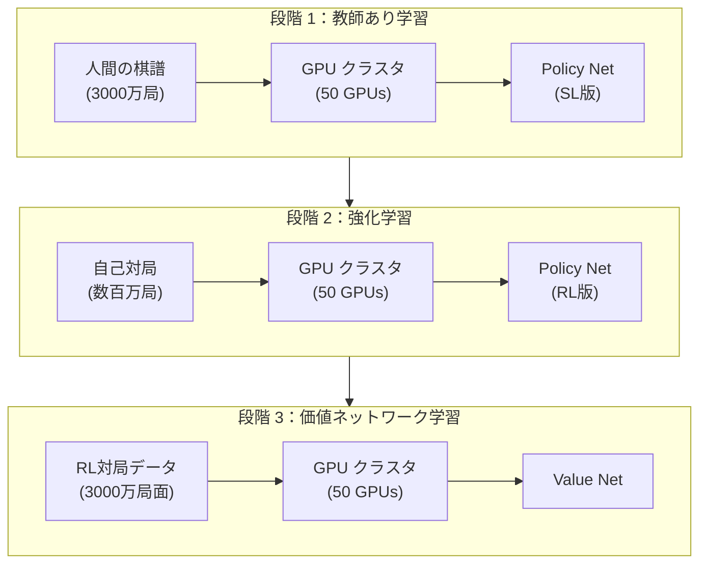

# 分散システムと TPU

AlphaGo の成功は、アルゴリズムの勝利だけでなく、エンジニアリングの勝利でもあります。合理的な時間内に人類を超える囲碁 AI を学習させるには、精巧に設計された分散システムと専用ハードウェアのサポートが必要です。

本記事では、AlphaGo を支えるシステムアーキテクチャを詳しく解説します。学習フロー、推論アーキテクチャ、並列 MCTS、そして TPU の重要な役割について説明します。

---

## 学習アーキテクチャの概要

### オリジナル AlphaGo の学習アーキテクチャ

オリジナル AlphaGo（李世乭を破ったバージョン）の学習は複数の段階に分かれ、各段階で異なるリソース構成を使用しました：



### AlphaGo Zero の学習アーキテクチャ

AlphaGo Zero は学習フローを大幅に簡略化し、単一のエンドツーエンド学習ループを使用しました：

```
┌─────────────────────────────────────────────────────────────┐
│                   AlphaGo Zero 学習ループ                    │
│                                                              │
│  ┌───────────────────┐                                      │
│  │   Self-play       │  ← 最新ネットワーク                   │
│  │   Workers         │                                      │
│  │   (TPU × N)       │                                      │
│  └─────────┬─────────┘                                      │
│            ↓                                                 │
│  ┌───────────────────┐                                      │
│  │   Replay Buffer   │  (直近 50 万局)                       │
│  │   (RAM/SSD)       │                                      │
│  └─────────┬─────────┘                                      │
│            ↓                                                 │
│  ┌───────────────────┐                                      │
│  │   Training        │                                      │
│  │   Workers         │                                      │
│  │   (TPU × M)       │                                      │
│  └─────────┬─────────┘                                      │
│            ↓                                                 │
│  ┌───────────────────┐                                      │
│  │   Network         │  → Self-play 用ネットワークを更新      │
│  │   Checkpoint      │                                      │
│  └───────────────────┘                                      │
│                                                              │
└─────────────────────────────────────────────────────────────┘
```

このアーキテクチャの利点：

1. **継続的学習**：Self-play と Training が同時に進行し、待機が不要
2. **リソース効率**：すべてのリソースが有用な作業を行う
3. **高速イテレーション**：ネットワーク更新後、すぐに新しいデータの生成に使用

---

## 自己対局ワーカー（Self-play Workers）

### タスク割り当て

Self-play Workers は、現在最強のネットワークを使用して自己対局を行い、学習データを生成します。

| 構成 | AlphaGo Zero |
|------|--------------|
| Worker 数 | 数十個 |
| 各 Worker | 1-4 TPU |
| 各局の MCTS | 1600 回シミュレーション |
| 1日の生成数 | ~100,000 局 |

### ワークフロー

各 Self-play Worker のワークフロー：

```python
while True:
    # 1. 最新のネットワーク重みをダウンロード
    network = download_latest_checkpoint()

    # 2. 複数局の自己対局を実行
    for game in range(batch_size):
        positions = []
        board = EmptyBoard()

        while not board.is_terminal():
            # MCTS を実行
            mcts = MCTS(network, board)
            policy = mcts.search(num_simulations=1600)

            # 着手を選択
            action = sample(policy)

            # 記録
            positions.append((board.state, policy))

            # 着手
            board = board.play(action)

        # 3. 勝敗結果を取得
        result = board.get_result()

        # 4. データをアップロード
        upload_to_replay_buffer(positions, result)
```

### 負荷分散

複数の Worker には負荷分散が必要です：

- **ネットワーク同期**：すべての Worker が同じバージョンのネットワークを使用
- **データバランス**：異なる Worker のデータがすべて使用されることを保証
- **フォールトトレランス**：単一の Worker の障害が全体の学習に影響しない

---

## 学習ワーカー（Training Workers）

### タスク割り当て

Training Workers は Replay Buffer からデータをサンプリングし、ニューラルネットワークを学習します。

| 構成 | AlphaGo Zero |
|------|--------------|
| Worker 数 | 1-4 |
| 各 Worker | 4 TPU |
| Batch Size | 2048（各 TPU 512） |
| 学習ステップ | 毎日数万ステップ |

### 分散学習

大規模学習では**データ並列（Data Parallelism）**を使用します：

```
                    ┌─────────────┐
                    │  Parameter  │
                    │   Server    │
                    └──────┬──────┘
                           │
         ┌─────────────────┼─────────────────┐
         │                 │                 │
    ┌────▼────┐      ┌────▼────┐      ┌────▼────┐
    │  TPU 0  │      │  TPU 1  │      │  TPU 2  │
    │ Batch 0 │      │ Batch 1 │      │ Batch 2 │
    └────┬────┘      └────┬────┘      └────┬────┘
         │                 │                 │
         └─────────────────┼─────────────────┘
                           │
                    ┌──────▼──────┐
                    │  Gradient   │
                    │  Aggregation│
                    └─────────────┘
```

各 TPU は異なる mini-batch を処理し、ローカル勾配を計算し、その後グローバルパラメータを集約更新します。

### 同期 vs. 非同期更新

| 更新方式 | 利点 | 欠点 |
|----------|------|------|
| 同期 | 安定、再現可能 | Worker が最も遅いものを待つ必要がある |
| 非同期 | スループットが高い | 勾配が古くなる可能性 |

AlphaGo Zero は**同期更新**を使用し、学習の安定性を確保しました。

---

## TPU の役割

### TPU とは？

**TPU（Tensor Processing Unit）** は Google が深層学習専用に設計したアクセラレータです：

| 特性 | TPU | GPU | CPU |
|------|-----|-----|-----|
| 設計目標 | 行列演算 | 汎用並列 | 汎用計算 |
| 精度 | FP16/BF16 最適化 | FP32/FP16 | FP64/FP32 |
| 消費電力 | 比較的低い | 高い | 最も高い |
| レイテンシ | 低い | 中程度 | 高い |

### TPU のアーキテクチャ

TPU の核心は **MXU（Matrix Multiply Unit）** です：

```
┌─────────────────────────────────────────┐
│              TPU v2/v3                  │
│  ┌─────────────────────────────────┐    │
│  │         MXU (128×128)           │    │
│  │    Matrix Multiply Unit         │    │
│  │    (128×128 = 16K MACs/cycle)   │    │
│  └─────────────────────────────────┘    │
│  ┌──────────┐  ┌──────────────────┐     │
│  │ Vector   │  │     HBM          │     │
│  │ Unit     │  │   (16-32 GB)     │     │
│  └──────────┘  └──────────────────┘     │
└─────────────────────────────────────────┘
```

MXU は各サイクルで 16K 回の乗加算演算を実行でき、ニューラルネットワークの行列乗算にとって極めて重要です。

### なぜ AlphaGo は TPU を必要とするのか？

囲碁 AI の計算ボトルネックは**ニューラルネットワーク推論**です：

| 操作 | 割合 |
|------|------|
| ニューラルネットワーク順伝播 | ~95% |
| MCTS ツリー操作 | ~4% |
| その他 | ~1% |

各手の MCTS には 1600 回のニューラルネットワーク推論が必要です。TPU の高スループットがこれを可能にしました。

### TPU 使用の進化

| バージョン | 学習 TPU | 推論 TPU |
|------|----------|----------|
| AlphaGo Lee | 50 GPU | 48 TPU（v1） |
| AlphaGo Master | 4 TPU（v2） | 4 TPU（v2） |
| AlphaGo Zero | 4 TPU（v2） | 4 TPU（v2）（スケーラブル） |

AlphaGo Zero は使用する TPU 数が大幅に減少しました。これはより効率的なアーキテクチャと新しい TPU バージョンのおかげです。

---

## 並列 MCTS と仮想損失

### 並列化の課題

MCTS の標準実装は**シリアル**です：

```
for i in range(num_simulations):
    1. Selection：ルートから下に選択
    2. Expansion：リーフノードを展開
    3. Evaluation：ニューラルネットワーク評価
    4. Backup：逆伝播で更新
```

しかしニューラルネットワーク評価は GPU/TPU フレンドリーな**バッチ処理**です。複数のシミュレーションを同時に行うにはどうすればよいでしょうか？

### リーフ並列化（Leaf Parallelization）

最も単純な並列化方式：複数の完全なシミュレーションを同時に実行し、最後に結果をマージします。

```
┌────────────┐
│   Root     │
└──────┬─────┘
       ├──────────┬──────────┬──────────┐
  ┌────▼────┐ ┌───▼────┐ ┌───▼────┐ ┌───▼────┐
  │ Sim 1   │ │ Sim 2  │ │ Sim 3  │ │ Sim 4  │
  │ (独立)  │ │ (独立) │ │ (独立) │ │ (独立) │
  └────┬────┘ └───┬────┘ └───┬────┘ └───┬────┘
       └──────────┴──────────┴──────────┘
                      │
              ┌───────▼───────┐
              │  Merge Trees  │
              └───────────────┘
```

問題：各シミュレーションがルートから始まるため、同じパスを繰り返し探索してしまいます。

### 仮想損失（Virtual Loss）

DeepMind はツリー並列化（Tree Parallelization）を実現するために**仮想損失**技術を採用しました。

#### 基本概念

あるスレッドがあるノードを探索中の時、そのノードの価値を一時的に下げ、他のスレッドが別のパスを選択するようにします。

```
通常の UCB：Q(s,a) + c * P(s,a) * sqrt(N(s)) / (1 + N(s,a))

仮想損失を加えた後：
(Q(s,a) * N(s,a) - v * n_virtual) / (N(s,a) + n_virtual) + c * P(s,a) * sqrt(N(s)) / (1 + N(s,a) + n_virtual)
```

ここで：
- `n_virtual` はそのノードを探索中のスレッド数
- `v` は仮想損失の値（通常 1 または勝率に対応する値）

#### 動作フロー

```
時間 T1：
  Thread 1 がパス A → B → C を選択
  ノード C に仮想損失 -1 を付与

時間 T2：
  Thread 2 がパス A → B → D を選択（C が「ペナルティ」を受けているため）
  ノード D に仮想損失 -1 を付与

時間 T3：
  Thread 1 が評価を完了し、C の実際の値を更新し、仮想損失を除去
  Thread 3 は今 C を選択する可能性がある（実際の値が十分良ければ）
```

#### 仮想損失の効果

| 側面 | 効果 |
|------|------|
| 探索の多様性 | 異なるパスの探索を強制 |
| バッチ効率 | 複数のリーフノードを同時に評価可能 |
| 収束性 | 仮想損失は最終的に真の値で上書きされ、収束に影響しない |

### バッチニューラルネットワーク評価

仮想損失により、評価待ちの複数のリーフノードを収集し、**バッチ推論**を行えます：

```
┌─────────────────────────────────────────┐
│            Parallel MCTS                │
│                                         │
│  Thread 1 → リーフノード L1 ──┐          │
│  Thread 2 → リーフノード L2 ──┼──→ Batch ─→ TPU
│  Thread 3 → リーフノード L3 ──┤          │
│  Thread 4 → リーフノード L4 ──┘          │
│                                         │
│  ← (P1,V1), (P2,V2), ... を同時に取得   │
│                                         │
└─────────────────────────────────────────┘
```

TPU のバッチ推論効率は個別推論よりはるかに高く、並列 MCTS を可能にしました。

---

## 推論アーキテクチャ

### 対局時の構成

AlphaGo の公式対局時の推論アーキテクチャ：

| バージョン | ハードウェア構成 |
|------|----------|
| AlphaGo Fan | 176 GPU |
| AlphaGo Lee | 48 TPU + 複数サーバー |
| AlphaGo Master | 4 TPU |
| AlphaGo Zero | 4 TPU（スケーラブル） |

### 分散推論フロー

対局時の推論フロー（AlphaGo Lee を例に）：

```
┌─────────────────────────────────────────────────────────────┐
│                    分散推論アーキテクチャ                     │
│                                                              │
│  ┌──────────────┐                                           │
│  │   主制御ノード │ ← 相手の着手を受信、AlphaGo の着手を送信   │
│  └──────┬───────┘                                           │
│         │                                                    │
│         ↓                                                    │
│  ┌──────────────────────────────────────────────────┐       │
│  │              MCTS コントローラ                    │       │
│  │  探索ツリー管理、タスク配分、結果収集             │       │
│  └──────────────────────────────────────────────────┘       │
│         │                                                    │
│         ↓                                                    │
│  ┌──────────────────────────────────────────────────┐       │
│  │              TPU クラスタ（48 個の TPU）           │       │
│  │                                                   │       │
│  │   ┌────┐ ┌────┐ ┌────┐ ┌────┐ ┌────┐ ┌────┐     │       │
│  │   │TPU │ │TPU │ │TPU │ │TPU │ │TPU │ │... │     │       │
│  │   │ 1  │ │ 2  │ │ 3  │ │ 4  │ │ 5  │ │ 48 │     │       │
│  │   └────┘ └────┘ └────┘ └────┘ └────┘ └────┘     │       │
│  │                                                   │       │
│  │   ニューラルネットワーク推論リクエストをバッチ処理  │       │
│  └──────────────────────────────────────────────────┘       │
│                                                              │
└─────────────────────────────────────────────────────────────┘
```

### 思考時間管理

AlphaGo の時間管理戦略：

| 局面 | 思考時間 | MCTS 回数 |
|------|----------|-----------|
| 序盤（定石あり） | 短め | ~10,000 |
| 中盤（複雑） | 長め | ~100,000 |
| 単純な局面 | 短め | ~5,000 |
| 秒読み | 固定 | ~1,600 |

より多くの MCTS シミュレーションは通常、より良い着手の質を意味します。

---

## 通信と同期

### データ形式

学習データの転送形式：

```protobuf
message TrainingExample {
    // 盤面状態（17 × 19 × 19）
    repeated float board_planes = 1;

    // MCTS 探索結果（362）
    repeated float mcts_policy = 2;

    // 勝敗結果（1 = 現在側の勝ち、-1 = 現在側の負け）
    float game_result = 3;
}
```

### ネットワーク帯域幅要件

| データフロー | サイズ | 頻度 |
|--------|------|------|
| 学習サンプル | ~10 KB/サンプル | 毎秒数千サンプル |
| ネットワーク重み | ~200 MB | 毎時数回 |
| 制御メッセージ | < 1 KB | 継続的 |

総帯域幅要件：~100 Mbps（内部ネットワークで十分）

### 障害処理

分散システムの障害処理：

| 障害タイプ | 処理方法 |
|----------|----------|
| Worker ダウン | 再起動し、最新の checkpoint から継続 |
| ネットワーク切断 | データをバッファリングし、再接続後に続けて転送 |
| TPU 障害 | 自動的にバックアップ TPU に切り替え |
| データ破損 | 検証後に破棄し、再生成 |

---

## コスト分析

### ハードウェアコスト見積もり

Google Cloud の TPU 価格で AlphaGo Zero の学習コストを見積もり：

| リソース | 数量 | 単価/時間 | 総額/日 |
|------|------|-----------|---------|
| TPU v2 Pod | 4 | ~$32 | ~$3,000 |
| 大容量メモリ VM | 数台 | ~$5 | ~$500 |
| ストレージ | 10 TB | ~$0.02/GB | ~$200 |
| ネットワーク | - | 含む | - |

**1日あたり約 $3,700**、完全な学習（40日）で約 **$150,000**。

注意：これは 2017 年の見積もりで、DeepMind は Google の子会社として内部割引がある可能性があります。

### 人間の学習との比較

| 側面 | AlphaGo Zero | 人間のプロ棋士 |
|------|--------------|--------------|
| プロレベル到達 | 2日 | 10-15年 |
| 学習コスト | ~$7,500 | 数百万（学費、生活費、機会費用） |
| 継続コスト | 電気代 | 生活費 |
| 複製可能性 | 完璧に複製可能 | 複製不可能 |

もちろん、この比較は完全に公平ではありません——人間は碁を学ぶ過程で囲碁だけでなく多くのことを学びます。

### 推論コスト

公式対局の推論コスト：

| 構成 | 1局あたりのコスト |
|------|----------|
| 48 TPU（AlphaGo Lee） | ~$500 |
| 4 TPU（AlphaGo Zero） | ~$50 |
| 単一 GPU（KataGo） | ~$1 |

推論コストは技術の進歩とともに大幅に低下しました。

---

## 技術の進化

### AlphaGo から AlphaZero へ

| 側面 | AlphaGo Lee | AlphaGo Zero | AlphaZero |
|------|-------------|--------------|-----------|
| 学習 TPU | 50+ GPU → TPU | 4 TPU | 4 TPU |
| 推論 TPU | 48 TPU | 4 TPU | 4 TPU |
| MCTS/手 | ~100,000 | ~1,600 | ~800 |
| 学習時間 | 数ヶ月 | 40日 | 数時間〜数日 |

効率は約 100 倍向上しました。

### オープンソースコミュニティへの影響

AlphaGo のアーキテクチャは複数のオープンソースプロジェクトにインスピレーションを与えました：

| プロジェクト | 特徴 |
|------|------|
| Leela Zero | コミュニティ分散学習、AlphaGo Zero を再現 |
| KataGo | 単一 GPU 高効率学習、AlphaGo Zero を超越 |
| ELF OpenGo | Facebook オープンソース、PyTorch 使用 |
| Minigo | Google オープンソース、TensorFlow 使用 |

これらのプロジェクトにより、一般の研究者も強力な囲碁 AI を学習できるようになりました。

---

## アニメーション対応

本記事で扱った核心概念とアニメーション番号：

| 番号 | 概念 | 物理/数学対応 |
|------|------|--------------|
| :clapper: C9 | 並列 MCTS | 多体問題 |
| :clapper: E9 | 分散学習 | 分散コンピューティング |
| :clapper: C5 | 仮想損失 | 斥力ポテンシャル |
| :clapper: D15 | バッチ推論 | ベクトル化計算 |

---

## 関連記事

- **前の記事**：[ゼロからの学習過程](../training-from-scratch) — 学習曲線の詳細分析
- **次の記事**：[AlphaGo の遺産](../legacy-and-impact) — AlphaGo の AI 分野への深遠な影響
- **関連記事**：[MCTS とニューラルネットワークの統合](../mcts-neural-combo) — MCTS の基礎知識

---

## 参考文献

1. Silver, D., et al. (2017). "Mastering the game of Go without human knowledge." *Nature*, 550, 354-359.
2. Jouppi, N., et al. (2017). "In-Datacenter Performance Analysis of a Tensor Processing Unit." *ISCA 2017*.
3. Dean, J., et al. (2012). "Large Scale Distributed Deep Networks." *NeurIPS 2012*.
4. Chaslot, G., et al. (2008). "Parallel Monte-Carlo Tree Search." *CIG 2008*.
5. Segal, R. (2010). "On the Scalability of Parallel UCT." *CIG 2010*.
