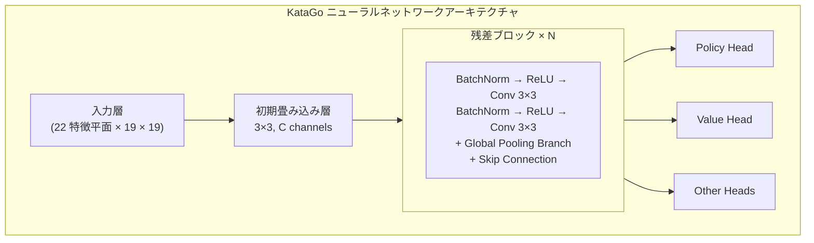
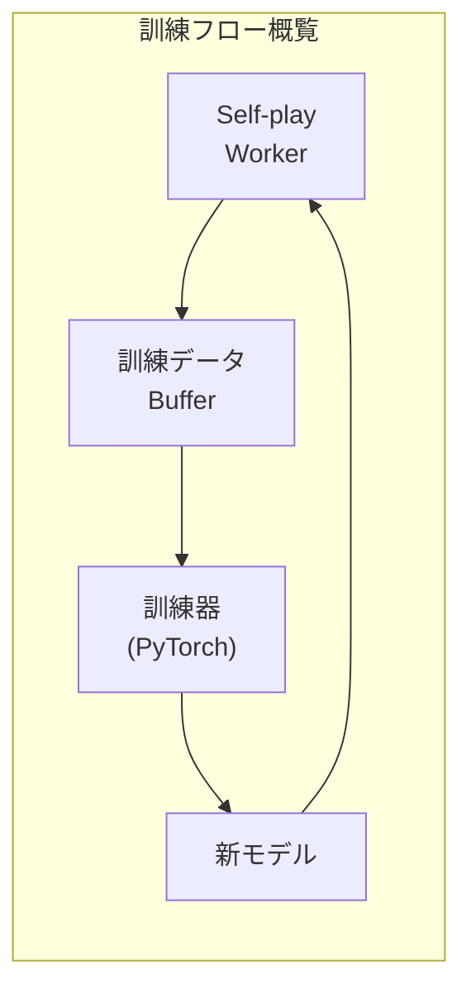

# KataGoソースコードアーキテクチャ

本文ではKataGoのソースコード構造を深く解析し、内部実装の理解を助けます。コードの貢献、機能の修正、または技術を自分のプロジェクトに応用したい方にとって、必読の参考資料です。

## プロジェクトディレクトリ構造

```
KataGo/
├── cpp/                    # C++コアコード
│   ├── main.cpp           # メインプログラムエントリー
│   ├── command/           # 各種実行モード
│   ├── core/              # コアユーティリティクラス
│   ├── game/              # 囲碁ルールと碁盤
│   ├── search/            # MCTS探索エンジン
│   ├── neuralnet/         # ニューラルネットワークインターフェース
│   ├── dataio/            # データI/O
│   ├── configs/           # 設定ファイルサンプル
│   └── tests/             # ユニットテスト
├── python/                 # Python訓練コード
│   ├── train.py           # 訓練メインプログラム
│   ├── model.py           # モデル定義
│   ├── data_processing_pytorch.py
│   └── configs/           # 訓練設定
├── docs/                   # ドキュメント
└── scripts/               # 補助スクリプト
```

### cpp/ディレクトリ詳細

```
cpp/
├── main.cpp                # プログラムエントリー、コマンドライン引数を解析
├── command/
│   ├── gtp.cpp            # GTPプロトコル実装
│   ├── analysis.cpp       # Analysis Engine実装
│   ├── benchmark.cpp      # ベンチマークテスト
│   ├── genconfig.cpp      # 設定ファイル生成
│   └── selfplay.cpp       # 自己対局
├── core/
│   ├── global.h           # グローバル定数と設定
│   ├── hash.h             # Zobristハッシュ
│   ├── rand.h             # 乱数生成
│   ├── logger.h           # ログシステム
│   ├── config_parser.h    # 設定ファイル解析
│   └── threadsafe*.h      # スレッドセーフユーティリティ
├── game/
│   ├── board.h/cpp        # 碁盤表現と基本操作
│   ├── rules.h/cpp        # 囲碁ルール
│   ├── boardhistory.h/cpp # 対局履歴
│   └── graphhash.h/cpp    # 局面ハッシュ
├── search/
│   ├── search.h/cpp       # 探索エンジンメインクラス
│   ├── searchnode.h/cpp   # 探索木ノード
│   ├── searchparams.h     # 探索パラメータ
│   ├── mutexpool.h        # ロックプール
│   ├── searchresults.h    # 探索結果
│   └── asyncbot.h/cpp     # 非同期ボット
├── neuralnet/
│   ├── nninputs.h/cpp     # ニューラルネットワーク入力特徴
│   ├── nneval.h/cpp       # ニューラルネットワーク評価
│   ├── nninterface.h      # バックエンド抽象インターフェース
│   ├── cudabackend.cpp    # CUDAバックエンド
│   ├── openclbackend.cpp  # OpenCLバックエンド
│   ├── eigenbackend.cpp   # Eigen(CPU)バックエンド
│   └── modelversion.h     # モデルバージョン管理
└── dataio/
    ├── sgf.h/cpp          # SGFファイル処理
    ├── numpywrite.h/cpp   # NumPyフォーマット出力
    └── trainingwrite.h/cpp # 訓練データ書き込み
```

## ニューラルネットワークアーキテクチャ

### ネットワーク構造概要



### 入力特徴（nninputs.cpp）

KataGoは22の特徴平面を入力として使用：

```cpp
// 主な入力特徴カテゴリ
enum {
  // 碁盤状態
  INPUT_FEATURE_STONE_OUR,      // 自分の石
  INPUT_FEATURE_STONE_OPP,      // 相手の石

  // 呼吸点関連（1-8呼吸点）
  INPUT_FEATURE_LIBERTIES_1,
  INPUT_FEATURE_LIBERTIES_2,
  // ...
  INPUT_FEATURE_LIBERTIES_8_OR_MORE,

  // 履歴状態
  INPUT_FEATURE_LAST_MOVE,      // 前手の位置
  INPUT_FEATURE_SECOND_LAST_MOVE,

  // ルール関連
  INPUT_FEATURE_KOMI,           // コミ
  INPUT_FEATURE_RULES,          // ルールエンコーディング
  // ...
};
```

### グローバルプーリングブランチ

KataGoの革新の一つは残差ブロックにグローバルプーリングを追加したこと：

```cpp
// グローバルプーリング実装の概念（簡略化）
class GlobalPoolingResBlock {
public:
  void forward(Tensor& x) {
    // 標準残差パス
    Tensor regular_out = regular_conv_path(x);

    // グローバルプーリングパス
    Tensor global_mean = global_avg_pool(x);  // [batch, C]
    Tensor global_max = global_max_pool(x);    // [batch, C]
    Tensor global_features = concat(global_mean, global_max);

    // グローバル特徴を処理
    global_features = dense_layer(global_features);  // [batch, C]

    // 空間次元にブロードキャストして通常パスと結合
    Tensor global_broadcast = broadcast_to_spatial(global_features);
    x = regular_out + global_broadcast;
  }
};
```

### 出力ヘッド

```cpp
// Policy Head：着手確率を予測
class PolicyHead {
  // 出力：19×19+1（パス含む）
  // softmaxで正規化
};

// Value Head：勝敗を予測
class ValueHead {
  // 出力：3（勝/負/引き分けの確率）
  // softmaxで正規化
};

// Score Head：目数を予測
class ScoreHead {
  // 出力：連続値（予想目数差）
};

// Ownership Head：領地を予測
class OwnershipHead {
  // 出力：19×19（各点の帰属、tanh）
};
```

## 探索エンジン実装

### MCTSコアクラス

```cpp
// search/search.h
class Search {
public:
  // 探索を実行
  void runWholeSearch(Player pla);

  // 最善手を取得
  Loc getBestMove();

  // 分析結果を取得
  AnalysisData getAnalysisData();

private:
  SearchParams params;          // 探索パラメータ
  SearchNode* rootNode;         // ルートノード
  NNEvaluator* nnEval;         // ニューラルネットワーク評価器
  std::mutex* mutexPool;       // ロックプール
};
```

### 探索ノード構造

```cpp
// search/searchnode.h
struct SearchNode {
  // ノード統計
  std::atomic<int64_t> visits;           // 訪問回数
  std::atomic<double> valueSumWeight;    // 価値累積重み
  std::atomic<double> valueSum;          // 価値累積和

  // 子ノード
  std::atomic<int> numChildren;
  SearchChildPointer* children;          // 子ノードポインタ配列

  // ニューラルネットワーク出力キャッシュ
  std::shared_ptr<NNOutput> nnOutput;
};

struct SearchChildPointer {
  Loc moveLoc;                           // 着点
  std::atomic<SearchNode*> node;         // 子ノードポインタ
  std::atomic<int64_t> edgeVisits;       // エッジ訪問回数
};
```

### PUCT選択アルゴリズム

```cpp
// 探索する子ノードを選択
int Search::selectChildToDescend(SearchNode* node, Player pla) {
  int bestIdx = -1;
  double bestValue = -1e100;

  for (int i = 0; i < node->numChildren; i++) {
    SearchChildPointer& child = node->children[i];

    // Q値を計算（活用）
    double q = getChildQ(child);

    // U値を計算（探索）
    double prior = getPrior(node, child.moveLoc);
    double parentVisits = node->visits.load();
    double childVisits = child.edgeVisits.load();

    double u = params.cpuctExploration * prior *
               sqrt(parentVisits) / (1.0 + childVisits);

    // PUCT式
    double value = q + u;

    if (value > bestValue) {
      bestValue = value;
      bestIdx = i;
    }
  }

  return bestIdx;
}
```

### 並列探索実装

```cpp
void Search::runWholeSearch(Player pla) {
  // 複数の探索スレッドを起動
  std::vector<std::thread> threads;
  for (int i = 0; i < params.numSearchThreads; i++) {
    threads.emplace_back([this, pla]() {
      runSingleSearchThread(pla);
    });
  }

  // すべてのスレッドの完了を待機
  for (auto& t : threads) {
    t.join();
  }
}

void Search::runSingleSearchThread(Player pla) {
  while (!shouldStop()) {
    // パスを選択
    std::vector<SearchNode*> path;
    SearchNode* leaf = selectAndDescend(rootNode, path);

    // ノードを拡張
    expandNode(leaf);

    // ニューラルネットワーク評価
    NNOutput output = nnEval->evaluate(leaf->board);

    // バックプロパゲーション更新
    backpropagateValue(path, output.value);
  }
}
```

### 仮想損失（Virtual Loss）

並列探索時に複数スレッドが同じパスを選択するのを避けるために使用：

```cpp
void Search::applyVirtualLoss(SearchNode* node) {
  // 一時的にこのノードの評価値を減少
  // 他のスレッドが異なるパスを選択するようにする
  node->virtualLoss.fetch_add(1);
}

void Search::removeVirtualLoss(SearchNode* node) {
  node->virtualLoss.fetch_sub(1);
}
```

## 訓練フロー概要

### 訓練データ生成



### 自己対局（cpp/command/selfplay.cpp）

```cpp
// Self-playメインループ
void runSelfPlayLoop() {
  while (true) {
    // 最新モデルをロード
    loadLatestModel();

    // 一局対局
    GameData gameData = playSingleGame();

    // 訓練データを保存
    writeTrainingData(gameData);
  }
}

GameData playSingleGame() {
  Board board;
  BoardHistory history;
  GameData gameData;

  while (!history.isGameOver()) {
    // MCTSで着手を選択
    Search search(board, history, params);
    search.runWholeSearch(history.currentPla);

    // MCTS結果を訓練ターゲットとして取得
    MoveData moveData;
    moveData.policyTarget = search.getPolicyDistribution();
    moveData.valueTarget = search.getValue();

    // 着手を実行
    Loc move = search.sampleMove();
    board.playMove(move, history.currentPla);

    gameData.moves.push_back(moveData);
  }

  // 最終結果を記入
  gameData.finalScore = history.finalScore();
  return gameData;
}
```

### 訓練データフォーマット

```cpp
// dataio/trainingwrite.h
struct TrainingRow {
  // 入力特徴
  float inputFeatures[NUM_FEATURES][BOARD_SIZE][BOARD_SIZE];

  // 訓練ターゲット
  float policyTarget[BOARD_SIZE * BOARD_SIZE + 1];  // パス含む
  float valueTarget[3];                              // 勝/負/引き分け
  float scoreTarget;                                 // 目数
  float ownershipTarget[BOARD_SIZE][BOARD_SIZE];    // 領地

  // メタデータ
  int turn;
  int rules;
  float komi;
};
```

### Python訓練プログラム（python/train.py）

```python
# 訓練メインループ（簡略化）
def train():
    model = KataGoModel(config)
    optimizer = torch.optim.SGD(model.parameters(), lr=config.lr)

    for epoch in range(config.num_epochs):
        for batch in data_loader:
            # 順伝播
            policy_pred, value_pred, score_pred, ownership_pred = model(batch.input)

            # 損失を計算
            policy_loss = cross_entropy(policy_pred, batch.policy_target)
            value_loss = cross_entropy(value_pred, batch.value_target)
            score_loss = mse_loss(score_pred, batch.score_target)
            ownership_loss = mse_loss(ownership_pred, batch.ownership_target)

            # 総損失（重み付き和）
            total_loss = (
                policy_loss +
                config.value_weight * value_loss +
                config.score_weight * score_loss +
                config.ownership_weight * ownership_loss
            )

            # バックプロパゲーション
            optimizer.zero_grad()
            total_loss.backward()
            optimizer.step()

        # チェックポイントを保存
        save_checkpoint(model, epoch)
```

### モデル定義（python/model.py）

```python
class KataGoModel(nn.Module):
    def __init__(self, config):
        super().__init__()

        # 初期畳み込み
        self.initial_conv = nn.Conv2d(
            config.input_channels,
            config.trunk_channels,
            kernel_size=3, padding=1
        )

        # 残差ブロック
        self.blocks = nn.ModuleList([
            ResBlock(config.trunk_channels, use_global_pooling=True)
            for _ in range(config.num_blocks)
        ])

        # 出力ヘッド
        self.policy_head = PolicyHead(config)
        self.value_head = ValueHead(config)
        self.score_head = ScoreHead(config)
        self.ownership_head = OwnershipHead(config)

    def forward(self, x):
        # 主幹ネットワーク
        x = self.initial_conv(x)
        for block in self.blocks:
            x = block(x)

        # 各出力ヘッド
        policy = self.policy_head(x)
        value = self.value_head(x)
        score = self.score_head(x)
        ownership = self.ownership_head(x)

        return policy, value, score, ownership
```

## 主要データ構造

### Board（game/board.h）

```cpp
class Board {
public:
  // 碁盤状態
  Color stones[MAX_BOARD_AREA];    // 各点の色
  Chain chains[MAX_BOARD_AREA];    // 石の連情報

  // コウ
  Loc koLoc;

  // 着手を実行
  void playMove(Loc loc, Color pla);

  // 合法性チェック
  bool isLegal(Loc loc, Color pla) const;

  // 呼吸点計算
  int getLiberties(Loc loc) const;
};

struct Chain {
  int liberties;                   // 呼吸点数
  int numStones;                   // 石の数
  Loc head;                        // リンクリストの先頭
};
```

### BoardHistory（game/boardhistory.h）

```cpp
class BoardHistory {
public:
  std::vector<Board> boards;       // 履歴碁盤状態
  std::vector<Move> moves;         // 着手履歴
  Rules rules;                     // ルール
  Player currentPla;               // 現在の手番

  // ゲーム状態
  bool isGameOver() const;
  float finalScore() const;
};
```

### NNOutput（neuralnet/nneval.h）

```cpp
struct NNOutput {
  // Policy
  float policyProbs[MAX_BOARD_AREA + 1];  // パス含む

  // Value
  float whiteWinProb;
  float whiteLossProb;
  float noResultProb;

  // Score
  float whiteScoreMean;
  float whiteScoreStdev;

  // Ownership
  float ownership[MAX_BOARD_AREA];  // -1から1
};
```

## 開発とデバッグ

### テストバージョンのコンパイル

```bash
cd cpp
mkdir build_debug && cd build_debug
cmake .. -DCMAKE_BUILD_TYPE=Debug -DUSE_BACKEND=OPENCL
make -j$(nproc)
```

### ユニットテストの実行

```bash
./katago runtests
```

### よく使うデバッグ方法

```cpp
// 1. ログを使用
#include "core/logger.h"
Logger::log("Debug message", value);

// 2. kata-debug-print GTPコマンドを使用
// 詳細な探索情報を出力

// 3. コンパイル時にsanitizersを有効化
cmake .. -DCMAKE_CXX_FLAGS="-fsanitize=address"
```

### 性能分析

```bash
# perfを使用（Linux）
perf record ./katago benchmark -model model.bin.gz
perf report

# Instrumentsを使用（macOS）
instruments -t "Time Profiler" ./katago benchmark -model model.bin.gz
```

## 参考資料

- [KataGo GitHub](https://github.com/lightvector/KataGo)
- [KataGo論文](https://arxiv.org/abs/1902.10565)
- [KataGo Discord](https://discord.gg/bqkZAz3) - 開発者との交流
- [KataGo Training](https://katagotraining.org/) - 訓練進捗の確認

KataGoのソースコードアーキテクチャを理解したら、深く研究したりオープンソースプロジェクトに貢献する能力が身についています。さらに進みたい場合は、KataGoのGitHubソースコードを直接読み、コミュニティの議論に参加することをお勧めします。

