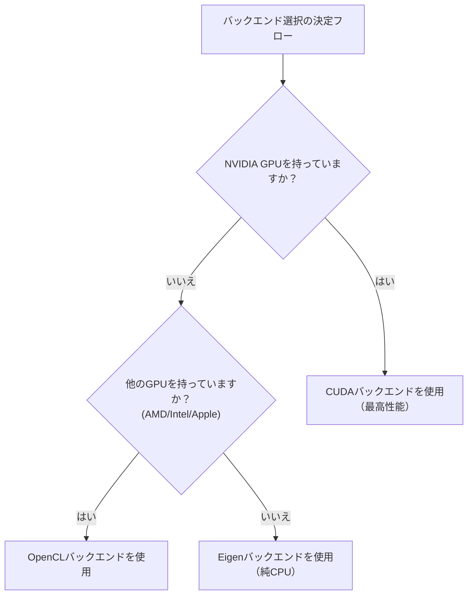

# KataGoインストールと設定

本文では各プラットフォームでのKataGoのインストール方法を詳しく紹介します。システム要件、インストール手順、モデル選択、設定ファイルの説明を含みます。

## システム要件

### ハードウェア要件

#### GPU（推奨）

| GPUタイプ | サポート状態 | 推奨バックエンド |
|---------|---------|---------|
| NVIDIA（CUDA） | 最良サポート | CUDA |
| NVIDIA（CUDAなし） | 良好サポート | OpenCL |
| AMD | 良好サポート | OpenCL |
| Intel内蔵GPU | 基本サポート | OpenCL |
| Apple Silicon | 良好サポート | Metal / OpenCL |

#### CPUモード

適切なGPUがない場合、Eigenバックエンドで純CPU実行が可能です：
- 性能は低い（約10-30 playouts/sec）
- 学習、テスト、低負荷使用に適している
- AVX2命令セットサポートが必要（ほとんどの現代CPUがサポート）

### ソフトウェア要件

| オペレーティングシステム | バージョン要件 |
|---------|---------|
| **Linux** | Ubuntu 18.04+、CentOS 7+、その他の現代ディストリビューション |
| **macOS** | 10.14+（Mojave以降） |
| **Windows** | Windows 10以降 |

### バックエンド選択ガイド



## macOSインストール

### 方法1：Homebrew（推奨）

最も簡単なインストール方法で、すべての依存関係を自動処理します。

```bash
# KataGoをインストール
brew install katago

# インストール確認
katago version
```

Homebrew版はデフォルトでOpenCLバックエンドを使用し、Intel MacとApple Silicon両方で動作します。

### 方法2：ソースからコンパイル

カスタムオプションや最新機能が必要なユーザー向けです。

#### 依存関係のインストール

```bash
# CMakeとコンパイルツールをインストール
brew install cmake

# OpenCLを使用する場合
# macOSにはOpenCLサポートが組み込まれており、追加インストール不要
```

#### コンパイル手順

```bash
# ソースコードをクローン
git clone https://github.com/lightvector/KataGo.git
cd KataGo/cpp

# ビルドディレクトリを作成
mkdir build && cd build

# コンパイルオプションを設定（OpenCLバックエンド）
cmake .. -DUSE_BACKEND=OPENCL

# コンパイル
make -j$(sysctl -n hw.ncpu)

# コンパイル完了後、実行ファイルはbuild/katagoに
./katago version
```

#### Apple Silicon特別説明

M1/M2/M3 Macでは、OpenCLまたはMetalバックエンドの使用を推奨：

```bash
# OpenCLバックエンド（推奨、互換性が良い）
cmake .. -DUSE_BACKEND=OPENCL

# Metalバックエンド（実験的、より良い性能の可能性）
cmake .. -DUSE_BACKEND=METAL
```

## Linuxインストール

### 方法1：プリコンパイル版（推奨）

GitHub Releasesからプリコンパイル版をダウンロード：

```bash
# OpenCL版をダウンロード（ほとんどの場合に適用）
wget https://github.com/lightvector/KataGo/releases/download/v1.15.3/katago-v1.15.3-opencl-linux-x64.zip

# またはCUDA版をダウンロード（NVIDIA GPU）
wget https://github.com/lightvector/KataGo/releases/download/v1.15.3/katago-v1.15.3-cuda11.1-linux-x64.zip

# 解凍
unzip katago-v1.15.3-*.zip

# 実行権限を付与
chmod +x katago

# インストール確認
./katago version
```

### 方法2：ソースからコンパイル

#### CUDAバックエンド（NVIDIA GPU）

```bash
# 依存関係をインストール
sudo apt update
sudo apt install cmake g++ libzip-dev

# CUDAをインストール（まだの場合）
# NVIDIA公式ガイドを参照：https://developer.nvidia.com/cuda-downloads

# クローンしてコンパイル
git clone https://github.com/lightvector/KataGo.git
cd KataGo/cpp
mkdir build && cd build

# CUDAバックエンドを設定
cmake .. -DUSE_BACKEND=CUDA

# コンパイル
make -j$(nproc)
```

#### OpenCLバックエンド（汎用GPU）

```bash
# 依存関係をインストール
sudo apt update
sudo apt install cmake g++ libzip-dev ocl-icd-opencl-dev

# OpenCLドライバをインストール
# NVIDIA: CUDAと一緒にインストール
# AMD: sudo apt install mesa-opencl-icd
# Intel: sudo apt install intel-opencl-icd

# クローンしてコンパイル
git clone https://github.com/lightvector/KataGo.git
cd KataGo/cpp
mkdir build && cd build

cmake .. -DUSE_BACKEND=OPENCL
make -j$(nproc)
```

#### Eigenバックエンド（純CPU）

```bash
# 依存関係をインストール
sudo apt update
sudo apt install cmake g++ libzip-dev libeigen3-dev

# クローンしてコンパイル
git clone https://github.com/lightvector/KataGo.git
cd KataGo/cpp
mkdir build && cd build

cmake .. -DUSE_BACKEND=EIGEN
make -j$(nproc)
```

## Windowsインストール

### 方法1：プリコンパイル版（推奨）

1. [KataGo Releases](https://github.com/lightvector/KataGo/releases)にアクセス
2. 適切なバージョンをダウンロード：
   - `katago-v1.15.3-cuda11.1-windows-x64.zip`（NVIDIA GPU + CUDA）
   - `katago-v1.15.3-opencl-windows-x64.zip`（その他のGPU）
   - `katago-v1.15.3-eigen-windows-x64.zip`（純CPU）
3. 指定ディレクトリに解凍
4. コマンドプロンプトでテスト：

```cmd
cd C:\path\to\katago
katago.exe version
```

### 方法2：ソースからコンパイル

#### 環境準備

1. [Visual Studio 2019/2022](https://visualstudio.microsoft.com/)をインストール（C++ツール含む）
2. [CMake](https://cmake.org/download/)をインストール
3. CUDAを使用する場合、[CUDA Toolkit](https://developer.nvidia.com/cuda-toolkit)をインストール

#### コンパイル手順

```cmd
# Developer Command Promptで実行

git clone https://github.com/lightvector/KataGo.git
cd KataGo\cpp
mkdir build
cd build

# CUDAバックエンド
cmake .. -G "Visual Studio 17 2022" -A x64 -DUSE_BACKEND=CUDA

# またはOpenCLバックエンド
cmake .. -G "Visual Studio 17 2022" -A x64 -DUSE_BACKEND=OPENCL

# コンパイル
cmake --build . --config Release
```

## モデルのダウンロードと選択

KataGoは実行にニューラルネットワークモデルファイルが必要です。公式では様々なサイズのモデルを提供しています。

### ダウンロード場所

公式モデルダウンロードページ：https://katagotraining.org/

または訓練サーバーから直接ダウンロード：

```bash
# 小さいモデル（テストや弱いハードウェア向け）
curl -L -o kata-b18c384.bin.gz \
  "https://media.katagotraining.org/uploaded/networks/models/kata1/kata1-b18c384nbt-s9996604416-d4316597426.bin.gz"

# 中型モデル（推奨、性能と速度のバランス）
curl -L -o kata-b40c256.bin.gz \
  "https://media.katagotraining.org/uploaded/networks/models/kata1/kata1-b40c256-s11840935168-d2898845681.bin.gz"

# 大型モデル（最強棋力、強力なGPUが必要）
curl -L -o kata-b60c320.bin.gz \
  "https://media.katagotraining.org/uploaded/networks/models/kata1/kata1-b60c320-s11318001920-d2792783831.bin.gz"
```

### モデル比較

| モデル | ネットワークサイズ | ファイルサイズ | 棋力 | 適用シーン |
|------|---------|---------|------|---------|
| b10c128 | 10ブロック、128チャネル | ~20 MB | アマ高段 | CPU、弱GPU、クイックテスト |
| b18c384 | 18ブロック、384チャネル | ~140 MB | プロレベル | 一般GPU、日常分析 |
| b40c256 | 40ブロック、256チャネル | ~250 MB | 超人レベル | 中上級GPU、深い分析 |
| b60c320 | 60ブロック、320チャネル | ~500 MB | トップ超人 | ハイエンドGPU、トップ分析 |

### 選択の推奨

```
あなたのGPUは？
├─ RTX 3080/4080/4090 → b60c320またはb40c256
├─ RTX 3060/3070 → b40c256またはb18c384
├─ GTX 1660/2060 → b18c384
├─ エントリーレベルGPU → b18c384またはb10c128
└─ 純CPU → b10c128
```

## 基本設定ファイル説明

KataGoは`.cfg`フォーマットの設定ファイルを使用します。公式サンプル設定ファイルは`cpp/configs/`ディレクトリにあります。

### 重要な設定ファイル

| ファイル | 用途 |
|------|------|
| `gtp_example.cfg` | GTPモードのサンプル設定 |
| `analysis_example.cfg` | Analysis Engineのサンプル設定 |
| `default_gtp.cfg` | GTPモードのデフォルト設定 |

### コア設定項目

```ini
# =============
# ニューラルネットワーク設定
# =============

# ニューラルネットワークモデルファイルのパス
# 相対パスまたは絶対パスを使用可能
# model = /path/to/model.bin.gz

# =============
# 探索設定
# =============

# 1手あたりの最大探索訪問数
# この値を増やすと棋力が上がるが速度は低下
maxVisits = 500

# 1手あたりの最大思考時間（秒）
# 0は無制限（maxVisitsで制御）
maxTime = 0

# 各手で使用するスレッド数
numSearchThreads = 6

# =============
# ルール設定
# =============

# 囲碁ルール
# chinese = 中国ルール
# japanese = 日本ルール
# korean = 韓国ルール
# tromp-taylor = Tromp-Taylorルール
# aga = AGAルール
rules = chinese

# コミ
komi = 7.5

# =============
# GPU設定
# =============

# 使用するGPU番号（0から開始）
# 複数GPUはカンマ区切り：0,1,2
# -1は自動選択
nnDeviceIdxs = 0

# GPU当たりのバッチサイズ
# 大きいバッチはGPU利用率を向上
numNNServerThreadsPerModel = 1

# =============
# 高度な設定
# =============

# MCTS探索定数
# 大きい値は探索を増加、小さい値は活用を増加
cpuctExploration = 1.0

# ルートノードのDirichletノイズ
# 探索の多様性を増加
rootNoiseEnabled = true
rootDirichletNoisePruneFactor = 0.25
```

### GTPモード設定例

`my_gtp_config.cfg`を作成：

```ini
# モデルパス
# modelは通常コマンドラインで指定、ここでは省略可能

# 探索設定
maxVisits = 1000
numSearchThreads = 4

# ルール
rules = chinese
komi = 7.5

# GPU設定
nnDeviceIdxs = 0

# ログ
logDir = ./logs
logToStderr = false
```

### Analysis Engine設定例

`my_analysis_config.cfg`を作成：

```ini
# 探索設定
maxVisits = 500
numSearchThreads = 8

# レポート設定
# 各分析で報告する最大変化数
maxMoves = 10

# ルール（API呼び出しで上書き可能）
rules = chinese
komi = 7.5

# GPU設定
nnDeviceIdxs = 0
numNNServerThreadsPerModel = 2

# 分析機能
reportAnalysisWinratesAs = BLACK

# 所有権マップ
# 有効にすると各点の帰属予測を取得可能
analysisOwnership = true
```

## 初回実行

### GTPモードのテスト

```bash
# GTPモードを実行
katago gtp -model /path/to/model.bin.gz -config /path/to/config.cfg

# configがない場合、KataGoはデフォルト値を使用
katago gtp -model /path/to/model.bin.gz
```

起動に成功したら、GTPコマンドを入力してテスト：

```
name
= KataGo

version
= 1.15.3

boardsize 19
=

genmove black
= Q16

quit
=
```

### Analysis Engineのテスト

```bash
# Analysis Engineを実行
katago analysis -model /path/to/model.bin.gz -config /path/to/config.cfg
```

JSONクエリを入力：

```json
{"id":"test1","initialStones":[],"moves":[],"rules":"chinese","komi":7.5,"boardXSize":19,"boardYSize":19,"analyzeTurns":[0]}
```

### ベンチマークテスト

ハードウェアの性能をテスト：

```bash
# ベンチマークを実行
katago benchmark -model /path/to/model.bin.gz

# 設定ファイルを指定
katago benchmark -model /path/to/model.bin.gz -config /path/to/config.cfg
```

ベンチマークは以下を出力：
- 毎秒の探索訪問数（visits/sec）
- ニューラルネットワーク推論速度
- 推奨スレッド設定

## よくある問題の解決

### GPU関連

**問題：GPUが見つからない**

```bash
# OpenCLデバイスを確認
clinfo

# またはKataGoが見るデバイスを一覧
katago gpuinfo
```

**問題：CUDA初期化失敗**

- CUDAバージョンがKataGoコンパイル版と一致していることを確認
- GPUドライバを更新
- CUDA_PATH環境変数を確認

### メモリ関連

**問題：メモリ不足**

```ini
# GPUメモリ使用量を削減
nnMaxBatchSize = 8  # デフォルトは16以上の場合あり
nnCacheSizePowerOfTwo = 20  # キャッシュサイズを削減
```

### 性能関連

**問題：速度が遅い**

1. CPUではなくGPUを使用していることを確認
2. `numSearchThreads`を減らす
3. より小さいモデルを使用
4. 他のプログラムがGPUを占有していないか確認

## 次のステップ

設定完了後、以下を続けてお読みください：
- [よく使うコマンド](./commands.md) - KataGoの使用方法を学ぶ
- [ソースコードアーキテクチャ](./architecture.md) - 内部実装を理解する

