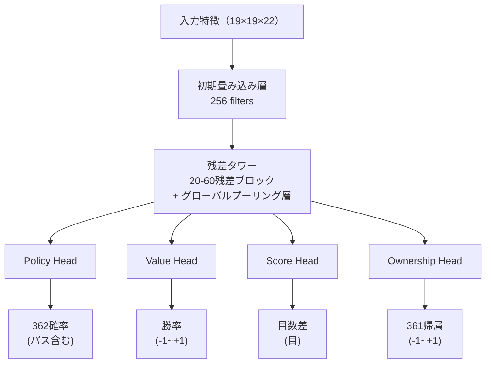
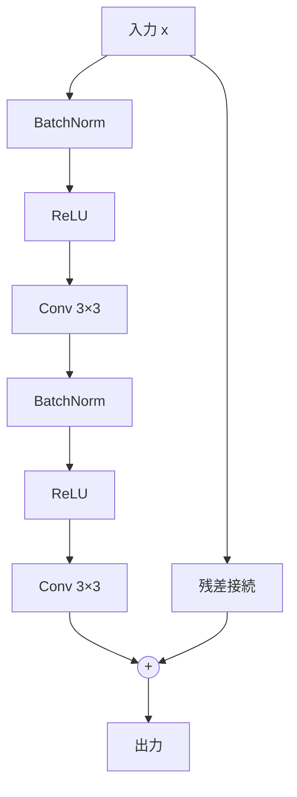

# ニューラルネットワークアーキテクチャ詳解

本記事では、KataGoニューラルネットワークの完全なアーキテクチャを、入力特徴エンコーディングからマルチヘッド出力設計まで詳しく解説します。

---

## アーキテクチャ概要

KataGoは**単一ニューラルネットワーク・マルチヘッド出力**設計を採用しています：



---

## 入力特徴エンコーディング

### 特徴平面の概要

KataGoは **22の特徴平面**（19×19×22）を使用し、各平面は19×19の行列です：

| 平面 | 内容 | 説明 |
|------|------|------|
| 0 | 自分の石 | 1 = 自分の石あり、0 = なし |
| 1 | 相手の石 | 1 = 相手の石あり、0 = なし |
| 2 | 空点 | 1 = 空点、0 = 石あり |
| 3-10 | 履歴状態 | 過去8手の盤面変化 |
| 11 | コウ禁止点 | 1 = ここはコウ禁止、0 = 着手可能 |
| 12-17 | 呼吸点エンコード | 1呼吸、2呼吸、3呼吸...の石群 |
| 18-21 | ルールエンコード | 中国/日本ルール、コミなど |

### 履歴状態スタッキング

ニューラルネットワークに局面の**動的変化**を理解させるため、KataGoは過去8手の盤面状態をスタックします：

```python
# 履歴状態エンコーディング（概念）
def encode_history(game_history, current_player):
    features = []

    for t in range(8):  # 過去8手
        if t < len(game_history):
            board = game_history[-(t+1)]
            # その時点の自分/相手の石をエンコード
            features.append(encode_board(board, current_player))
        else:
            # 履歴が不足している場合、ゼロで埋める
            features.append(np.zeros((19, 19)))

    return np.stack(features, axis=0)
```

### ルールエンコーディング

KataGoは複数のルールをサポートし、特徴平面でニューラルネットワークに通知します：

```python
# ルールエンコーディング（概念）
def encode_rules(rules, komi):
    rule_features = np.zeros((4, 19, 19))

    # ルールタイプ（one-hot）
    if rules == "chinese":
        rule_features[0] = 1.0
    elif rules == "japanese":
        rule_features[1] = 1.0

    # コミの正規化
    normalized_komi = komi / 15.0  # [-1, 1]に正規化
    rule_features[2] = normalized_komi

    # 現在のプレイヤー
    rule_features[3] = 1.0 if current_player == BLACK else 0.0

    return rule_features
```

---

## バックボーンネットワーク：残差タワー

### 残差ブロック構造

KataGoは **Pre-activation ResNet** 構造を使用しています：



### コード例

```python
class ResidualBlock(nn.Module):
    def __init__(self, channels):
        super().__init__()
        self.bn1 = nn.BatchNorm2d(channels)
        self.conv1 = nn.Conv2d(channels, channels, 3, padding=1)
        self.bn2 = nn.BatchNorm2d(channels)
        self.conv2 = nn.Conv2d(channels, channels, 3, padding=1)

    def forward(self, x):
        residual = x

        out = self.bn1(x)
        out = F.relu(out)
        out = self.conv1(out)

        out = self.bn2(out)
        out = F.relu(out)
        out = self.conv2(out)

        return out + residual  # 残差接続
```

### グローバルプーリング層

KataGoの重要なイノベーションの一つ：残差ブロックに**グローバルプーリング**を追加し、ネットワークがグローバル情報を見られるようにします：

```python
class GlobalPoolingBlock(nn.Module):
    def __init__(self, channels):
        super().__init__()
        self.conv = nn.Conv2d(channels, channels, 3, padding=1)
        self.fc = nn.Linear(channels, channels)

    def forward(self, x):
        # ローカルパス
        local = self.conv(x)

        # グローバルパス
        global_pool = x.mean(dim=[2, 3])  # グローバル平均プーリング
        global_fc = self.fc(global_pool)
        global_broadcast = global_fc.unsqueeze(2).unsqueeze(3)
        global_broadcast = global_broadcast.expand(-1, -1, 19, 19)

        # 融合
        return local + global_broadcast
```

**なぜグローバルプーリングが必要なのか？**

従来の畳み込みはローカル（3×3受容野）しか見えず、多くの層を積み重ねてもグローバル情報の認識には限界があります。グローバルプーリングにより、ネットワークは以下を直接「見る」ことができます：
- 盤面全体の石数の差
- 全体的な勢力分布
- 全体的な形勢判断

---

## 出力ヘッド設計

### Policy Head（方策ヘッド）

各位置の着手確率を出力します：

```python
class PolicyHead(nn.Module):
    def __init__(self, in_channels):
        super().__init__()
        self.conv = nn.Conv2d(in_channels, 2, 1)  # 1×1畳み込み
        self.bn = nn.BatchNorm2d(2)
        self.fc = nn.Linear(2 * 19 * 19, 362)  # 361 + パス

    def forward(self, x):
        out = F.relu(self.bn(self.conv(x)))
        out = out.view(out.size(0), -1)
        out = self.fc(out)
        return F.softmax(out, dim=1)  # 確率分布
```

**出力形式**：362次元ベクトル
- インデックス0-360：盤面上の361箇所の着手確率
- インデックス361：パスの確率

### Value Head（価値ヘッド）

現在の局面の勝率を出力します：

```python
class ValueHead(nn.Module):
    def __init__(self, in_channels):
        super().__init__()
        self.conv = nn.Conv2d(in_channels, 1, 1)
        self.bn = nn.BatchNorm2d(1)
        self.fc1 = nn.Linear(19 * 19, 256)
        self.fc2 = nn.Linear(256, 1)

    def forward(self, x):
        out = F.relu(self.bn(self.conv(x)))
        out = out.view(out.size(0), -1)
        out = F.relu(self.fc1(out))
        out = torch.tanh(self.fc2(out))  # -1から+1を出力
        return out
```

**出力形式**：単一の数値 [-1, +1]
- +1：自分の必勝
- -1：相手の必勝
- 0：互角

### Score Head（目数ヘッド）

KataGo独自の機能で、最終的な目数差を予測します：

```python
class ScoreHead(nn.Module):
    def __init__(self, in_channels):
        super().__init__()
        self.conv = nn.Conv2d(in_channels, 1, 1)
        self.bn = nn.BatchNorm2d(1)
        self.fc1 = nn.Linear(19 * 19, 256)
        self.fc2 = nn.Linear(256, 1)

    def forward(self, x):
        out = F.relu(self.bn(self.conv(x)))
        out = out.view(out.size(0), -1)
        out = F.relu(self.fc1(out))
        out = self.fc2(out)  # 制限なしの出力
        return out
```

**出力形式**：単一の数値（目数）
- 正の値：自分がリード
- 負の値：相手がリード

### Ownership Head（地ヘッド）

各点の最終的な帰属を予測します：

```python
class OwnershipHead(nn.Module):
    def __init__(self, in_channels):
        super().__init__()
        self.conv1 = nn.Conv2d(in_channels, 32, 1)
        self.bn = nn.BatchNorm2d(32)
        self.conv2 = nn.Conv2d(32, 1, 1)

    def forward(self, x):
        out = F.relu(self.bn(self.conv1(x)))
        out = torch.tanh(self.conv2(out))  # 各点で-1から+1
        return out.view(out.size(0), -1)  # 361に平坦化
```

**出力形式**：361次元ベクトル、各値は [-1, +1]
- +1：その点は自分の地
- -1：その点は相手の地
- 0：中立または係争地域

---

## AlphaZeroとの違い

| 側面 | AlphaZero | KataGo |
|------|-----------|--------|
| **出力ヘッド** | 2個（Policy + Value） | **4個**（+ Score + Ownership） |
| **グローバルプーリング** | なし | **あり** |
| **入力特徴** | 17平面 | **22平面**（ルールエンコード含む） |
| **残差ブロック** | 標準ResNet | **Pre-activation + グローバルプーリング** |
| **マルチルール対応** | なし | **あり**（特徴エンコードで対応） |

---

## モデル規模

KataGoは異なる規模のモデルを提供しています：

| モデル | 残差ブロック数 | チャネル数 | パラメータ数 | 用途 |
|------|---------|--------|--------|---------|
| b10c128 | 10 | 128 | ~5M | CPU、クイックテスト |
| b18c384 | 18 | 384 | ~75M | 一般的なGPU |
| b40c256 | 40 | 256 | ~95M | ハイエンドGPU |
| b60c320 | 60 | 320 | ~200M | 最上位GPU |

**命名規則**：`b{残差ブロック数}c{チャネル数}`

---

## 完全なネットワーク実装

```python
class KataGoNetwork(nn.Module):
    def __init__(self, num_blocks=18, channels=384):
        super().__init__()

        # 初期畳み込み
        self.initial_conv = nn.Conv2d(22, channels, 3, padding=1)
        self.initial_bn = nn.BatchNorm2d(channels)

        # 残差タワー
        self.residual_blocks = nn.ModuleList([
            ResidualBlock(channels) for _ in range(num_blocks)
        ])

        # グローバルプーリングブロック（数ブロックごとに挿入）
        self.global_pooling_blocks = nn.ModuleList([
            GlobalPoolingBlock(channels) for _ in range(num_blocks // 6)
        ])

        # 出力ヘッド
        self.policy_head = PolicyHead(channels)
        self.value_head = ValueHead(channels)
        self.score_head = ScoreHead(channels)
        self.ownership_head = OwnershipHead(channels)

    def forward(self, x):
        # 初期畳み込み
        out = F.relu(self.initial_bn(self.initial_conv(x)))

        # 残差タワー
        gp_idx = 0
        for i, block in enumerate(self.residual_blocks):
            out = block(out)

            # 6ブロックごとにグローバルプーリングを挿入
            if (i + 1) % 6 == 0 and gp_idx < len(self.global_pooling_blocks):
                out = self.global_pooling_blocks[gp_idx](out)
                gp_idx += 1

        # 出力ヘッド
        policy = self.policy_head(out)
        value = self.value_head(out)
        score = self.score_head(out)
        ownership = self.ownership_head(out)

        return {
            'policy': policy,
            'value': value,
            'score': score,
            'ownership': ownership
        }
```

---

## 関連記事

- [MCTS実装詳細](../mcts-implementation) — 探索とニューラルネットワークの統合
- [KataGo訓練メカニズム解析](../training) — ネットワークの訓練方法
- [重要論文ガイド](../papers) — 原論文の数学的導出
