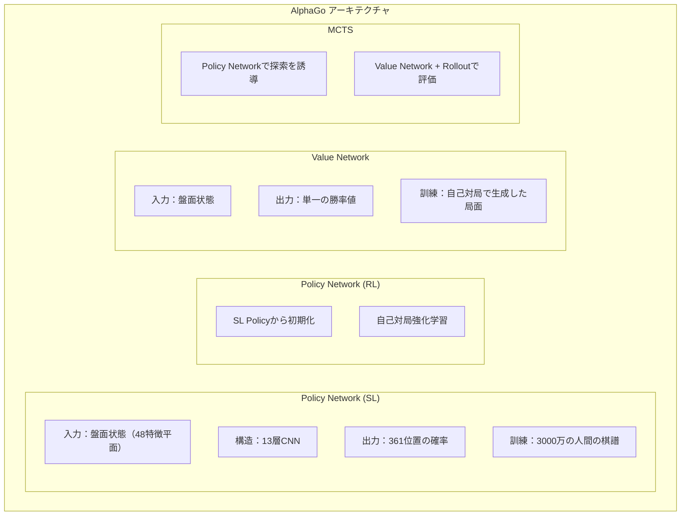
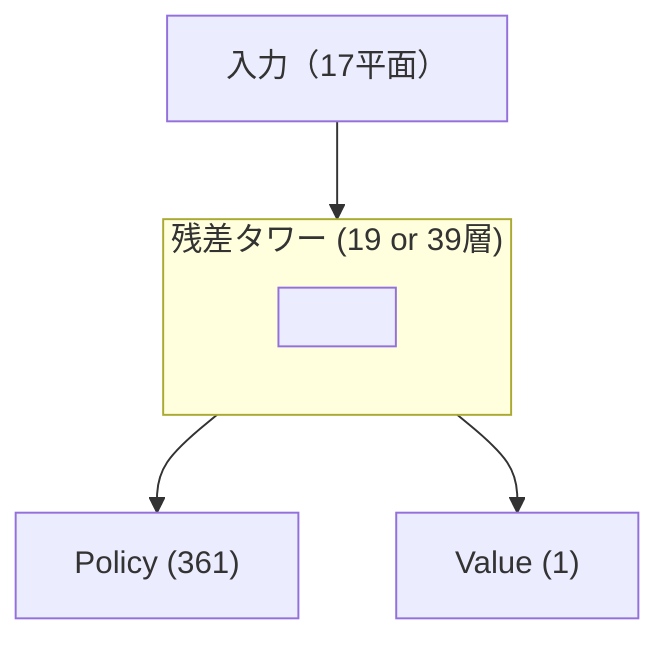
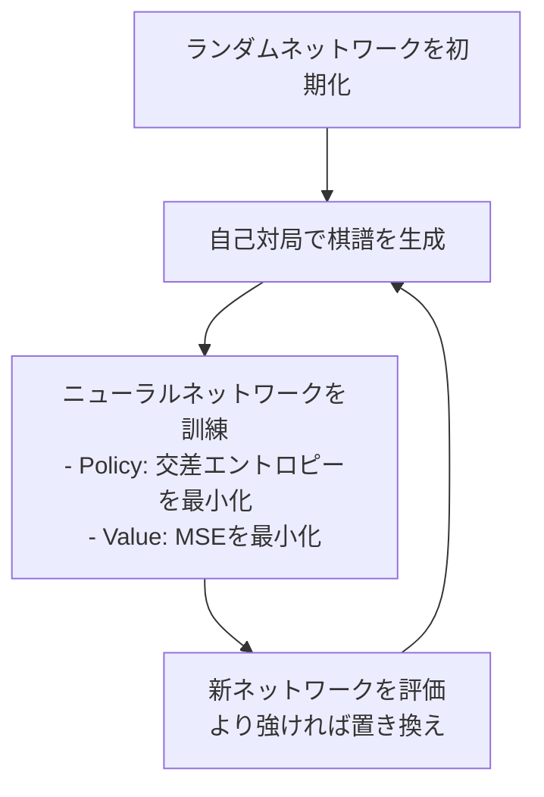

# 重要論文ガイド

本記事では、囲碁AI発展史上最も重要な論文を整理し、素早く理解するための要約と技術ポイントを提供します。

---

## 論文概要

### タイムライン

```
2006  Coulom - MCTSを囲碁に初めて適用
2016  Silver et al. - AlphaGo（Nature）
2017  Silver et al. - AlphaGo Zero（Nature）
2017  Silver et al. - AlphaZero
2019  Wu - KataGo
2020以降 各種改良と応用
```

### 読書推奨

| 目標 | 推奨論文 |
|------|---------|
| 基礎を理解 | AlphaGo (2016) |
| 自己対局を理解 | AlphaGo Zero (2017) |
| 汎用的な方法を理解 | AlphaZero (2017) |
| 実装の参考 | KataGo (2019) |

---

## 1. MCTSの誕生（2006）

### 論文情報

```
タイトル：Efficient Selectivity and Backup Operators in Monte-Carlo Tree Search
著者：Rémi Coulom
発表：Computers and Games 2006
```

### 核心貢献

モンテカルロ法を囲碁に体系的に初めて適用：

```
以前：純粋なランダムシミュレーション、木構造なし
以後：探索木を構築 + UCB選択 + 統計の逆伝播
```

### 重要概念

#### UCB1公式

```
選択スコア = 平均勝率 + C × √(ln(N) / n)

ここで：
- N：親ノードの訪問回数
- n：子ノードの訪問回数
- C：探索定数
```

#### MCTSの4ステップ

```
1. Selection：UCBでノードを選択
2. Expansion：新ノードを展開
3. Simulation：終局までランダムシミュレーション
4. Backpropagation：勝敗を逆伝播
```

### 影響

- 囲碁AIがアマチュア段位レベルに到達
- 後続のすべての囲碁AIの基礎に
- UCB概念がPUCTの発展に影響

---

## 2. AlphaGo（2016）

### 論文情報

```
タイトル：Mastering the game of Go with deep neural networks and tree search
著者：Silver, D., Huang, A., Maddison, C.J., et al.
発表：Nature, 2016
DOI：10.1038/nature16961
```

### 核心貢献

**深層学習とMCTSを初めて組み合わせ**、人間の世界チャンピオンを破った。

### システムアーキテクチャ



### 技術ポイント

#### 1. 教師あり学習Policy Network

```python
# 入力特徴（48平面）
- 自分の石の位置
- 相手の石の位置
- 呼吸点の数
- 取った後の状態
- 合法手の位置
- 最近数手の位置
...
```

#### 2. 強化学習による改善

```
SL Policy → 自己対局 → RL Policy

RL PolicyはSL Policyに対して約80%の勝率
```

#### 3. Value Networkの訓練

```
過学習を防ぐ鍵：
- 各対局から1局面のみを取得
- 類似局面の重複を避ける
```

#### 4. MCTSとの統合

```
リーフノード評価 = 0.5 × Value Network + 0.5 × Rollout

Rolloutは高速Policy Network（精度は低いが速度が速い）を使用
```

### 重要データ

| 項目 | 数値 |
|------|------|
| SL Policy精度 | 57% |
| RL PolicyのSL Policyに対する勝率 | 80% |
| 訓練GPU | 176 |
| 対局GPU | 48 TPU |

---

## 3. AlphaGo Zero（2017）

### 論文情報

```
タイトル：Mastering the game of Go without human knowledge
著者：Silver, D., Schrittwieser, J., Simonyan, K., et al.
発表：Nature, 2017
DOI：10.1038/nature24270
```

### 核心貢献

**人間の棋譜を一切必要とせず**、ゼロから自己学習。

### AlphaGoとの違い

| 側面 | AlphaGo | AlphaGo Zero |
|------|---------|--------------|
| 人間の棋譜 | 必要 | **不要** |
| ネットワーク数 | 4個 | **1個のデュアルヘッド** |
| 入力特徴 | 48平面 | **17平面** |
| Rollout | 使用 | **不使用** |
| 残差ネットワーク | なし | **あり** |
| 訓練時間 | 数ヶ月 | **3日** |

### 重要なイノベーション

#### 1. 単一デュアルヘッドネットワーク



#### 2. 簡略化された入力特徴

```python
# 17特徴平面のみ必要
features = [
    current_player_stones,      # 自分の石
    opponent_stones,            # 相手の石
    history_1_player,           # 履歴状態1
    history_1_opponent,
    ...                         # 履歴状態2-7
    color_to_play               # 手番
]
```

#### 3. 純粋なValue Network評価

```
Rolloutを使用しない
リーフノード評価 = Value Networkの出力

より簡潔、より高速
```

#### 4. 訓練フロー



### 学習曲線

```
訓練時間    Elo
─────────────────
3時間      初心者
24時間     AlphaGo Leeを超越
72時間     AlphaGo Masterを超越
```

---

## 4. AlphaZero（2017）

### 論文情報

```
タイトル：Mastering Chess and Shogi by Self-Play with a General Reinforcement Learning Algorithm
著者：Silver, D., Hubert, T., Schrittwieser, J., et al.
発表：arXiv:1712.01815（後にScience, 2018に掲載）
```

### 核心貢献

**汎用化**：同じアルゴリズムを囲碁、チェス、将棋に適用。

### 汎用アーキテクチャ

```
入力エンコーディング（ゲーム固有）→ 残差ネットワーク（汎用）→ デュアルヘッド出力（汎用）
```

### クロスゲーム適応

| ゲーム | 入力平面 | 行動空間 | 訓練時間 |
|------|---------|---------|---------|
| 囲碁 | 17 | 362 | 40日 |
| チェス | 119 | 4672 | 9時間 |
| 将棋 | 362 | 11259 | 12時間 |

### MCTSの改良

#### PUCT公式

```
選択スコア = Q(s,a) + c(s) × P(s,a) × √N(s) / (1 + N(s,a))

c(s) = log((1 + N(s) + c_base) / c_base) + c_init
```

#### 探索ノイズ

```python
# ルートノードにディリクレノイズを追加
P(s,a) = (1 - ε) × p_a + ε × η_a

η ~ Dir(α)
α = 0.03（囲碁）, 0.3（チェス）, 0.15（将棋）
```

---

## 5. KataGo（2019）

### 論文情報

```
タイトル：Accelerating Self-Play Learning in Go
著者：David J. Wu
発表：arXiv:1902.10565
```

### 核心貢献

**50倍の効率向上**、個人開発者でも強力な囲碁AIを訓練可能に。

### 重要なイノベーション

#### 1. 補助訓練目標

```
総損失 = Policy Loss + Value Loss +
         Score Loss + Ownership Loss + ...

補助目標によりネットワークの収束が速くなる
```

#### 2. グローバル特徴

```python
# グローバルプーリング層
global_features = global_avg_pool(conv_features)
# ローカル特徴と結合
combined = concat(conv_features, broadcast(global_features))
```

#### 3. Playout Capランダム化

```
従来：毎回固定N回の探索
KataGo：Nを分布からランダムサンプリング

ネットワークが様々な探索深度でも良いパフォーマンスを学習
```

#### 4. 段階的盤面サイズ

```python
if training_step < 1000000:
    board_size = random.choice([9, 13, 19])
else:
    board_size = 19
```

### 効率比較

| 指標 | AlphaZero | KataGo |
|------|-----------|--------|
| 超人レベルに到達するGPU日数 | 5000 | **100** |
| 効率向上 | 基準 | **50倍** |

---

## 6. 関連論文

### MuZero（2020）

```
タイトル：Mastering Atari, Go, Chess and Shogi by Planning with a Learned Model
貢献：環境ダイナミクスモデルを学習、ゲームルールが不要
```

### EfficientZero（2021）

```
タイトル：Mastering Atari Games with Limited Data
貢献：サンプル効率の大幅な向上
```

### Gumbel AlphaZero（2022）

```
タイトル：Policy Improvement by Planning with Gumbel
貢献：改良された方策改善手法
```

---

## 論文読書の提案

### 入門順序

```
1. AlphaGo (2016) - 基本アーキテクチャを理解
2. AlphaGo Zero (2017) - 自己対局を理解
3. KataGo (2019) - 実装詳細を理解
```

### 上級順序

```
4. AlphaZero (2017) - 汎用化
5. MuZero (2020) - 世界モデルの学習
6. MCTS原論文 - 基礎を理解
```

### 読書テクニック

1. **まずアブストラクトと結論を読む**：核心貢献を素早く把握
2. **図表を見る**：全体アーキテクチャを理解
3. **手法部分を読む**：技術詳細を理解
4. **付録を見る**：実装詳細とハイパーパラメータを探す

---

## リソースリンク

### 論文PDF

| 論文 | リンク |
|------|------|
| AlphaGo | [Nature](https://www.nature.com/articles/nature16961) |
| AlphaGo Zero | [Nature](https://www.nature.com/articles/nature24270) |
| AlphaZero | [Science](https://www.science.org/doi/10.1126/science.aar6404) |
| KataGo | [arXiv](https://arxiv.org/abs/1902.10565) |

### オープンソース実装

| プロジェクト | リンク |
|------|------|
| KataGo | [GitHub](https://github.com/lightvector/KataGo) |
| Leela Zero | [GitHub](https://github.com/leela-zero/leela-zero) |
| MiniGo | [GitHub](https://github.com/tensorflow/minigo) |

---

## 関連記事

- [ニューラルネットワークアーキテクチャ詳解](../neural-network) — ネットワーク設計の深い理解
- [MCTS実装詳細](../mcts-implementation) — 探索アルゴリズムの実装
- [KataGo訓練メカニズム解析](../training) — 訓練フローの詳細
