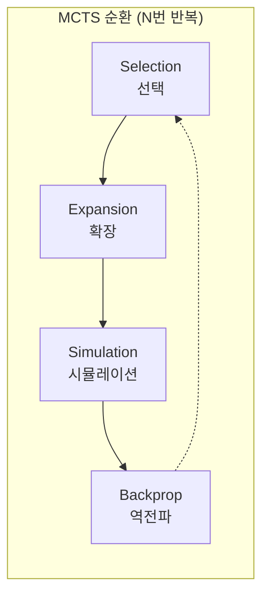
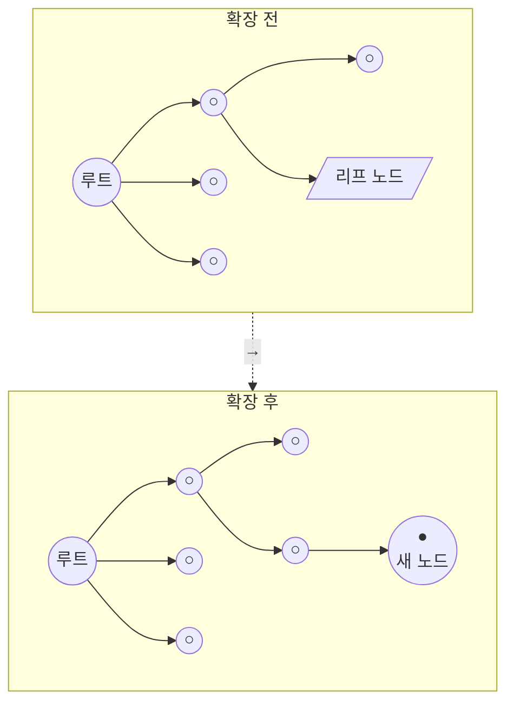
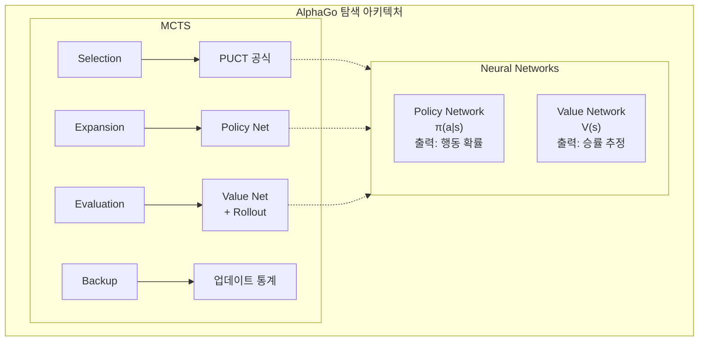

import { MCTSTree } from '@site/src/components/D3Charts';

# MCTS와 신경망의 결합

앞선 글에서 우리는 신경망(Policy Network와 Value Network)과 강화학습의 개념을 각각 소개했습니다. 이제 AlphaGo의 핵심 혁신인 **몬테카를로 트리 탐색(MCTS)과 신경망의 완벽한 결합**을 살펴보겠습니다.

이 결합이 AlphaGo 성공의 핵심입니다: 신경망이 '직관'을 제공하고, MCTS가 '추론'을 제공하며, 둘이 서로 보완합니다.

---

## 전통적 MCTS 복습

### MCTS란?

**몬테카를로 트리 탐색(Monte Carlo Tree Search, MCTS)**은 무작위 샘플링 기반의 탐색 알고리즘으로, 특히 게임 AI에 적합합니다.

MCTS의 핵심 아이디어는: **모든 가능한 수를 완전히 열거하는 대신, 대량의 게임을 무작위로 시뮬레이션하고 통계를 사용하여 각 수의 좋고 나쁨을 추정하는 것**입니다.

### 네 단계

전통적인 MCTS는 네 단계를 반복적으로 수행합니다:



각 단계를 자세히 살펴보겠습니다:

### 1. Selection(선택)

루트 노드에서 시작하여 트리를 따라 내려가며 '가장 유망한' 자식 노드를 선택하여 리프 노드에 도달합니다.

선택 기준은 **UCB1(Upper Confidence Bound)** 공식입니다:

$$\text{UCB1}(s, a) = \bar{X}_{s,a} + c \sqrt{\frac{\ln N_s}{N_{s,a}}}$$

여기서:
- $\bar{X}_{s,a}$: 노드 $(s, a)$에서 출발한 평균 보상(**활용 항**)
- $\sqrt{\frac{\ln N_s}{N_{s,a}}}$: 탐색 보너스(**탐색 항**)
- $N_s$: 부모 노드의 방문 횟수
- $N_{s,a}$: 자식 노드의 방문 횟수
- $c$: 탐색과 활용의 균형을 맞추는 상수

이 공식의 지혜는:
- 방문 횟수가 적은 노드는 더 높은 탐색 보너스를 받음
- 방문 횟수가 증가함에 따라 선택은 점점 실제 가치가 높은 노드로 치우침

### 2. Expansion(확장)

리프 노드에 도달하면 아직 탐색하지 않은 행동 하나를 선택하여 새로운 자식 노드를 생성합니다.



### 3. Simulation(시뮬레이션/Rollout)

새 노드에서 시작하여 특정 전략(보통 무작위 또는 간단한 휴리스틱)으로 게임을 빠르게 완료하고 결과를 얻습니다.

이것이 '몬테카를로' 이름의 유래입니다—**무작위 시뮬레이션으로 결과를 추정**합니다.

전통적 MCTS의 rollout 전략은:
- **순수 무작위**: 합법적인 수 중에서 균등 무작위로 선택
- **경량 휴리스틱**: 간단한 규칙으로 명백히 나쁜 수를 걸러냄

### 4. Backpropagation(역전파)

시뮬레이션 결과(승/패)를 경로를 따라 역으로 전달하며 각 노드의 통계 정보를 업데이트합니다:

```
업데이트 내용:
- 방문 횟수: N(s, a) ← N(s, a) + 1
- 누적 가치: W(s, a) ← W(s, a) + z
- 평균 가치: Q(s, a) = W(s, a) / N(s, a)
```

여기서 $z$는 시뮬레이션 결과(+1 또는 -1)입니다.

### 전통적 MCTS의 한계

전통적 MCTS는 바둑에서 제한적인 성능을 보입니다. 주요 문제는:

1. **Rollout 품질 저하**: 무작위 시뮬레이션은 종종 비합리적인 게임을 만들어냄
2. **대량의 시뮬레이션 필요**: 한 수마다 수만 번의 시뮬레이션이 필요할 수 있음
3. **부정확한 평가**: 순전히 승패 통계에 의존하여 정보 활용 효율이 낮음
4. **패턴 활용 불가**: 매번 새로 탐색하며 경험을 축적하지 않음

이러한 문제들이 AlphaGo에서 신경망으로 우아하게 해결되었습니다.

---

## 신경망이 MCTS를 개선하는 방법

### 전체 아키텍처

AlphaGo는 두 개의 신경망을 MCTS에 통합합니다:



### Policy Network의 역할

**Policy Network는 Expansion 단계에서 역할을 합니다**.

전통적 MCTS는 확장 시 모든 미탐색 행동을 동등하게 중요하게 취급합니다. 하지만 Policy Network는 **사전 확률(prior probability)**을 제공합니다:

$$P(s, a) = \pi_\theta(a|s)$$

이로써 MCTS가 '더 좋아 보이는' 수를 우선 탐색하게 하여 탐색 효율을 크게 높입니다.

예를 들어, 특정 국면에서:
- '천원'은 0.01%의 확률만 가질 수 있음
- '귀의 정석'은 15%의 확률을 가질 수 있음
- '대마당'은 10%의 확률을 가질 수 있음

MCTS는 높은 확률의 수를 우선 탐색하고, 명백히 좋지 않은 선택에 시간을 낭비하지 않습니다.

### Value Network의 역할

**Value Network는 Evaluation 단계에서 역할을 합니다**.

전통적 MCTS는 평가를 위해 게임 전체를 시뮬레이션해야 합니다. 하지만 Value Network는 어떤 국면의 승률도 직접 평가할 수 있습니다:

$$v(s) = V_\phi(s)$$

이것은 마치 대가에게 국면 평가를 요청하는 것과 같으며, 두 초보자가 게임을 끝까지 두고 결과를 보는 것보다 낫습니다.

AlphaGo 원본 버전은 Value Network와 Rollout을 혼합 사용합니다:

$$V(s_L) = (1 - \lambda) \cdot v_\theta(s_L) + \lambda \cdot z_L$$

여기서:
- $v_\theta(s_L)$: Value Network의 평가
- $z_L$: Rollout의 결과
- $\lambda$: 혼합 계수 (AlphaGo는 $\lambda = 0.5$ 사용)

### 탐색 트리 시각화

MCTS 탐색 트리를 시각화해 보겠습니다:

<MCTSTree width={700} height={450} showPUCT={true} interactive={true} />

이 시각화에서 볼 수 있는 것:
- 노드 크기는 방문 횟수를 반영
- 파란색 경로는 MCTS가 선택한 최적 경로
- 각 노드는 방문 횟수 N과 평균 가치 Q를 표시

---

## 탐색 과정 상세 설명

### 전체 흐름

한 번의 완전한 MCTS 시뮬레이션을 추적해 보겠습니다:

```
알고리즘: AlphaGo MCTS 단일 시뮬레이션

입력: 루트 노드 s_root, Policy Network π, Value Network V

1. Selection(선택)
   s = s_root
   경로 = []

   while s가 리프 노드가 아님:
       # PUCT 공식으로 행동 선택
       a* = argmax_a [Q(s,a) + U(s,a)]

       여기서 U(s,a) = c_puct · P(s,a) · √N(s) / (1 + N(s,a))

       경로.append((s, a*))
       s = 행동 a* 실행 후 상태

2. Expansion(확장)
   s가 종료 상태가 아니면:
       # Policy Network로 사전 확률 계산
       P(s, ·) = π(·|s)

       # 모든 합법적 행동에 대해 자식 노드 생성
       for a in 합법_행동:
           자식 노드 (s, a) 생성
           P(s,a), N(s,a)=0, W(s,a)=0 설정

3. Evaluation(평가)
   # Value Network와 Rollout 혼합
   v = V(s)                          # Value Network 평가
   z = rollout(s)                    # Rollout 결과
   value = (1-λ)·v + λ·z             # 혼합

   # AlphaGo Zero는 Value Network만 사용으로 단순화
   # value = V(s)

4. Backpropagation(역전파)
   for (s', a') in 역순(경로):
       N(s', a') += 1
       W(s', a') += value
       Q(s', a') = W(s', a') / N(s', a')
       value = -value                 # 관점 전환
```

### 선택 단계 상세

선택 단계는 **PUCT 공식**을 사용합니다(다음 글에서 자세히 논의):

$$a^* = \arg\max_a \left[ Q(s,a) + c_{\text{puct}} \cdot P(s,a) \cdot \frac{\sqrt{N(s)}}{1 + N(s,a)} \right]$$

이 공식은 다음을 균형 있게 조절합니다:
- **Q(s,a)**: 알려진 평균 가치(활용)
- **U(s,a)**: 탐색 보너스, 사전 확률과 방문 횟수 결합(탐색)

### 확장 단계 상세

리프 노드에 도달하면 Policy Network를 사용하여 새 노드를 초기화합니다:

```python
def expand(state, policy_network):
    # 모든 합법적 행동의 확률 획득
    action_probs = policy_network(state)

    # 불법 행동 필터링 및 재정규화
    legal_actions = get_legal_actions(state)
    legal_probs = action_probs[legal_actions]
    legal_probs = legal_probs / legal_probs.sum()

    # 자식 노드 생성
    for action, prob in zip(legal_actions, legal_probs):
        child = create_node(
            state=apply_action(state, action),
            prior=prob,
            visit_count=0,
            value_sum=0
        )
        add_child(current_node, action, child)
```

### 평가 단계 상세

AlphaGo 원본은 두 가지 평가를 혼합 사용합니다:

**Value Network 평가**:
- 국면을 직접 입력하여 승률 출력
- 빠른 계산(한 번의 신경망 추론)
- 전역적 관점의 평가 제공

**Rollout 평가**:
- 빠른 전략(Fast Rollout Policy)으로 게임 완료
- 계산은 느리지만 완전한 게임 결과 제공
- 신경망이 놓칠 수 있는 일부 전술 발견 가능

```python
def evaluate(state, value_network, rollout_policy, lambda_mix=0.5):
    # Value Network 평가
    v = value_network(state)

    # Rollout 평가
    current = state
    while not is_terminal(current):
        action = rollout_policy(current)
        current = apply_action(current, action)
    z = get_result(current)

    # 혼합
    return (1 - lambda_mix) * v + lambda_mix * z
```

AlphaGo Zero는 Rollout을 제거하고 Value Network만 사용합니다. 이로써 시스템이 단순화되고 효율이 높아졌습니다.

### 역전파 상세

평가 결과를 경로를 따라 역전파하며 통계를 업데이트합니다:

```python
def backpropagate(path, value):
    for state, action in reversed(path):
        # 방문 횟수 업데이트
        state.visit_count[action] += 1
        # 가치 합계 업데이트
        state.value_sum[action] += value
        # 평균 가치 업데이트
        state.Q[action] = state.value_sum[action] / state.visit_count[action]
        # 관점 전환(상대방의 이득은 나의 손해)
        value = -value
```

`value = -value` 단계에 주목하세요: 바둑은 제로섬 게임이므로 한쪽의 승리는 다른 쪽의 패배입니다.

---

## 계산 자원 할당

### 탐색 횟수

AlphaGo는 각 수에서 대량의 MCTS 시뮬레이션을 실행합니다:

| 버전 | 수당 시뮬레이션 횟수 | 사고 시간 |
|------|-------------|---------|
| AlphaGo Fan | ~100,000 | 분 단위 |
| AlphaGo Lee | ~100,000 | 분 단위 |
| AlphaGo Zero (훈련) | 1,600 | 초 단위 |
| AlphaGo Zero (대국) | ~1,600 | 초 단위 |

AlphaGo Zero는 더 적은 시뮬레이션으로 더 강한 기력을 달성했으며, 이는 신경망 품질 향상의 결과입니다.

### 시간 할당 전략

다른 국면은 다른 사고 시간이 필요할 수 있습니다:

```python
def allocate_time(game_state, remaining_time):
    # 기본 할당
    num_moves_remaining = estimate_remaining_moves(game_state)
    base_time = remaining_time / num_moves_remaining

    # 조정 요인
    complexity = estimate_complexity(game_state)
    importance = estimate_importance(game_state)

    # 복잡하거나 중요한 국면에 더 많은 시간 할당
    allocated_time = base_time * complexity * importance

    # 시간 초과 방지
    return min(allocated_time, remaining_time * 0.3)
```

실제 대국에서 AlphaGo는 핵심 국면(승패의 분기점에 가까운 순간 등)에 더 많은 사고 시간을 투입합니다.

### 병렬 탐색

MCTS는 본질적으로 병렬화에 적합합니다:

**가상 손실(Virtual Loss)** 기법:

```
한 스레드가 경로 P를 탐색 중일 때:
1. 이 경로가 이미 졌다고 임시로 가정(virtual loss)
2. 다른 스레드들은 다른 경로를 탐색하려 함
3. 결과가 돌아오면 실제 통계를 업데이트하고 가상 손실 제거
```

이로써 여러 스레드가 같은 경로를 중복 탐색하지 않도록 합니다.

```python
def parallel_mcts_simulation(root, num_threads=8):
    virtual_losses = {}

    def simulate(thread_id):
        # 선택 단계(가상 손실 포함)
        path = []
        node = root
        while not node.is_leaf():
            action = select_with_virtual_loss(node, virtual_losses)
            add_virtual_loss(node, action, virtual_losses)
            path.append((node, action))
            node = node.children[action]

        # 확장 및 평가
        value = expand_and_evaluate(node)

        # 역전파 및 가상 손실 제거
        backpropagate(path, value)
        remove_virtual_losses(path, virtual_losses)

    # 병렬로 여러 시뮬레이션 실행
    threads = [Thread(target=simulate, args=(i,)) for i in range(num_threads)]
    for t in threads:
        t.start()
    for t in threads:
        t.join()
```

### GPU 배치 처리

신경망 추론은 GPU에서 배치 처리가 가장 효율적입니다. AlphaGo는 **배치 평가**를 사용합니다:

```
배치 미사용:
  시뮬레이션 1 → 평가 1 → 시뮬레이션 2 → 평가 2 → ...
  GPU 활용률 낮음

배치 사용:
  평가 대기 중인 32개 국면 수집
  → GPU에 한 번에 전송하여 평가
  → 32개 결과 반환
  GPU 활용률 높음
```

더 복잡한 스케줄링이 필요하지만 처리량이 크게 향상됩니다.

---

## 온도와 최종 선택

### 훈련 시 온도

자기 대국 훈련 시 AlphaGo는 **온도**를 사용하여 탐색을 제어합니다:

$$\pi(a) = \frac{N(s,a)^{1/\tau}}{\sum_{a'} N(s,a')^{1/\tau}}$$

여기서 $\tau$는 온도 매개변수입니다.

- $\tau = 1$: 확률이 방문 횟수에 비례(다양성 유지)
- $\tau \to 0$: 방문 횟수가 가장 많은 행동 선택(결정적 선택)

AlphaGo Zero의 전략:
- **처음 30수**: $\tau = 1$, 포석 다양성 유지
- **이후**: $\tau \to 0$, 최선의 수 선택

### 대국 시 선택

실제 대국에서 선택은 보통 결정적입니다:

```python
def select_move(root, temperature=0):
    if temperature == 0:
        # 방문 횟수가 가장 많은 행동 선택
        return argmax(root.visit_counts)
    else:
        # 온도 조정된 확률 분포에서 샘플링
        probs = root.visit_counts ** (1 / temperature)
        probs = probs / probs.sum()
        return np.random.choice(actions, p=probs)
```

### 승률 고려

때때로 방문 횟수뿐 아니라 평균 가치도 고려합니다:

```python
def select_move_with_value(root, temperature=0):
    # 방문 횟수와 가치 혼합
    scores = root.visit_counts * (1 + root.Q_values)
    scores = scores / scores.sum()

    if temperature == 0:
        return argmax(scores)
    else:
        probs = scores ** (1 / temperature)
        probs = probs / probs.sum()
        return np.random.choice(actions, p=probs)
```

---

## 순수 신경망과의 비교

### 왜 탐색이 필요한가?

자연스러운 질문은: **신경망이 이미 좋은 수를 예측할 수 있다면, 왜 탐색이 필요한가?**

답은: **탐색이 신경망의 오류를 수정하고 더 나은 수를 발견할 수 있기 때문**입니다.

| 방법 | 장점 | 단점 |
|------|------|------|
| 순수 신경망 | 빠르고 직관적 | 맹점이 있을 수 있음 |
| 순수 MCTS | 깊이 분석 가능 | 느리고 평가가 필요 |
| 신경망 + MCTS | 양쪽 장점 결합 | 계산량이 많음 |

### 실험적 증거

DeepMind의 실험 결과:

```
순수 Policy Network: 약 3000 Elo
Policy + 소량 MCTS: 약 3500 Elo
Policy + Value + MCTS: 약 4500 Elo
```

탐색이 상당한 기력 향상을 제공합니다.

### 탐색의 역할

탐색은 다음 상황에서 특히 가치가 있습니다:

1. **전술적 계산**: 복잡한 공격과 방어를 읽어냄
2. **편향 수정**: 신경망의 체계적 오류 교정
3. **희귀 국면 처리**: 신경망이 훈련 시 보지 못했을 수 있는 국면
4. **직관 검증**: '좋아 보이는' 수가 실제로 좋은 수인지 확인

---

## AlphaGo 각 버전의 차이

### AlphaGo Fan/Lee

```
아키텍처:
- SL Policy Network(지도 학습)
- RL Policy Network(강화 학습)
- Value Network
- Fast Rollout Policy

탐색 시:
- SL Policy Network의 사전 확률 사용
- Value Network와 Rollout 평가 혼합
```

### AlphaGo Master

```
아키텍처:
- 더 큰 신경망
- 더 많은 훈련 데이터
- 개선된 특징

탐색 시:
- AlphaGo Lee와 유사
- 더 강한 네트워크 = 더 적은 탐색 필요
```

### AlphaGo Zero

```
아키텍처:
- 단일 이중 헤드 ResNet
- 처음부터 훈련
- Rollout 없음

탐색 시:
- 정책 헤드가 사전 확률 제공
- 가치 헤드가 직접 평가
- 더 간결하고 더 강함
```

### 진화 요약

```
AlphaGo Fan (2015)
    │
    │ + 더 큰 네트워크, 더 많은 훈련
    ▼
AlphaGo Lee (2016)
    │
    │ + 더 많은 자기 대국
    ▼
AlphaGo Master (2017)
    │
    │ + 인간 데이터 제거, 네트워크 통합, Rollout 제거
    ▼
AlphaGo Zero (2017)
    │
    │ + 다른 게임으로 일반화
    ▼
AlphaZero (2018)
```

---

## 구현 고려사항

### 메모리 관리

MCTS 트리는 매우 커질 수 있습니다:

```
가정:
- 수당 평균 200개의 합법적 행동
- 탐색 깊이 10
- 완전 확장: 200^10 ≈ 10^23 개 노드 (불가능)

실제 방법:
- 방문된 노드만 확장
- 거의 방문하지 않은 노드를 주기적으로 정리
- 이전 수의 탐색 트리 재사용
```

### 트리 재사용

상대방이 수를 둔 후 탐색 트리 일부를 재사용할 수 있습니다:

```python
def reuse_tree(root, opponent_move):
    if opponent_move in root.children:
        new_root = root.children[opponent_move]
        # 필요 없는 다른 분기 정리
        for action in root.children:
            if action != opponent_move:
                delete_subtree(root.children[action])
        return new_root
    else:
        # 상대방이 예상치 못한 수를 둠, 다시 시작 필요
        return create_new_root()
```

### 신경망 캐시

같은 국면이 여러 번 평가될 수 있으므로 캐시를 사용하여 중복 계산을 피합니다:

```python
class NeuralNetworkCache:
    def __init__(self, max_size=100000):
        self.cache = LRUCache(max_size)

    def evaluate(self, state, network):
        state_hash = hash(state)
        if state_hash in self.cache:
            return self.cache[state_hash]
        else:
            result = network(state)
            self.cache[state_hash] = result
            return result
```

### 대칭성 활용

바둑은 8중 대칭성을 가지며, 탐색을 강화하는 데 사용할 수 있습니다:

```python
def evaluate_with_symmetry(state, network):
    # 모든 대칭 변환 생성
    symmetries = generate_symmetries(state)  # 8개 버전

    # 모든 버전 평가
    values = [network(s) for s in symmetries]

    # 평균(더 안정적)
    return np.mean(values)
```

---

## 탐색 깊이와 너비

### 동적 조정

MCTS는 깊이와 너비를 자동으로 균형 있게 조절합니다:

- **너비**: Policy Network의 사전 확률로 제어
- **깊이**: Value Network의 정확도로 결정

신경망이 좋을 때:
- 높은 신뢰도의 수는 깊이 탐색됨
- 낮은 신뢰도의 수는 빠르게 배제됨
- 탐색이 자연스럽게 중요한 분기에 집중

### 전통적 탐색과의 비교

| 방법 | 깊이 제어 | 너비 제어 |
|------|---------|---------|
| Minimax | 고정 깊이 | Alpha-Beta 가지치기 |
| 전통적 MCTS | 시뮬레이션에 의해 결정 | UCB1 |
| AlphaGo MCTS | Policy + Value 유도 | PUCT + Policy |

AlphaGo의 탐색은 더 '지능적'입니다—어디를 깊이 파고들어야 하고 어디를 빠르게 건너뛸 수 있는지 압니다.

---

## 애니메이션 대응

이 글에서 다루는 핵심 개념과 애니메이션 번호:

| 번호 | 개념 | 물리/수학 대응 |
|------|------|--------------|
| C5 | MCTS 네 단계 | 트리 탐색 |

---

## 요약

MCTS와 신경망의 결합은 AlphaGo의 핵심 혁신입니다. 우리가 배운 것:

1. **전통적 MCTS**: Selection, Expansion, Simulation, Backpropagation
2. **신경망 개선**: Policy Network가 확장을 유도하고, Value Network가 Rollout을 대체
3. **탐색 과정**: PUCT 선택, 배치 평가, 역전파
4. **자원 할당**: 시뮬레이션 횟수, 시간 관리, 병렬 탐색
5. **온도 선택**: 훈련과 대국의 다른 전략
6. **구현 세부사항**: 메모리 관리, 트리 재사용, 캐시

다음 글에서는 PUCT 공식의 수학적 세부사항을 깊이 탐구하겠습니다.

---

## 더 읽을거리

- **다음 글**: [PUCT 공식 상세](../puct-formula) — MCTS 선택의 수학적 원리
- **이전 글**: [자기 대국](../self-play) — 자기 대국의 메커니즘과 효과
- **관련**: [Policy Network 상세](../policy-network) — 정책 네트워크의 아키텍처

---

## 참고 자료

1. Silver, D., et al. (2016). "Mastering the game of Go with deep neural networks and tree search." *Nature*, 529, 484-489.
2. Silver, D., et al. (2017). "Mastering the game of Go without human knowledge." *Nature*, 550, 354-359.
3. Coulom, R. (2006). "Efficient Selectivity and Backup Operators in Monte-Carlo Tree Search." *Computers and Games*.
4. Kocsis, L., & Szepesvari, C. (2006). "Bandit based Monte-Carlo Planning." *ECML*.
5. Browne, C., et al. (2012). "A Survey of Monte Carlo Tree Search Methods." *IEEE TCIAIG*.
6. Rosin, C. D. (2011). "Multi-armed bandits with episode context." *Annals of Mathematics and Artificial Intelligence*.
