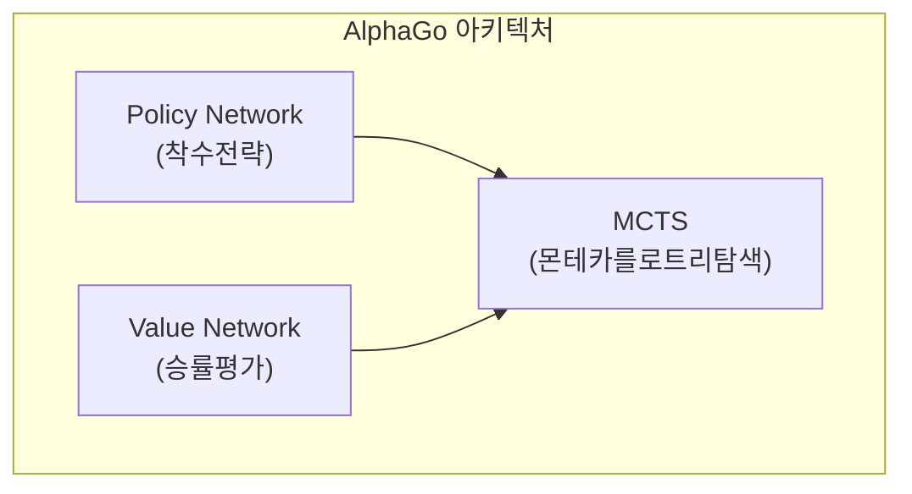
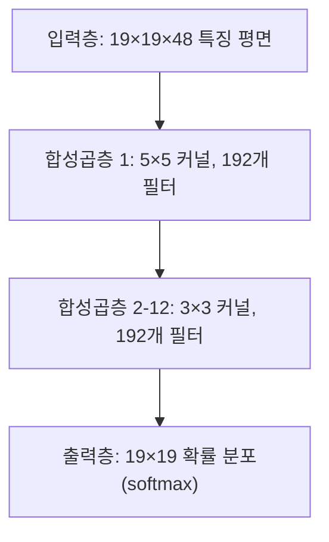
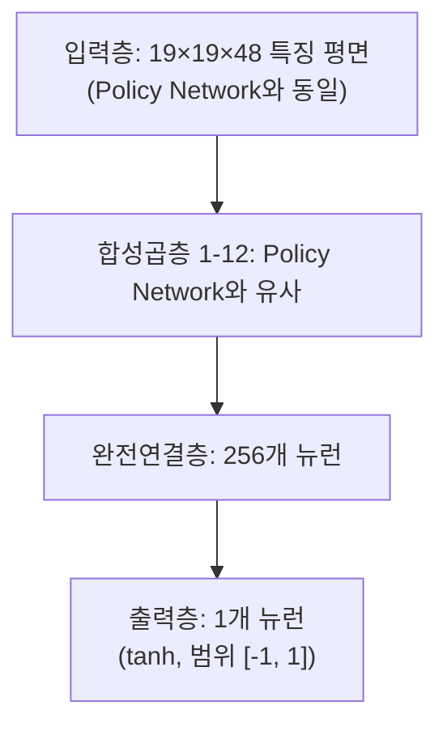
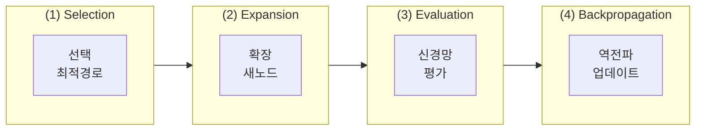
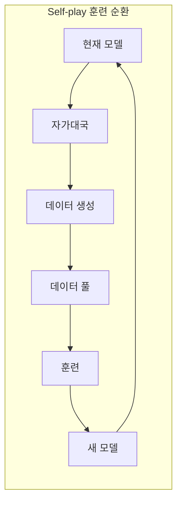
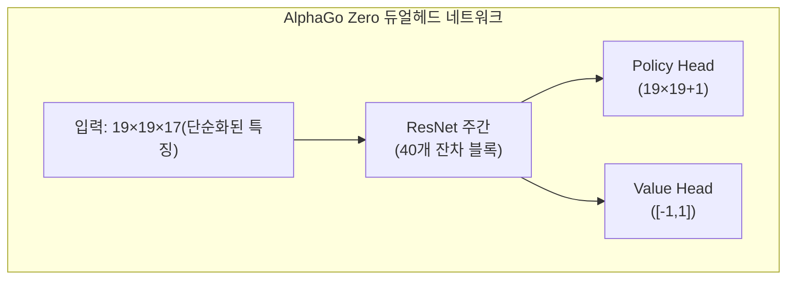

# AlphaGo 논문 해독

본문은 DeepMind가 Nature에 발표한 고전 논문 《Mastering the game of Go with deep neural networks and tree search》와 후속 AlphaGo Zero, AlphaZero 논문을 심층 해석합니다.

## AlphaGo의 역사적 의의

바둑은 오랫동안 인공지능의 '성배' 도전으로 여겨졌습니다. 체스와 달리 바둑의 탐색 공간은 극도로 방대합니다:

| 게임 | 평균 분기 인자 | 평균 게임 길이 | 상태 공간 |
|------|-------------|-------------|----------|
| 체스 | ~35 | ~80 | ~10^47 |
| 바둑 | ~250 | ~150 | ~10^170 |

전통적인 완전 탐색 방법은 바둑에서 전혀 불가능합니다. 2016년 AlphaGo가 이세돌을 꺾으며 딥러닝과 강화학습 결합의 강력한 위력을 증명했습니다.

### 이정표 사건

- **2015년 10월**: AlphaGo Fan이 유럽 챔피언 판후이(프로 2단) 5:0 격파
- **2016년 3월**: AlphaGo Lee가 세계 챔피언 이세돌(프로 9단) 4:1 격파
- **2017년 5월**: AlphaGo Master가 세계 랭킹 1위 커제 3:0 격파
- **2017년 10월**: AlphaGo Zero 발표, 순수 자가대국 훈련, 모든 이전 버전 초월

## 핵심 기술 아키텍처

AlphaGo의 핵심 혁신은 세 가지 핵심 기술의 결합입니다:



### Policy Network(정책 네트워크)

Policy Network는 각 위치의 착점 확률을 예측하여 탐색 방향을 안내합니다.

#### 네트워크 아키텍처



#### 입력 특징

AlphaGo는 48개의 특징 평면을 입력으로 사용합니다:

| 특징 | 평면 수 | 설명 |
|------|--------|------|
| 돌 색상 | 3 | 흑돌, 백돌, 빈 점 |
| 활로 수 | 8 | 1활로, 2활로, ..., 8활로 이상 |
| 단수 후 활로 수 | 8 | 잡은 후 몇 활로가 되는지 |
| 잡는 돌 수 | 8 | 해당 위치에서 몇 점 잡을 수 있는지 |
| 패 | 1 | 패 위치인지 |
| 착수 합법성 | 1 | 해당 위치에 둘 수 있는지 |
| 최근 1-8수 위치 | 8 | 이전 몇 수의 착점 위치 |
| 차례 | 1 | 현재 흑/백 차례 |

#### 훈련 방식

Policy Network 훈련은 두 단계로 나뉩니다:

**1단계: 지도학습(SL Policy Network)**
- KGS 바둑 서버의 3000만 국 기보 사용
- 목표: 인간 기사의 다음 수 예측
- 57% 예측 정확도 달성

**2단계: 강화학습(RL Policy Network)**
- SL Policy Network부터 시작
- 이전 버전의 자신과 대국
- REINFORCE 알고리즘으로 최적화

```python
# 간소화된 Policy Gradient 업데이트
# reward: +1 승리, -1 패배
loss = -log(policy[action]) * reward
```

### Value Network(가치 네트워크)

Value Network는 현재 국면의 승률을 평가하여 탐색 깊이를 줄입니다.

#### 네트워크 아키텍처



#### 훈련 방식

Value Network는 RL Policy Network 자가대국으로 생성된 3000만 국면으로 훈련:

- 각 대국에서 무작위로 하나의 국면 샘플링
- 최종 승패를 레이블로 사용
- MSE 손실 함수 사용

```python
# Value Network 훈련
value_prediction = value_network(position)
loss = (value_prediction - game_outcome) ** 2
```

**왜 각 대국에서 하나만 샘플링하는가?**

여러 샘플을 취하면 같은 대국의 인접 국면이 고도로 상관되어 과적합을 초래합니다. 무작위 샘플링이 훈련 데이터의 다양성을 보장합니다.

## 몬테카를로 트리 탐색(MCTS)

MCTS는 AlphaGo의 의사결정 핵심으로, 신경망과 결합하여 최선수를 효율적으로 탐색합니다.

### MCTS 4단계



### 선택 공식(PUCT)

AlphaGo는 PUCT(Predictor + UCT) 공식으로 탐색할 분기를 선택합니다:

```
a = argmax[Q(s,a) + u(s,a)]

u(s,a) = c_puct * P(s,a) * sqrt(N(s)) / (1 + N(s,a))
```

여기서:
- **Q(s,a)**: 행동 a의 평균 가치(exploitation)
- **P(s,a)**: Policy Network가 예측한 사전 확률
- **N(s)**: 부모 노드의 방문 횟수
- **N(s,a)**: 해당 행동의 방문 횟수
- **c_puct**: 탐색 상수, exploration과 exploitation 균형

### 탐색 과정 상세

1. **Selection**: 루트 노드에서 시작하여 PUCT 공식으로 행동 선택, 리프 노드까지
2. **Expansion**: 리프 노드에서 새 자식 노드 확장, Policy Network로 사전 확률 초기화
3. **Evaluation**: Value Network 평가와 빠른 rollout 시뮬레이션 결합하여 가치 평가
4. **Backpropagation**: 평가값을 경로를 따라 역전파하여 Q값과 N값 업데이트

### Rollout(빠른 착수)

AlphaGo(Zero가 아닌 버전)는 작은 빠른 정책 네트워크로 시뮬레이션도 수행합니다:

```
리프 노드 → 종국까지 빠른 무작위 착수 → 승패 계산
```

최종 평가값은 Value Network와 Rollout 결합:

```
V = λ * v_network + (1-λ) * v_rollout
```

AlphaGo는 λ = 0.5를 사용하여 둘에게 동일한 가중치를 부여합니다.

## Self-play 훈련 방법

Self-play는 AlphaGo의 핵심 훈련 전략으로, AI가 자가대국을 통해 지속적으로 향상됩니다.

### 훈련 순환



### Self-play가 효과적인 이유

1. **무한 데이터**: 인간 기보 수에 제한받지 않음
2. **적응적 난이도**: 상대 강도가 자신과 동시에 향상
3. **탐색 혁신**: 인간의 고정된 사고 패턴에 제한받지 않음
4. **명확한 목표**: 승률 직접 최적화, 인간 모방 아님

## AlphaGo Zero의 개선

2017년 발표된 AlphaGo Zero는 혁명적인 개선을 가져왔습니다:

### 주요 차이점

| 특성 | AlphaGo | AlphaGo Zero |
|------|---------|--------------|
| 초기 훈련 | 인간 기보 지도학습 | 완전히 처음부터 |
| 네트워크 아키텍처 | 분리된 Policy/Value | 단일 듀얼헤드 네트워크 |
| 네트워크 구조 | 일반 CNN | ResNet |
| 특징 공학 | 48개 수작업 특징 | 17개 단순 특징 |
| Rollout | 필요 | 불필요 |
| 훈련 시간 | 수개월 | 3일만에 인간 초월 |

### 아키텍처 단순화



### 단순화된 입력 특징

AlphaGo Zero는 17개의 특징 평면만 사용합니다:

- 8개 평면: 자신의 최근 8수 돌 위치
- 8개 평면: 상대의 최근 8수 돌 위치
- 1개 평면: 현재 차례(전부 0 또는 전부 1)

### 훈련 개선

1. **순수 Self-play**: 인간 데이터 사용 안 함
2. **MCTS 확률을 직접 훈련 목표로 사용**: 이진 승패 아님
3. **Rollout 없음**: Value Network에 완전 의존
4. **단일 네트워크 훈련**: Policy와 Value가 파라미터 공유, 상호 강화

## AlphaZero의 범용화

2017년 말 발표된 AlphaZero는 동일 아키텍처를 바둑, 체스, 장기에 적용했습니다:

### 핵심 특징

- **제로 도메인 지식**: 게임 규칙 외에 도메인 특정 지식 사용 안 함
- **통일 아키텍처**: 동일 알고리즘이 다른 게임에 적용
- **더 빠른 훈련**:
  - 바둑: 8시간만에 AlphaGo Lee 초월
  - 체스: 4시간만에 Stockfish 초월
  - 장기: 2시간만에 Elmo 초월

### AlphaGo Zero와의 차이

| 특성 | AlphaGo Zero | AlphaZero |
|------|-------------|-----------|
| 대상 게임 | 바둑만 | 바둑, 체스, 장기 |
| 대칭성 활용 | 바둑 8중 대칭 활용 | 대칭성 가정 안 함 |
| 하이퍼파라미터 조정 | 바둑에 최적화 | 범용 설정 |
| 훈련 방식 | 최적 모델 자가대국 | 최신 모델 자가대국 |

## 구현 핵심

유사한 시스템을 구현하고 싶다면 다음이 핵심 고려사항입니다:

### 계산 자원

AlphaGo 훈련에는 방대한 계산 자원이 필요합니다:

- **AlphaGo Lee**: 176 GPU + 48 TPU
- **AlphaGo Zero**: 4 TPU(훈련) + 1 TPU(자가대국)
- **AlphaZero**: 5000 TPU(훈련)

### 핵심 하이퍼파라미터

```python
# MCTS 관련
num_simulations = 800     # 매 수 탐색 시뮬레이션 횟수
c_puct = 1.5              # 탐색 상수
temperature = 1.0         # 행동 선택 온도 파라미터

# 훈련 관련
batch_size = 2048
learning_rate = 0.01      # 감쇠 포함
l2_regularization = 1e-4
```

### 흔한 문제

1. **훈련 불안정**: 작은 학습률 사용, batch size 증가
2. **과적합**: 훈련 데이터 다양성 확보, 정규화 사용
3. **탐색 효율**: GPU 배치 추론 최적화, MCTS 병렬화

## 추가 읽기

- [원본 논문: Mastering the game of Go with deep neural networks and tree search](https://www.nature.com/articles/nature16961)
- [AlphaGo Zero 논문: Mastering the game of Go without human knowledge](https://www.nature.com/articles/nature24270)
- [AlphaZero 논문: A general reinforcement learning algorithm that masters chess, shogi, and Go through self-play](https://www.science.org/doi/10.1126/science.aar6404)

AlphaGo의 기술을 이해했다면, 이제 [KataGo가 이 기반에서 어떤 개선을 했는지](./katago-paper.md) 살펴봅시다.

