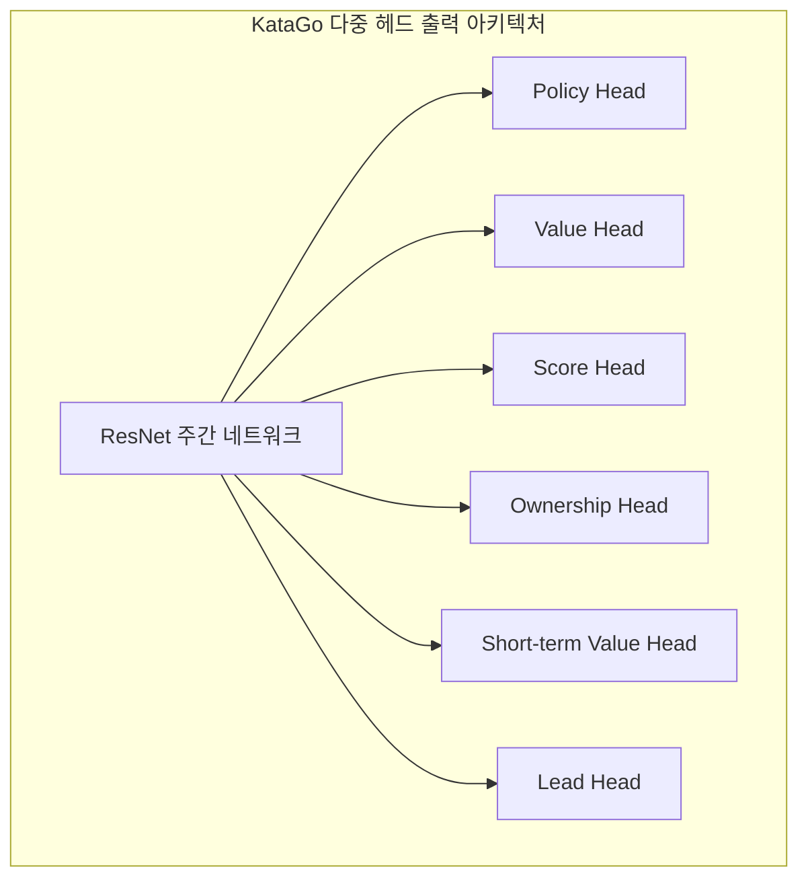
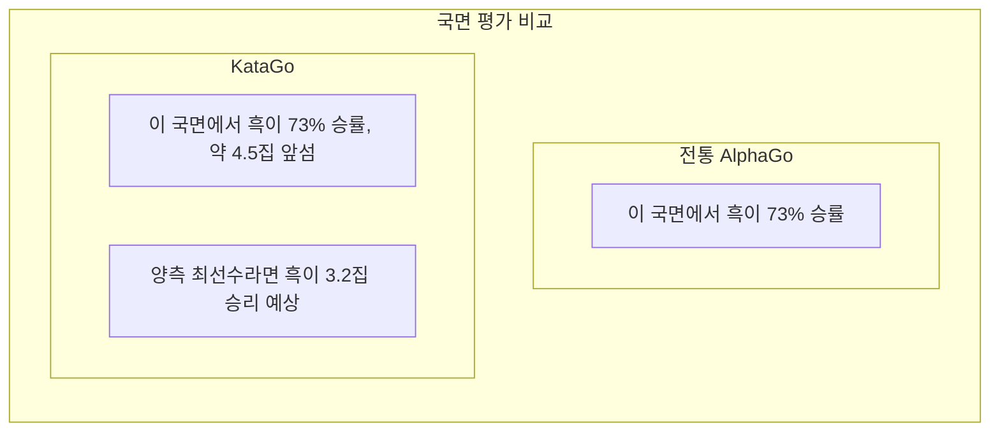

# KataGo 논문 해독

KataGo는 David Wu가 개발한 오픈소스 바둑 AI로, 논문 《Accelerating Self-Play Learning in Go》가 2019년 발표되었습니다. KataGo는 더 적은 계산 자원으로 ELF OpenGo를 초월하는 기력을 달성했으며, 현재 가장 강력한 오픈소스 바둑 AI입니다.

## KataGo의 혁신점

KataGo는 신경망 아키텍처에서 혁명적인 변화를 만든 것이 아니라 훈련 방법과 보조 작업에서 체계적 최적화를 통해 상당한 효율 향상을 실현했습니다.

### 핵심 혁신 개요

| 혁신점 | 효과 |
|--------|------|
| 보조 훈련 목표 | 학습 가속, 더 많은 감독 신호 제공 |
| 전역 풀링 구조 | 전역 정보 포착 향상 |
| 다중 규칙 지원 | 단일 모델이 다양한 경기 규칙 적응 |
| Playout Cap 무작위화 | 훈련 효율 향상 |
| 개선된 데이터 증강 | 훈련 데이터 다양성 증가 |

## 더 효율적인 훈련 방법

### 보조 훈련 목표(Auxiliary Training Targets)

전통적인 AlphaGo Zero는 두 가지 훈련 목표만 있습니다:
1. Policy: MCTS 착점 확률 분포 예측
2. Value: 게임 승패 예측

KataGo는 여러 보조 훈련 목표를 추가하여 더 풍부한 학습 신호를 제공합니다:



#### 각 출력 헤드 설명

| 출력 헤드 | 차원 | 예측 목표 |
|--------|------|----------|
| **Policy** | 19×19+1 | 각 위치의 착점 확률(Pass 포함) |
| **Value** | 3 | 승/패/무승부 확률 |
| **Score** | 연속값 | 최종 집수 차이 예측 |
| **Ownership** | 19×19 | 각 점의 최종 귀속(흑/백 영역) |
| **Short-term Value** | 1 | 단기 예상 승률 |
| **Lead** | 1 | 현재 몇 집 앞서는지 |

### 보조 목표가 효과적인 이유

1. **더 밀집된 감독 신호**: Value는 하나의 수치만 제공, Ownership은 361개 감독 포인트 제공
2. **과적합 감소**: 다중 작업 학습이 정규화 효과
3. **수렴 가속**: 보조 작업이 네트워크가 유용한 특징 표현을 더 빨리 학습하도록 도움
4. **더 나은 그래디언트 제공**: 그래디언트 소실 문제 회피

### Playout Cap 무작위화

AlphaGo Zero는 매 수마다 고정 800회 MCTS 시뮬레이션. KataGo는 무작위화 도입:

```python
# 전통 방식
num_playouts = 800  # 고정

# KataGo 방식
playout_cap = random.choice([
    100, 200, 300, 400, 500, 600, 700, 800
])
```

**이점**:
- 훈련 데이터 더 다양화
- 모델이 다른 탐색 깊이에서도 합리적 판단 학습
- 실제 대국 시 탐색량이 적어도 좋은 성능

### 데이터 증강 개선

전통 방법은 바둑의 8중 대칭(4회 회전 × 2회 대칭)을 활용하여 데이터 증강. KataGo는 더 개선:

- **무작위 대칭 변환**: 매 샘플링 시 무작위로 대칭 변환 선택
- **히스토리 상태 무작위화**: 히스토리 국면 표현 방식 무작위 선택
- **색상 무작위화**: 흑백 시점 무작위 교환

## 다중 바둑 규칙 지원

이것은 KataGo의 중요한 특색 중 하나입니다. 다른 바둑 규칙은 전략적 결정에 영향을 미칩니다:

### 주요 규칙 차이

| 규칙 체계 | 계산 방식 | 덤 | 패 규칙 | 자충 |
|---------|---------|------|---------|------|
| 중국 규칙 | 돌계산법 | 7.5집 | 단순패 | 금지 |
| 일본 규칙 | 집계산법 | 6.5집 | 슈퍼패 | 금지 |
| 한국 규칙 | 집계산법 | 6.5집 | 슈퍼패 | 금지 |
| 응씨 규칙 | 돌계산법 | 8점 | 특수패규 | 금지 |
| Tromp-Taylor | 돌계산법 | 조절가능 | 슈퍼패 | 허용 |
| AGA 규칙 | 돌/집계산 | 7.5집 | 슈퍼패 | 금지 |
| 뉴질랜드 규칙 | 돌계산법 | 7집 | 단순패 | 허용 |

### 기술 구현

KataGo는 규칙 정보를 입력 특징으로 인코딩합니다:

```python
# 규칙 관련 입력 특징 예시
rule_features = {
    'komi': 7.5,           # 덤 값
    'scoring_rule': 'area', # 돌/집계산
    'ko_rule': 'simple',    # 패 규칙
    'suicide_allowed': False,
    'tax_rule': 'none',     # '눈' 세금 여부
    # ...
}
```

네트워크가 다른 규칙에 따라 전략을 조정하는 법을 학습합니다. 예를 들어:
- 집계산법에서 실리 컨트롤 더 중시
- 자충 허용 시 특수 전술에 사용 가능
- 다른 덤은 포석 선택에 영향

## 승률과 집수 동시 예측

이것은 KataGo의 가장 실용적인 기능 중 하나로, 바둑 교육과 분석에 매우 가치 있습니다.

### Value vs Score



### 실제 응용 가치

1. **더 정밀한 국면 판단**:
   - 승률 80%지만 1집만 앞섬 → 아직 변수 있음
   - 승률 80%이고 20집 앞섬 → 대세 결정

2. **교육 보조**:
   - 학생이 한 수가 '몇 집 손해'인지 이해하게 함
   - 다른 수법의 집수 차이 비교

3. **접바둑 분석**:
   - 접바둑 조건이 적절한지 정확히 평가
   - 공격 또는 수비 판단

### Score Distribution

KataGo는 단일 집수만 예측하지 않고 완전한 집수 분포를 예측합니다:

```
집수 분포 예시:
├─ 흑 10집 이상 승: 15%
├─ 흑 5-10집 승: 25%
├─ 흑 0-5집 승: 20%
├─ 백 0-5집 승: 18%
├─ 백 5-10집 승: 15%
└─ 백 10집 이상 승: 7%

기대값: 흑 +3.2집
표준편차: ±8.5집
```

이러한 분포 정보가 국면의 복잡도와 불확실성을 더 잘 반영합니다.

## Ownership Map(영역 맵)

Ownership은 각 점이 종국 시 흑/백 어느 쪽에 귀속되는지 예측합니다:

```
                  Ownership Map
    A B C D E F G H J K L M N O P Q R S T
19  ○ ○ ○ ○ ○ ○ · · · · · · · ● ● ● ● ● ●
18  ○ ○ ○ ○ ○ ○ · · · · · · · ● ● ● ● ● ●
17  ○ ○ ○ ○ ○ · · · · · · · · · ● ● ● ● ●
16  ○ ○ ○ ╋ · · · · · ╋ · · · · · ╋ ● ● ●
...

범례: ○ = 백 영역  ● = 흑 영역  · = 미정
```

### 응용 시나리오

- **국면 분석**: 양측 세력권 한눈에 파악
- **사활 판단**: 특정 돌덩어리가 살 수 있는지 판단
- **끝내기 계산**: 각 끝내기의 가치 평가
- **교육 시연**: 영역 개념 시각화

## AlphaGo와의 차이 비교

| 측면 | AlphaGo Zero | KataGo |
|------|-------------|--------|
| **훈련 목표** | Policy + Value | 다중 보조 목표 |
| **출력 정보** | 승률 | 승률 + 집수 + 영역 |
| **규칙 지원** | 단일 규칙 | 다중 규칙 |
| **네트워크 구조** | 순수 합성곱 ResNet | 전역 풀링 추가 |
| **탐색량** | 고정 | 무작위화 |
| **훈련 효율** | 기준 | 약 50배 효율 향상 |
| **오픈소스 수준** | 논문 설명 | 완전 오픈소스 |

### 훈련 효율 비교

```
ELF OpenGo 수준 도달에 필요한 자원:

ELF OpenGo:
- 2000 GPU
- 2주 훈련

KataGo:
- 1 GPU(또는 수십 GPU 가속)
- 며칠~수주

효율 향상: 약 50-100배
```

## 네트워크 아키텍처 세부사항

### 전역 풀링(Global Pooling)

전통 CNN은 로컬 정보만 볼 수 있지만, KataGo는 전역 풀링 레이어를 추가하여 전역 특징 포착:

```python
class GlobalPoolingBlock(nn.Module):
    def forward(self, x):
        # x: [batch, channels, 19, 19]

        # 전역 평균 풀링
        global_avg = x.mean(dim=[2, 3])  # [batch, channels]

        # 전역 최대 풀링
        global_max = x.max(dim=2)[0].max(dim=1)[0]  # [batch, channels]

        # 전역 특징 결합
        global_features = torch.cat([global_avg, global_max], dim=1)

        # 전역 특징 처리
        global_features = dense_layer(global_features)  # [batch, C]

        # 공간 차원으로 브로드캐스트하여 일반 경로와 결합
        global_broadcast = broadcast_to_spatial(global_features)
        x = regular_out + global_broadcast
```

**이점**:
- 전역 형세 인식 가능(누가 앞서는지 등)
- 전역 판단이 필요한 국면을 더 잘 처리
- 집수 예측에 특히 도움

### 네트워크 규모

KataGo는 다양한 크기의 모델을 제공합니다:

| 모델 | 잔차 블록 수 | 채널 수 | 파라미터 수 | 적용 시나리오 |
|------|---------|--------|--------|----------|
| b10c128 | 10 | 128 | ~5M | CPU 실행 |
| b15c192 | 15 | 192 | ~15M | 일반 GPU |
| b20c256 | 20 | 256 | ~35M | 중급 GPU |
| b40c256 | 40 | 256 | ~70M | 고급 GPU |
| b60c320 | 60 | 320 | ~150M | 최상급 GPU |

## 실제 성능

### 기력 평가

KataGo의 각종 테스트 성능:

- 모든 Leela Zero 네트워크 초월
- 프로 9단과의 대국에서 높은 승률 유지
- CGOS(Computer Go Server)에서 1위

### 분석 기능

KataGo의 분석 모드가 제공하는 것:

```json
{
  "moveInfos": [
    {
      "move": "Q16",
      "visits": 3420,
      "winrate": 0.573,
      "scoreLead": 2.8,
      "pv": ["Q16", "D4", "Q4", "D16"],
      "ownership": [...]
    }
  ],
  "rootInfo": {
    "winrate": 0.48,
    "scoreLead": -0.5,
    "visits": 10000
  }
}
```

## 추가 읽기

- [KataGo 논문: Accelerating Self-Play Learning in Go](https://arxiv.org/abs/1902.10565)
- [KataGo GitHub 프로젝트](https://github.com/lightvector/KataGo)
- [KataGo 훈련 로그 및 분석](https://katagotraining.org/)

KataGo의 기술 특징을 이해했다면, [기타 바둑 AI의 발전](./zen.md)을 살펴보며 전체 산업을 더 전면적으로 이해해 봅시다.

