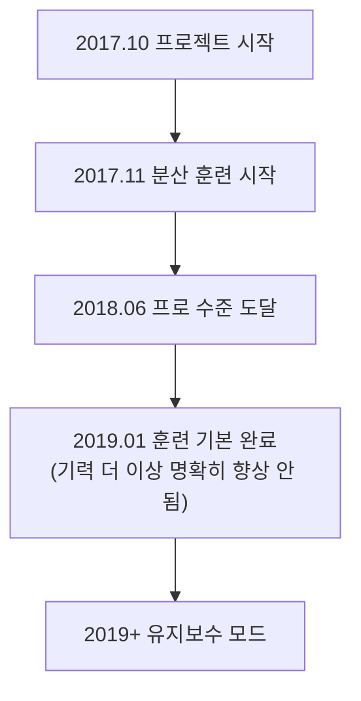

# 기타 바둑 AI 소개

AlphaGo와 KataGo 외에도 바둑 AI 분야에는 많은 중요한 프로젝트가 있습니다. 본문에서는 주요 상용 AI와 오픈소스 AI를 소개하여 전체 생태계를 이해하는 데 도움을 드립니다.

## 상용 바둑 AI

### 천정(Zen)

**개발자**: 오지마 요지(Yoji Ojima) / 일본
**최초 발표**: 2009년
**라이선스**: 상용 라이선스

천정은 AlphaGo 이전 가장 강한 바둑 프로그램 중 하나로, 전통적인 MCTS 시대에 이미 프로 수준에 도달했습니다.

#### 발전 과정

| 시간 | 버전 | 이정표 |
|------|------|--------|
| 2009 | Zen 1.0 | 최초 릴리스 |
| 2011 | Zen 4 | 아마 6단 수준 도달 |
| 2012 | Zen 5 | 4점 접바둑으로 다케미야 마사키 9단 격파 |
| 2016 | Zen 7 | 딥러닝 기술 채용 |
| 2017+ | Deep Zen Go | AlphaGo 아키텍처 결합 |

#### 기술 특징

- **하이브리드 아키텍처**: 전통적 휴리스틱과 딥러닝 결합
- **상용 최적화**: 소비자급 하드웨어에 최적화
- **높은 안정성**: 다년간 상용 사용 검증
- **다중 플랫폼 지원**: Windows, macOS 모두 실행 가능

#### 제품 형태

- **천정의 바둑(天頂の囲碁)**: 데스크톱 소프트웨어, 약 10,000엔
- **온라인 대국**: KGS에서 Zen19 계정으로 활동

---

### 절예(Fine Art)

**개발자**: 텐센트 AI Lab / 중국
**최초 발표**: 2016년
**라이선스**: 비공개

절예는 텐센트가 개발한 바둑 AI로, 중국 바둑계에 중요한 영향을 미쳤습니다.

#### 발전 과정

| 시간 | 사건 |
|------|------|
| 2016년 11월 | 최초 등장, 야후(野狐) 바둑망에서 대국 |
| 2017년 3월 | UEC배 컴퓨터 바둑 대회 우승 |
| 2017년 | 중국 국가대표팀 훈련 도구로 채택 |
| 2018년 | 세계 인공지능 바둑 대회 우승 |
| 현재까지 | 국가대표팀 훈련 보조로 지속 |

#### 기술 특징

- **대규모 훈련**: 텐센트 클라우드 컴퓨팅 자원 사용
- **인간 최정상 기사와 협력**: 대량의 전문 지도 획득
- **풍부한 실전 경험**: 야후 바둑에서 대량의 대국 축적
- **교육 기능 통합**: 복기 분석 기능 제공

#### 영향력

절예가 중국 프로 바둑에 미친 영향은 깊습니다:

- 국가대표팀 표준 훈련 도구가 됨
- 프로 기사의 대회 준비 방식 변화
- AI 보조 훈련 보급 추진

---

### 성진(Golaxy)

**개발자**: 중국 선커기술(深客科技) / 칭화대 팀
**최초 발표**: 2018년
**라이선스**: 상용 라이선스

성진은 '가장 인간 같은 AI'를 설계 목표로, 기풍이 인간 기사에 더 가깝습니다.

#### 기술 특징

- **인간화된 기풍**: 의도적으로 더 인간 같은 수법으로 훈련
- **난이도 조절 가능**: 다른 단위의 상대 시뮬레이션 가능
- **교육 지향**: 교육 응용을 고려한 설계
- **접바둑 전문화**: 접바둑에 특별 최적화

#### 제품 응용

- **이커 바둑**: 이커 앱에 통합
- **교육 플랫폼**: 온라인 바둑 교육에 사용
- **단위 테스트**: 표준화된 단위 평가 제공

---

### 기타 상용 AI

| 이름 | 개발자 | 특징 |
|------|--------|------|
| **석자선풍** | 린재범(대만) | UEC배 우승 |
| **CGI** | 교통대학(대만) | 학술 연구 지향 |
| **돌바람** | 한국 NHN | 한국 바둑 플랫폼에 통합 |
| **AQ** | 일본 AQ 팀 | 오픈소스 후 상용 전환 |

## 오픈소스 바둑 AI

### Leela Zero

**개발자**: Gian-Carlo Pascutto / 벨기에
**최초 발표**: 2017년
**라이선스**: GPL-3.0
**GitHub**: https://github.com/leela-zero/leela-zero

Leela Zero는 AlphaGo Zero를 최초로 성공적으로 복제한 오픈소스 프로젝트로, 커뮤니티 분산 훈련으로 진행되었습니다.

#### 발전 과정



#### 기술 특징

- **충실한 재현**: AlphaGo Zero 논문을 엄격히 따라 구현
- **분산 훈련**: 전 세계 자원봉사자가 GPU 연산 기여
- **완전 투명**: 모든 훈련 데이터와 모델 공개
- **표준 GTP**: 모든 GTP 바둑 소프트웨어와 호환

#### 훈련 통계

| 항목 | 수치 |
|------|------|
| 총 자가대국 수 | 약 1800만 국 |
| 훈련 반복 횟수 | 약 270회 |
| 기여 참가자 | 수천 명 |
| 훈련 기간 | 약 1.5년 |

#### 사용 방법

```bash
# 설치
brew install leela-zero  # macOS

# 실행
leelaz --gtp --weights best-network.gz

# GTP 명령
genmove black
play white D4
```

#### 현황

Leela Zero는 더 이상 활발히 훈련하지 않지만:
- 코드는 여전히 AlphaGo Zero 학습의 훌륭한 자료
- 훈련된 모델은 여전히 사용 가능
- 커뮤니티가 기본 기능 유지 중

---

### ELF OpenGo

**개발자**: Facebook AI Research(FAIR)
**최초 발표**: 2018년
**라이선스**: BSD
**GitHub**: https://github.com/pytorch/ELF

ELF OpenGo는 Facebook이 개발한 바둑 AI로, 대규모 분산 훈련 능력을 보여줍니다.

#### 기술 특징

- **ELF 프레임워크**: Facebook의 ELF(Extensive, Lightweight, and Flexible) 게임 연구 플랫폼 기반
- **대규모 훈련**: 2000 GPU로 훈련
- **PyTorch 구현**: Facebook 자체 딥러닝 프레임워크 사용
- **연구 지향**: 주요 목적은 연구, 실용 아님

#### 성능

- KGS에서 최상급 수준 도달
- 프로 9단과 안정적 승률
- 최고 학회에 논문 발표

#### 현황

- 프로젝트 더 이상 활발히 유지 안 됨
- 코드와 모델 다운로드 가능
- 주요 가치는 학술 참고

---

### SAI(Sensible Artificial Intelligence)

**개발자**: SAI 팀 / 유럽
**최초 발표**: 2019년
**라이선스**: MIT
**GitHub**: https://github.com/sai-dev/sai

SAI는 Leela Zero 기반 개선 버전으로, 실험적 기능에 집중합니다.

#### 기술 특징

- **개선된 훈련 방법**: 다양한 훈련 최적화 실험
- **더 많은 규칙 지원**: Leela Zero보다 더 많은 바둑 규칙 지원
- **실험적 기능**: 새로운 네트워크 아키텍처와 훈련 기법 테스트

#### 현황

- 소규모 커뮤니티가 여전히 유지 중
- 주로 실험과 학습용

---

### PhoenixGo

**개발자**: 텐센트 위챗 팀
**최초 발표**: 2018년
**라이선스**: BSD-3
**GitHub**: https://github.com/Tencent/PhoenixGo

PhoenixGo는 텐센트가 오픈소스한 바둑 AI로, 2018년 세계 인공지능 바둑 대회 우승.

#### 기술 특징

- **상용급 품질**: 텐센트 내부 프로젝트에서 유래
- **TensorFlow 구현**: 주류 프레임워크 사용
- **다중 플랫폼 지원**: Linux, Windows, macOS
- **분산 지원**: 다중 머신 다중 카드 환경에서 실행 가능

#### 사용 방법

```bash
# 컴파일
bazel build //src:mcts_main

# 실행
./mcts_main --gtp --config_path=config.conf
```

---

### MiniGo

**개발자**: Google Brain
**최초 발표**: 2018년
**라이선스**: Apache-2.0
**GitHub**: https://github.com/tensorflow/minigo

MiniGo는 Google이 오픈소스한 교육 목적의 바둑 AI로, 더 많은 사람이 AlphaGo 원리를 이해하도록 합니다.

#### 기술 특징

- **교육 지향**: 코드가 명확하고 읽기 쉬움
- **TensorFlow 구현**: Google 공식 예제
- **완전한 문서**: 상세한 기술 설명
- **Colab 지원**: Google Colab에서 직접 실행 가능

#### 적용 시나리오

- AlphaGo Zero 아키텍처 학습
- 게임에서 강화학습 응용 이해
- 자체 프로젝트의 출발점

## 각 AI 특징 비교

### 기력 비교(대략적 추정)

| AI | 기력 수준 | 비고 |
|----|---------|------|
| KataGo | 최상급 초인간 | 지속 훈련 중 |
| 절예 | 최상급 초인간 | 비공개 |
| Leela Zero | 초인간 | 훈련 중단 |
| ELF OpenGo | 초인간 | 훈련 중단 |
| PhoenixGo | 준초인간 | 훈련 중단 |
| 천정 | 프로 수준 | 상용 제품 |
| 성진 | 프로 수준 | 난이도 조절 가능 |

### 기능 비교

| 기능 | KataGo | Leela Zero | PhoenixGo | 천정 |
|------|--------|------------|-----------|------|
| 오픈소스 | O | O | O | X |
| 집수 예측 | O | X | X | △ |
| 다중 규칙 지원 | O | X | X | X |
| Analysis API | O | X | X | X |
| CPU 모드 | O | O | O | O |
| 지속 업데이트 | O | X | X | △ |

### 적용 시나리오 권장

| 요구 | 권장 선택 | 이유 |
|------|---------|------|
| 일반 대국/분석 | KataGo | 가장 강하고 기능 가장 완전 |
| AlphaGo 학습 | Leela Zero / MiniGo | 코드 명확 |
| 상용 응용 | 천정 / 자체 훈련 KataGo | 라이선스 명확 |
| 교육 보조 | KataGo / 성진 | 풍부한 분석 기능 |
| 연구 실험 | KataGo / SAI | 훈련 수정 가능 |

## 미래 발전 추세

### 기술 추세

1. **더 효율적인 훈련 방법**
   - KataGo가 보여준 효율 향상처럼
   - 더 적은 자원으로 더 높은 기력

2. **더 나은 해석 가능성**
   - AI가 왜 이 수를 두는지 설명
   - 인간이 AI 사고를 이해하도록 도움

3. **인간 스타일과 결합**
   - 특정 기사 스타일 같은 AI 훈련
   - 교육과 연구용

4. **게임 간 범용성**
   - AlphaZero가 보여준 것처럼
   - 단일 프레임워크로 다양한 게임 적용

### 응용 추세

1. **보급화**
   - 더 많은 바둑 애호가가 AI 분석 사용
   - 모바일 등 기기에서도 실행

2. **전문화**
   - 프로 기사가 AI 훈련에 깊이 의존
   - AI 보조 표준화

3. **상용화**
   - 더 많은 AI 보조 바둑 제품
   - 교육, 분석, 연습 상대 등 서비스

## 총정리

바둑 AI 생태계는 풍부하고 다양합니다:

- **가장 강한 기력과 완전한 기능 원함**: KataGo 선택
- **AI 원리 학습 원함**: Leela Zero 또는 MiniGo 코드 연구
- **상용 응용 요구**: 천정 평가 또는 자체 모델 훈련
- **특수 요구**: 구체적 상황에 따라 선택 또는 조합 사용

이제 실전으로 들어가 [KataGo 설치 및 사용법](/docs/for-engineers/katago-source/)을 배워봅시다!

