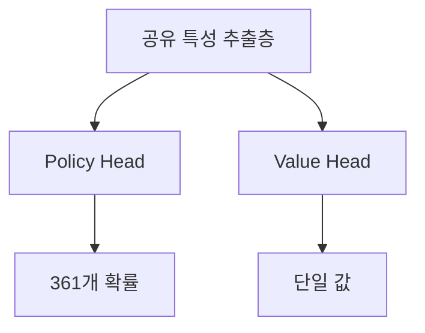

# Value Network 상세 해설

Policy Network가 AlphaGo에게 '다음 수를 어디에 두어야 하는지' 알려준다면, Value Network는 더 근본적인 질문에 답합니다:

> **"이 대국, 내가 이길까?"**

---

## Value Network란 무엇인가?

### 핵심 기능

Value Network는 심층 컨볼루션 신경망으로, 그 임무는 다음과 같습니다:

> **현재 바둑판 상태가 주어지면, 최종 승률을 예측한다**

수학적으로 표현하면:

```
v = f_θ(s)
```

여기서:
- `s`: 현재 바둑판 상태
- `f_θ`: Value Network (θ는 네트워크 파라미터)
- `v`: -1에서 +1 사이의 값

### 출력의 의미

| 출력 값 | 의미 |
|--------|------|
| +1 | 현재 플레이어 필승 |
| +0.5 | 현재 플레이어 약 75% 승률 |
| 0 | 양측 승률 동등 |
| -0.5 | 현재 플레이어 약 25% 승률 |
| -1 | 현재 플레이어 필패 |

### 왜 단일 값이 필요한가?

#### 다른 선택 비교

바둑을 둘 때, 우리는 종종 여러 선택지 중에서 결정해야 합니다. Value Network는 이 비교를 간단하게 만듭니다:

```
선택 A의 국면 가치: 0.3
선택 B의 국면 가치: 0.5
선택 C의 국면 가치: 0.2

→ B 선택 (가장 높은 가치)
```

단일 값이 없다면, '상대의 돌 한 덩이 잡기'와 '큰 집 둘러싸기' 중 어느 것이 더 좋은지 어떻게 비교할까요?

#### 대량 시뮬레이션 대체

전통적인 몬테카를로 트리 탐색에서, 국면을 평가하려면 **랜덤 시뮬레이션(rollout)**을 수행해야 합니다:

1. 현재 국면에서 시작
2. 양측이 게임 종료까지 무작위로 착수
3. 승패 기록
4. 수천 번 반복하여 승률 계산

이것은 매우 느립니다. Value Network는 **한 번의 순전파**로 평가를 제공하여, 몇 자릿수 더 빠릅니다.

| 방법 | 평가 시간 | 정밀도 |
|------|---------|------|
| 1000회 랜덤 시뮬레이션 | ~2000 밀리초 | 낮음 |
| 15000회 랜덤 시뮬레이션 | ~30000 밀리초 | 중간 |
| Value Network | ~3 밀리초 | 높음 (15000회 시뮬레이션과 동등) |

---

## 네트워크 아키텍처

### Policy Network와의 유사성

Value Network의 아키텍처는 Policy Network와 매우 유사하며, 둘 다 심층 컨볼루션 신경망입니다:

```
입력층 → 컨볼루션층 ×12 → 완전연결층 → 출력
   ↓         ↓           ↓         ↓
19×19×48   19×19×192    256차원     단일 값
```

### 입력층

Policy Network와 동일하게, 입력은 **19×19×49** 특성 텐서입니다:

- **19×19**: 바둑판 크기
- **49**: 48개 특성 평면 + 1개 현재 차례 표시 평면

추가된 1개 평면은 중요합니다: Value Network는 누구의 차례인지 알아야 합니다, 같은 국면이라도 흑과 백의 가치는 반대이기 때문입니다.

### 컨볼루션층

Policy Network와 동일:
- **12개 컨볼루션층**
- **192개 필터**
- **3×3 커널** (첫 번째 층은 5×5)
- **ReLU 활성화 함수**

### 출력층의 차이

이것이 Value Network와 Policy Network의 핵심 차이입니다:

#### Policy Network 출력
```
19×19×192 → 1×1 컨볼루션 → 19×19×1 → 평탄화 → 361차원 → Softmax → 확률 분포
```

#### Value Network 출력
```
19×19×192 → 1×1 컨볼루션 → 19×19×1 → 평탄화 → 361차원 → 완전연결256 → ReLU → 완전연결1 → Tanh → 단일 값
```

### Tanh 활성화 함수

Value Network의 마지막 층은 **Tanh**(쌍곡탄젠트) 함수를 사용합니다:

```
Tanh(x) = (e^x - e^(-x)) / (e^x + e^(-x))
```

Tanh의 출력 범위는 **(-1, +1)**로, 승패에 정확히 대응합니다.

#### 왜 Sigmoid 대신 Tanh를 사용하는가?

Sigmoid의 출력 범위는 (0, 1)로, 승률을 표현할 수도 있습니다. 하지만 Tanh에는 몇 가지 장점이 있습니다:

1. **대칭성**: 0을 중심으로, 출력이 양수 또는 음수 가능
2. **기울기가 더 좋음**: 0 근처에서 기울기가 1에 가까움
3. **의미가 명확**: 양수는 이김, 음수는 짐, 0은 무승부

### 완전한 아키텍처 다이어그램

```
입력: 19×19×49
        ↓
    Conv 5×5, 192 filters
        ↓
    ReLU
        ↓
    Conv 3×3, 192 filters (×11)
        ↓
    ReLU
        ↓
    Conv 1×1, 1 filter
        ↓
    평탄화 (361차원)
        ↓
    완전연결 (256차원)
        ↓
    ReLU
        ↓
    완전연결 (1차원)
        ↓
    Tanh
        ↓
출력: [-1, +1]
```

### 파라미터 수

| 층 | 계산 | 파라미터 수 |
|---|------|---------|
| 컨볼루션층 | Policy Network와 동일 | ~3.9M |
| 완전연결층 1 | 361×256 + 256 | 92,672 |
| 완전연결층 2 | 256×1 + 1 | 257 |
| **총계** | | **~4.0M** |

약 400만 개의 파라미터로, Policy Network보다 약간 많습니다.

---

## 학습의 과제

### 과적합 문제

Value Network의 학습은 Policy Network보다 훨씬 어렵습니다. 주요 문제는 **과적합**입니다.

#### 과적합이란 무엇인가?

과적합은 모델이 학습 데이터를 '기억'하여 일반화를 학습하지 못하는 것입니다. 다음과 같이 나타납니다:
- 학습 세트에서 성능이 매우 좋음
- 테스트 세트에서 성능이 매우 나쁨

#### 왜 Value Network가 과적합에 취약한가?

한 대국의 데이터를 고려해 봅시다:

```
국면 1 → 국면 2 → 국면 3 → ... → 국면 200 → 결과: 흑 승리
```

이 데이터로 직접 학습하면:
- 이 200개 국면은 강한 상관관계가 있음
- 같은 대국에서 왔고, 같은 결과를 가짐
- 모델이 국면을 이해하기보다 이 대국을 '인식'하는 법을 배울 수 있음

DeepMind는 발견했습니다: 같은 인간 기보로 Policy와 Value Network를 학습하면, Value Network가 심각하게 과적합됩니다.

### 해결책: 셀프 플레이 데이터

DeepMind의 해결책은 **셀프 플레이**로 새로운 학습 데이터를 생성하는 것입니다:

```
1. 학습된 RL Policy Network로 셀프 플레이
2. 각 대국에서 하나의 국면만 취함 (상관관계 방지)
3. 이 국면의 레이블은 해당 대국의 최종 결과
4. 3천만 개의 이러한 샘플 생성
```

#### 왜 이것이 과적합을 해결하는가?

1. **데이터 양이 많음**: 3천만 개의 독립적인 국면
2. **상관관계 없음**: 각 대국에서 하나의 국면만 취함
3. **분포가 다름**: 셀프 플레이의 국면 분포는 인간 기보와 다름

### 학습 데이터 생성

```python
# 의사 코드
training_data = []

for game_id in range(30_000_000):
    # 한 대국 셀프 플레이
    states, result = self_play(rl_policy_network)

    # 무작위로 하나의 국면 선택
    random_index = random.randint(0, len(states) - 1)
    state = states[random_index]

    # 국면과 결과 기록
    training_data.append((state, result))
```

---

## 학습 목표와 방법

### 평균 제곱 오차 손실

Value Network는 **평균 제곱 오차(MSE)**를 손실 함수로 사용합니다:

```
L(θ) = (1/n) × Σ (v_θ(s) - z)²
```

여기서:
- `v_θ(s)`: 모델이 예측한 가치
- `z`: 실제 결과 (+1 또는 -1)

#### 왜 교차 엔트로피 대신 MSE를 사용하는가?

- **교차 엔트로피**는 분류 문제에 적합 (이산 레이블)
- **MSE**는 회귀 문제에 적합 (연속 값)

결과가 +1 또는 -1만 있지만, 모델이 예측하는 것은 연속 값(-1에서 +1 사이의 모든 수)입니다. MSE는 모델이 +1 또는 -1에 가까운 값을 예측하도록 학습시킵니다.

### 학습 과정

```python
# 의사 코드
for epoch in range(num_epochs):
    for batch in dataloader:
        states, outcomes = batch

        # 순전파
        values = network(states)  # (batch, 1)

        # 손실 계산 (MSE)
        loss = mse_loss(values, outcomes)

        # 역전파
        loss.backward()
        optimizer.step()
```

학습 세부사항:
- **옵티마이저**: SGD with momentum
- **학습률**: 0.003
- **배치 크기**: 32
- **학습 시간**: 약 1주 (50 GPUs)

---

## 정확도 분석

### 랜덤 시뮬레이션과의 비교

DeepMind는 논문에서 상세한 비교를 수행했습니다:

| 평가 방법 | 예측 오차 |
|---------|---------|
| 1000회 랜덤 시뮬레이션 | 높음 |
| 15000회 랜덤 시뮬레이션 | 중간 |
| Value Network | 15000회 시뮬레이션과 동등 |

이것은 한 번의 Value Network 평가 ≈ 15000회 랜덤 시뮬레이션이지만, 약 1000배 더 빠르다는 것을 의미합니다.

### 각 단계의 정확도

Value Network의 정확도는 게임 진행에 따라 달라집니다:

| 단계 | 남은 수 | 예측 난이도 | 정확도 |
|------|---------|---------|--------|
| 초반 | ~300 | 매우 어려움 | 낮음 |
| 중반 | ~150 | 어려움 | 중간 |
| 끝내기 | ~50 | 비교적 쉬움 | 높음 |
| 종반 | ~10 | 쉬움 | 매우 높음 |

이것은 직관적으로 합리적입니다: 게임 종료에 가까울수록, 결과가 더 확실합니다.

### 출력 분포

잘 학습된 Value Network의 출력 분포:

```
        빈도
          |
          |    *
          |   * *
          |  *   *
          | *     *
          |*       *
          +----+----+---- 출력 값
         -1    0   +1

대부분의 출력이 -1과 +1 근처에 집중됨
(대부분의 국면이 명확한 승패 경향을 가지기 때문)
```

### 불확실한 국면

Value Network 출력이 0에 가까울 때, 국면이 매우 복잡하고 승패를 예측하기 어렵다는 것을 나타냅니다. 이러한 국면은 보통:
- 대형 전투 중
- 양측이 막상막하
- 여러 가능한 변화가 존재

MCTS에서 이러한 노드는 더 많은 탐색 자원을 얻습니다 (불확실성이 높기 때문).

---

## MCTS에서의 역할

### 리프 노드 평가

Value Network는 MCTS의 **Evaluation** 단계에서 핵심 역할을 합니다:

```
MCTS 탐색 트리:

        루트 노드 (현재 국면)
           /    \
         A        B
        /  \    /  \
       A1  A2  B1  B2 ← 리프 노드
        ↓   ↓   ↓   ↓
       평가  평가  평가  평가
```

MCTS가 리프 노드에 도달하면, 이 국면의 가치를 평가해야 합니다. 두 가지 방법이 있습니다:

1. **랜덤 시뮬레이션(Rollout)**: 리프 노드에서 게임 종료까지 무작위로 착수
2. **Value Network 평가**: 신경망으로 직접 예측

AlphaGo는 둘을 결합합니다:

```
V(leaf) = (1-λ) × V_network(leaf) + λ × V_rollout(leaf)
```

여기서 λ = 0.5, 즉 각각 절반의 가중치를 차지합니다.

#### 왜 결합하는가?

- **Value Network**는 더 정확하지만, 체계적 편향이 있을 수 있음
- **랜덤 시뮬레이션**은 덜 정확하지만, 독립적인 추정을 제공
- 둘을 결합하면 상호 보완 가능

### AlphaGo Zero의 단순화

이후의 AlphaGo Zero는 랜덤 시뮬레이션을 완전히 폐기했습니다:

```
V(leaf) = V_network(leaf)
```

이것은 시스템을 크게 단순화하면서, 기력이 더 강해졌습니다. 이것은 Value Network가 충분히 신뢰할 수 있어, 랜덤 시뮬레이션의 '보험'이 필요 없다는 것을 증명합니다.

### 역전파 업데이트

리프 노드 평가 후, 이 값은 경로를 따라 역전파됩니다:

```
v3 = V(leaf) = 0.6
      ↑
A2의 Q 값 업데이트
      ↑
A의 Q 값 업데이트
      ↑
루트 노드의 통계 업데이트
```

각 노드가 유지하는 Q 값은 그것을 통과한 모든 리프 노드 평가의 평균입니다:

```
Q(s, a) = (1/N(s,a)) × Σ V(leaf)
```

---

## 시각화 분석

### 가치 곡면

단순화된 3×3 바둑판을 상상해 봅시다. Value Network가 배운 것은 '가치 곡면'입니다:

**가치 매트릭스 예시 (흑돌 위치 vs 백돌 위치)**

| 흑\백 | 1 | 2 | 3 |
|:---:|:---:|:---:|:---:|
| **1** | +0.3 | -0.1 | +0.2 |
| **2** | -0.2 | +0.5 | -0.3 |
| **3** | +0.1 | -0.2 | +0.4 |

이 곡면은 각 위치 조합의 가치를 알려줍니다. 양수는 흑에게 유리하고, 음수는 백에게 유리합니다.

### 학습 과정에서의 변화

학습이 진행됨에 따라, Value Network의 예측은 점점 더 정확해집니다:

**훈련 진행에 따른 예측 오차**

| 훈련 스텝 | 예측 오차 |
|:---:|:---:|
| 0 | 1.0 |
| 100K | 0.6 |
| 500K | 0.15 |
| 1M | 0.1 |

오차는 빠르게 감소한 후 안정화됩니다.

### 어려운 국면 식별

Value Network는 어려운 국면을 식별하는 데 도움이 됩니다:

| 출력 | 의미 | 대응 전략 |
|------|------|---------|
| +1에 가까움 | 크게 유리 | 안정적 착수 |
| -1에 가까움 | 크게 불리 | 역전 기회 모색 |
| 0에 가까움 | 복잡한 국면 | 심층 계산 필요 |

AlphaGo는 0에 가까운 국면에 더 많은 사고 시간을 투자합니다.

---

## 구현 포인트

### PyTorch 구현

```python
import torch
import torch.nn as nn
import torch.nn.functional as F

class ValueNetwork(nn.Module):
    def __init__(self, input_channels=49, num_filters=192, num_layers=12):
        super().__init__()

        # 첫 번째 컨볼루션층 (5×5)
        self.conv1 = nn.Conv2d(input_channels, num_filters,
                               kernel_size=5, padding=2)

        # 중간 컨볼루션층 (3×3) ×11
        self.conv_layers = nn.ModuleList([
            nn.Conv2d(num_filters, num_filters,
                     kernel_size=3, padding=1)
            for _ in range(num_layers - 1)
        ])

        # 출력 컨볼루션층
        self.conv_out = nn.Conv2d(num_filters, 1, kernel_size=1)

        # 완전연결층
        self.fc1 = nn.Linear(361, 256)
        self.fc2 = nn.Linear(256, 1)

    def forward(self, x):
        # x: (batch, 49, 19, 19)

        # 컨볼루션층
        x = F.relu(self.conv1(x))
        for conv in self.conv_layers:
            x = F.relu(conv(x))
        x = self.conv_out(x)

        # 평탄화
        x = x.view(x.size(0), -1)  # (batch, 361)

        # 완전연결층
        x = F.relu(self.fc1(x))
        x = torch.tanh(self.fc2(x))

        return x.squeeze(-1)  # (batch,)
```

### 학습 루프

```python
def train_value_network(model, optimizer, states, outcomes):
    """
    states: (batch, 49, 19, 19) - 바둑판 특성
    outcomes: (batch,) - 게임 결과 (+1 또는 -1)
    """
    # 순전파
    values = model(states)  # (batch,)

    # MSE 손실
    loss = F.mse_loss(values, outcomes)

    # 역전파
    optimizer.zero_grad()
    loss.backward()
    optimizer.step()

    # 정확도 계산 (승패 예측 정확도)
    predictions = (values > 0).float() * 2 - 1  # +1/-1로 변환
    accuracy = (predictions == outcomes).float().mean()

    return loss.item(), accuracy.item()
```

### 과적합 방지 기법

```python
# 1. 데이터 증강 (8중 대칭성)
def augment(state, outcome):
    augmented = []
    for rotation in [0, 90, 180, 270]:
        s = rotate(state, rotation)
        augmented.append((s, outcome))
        augmented.append((flip(s), outcome))
    return augmented

# 2. Dropout
class ValueNetworkWithDropout(ValueNetwork):
    def __init__(self, *args, dropout_rate=0.5, **kwargs):
        super().__init__(*args, **kwargs)
        self.dropout = nn.Dropout(dropout_rate)

    def forward(self, x):
        # ... 컨볼루션층 ...
        x = self.dropout(x)  # 완전연결층 전에 dropout
        # ... 완전연결층 ...

# 3. 조기 종료 (Early Stopping)
best_val_loss = float('inf')
patience = 10
counter = 0

for epoch in range(max_epochs):
    train_loss = train_one_epoch()
    val_loss = evaluate()

    if val_loss < best_val_loss:
        best_val_loss = val_loss
        save_model()
        counter = 0
    else:
        counter += 1
        if counter >= patience:
            print("Early stopping!")
            break
```

---

## Policy Network와의 협력

### 상호 보완 관계

Policy Network와 Value Network는 AlphaGo에서 상호 보완합니다:

| 네트워크 | 답하는 질문 | 출력 | MCTS 역할 |
|------|-----------|------|----------|
| Policy | 다음 수를 어디에? | 확률 분포 | 탐색 방향 안내 |
| Value | 이 대국을 이길까? | 단일 값 | 리프 노드 평가 |

### 통합된 이중 헤드 네트워크

AlphaGo Zero에서는 이 두 네트워크가 하나의 **이중 헤드 네트워크**로 통합되었습니다:



이 설계의 장점:
- **파라미터 공유**: 계산량 감소
- **특성 공유**: Policy와 Value가 같은 특성 사용
- **학습이 더 안정적**: 두 목표가 서로를 정규화

자세한 내용은 [이중 헤드 네트워크와 잔차 네트워크](../dual-head-resnet)를 참조하세요.

---

## 애니메이션 대응

이 글에서 다루는 핵심 개념과 애니메이션 번호:

| 번호 | 개념 | 물리/수학 대응 |
|------|------|--------------|
| 🎬 E2 | Value Network | 퍼텐셜 에너지면 |
| 🎬 D4 | 가치 함수 | 기대 보상 |
| 🎬 C6 | 리프 노드 평가 | 함수 근사 |
| 🎬 H3 | 시간차 학습 | 부트스트래핑 |

---

## 추가 읽기

- **이전 편**: [Policy Network 상세 해설](../policy-network) — 정책 네트워크가 착수를 선택하는 방법
- **다음 편**: [입력 특성 설계](../input-features) — 48개 특성 평면 상세
- **심화 주제**: [MCTS와 신경망의 결합](../mcts-neural-combo) — 완전한 탐색 과정

---

## 핵심 포인트

1. **Value Network는 승률을 예측**: -1에서 +1 사이의 단일 값 출력
2. **Tanh 출력**: 출력이 올바른 범위 내에 있도록 보장
3. **MSE 손실**: 예측 값을 실제 결과에 근사
4. **과적합 과제**: 셀프 플레이 데이터로 방지 필요
5. **랜덤 시뮬레이션 대체**: 한 번 평가 ≈ 15000회 시뮬레이션

Value Network는 AlphaGo의 '판단력'입니다 — AI가 모든 가능성을 다 탐색하지 않고도 어떤 국면의 좋고 나쁨을 평가할 수 있게 해줍니다.

---

## 참고 자료

1. Silver, D., et al. (2016). "Mastering the game of Go with deep neural networks and tree search." *Nature*, 529, 484-489.
2. Silver, D., et al. (2017). "Mastering the game of Go without human knowledge." *Nature*, 551, 354-359.
3. Sutton, R. S., & Barto, A. G. (2018). *Reinforcement Learning: An Introduction*. MIT Press.
4. Tesauro, G. (1995). "Temporal difference learning and TD-Gammon." *Communications of the ACM*, 38(3), 58-68.
