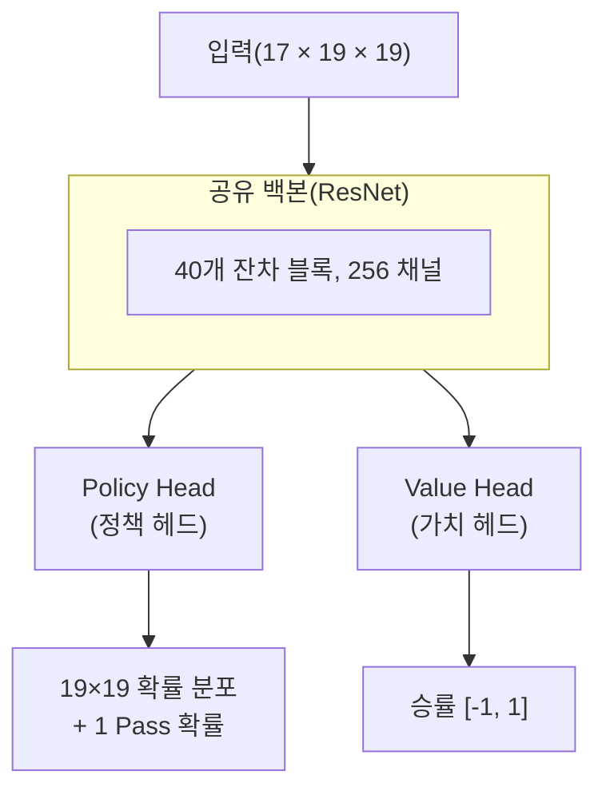
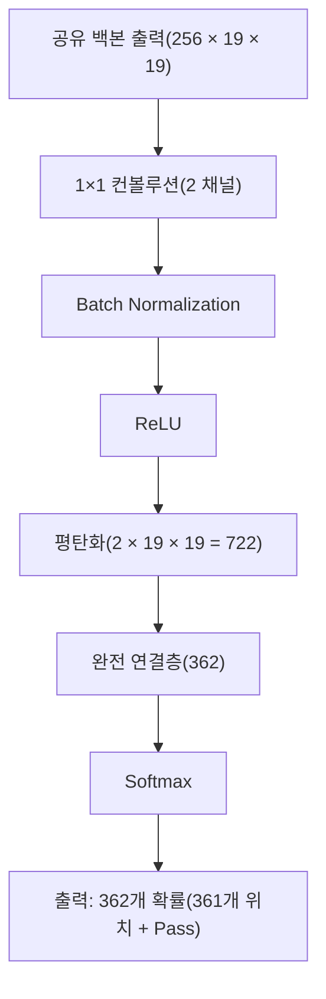
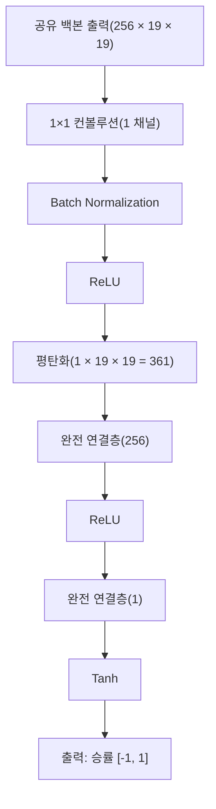
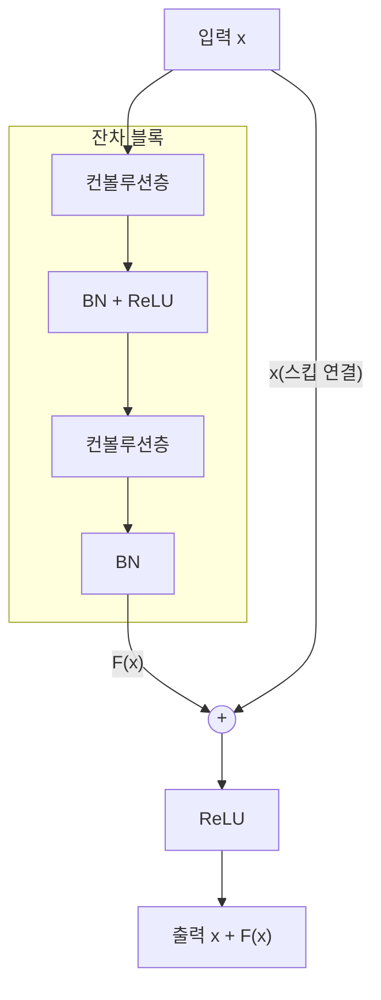
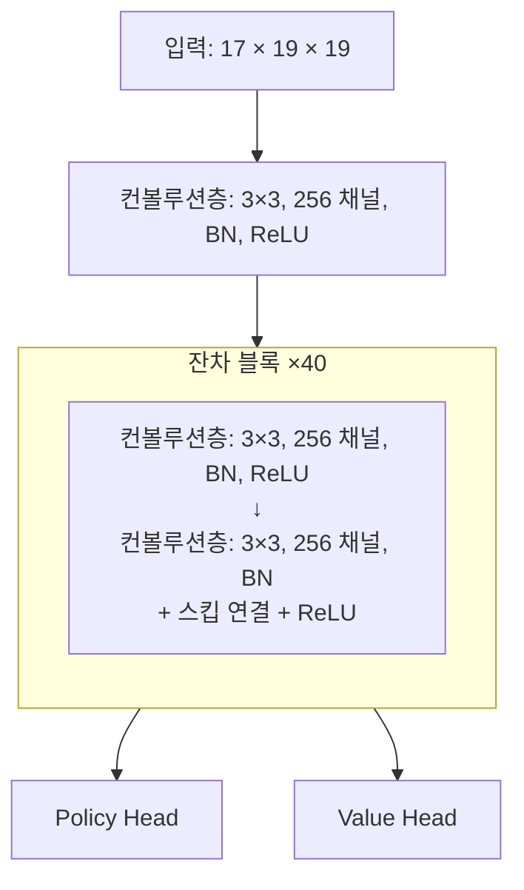

# 이중 헤드 네트워크와 잔차 네트워크

AlphaGo Zero의 가장 중요한 아키텍처 혁신 중 하나는 원본 AlphaGo의 이중 네트워크 설계를 **이중 헤드 네트워크(Dual-Head Network)**로 대체한 것입니다. 이 단순해 보이는 변화가 상당한 성능 향상과 더 우아한 학습 과정을 가져왔습니다.

이 글에서는 이 아키텍처의 설계 원리, 수학적 기초, 그리고 왜 이렇게 효과적인지 심층 분석합니다.

---

## 이중 헤드 네트워크 설계

### 전체 아키텍처

AlphaGo Zero의 신경망은 세 부분으로 나눌 수 있습니다:



각 부분을 하나씩 분석해 보겠습니다.

### 공유 백본(Shared Backbone)

공유 백본은 깊은 **잔차 네트워크(ResNet)**로, 바둑판 상태에서 특징을 추출하는 역할을 합니다.

#### 아키텍처 세부사항

| 구성요소 | 사양 |
|------|------|
| 입력층 | 3×3 컨볼루션, 256 채널 |
| 잔차 블록 | 40개(또는 20개 경량 버전) |
| 각 잔차 블록 | 2층 3×3 컨볼루션, 256 채널 |
| 활성화 함수 | ReLU |
| 정규화 | Batch Normalization |

#### 수학적 표현

입력을 x(차원 17 x 19 x 19)라 하면, 공유 백본의 출력은:

```
f(x) = ResNet_40(Conv_3x3(x))
```

여기서 f(x)(차원 256 x 19 x 19)는 고차원 특징 표현입니다.

### Policy Head(정책 헤드)

Policy Head는 각 위치의 착점 확률을 예측하는 역할을 합니다.

#### 아키텍처 세부사항



#### 수학적 표현

```
π = Softmax(FC(Flatten(ReLU(BN(Conv_1x1(f(x)))))))
```

출력 π는 362차원 벡터로, 모든 요소가 음이 아니고 합이 1입니다.

### Value Head(가치 헤드)

Value Head는 현재 국면의 승률을 예측하는 역할을 합니다.

#### 아키텍처 세부사항



#### 수학적 표현

```
v = Tanh(FC_1(ReLU(FC_2(Flatten(ReLU(BN(Conv_1x1(f(x)))))))))
```

출력 v는 [-1, 1] 범위:
- v = 1: 현재 측 필승
- v = -1: 현재 측 필패
- v = 0: 세력 균형

---

## 왜 백본을 공유하는가?

### 직관적 이해

"다음 수를 어디에 둘 것인가"(Policy)와 "누가 이길 것인가"(Value) 이 두 질문은 실제로 동일한 바둑판 패턴 이해가 필요합니다:

- **모양**: 어떤 형태가 좋고, 어떤 것이 나쁜지
- **세력**: 어느 쪽이 더 크고, 어디에 아직 공간이 있는지
- **사활**: 어떤 돌이 이미 살았고, 어떤 것이 아직 패싸움 중인지
- **전투**: 어디에 공격과 방어가 있고, 국소 승패가 어떤지

두 개의 독립적인 네트워크를 사용하면 이러한 특징을 두 번 학습해야 합니다. 공유 백본으로 이러한 저수준 특징을 한 번만 학습하고 두 작업 모두 사용할 수 있습니다.

### 다중 작업 학습 관점

기계 학습 관점에서 이것은 **다중 작업 학습(Multi-task Learning)**입니다:

```
L = L_policy + L_value
```

두 작업이 저수준 표현을 공유하며, 이로 인한 장점:

#### 1. 정규화 효과

공유 매개변수는 암묵적 정규화와 같습니다. 특징이 Policy에만 유용하고 Value에는 무용하면(또는 반대로), 과도하게 증폭되기 어렵습니다.

유효 매개변수 양은 두 개의 독립 네트워크의 매개변수 양보다 작습니다.

#### 2. 데이터 효율성

각 대국이 동시에 Policy 라벨(MCTS 탐색 확률)과 Value 라벨(최종 승패)을 생성합니다. 공유 백본으로 두 라벨 모두 공유 특징 훈련에 사용되어 데이터 활용 효율이 높아집니다.

#### 3. 풍부한 그래디언트 신호

두 작업의 그래디언트가 모두 공유 백본으로 흐릅니다:

```
∂L/∂θ_shared = ∂L_policy/∂θ_shared + ∂L_value/∂θ_shared
```

더 풍부한 감독 신호를 제공하여 공유 특징이 더 견고해집니다.

### 실험적 증거

DeepMind의 ablation 실험에 따르면, 이중 헤드 네트워크가 분리된 이중 네트워크보다 상당히 우수합니다:

| 구성 | ELO 평점 | 상대적 격차 |
|------|----------|----------|
| 분리된 Policy + Value 네트워크 | 기준 | - |
| 이중 헤드 네트워크(공유 백본) | +300 ELO | ~65% 승률 격차 |

300 ELO의 격차는 이중 헤드 네트워크가 분리된 네트워크에 대해 약 65%의 승률을 가진다는 것을 의미합니다. 이것은 상당한 향상입니다.

---

## 잔차 네트워크 원리

### 심층 네트워크의 딜레마

ResNet 발명 전에 심층 신경망은 역설에 직면했습니다:

> 이론적으로 더 깊은 네트워크는 적어도 얕은 네트워크만큼 좋아야 합니다(최악의 경우 추가 층이 항등 매핑을 학습할 수 있음). 하지만 실제로 더 깊은 네트워크가 종종 더 나쁜 성능을 보입니다.

이것이 **퇴화 문제(Degradation Problem)**입니다:

- 훈련 오류가 깊이 증가에 따라 증가(과적합이 아니라 최적화 어려움)
- 역전파 시 그래디언트가 점점 사라짐(Vanishing Gradient)
- 심층의 매개변수가 거의 효과적으로 업데이트되지 않음

### 잔차 블록 설계

허카이밍 등이 2015년에 간결하고 우아한 해결책을 제안했습니다: **잔차 연결(Skip Connection)**.



#### 수학적 표현

전통적 네트워크: 목표 매핑 H(x) 학습

```
y = H(x)
```

잔차 네트워크: **잔차 매핑** F(x) = H(x) - x 학습

```
y = F(x) + x
```

### 왜 잔차 연결이 효과적인가?

#### 1. 그래디언트 고속도로

역전파의 그래디언트를 고려하면:

```
∂L/∂x = ∂L/∂y × ∂y/∂x = ∂L/∂y × (1 + ∂F(x)/∂x)
```

핵심은 그 **+1**입니다. ∂F(x)/∂x가 매우 작거나 0이어도 그래디언트는 +1을 통해 직접 전달될 수 있습니다.

이것은 마치 '그래디언트 고속도로'를 건설하여 그래디언트가 출력층에서 입력층으로 막힘 없이 전달되게 합니다.

#### 2. 항등 매핑이 학습하기 더 쉬움

최적해가 항등 매핑에 가까우면(H(x) ≈ x):
- 전통적 네트워크: H(x) = x를 학습해야 함, 어려울 수 있음
- 잔차 네트워크: F(x) ≈ 0만 학습하면 됨, 상대적으로 쉬움

가중치를 0 또는 0에 가깝게 초기화하면 잔차 블록이 자연스럽게 항등 매핑을 향합니다.

#### 3. 앙상블 효과

심층 ResNet은 많은 얕은 네트워크의 **암묵적 앙상블**로 볼 수 있습니다. n개의 잔차 블록이 있으면 정보가 2^n 가지 다른 경로로 흐를 수 있습니다.

이 앙상블 효과가 모델의 견고성을 증가시킵니다.

### ResNet의 ImageNet 돌파

ResNet은 2015년 ImageNet 대회에서 놀라운 성과를 달성했습니다:

| 깊이 | Top-5 오류율 |
|------|-------------|
| VGG-19(잔차 없음) | 7.3% |
| ResNet-34 | 5.7% |
| ResNet-152 | 4.5% |
| 인간 수준 | ~5.1% |

**152층**의 ResNet이 훈련 가능할 뿐만 아니라 19층 VGG보다 훨씬 좋습니다. 이것은 잔차 연결이 심층 네트워크의 훈련 문제를 확실히 해결했음을 증명합니다.

---

## AlphaGo Zero의 40층 ResNet

### 왜 40층을 선택했는가?

DeepMind는 다른 깊이의 ResNet을 테스트했습니다:

| 잔차 블록 수 | 총 층 수 | ELO 평점 |
|------------|--------|----------|
| 5 | 11 | 기준 |
| 10 | 21 | +200 |
| 20 | 41 | +400 |
| 40 | 81 | +500 |

더 깊은 네트워크가 확실히 더 강하지만 한계 효용이 체감합니다. AlphaGo Zero는 20개 또는 40개 잔차 블록을 사용합니다:

- **AlphaGo Zero(논문 버전)**: 40개 잔차 블록, 256 채널
- **경량 버전**: 20개 잔차 블록, 256 채널

40층 구성이 기력과 훈련 비용 사이에서 좋은 균형을 이룹니다.

### 구체적 구성

AlphaGo Zero의 ResNet 구성:



#### 매개변수 양 추정

| 구성요소 | 매개변수 양(약) |
|------|-------------|
| 입력 컨볼루션 | 17 × 3 × 3 × 256 ≈ 39K |
| 각 잔차 블록 | 2 × 256 × 3 × 3 × 256 ≈ 1.2M |
| 40개 잔차 블록 | 40 × 1.2M ≈ 47M |
| Policy Head | ~1M |
| Value Head | ~0.2M |
| **총계** | **~48M** |

약 4,800만 매개변수로, 현대 기준으로는 중간 규모의 신경망입니다.

### Batch Normalization의 역할

각 컨볼루션층 다음에 **Batch Normalization(BN)**이 있으며, 훈련 안정성에 매우 중요합니다:

#### 1. 활성값 정규화

BN은 각 층의 활성값을 평균 0, 분산 1로 정규화합니다:

```
x_hat = (x - μ_B) / sqrt(σ_B² + ε)
y = γ × x_hat + β
```

여기서 γ와 β는 학습 가능한 매개변수입니다.

#### 2. 내부 공변량 이동 완화

심층 네트워크에서 각 층의 입력 분포가 이전 층의 매개변수 업데이트에 따라 변합니다. BN은 각 층의 입력 분포를 안정적으로 유지하여 훈련 수렴을 가속화합니다.

#### 3. 정규화 효과

BN은 훈련 시 mini-batch의 통계량을 사용하여 무작위성을 도입하고 경미한 정규화 효과가 있습니다.

---

## 다른 아키텍처와의 비교

### vs. 원본 AlphaGo의 CNN

| 특성 | AlphaGo 원본 | AlphaGo Zero |
|------|-------------|--------------|
| 아키텍처 유형 | 표준 CNN | ResNet |
| 깊이 | 13층 | 41-81층 |
| 잔차 연결 | 없음 | 있음 |
| 네트워크 수 | 2(분리) | 1(공유) |
| BN | 없음 | 있음 |

### vs. VGG 스타일 네트워크

VGG는 2014년 ImageNet 준우승 아키텍처로, 적층된 3×3 컨볼루션 사용:

| 특성 | VGG | ResNet |
|------|-----|--------|
| 훈련 가능 최대 깊이 | ~19층 | 152+층 |
| 그래디언트 흐름 | 층별 감소 | 고속도로 있음 |
| 훈련 난이도 | 심층 어려움 | 심층 훈련 가능 |

### vs. Inception / GoogLeNet

Inception은 다중 스케일 컨볼루션 병렬 사용:

| 특성 | Inception | ResNet |
|------|-----------|--------|
| 특징 | 다중 스케일 특징 | 깊이 적층 |
| 복잡도 | 높음 | 간결 |
| 바둑 적용성 | 일반적 | 우수 |

ResNet의 간결한 설계가 바둑처럼 깊은 추론이 필요한 작업에 더 적합합니다.

### vs. Transformer

2017년 제안된 Transformer 아키텍처는 NLP 분야에서 큰 성공을 거뒀습니다. 누군가 Transformer를 바둑에 적용하려 시도했습니다:

| 특성 | ResNet | Transformer |
|------|--------|-------------|
| 귀납적 편향 | 지역성(컨볼루션) | 전역 주의 |
| 위치 인코딩 | 암묵적(컨볼루션) | 명시적 |
| 바둑 성능 | 우수 | 가능하지만 ResNet보다 낫지 않음 |
| 계산 효율 | 높음 | 낮음(O(n²)) |

바둑처럼 명확한 공간 구조가 있는 문제에는 CNN/ResNet의 귀납적 편향이 더 적합합니다.

---

## 설계 선택의 심층 분석

### 왜 3×3 컨볼루션을 사용하는가?

AlphaGo Zero는 전체적으로 3×3 컨볼루션을 사용하고 더 큰 커널은 사용하지 않습니다:

1. **매개변수 효율**: 두 개의 3×3 컨볼루션의 수용 영역은 하나의 5×5와 같지만 매개변수가 더 적음(18 vs 25)
2. **더 깊은 네트워크**: 같은 매개변수 양으로 더 많은 층 적층 가능
3. **더 많은 비선형성**: 층 사이에 ReLU가 있어 표현력 증가

### 왜 256 채널을 사용하는가?

256 채널은 경험적 선택입니다:

- **너무 적음**(예: 64): 표현력 부족, 복잡한 패턴 포착 불가
- **너무 많음**(예: 512): 매개변수 양 두 배, 훈련 비용 크게 증가, 기력 향상은 제한적

나중에 KataGo 실험에 따르면 채널 수는 훈련 자원에 따라 조정 가능:
- 저자원: 128 채널, 20 블록
- 고자원: 256 채널, 40 블록
- 더 높은 자원: 384 채널, 60 블록

### 왜 Policy Head는 Softmax, Value Head는 Tanh를 사용하는가?

#### Policy Head: Softmax

착점은 **분류 문제**—361개 위치(플러스 Pass) 중 하나 선택. Softmax 출력은:
- 모든 확률이 음이 아님: π_i >= 0
- 확률 합이 1: Σπ_i = 1

확률 분포의 정의와 일치합니다.

#### Value Head: Tanh

승률은 **회귀 문제**—연속 값 예측. Tanh 출력 범위는 [-1, 1]:
- 유계: 극단값 생성 안 함
- 대칭: 승과 패를 대칭적으로 처리
- 미분 가능: 그래디언트 계산 편리

무계 출력(예: 선형층) 대신 Tanh 사용으로 훈련 불안정 방지.

---

## 훈련 세부사항

### 손실 함수

AlphaGo Zero의 총 손실은 세 항의 합:

```
L = L_policy + L_value + L_reg
```

#### Policy Loss

**크로스 엔트로피 손실** 사용, 네트워크 출력이 MCTS 탐색 확률에 근접하도록:

```
L_policy = -Σ π_MCTS(a) × log(π_net(a))
```

여기서:
- π_MCTS(a)는 행동 a에 대한 MCTS의 탐색 확률
- π_net(a)는 네트워크가 출력한 확률

#### Value Loss

**평균 제곱 오차(MSE)** 사용, 네트워크 출력이 실제 승패에 근접하도록:

```
L_value = (v_net - z)²
```

여기서:
- v_net은 네트워크가 예측한 승률
- z는 실제 경기 결과(+1 또는 -1)

#### Regularization Loss

**L2 정규화** 사용으로 과적합 방지:

```
L_reg = c × ||θ||²
```

여기서 c는 정규화 계수, θ는 네트워크 매개변수.

### 옵티마이저 구성

| 매개변수 | 값 |
|------|-----|
| 옵티마이저 | SGD + Momentum |
| 모멘텀 | 0.9 |
| 초기 학습률 | 0.01 |
| 학습률 감소 | 매 X 스텝마다 반감 |
| Batch Size | 32 × 2048 = 64K(분산) |
| L2 정규화 계수 | 1e-4 |

### 데이터 증강

바둑판은 8중 대칭성(4번 회전 × 2번 뒤집기)이 있습니다. 훈련 시 각 국면이 8개의 동등한 훈련 샘플을 생성할 수 있습니다.

유효 훈련 데이터가 8배 증가하며 추가 자기 대국이 필요 없습니다.

---

## 구현 고려사항

### 메모리 최적화

40층 ResNet 훈련은 많은 메모리가 필요합니다:
- **순전파**: 각 층의 활성값 저장 필요(역전파용)
- **역전파**: 그래디언트 저장 필요

최적화 전략:
1. **그래디언트 체크포인팅(Gradient Checkpointing)**: 일부 활성값만 저장, 필요 시 재계산
2. **혼합 정밀도 훈련**: FP16 사용으로 메모리 점유 감소
3. **분산 훈련**: batch를 여러 GPU/TPU에 분산

### 추론 최적화

추론 시 BN의 mini-batch 통계량이 필요 없으며, 훈련 시 누적된 이동 평균 사용 가능:

```
x_hat = (x - μ_moving) / sqrt(σ_moving² + ε)
```

추론 속도가 더 빠르고 결과가 결정적입니다.

### 양자화와 압축

배포 시 네트워크를 더 압축 가능:
- **가중치 양자화**: FP32 → INT8, 메모리 4배 감소
- **가지치기**: 작은 가중치 연결 제거
- **지식 증류**: 큰 네트워크로 작은 네트워크 훈련

---

## 애니메이션 대응

이 글에서 다루는 핵심 개념과 애니메이션 번호:

| 번호 | 개념 | 물리/수학 대응 |
|------|------|--------------|
| E3 | 이중 헤드 네트워크 | 다중 작업 학습 |
| D12 | 잔차 연결 | 그래디언트 고속도로 |
| D8 | 컨볼루션 신경망 | 국소 수용 영역 |
| D10 | Batch Normalization | 분포 정규화 |

---

## 더 읽을거리

- **이전 글**: [AlphaGo Zero 개요](../alphago-zero) — 왜 인간 기보가 필요 없는가
- **다음 글**: [처음부터의 훈련 과정](../training-from-scratch) — Day 0-3의 상세 진화
- **기술 심화**: [CNN과 바둑의 결합](../cnn-and-go) — 왜 CNN이 바둑판에 적합한가

---

## 참고 자료

1. Silver, D., et al. (2017). "Mastering the game of Go without human knowledge." *Nature*, 550, 354-359.
2. He, K., et al. (2016). "Deep Residual Learning for Image Recognition." *CVPR 2016*.
3. Ioffe, S., & Szegedy, C. (2015). "Batch Normalization: Accelerating Deep Network Training by Reducing Internal Covariate Shift." *ICML 2015*.
4. Caruana, R. (1997). "Multitask Learning." *Machine Learning*, 28(1), 41-75.
5. Veit, A., et al. (2016). "Residual Networks Behave Like Ensembles of Relatively Shallow Networks." *NeurIPS 2016*.
