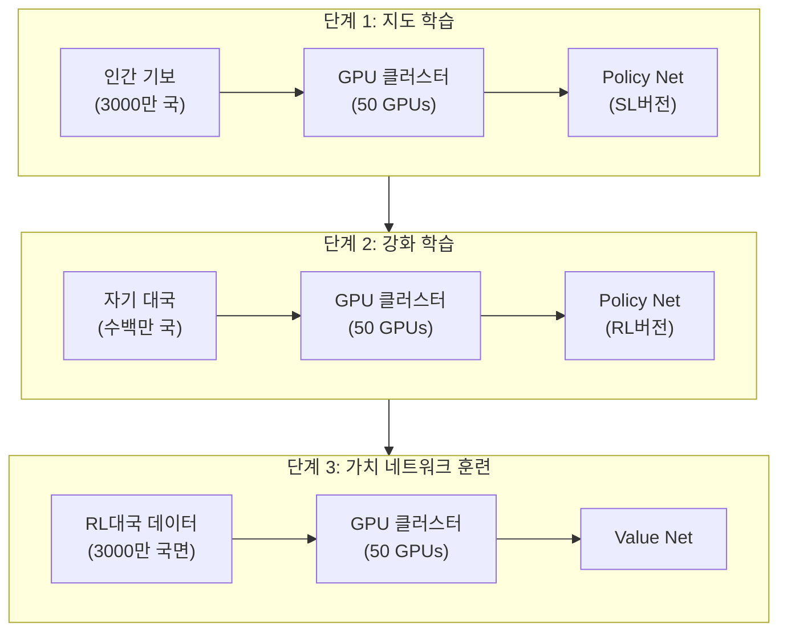
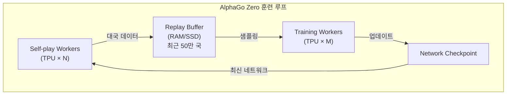
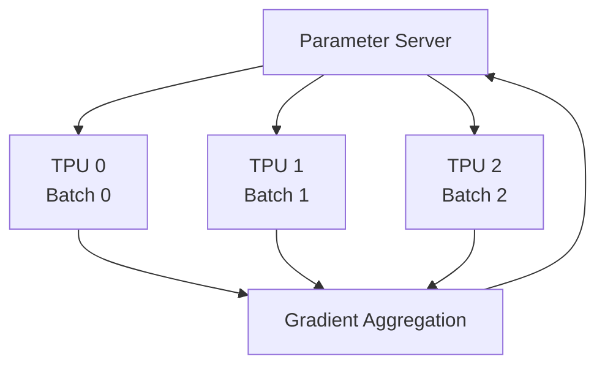
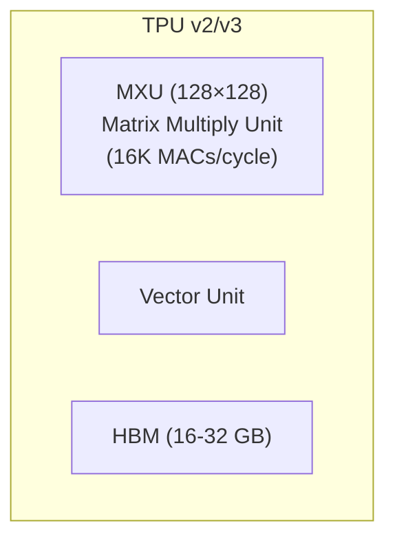
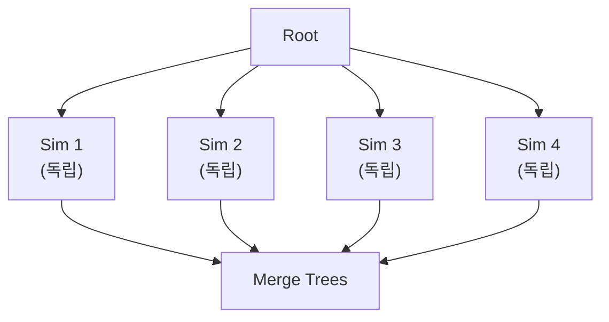
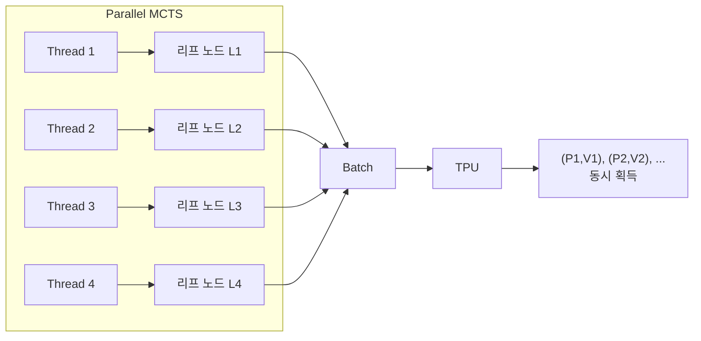
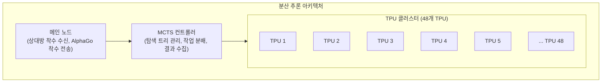

# 분산 시스템과 TPU

AlphaGo의 성공은 알고리즘의 승리일 뿐만 아니라 엔지니어링의 승리이기도 합니다. 합리적인 시간 내에 인간을 초월하는 바둑 AI를 훈련시키려면 정교하게 설계된 분산 시스템과 전용 하드웨어의 지원이 필요합니다.

이 글에서는 훈련 흐름, 추론 아키텍처, 병렬 MCTS, 그리고 TPU의 핵심 역할을 포함하여 AlphaGo 뒤의 시스템 아키텍처를 심층적으로 분석합니다.

---

## 훈련 아키텍처 개요

### 오리지널 AlphaGo의 훈련 아키텍처

오리지널 AlphaGo (이세돌을 이긴 버전)의 훈련은 여러 단계로 나뉘며, 각 단계마다 다른 자원 구성을 사용합니다:



### AlphaGo Zero의 훈련 아키텍처

AlphaGo Zero는 훈련 흐름을 대폭 간소화하여 단일 엔드투엔드 훈련 루프를 사용합니다:



이 아키텍처의 장점:

1. **지속적 학습**: Self-play와 Training이 동시에 진행되어 대기할 필요 없음
2. **자원 효율**: 모든 자원이 유용한 작업을 수행
3. **빠른 반복**: 네트워크 업데이트 후 즉시 새 데이터 생성에 사용

---

## Self-play Workers

### 작업 분배

Self-play Workers는 현재 가장 강한 네트워크로 자기 대국을 진행하여 훈련 데이터를 생성합니다.

| 구성 | AlphaGo Zero |
|------|--------------|
| Worker 수 | 수십 개 |
| Worker당 | 1-4 TPU |
| 대국당 MCTS | 1600회 시뮬레이션 |
| 일일 생성량 | ~100,000국 |

### 작업 흐름

각 Self-play Worker의 작업 흐름:

```python
while True:
    # 1. 최신 네트워크 가중치 다운로드
    network = download_latest_checkpoint()

    # 2. 여러 국 자기 대국 진행
    for game in range(batch_size):
        positions = []
        board = EmptyBoard()

        while not board.is_terminal():
            # MCTS 실행
            mcts = MCTS(network, board)
            policy = mcts.search(num_simulations=1600)

            # 착수 선택
            action = sample(policy)

            # 기록
            positions.append((board.state, policy))

            # 착수
            board = board.play(action)

        # 3. 승패 결과 획득
        result = board.get_result()

        # 4. 데이터 업로드
        upload_to_replay_buffer(positions, result)
```

### 부하 분산

여러 Worker는 부하 분산이 필요합니다:

- **네트워크 동기화**: 모든 Worker가 같은 버전의 네트워크 사용
- **데이터 균형**: 다른 Worker의 데이터가 모두 사용되도록 보장
- **장애 처리**: 단일 Worker 실패가 전체 훈련에 영향 주지 않음

---

## Training Workers

### 작업 분배

Training Workers는 Replay Buffer에서 데이터를 샘플링하여 신경망을 훈련합니다.

| 구성 | AlphaGo Zero |
|------|--------------|
| Worker 수 | 1-4 |
| Worker당 | 4 TPU |
| Batch Size | 2048 (TPU당 512) |
| 훈련 스텝 | 일일 수만 스텝 |

### 분산 훈련

대규모 훈련은 **데이터 병렬화(Data Parallelism)**를 사용합니다:



각 TPU는 다른 mini-batch를 처리하고 로컬 그래디언트를 계산한 다음, 집계하여 전역 파라미터를 업데이트합니다.

### 동기 vs. 비동기 업데이트

| 업데이트 방식 | 장점 | 단점 |
|----------|------|------|
| 동기 | 안정적, 재현 가능 | Worker가 가장 느린 것을 기다려야 함 |
| 비동기 | 처리량 높음 | 그래디언트가 오래될 수 있음 |

AlphaGo Zero는 훈련의 안정성을 보장하기 위해 **동기 업데이트**를 사용합니다.

---

## TPU의 역할

### TPU란?

**TPU(Tensor Processing Unit)**는 Google이 딥러닝을 위해 특별히 설계한 가속기입니다:

| 특성 | TPU | GPU | CPU |
|------|-----|-----|-----|
| 설계 목표 | 행렬 연산 | 범용 병렬 | 범용 컴퓨팅 |
| 정밀도 | FP16/BF16 최적화 | FP32/FP16 | FP64/FP32 |
| 전력 소비 | 상대적으로 낮음 | 높음 | 가장 높음 |
| 지연 시간 | 낮음 | 중간 | 높음 |

### TPU 아키텍처

TPU의 핵심은 **MXU(Matrix Multiply Unit)**입니다:



MXU는 사이클당 16K 곱셈-덧셈 연산을 수행할 수 있으며, 이는 신경망의 행렬 곱셈에 매우 중요합니다.

### AlphaGo에 TPU가 필요한 이유

바둑 AI의 계산 병목은 **신경망 추론**입니다:

| 연산 | 비중 |
|------|------|
| 신경망 순전파 | ~95% |
| MCTS 트리 연산 | ~4% |
| 기타 | ~1% |

매 수마다 MCTS는 1600회의 신경망 추론을 실행해야 합니다. TPU의 높은 처리량이 이것을 가능하게 합니다.

### TPU 사용의 진화

| 버전 | 훈련 TPU | 추론 TPU |
|------|----------|----------|
| AlphaGo Lee | 50 GPU | 48 TPU (v1) |
| AlphaGo Master | 4 TPU (v2) | 4 TPU (v2) |
| AlphaGo Zero | 4 TPU (v2) | 4 TPU (v2) (확장 가능) |

AlphaGo Zero가 사용하는 TPU 수가 크게 줄었는데, 이는 더 효율적인 아키텍처와 새로운 TPU 버전 덕분입니다.

---

## 병렬 MCTS와 가상 손실

### 병렬화의 도전

MCTS의 표준 구현은 **직렬**입니다:

```
for i in range(num_simulations):
    1. Selection: 루트에서 아래로 선택
    2. Expansion: 리프 노드 확장
    3. Evaluation: 신경망 평가
    4. Backup: 역전파 업데이트
```

하지만 신경망 평가는 GPU/TPU 친화적인 **배치 연산**입니다. 어떻게 여러 시뮬레이션을 동시에 실행할 수 있을까요?

### 리프 병렬화 (Leaf Parallelization)

가장 간단한 병렬화 방식: 여러 개의 완전한 시뮬레이션을 동시에 실행하고 마지막에 결과를 병합합니다.



문제: 각 시뮬레이션이 루트에서 시작하여 같은 경로를 반복 탐색합니다.

### 가상 손실 (Virtual Loss)

DeepMind는 트리 병렬화(Tree Parallelization)를 구현하기 위해 **가상 손실** 기술을 채택했습니다.

#### 기본 개념

스레드가 특정 노드를 탐색하고 있을 때, 해당 노드의 가치를 임시로 낮추어 다른 스레드가 다른 경로를 선택하게 합니다.

```
일반 UCB: Q(s,a) + c * P(s,a) * sqrt(N(s)) / (1 + N(s,a))

가상 손실 추가 후:
(Q(s,a) * N(s,a) - v * n_virtual) / (N(s,a) + n_virtual) + c * P(s,a) * sqrt(N(s)) / (1 + N(s,a) + n_virtual)
```

여기서:
- `n_virtual`은 해당 노드를 탐색 중인 스레드 수
- `v`는 가상 손실 값 (보통 1 또는 승률에 해당하는 값)

#### 작동 흐름

```
시간 T1:
  Thread 1이 경로 A → B → C 선택
  노드 C가 가상 손실 -1 획득

시간 T2:
  Thread 2가 경로 A → B → D 선택 (C가 "페널티"를 받았으므로)
  노드 D가 가상 손실 -1 획득

시간 T3:
  Thread 1이 평가 완료, C의 실제 값 업데이트, 가상 손실 제거
  Thread 3는 이제 C를 선택할 수 있음 (실제 값이 충분히 좋다면)
```

#### 가상 손실의 효과

| 측면 | 효과 |
|------|------|
| 탐색 다양성 | 다른 경로 탐색 강제 |
| 배치 효율 | 여러 리프 노드를 동시에 평가 가능 |
| 수렴성 | 가상 손실은 결국 실제 값으로 덮어쓰여져 수렴에 영향 없음 |

### 배치 신경망 평가

가상 손실을 통해 평가 대기 중인 여러 리프 노드를 수집하여 **배치 추론**을 수행할 수 있습니다:



TPU의 배치 추론 효율은 개별 추론보다 훨씬 높아서 병렬 MCTS가 가능해집니다.

---

## 추론 아키텍처

### 경기 시 구성

AlphaGo의 공식 경기 시 추론 아키텍처:

| 버전 | 하드웨어 구성 |
|------|----------|
| AlphaGo Fan | 176 GPU |
| AlphaGo Lee | 48 TPU + 여러 서버 |
| AlphaGo Master | 4 TPU |
| AlphaGo Zero | 4 TPU (확장 가능) |

### 분산 추론 흐름

경기 시 추론 흐름 (AlphaGo Lee를 예로):



### 시간 관리

AlphaGo의 시간 관리 전략:

| 국면 | 생각 시간 | MCTS 횟수 |
|------|----------|-----------|
| 포석 (정석 있음) | 짧음 | ~10,000 |
| 중반 (복잡) | 길음 | ~100,000 |
| 단순 국면 | 짧음 | ~5,000 |
| 초읽기 | 고정 | ~1,600 |

더 많은 MCTS 시뮬레이션은 보통 더 좋은 착수 품질을 의미합니다.

---

## 통신과 동기화

### 데이터 형식

훈련 데이터의 전송 형식:

```protobuf
message TrainingExample {
    // 바둑판 상태 (17 × 19 × 19)
    repeated float board_planes = 1;

    // MCTS 탐색 결과 (362)
    repeated float mcts_policy = 2;

    // 승패 결과 (1 = 현재 측 승, -1 = 현재 측 패)
    float game_result = 3;
}
```

### 네트워크 대역폭 요구사항

| 데이터 흐름 | 크기 | 빈도 |
|--------|------|------|
| 훈련 샘플 | ~10 KB/샘플 | 초당 수천 샘플 |
| 네트워크 가중치 | ~200 MB | 시간당 수 회 |
| 제어 메시지 | < 1 KB | 지속적 |

총 대역폭 요구사항: ~100 Mbps (내부 네트워크로 충분)

### 장애 처리

분산 시스템의 장애 처리:

| 장애 유형 | 처리 방식 |
|----------|----------|
| Worker 다운 | 재시작, 최신 checkpoint 사용하여 계속 |
| 네트워크 단절 | 데이터 버퍼링, 재연결 후 전송 계속 |
| TPU 고장 | 자동으로 예비 TPU로 전환 |
| 데이터 손상 | 검증 후 폐기, 재생성 |

---

## 비용 분석

### 하드웨어 비용 추정

Google Cloud의 TPU 가격으로 AlphaGo Zero 훈련 비용 추정:

| 자원 | 수량 | 시간당 단가 | 일일 총액 |
|------|------|-----------|---------|
| TPU v2 Pod | 4 | ~$32 | ~$3,000 |
| 고메모리 VM | 수 대 | ~$5 | ~$500 |
| 저장 공간 | 10 TB | ~$0.02/GB | ~$200 |
| 네트워크 | - | 포함 | - |

**일일 약 $3,700**, 전체 훈련 (40일) 약 **$150,000**.

참고: 이것은 2017년 추정치이며, DeepMind는 Google 자회사로서 내부 할인을 받을 수 있습니다.

### 인간 훈련과의 비교

| 측면 | AlphaGo Zero | 인간 프로 기사 |
|------|--------------|--------------|
| 프로 수준 도달 | 2일 | 10-15년 |
| 훈련 비용 | ~$7,500 | 수백만 (학비, 생활비, 기회비용) |
| 지속 비용 | 전기료 | 생활비 |
| 복제 가능성 | 완벽히 복제 가능 | 복제 불가 |

물론 이 비교는 완전히 공정하지 않습니다. 인간은 바둑을 배우는 과정에서 바둑만 배우는 것이 아닙니다.

### 추론 비용

공식 경기의 추론 비용:

| 구성 | 대국당 비용 |
|------|----------|
| 48 TPU (AlphaGo Lee) | ~$500 |
| 4 TPU (AlphaGo Zero) | ~$50 |
| 단일 GPU (KataGo) | ~$1 |

추론 비용은 기술 발전에 따라 크게 감소했습니다.

---

## 기술 진화

### AlphaGo에서 AlphaZero로

| 측면 | AlphaGo Lee | AlphaGo Zero | AlphaZero |
|------|-------------|--------------|-----------|
| 훈련 TPU | 50+ GPU → TPU | 4 TPU | 4 TPU |
| 추론 TPU | 48 TPU | 4 TPU | 4 TPU |
| MCTS/수 | ~100,000 | ~1,600 | ~800 |
| 훈련 시간 | 수 개월 | 40일 | 수 시간-수 일 |

효율이 약 100배 향상되었습니다.

### 오픈소스 커뮤니티에 대한 영향

AlphaGo의 아키텍처는 여러 오픈소스 프로젝트에 영감을 주었습니다:

| 프로젝트 | 특징 |
|------|------|
| Leela Zero | 커뮤니티 분산 훈련, AlphaGo Zero 재현 |
| KataGo | 단일 GPU 고효율 훈련, AlphaGo Zero 초월 |
| ELF OpenGo | Facebook 오픈소스, PyTorch 사용 |
| Minigo | Google 오픈소스, TensorFlow 사용 |

이 프로젝트들은 일반 연구자들도 강력한 바둑 AI를 훈련할 수 있게 했습니다.

---

## 애니메이션 대응

이 글에서 다룬 핵심 개념과 애니메이션 번호:

| 번호 | 개념 | 물리/수학 대응 |
|------|------|--------------|
| 🎬 C9 | 병렬 MCTS | 다체 문제 |
| 🎬 E9 | 분산 훈련 | 분산 컴퓨팅 |
| 🎬 C5 | 가상 손실 | 반발 퍼텐셜 |
| 🎬 D15 | 배치 추론 | 벡터화 계산 |

---

## 추가 읽을거리

- **이전 글**: [처음부터 훈련하는 과정](../training-from-scratch) — 훈련 곡선의 상세 분석
- **다음 글**: [AlphaGo의 유산](../legacy-and-impact) — AlphaGo가 AI 분야에 미친 깊은 영향
- **관련 글**: [MCTS와 신경망의 결합](../mcts-neural-combo) — MCTS의 기초 지식

---

## 참고 자료

1. Silver, D., et al. (2017). "Mastering the game of Go without human knowledge." *Nature*, 550, 354-359.
2. Jouppi, N., et al. (2017). "In-Datacenter Performance Analysis of a Tensor Processing Unit." *ISCA 2017*.
3. Dean, J., et al. (2012). "Large Scale Distributed Deep Networks." *NeurIPS 2012*.
4. Chaslot, G., et al. (2008). "Parallel Monte-Carlo Tree Search." *CIG 2008*.
5. Segal, R. (2010). "On the Scalability of Parallel UCT." *CIG 2010*.
