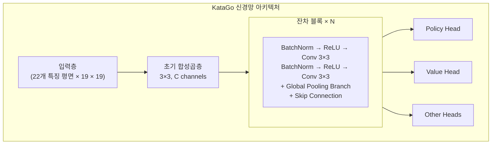
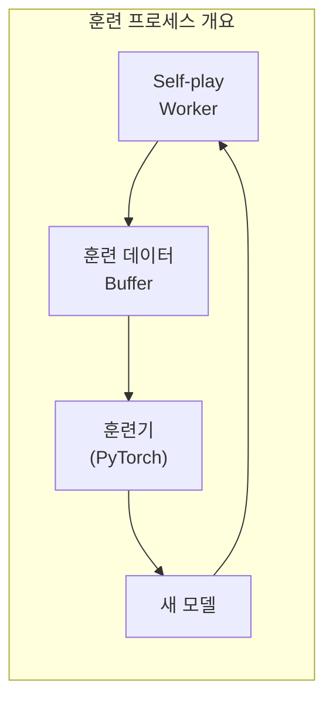

# KataGo 소스코드 아키텍처

본문에서는 KataGo의 소스코드 구조를 심층 해석하여 내부 구현을 이해하는 데 도움을 드립니다. 코드 기여, 기능 수정, 또는 기술을 자체 프로젝트에 적용하려는 분께 필수 참고 자료입니다.

## 프로젝트 디렉토리 구조

```
KataGo/
├── cpp/                    # C++ 핵심 코드
│   ├── main.cpp           # 메인 프로그램 진입점
│   ├── command/           # 각종 실행 모드
│   ├── core/              # 핵심 유틸리티 클래스
│   ├── game/              # 바둑 규칙 및 바둑판
│   ├── search/            # MCTS 탐색 엔진
│   ├── neuralnet/         # 신경망 인터페이스
│   ├── dataio/            # 데이터 I/O
│   ├── configs/           # 설정 파일 예제
│   └── tests/             # 유닛 테스트
├── python/                 # Python 훈련 코드
│   ├── train.py           # 훈련 메인 프로그램
│   ├── model.py           # 모델 정의
│   ├── data_processing_pytorch.py
│   └── configs/           # 훈련 설정
├── docs/                   # 문서
└── scripts/               # 보조 스크립트
```

### cpp/ 디렉토리 상세

```
cpp/
├── main.cpp                # 프로그램 진입점, 명령줄 인자 파싱
├── command/
│   ├── gtp.cpp            # GTP 프로토콜 구현
│   ├── analysis.cpp       # Analysis Engine 구현
│   ├── benchmark.cpp      # 벤치마크 테스트
│   ├── genconfig.cpp      # 설정 파일 생성
│   └── selfplay.cpp       # 자가대국
├── core/
│   ├── global.h           # 전역 상수 및 설정
│   ├── hash.h             # Zobrist 해시
│   ├── rand.h             # 난수 생성
│   ├── logger.h           # 로깅 시스템
│   ├── config_parser.h    # 설정 파일 파싱
│   └── threadsafe*.h      # 스레드 안전 도구
├── game/
│   ├── board.h/cpp        # 바둑판 표현 및 기본 조작
│   ├── rules.h/cpp        # 바둑 규칙
│   ├── boardhistory.h/cpp # 대국 히스토리
│   └── graphhash.h/cpp    # 국면 해시
├── search/
│   ├── search.h/cpp       # 탐색 엔진 메인 클래스
│   ├── searchnode.h/cpp   # 탐색 트리 노드
│   ├── searchparams.h     # 탐색 파라미터
│   ├── mutexpool.h        # 락 풀
│   ├── searchresults.h    # 탐색 결과
│   └── asyncbot.h/cpp     # 비동기 봇
├── neuralnet/
│   ├── nninputs.h/cpp     # 신경망 입력 특징
│   ├── nneval.h/cpp       # 신경망 평가
│   ├── nninterface.h      # 백엔드 추상 인터페이스
│   ├── cudabackend.cpp    # CUDA 백엔드
│   ├── openclbackend.cpp  # OpenCL 백엔드
│   ├── eigenbackend.cpp   # Eigen(CPU) 백엔드
│   └── modelversion.h     # 모델 버전 관리
└── dataio/
    ├── sgf.h/cpp          # SGF 파일 처리
    ├── numpywrite.h/cpp   # NumPy 형식 출력
    └── trainingwrite.h/cpp # 훈련 데이터 기록
```

## 신경망 아키텍처

### 네트워크 구조 개요



### 입력 특징(nninputs.cpp)

KataGo는 22개 특징 평면을 입력으로 사용합니다:

```cpp
// 주요 입력 특징 카테고리
enum {
  // 바둑판 상태
  INPUT_FEATURE_STONE_OUR,      // 우리 돌
  INPUT_FEATURE_STONE_OPP,      // 상대 돌

  // 활로 관련(1-8활로)
  INPUT_FEATURE_LIBERTIES_1,
  INPUT_FEATURE_LIBERTIES_2,
  // ...
  INPUT_FEATURE_LIBERTIES_8_OR_MORE,

  // 히스토리 상태
  INPUT_FEATURE_LAST_MOVE,      // 이전 수 위치
  INPUT_FEATURE_SECOND_LAST_MOVE,

  // 규칙 관련
  INPUT_FEATURE_KOMI,           // 덤
  INPUT_FEATURE_RULES,          // 규칙 인코딩
  // ...
};
```

### 전역 풀링 분기

KataGo의 혁신 중 하나는 잔차 블록에 전역 풀링 추가:

```cpp
// 간소화된 전역 풀링 구현 개념
class GlobalPoolingResBlock {
public:
  void forward(Tensor& x) {
    // 표준 잔차 경로
    Tensor regular_out = regular_conv_path(x);

    // 전역 풀링 경로
    Tensor global_mean = global_avg_pool(x);  // [batch, C]
    Tensor global_max = global_max_pool(x);    // [batch, C]
    Tensor global_features = concat(global_mean, global_max);

    // 전역 특징 처리
    global_features = dense_layer(global_features);  // [batch, C]

    // 공간 차원으로 브로드캐스트하여 일반 경로와 결합
    Tensor global_broadcast = broadcast_to_spatial(global_features);
    x = regular_out + global_broadcast;
  }
};
```

### 출력 헤드

```cpp
// Policy Head: 착점 확률 예측
class PolicyHead {
  // 출력: 19×19+1(pass 포함)
  // softmax 정규화 사용
};

// Value Head: 승패 예측
class ValueHead {
  // 출력: 3(승/패/무 확률)
  // softmax 정규화 사용
};

// Score Head: 집수 예측
class ScoreHead {
  // 출력: 연속값(예상 집수 차)
};

// Ownership Head: 영역 예측
class OwnershipHead {
  // 출력: 19×19(각 점 귀속, tanh)
};
```

## 탐색 엔진 구현

### MCTS 핵심 클래스

```cpp
// search/search.h
class Search {
public:
  // 탐색 실행
  void runWholeSearch(Player pla);

  // 최선수 가져오기
  Loc getBestMove();

  // 분석 결과 가져오기
  AnalysisData getAnalysisData();

private:
  SearchParams params;          // 탐색 파라미터
  SearchNode* rootNode;         // 루트 노드
  NNEvaluator* nnEval;         // 신경망 평가기
  std::mutex* mutexPool;       // 락 풀
};
```

### 탐색 노드 구조

```cpp
// search/searchnode.h
struct SearchNode {
  // 노드 통계
  std::atomic<int64_t> visits;           // 방문 횟수
  std::atomic<double> valueSumWeight;    // 가치 누적 가중치
  std::atomic<double> valueSum;          // 가치 누적 합

  // 자식 노드
  std::atomic<int> numChildren;
  SearchChildPointer* children;          // 자식 노드 포인터 배열

  // 신경망 출력 캐시
  std::shared_ptr<NNOutput> nnOutput;
};

struct SearchChildPointer {
  Loc moveLoc;                           // 착점
  std::atomic<SearchNode*> node;         // 자식 노드 포인터
  std::atomic<int64_t> edgeVisits;       // 엣지 방문 횟수
};
```

### PUCT 선택 알고리즘

```cpp
// 탐색할 자식 노드 선택
int Search::selectChildToDescend(SearchNode* node, Player pla) {
  int bestIdx = -1;
  double bestValue = -1e100;

  for (int i = 0; i < node->numChildren; i++) {
    SearchChildPointer& child = node->children[i];

    // Q값 계산(exploitation)
    double q = getChildQ(child);

    // U값 계산(exploration)
    double prior = getPrior(node, child.moveLoc);
    double parentVisits = node->visits.load();
    double childVisits = child.edgeVisits.load();

    double u = params.cpuctExploration * prior *
               sqrt(parentVisits) / (1.0 + childVisits);

    // PUCT 공식
    double value = q + u;

    if (value > bestValue) {
      bestValue = value;
      bestIdx = i;
    }
  }

  return bestIdx;
}
```

### 병렬 탐색 구현

```cpp
void Search::runWholeSearch(Player pla) {
  // 여러 탐색 스레드 시작
  std::vector<std::thread> threads;
  for (int i = 0; i < params.numSearchThreads; i++) {
    threads.emplace_back([this, pla]() {
      runSingleSearchThread(pla);
    });
  }

  // 모든 스레드 완료 대기
  for (auto& t : threads) {
    t.join();
  }
}

void Search::runSingleSearchThread(Player pla) {
  while (!shouldStop()) {
    // 경로 선택
    std::vector<SearchNode*> path;
    SearchNode* leaf = selectAndDescend(rootNode, path);

    // 노드 확장
    expandNode(leaf);

    // 신경망 평가
    NNOutput output = nnEval->evaluate(leaf->board);

    // 역전파 업데이트
    backpropagateValue(path, output.value);
  }
}
```

### 가상 손실(Virtual Loss)

병렬 탐색 시 여러 스레드가 같은 경로를 선택하지 않도록:

```cpp
void Search::applyVirtualLoss(SearchNode* node) {
  // 이 노드의 평가값을 일시적으로 낮춤
  // 다른 스레드가 다른 경로를 선택하도록 함
  node->virtualLoss.fetch_add(1);
}

void Search::removeVirtualLoss(SearchNode* node) {
  node->virtualLoss.fetch_sub(1);
}
```

## 훈련 프로세스 개요

### 훈련 데이터 생성



### 자가대국(cpp/command/selfplay.cpp)

```cpp
// Self-play 메인 루프
void runSelfPlayLoop() {
  while (true) {
    // 최신 모델 로드
    loadLatestModel();

    // 한 대국 진행
    GameData gameData = playSingleGame();

    // 훈련 데이터 저장
    writeTrainingData(gameData);
  }
}

GameData playSingleGame() {
  Board board;
  BoardHistory history;
  GameData gameData;

  while (!history.isGameOver()) {
    // MCTS로 수 선택
    Search search(board, history, params);
    search.runWholeSearch(history.currentPla);

    // MCTS 결과를 훈련 목표로 사용
    MoveData moveData;
    moveData.policyTarget = search.getPolicyDistribution();
    moveData.valueTarget = search.getValue();

    // 수 실행
    Loc move = search.sampleMove();
    board.playMove(move, history.currentPla);

    gameData.moves.push_back(moveData);
  }

  // 최종 결과 역충전
  gameData.finalScore = history.finalScore();
  return gameData;
}
```

### 훈련 데이터 형식

```cpp
// dataio/trainingwrite.h
struct TrainingRow {
  // 입력 특징
  float inputFeatures[NUM_FEATURES][BOARD_SIZE][BOARD_SIZE];

  // 훈련 목표
  float policyTarget[BOARD_SIZE * BOARD_SIZE + 1];  // pass 포함
  float valueTarget[3];                              // 승/패/무
  float scoreTarget;                                 // 집수
  float ownershipTarget[BOARD_SIZE][BOARD_SIZE];    // 영역

  // 메타데이터
  int turn;
  int rules;
  float komi;
};
```

### Python 훈련 프로그램(python/train.py)

```python
# 훈련 메인 루프(간소화)
def train():
    model = KataGoModel(config)
    optimizer = torch.optim.SGD(model.parameters(), lr=config.lr)

    for epoch in range(config.num_epochs):
        for batch in data_loader:
            # 순전파
            policy_pred, value_pred, score_pred, ownership_pred = model(batch.input)

            # 손실 계산
            policy_loss = cross_entropy(policy_pred, batch.policy_target)
            value_loss = cross_entropy(value_pred, batch.value_target)
            score_loss = mse_loss(score_pred, batch.score_target)
            ownership_loss = mse_loss(ownership_pred, batch.ownership_target)

            # 총 손실(가중합)
            total_loss = (
                policy_loss +
                config.value_weight * value_loss +
                config.score_weight * score_loss +
                config.ownership_weight * ownership_loss
            )

            # 역전파
            optimizer.zero_grad()
            total_loss.backward()
            optimizer.step()

        # 체크포인트 저장
        save_checkpoint(model, epoch)
```

### 모델 정의(python/model.py)

```python
class KataGoModel(nn.Module):
    def __init__(self, config):
        super().__init__()

        # 초기 합성곱
        self.initial_conv = nn.Conv2d(
            config.input_channels,
            config.trunk_channels,
            kernel_size=3, padding=1
        )

        # 잔차 블록
        self.blocks = nn.ModuleList([
            ResBlock(config.trunk_channels, use_global_pooling=True)
            for _ in range(config.num_blocks)
        ])

        # 출력 헤드
        self.policy_head = PolicyHead(config)
        self.value_head = ValueHead(config)
        self.score_head = ScoreHead(config)
        self.ownership_head = OwnershipHead(config)

    def forward(self, x):
        # 주간 네트워크
        x = self.initial_conv(x)
        for block in self.blocks:
            x = block(x)

        # 각 출력 헤드
        policy = self.policy_head(x)
        value = self.value_head(x)
        score = self.score_head(x)
        ownership = self.ownership_head(x)

        return policy, value, score, ownership
```

## 핵심 데이터 구조

### Board(game/board.h)

```cpp
class Board {
public:
  // 바둑판 상태
  Color stones[MAX_BOARD_AREA];    // 각 점의 색상
  Chain chains[MAX_BOARD_AREA];    // 돌덩어리 정보

  // 패
  Loc koLoc;

  // 수 실행
  void playMove(Loc loc, Color pla);

  // 합법성 검사
  bool isLegal(Loc loc, Color pla) const;

  // 활로 계산
  int getLiberties(Loc loc) const;
};

struct Chain {
  int liberties;                   // 활로 수
  int numStones;                   // 돌 수
  Loc head;                        // 연결 리스트 헤드
};
```

### BoardHistory(game/boardhistory.h)

```cpp
class BoardHistory {
public:
  std::vector<Board> boards;       // 히스토리 바둑판 상태
  std::vector<Move> moves;         // 수 히스토리
  Rules rules;                     // 규칙
  Player currentPla;               // 현재 차례

  // 게임 상태
  bool isGameOver() const;
  float finalScore() const;
};
```

### NNOutput(neuralnet/nneval.h)

```cpp
struct NNOutput {
  // Policy
  float policyProbs[MAX_BOARD_AREA + 1];  // pass 포함

  // Value
  float whiteWinProb;
  float whiteLossProb;
  float noResultProb;

  // Score
  float whiteScoreMean;
  float whiteScoreStdev;

  // Ownership
  float ownership[MAX_BOARD_AREA];  // -1에서 1
};
```

## 개발 및 디버깅

### 디버그 버전 컴파일

```bash
cd cpp
mkdir build_debug && cd build_debug
cmake .. -DCMAKE_BUILD_TYPE=Debug -DUSE_BACKEND=OPENCL
make -j$(nproc)
```

### 유닛 테스트 실행

```bash
./katago runtests
```

### 흔한 디버깅 방법

```cpp
// 1. 로깅 사용
#include "core/logger.h"
Logger::log("Debug message", value);

// 2. kata-debug-print GTP 명령어 사용
// 상세 탐색 정보 출력

// 3. 컴파일 시 sanitizers 활성화
cmake .. -DCMAKE_CXX_FLAGS="-fsanitize=address"
```

### 성능 분석

```bash
# perf 사용(Linux)
perf record ./katago benchmark -model model.bin.gz
perf report

# Instruments 사용(macOS)
instruments -t "Time Profiler" ./katago benchmark -model model.bin.gz
```

## 추가 읽기

- [KataGo GitHub](https://github.com/lightvector/KataGo)
- [KataGo 논문](https://arxiv.org/abs/1902.10565)
- [KataGo Discord](https://discord.gg/bqkZAz3) - 개발자와 교류
- [KataGo Training](https://katagotraining.org/) - 훈련 진행 확인

KataGo의 소스코드 아키텍처를 이해했다면, 심층 연구나 오픈소스 프로젝트 기여 능력을 갖추게 됩니다. 더 깊이 알고 싶다면 KataGo의 GitHub 소스코드를 직접 읽고 커뮤니티 토론에 참여하시길 권장합니다.

