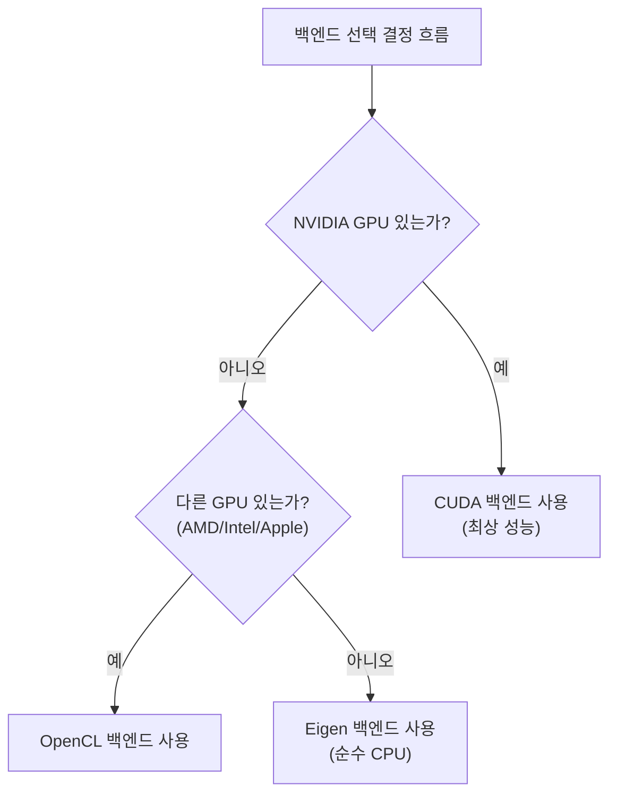

# KataGo 설치 및 설정

본문에서는 각 플랫폼에서 KataGo를 설치하는 방법을 상세히 소개합니다. 시스템 요구사항, 설치 단계, 모델 선택 및 설정 파일 설명을 포함합니다.

## 시스템 요구사항

### 하드웨어 요구사항

#### GPU(권장)

| GPU 유형 | 지원 상태 | 권장 백엔드 |
|---------|---------|---------|
| NVIDIA(CUDA) | 최상 지원 | CUDA |
| NVIDIA(CUDA 없음) | 양호 지원 | OpenCL |
| AMD | 양호 지원 | OpenCL |
| Intel 내장 그래픽 | 기본 지원 | OpenCL |
| Apple Silicon | 양호 지원 | Metal / OpenCL |

#### CPU 모드

적합한 GPU가 없으면 Eigen 백엔드로 순수 CPU 실행 가능:
- 성능 낮음(약 10-30 playouts/sec)
- 학습, 테스트 및 저강도 사용에 적합
- AVX2 명령어 세트 지원 필요(대부분 현대 CPU 지원)

### 소프트웨어 요구사항

| 운영체제 | 버전 요구 |
|---------|---------|
| **Linux** | Ubuntu 18.04+, CentOS 7+ 또는 기타 현대 배포판 |
| **macOS** | 10.14+ (Mojave 이상) |
| **Windows** | Windows 10 이상 |

### 백엔드 선택 가이드



## macOS 설치

### 방법 1: Homebrew(권장)

가장 간단한 설치 방법으로, 모든 의존성을 자동 처리합니다.

```bash
# KataGo 설치
brew install katago

# 설치 확인
katago version
```

Homebrew 버전은 기본적으로 OpenCL 백엔드를 사용하며, Intel Mac과 Apple Silicon 모두에서 실행됩니다.

### 방법 2: 소스에서 컴파일

사용자 정의 옵션이나 최신 기능이 필요한 사용자에게 적합합니다.

#### 의존성 설치

```bash
# CMake 및 컴파일 도구 설치
brew install cmake

# OpenCL 사용 시
# macOS는 OpenCL 내장 지원, 추가 설치 불필요
```

#### 컴파일 단계

```bash
# 소스 클론
git clone https://github.com/lightvector/KataGo.git
cd KataGo/cpp

# 컴파일 디렉토리 생성
mkdir build && cd build

# 컴파일 옵션 설정(OpenCL 백엔드)
cmake .. -DUSE_BACKEND=OPENCL

# 컴파일
make -j$(sysctl -n hw.ncpu)

# 컴파일 완료 후 실행 파일은 build/katago에 위치
./katago version
```

#### Apple Silicon 특별 설명

M1/M2/M3 Mac에서는 OpenCL 또는 Metal 백엔드 권장:

```bash
# OpenCL 백엔드(권장, 호환성 더 좋음)
cmake .. -DUSE_BACKEND=OPENCL

# Metal 백엔드(실험적, 더 나은 성능 가능)
cmake .. -DUSE_BACKEND=METAL
```

## Linux 설치

### 방법 1: 사전 컴파일 버전(권장)

GitHub Releases에서 사전 컴파일 버전 다운로드:

```bash
# OpenCL 버전 다운로드(대부분의 경우 적합)
wget https://github.com/lightvector/KataGo/releases/download/v1.15.3/katago-v1.15.3-opencl-linux-x64.zip

# 또는 CUDA 버전 다운로드(NVIDIA GPU)
wget https://github.com/lightvector/KataGo/releases/download/v1.15.3/katago-v1.15.3-cuda11.1-linux-x64.zip

# 압축 해제
unzip katago-v1.15.3-*.zip

# 실행 권한 부여
chmod +x katago

# 설치 확인
./katago version
```

### 방법 2: 소스에서 컴파일

#### CUDA 백엔드(NVIDIA GPU)

```bash
# 의존성 설치
sudo apt update
sudo apt install cmake g++ libzip-dev

# CUDA 설치(아직 설치 안 됐으면)
# NVIDIA 공식 가이드 참조: https://developer.nvidia.com/cuda-downloads

# 클론 및 컴파일
git clone https://github.com/lightvector/KataGo.git
cd KataGo/cpp
mkdir build && cd build

# CUDA 백엔드 설정
cmake .. -DUSE_BACKEND=CUDA

# 컴파일
make -j$(nproc)
```

#### OpenCL 백엔드(범용 GPU)

```bash
# 의존성 설치
sudo apt update
sudo apt install cmake g++ libzip-dev ocl-icd-opencl-dev

# OpenCL 드라이버 설치
# NVIDIA: CUDA와 함께 설치됨
# AMD: sudo apt install mesa-opencl-icd
# Intel: sudo apt install intel-opencl-icd

# 클론 및 컴파일
git clone https://github.com/lightvector/KataGo.git
cd KataGo/cpp
mkdir build && cd build

cmake .. -DUSE_BACKEND=OPENCL
make -j$(nproc)
```

#### Eigen 백엔드(순수 CPU)

```bash
# 의존성 설치
sudo apt update
sudo apt install cmake g++ libzip-dev libeigen3-dev

# 클론 및 컴파일
git clone https://github.com/lightvector/KataGo.git
cd KataGo/cpp
mkdir build && cd build

cmake .. -DUSE_BACKEND=EIGEN
make -j$(nproc)
```

## Windows 설치

### 방법 1: 사전 컴파일 버전(권장)

1. [KataGo Releases](https://github.com/lightvector/KataGo/releases)로 이동
2. 적합한 버전 다운로드:
   - `katago-v1.15.3-cuda11.1-windows-x64.zip`(NVIDIA GPU + CUDA)
   - `katago-v1.15.3-opencl-windows-x64.zip`(기타 GPU)
   - `katago-v1.15.3-eigen-windows-x64.zip`(순수 CPU)
3. 지정 디렉토리에 압축 해제
4. 명령 프롬프트에서 테스트:

```cmd
cd C:\path\to\katago
katago.exe version
```

### 방법 2: 소스에서 컴파일

#### 환경 준비

1. [Visual Studio 2019/2022](https://visualstudio.microsoft.com/) 설치(C++ 도구 포함)
2. [CMake](https://cmake.org/download/) 설치
3. CUDA 사용 시 [CUDA Toolkit](https://developer.nvidia.com/cuda-toolkit) 설치

#### 컴파일 단계

```cmd
# Developer Command Prompt에서 실행

git clone https://github.com/lightvector/KataGo.git
cd KataGo\cpp
mkdir build
cd build

# CUDA 백엔드
cmake .. -G "Visual Studio 17 2022" -A x64 -DUSE_BACKEND=CUDA

# 또는 OpenCL 백엔드
cmake .. -G "Visual Studio 17 2022" -A x64 -DUSE_BACKEND=OPENCL

# 컴파일
cmake --build . --config Release
```

## 모델 다운로드 및 선택

KataGo는 신경망 모델 파일이 있어야 실행됩니다. 공식에서 다양한 크기의 모델을 제공합니다.

### 다운로드 위치

공식 모델 다운로드 페이지: https://katagotraining.org/

또는 훈련 서버에서 직접 다운로드:

```bash
# 작은 모델(테스트 및 약한 하드웨어용)
curl -L -o kata-b18c384.bin.gz \
  "https://media.katagotraining.org/uploaded/networks/models/kata1/kata1-b18c384nbt-s9996604416-d4316597426.bin.gz"

# 중간 모델(권장, 성능과 속도 균형)
curl -L -o kata-b40c256.bin.gz \
  "https://media.katagotraining.org/uploaded/networks/models/kata1/kata1-b40c256-s11840935168-d2898845681.bin.gz"

# 큰 모델(가장 강한 기력, 강력한 GPU 필요)
curl -L -o kata-b60c320.bin.gz \
  "https://media.katagotraining.org/uploaded/networks/models/kata1/kata1-b60c320-s11318001920-d2792783831.bin.gz"
```

### 모델 비교

| 모델 | 네트워크 크기 | 파일 크기 | 기력 | 적용 시나리오 |
|------|---------|---------|------|---------|
| b10c128 | 10 블록, 128 채널 | ~20 MB | 아마추어 고단 | CPU, 약한 GPU, 빠른 테스트 |
| b18c384 | 18 블록, 384 채널 | ~140 MB | 프로 수준 | 일반 GPU, 일상 분석 |
| b40c256 | 40 블록, 256 채널 | ~250 MB | 초인간 수준 | 중고급 GPU, 심층 분석 |
| b60c320 | 60 블록, 320 채널 | ~500 MB | 최상급 초인간 | 고급 GPU, 최상급 분석 |

### 선택 권장

```
당신의 GPU는?
├─ RTX 3080/4080/4090 → b60c320 또는 b40c256
├─ RTX 3060/3070 → b40c256 또는 b18c384
├─ GTX 1660/2060 → b18c384
├─ 입문 GPU → b18c384 또는 b10c128
└─ 순수 CPU → b10c128
```

## 기본 설정 파일 설명

KataGo는 `.cfg` 형식의 설정 파일을 사용합니다. 공식 예제 설정 파일은 `cpp/configs/` 디렉토리에 있습니다.

### 중요 설정 파일

| 파일 | 용도 |
|------|------|
| `gtp_example.cfg` | GTP 모드 예제 설정 |
| `analysis_example.cfg` | Analysis Engine 예제 설정 |
| `default_gtp.cfg` | GTP 모드 기본 설정 |

### 핵심 설정 항목

```ini
# =============
# 신경망 설정
# =============

# 신경망 모델 파일 경로
# 상대 경로 또는 절대 경로 사용 가능
# model = /path/to/model.bin.gz

# =============
# 탐색 설정
# =============

# 매 수의 최대 탐색 방문 수
# 이 값을 늘리면 기력 향상되지만 속도 감소
maxVisits = 500

# 매 수의 최대 사고 시간(초)
# 0은 무제한(maxVisits로 제어)
maxTime = 0

# 이동당 사용 스레드 수
numSearchThreads = 6

# =============
# 규칙 설정
# =============

# 바둑 규칙
# chinese = 중국 규칙
# japanese = 일본 규칙
# korean = 한국 규칙
# tromp-taylor = Tromp-Taylor 규칙
# aga = AGA 규칙
rules = chinese

# 덤
komi = 7.5

# =============
# GPU 설정
# =============

# 사용할 GPU 번호(0부터 시작)
# 다중 GPU는 쉼표로 구분: 0,1,2
# -1은 자동 선택
nnDeviceIdxs = 0

# GPU 스레드당 배치 크기
# 큰 배치가 GPU 활용률 높임
numNNServerThreadsPerModel = 1

# =============
# 고급 설정
# =============

# MCTS 탐색 상수
# 큰 값은 탐색 증가, 작은 값은 활용 증가
cpuctExploration = 1.0

# 루트 노드의 Dirichlet 노이즈
# 탐색 다양성 증가용
rootNoiseEnabled = true
rootDirichletNoisePruneFactor = 0.25
```

### GTP 모드 설정 예제

`my_gtp_config.cfg` 생성:

```ini
# 모델 경로
# model은 보통 명령줄에서 지정, 여기서 생략 가능

# 탐색 설정
maxVisits = 1000
numSearchThreads = 4

# 규칙
rules = chinese
komi = 7.5

# GPU 설정
nnDeviceIdxs = 0

# 로그
logDir = ./logs
logToStderr = false
```

### Analysis Engine 설정 예제

`my_analysis_config.cfg` 생성:

```ini
# 탐색 설정
maxVisits = 500
numSearchThreads = 8

# 리포트 설정
# 매 분석 리포트의 최대 변화 수
maxMoves = 10

# 규칙(API 호출 시 덮어쓰기 가능)
rules = chinese
komi = 7.5

# GPU 설정
nnDeviceIdxs = 0
numNNServerThreadsPerModel = 2

# 분석 기능
reportAnalysisWinratesAs = BLACK

# 영역 맵
# 활성화하면 각 점의 귀속 예측 획득
analysisOwnership = true
```

## 첫 실행

### GTP 모드 테스트

```bash
# GTP 모드 실행
katago gtp -model /path/to/model.bin.gz -config /path/to/config.cfg

# config가 없으면 KataGo가 기본값 사용
katago gtp -model /path/to/model.bin.gz
```

성공적으로 시작하면 GTP 명령어로 테스트:

```
name
= KataGo

version
= 1.15.3

boardsize 19
=

genmove black
= Q16

quit
=
```

### Analysis Engine 테스트

```bash
# Analysis Engine 실행
katago analysis -model /path/to/model.bin.gz -config /path/to/config.cfg
```

JSON 쿼리 입력:

```json
{"id":"test1","initialStones":[],"moves":[],"rules":"chinese","komi":7.5,"boardXSize":19,"boardYSize":19,"analyzeTurns":[0]}
```

### 벤치마크 테스트

하드웨어 성능 테스트:

```bash
# 벤치마크 실행
katago benchmark -model /path/to/model.bin.gz

# 설정 파일 지정
katago benchmark -model /path/to/model.bin.gz -config /path/to/config.cfg
```

벤치마크 출력:
- 초당 탐색 방문 수(visits/sec)
- 신경망 추론 속도
- 권장 스레드 설정

## 흔한 문제 해결

### GPU 관련

**문제: GPU를 찾을 수 없음**

```bash
# OpenCL 장치 확인
clinfo

# 또는 KataGo가 보는 장치 나열
katago gpuinfo
```

**문제: CUDA 초기화 실패**

- CUDA 버전이 KataGo 컴파일 버전과 일치하는지 확인
- GPU 드라이버 업데이트
- CUDA_PATH 환경 변수 확인

### 메모리 관련

**문제: 메모리 부족**

```ini
# GPU 메모리 사용량 줄이기
nnMaxBatchSize = 8  # 기본값이 16 이상일 수 있음
nnCacheSizePowerOfTwo = 20  # 캐시 크기 줄이기
```

### 성능 관련

**문제: 속도가 너무 느림**

1. GPU를 사용하고 있는지 확인(CPU 아님)
2. `numSearchThreads` 줄이기
3. 작은 모델 사용
4. 다른 프로그램이 GPU 점유하는지 확인

## 다음 단계

설정 완료 후 계속 읽기:
- [자주 사용하는 명령어](./commands.md) - KataGo 사용법 학습
- [소스코드 아키텍처](./architecture.md) - 내부 구현 이해

