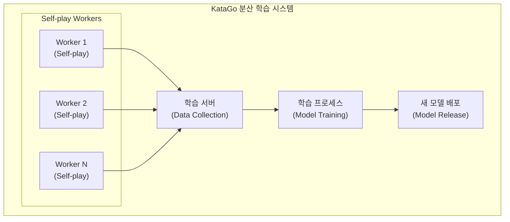

# 분산 학습 아키텍처

이 문서는 KataGo의 분산 학습 시스템 아키텍처를 소개하며, 전 세계 커뮤니티의 연산 능력을 통해 모델을 지속적으로 개선하는 방법을 설명합니다.

---

## 시스템 아키텍처 개요



---

## Self-play Worker

### 작업 흐름

각 Worker는 다음 루프를 실행합니다:

```python
def self_play_worker():
    while True:
        # 1. 최신 모델 다운로드
        model = download_latest_model()

        # 2. 자가 대국 실행
        games = []
        for _ in range(batch_size):
            game = play_game(model)
            games.append(game)

        # 3. 대국 데이터 업로드
        upload_games(games)

        # 4. 새 모델 확인
        if new_model_available():
            model = download_latest_model()
```

### 대국 생성

```python
def play_game(model):
    """한 판의 자가 대국 실행"""
    game = Game()
    positions = []

    while not game.is_terminal():
        # MCTS 탐색
        mcts = MCTS(model, num_simulations=800)
        policy = mcts.get_policy(game.state)

        # Dirichlet 노이즈 추가 (탐색 증가)
        if game.move_count < 30:
            policy = add_dirichlet_noise(policy)

        # policy에 따라 착수 선택
        if game.move_count < 30:
            # 처음 30수는 온도 샘플링
            action = sample_with_temperature(policy, temp=1.0)
        else:
            # 이후 탐욕적 선택
            action = np.argmax(policy)

        # 학습 데이터 기록
        positions.append({
            'state': game.state.copy(),
            'policy': policy,
            'player': game.current_player
        })

        game.play(action)

    # 승패 표시
    winner = game.get_winner()
    for pos in positions:
        pos['value'] = 1.0 if pos['player'] == winner else -1.0

    return positions
```

### 데이터 형식

```json
{
  "version": 1,
  "rules": "chinese",
  "komi": 7.5,
  "board_size": 19,
  "positions": [
    {
      "move_number": 0,
      "board": "...",
      "policy": [0.01, 0.02, ...],
      "value": 1.0,
      "score": 2.5
    }
  ]
}
```

---

## 데이터 수집 서버

### 기능

1. **대국 데이터 수신**: Worker로부터 대국 수집
2. **데이터 검증**: 형식 검사, 이상치 필터링
3. **데이터 저장**: 학습 데이터셋에 기록
4. **통계 모니터링**: 대국 수, Worker 상태 추적

### 데이터 검증

```python
def validate_game(game_data):
    """대국 데이터 검증"""
    checks = [
        len(game_data['positions']) > 10,  # 최소 수순
        len(game_data['positions']) < 500,  # 최대 수순
        all(is_valid_policy(p['policy']) for p in game_data['positions']),
        game_data['rules'] in SUPPORTED_RULES,
    ]
    return all(checks)
```

### 데이터 저장 구조

```
training_data/
├── run_001/
│   ├── games_00001.npz
│   ├── games_00002.npz
│   └── ...
├── run_002/
│   └── ...
└── current/
    └── latest_games.npz
```

---

## 학습 프로세스

### 학습 루프

```python
def training_loop():
    model = load_model()
    optimizer = Adam(model.parameters(), lr=1e-4)

    for epoch in range(num_epochs):
        # 최신 대국 데이터 로드
        dataset = load_recent_games(num_games=100000)
        dataloader = DataLoader(dataset, batch_size=256, shuffle=True)

        for batch in dataloader:
            states = batch['states']
            target_policies = batch['policies']
            target_values = batch['values']

            # 순전파
            pred_policies, pred_values = model(states)

            # 손실 계산
            policy_loss = cross_entropy(pred_policies, target_policies)
            value_loss = mse_loss(pred_values, target_values)
            loss = policy_loss + value_loss

            # 역전파
            optimizer.zero_grad()
            loss.backward()
            optimizer.step()

        # 정기 평가
        if epoch % 100 == 0:
            evaluate_model(model)
```

### 손실 함수

KataGo는 여러 손실 항을 사용합니다:

```python
def compute_loss(predictions, targets):
    # Policy 손실 (교차 엔트로피)
    policy_loss = F.cross_entropy(
        predictions['policy'],
        targets['policy']
    )

    # Value 손실 (MSE)
    value_loss = F.mse_loss(
        predictions['value'],
        targets['value']
    )

    # Score 손실 (MSE)
    score_loss = F.mse_loss(
        predictions['score'],
        targets['score']
    )

    # Ownership 손실 (MSE)
    ownership_loss = F.mse_loss(
        predictions['ownership'],
        targets['ownership']
    )

    # 가중 합계
    total_loss = (
        1.0 * policy_loss +
        1.0 * value_loss +
        0.5 * score_loss +
        0.5 * ownership_loss
    )

    return total_loss
```

---

## 모델 평가 및 배포

### Elo 평가

새 모델은 이전 모델과 대국하여 기력을 평가해야 합니다:

```python
def evaluate_new_model(new_model, baseline_model, num_games=400):
    """새 모델의 Elo 평가"""
    wins = 0
    losses = 0
    draws = 0

    for _ in range(num_games // 2):
        # 새 모델이 흑
        result = play_game(new_model, baseline_model)
        if result == 'black_wins':
            wins += 1
        elif result == 'white_wins':
            losses += 1
        else:
            draws += 1

        # 새 모델이 백
        result = play_game(baseline_model, new_model)
        if result == 'white_wins':
            wins += 1
        elif result == 'black_wins':
            losses += 1
        else:
            draws += 1

    # Elo 차이 계산
    win_rate = (wins + 0.5 * draws) / num_games
    elo_diff = 400 * math.log10(win_rate / (1 - win_rate))

    return elo_diff
```

### 배포 조건

```python
def should_release_model(new_model, current_best):
    """새 모델 배포 여부 결정"""
    elo_diff = evaluate_new_model(new_model, current_best)

    # 조건: Elo 향상이 임계값 초과
    if elo_diff > 20:
        return True

    # 또는: 일정 학습 단계 도달
    if training_steps % 10000 == 0:
        return True

    return False
```

### 모델 버전 명명

```
kata1-b18c384nbt-s{steps}-d{data}.bin.gz

예시:
kata1-b18c384nbt-s9996604416-d4316597426.bin.gz
├── kata1: 학습 시리즈
├── b18c384nbt: 아키텍처 (18 잔차 블록, 384 채널)
├── s9996604416: 학습 단계 수
└── d4316597426: 학습 데이터 양
```

---

## KataGo Training 참여 가이드

### 시스템 요구사항

| 항목 | 최소 요구사항 | 권장 요구사항 |
|------|---------|---------|
| GPU | GTX 1060 | RTX 3060+ |
| VRAM | 4 GB | 8 GB+ |
| 네트워크 | 10 Mbps | 50 Mbps+ |
| 실행 시간 | 지속 실행 | 24/7 |

### Worker 설치

```bash
# Worker 다운로드
wget https://katagotraining.org/download/worker

# 설정
./katago contribute -config contribute.cfg

# 기여 시작
./katago contribute
```

### 설정 파일

```ini
# contribute.cfg

# 서버 설정
serverUrl = https://katagotraining.org/

# 사용자 이름 (통계용)
username = your_username

# GPU 설정
numNNServerThreadsPerModel = 1
nnMaxBatchSize = 16

# 대국 설정
gamesPerBatch = 25
```

### 기여 모니터링

```bash
# 통계 보기
https://katagotraining.org/contributions/

# 로컬 로그
tail -f katago_contribute.log
```

---

## 학습 통계

### KataGo 학습 마일스톤

| 시간 | 대국 수 | Elo |
|------|--------|-----|
| 2019.06 | 10M | 초기 |
| 2020.01 | 100M | +500 |
| 2021.01 | 500M | +800 |
| 2022.01 | 1B | +1000 |
| 2024.01 | 5B+ | +1200 |

### 커뮤니티 기여자

- 수백 명의 전 세계 기여자
- 누적 수천 GPU 년 연산 능력
- 24/7 지속 운영

---

## 고급 주제

### 커리큘럼 학습 (Curriculum Learning)

점진적으로 학습 난이도 증가:

```python
def get_training_config(training_step):
    if training_step < 100000:
        return {'board_size': 9, 'visits': 200}
    elif training_step < 500000:
        return {'board_size': 13, 'visits': 400}
    else:
        return {'board_size': 19, 'visits': 800}
```

### 데이터 증강

바둑판 대칭성을 활용하여 데이터 양 증가:

```python
def augment_position(state, policy):
    """8가지 대칭 변환"""
    augmented = []

    for rotation in [0, 90, 180, 270]:
        for flip in [False, True]:
            aug_state = transform(state, rotation, flip)
            aug_policy = transform_policy(policy, rotation, flip)
            augmented.append((aug_state, aug_policy))

    return augmented
```

---

## 추가 읽기

- [KataGo 학습 메커니즘 분석](../training) — 학습 프로세스 상세
- [오픈소스 커뮤니티 참여](../contributing) — 코드 기여 방법
- [평가 및 벤치마크 테스트](../evaluation) — 모델 평가 방법
