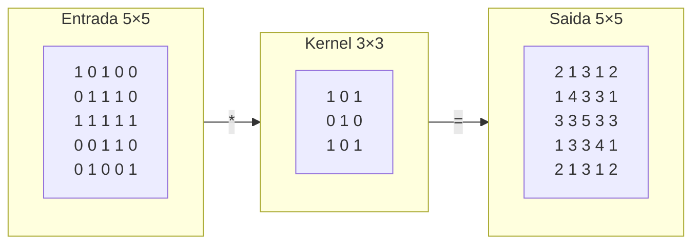
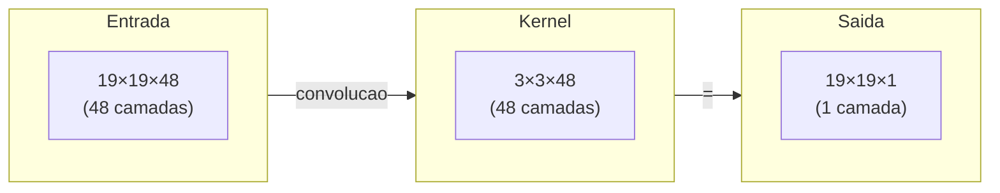
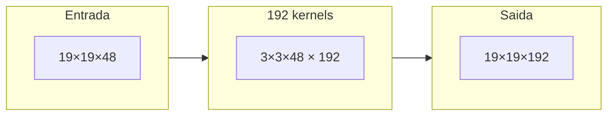
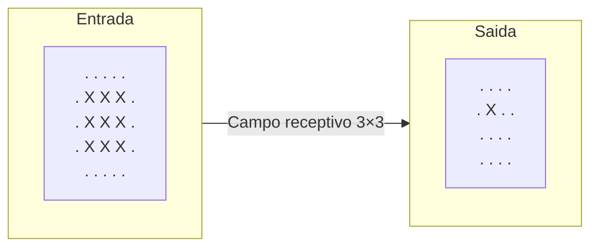

# CNN e Go

Quando a DeepMind escolheu usar **Redes Neurais Convolucionais (CNN)** para processar Go, foi uma decisão de design genial.

As CNNs foram originalmente projetadas para reconhecimento de imagens. Por que também são adequadas para Go? Este artigo explorará em profundidade os princípios de funcionamento das CNNs e sua perfeita adequação ao Go.

---

## Por que CNN é adequada para o tabuleiro?

### O tabuleiro é uma "imagem"

De certa perspectiva, o tabuleiro de Go 19×19 é uma **imagem**:

| Imagem | Tabuleiro de Go |
|--------|-----------------|
| Pixels | Interseções |
| Canais RGB | Planos de características (preto, branco, vazio...) |
| 224×224 | 19×19 |
| Identificar gatos e cães | Avaliar boas e más jogadas |

Esta analogia não é coincidência. As razões pelas quais CNN é boa com imagens também a tornam boa com tabuleiros.

### Três características-chave

CNN tem três características que a tornam especialmente adequada para dados do tipo tabuleiro:

#### 1. Conectividade Local (Local Connectivity)

O kernel de convolução da CNN apenas observa regiões locais, o que combina perfeitamente com as características do Go:

**Reconhecimento de imagem vs Go:**

| Reconhecimento de imagem | Go |
|--------------------------|-----|
| Orelha de gato é característica local | "Olho" é forma local |
| Não precisa ver imagem inteira | Não precisa ver tabuleiro inteiro |

**Região 3×3 - posição do olho:**

|   |   |   |
|:-:|:-:|:-:|
| ○ | ● | ○ |
| ● | · | ● |
| ○ | ● | ○ |

Muitos conceitos de Go são "locais":
- **Olho**: região 2×2 ou 3×3
- **Atari**: região 3×3
- **Conectar, Cortar**: região 2×2

#### 2. Compartilhamento de Pesos (Weight Sharing)

O mesmo kernel de convolução varrerá todo o tabuleiro, o que significa:

> **Um "olho" no canto superior esquerdo do tabuleiro e um "olho" no canto inferior direito são reconhecidos da mesma maneira**

Isso é razoável — as regras do Go não variam com a posição (exceto cantos e bordas, que podem ser tratados com planos de características de borda).

O compartilhamento de pesos também reduz significativamente a quantidade de parâmetros:

| Método | Quantidade de parâmetros |
|--------|-------------------------|
| Rede totalmente conectada | 361 × 361 × canais = dezenas de milhões |
| CNN | 3 × 3 × canais × filtros = milhões |

#### 3. Equivariância de Translação (Translation Equivariance)

Se a entrada é transladada, a saída da CNN também será transladada correspondentemente:

```
Entrada:                     Saída (região de alta probabilidade):
  A B C D E                    A B C D E
1 . . . . .                 1  . . . . .
2 . ● . . .   →             2  . * . . .
3 . . . . .                 3  . . . . .

Entrada após translação:     Saída também transladada:
  A B C D E                    A B C D E
1 . . . . .                 1  . . . . .
2 . . . . .   →             2  . . . . .
3 . . ● . .                 3  . . * . .
```

Isso é importante para Go: a mesma forma local, onde quer que apareça no tabuleiro, deve ter avaliação semelhante.

---

## Operação de Convolução

### Princípio básico

A operação de convolução é o núcleo da CNN. É uma operação de "janela deslizante":



Processo de cálculo (usando o ponto central como exemplo):

```
Saída[2,2] = 1×1 + 1×0 + 1×1 +
             1×0 + 1×1 + 1×0 +
             1×1 + 1×0 + 1×1
           = 1 + 0 + 1 + 0 + 1 + 0 + 1 + 0 + 1
           = 5
```

### Convolução multicanal

Quando a entrada tem múltiplos canais (como 48 planos de características), o kernel de convolução também se torna 3D:



Cada kernel de convolução calcula através de todos os canais de entrada, produzindo um canal de saída.

### Múltiplos filtros

AlphaGo usa 192 filtros, cada um aprendendo características diferentes:



Cada filtro pode aprender formas de pedras diferentes:
- Filtro 1: detecção de olho
- Filtro 2: detecção de ponto de corte
- Filtro 3: detecção de conexão
- ...
- Filtro 192: algum padrão complexo

---

## Campo Receptivo

### O que é campo receptivo?

**Campo Receptivo (Receptive Field)** refere-se a quais posições da entrada afetam uma posição da saída.

#### Convolução de camada única

Ao usar kernel de convolução 3×3, cada posição da saída é afetada apenas pela região 3×3 da entrada:



#### Convolução multicamada

Ao empilhar múltiplas camadas de convolução, o campo receptivo se expande:

| Camadas | Campo Receptivo | Cálculo |
|---------|-----------------|---------|
| 1 | 3×3 | 3 |
| 2 | 5×5 | 3 + (3-1) = 5 |
| 3 | 7×7 | 5 + (3-1) = 7 |
| ... | ... | ... |
| 12 | 25×25 | 3 + 11×2 = 25 |

As 12 camadas de convolução do AlphaGo dão um **campo receptivo de 25×25**, que já excede o tabuleiro de 19×19!

Isso significa:
- **Cada posição da saída pode "ver" todo o tabuleiro**
- Mas a forma de "ver" é diferente: detalhes próximos são claros, distantes são resumidos
- Isso é semelhante à forma como jogadores humanos pensam

### Campo receptivo e Go

O conceito de campo receptivo explica por que o AlphaGo pode lidar com problemas "globais":

```
Problemas locais (campo receptivo 3×3):     Problemas globais (campo receptivo 25×25):
- Há olho aqui?                             - Este grupo tem espaço para olhos?
- Posso fazer atari?                        - A escada é favorável?
- Posso conectar?                           - Como está a situação global?
```

Camadas rasas processam características locais, camadas profundas processam características globais.

---

## Características locais vs globais

### Estrutura hierárquica da CNN

CNN forma naturalmente uma estrutura hierárquica:

```
Camada de entrada:     pedras pretas, brancas, pontos vazios
   ↓
Camadas rasas (1-3):   olho, conectar, cortar, atari
   ↓
Camadas médias (4-8):  formas de pedras, grupos vivos, grupos mortos
   ↓
Camadas profundas (9-12): influência, espessura, pontos importantes
   ↓
Camada de saída:       probabilidade de jogada / taxa de vitória
```

Isso é surpreendentemente semelhante ao processo de aprendizado de Go por humanos:
1. Primeiro aprende regras (onde estão as pedras)
2. Depois aprende táticas (como capturar pedras)
3. Então aprende formas (o que é boa forma)
4. Finalmente aprende visão global (julgamento global)

### Visualização de camadas ocultas

Pesquisadores descobriram que as camadas ocultas da CNN realmente aprendem características significativas:

#### Filtros de camadas rasas

**Filtro A (detecção de olho):**

|   |   |   |
|:-:|:-:|:-:|
| + | - | + |
| - | + | - |
| + | - | + |

**Filtro B (detecção de atari):**

|   |   |   |
|:-:|:-:|:-:|
| + | + | + |
| + | - | - |
| + | + | + |

#### Filtros de camadas profundas

Os filtros de camadas profundas são mais abstratos, difíceis de explicar diretamente, mas capturam padrões complexos de formas de pedras.

---

## Escolha da função de ativação

### ReLU: simples e eficaz

AlphaGo usa **ReLU (Rectified Linear Unit)** após todas as camadas de convolução:

```python
def relu(x):
    return max(0, x)
```

**Ilustração:** A função ReLU produz uma saída de 0 para todas as entradas negativas, e para entradas positivas, a saída é igual à entrada (uma linha reta com inclinação 1 passando pela origem).

### Por que não usar outras funções?

| Função de ativação | Fórmula | Vantagens | Desvantagens |
|-------------------|---------|-----------|--------------|
| ReLU | max(0, x) | Cálculo rápido, bom gradiente | Morte de valores negativos |
| Sigmoid | 1/(1+e^-x) | Saída limitada | Gradiente desaparece |
| Tanh | (e^x-e^-x)/(e^x+e^-x) | Centrado em zero | Gradiente desaparece |
| LeakyReLU | max(0.01x, x) | Resolve problema de morte | Um hiperparâmetro extra |

Para redes profundas, as vantagens do ReLU são óbvias:
1. **Cálculo simples**: apenas comparação e máximo
2. **Gradiente não desaparece**: gradiente é constantemente 1 na região positiva
3. **Ativação esparsa**: muitos neurônios produzem 0, aumentando eficiência

### Significado do ReLU em Go

A esparsidade do ReLU tem uma interpretação interessante em Go:

```
Certo filtro detecta "ponto de corte":
- Há ponto de corte → saída positiva (ativado)
- Sem ponto de corte → saída zero (não ativado)

É como um jogador focando apenas em posições "com eventos"
```

---

## Normalização em Lote

### O que é Normalização em Lote?

**Normalização em Lote (Batch Normalization)** é uma técnica que mantém a distribuição da saída de cada camada estável:

```python
def batch_norm(x, gamma, beta):
    # Calcular média e desvio padrão do lote
    mean = x.mean(axis=0)
    std = x.std(axis=0)

    # Normalização
    x_norm = (x - mean) / (std + 1e-8)

    # Escala e deslocamento
    return gamma * x_norm + beta
```

### Por que é necessário?

#### Deslocamento de Covariante Interno

Quando a rede treina, a distribuição de entrada de cada camada muda conforme os pesos das camadas anteriores mudam. Isso é chamado de "deslocamento de covariante interno":

```
Atualização de pesos da 1ª camada → Mudança na distribuição de saída da 1ª camada
                    ↓
               Mudança na distribuição de entrada da 2ª camada → 2ª camada precisa readaptar
                                        ↓
                                   ... (propaga-se)
```

A normalização em lote estabiliza o treinamento forçando a entrada de cada camada a ter distribuição fixa (média 0, desvio padrão 1).

### Aplicação no AlphaGo

AlphaGo usa normalização em lote após cada camada de convolução, antes da função de ativação:

```
Conv → BatchNorm → ReLU → Conv → BatchNorm → ReLU → ...
```

Benefícios:
1. **Treinamento mais rápido**: pode usar taxas de aprendizado maiores
2. **Mais estável**: reduz sensibilidade à inicialização
3. **Efeito de regularização**: tem leve efeito de dropout

### Processamento na inferência

Durante o treinamento, usa estatísticas do lote atual. Durante a inferência, usa estatísticas de todo o conjunto de treinamento (média móvel):

```python
# Durante treinamento
mean = batch_mean
var = batch_var

# Durante inferência
mean = running_mean  # Média acumulada durante treinamento
var = running_var    # Variância acumulada durante treinamento
```

---

## Configuração específica do AlphaGo

### Arquitetura completa

```
Entrada: 19×19×48

Camada 1:
  Conv2D(5×5, 192 filters, padding='same')
  BatchNorm
  ReLU
  Saída: 19×19×192

Camadas 2-12 (total 11 camadas):
  Conv2D(3×3, 192 filters, padding='same')
  BatchNorm
  ReLU
  Saída: 19×19×192

Camada de saída (Policy):
  Conv2D(1×1, 1 filter)
  Flatten
  Softmax
  Saída: 361 dimensões de probabilidade

Camada de saída (Value):
  Conv2D(1×1, 1 filter)
  Flatten
  Dense(256)
  ReLU
  Dense(1)
  Tanh
  Saída: valor único
```

### Configuração de parâmetros

| Parâmetro | Valor | Descrição |
|-----------|-------|-----------|
| Canais de entrada | 48 | Número de planos de características |
| Número de filtros | 192 | Canais por camada |
| Tamanho do kernel | 3×3 (1ª camada 5×5) | Campo receptivo |
| Número de camadas | 13 (incluindo camada de saída) | Profundidade |
| Função de ativação | ReLU | Não-linearidade |
| Normalização | BatchNorm | Estabiliza treinamento |

### Implementação em PyTorch

```python
import torch
import torch.nn as nn

class AlphaGoCNN(nn.Module):
    def __init__(self, input_channels=48, num_filters=192, num_layers=12):
        super().__init__()

        # Primeira camada (convolução 5×5)
        self.conv1 = nn.Sequential(
            nn.Conv2d(input_channels, num_filters, kernel_size=5, padding=2),
            nn.BatchNorm2d(num_filters),
            nn.ReLU(inplace=True)
        )

        # Camadas intermediárias (convolução 3×3)
        self.conv_layers = nn.Sequential(*[
            nn.Sequential(
                nn.Conv2d(num_filters, num_filters, kernel_size=3, padding=1),
                nn.BatchNorm2d(num_filters),
                nn.ReLU(inplace=True)
            )
            for _ in range(num_layers - 1)
        ])

        # Cabeça de saída Policy
        self.policy_head = nn.Sequential(
            nn.Conv2d(num_filters, 1, kernel_size=1),
            nn.Flatten(),
            nn.Softmax(dim=1)
        )

        # Cabeça de saída Value
        self.value_head = nn.Sequential(
            nn.Conv2d(num_filters, 1, kernel_size=1),
            nn.Flatten(),
            nn.Linear(361, 256),
            nn.ReLU(inplace=True),
            nn.Linear(256, 1),
            nn.Tanh()
        )

    def forward(self, x):
        # Extração de características compartilhadas
        x = self.conv1(x)
        x = self.conv_layers(x)

        # Saídas separadas
        policy = self.policy_head(x)
        value = self.value_head(x)

        return policy, value
```

---

## Comparação com outras arquiteturas

### Rede totalmente conectada

Se usarmos rede totalmente conectada para processar Go:

| Característica | Totalmente conectada | CNN |
|----------------|---------------------|-----|
| Quantidade de parâmetros | Extremamente grande (centenas de milhões) | Menor (milhões) |
| Invariância posicional | Não | Sim |
| Características locais | Difícil de aprender | Captura naturalmente |
| Eficiência de treinamento | Baixa | Alta |

Redes totalmente conectadas não podem aproveitar a estrutura espacial do tabuleiro, sendo extremamente ineficientes.

### Rede Neural Recorrente (RNN)

RNN é adequada para dados sequenciais (como histórico de partidas), mas:

| Característica | RNN | CNN |
|----------------|-----|-----|
| Processamento espacial | Fraco | Forte |
| Processamento sequencial | Forte | Fraco (precisa de planos históricos) |
| Paralelização | Difícil | Fácil |
| Dependências de longo alcance | Precisa de LSTM | Camadas profundas são suficientes |

AlphaGo escolheu CNN + planos históricos, em vez de CNN + RNN.

### Rede Residual (ResNet)

AlphaGo Zero atualizou para ResNet:

```
CNN comum:               ResNet:
  x                        x
  ↓                        ↓
 Conv                     Conv
  ↓                        ↓
 ReLU                    ReLU
  ↓                        ↓
 Conv                     Conv
  ↓                        ↓
  y                      y + x  ← conexão residual
```

Conexões residuais permitem que o gradiente flua mais facilmente, podendo treinar redes mais profundas (40 camadas vs 12 camadas).

Veja [Rede de Duas Cabeças e Rede Residual](../dual-head-resnet) para detalhes.

---

## Compreensão visual

### Processo de convolução

**Tabuleiro de entrada (simplificado para 5×5):**

|   | A | B | C | D | E |
|:-:|:-:|:-:|:-:|:-:|:-:|
| 1 | · | · | · | · | · |
| 2 | · | ● | · | · | · |
| 3 | · | · | ○ | · | · |
| 4 | · | · | · | ● | · |
| 5 | · | · | · | · | · |

**Certo filtro (3×3, detecta "forma de cruz"):**

|   |   |   |
|:-:|:-:|:-:|
| 0 | 1 | 0 |
| 1 | 1 | 1 |
| 0 | 1 | 0 |

**Saída da convolução:** (forte resposta no centro - correspondência de forma de cruz)

|   | A | B | C | D | E |
|:-:|:-:|:-:|:-:|:-:|:-:|
| 1 | 0 | 0 | 0 | 0 | 0 |
| 2 | 0 | 0 | 0 | 0 | 0 |
| 3 | 0 | 0 | 1 | 0 | 0 |
| 4 | 0 | 0 | 0 | 0 | 0 |
| 5 | 0 | 0 | 0 | 0 | 0 |

### Características multicamada

**Saída da 1ª camada (4 de 192 canais):**

**Canal 1 (olho):**

|   |   |   |   |
|:-:|:-:|:-:|:-:|
| 0 | 0 | 0 | 0 |
| 0 | 0.9 | 0 | 0 |
| 0 | 0 | 0 | 0 |
| 0 | 0 | 0 | 0 |

**Canal 2 (borda):**

|   |   |   |   |
|:-:|:-:|:-:|:-:|
| 0.8 | 0 | 0 | 0 |
| 0.8 | 0 | 0 | 0 |
| 0.8 | 0 | 0 | 0 |
| 0.8 | 0 | 0 | 0 |

**Canal 3 (corte):**

|   |   |   |   |
|:-:|:-:|:-:|:-:|
| 0 | 0 | 0 | 0 |
| 0 | 0 | 0.7 | 0 |
| 0 | 0 | 0 | 0 |
| 0 | 0 | 0 | 0 |

**Canal 4 (conexão):**

|   |   |   |   |
|:-:|:-:|:-:|:-:|
| 0 | 0 | 0 | 0 |
| 0 | 0.5 | 0 | 0 |
| 0 | 0.8 | 0 | 0 |
| 0 | 0.5 | 0 | 0 |

Essas características serão combinadas em conceitos mais complexos em camadas mais profundas...

---

## Correspondência de animações

Os conceitos centrais abordados neste artigo e números de animação:

| Número | Conceito | Correspondência física/matemática |
|--------|----------|-----------------------------------|
| D9 | Operação de convolução | Resposta de filtro |
| D10 | Campo receptivo | Local → Global |
| D11 | Normalização em lote | Estabilidade de distribuição |
| D1 | Entrada multicanal | Operação tensorial |

---

## Leitura adicional

- **Artigo anterior**: [Design de características de entrada](../input-features) — Detalhamento dos 48 planos de características
- **Próximo artigo**: [Fase de aprendizado supervisionado](../supervised-learning) — Como aprender com partidas humanas
- **Tópico avançado**: [Rede de Duas Cabeças e Rede Residual](../dual-head-resnet) — Atualização da rede do AlphaGo Zero

---

## Pontos-chave

1. **CNN é naturalmente adequada para tabuleiros**: conectividade local, compartilhamento de pesos, equivariância de translação
2. **Convolução extrai características locais**: reconhecimento de padrões em regiões 3×3
3. **Redes profundas obtêm visão global**: 12 camadas → campo receptivo 25×25
4. **ReLU é rápido e eficaz**: ativação não-linear simples
5. **BatchNorm estabiliza treinamento**: normaliza saída de cada camada

CNN permite que AlphaGo "veja" o tabuleiro — tão naturalmente quanto humanos veem imagens.

---

## Referências

1. LeCun, Y., Bengio, Y., & Hinton, G. (2015). "Deep learning." *Nature*, 521, 436-444.
2. He, K., et al. (2015). "Deep Residual Learning for Image Recognition." *CVPR*.
3. Ioffe, S., & Szegedy, C. (2015). "Batch Normalization: Accelerating Deep Network Training." *ICML*.
4. Krizhevsky, A., Sutskever, I., & Hinton, G. E. (2012). "ImageNet Classification with Deep Convolutional Neural Networks." *NeurIPS*.
