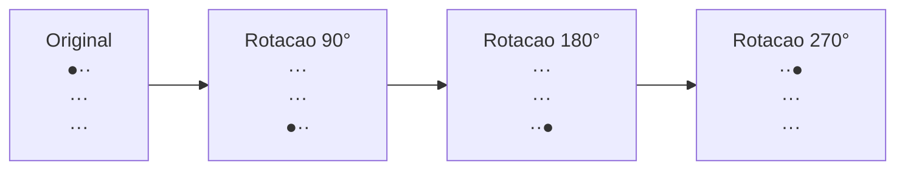
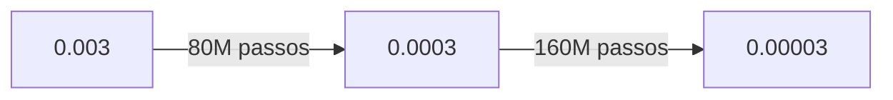
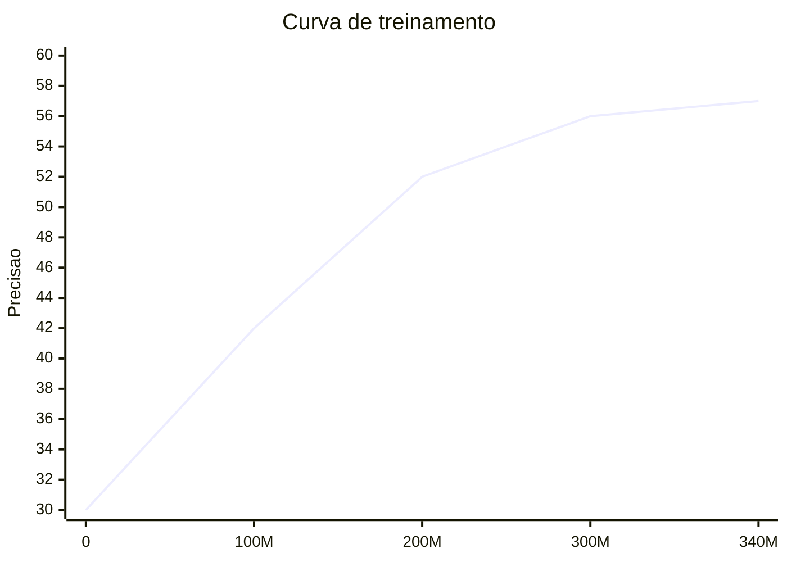

import { EloChart } from '@site/src/components/D3Charts';

# Fase de Aprendizado Supervisionado

Antes que o AlphaGo pudesse jogar contra si mesmo, ele precisou primeiro "assistir" a uma grande quantidade de partidas humanas. Este processo é chamado de **Aprendizado Supervisionado**.

Ao analisar 30 milhões de posições de partidas humanas, a Policy Network do AlphaGo alcançou **57% de precisão de previsão** — capaz de adivinhar o próximo movimento do especialista humano em mais da metade dos casos.

Isso pode não parecer impressionante, mas considerando que cada posição tem em média 250 movimentos legais, é uma conquista notável.

---

## Por que começar com partidas humanas?

### O ponto de partida do aprendizado

Imagine que você precisa ensinar alguém que não sabe absolutamente nada sobre Go. Como você faria?

**Opção A: Exploração aleatória**
```
Deixá-lo jogar aleatoriamente, descobrindo gradualmente o que são boas jogadas
→ Eficiência extremamente baixa, pode nunca aprender
```

**Opção B: Observar mestres jogando**
```
Deixá-lo assistir um grande número de partidas de jogadores profissionais, imitando suas jogadas
→ Após ter uma base, então explorar por conta própria
```

AlphaGo escolheu a opção B. Aprendizado supervisionado é a versão matemática de "observar mestres jogando".

### O valor das partidas humanas

Humanos passaram milhares de anos desenvolvendo a teoria do Go. Todo esse conhecimento está codificado nas partidas:

- **Joseki de abertura**: jogadas de abertura verificadas ao longo do tempo
- **Táticas de meio de jogo**: sabedoria de ataque e defesa
- **Técnicas de endgame**: essência do cálculo de pontos
- **Visão global**: intuição de julgamento geral

O aprendizado supervisionado permite que o AlphaGo "herde" essa sabedoria humana, sem precisar começar do zero.

---

## Fonte dos dados de treinamento

### KGS Go Server

Os dados de treinamento do AlphaGo vieram principalmente do **KGS Go Server** (também conhecido como Kiseido Go Server), uma plataforma de Go online bem conhecida.

#### Características do KGS

| Característica | Descrição |
|----------------|-----------|
| Usuários | Principalmente amadores, também profissionais |
| Faixa de nível | De iniciante a 9 dan profissional |
| Registros de partidas | Partidas completas salvas em SGF |
| Período ativo | 2000 até hoje |

#### Por que escolher KGS?

1. **Grande volume de dados**: milhões de partidas
2. **Formato unificado**: formato SGF fácil de analisar
3. **Etiquetas de nível**: cada usuário tem classificação
4. **Diversidade**: jogadores de diferentes estilos

### 30 milhões de posições

Das partidas do KGS, a DeepMind extraiu aproximadamente **30 milhões de posições**:

```
Dados brutos:
- Cerca de 160.000 partidas
- Cada partida tem cerca de 200 movimentos
- Total ~32 milhões de posições

Filtragem de dados:
- Filtrar partidas de baixo nível
- Filtrar posições de desistência no meio do jogo
- Aproximadamente 30 milhões de posições de alta qualidade no final
```

### Formato dos dados

Cada amostra de treinamento contém:

```python
{
    "board_state": [[0, 1, 2, ...], ...],  # Tabuleiro 19×19
    "features": [...],                      # 48 planos de características
    "next_move": 123,                       # Posição jogada pelo humano (0-360)
    "game_result": 1,                       # 1=preto vence, -1=branco vence
    "player_rank": "5d",                    # Nível do jogador que fez o movimento
}
```

---

## Pré-processamento de dados

### Análise de SGF

SGF (Smart Game Format) é o formato padrão para partidas de Go:

```
(;GM[1]FF[4]CA[UTF-8]AP[CGoban:3]ST[2]
RU[Japanese]SZ[19]KM[6.50]
PW[White]PB[Black]
;B[pd];W[dd];B[pq];W[dp];B[qk];W[nc]...
)
```

Precisa extrair:
- Tamanho do tabuleiro (SZ[19])
- Cada movimento (B[pd], W[dd]...)
- Resultado da partida (RE[B+2.5])

```python
def parse_sgf(sgf_string):
    """Analisar partida SGF"""
    moves = []
    # Extrair todos os movimentos
    pattern = r';([BW])\[([a-s]{2})\]'
    for match in re.finditer(pattern, sgf_string):
        color = match.group(1)  # 'B' or 'W'
        coord = match.group(2)  # 'pd', 'dd', etc.

        # Converter coordenadas
        x = ord(coord[0]) - ord('a')
        y = ord(coord[1]) - ord('a')

        moves.append((color, x, y))

    return moves
```

### Extração de características

Para cada posição, extrair 48 planos de características (veja [Design de características de entrada](../input-features)):

```python
def extract_features(board, history, current_player):
    """Extrair 48 planos de características"""
    features = np.zeros((48, 19, 19))

    # Posição das pedras
    features[0] = (board == 1)  # Pedras pretas
    features[1] = (board == 2)  # Pedras brancas
    features[2] = (board == 0)  # Pontos vazios

    # Histórico
    for i, hist in enumerate(history[:8]):
        features[3+i] = (hist == 1)
        features[11+i] = (hist == 2)

    # Liberdades, atari, escada, etc...
    # (implementação detalhada omitida)

    return features
```

### Aumento de dados

O tabuleiro de Go tem **8 simetrias** (4 rotações × 2 reflexões). Cada amostra original pode se tornar 8:



Cada um espelhado horizontalmente, obtendo 8 amostras de treinamento equivalentes

Isso aumenta os dados de treinamento efetivos em 8 vezes, garantindo que os padrões aprendidos pelo modelo não dependam de uma direção específica.

```python
def augment(state, action):
    """Aumento de 8 simetrias"""
    augmented = []

    for rotation in [0, 1, 2, 3]:  # 0, 90, 180, 270 graus
        rotated_state = np.rot90(state, rotation, axes=(1, 2))
        rotated_action = rotate_action(action, rotation)
        augmented.append((rotated_state, rotated_action))

        # Espelho horizontal
        flipped_state = np.flip(rotated_state, axis=2)
        flipped_action = flip_action(rotated_action)
        augmented.append((flipped_state, flipped_action))

    return augmented
```

---

## Função de perda

### Perda de entropia cruzada

O aprendizado supervisionado usa **Perda de Entropia Cruzada (Cross-Entropy Loss)** para treinar a Policy Network:

```
L(θ) = -Σ log p_θ(a | s)
```

Onde:
- `s`: estado do tabuleiro
- `a`: posição real jogada pelo humano (rótulo)
- `p_θ(a | s)`: probabilidade prevista pelo modelo para essa posição

### Compreensão intuitiva

A perda de entropia cruzada mede "a diferença entre a previsão do modelo e o rótulo":

| Cenário | Previsão do modelo | Perda | Descrição |
|---------|-------------------|-------|-----------|
| Previsão perfeita | probabilidade de a = 1.0 | 0 | Melhor |
| Confiante e correto | probabilidade de a = 0.9 | 0.1 | Muito bom |
| Incerto mas correto | probabilidade de a = 0.5 | 0.7 | Razoável |
| Previsão errada | probabilidade de a = 0.1 | 2.3 | Muito ruim |
| Completamente errado | probabilidade de a = 0.01 | 4.6 | Pior |

A função de perda impulsiona o modelo a aumentar a probabilidade da posição correta.

### Comparação com MSE

Por que não usar Erro Quadrático Médio (MSE)?

```python
# MSE:
loss_mse = (prediction - target)^2

# Cross-Entropy:
loss_ce = -log(prediction[target])
```

| Característica | MSE | Cross-Entropy |
|----------------|-----|---------------|
| Tipo de objetivo | Regressão (valor contínuo) | Classificação (distribuição de probabilidade) |
| Comportamento do gradiente | Erro maior, gradiente maior | Erro confiante, gradiente maior |
| Cenário adequado | Value Network | Policy Network |

A Policy Network produz uma distribuição de probabilidade de 361 classes, entropia cruzada é a escolha natural.

---

## Processo de treinamento

### Configuração de hardware

A DeepMind usou recursos computacionais extensivos:

| Recurso | Quantidade |
|---------|-----------|
| GPU | 50 |
| Tempo de treinamento | Cerca de 3 semanas |
| Tamanho do lote | 16 |
| Total de passos de treinamento | ~340M |

### Otimizador

Usando **Descida de Gradiente Estocástico (SGD) + momentum**:

```python
optimizer = torch.optim.SGD(
    model.parameters(),
    lr=0.003,         # Taxa de aprendizado inicial
    momentum=0.9,     # Coeficiente de momentum
    weight_decay=1e-4 # Regularização L2
)
```

#### Por que SGD em vez de Adam?

Em 2016, SGD + momentum ainda era a escolha principal para tarefas de imagem. Na verdade, pesquisas posteriores (incluindo KataGo) descobriram que otimizadores do tipo Adam podem ser melhores.

### Agendamento da taxa de aprendizado

A taxa de aprendizado decai gradualmente durante o treinamento:

```python
scheduler = torch.optim.lr_scheduler.StepLR(
    optimizer,
    step_size=80_000_000,  # A cada 80M passos
    gamma=0.1              # Taxa de aprendizado multiplicada por 0.1
)
```



### Loop de treinamento

```python
def train_epoch(model, dataloader, optimizer):
    model.train()
    total_loss = 0
    correct = 0
    total = 0

    for batch in dataloader:
        states, actions = batch

        # Forward pass
        policy = model(states)  # (batch, 361)

        # Calcular perda
        loss = F.cross_entropy(policy, actions)

        # Backward pass
        optimizer.zero_grad()
        loss.backward()
        optimizer.step()

        # Estatísticas
        total_loss += loss.item()
        predictions = policy.argmax(dim=1)
        correct += (predictions == actions).sum().item()
        total += actions.size(0)

    accuracy = correct / total
    avg_loss = total_loss / len(dataloader)

    return avg_loss, accuracy
```

### Curva de treinamento

Processo de treinamento típico:



Perda e precisão melhoram rapidamente, depois estabilizam.

---

## Análise de resultados

### 57% de precisão

Após treinamento completo, a Policy Network alcançou **57.0% de precisão top-1**.

#### O que é precisão top-1?

```
Previsão: modelo produz 361 probabilidades
Top-1: posição com maior probabilidade
Precisão: proporção em que esta posição é igual à posição realmente jogada pelo humano
```

57% significa: o modelo tem mais da metade de chance de adivinhar o próximo movimento do especialista humano.

### Comparação com outros programas

| Programa | Precisão Top-1 | Descrição |
|----------|---------------|-----------|
| Seleção aleatória | 0.4% | Linha de base |
| Características tradicionais + modelo linear | ~24% | Nível de 2008 |
| CNN rasa | ~44% | Nível de 2014 |
| **AlphaGo Policy Network** | **57%** | Avanço de 2016 |
| AlphaGo Zero | ~60% | 2017 |

A CNN profunda da DeepMind melhorou 13 pontos percentuais em relação ao melhor método anterior.

### Avaliação de força de jogo

Força de jogo usando apenas a Policy Network (sem busca):

<EloChart mode="training" width={600} height={350} />

| Configuração | Classificação Elo | Nível aproximado |
|--------------|-------------------|------------------|
| Melhor tradicional (Pachi) | ~2500 | Amador 4-5 dan |
| SL Policy Network | ~2800 | Amador 6-7 dan |

Aprendizado supervisionado puro já alcançou nível amador alto, isso foi um grande avanço em 2016.

### Precisão vs força de jogo

Interessantemente, precisão e força de jogo não têm relação linear:

```
Precisão:  44% → 57% (melhoria de 13%)
Elo:    ~2500 → ~2800 (melhoria de ~300)

Proporção de melhoria de precisão: 13% / 44% ≈ 30%
Proporção de melhoria de Elo: 300 / 2500 ≈ 12%
```

Pequenas melhorias na precisão podem trazer melhorias significativas na força de jogo, porque:
- Escolhas corretas em posições críticas são mais importantes
- Evitar erros óbvios é mais importante do que jogar muitas boas jogadas

---

## Limitações do aprendizado supervisionado

### Problema 1: Efeito teto

O aprendizado supervisionado só pode alcançar "nível humano", não pode ultrapassar:

```
Objetivo da SL Policy: imitar humanos
          ↓
Se humanos têm hábitos errados
          ↓
SL Policy também aprenderá esses erros
```

Por exemplo, se os jogadores nos dados de treinamento raramente jogam jogadas não-tradicionais como "Movimento 37", a SL Policy também não aprenderá.

### Problema 2: Não consegue distinguir boas e más jogadas

O aprendizado supervisionado só olha "o que o humano jogou", não se a jogada foi boa:

```
Posição A: humano jogou K10 (na verdade é jogada ruim)
Posição B: humano jogou Q4 (boa jogada)

SL Policy trata igualmente, deve aprender ambas
```

Os dados de treinamento incluem partidas de amadores, que contêm muitos erros. SL Policy aprenderá esses erros.

### Problema 3: Exploração insuficiente

SL Policy só aprende jogadas já conhecidas pelos humanos:

```
Conjunto de jogadas humanas: {A, B, C, D, E}
           ↓
SL Policy só escolherá entre essas jogadas
           ↓
Pode existir jogada melhor F, mas nunca foi descoberta
```

Esta é a limitação fundamental do aprendizado supervisionado: só pode aprender o que existe nos dados de treinamento.

### Solução: Aprendizado por reforço

Para superar humanos, AlphaGo realizou **aprendizado por reforço** após o aprendizado supervisionado:

```
SL Policy (nível humano)
      ↓ Autopartida
RL Policy (supera humanos)
```

Veja [Introdução ao Aprendizado por Reforço](../reinforcement-intro) e [Autopartida](../self-play) para detalhes.

---

## Pontos de implementação

### Código de treinamento completo

```python
import torch
import torch.nn as nn
import torch.optim as optim
from torch.utils.data import DataLoader, Dataset

class GoDataset(Dataset):
    def __init__(self, data_path):
        # Carregar dados pré-processados
        self.states = np.load(f"{data_path}/states.npy")
        self.actions = np.load(f"{data_path}/actions.npy")

    def __len__(self):
        return len(self.states)

    def __getitem__(self, idx):
        state = torch.FloatTensor(self.states[idx])
        action = torch.LongTensor([self.actions[idx]])[0]
        return state, action

def train_policy_network():
    # Modelo
    model = PolicyNetwork(input_channels=48, num_filters=192, num_layers=12)
    model = model.cuda()

    # Dados
    dataset = GoDataset("data/kgs")
    dataloader = DataLoader(
        dataset, batch_size=16, shuffle=True, num_workers=4
    )

    # Otimizador
    optimizer = optim.SGD(
        model.parameters(),
        lr=0.003,
        momentum=0.9,
        weight_decay=1e-4
    )
    scheduler = optim.lr_scheduler.StepLR(optimizer, step_size=80_000_000, gamma=0.1)

    # Loop de treinamento
    best_accuracy = 0

    for epoch in range(100):
        model.train()
        total_loss = 0
        correct = 0
        total = 0

        for states, actions in dataloader:
            states = states.cuda()
            actions = actions.cuda()

            # Forward pass
            policy = model(states)
            loss = nn.functional.cross_entropy(policy, actions)

            # Backward pass
            optimizer.zero_grad()
            loss.backward()
            optimizer.step()
            scheduler.step()

            # Estatísticas
            total_loss += loss.item()
            predictions = policy.argmax(dim=1)
            correct += (predictions == actions).sum().item()
            total += actions.size(0)

        accuracy = correct / total
        print(f"Epoch {epoch}: Loss={total_loss/len(dataloader):.4f}, Acc={accuracy:.4f}")

        # Salvar melhor modelo
        if accuracy > best_accuracy:
            best_accuracy = accuracy
            torch.save(model.state_dict(), "best_policy.pth")

    print(f"Best accuracy: {best_accuracy:.4f}")
```

### Código de avaliação

```python
def evaluate_policy(model, test_dataloader):
    model.eval()

    correct_top1 = 0
    correct_top5 = 0
    total = 0

    with torch.no_grad():
        for states, actions in test_dataloader:
            states = states.cuda()
            actions = actions.cuda()

            policy = model(states)

            # Precisão Top-1
            top1_pred = policy.argmax(dim=1)
            correct_top1 += (top1_pred == actions).sum().item()

            # Precisão Top-5
            top5_pred = policy.topk(5, dim=1)[1]
            for i, action in enumerate(actions):
                if action in top5_pred[i]:
                    correct_top5 += 1

            total += actions.size(0)

    print(f"Top-1 Accuracy: {correct_top1/total:.4f}")
    print(f"Top-5 Accuracy: {correct_top5/total:.4f}")
```

### Problemas comuns e soluções

| Problema | Sintoma | Solução |
|----------|---------|---------|
| Overfitting | Alta precisão de treinamento, baixa precisão de teste | Aumentar aumento de dados, Dropout |
| Treinamento instável | Perda oscila muito | Diminuir taxa de aprendizado, aumentar tamanho do lote |
| Convergência lenta | Precisão estagnada | Ajustar taxa de aprendizado, verificar dados |
| Memória insuficiente | Erro OOM | Diminuir tamanho do lote, usar precisão mista |

---

## Correspondência de animações

Os conceitos centrais abordados neste artigo e números de animação:

| Número | Conceito | Correspondência física/matemática |
|--------|----------|-----------------------------------|
| D3 | Aprendizado supervisionado | Estimação de máxima verossimilhança |
| D5 | Perda de entropia cruzada | Divergência KL |
| D6 | Descida de gradiente | Otimização |
| A6 | Pré-processamento de dados | Normalização |

---

## Leitura adicional

- **Artigo anterior**: [CNN e Go](../cnn-and-go) — Como redes neurais convolucionais processam o tabuleiro
- **Próximo artigo**: [Introdução ao Aprendizado por Reforço](../reinforcement-intro) — A chave para superar humanos
- **Tópico relacionado**: [Detalhamento da Policy Network](../policy-network) — Detalhes da arquitetura da rede

---

## Pontos-chave

1. **Partidas do KGS são a fonte de dados de treinamento**: cerca de 30 milhões de posições de alta qualidade
2. **Perda de entropia cruzada impulsiona o aprendizado**: faz o modelo aumentar a probabilidade da posição correta
3. **57% de precisão é um grande avanço**: superando o melhor método anterior em 13 pontos percentuais
4. **Aumento de 8 simetrias**: aumenta efetivamente os dados de treinamento
5. **Aprendizado supervisionado tem teto**: não pode superar o nível dos dados de treinamento

O aprendizado supervisionado é o "ponto de partida" do AlphaGo — ele herdou milhares de anos de sabedoria humana do Go, estabelecendo a base para o subsequente aprendizado por reforço.

---

## Referências

1. Silver, D., et al. (2016). "Mastering the game of Go with deep neural networks and tree search." *Nature*, 529, 484-489.
2. Maddison, C. J., et al. (2014). "Move Evaluation in Go Using Deep Convolutional Neural Networks." *arXiv:1412.6564*.
3. Clark, C., & Storkey, A. (2015). "Training Deep Convolutional Neural Networks to Play Go." *ICML*.
4. KGS Game Archives: [https://www.gokgs.com/archives.jsp](https://www.gokgs.com/archives.jsp)
