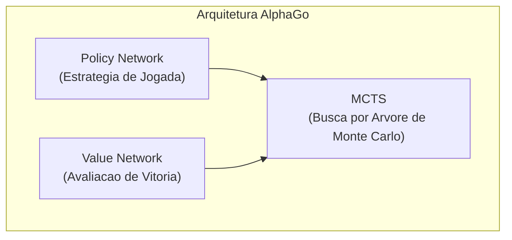
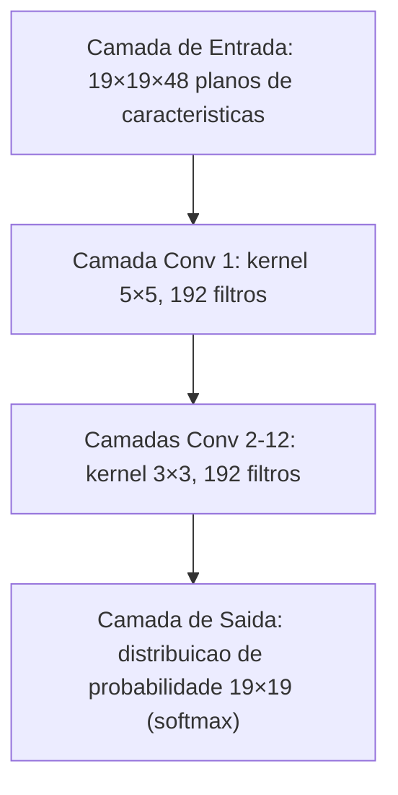
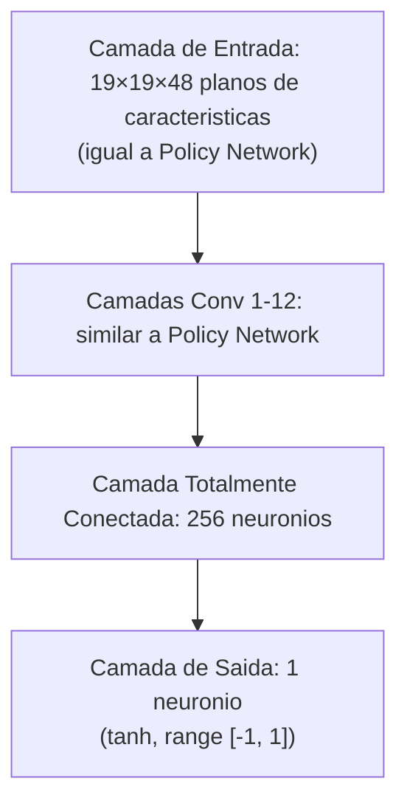
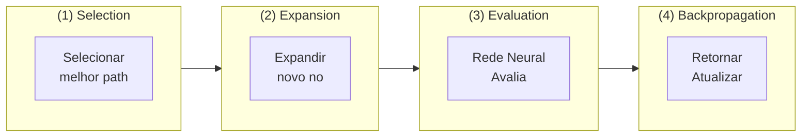
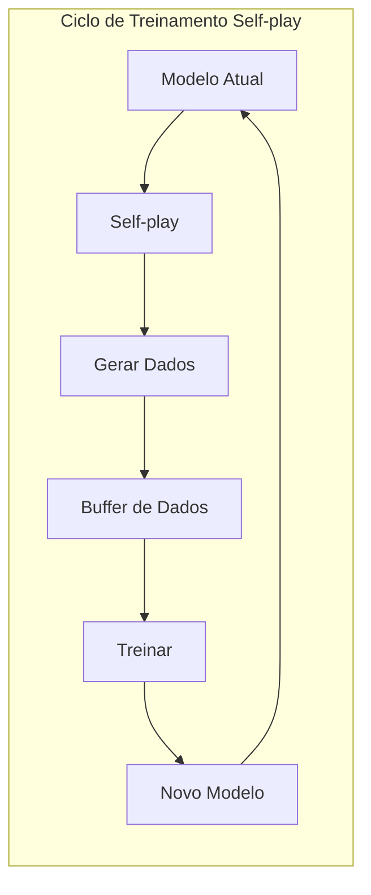
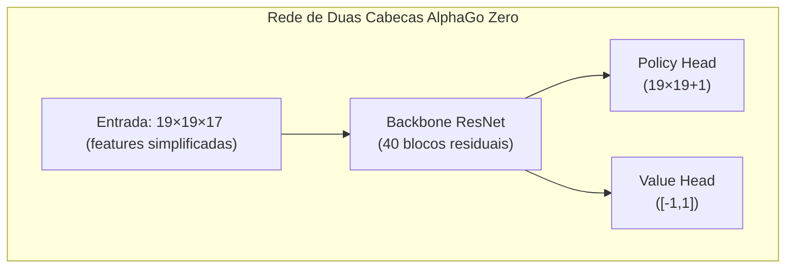

# Analise do Artigo AlphaGo

Este artigo analisa profundamente o artigo classico publicado na Nature pela DeepMind: "Mastering the game of Go with deep neural networks and tree search", bem como os artigos subsequentes do AlphaGo Zero e AlphaZero.

## Significado Historico do AlphaGo

O Go foi por muito tempo visto como o desafio "Santo Graal" da inteligencia artificial. Diferente do xadrez, o espaco de busca do Go e extremamente vasto:

| Jogo | Fator de Ramificacao Medio | Comprimento Medio do Jogo | Espaco de Estados |
|------|-------------|-------------|----------|
| Xadrez | ~35 | ~80 | ~10^47 |
| Go | ~250 | ~150 | ~10^170 |

Metodos tradicionais de busca por forca bruta sao completamente inviaveis no Go. A vitoria do AlphaGo sobre Lee Sedol em 2016 demonstrou o tremendo poder da combinacao de aprendizado profundo com aprendizado por reforco.

### Eventos Marcantes

- **Outubro 2015**: AlphaGo Fan derrota o campeao europeu Fan Hui (profissional 2-dan) por 5:0
- **Marco 2016**: AlphaGo Lee derrota o campeao mundial Lee Sedol (profissional 9-dan) por 4:1
- **Maio 2017**: AlphaGo Master derrota Ke Jie, numero 1 do mundo, por 3:0
- **Outubro 2017**: AlphaGo Zero publicado, treinamento puro por self-play, superando todas as versoes anteriores

## Arquitetura Tecnica Central

A inovacao central do AlphaGo esta em combinar tres tecnologias-chave:



### Policy Network (Rede de Estrategia)

A Policy Network e responsavel por prever a probabilidade de jogada para cada posicao, usada para guiar a direcao da busca.

#### Arquitetura da Rede



#### Caracteristicas de Entrada

AlphaGo usa 48 planos de caracteristicas como entrada:

| Caracteristica | Num Planos | Descricao |
|------|--------|------|
| Cor da pedra | 3 | Preta, branca, vazia |
| Liberdades | 8 | 1, 2, ..., 8+ liberdades |
| Liberdades apos captura | 8 | Quantas liberdades apos capturar |
| Num de capturas | 8 | Quantas pedras podem ser capturadas nessa posicao |
| Ko | 1 | Se e posicao de ko |
| Jogada legal | 1 | Se a posicao e jogavel |
| Posicoes das ultimas 1-8 jogadas | 8 | Posicoes das jogadas anteriores |
| De quem e a vez | 1 | Atualmente vez de preto ou branco |

#### Metodo de Treinamento

O treinamento da Policy Network e dividido em duas fases:

**Fase 1: Aprendizado Supervisionado (SL Policy Network)**
- Usa 30 milhoes de registros de jogos do servidor KGS
- Objetivo: Prever a proxima jogada de jogadores humanos
- Atinge 57% de precisao de predicao

**Fase 2: Aprendizado por Reforco (RL Policy Network)**
- Comeca da SL Policy Network
- Joga contra versoes anteriores de si mesmo
- Usa algoritmo REINFORCE para otimizar

```python
# Policy Gradient update simplificado
# reward: +1 vitoria, -1 derrota
loss = -log(policy[action]) * reward
```

### Value Network (Rede de Valor)

A Value Network avalia a taxa de vitoria da posicao atual, usada para reduzir a profundidade de busca.

#### Arquitetura da Rede



#### Metodo de Treinamento

A Value Network e treinada usando 30 milhoes de posicoes geradas por self-play da RL Policy Network:

- Amostra aleatoriamente uma posicao de cada jogo
- Usa resultado final do jogo como label
- Usa funcao de perda MSE

```python
# Treinamento da Value Network
value_prediction = value_network(position)
loss = (value_prediction - game_outcome) ** 2
```

**Por que amostrar apenas uma posicao por jogo?**

Se amostrar multiplas posicoes, posicoes adjacentes do mesmo jogo serao altamente correlacionadas, levando a overfitting. Amostragem aleatoria garante diversidade nos dados de treinamento.

## Busca por Arvore de Monte Carlo (MCTS)

MCTS e o nucleo de decisao do AlphaGo, combinando redes neurais para buscar eficientemente a melhor jogada.

### Quatro Passos do MCTS



### Formula de Selecao (PUCT)

AlphaGo usa a formula PUCT (Predictor + UCT) para selecionar qual ramo explorar:

```
a = argmax[Q(s,a) + u(s,a)]

u(s,a) = c_puct * P(s,a) * sqrt(N(s)) / (1 + N(s,a))
```

Onde:
- **Q(s,a)**: Valor medio da acao a (exploitation)
- **P(s,a)**: Probabilidade prior prevista pela Policy Network
- **N(s)**: Numero de visitas do no pai
- **N(s,a)**: Numero de visitas desta acao
- **c_puct**: Constante de exploracao, equilibrando exploration e exploitation

### Detalhes do Processo de Busca

1. **Selection**: Do no raiz, use a formula PUCT para selecionar acoes ate chegar ao no folha
2. **Expansion**: Expanda novos nos filhos no no folha, inicialize probabilidades prior com Policy Network
3. **Evaluation**: Combine avaliacao da Value Network com simulacao de rollout rapido para avaliar valor
4. **Backpropagation**: Propague valor de avaliacao pelo caminho, atualize valores Q e N

### Rollout (Simulacao Rapida)

AlphaGo (versao nao-Zero) tambem usa uma pequena rede de estrategia rapida para simulacao:

```
No folha → Jogadas rapidas aleatorias ate fim do jogo → Calcular resultado
```

O valor final de avaliacao combina Value Network e Rollout:

```
V = λ * v_network + (1-λ) * v_rollout
```

AlphaGo usa λ = 0.5, dando peso igual a ambos.

## Metodo de Treinamento Self-play

Self-play e a estrategia central de treinamento do AlphaGo, permitindo que a IA melhore continuamente jogando contra si mesma.

### Ciclo de Treinamento



### Por que Self-play e Efetivo?

1. **Dados infinitos**: Nao limitado pela quantidade de registros humanos
2. **Dificuldade adaptativa**: Forca do oponente melhora junto com voce
3. **Exploracao e inovacao**: Nao restrito por padroes de pensamento humano
4. **Objetivo claro**: Otimiza diretamente taxa de vitoria, nao imitacao de humanos

## Melhorias do AlphaGo Zero

O AlphaGo Zero publicado em 2017 trouxe melhorias revolucionarias:

### Principais Diferencas

| Caracteristica | AlphaGo | AlphaGo Zero |
|------|---------|--------------|
| Treinamento inicial | Aprendizado supervisionado de registros humanos | Comeca completamente do zero |
| Arquitetura de rede | Policy/Value separadas | Rede unica de duas cabecas |
| Estrutura de rede | CNN comum | ResNet |
| Engenharia de features | 48 features manuais | 17 features simples |
| Rollout | Necessario | Nao necessario |
| Tempo de treinamento | Meses | 3 dias para superar humanos |

### Simplificacao da Arquitetura



### Features de Entrada Simplificadas

AlphaGo Zero usa apenas 17 planos de caracteristicas:

- 8 planos: Posicoes das suas ultimas 8 jogadas
- 8 planos: Posicoes das ultimas 8 jogadas do oponente
- 1 plano: De quem e a vez (todo 0 ou todo 1)

### Melhorias no Treinamento

1. **Self-play puro**: Nao usa nenhum dado humano
2. **Usa probabilidades MCTS diretamente como alvo de treinamento**: Em vez de vitoria/derrota binaria
3. **Sem Rollout**: Depende completamente da Value Network
4. **Treinamento de rede unica**: Policy e Value compartilham parametros, reforcando-se mutuamente

## Generalizacao do AlphaZero

O AlphaZero publicado no final de 2017 aplicou a mesma arquitetura a Go, xadrez e shogi:

### Caracteristicas-chave

- **Zero conhecimento de dominio**: Nao usa nenhum conhecimento especifico do dominio alem das regras do jogo
- **Arquitetura unificada**: Mesmo algoritmo aplicavel a diferentes jogos de tabuleiro
- **Treinamento mais rapido**:
  - Go: 8 horas para superar AlphaGo Lee
  - Xadrez: 4 horas para superar Stockfish
  - Shogi: 2 horas para superar Elmo

### Diferencas do AlphaGo Zero

| Caracteristica | AlphaGo Zero | AlphaZero |
|------|-------------|-----------|
| Jogo alvo | Apenas Go | Go, xadrez, shogi |
| Uso de simetria | Usa 8 simetrias do Go | Nao assume simetria |
| Ajuste de hiperparametros | Otimizado para Go | Configuracoes universais |
| Metodo de treinamento | Self-play do melhor modelo | Self-play do modelo mais recente |

## Pontos-chave de Implementacao

Se voce quiser implementar um sistema similar, aqui estao as principais consideracoes:

### Recursos Computacionais

O treinamento do AlphaGo requer recursos computacionais enormes:

- **AlphaGo Lee**: 176 GPUs + 48 TPUs
- **AlphaGo Zero**: 4 TPUs (treinamento) + 1 TPU (self-play)
- **AlphaZero**: 5000 TPUs (treinamento)

### Hiperparametros-chave

```python
# Relacionados a MCTS
num_simulations = 800     # Simulacoes de busca por jogada
c_puct = 1.5              # Constante de exploracao
temperature = 1.0         # Parametro de temperatura para selecao de acao

# Relacionados a treinamento
batch_size = 2048
learning_rate = 0.01      # Com decay
l2_regularization = 1e-4
```

### Problemas Comuns

1. **Treinamento instavel**: Use learning rate menor, aumente batch size
2. **Overfitting**: Garanta diversidade nos dados de treinamento, use regularizacao
3. **Eficiencia de busca**: Otimize inferencia em batch na GPU, paralelizacao do MCTS

## Leitura Adicional

- [Artigo original: Mastering the game of Go with deep neural networks and tree search](https://www.nature.com/articles/nature16961)
- [Artigo AlphaGo Zero: Mastering the game of Go without human knowledge](https://www.nature.com/articles/nature24270)
- [Artigo AlphaZero: A general reinforcement learning algorithm that masters chess, shogi, and Go through self-play](https://www.science.org/doi/10.1126/science.aar6404)

Apos entender a tecnologia do AlphaGo, vamos ver como o [KataGo fez melhorias com base nisso](./katago-paper.md).

