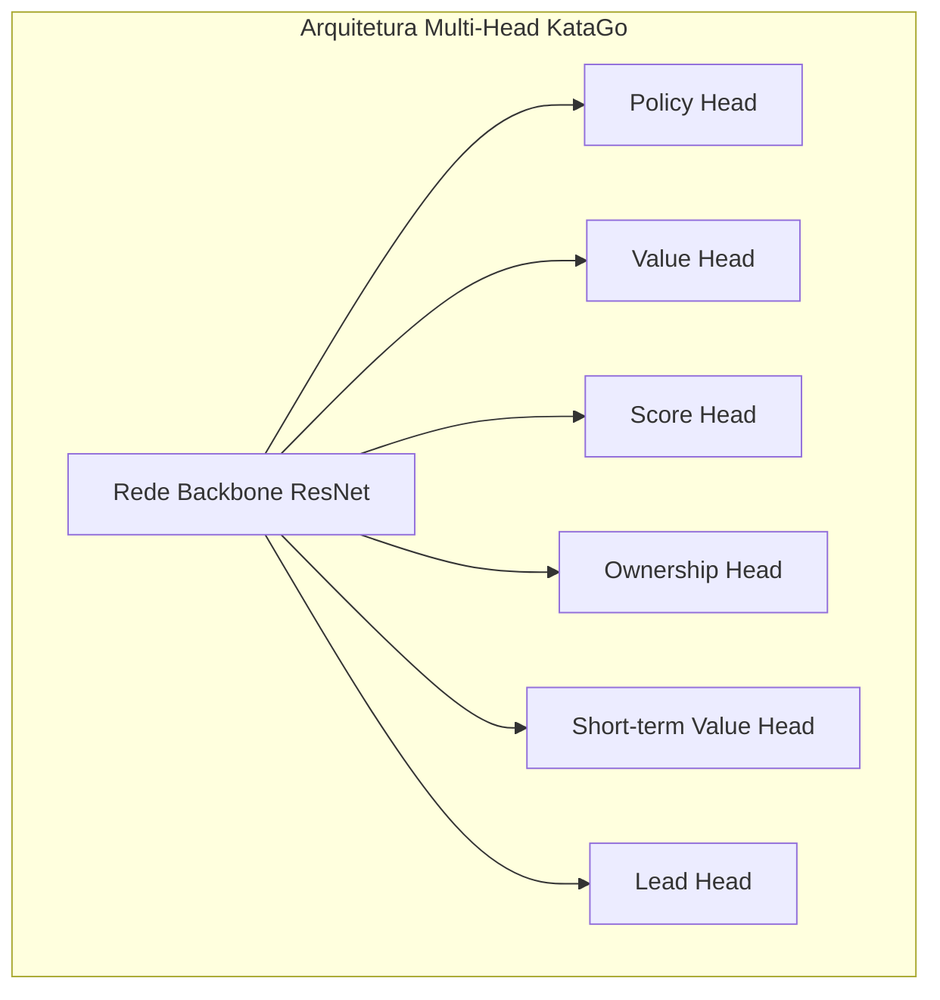
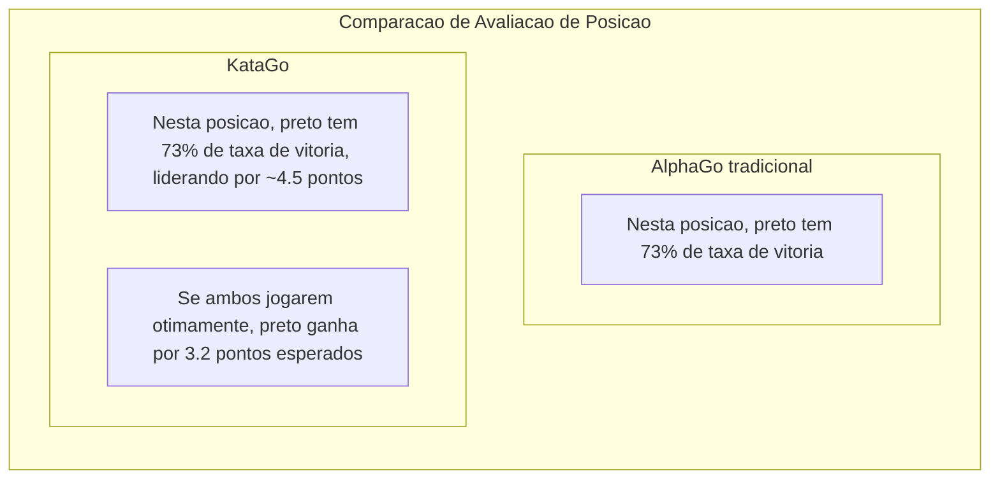

# Analise do Artigo KataGo

KataGo e uma IA de Go de codigo aberto desenvolvida por David Wu, cujo artigo "Accelerating Self-Play Learning in Go" foi publicado em 2019. KataGo alcanca forca superior ao ELF OpenGo com menos recursos computacionais, sendo atualmente a IA de Go de codigo aberto mais poderosa.

## Inovacoes do KataGo

KataGo nao fez mudancas revolucionarias na arquitetura da rede neural, mas realizou otimizacoes sistematicas em metodos de treinamento e tarefas auxiliares, alcancando melhorias significativas de eficiencia.

### Visao Geral das Inovacoes Principais

| Inovacao | Efeito |
|--------|------|
| Alvos de treinamento auxiliares | Acelera aprendizado, fornece mais sinais de supervisao |
| Estrutura de pooling global | Captura melhor informacao global |
| Suporte a multiplas regras | Modelo unico se adapta a diferentes regras de competicao |
| Randomizacao de Playout Cap | Melhora eficiencia de treinamento |
| Data augmentation melhorado | Aumenta diversidade dos dados de treinamento |

## Metodos de Treinamento Mais Eficientes

### Alvos de Treinamento Auxiliares

O AlphaGo Zero tradicional tem apenas dois alvos de treinamento:
1. Policy: Prever distribuicao de probabilidade de jogada do MCTS
2. Value: Prever resultado do jogo

KataGo adiciona multiplos alvos de treinamento auxiliares, fornecendo sinais de aprendizado mais ricos:



#### Descricao de Cada Output Head

| Output Head | Dimensao | Alvo de Predicao |
|--------|------|----------|
| **Policy** | 19x19+1 | Probabilidade de jogada para cada posicao (incluindo pass) |
| **Value** | 3 | Probabilidade de vitoria/derrota/empate |
| **Score** | Valor continuo | Preve diferenca de pontos final |
| **Ownership** | 19x19 | Pertencimento final de cada ponto (territorio preto/branco) |
| **Short-term Value** | 1 | Taxa de vitoria esperada no curto prazo |
| **Lead** | 1 | Quantos pontos esta na frente atualmente |

### Por que Alvos Auxiliares sao Efetivos?

1. **Sinais de supervisao mais densos**: Value fornece apenas um numero, enquanto Ownership fornece 361 pontos de supervisao
2. **Reduz overfitting**: Aprendizado multi-tarefa tem efeito de regularizacao
3. **Acelera convergencia**: Tarefas auxiliares ajudam a rede a aprender representacoes uteis mais rapidamente
4. **Fornece melhores gradientes**: Evita problema de gradiente desaparecendo

### Randomizacao de Playout Cap

AlphaGo Zero realiza fixamente 800 simulacoes MCTS por jogada. KataGo introduz randomizacao:

```python
# Metodo tradicional
num_playouts = 800  # Fixo

# Metodo KataGo
playout_cap = random.choice([
    100, 200, 300, 400, 500, 600, 700, 800
])
```

**Beneficios**:
- Dados de treinamento mais diversos
- Modelo aprende a fazer julgamentos razoaveis em diferentes profundidades de busca
- Bom desempenho mesmo com menos busca durante jogo real

### Melhorias no Data Augmentation

Metodos tradicionais usam as 8 simetrias do Go (4 rotacoes x 2 espelhamentos) para data augmentation. KataGo melhora ainda mais:

- **Transformacao de simetria aleatoria**: Escolhe transformacao de simetria aleatoriamente a cada amostragem
- **Randomizacao de estados historicos**: Escolhe aleatoriamente como representar tabuleiros historicos
- **Randomizacao de cor**: Troca aleatoriamente perspectiva preto/branco

## Suporte a Multiplas Regras de Go

Esta e uma caracteristica importante do KataGo. Diferentes regras de Go afetam decisoes estrategicas:

### Principais Diferencas de Regras

| Sistema de Regras | Metodo de Pontuacao | Komi | Regra de Ko | Suicidio |
|---------|---------|------|---------|------|
| Regras Chinesas | Contagem de area | 7.5 pontos | Ko simples | Proibido |
| Regras Japonesas | Contagem de territorio | 6.5 pontos | Superko | Proibido |
| Regras Coreanas | Contagem de territorio | 6.5 pontos | Superko | Proibido |
| Regras Ing | Contagem de area | 8 pontos | Regra de ko especial | Proibido |
| Tromp-Taylor | Contagem de area | Ajustavel | Superko | Permitido |
| Regras AGA | Area/Territorio | 7.5 pontos | Superko | Proibido |
| Regras NZ | Contagem de area | 7 pontos | Ko simples | Permitido |

### Implementacao Tecnica

KataGo codifica informacao de regras como caracteristicas de entrada:

```python
# Exemplo de caracteristicas de entrada relacionadas a regras
rule_features = {
    'komi': 7.5,           # Valor do komi
    'scoring_rule': 'area', # Contagem de area/territorio
    'ko_rule': 'simple',    # Regra de ko
    'suicide_allowed': False,
    'tax_rule': 'none',     # Se ha "imposto" de olhos
    # ...
}
```

A rede aprende a ajustar estrategia com base em diferentes regras. Por exemplo:
- Contagem de territorio foca mais em controle de territorio
- Quando suicidio e permitido, pode ser usado para taticas especiais
- Diferentes valores de komi afetam escolhas de abertura

## Predicao Simultanea de Taxa de Vitoria e Pontos

Esta e uma das funcoes mais praticas do KataGo, muito valiosa para ensino e analise de Go.

### Value vs Score



### Valor Pratico da Aplicacao

1. **Julgamento de posicao mais preciso**:
   - 80% taxa de vitoria mas liderando apenas 1 ponto → Ainda ha variaveis
   - 80% taxa de vitoria e liderando 20 pontos → Jogo decidido

2. **Auxilio ao ensino**:
   - Deixa estudantes entenderem "quantos pontos uma jogada perdeu"
   - Compara diferenca de pontos entre diferentes jogadas

3. **Analise de jogos com handicap**:
   - Avalia com precisao se handicap e apropriado
   - Julga se deve jogar ofensivo ou defensivo

### Distribuicao de Score

KataGo nao apenas preve um numero unico de pontos, mas preve a distribuicao completa de pontos:

```
Exemplo de distribuicao de pontos:
├─ Preto ganha 10+ pontos: 15%
├─ Preto ganha 5-10 pontos: 25%
├─ Preto ganha 0-5 pontos: 20%
├─ Branco ganha 0-5 pontos: 18%
├─ Branco ganha 5-10 pontos: 15%
└─ Branco ganha 10+ pontos: 7%

Valor esperado: Preto +3.2 pontos
Desvio padrao: ±8.5 pontos
```

Esta informacao de distribuicao reflete melhor a complexidade e incerteza da posicao.

## Mapa de Ownership (Territorio)

Ownership preve se cada ponto pertencera ao preto ou branco no final do jogo:

```
                  Mapa de Ownership
    A B C D E F G H J K L M N O P Q R S T
19  ○ ○ ○ ○ ○ ○ · · · · · · · ● ● ● ● ● ●
18  ○ ○ ○ ○ ○ ○ · · · · · · · ● ● ● ● ● ●
17  ○ ○ ○ ○ ○ · · · · · · · · · ● ● ● ● ●
16  ○ ○ ○ ╋ · · · · · ╋ · · · · · ╋ ● ● ●
...

Legenda: ○ = Territorio branco  ● = Territorio preto  · = Indefinido
```

### Cenarios de Aplicacao

- **Analise de posicao**: Visualiza esferas de influencia de ambos os lados
- **Julgamento de vida/morte**: Julga se certo grupo ainda tem salvacao
- **Calculo de yose**: Avalia valor do yose em cada area
- **Demonstracao de ensino**: Visualiza conceito de territorio

## Comparacao de Diferencas com AlphaGo

| Aspecto | AlphaGo Zero | KataGo |
|------|-------------|--------|
| **Alvos de treinamento** | Policy + Value | Multiplos alvos auxiliares |
| **Informacao de saida** | Taxa de vitoria | Taxa de vitoria + pontos + territorio |
| **Suporte a regras** | Regra unica | Multiplas regras |
| **Estrutura de rede** | ResNet pura | Inclui pooling global |
| **Volume de busca** | Fixo | Randomizado |
| **Eficiencia de treinamento** | Baseline | ~50x melhoria de eficiencia |
| **Grau de codigo aberto** | Descricao em artigo | Completamente de codigo aberto |

### Comparacao de Eficiencia de Treinamento

```
Recursos necessarios para alcancar nivel ELF OpenGo:

ELF OpenGo:
- 2000 GPUs
- 2 semanas de treinamento

KataGo:
- 1 GPU (ou dezenas de GPUs para acelerar)
- Dias a semanas

Melhoria de eficiencia: ~50-100x
```

## Detalhes da Arquitetura de Rede

### Pooling Global

CNN tradicional so ve informacao local, KataGo adiciona camada de pooling global para capturar caracteristicas globais:

```python
class GlobalPoolingBlock(nn.Module):
    def forward(self, x):
        # x: [batch, channels, 19, 19]

        # Pooling global medio
        global_avg = x.mean(dim=[2, 3])  # [batch, channels]

        # Pooling global maximo
        global_max = x.max(dim=2)[0].max(dim=1)[0]  # [batch, channels]

        # Concatena caracteristicas globais
        global_features = torch.cat([global_avg, global_max], dim=1)

        # Processa caracteristicas globais
        global_features = dense_layer(global_features)  # [batch, C]

        # Broadcast caracteristicas globais de volta para dimensao espacial
        global_features = global_features.view(batch, -1, 1, 1)
        global_features = global_features.expand(-1, -1, 19, 19)

        return torch.cat([x, global_features], dim=1)
```

**Beneficios**:
- Pode perceber situacao global (como quem esta ganhando)
- Melhor tratamento de posicoes que requerem julgamento global
- Particularmente util para predicao de pontos

### Escala da Rede

KataGo fornece modelos de diferentes tamanhos:

| Modelo | Num Blocos Residuais | Canais | Num Parametros | Cenario de Uso |
|------|---------|--------|--------|----------|
| b10c128 | 10 | 128 | ~5M | Execucao em CPU |
| b15c192 | 15 | 192 | ~15M | GPU comum |
| b20c256 | 20 | 256 | ~35M | GPU intermediaria |
| b40c256 | 40 | 256 | ~70M | GPU de ponta |
| b60c320 | 60 | 320 | ~150M | GPU topo de linha |

## Desempenho Real

### Avaliacao de Forca

Desempenho do KataGo em varios testes:

- Supera todas as redes Leela Zero
- Mantem alta taxa de vitoria contra jogadores profissionais 9-dan
- Ranking #1 no CGOS (Computer Go Server)

### Funcoes de Analise

Modo de analise do KataGo fornece:

```json
{
  "moveInfos": [
    {
      "move": "Q16",
      "visits": 3420,
      "winrate": 0.573,
      "scoreLead": 2.8,
      "pv": ["Q16", "D4", "Q4", "D16"],
      "ownership": [...]
    }
  ],
  "rootInfo": {
    "winrate": 0.48,
    "scoreLead": -0.5,
    "visits": 10000
  }
}
```

## Leitura Adicional

- [Artigo KataGo: Accelerating Self-Play Learning in Go](https://arxiv.org/abs/1902.10565)
- [Projeto GitHub KataGo](https://github.com/lightvector/KataGo)
- [Logs de treinamento e analise KataGo](https://katagotraining.org/)

Apos entender as caracteristicas tecnicas do KataGo, vamos ver o [desenvolvimento de outras IAs de Go](./zen.md) para ter uma compreensao mais abrangente de toda a industria.

