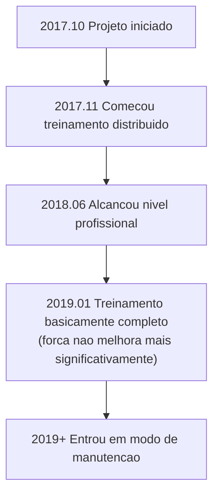

# Introducao a Outras IAs de Go

Alem de AlphaGo e KataGo, o campo de IA de Go tem muitos outros projetos importantes. Este artigo apresentara as principais IAs comerciais e de codigo aberto, ajudando voce a entender todo o ecossistema.

## IAs de Go Comerciais

### Zen

**Desenvolvedor**: Yoji Ojima / Japao
**Primeiro lancamento**: 2009
**Licenca**: Licenca comercial

Zen foi um dos programas de Go mais fortes antes do AlphaGo, alcancando nivel profissional mesmo na era tradicional do MCTS.

#### Historico de Desenvolvimento

| Tempo | Versao | Marco |
|------|------|--------|
| 2009 | Zen 1.0 | Primeiro lancamento |
| 2011 | Zen 4 | Alcancou nivel amador 6-dan |
| 2012 | Zen 5 | Venceu Takemiya Masaki 9-dan com 4 pedras de handicap |
| 2016 | Zen 7 | Adotou tecnologia de deep learning |
| 2017+ | Deep Zen Go | Combinado com arquitetura AlphaGo |

#### Caracteristicas Tecnicas

- **Arquitetura hibrida**: Combina heuristicas tradicionais com deep learning
- **Otimizacao comercial**: Otimizado para hardware de consumidor
- **Alta estabilidade**: Verificado por anos de uso comercial
- **Multiplataforma**: Roda em Windows, macOS

#### Forma de Produto

- **Tengen (Tencho no Go)**: Software desktop, preco ~10.000 ienes
- **Jogo online**: Atuava no KGS com conta Zen19

---

### JueYi (Fine Art)

**Desenvolvedor**: Tencent AI Lab / China
**Primeiro lancamento**: 2016
**Licenca**: Nao publica

JueYi e a IA de Go desenvolvida pela Tencent, com importante influencia no mundo do Go chines.

#### Historico de Desenvolvimento

| Tempo | Evento |
|------|------|
| Novembro 2016 | Primeira aparicao, jogou no site Yeke Go |
| Marco 2017 | Campeao do UEC Cup de Go por computador |
| 2017 | Adotado pela equipe nacional chinesa de Go como ferramenta de treinamento |
| 2018 | Campeao do Campeonato Mundial de IA de Go |
| Ate hoje | Continua como auxilio de treinamento da equipe nacional |

#### Caracteristicas Tecnicas

- **Treinamento em larga escala**: Usa recursos de computacao em nuvem da Tencent
- **Cooperacao com jogadores humanos de topo**: Recebeu muita orientacao profissional
- **Experiencia pratica rica**: Acumulou muitos jogos no Yeke Go
- **Integracao de funcao de ensino**: Oferece funcao de analise de revisao

#### Influencia

A influencia do JueYi no Go profissional chines foi profunda:

- Tornou-se ferramenta de treinamento padrao da equipe nacional
- Mudou a forma como jogadores profissionais se preparam
- Promoveu a popularizacao do treinamento assistido por IA

---

### Golaxy (Xingzhen)

**Desenvolvedor**: Shenzhen Shengke Technology / Equipe da Universidade Tsinghua
**Primeiro lancamento**: 2018
**Licenca**: Licenca comercial

Golaxy foi projetado com o objetivo de ser "a IA mais parecida com humanos", com estilo de jogo mais proximo de jogadores humanos.

#### Caracteristicas Tecnicas

- **Estilo humanizado**: Treinado intencionalmente para jogar mais como humanos
- **Dificuldade ajustavel**: Pode simular oponentes de diferentes niveis
- **Orientado para ensino**: Projetado considerando aplicacoes de ensino
- **Especializado em jogos com handicap**: Otimizacao especial para jogos com handicap

#### Aplicacoes de Produto

- **Yike Go**: Integrado no app Yike
- **Plataforma de ensino**: Usado para ensino de Go online
- **Teste de nivel**: Oferece avaliacao padronizada de nivel

---

### Outras IAs Comerciais

| Nome | Desenvolvedor | Caracteristicas |
|------|--------|------|
| **Stone Tornado** | Lin Zai-fan (Taiwan) | Ex-campeao do UEC Cup |
| **CGI** | Universidade Chiao Tung (Taiwan) | Orientado para pesquisa academica |
| **Dolbaram** | NHN Coreia | Integrado na plataforma coreana de Go |
| **AQ** | Equipe AQ Japao | Tornou-se comercial apos codigo aberto |

## IAs de Go de Codigo Aberto

### Leela Zero

**Desenvolvedor**: Gian-Carlo Pascutto / Belgica
**Primeiro lancamento**: 2017
**Licenca**: GPL-3.0
**GitHub**: https://github.com/leela-zero/leela-zero

Leela Zero foi o primeiro projeto de codigo aberto a replicar com sucesso o AlphaGo Zero, treinado de forma distribuida pela comunidade.

#### Historico de Desenvolvimento



#### Caracteristicas Tecnicas

- **Reproducao fiel**: Implementacao estrita conforme artigo AlphaGo Zero
- **Treinamento distribuido**: Voluntarios globais contribuiram poder computacional de GPU
- **Completamente transparente**: Todos os dados de treinamento e modelos sao publicos
- **GTP padrao**: Compativel com todos os softwares de Go GTP

#### Estatisticas de Treinamento

| Item | Valor |
|------|------|
| Total de jogos self-play | ~18 milhoes |
| Iteracoes de treinamento | ~270 |
| Contribuidores | Milhares |
| Duracao do treinamento | ~1.5 anos |

#### Forma de Uso

```bash
# Instalacao
brew install leela-zero  # macOS

# Execucao
leelaz --gtp --weights best-network.gz

# Comandos GTP
genmove black
play white D4
```

#### Status Atual

Embora Leela Zero nao esteja mais em treinamento ativo:
- Codigo continua sendo excelente recurso para aprender AlphaGo Zero
- Modelos treinados ainda podem ser usados
- Comunidade ainda mantem funcionalidades basicas

---

### ELF OpenGo

**Desenvolvedor**: Facebook AI Research (FAIR)
**Primeiro lancamento**: 2018
**Licenca**: BSD
**GitHub**: https://github.com/pytorch/ELF

ELF OpenGo e a IA de Go desenvolvida pelo Facebook, demonstrando capacidade de treinamento distribuido em larga escala.

#### Caracteristicas Tecnicas

- **Framework ELF**: Baseado na plataforma de pesquisa de jogos ELF (Extensive, Lightweight, and Flexible) do Facebook
- **Treinamento em larga escala**: Usou 2000 GPUs para treinamento
- **Implementacao PyTorch**: Usa framework de deep learning proprio do Facebook
- **Orientado para pesquisa**: Objetivo principal e pesquisa, nao uso pratico

#### Desempenho

- Alcancou nivel topo no KGS
- Taxa de vitoria estavel contra profissionais 9-dan
- Artigo publicado em conferencia de ponta

#### Status Atual

- Projeto nao esta mais em manutencao ativa
- Codigo e modelos ainda podem ser baixados
- Valor principal e referencia academica

---

### SAI (Sensible Artificial Intelligence)

**Desenvolvedor**: Equipe SAI / Europa
**Primeiro lancamento**: 2019
**Licenca**: MIT
**GitHub**: https://github.com/sai-dev/sai

SAI e uma versao melhorada baseada no Leela Zero, focando em funcionalidades experimentais.

#### Caracteristicas Tecnicas

- **Metodos de treinamento melhorados**: Experimenta varias otimizacoes de treinamento
- **Suporta mais regras**: Suporta mais regras de Go que Leela Zero
- **Funcionalidades experimentais**: Testa novas arquiteturas de rede e tecnicas de treinamento

#### Status Atual

- Ainda tem manutencao de comunidade pequena
- Usado principalmente para experimentacao e aprendizado

---

### PhoenixGo

**Desenvolvedor**: Equipe WeChat Tencent
**Primeiro lancamento**: 2018
**Licenca**: BSD-3
**GitHub**: https://github.com/Tencent/PhoenixGo

PhoenixGo e a IA de Go de codigo aberto da Tencent, vencedora do Campeonato Mundial de IA de Go 2018.

#### Caracteristicas Tecnicas

- **Qualidade comercial**: Originado de projeto interno da Tencent
- **Implementacao TensorFlow**: Usa framework mainstream
- **Multiplataforma**: Linux, Windows, macOS
- **Suporte distribuido**: Pode rodar em ambiente multi-maquina multi-GPU

#### Forma de Uso

```bash
# Compilacao
bazel build //src:mcts_main

# Execucao
./mcts_main --gtp --config_path=config.conf
```

---

### MiniGo

**Desenvolvedor**: Google Brain
**Primeiro lancamento**: 2018
**Licenca**: Apache-2.0
**GitHub**: https://github.com/tensorflow/minigo

MiniGo e a IA de Go educacional de codigo aberto do Google, projetada para ajudar mais pessoas a entender os principios do AlphaGo.

#### Caracteristicas Tecnicas

- **Orientado para educacao**: Codigo claro e legivel
- **Implementacao TensorFlow**: Exemplo oficial do Google
- **Documentacao completa**: Tem explicacoes tecnicas detalhadas
- **Suporte Colab**: Pode rodar diretamente no Google Colab

#### Cenarios de Uso

- Aprender arquitetura AlphaGo Zero
- Entender aplicacao de aprendizado por reforco em jogos
- Como ponto de partida para seus proprios projetos

## Comparacao de Caracteristicas de Cada IA

### Comparacao de Forca (Estimativa Aproximada)

| IA | Nivel de Forca | Observacao |
|----|---------|------|
| KataGo | Topo super-humano | Treinamento continuo |
| JueYi | Topo super-humano | Nao publico |
| Leela Zero | Super-humano | Treinamento parado |
| ELF OpenGo | Super-humano | Treinamento parado |
| PhoenixGo | Quase super-humano | Treinamento parado |
| Zen | Nivel profissional | Produto comercial |
| Golaxy | Nivel profissional | Dificuldade ajustavel |

### Comparacao de Funcionalidades

| Funcionalidade | KataGo | Leela Zero | PhoenixGo | Zen |
|------|--------|------------|-----------|------|
| Codigo aberto | Sim | Sim | Sim | Nao |
| Predicao de pontos | Sim | Nao | Nao | Parcial |
| Suporte multi-regras | Sim | Nao | Nao | Nao |
| Analysis API | Sim | Nao | Nao | Nao |
| Modo CPU | Sim | Sim | Sim | Sim |
| Atualizacao continua | Sim | Nao | Nao | Parcial |

### Sugestoes por Cenario de Uso

| Necessidade | Escolha Recomendada | Razao |
|------|---------|------|
| Jogo/analise geral | KataGo | Mais forte e funcionalidades mais completas |
| Aprender AlphaGo | Leela Zero / MiniGo | Codigo claro |
| Aplicacao comercial | Zen / KataGo auto-treinado | Licenca clara |
| Auxilio ao ensino | KataGo / Golaxy | Funcionalidades de analise ricas |
| Experimentos de pesquisa | KataGo / SAI | Pode modificar treinamento |

## Tendencias de Desenvolvimento Futuro

### Tendencias Tecnicas

1. **Metodos de treinamento mais eficientes**
   - Como demonstrado pela melhoria de eficiencia do KataGo
   - Alcancar maior forca com menos recursos

2. **Melhor explicabilidade**
   - Explicar por que a IA faz certa jogada
   - Ajudar humanos a entender pensamento da IA

3. **Combinacao com estilos humanos**
   - Treinar IA para parecer com estilo de jogador especifico
   - Para ensino e pesquisa

4. **Generalidade entre jogos**
   - Como demonstrado pelo AlphaZero
   - Framework unico aplicavel a multiplos jogos

### Tendencias de Aplicacao

1. **Popularizacao**
   - Mais entusiastas de Go usando analise de IA
   - Dispositivos moveis tambem podem rodar

2. **Profissionalizacao**
   - Jogadores profissionais dependem profundamente de treinamento com IA
   - Auxilio de IA se torna padronizado

3. **Comercializacao**
   - Mais produtos de Go assistidos por IA
   - Servicos de ensino, analise, pratica

## Resumo

O ecossistema de IA de Go e rico e diverso:

- **Para forca mais forte e funcionalidades mais completas**: Escolha KataGo
- **Para aprender principios de IA**: Estude codigo de Leela Zero ou MiniGo
- **Para aplicacao comercial**: Avalie Zen ou treine seu proprio modelo
- **Para necessidades especiais**: Escolha ou combine conforme situacao especifica

A seguir, vamos para a parte pratica e aprender como [instalar e usar KataGo](/docs/for-engineers/katago-source/)!

