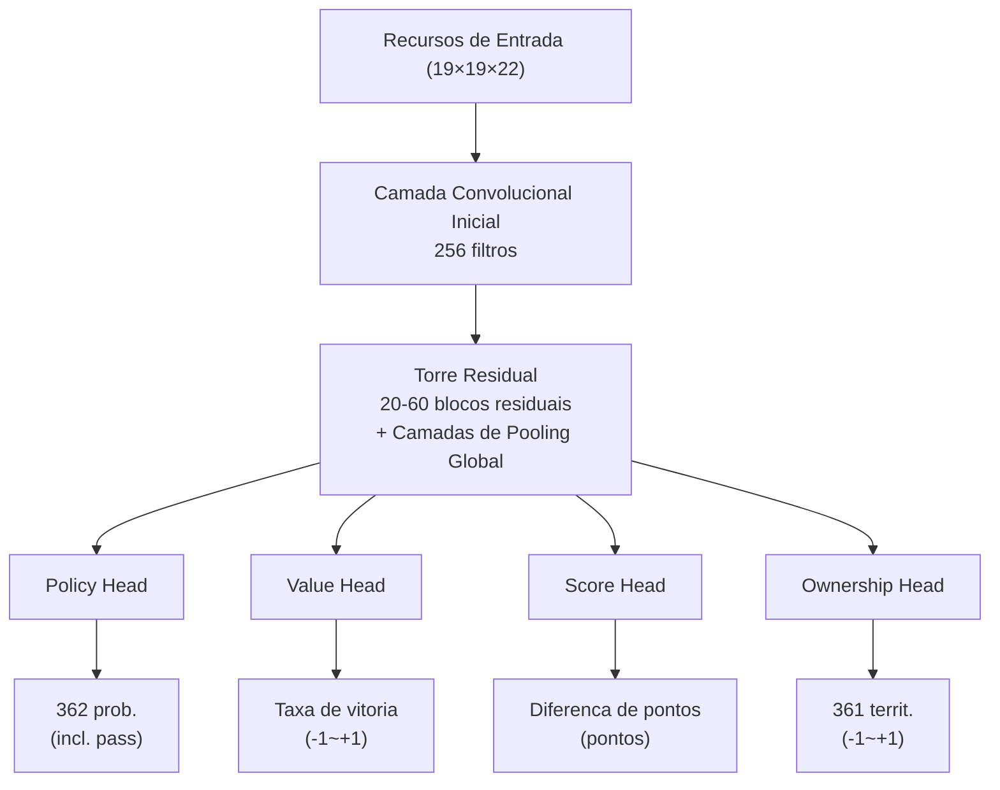
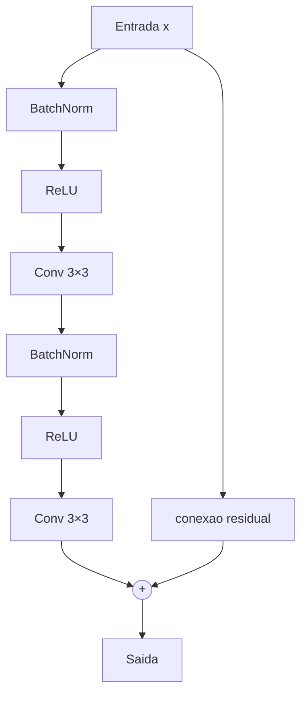

# Arquitetura de Rede Neural Detalhada

Este artigo analisa em profundidade a arquitetura completa da rede neural do KataGo, desde a codificação de recursos de entrada até o design de múltiplas saídas.

---

## Visão Geral da Arquitetura

O KataGo utiliza um design de **rede neural única com múltiplas saídas**:



---

## Codificação de Recursos de Entrada

### Visão Geral dos Planos de Recursos

O KataGo usa **22 planos de recursos** (19×19×22), cada plano é uma matriz 19×19:

| Plano | Conteúdo | Descrição |
|-------|----------|-----------|
| 0 | Pedras próprias | 1 = tem pedra própria, 0 = não tem |
| 1 | Pedras do oponente | 1 = tem pedra do oponente, 0 = não tem |
| 2 | Pontos vazios | 1 = vazio, 0 = tem pedra |
| 3-10 | Estados históricos | Mudanças do tabuleiro nas últimas 8 jogadas |
| 11 | Ponto de Ko | 1 = aqui é Ko proibido, 0 = pode jogar |
| 12-17 | Codificação de liberdades | Grupos com 1, 2, 3... liberdades |
| 18-21 | Codificação de regras | Regras Chinesas/Japonesas, komi, etc. |

### Empilhamento de Estados Históricos

Para que a rede neural entenda a **dinâmica** da posição, o KataGo empilha os estados das últimas 8 jogadas:

```python
# Codificação de estados históricos (conceitual)
def encode_history(game_history, current_player):
    features = []

    for t in range(8):  # Últimas 8 jogadas
        if t < len(game_history):
            board = game_history[-(t+1)]
            # Codifica pedras próprias/do oponente naquele momento
            features.append(encode_board(board, current_player))
        else:
            # Histórico insuficiente, preenche com zeros
            features.append(np.zeros((19, 19)))

    return np.stack(features, axis=0)
```

### Codificação de Regras

O KataGo suporta múltiplas regras, informando a rede neural através de planos de recursos:

```python
# Codificação de regras (conceitual)
def encode_rules(rules, komi):
    rule_features = np.zeros((4, 19, 19))

    # Tipo de regra (one-hot)
    if rules == "chinese":
        rule_features[0] = 1.0
    elif rules == "japanese":
        rule_features[1] = 1.0

    # Komi normalizado
    normalized_komi = komi / 15.0  # Normalizado para [-1, 1]
    rule_features[2] = normalized_komi

    # Jogador atual
    rule_features[3] = 1.0 if current_player == BLACK else 0.0

    return rule_features
```

---

## Rede Principal: Torre Residual

### Estrutura do Bloco Residual

O KataGo usa a estrutura **Pre-activation ResNet**:



### Exemplo de Código

```python
class ResidualBlock(nn.Module):
    def __init__(self, channels):
        super().__init__()
        self.bn1 = nn.BatchNorm2d(channels)
        self.conv1 = nn.Conv2d(channels, channels, 3, padding=1)
        self.bn2 = nn.BatchNorm2d(channels)
        self.conv2 = nn.Conv2d(channels, channels, 3, padding=1)

    def forward(self, x):
        residual = x

        out = self.bn1(x)
        out = F.relu(out)
        out = self.conv1(out)

        out = self.bn2(out)
        out = F.relu(out)
        out = self.conv2(out)

        return out + residual  # Conexão residual
```

### Camada de Pooling Global

Uma das inovações-chave do KataGo: adicionar **pooling global** nos blocos residuais, permitindo que a rede veja informações globais:

```python
class GlobalPoolingBlock(nn.Module):
    def __init__(self, channels):
        super().__init__()
        self.conv = nn.Conv2d(channels, channels, 3, padding=1)
        self.fc = nn.Linear(channels, channels)

    def forward(self, x):
        # Caminho local
        local = self.conv(x)

        # Caminho global
        global_pool = x.mean(dim=[2, 3])  # Pooling médio global
        global_fc = self.fc(global_pool)
        global_broadcast = global_fc.unsqueeze(2).unsqueeze(3)
        global_broadcast = global_broadcast.expand(-1, -1, 19, 19)

        # Fusão
        return local + global_broadcast
```

**Por que precisamos de pooling global?**

Convoluções tradicionais só veem localmente (campo receptivo 3×3). Mesmo empilhando muitas camadas, a percepção de informações globais ainda é limitada. O pooling global permite que a rede "veja" diretamente:
- A diferença no número de pedras do jogo inteiro
- A distribuição de influência global
- A avaliação geral da posição

---

## Design das Cabeças de Saída

### Policy Head (Cabeça de Política)

Produz a probabilidade de jogar em cada posição:

```python
class PolicyHead(nn.Module):
    def __init__(self, in_channels):
        super().__init__()
        self.conv = nn.Conv2d(in_channels, 2, 1)  # Convolução 1×1
        self.bn = nn.BatchNorm2d(2)
        self.fc = nn.Linear(2 * 19 * 19, 362)  # 361 + pass

    def forward(self, x):
        out = F.relu(self.bn(self.conv(x)))
        out = out.view(out.size(0), -1)
        out = self.fc(out)
        return F.softmax(out, dim=1)  # Distribuição de probabilidade
```

**Formato de saída**: Vetor de 362 dimensões
- Índices 0-360: Probabilidade de jogar em 361 posições do tabuleiro
- Índice 361: Probabilidade de passar

### Value Head (Cabeça de Valor)

Produz a taxa de vitória da posição atual:

```python
class ValueHead(nn.Module):
    def __init__(self, in_channels):
        super().__init__()
        self.conv = nn.Conv2d(in_channels, 1, 1)
        self.bn = nn.BatchNorm2d(1)
        self.fc1 = nn.Linear(19 * 19, 256)
        self.fc2 = nn.Linear(256, 1)

    def forward(self, x):
        out = F.relu(self.bn(self.conv(x)))
        out = out.view(out.size(0), -1)
        out = F.relu(self.fc1(out))
        out = torch.tanh(self.fc2(out))  # Saída de -1 a +1
        return out
```

**Formato de saída**: Valor único [-1, +1]
- +1: Vitória certa própria
- -1: Vitória certa do oponente
- 0: Equilíbrio

### Score Head (Cabeça de Pontuação)

Exclusivo do KataGo, prevê a diferença final de pontos:

```python
class ScoreHead(nn.Module):
    def __init__(self, in_channels):
        super().__init__()
        self.conv = nn.Conv2d(in_channels, 1, 1)
        self.bn = nn.BatchNorm2d(1)
        self.fc1 = nn.Linear(19 * 19, 256)
        self.fc2 = nn.Linear(256, 1)

    def forward(self, x):
        out = F.relu(self.bn(self.conv(x)))
        out = out.view(out.size(0), -1)
        out = F.relu(self.fc1(out))
        out = self.fc2(out)  # Saída sem restrição
        return out
```

**Formato de saída**: Valor único (pontos)
- Positivo: Próprio à frente
- Negativo: Oponente à frente

### Ownership Head (Cabeça de Território)

Prevê a quem pertence cada ponto no final:

```python
class OwnershipHead(nn.Module):
    def __init__(self, in_channels):
        super().__init__()
        self.conv1 = nn.Conv2d(in_channels, 32, 1)
        self.bn = nn.BatchNorm2d(32)
        self.conv2 = nn.Conv2d(32, 1, 1)

    def forward(self, x):
        out = F.relu(self.bn(self.conv1(x)))
        out = torch.tanh(self.conv2(out))  # Cada ponto de -1 a +1
        return out.view(out.size(0), -1)  # Achatado para 361
```

**Formato de saída**: Vetor de 361 dimensões, cada valor em [-1, +1]
- +1: Este ponto pertence ao território próprio
- -1: Este ponto pertence ao território do oponente
- 0: Área neutra ou disputada

---

## Diferenças em Relação ao AlphaZero

| Aspecto | AlphaZero | KataGo |
|---------|-----------|--------|
| **Cabeças de saída** | 2 (Policy + Value) | **4** (+ Score + Ownership) |
| **Pooling global** | Não | **Sim** |
| **Recursos de entrada** | 17 planos | **22 planos** (incluindo codificação de regras) |
| **Blocos residuais** | ResNet padrão | **Pre-activation + Pooling global** |
| **Suporte a múltiplas regras** | Não | **Sim** (através de codificação de recursos) |

---

## Escala do Modelo

O KataGo oferece modelos de diferentes escalas:

| Modelo | Blocos Residuais | Canais | Parâmetros | Cenário de Uso |
|--------|-----------------|--------|------------|----------------|
| b10c128 | 10 | 128 | ~5M | CPU, testes rápidos |
| b18c384 | 18 | 384 | ~75M | GPU comum |
| b40c256 | 40 | 256 | ~95M | GPU avançada |
| b60c320 | 60 | 320 | ~200M | GPU topo de linha |

**Convenção de nomes**: `b{blocos}c{canais}`

---

## Implementação Completa da Rede

```python
class KataGoNetwork(nn.Module):
    def __init__(self, num_blocks=18, channels=384):
        super().__init__()

        # Convolução inicial
        self.initial_conv = nn.Conv2d(22, channels, 3, padding=1)
        self.initial_bn = nn.BatchNorm2d(channels)

        # Torre residual
        self.residual_blocks = nn.ModuleList([
            ResidualBlock(channels) for _ in range(num_blocks)
        ])

        # Blocos de pooling global (inseridos a cada poucos blocos residuais)
        self.global_pooling_blocks = nn.ModuleList([
            GlobalPoolingBlock(channels) for _ in range(num_blocks // 6)
        ])

        # Cabeças de saída
        self.policy_head = PolicyHead(channels)
        self.value_head = ValueHead(channels)
        self.score_head = ScoreHead(channels)
        self.ownership_head = OwnershipHead(channels)

    def forward(self, x):
        # Convolução inicial
        out = F.relu(self.initial_bn(self.initial_conv(x)))

        # Torre residual
        gp_idx = 0
        for i, block in enumerate(self.residual_blocks):
            out = block(out)

            # Insere pooling global após cada 6 blocos residuais
            if (i + 1) % 6 == 0 and gp_idx < len(self.global_pooling_blocks):
                out = self.global_pooling_blocks[gp_idx](out)
                gp_idx += 1

        # Cabeças de saída
        policy = self.policy_head(out)
        value = self.value_head(out)
        score = self.score_head(out)
        ownership = self.ownership_head(out)

        return {
            'policy': policy,
            'value': value,
            'score': score,
            'ownership': ownership
        }
```

---

## Leitura Adicional

- [Detalhes de Implementação do MCTS](../mcts-implementation) — Combinação de busca e rede neural
- [Análise do Mecanismo de Treinamento do KataGo](../training) — Como a rede é treinada
- [Guia de Artigos Importantes](../papers) — Derivações matemáticas dos artigos originais
