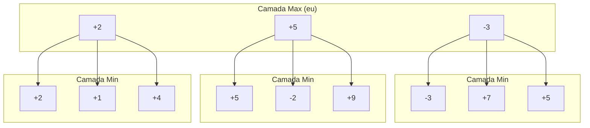
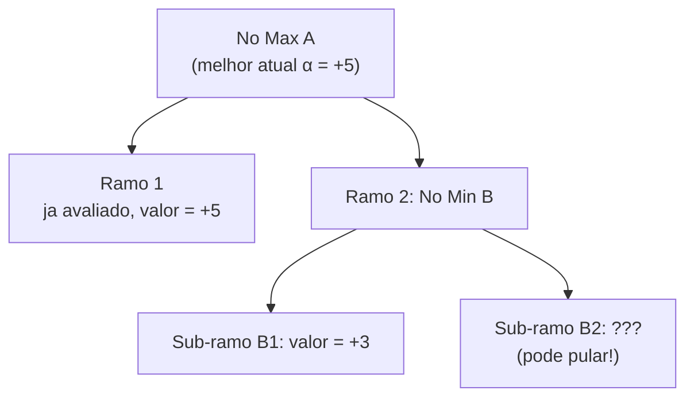

import { MCTSTree, GoBoard } from '@site/src/components/D3Charts';

# Limites dos Metodos Tradicionais

Antes do surgimento do aprendizado profundo, os pesquisadores passaram decadas tentando resolver o problema do Go usando metodos "tradicionais". Do algoritmo Minimax a Busca em Arvore Monte Carlo (MCTS), cada avanco tornou o Go computacional um pouco mais forte, mas nunca conseguiu alcancar o nivel profissional humano.

Este artigo explorara os principios, vantagens e desvantagens desses metodos, e por que eles encontraram um gargalo no Go.

---

## Algoritmo Minimax: A Base da Teoria dos Jogos

### Principio Basico

O **algoritmo Minimax** e um conceito central na teoria dos jogos, proposto por John von Neumann em 1928. Sua ideia basica e:

> Em um jogo de soma zero, devo escolher a opcao que me deixa na melhor posicao mesmo apos a "melhor resposta" do oponente.

Em outras palavras:
- **Eu (Max)** quero maximizar a pontuacao
- **Oponente (Min)** quer minimizar minha pontuacao
- Devo assumir que o oponente sempre fara a melhor jogada

### Formalizacao Matematica

Seja V(s) o valor da posicao s, definido recursivamente como:

```
V(s) = eval(s)                        // se s e posicao final
V(s) = max{ V(result(s, a)) | a ∈ A(s) }  // se e a vez do Max
V(s) = min{ V(result(s, a)) | a ∈ A(s) }  // se e a vez do Min
```

Onde:
- **A(s)**: todas as acoes legais na posicao s
- **result(s, a)**: resultado de executar a acao a na posicao s
- **eval(s)**: avaliacao da posicao final

### Diagrama da Arvore de Busca



Neste exemplo:
- A camada Min escolhera o valor menos favoravel para mim (minimo)
- A camada Max escolhera o valor mais favoravel para mim (maximo)
- No final, Max deve escolher o ramo do meio (+5)

### Implementacao em Codigo

```python
def minimax(state, depth, is_max_turn):
    """
    Implementacao basica do algoritmo Minimax

    Args:
        state: posicao atual
        depth: profundidade de busca
        is_max_turn: se e a vez do Max

    Returns:
        (melhor valor, melhor acao)
    """
    # Condicao de termino: limite de profundidade ou fim do jogo
    if depth == 0 or is_terminal(state):
        return evaluate(state), None

    legal_moves = get_legal_moves(state)
    best_move = None

    if is_max_turn:
        best_value = float('-inf')
        for move in legal_moves:
            next_state = apply_move(state, move)
            value, _ = minimax(next_state, depth - 1, False)
            if value > best_value:
                best_value = value
                best_move = move
    else:
        best_value = float('inf')
        for move in legal_moves:
            next_state = apply_move(state, move)
            value, _ = minimax(next_state, depth - 1, True)
            if value < best_value:
                best_value = value
                best_move = move

    return best_value, best_move
```

### Problemas do Minimax no Go

#### 1. Explosao do Espaco de Busca

Como mencionado no [artigo anterior](../why-go-is-hard), o fator de ramificacao do Go e aproximadamente 250. Para ver N jogadas:

**Numero de nos ≈ 250^N**

| Profundidade | Numero de Nos | Calculando a 1 milhao de nos/segundo |
|--------------|---------------|--------------------------------------|
| 2 | 62.500 | 0,06 segundos |
| 4 | 3,9 bilhoes | 65 minutos |
| 6 | 2,4×10^14 | 7.600 anos |
| 8 | 1,5×10^19 | 480 milhoes de anos |

Ver 6 jogadas ja levaria 7.600 anos, quanto mais jogar uma partida completa.

#### 2. Dificuldade da Funcao de Avaliacao

Mesmo que olhemos apenas 4 jogadas, ainda precisamos de uma **funcao de avaliacao** precisa para julgar o valor de posicoes nao-terminais. Mas como mencionado no artigo anterior, a avaliacao de posicoes no Go e extremamente dificil.

**Conclusao: Minimax puro e completamente inviavel no Go.**

---

## Poda Alpha-Beta: Reduzindo Buscas Inuteis

### Insight Central

O insight central da poda Alpha-Beta e: **nao precisamos buscar todos os ramos**.

Se ja sabemos que um ramo "certamente e ruim", podemos pula-lo diretamente.

### Principio da Poda



Neste exemplo:
- A ja tem uma opcao com valor +5
- O primeiro sub-ramo de B e +3, entao o valor final de B ≤ +3
- Como B ≤ +3 < +5, A nao escolhera B
- **B2 nao precisa ser avaliado**

Isso e a **poda Beta**. Similarmente, existe a **poda Alpha**.

### Formalizacao Matematica

Introduzimos dois parametros:
- **α (alpha)**: valor minimo que Max pode garantir (limite inferior)
- **β (beta)**: valor maximo que Min pode garantir (limite superior)

Condicoes de poda:
- Em um no Max, se valor ≥ β, podar (poda Beta)
- Em um no Min, se valor ≤ α, podar (poda Alpha)

### Implementacao em Codigo

```python
def alpha_beta(state, depth, alpha, beta, is_max_turn):
    """
    Algoritmo de Poda Alpha-Beta

    Args:
        state: posicao atual
        depth: profundidade de busca
        alpha: limite inferior do Max
        beta: limite superior do Min
        is_max_turn: se e a vez do Max

    Returns:
        (valor, melhor acao)
    """
    if depth == 0 or is_terminal(state):
        return evaluate(state), None

    legal_moves = get_legal_moves(state)
    best_move = None

    if is_max_turn:
        value = float('-inf')
        for move in legal_moves:
            next_state = apply_move(state, move)
            child_value, _ = alpha_beta(next_state, depth - 1,
                                        alpha, beta, False)
            if child_value > value:
                value = child_value
                best_move = move
            alpha = max(alpha, value)
            if value >= beta:
                break  # Poda Beta
        return value, best_move
    else:
        value = float('inf')
        for move in legal_moves:
            next_state = apply_move(state, move)
            child_value, _ = alpha_beta(next_state, depth - 1,
                                        alpha, beta, True)
            if child_value < value:
                value = child_value
                best_move = move
            beta = min(beta, value)
            if value <= alpha:
                break  # Poda Alpha
        return value, best_move

# Como chamar
value, best_move = alpha_beta(state, depth=4,
                               alpha=float('-inf'),
                               beta=float('inf'),
                               is_max_turn=True)
```

### Eficiencia da Poda

No caso ideal (ordenacao perfeita de jogadas), Alpha-Beta pode reduzir o fator de ramificacao efetivo de b para √b:

**Fator de ramificacao efetivo = b^0.5**

Isso significa:
- Xadrez: de 35 para ~6
- Go: de 250 para ~16

| Profundidade | Nos Originais | Alpha-Beta (ideal) | Aceleracao |
|--------------|---------------|-------------------|------------|
| 4 | 3,9 bilhoes | 65.000 | 60.000× |
| 6 | 2,4×10^14 | 16 milhoes | 1,5×10^7 × |
| 8 | 1,5×10^19 | 4,2 bilhoes | 3,6×10^9 × |

### Por que ainda nao e suficiente

Mesmo com poda Alpha-Beta, o Go ainda e dificil de tratar:

#### 1. Poda ideal requer ordenacao perfeita

Para alcancar eficiencia de poda ideal, precisamos buscar primeiro os "melhores" ramos. Mas para saber qual ramo e melhor, precisamos buscar... e um problema do ovo e da galinha.

Na pratica, a eficiencia de poda no Go e muito menor que o ideal, e o fator de ramificacao efetivo pode ainda ser 50-100.

#### 2. Profundidade ainda insuficiente

Mesmo com fator de ramificacao efetivo de 50, ver 10 jogadas ainda requer 50^10 ≈ 10^17 nos. Isso ainda e demais para computadores.

#### 3. Gargalo da funcao de avaliacao

Alpha-Beta resolve apenas o problema de "eficiencia de busca", nao o problema de "precisao de avaliacao". Uma funcao de avaliacao ruim, mesmo com busca mais rapida, ainda produz resultados ruins.

**Conclusao: Alpha-Beta melhorou muito a IA de xadrez, mas ajudou pouco no Go.**

---

## Metodo Monte Carlo Puro: O Poder da Aleatoriedade

### Abandonando a Funcao de Avaliacao

Na decada de 1990, pesquisadores comecaram a tentar uma ideia radical: **nao usar funcao de avaliacao**.

Em seu lugar, usaram **simulacao aleatoria** (Random Playout):

1. Comecar da posicao atual
2. Ambos os lados jogam aleatoriamente ate o fim do jogo
3. Registrar o resultado (vitoria/derrota)
4. Repetir N vezes, calcular taxa de vitoria

### Principio de Estimativa Estatistica

Pela lei dos grandes numeros, quando o numero de simulacoes N e grande o suficiente:

**V̂(s) = Numero de vitorias / N ≈ V(s)**

O erro padrao dessa estimativa e:

**SE = √(V(s)(1-V(s))/N) ≈ 1/(2√N)**

| Numero de Simulacoes | Erro Padrao |
|---------------------|-------------|
| 100 | 5% |
| 1.000 | 1,6% |
| 10.000 | 0,5% |
| 100.000 | 0,16% |

### Implementacao em Codigo

```python
import random

def random_playout(state, player):
    """
    A partir da posicao atual, ambos os lados jogam aleatoriamente ate o fim

    Returns:
        1 se player vencer, 0 se perder
    """
    current = state.copy()
    current_player = player

    while not is_terminal(current):
        legal_moves = get_legal_moves(current)
        if not legal_moves:
            current_player = opponent(current_player)
            continue

        # Escolher uma jogada aleatoriamente
        move = random.choice(legal_moves)
        current = apply_move(current, move)
        current_player = opponent(current_player)

    return 1 if get_winner(current) == player else 0


def monte_carlo_move_selection(state, player, num_simulations=10000):
    """
    Usar metodo Monte Carlo para selecionar a melhor jogada
    """
    legal_moves = get_legal_moves(state)

    if len(legal_moves) == 0:
        return None

    # Alocar simulacoes para cada jogada legal
    sims_per_move = num_simulations // len(legal_moves)

    best_move = None
    best_win_rate = -1

    for move in legal_moves:
        next_state = apply_move(state, move)

        wins = 0
        for _ in range(sims_per_move):
            wins += random_playout(next_state, opponent(player))

        # Taxa de vitoria do oponente baixa = minha taxa de vitoria alta
        my_win_rate = 1 - (wins / sims_per_move)

        if my_win_rate > best_win_rate:
            best_win_rate = my_win_rate
            best_move = move

    return best_move, best_win_rate
```

### Vantagens e Limitacoes

#### Vantagens

1. **Nao precisa de funcao de avaliacao**: depende inteiramente de simulacoes
2. **Aplicavel a qualquer jogo**: basta conhecer as regras
3. **Fornece estimativa de probabilidade**: sabemos "quao certos" estamos

#### Limitacoes

1. **Aleatoriedade excessiva**: jogar aleatoriamente e muito diferente de jogar profissionalmente
2. **Requer muitas simulacoes**: cada jogada precisa de dezenas de milhares de simulacoes
3. **Pontos cegos taticos**: taticas cruciais podem ser perdidas aleatoriamente

### Desempenho do Monte Carlo Puro no Go

Programas de Go usando metodo Monte Carlo puro podem alcancar aproximadamente:

> Nivel de **amador 5-10 kyu**

Isso e melhor que programas anteriores usando Minimax + funcao de avaliacao, mas ainda esta muito longe do nivel profissional.

---

## O Avanco do MCTS (2006)

### O Nascimento do Algoritmo UCT

Em 2006, Remi Coulom propos o algoritmo **MCTS (Monte Carlo Tree Search)**, combinando as vantagens da busca em arvore e simulacao Monte Carlo. No mesmo ano, Levente Kocsis e Csaba Szepesvari propuseram o algoritmo **UCT (Upper Confidence Bounds for Trees)**, fornecendo base teorica para o MCTS.

Este foi um **avanco historico** no Go computacional.

### Formula UCB1

O nucleo do MCTS e a formula **UCB1 (Upper Confidence Bound)**:

```
UCB1(s, a) = X̄(s,a) + C × √(ln(Ns) / n(s,a))
```

Onde:
- **X̄(s,a)**: valor medio (taxa de vitoria) de tomar a acao a no estado s
- **Ns**: numero total de visitas ao estado s
- **n(s,a)**: numero de vezes que a acao a foi tomada no estado s
- **C**: constante de exploracao (geralmente C = √2)

Esta formula equilibra habilmente **exploracao** (escolher o que e sabidamente bom) e **exploitacao** (tentar o desconhecido).

### As Quatro Fases do MCTS

<MCTSTree showPUCT={true} width={700} height={450} />

Cada iteracao do MCTS inclui quatro fases:

#### 1. Selection (Selecao)

A partir do no raiz, usar a formula UCB1 para selecionar nos filhos ate chegar a um no folha.

```python
def select(node):
    """Usar UCB1 para selecionar o melhor no filho"""
    while node.is_fully_expanded():
        node = max(node.children,
                   key=lambda c: ucb1(c, node.visits))
    return node

def ucb1(child, parent_visits, C=1.414):
    """Formula UCB1"""
    if child.visits == 0:
        return float('inf')  # Nos nao visitados tem prioridade

    exploitation = child.wins / child.visits
    exploration = C * math.sqrt(math.log(parent_visits) / child.visits)

    return exploitation + exploration
```

#### 2. Expansion (Expansao)

Adicionar um ou mais nos filhos ao no folha.

```python
def expand(node, state):
    """Expandir no"""
    legal_moves = get_legal_moves(state)
    untried = [m for m in legal_moves if m not in node.tried_moves]

    if untried:
        move = random.choice(untried)
        new_state = apply_move(state, move)
        child = Node(move=move, parent=node)
        node.children.append(child)
        node.tried_moves.add(move)
        return child, new_state

    return node, state
```

#### 3. Simulation (Simulacao)

A partir do novo no, realizar simulacao aleatoria ate o fim do jogo.

```python
def simulate(state, player):
    """Simulacao aleatoria ate o fim do jogo"""
    return random_playout(state, player)
```

#### 4. Backpropagation (Retropropagacao)

Propagar o resultado da simulacao para todos os nos ancestrais.

```python
def backpropagate(node, result):
    """Propagar resultado para todos os ancestrais"""
    while node is not None:
        node.visits += 1
        node.wins += result
        result = 1 - result  # Trocar perspectiva
        node = node.parent
```

### Implementacao Completa do MCTS

```python
class MCTSNode:
    def __init__(self, move=None, parent=None):
        self.move = move
        self.parent = parent
        self.children = []
        self.wins = 0
        self.visits = 0
        self.tried_moves = set()

    def is_fully_expanded(self, legal_moves):
        return len(self.tried_moves) == len(legal_moves)


def mcts(root_state, player, num_iterations=10000):
    """
    Funcao principal do MCTS

    Args:
        root_state: posicao inicial
        player: jogador atual
        num_iterations: numero de iteracoes

    Returns:
        melhor acao
    """
    root = MCTSNode()

    for _ in range(num_iterations):
        node = root
        state = root_state.copy()
        current_player = player

        # 1. Selection
        while node.children and node.is_fully_expanded(get_legal_moves(state)):
            node = max(node.children,
                      key=lambda c: ucb1(c, node.visits))
            state = apply_move(state, node.move)
            current_player = opponent(current_player)

        # 2. Expansion
        legal_moves = get_legal_moves(state)
        if not node.is_fully_expanded(legal_moves) and not is_terminal(state):
            move = random.choice([m for m in legal_moves
                                  if m not in node.tried_moves])
            state = apply_move(state, move)
            child = MCTSNode(move=move, parent=node)
            node.children.append(child)
            node.tried_moves.add(move)
            node = child
            current_player = opponent(current_player)

        # 3. Simulation
        result = simulate(state, current_player)

        # 4. Backpropagation
        backpropagate(node, result)

    # Escolher o no filho com mais visitas
    return max(root.children, key=lambda c: c.visits).move
```

### Por que o MCTS Funciona?

O sucesso do MCTS tem varios fatores-chave:

#### 1. Foco Progressivo

O MCTS nao busca todos os ramos uniformemente, mas investe mais recursos em ramos que parecem mais promissores. Isso permite "ignorar" jogadas obviamente ruins.

#### 2. Algoritmo de Tempo Arbitrario

O MCTS pode parar a qualquer momento e dar a melhor resposta atual. Mais tempo, melhor resposta.

#### 3. Nao Precisa de Funcao de Avaliacao

O MCTS estima valores atraves de simulacoes, sem necessidade de projetar funcao de avaliacao manualmente.

### 2006-2015: A Era do MCTS

O surgimento do MCTS levou o Go computacional a uma nova era:

| Programa | Ano | Caracteristicas | Forca |
|----------|-----|-----------------|-------|
| **Crazy Stone** | 2006 | Primeiro programa de Go com MCTS | Amador alto dan |
| **MoGo** | 2007 | MCTS otimizado | Amador 5 dan |
| **Zen** | 2009 | Adicao de reconhecimento de padroes | Amador 6 dan |
| **Crazy Stone** | 2013 | Venceu profissional 9 dan com 4 pedras de handicap | Profissional 1 dan (com handicap) |

Este foi um progresso historico, mas ainda havia uma grande lacuna:

> O programa MCTS mais forte, **sem handicap**, ainda nao conseguia vencer jogadores profissionais.

---

## O Gargalo da Funcao de Avaliacao

### Limitacoes das Caracteristicas Manuais

Antes do MCTS, pesquisadores tentaram projetar varias **caracteristicas manuais** para avaliar posicoes:

#### Caracteristicas Comuns

```python
def evaluate_position(state):
    """Funcao de avaliacao projetada manualmente"""
    score = 0

    # 1. Estimativa de territorio
    score += count_territory(state, BLACK) - count_territory(state, WHITE)

    # 2. Liberdades das pedras
    score += sum(liberties(group) for group in groups(state, BLACK))
    score -= sum(liberties(group) for group in groups(state, WHITE))

    # 3. Numero de olhos
    score += count_eyes(state, BLACK) * 10
    score -= count_eyes(state, WHITE) * 10

    # 4. Forca de conexao
    score += connectivity_score(state, BLACK)
    score -= connectivity_score(state, WHITE)

    # ... mais caracteristicas

    return score
```

#### Problemas

1. **Caracteristicas incompletas**: muitos fatores da intuicao humana sao dificeis de descrever em codigo
2. **Pesos dificeis de ajustar**: como determinar a importancia relativa de cada caracteristica?
3. **Local vs Global**: calculo local e facil, julgamento global e dificil
4. **Interacoes**: interacoes entre caracteristicas sao dificeis de modelar

### Problema de Simulacao no MCTS

Mesmo no MCTS, onde nao usamos diretamente funcao de avaliacao, a **qualidade da simulacao** ainda e um gargalo crucial.

#### Problemas da Simulacao Aleatoria

Jogar aleatoriamente produz muitas posicoes "irracionais", levando a estimativas imprecisas:

- Grandes grupos morrem sem motivo
- Capturas obvias nao sao feitas
- Mortes simples sao ignoradas

#### Tentativas de Melhoria

Pesquisadores tentaram adicionar **conhecimento previo** nas simulacoes:

```python
def simulation_policy(state, legal_moves):
    """
    Politica de simulacao com conhecimento previo
    """
    # Considerar com prioridade:
    # 1. Capturas
    # 2. Fugas
    # 3. Conexoes
    # 4. Ocupar grandes pontos
    # ...

    for move in legal_moves:
        if is_capture(state, move):
            return move
        if saves_group(state, move):
            return move

    # Resto aleatorio
    return random.choice(legal_moves)
```

Mas essas regras heuristicas:
- Aumentam o custo computacional
- Podem introduzir vieses
- Ainda nao sao precisas o suficiente

### Por que Precisamos de Redes Neurais

O gargalo dos metodos tradicionais e essencialmente um problema de **aprendizado de representacao**:

> Como aprender caracteristicas de "boas jogadas" a partir dos pixels do tabuleiro (estados de 361 pontos)?

Isso e exatamente onde o **aprendizado profundo** se destaca:
- **Aprendizado automatico de caracteristicas**: sem necessidade de projeto manual
- **Mapeamento nao-linear**: pode capturar relacoes complexas
- **Treinamento fim-a-fim**: diretamente da entrada para a saida

O avanco do aprendizado profundo no ImageNet em 2012 fez os pesquisadores pensarem:

> Se redes neurais podem "entender" fotos, sera que tambem podem "entender" tabuleiros?

A resposta a essa pergunta e o AlphaGo.

---

## Resumo dos Limites dos Metodos Tradicionais

| Metodo | Vantagens | Problemas no Go |
|--------|-----------|-----------------|
| **Minimax** | Teoricamente completo, solucao otima | Fator de ramificacao muito grande, impossivel buscar fundo |
| **Alpha-Beta** | Reduz muito a busca | Fator de ramificacao efetivo ainda muito alto |
| **Monte Carlo Puro** | Nao precisa de funcao de avaliacao | Qualidade da simulacao aleatoria muito ruim |
| **MCTS** | Busca focada inteligente | Simulacao ainda nao boa o suficiente, alcanca nivel amador alto |

### Gargalos Centrais

No fundo, os metodos tradicionais enfrentam dois grandes gargalos:

#### 1. Problema de Avaliacao
- Nenhuma boa funcao de avaliacao
- Impossivel quantificar conceitos abstratos como "espessura" e "influencia"
- Caracteristicas manuais nao sao expressivas o suficiente

#### 2. Problema de Busca
- Mesmo com poda, o espaco de busca ainda e muito grande
- Impossivel ver variacoes profundas o suficiente
- Qualidade da simulacao afeta precisao da estimativa

### A Solucao do AlphaGo

O AlphaGo usou aprendizado profundo para resolver esses dois problemas:

1. **Policy Network**: aprender "onde provavelmente e uma boa jogada", reduzindo o fator de ramificacao efetivo
2. **Value Network**: aprender "quem provavelmente vai ganhar", substituindo funcao de avaliacao manual
3. **Integracao com MCTS**: usar redes neurais para guiar a busca, usar busca para melhorar decisoes

Isso nao e simplesmente "substituir funcao de avaliacao por rede neural", mas uma arquitetura completamente nova.

---

## Correspondencia com Animacoes

Conceitos centrais abordados neste artigo e numeros das animacoes:

| Numero | Conceito | Correspondencia Fisica/Matematica |
|--------|----------|-----------------------------------|
| A3 | Busca Minimax | Teoria dos jogos, jogo de soma zero |
| C5 | Quatro fases do MCTS | Metodo Monte Carlo, UCB |
| C2 | Formula UCB1 | Problema do bandido multi-braco, equilibrio exploracao-exploitacao |
| C4 | Crescimento da arvore de busca | Expansao progressiva |

---

## Leitura Adicional

- **Artigo anterior**: [Por que o Go e dificil?](../why-go-is-hard) - Espaco de estados e dificuldade de avaliacao
- **Proximo artigo**: [Representacao do Estado do Tabuleiro](../board-representation) - Zobrist Hashing, codificacao de caracteristicas
- **Aprofundamento tecnico**: [Combinacao de MCTS e Redes Neurais](../mcts-neural-combo) - A arquitetura central do AlphaGo

---

## Referencias

1. Coulom, R. (2006). "Efficient Selectivity and Backup Operators in Monte-Carlo Tree Search." *Computers and Games*, 72-83. - Artigo original do MCTS
2. Kocsis, L., & Szepesvari, C. (2006). "Bandit based Monte-Carlo Planning." *ECML*, 282-293. - Algoritmo UCT
3. Browne, C., et al. (2012). "A Survey of Monte Carlo Tree Search Methods." *IEEE TCIAIG*, 4(1), 1-43. - Revisao do MCTS
4. Gelly, S., & Silver, D. (2011). "Monte-Carlo tree search and rapid action value estimation in computer Go." *Artificial Intelligence*, 175(11), 1856-1875. - Aplicacao do MCTS no Go
