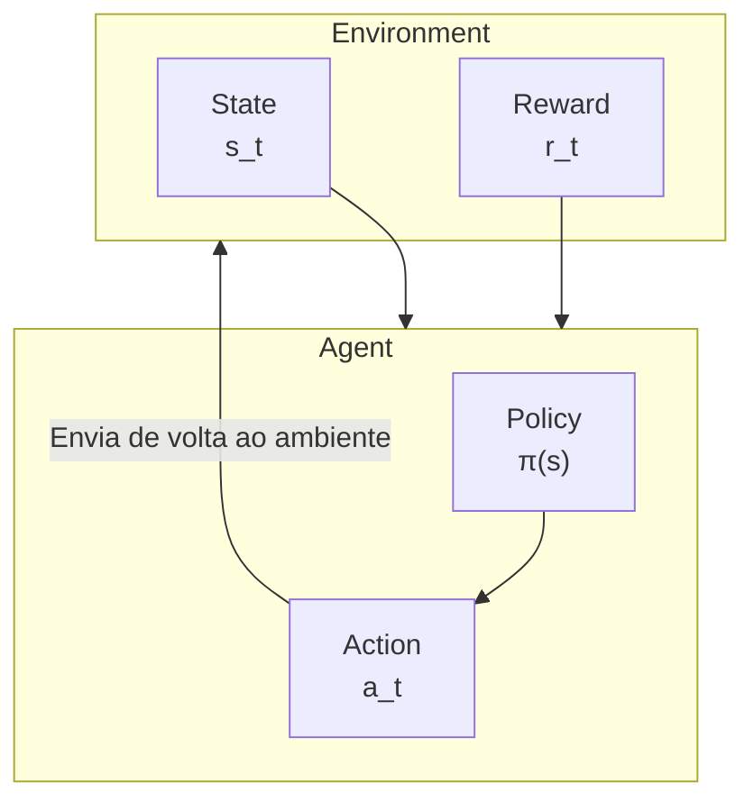

# Introdução ao Aprendizado por Reforço

Nos artigos anteriores, apresentamos como o AlphaGo usou aprendizado supervisionado para aprender com partidas humanas. Mas o aprendizado supervisionado tem uma limitação fundamental: **ele só pode imitar humanos, não pode superar humanos**.

Para fazer a IA superar humanos, precisamos de um método de aprendizado diferente — **Aprendizado por Reforço (Reinforcement Learning, RL)**.

Este artigo irá guiá-lo através dos conceitos centrais do aprendizado por reforço do zero, estabelecendo a base para a autopartida subsequente e integração com MCTS.

---

## O que é Aprendizado por Reforço?

### Comparação com outros métodos de aprendizado

O aprendizado de máquina tem três paradigmas principais:

| Paradigma | Método de aprendizado | Exemplo |
|-----------|----------------------|---------|
| **Aprendizado Supervisionado** | Aprender com dados rotulados | Classificação de imagens, previsão do próximo movimento |
| **Aprendizado Não Supervisionado** | Descobrir estrutura em dados não rotulados | Clustering, redução de dimensionalidade |
| **Aprendizado por Reforço** | Aprender com experiência de interação | Jogar xadrez, jogar jogos, controle de robôs |

A singularidade do aprendizado por reforço é: **ninguém te diz qual é a resposta correta, você deve descobrir por conta própria através de tentativa e erro**.

### Um exemplo intuitivo

Imagine que você está ensinando um cachorro a aprender um truque novo:

1. O cachorro faz alguma ação (possivelmente aleatória)
2. Se a ação estiver correta, você dá um petisco (recompensa positiva)
3. Se a ação estiver errada, você não dá petisco ou diz suavemente "não" (recompensa negativa ou zero)
4. Após muitas tentativas, o cachorro aprende quais ações trazem recompensas

Esta é a essência do aprendizado por reforço: **aprender como agir através de sinais de recompensa**.

### Aplicação do aprendizado por reforço no Go

No Go:
- Cada movimento é uma "ação"
- No final da partida, vitória ou derrota é a "recompensa"
- A IA precisa aprender: quais jogadas eventualmente levam à vitória?

Mas há um desafio enorme aqui: **recompensa atrasada**. Uma partida pode ter mais de 200 movimentos, mas só no final você sabe o resultado. Para um movimento no movimento 50, como saber quanto contribuiu para o resultado final?

Este é um dos problemas mais centrais do aprendizado por reforço, chamamos de **Problema de Atribuição de Crédito (Credit Assignment Problem)**.

---

## Conceitos centrais

### Agent (Agente) e Environment (Ambiente)

A arquitetura básica do aprendizado por reforço inclui dois protagonistas:



**Agent (Agente)**:
- O sujeito que toma decisões
- No Go, é a IA que joga
- Possui uma "política" (Policy), que determina qual ação tomar em qual estado

**Environment (Ambiente)**:
- O objeto com o qual o Agent interage
- No Go, é o tabuleiro + oponente
- Recebe a ação do Agent, retorna novo estado e recompensa

### State (Estado)

**Estado s** é a descrição completa do ambiente. No Go:
- Estado inclui: posição atual do tabuleiro, de quem é a vez, estado de ko, etc.
- Espaço de estados é extremamente grande: aproximadamente $10^{170}$ estados possíveis

O estado deve possuir **propriedade de Markov**: o futuro só depende do estado atual, não do histórico.

### Action (Ação)

**Ação a** é o comportamento que o Agent pode tomar. No Go:
- Cada ponto vazio é uma ação possível
- Mais "pass", totalizando $19 \times 19 + 1 = 362$ ações
- Mas na prática muitas posições são ilegais (como suicídio, ko)

### Reward (Recompensa)

**Recompensa r** é o feedback do ambiente para a ação. No Go:
- Vitória: $+1$
- Derrota: $-1$
- Durante a partida: $0$ (este é o lugar mais desafiador!)

A escassez do sinal de recompensa é uma das principais dificuldades do aprendizado por reforço no Go.

### Policy (Política)

**Política π** é a regra de comportamento do Agent, dizendo o que fazer em cada estado.

A política pode ser:
- **Política determinística**: $a = \pi(s)$, cada estado corresponde a uma única ação
- **Política estocástica**: $a \sim \pi(a|s)$, dá a distribuição de probabilidade das ações

No AlphaGo, a Policy Network é uma política estocástica, produzindo a probabilidade de jogar em cada posição.

---

## Processo de Decisão de Markov (MDP)

### Definição de MDP

**Processo de Decisão de Markov (Markov Decision Process, MDP)** é o framework matemático do aprendizado por reforço.

Um MDP é definido por uma 5-tupla $(S, A, P, R, \gamma)$:

| Símbolo | Significado | Correspondência no Go |
|---------|-------------|----------------------|
| $S$ | Espaço de estados | Todas as posições possíveis do tabuleiro |
| $A$ | Espaço de ações | Todas as posições legais para jogar |
| $P(s'|s,a)$ | Probabilidade de transição | Mudança de posição após um movimento |
| $R(s,a,s')$ | Função de recompensa | Resultado de vitória/derrota |
| $\gamma$ | Fator de desconto | Importância de recompensas futuras |

### Propriedade de Markov

A suposição central do MDP é a **Propriedade de Markov (Markov Property)**:

$$P(s_{t+1}|s_t, a_t, s_{t-1}, a_{t-1}, \ldots, s_0) = P(s_{t+1}|s_t, a_t)$$

Em palavras simples: **o futuro só depende do presente, não do passado**.

O Go satisfaz esta propriedade?

Superficialmente, sim — desde que você saiba o estado atual do tabuleiro, você conhece todos os movimentos legais. Mas na realidade, Go tem a **regra de ko**, que requer lembrar o estado do movimento anterior. O AlphaGo trata disso codificando os 8 movimentos anteriores nas características de entrada.

### Go é MDP determinístico

Go tem uma propriedade especial: **a transição é determinística**.

Em jogos de tabuleiro, quando você faz um movimento, a mudança no estado do tabuleiro é completamente determinada (ao contrário de jogos de dados que têm aleatoriedade). Então:

$$P(s'|s,a) = \begin{cases} 1 & \text{se } s' \text{ é o estado após executar } a \\ 0 & \text{caso contrário} \end{cases}$$

Mas não esqueça, Go é um **jogo de duas pessoas**, as jogadas do oponente trazem "incerteza". Isso torna o problema um **MDP adversarial**.

### Design de recompensa

O design da função de recompensa é crucial para o aprendizado por reforço. No Go, o design mais natural é:

$$R(s_T) = \begin{cases} +1 & \text{se a IA vencer} \\ -1 & \text{se a IA perder} \end{cases}$$

Onde $T$ é o passo de tempo quando a partida termina.

Esta **recompensa esparsa** traz desafios enormes:
- Uma partida pode ter 200-300 movimentos
- Só no último movimento você sabe o resultado
- Como julgar a qualidade de um movimento no meio?

Algumas pesquisas tentam projetar **recompensa densa**, por exemplo:
- Recompensa por capturar pedras
- Recompensa por estimativa de território
- Recompensa por avaliação de posição

Mas o sucesso do AlphaGo mostrou: **mesmo usando apenas resultado final como recompensa, através de autopartida suficiente, a IA pode aprender táticas refinadas de meio de jogo**.

---

## Função de valor

### Por que precisamos de função de valor?

O objetivo do aprendizado por reforço é maximizar a **recompensa acumulada**. Mas a recompensa é atrasada, precisamos de um método para avaliar "quão bom é o estado atual".

Esta é a função da **Função de Valor (Value Function)**.

### Função de valor de estado V(s)

A **função de valor de estado** $V^\pi(s)$ é definida como: a recompensa acumulada esperada começando do estado $s$, seguindo a política $\pi$.

$$V^\pi(s) = \mathbb{E}_\pi \left[ \sum_{t=0}^{\infty} \gamma^t r_{t+1} \mid s_0 = s \right]$$

Onde:
- $\mathbb{E}_\pi$ representa o valor esperado sob a política $\pi$
- $\gamma \in [0, 1]$ é o **fator de desconto**, fazendo recompensas próximas mais importantes que recompensas distantes
- $r_{t+1}$ é a recompensa obtida no passo de tempo $t+1$

No Go, $V(s)$ pode ser interpretado como: **a probabilidade de a IA vencer a partir da posição atual**. A Value Network do AlphaGo aprende esta função.

### Função de valor de ação Q(s,a)

A **função de valor de ação** $Q^\pi(s,a)$ vai além, avaliando o valor de tomar a ação $a$ no estado $s$:

$$Q^\pi(s,a) = \mathbb{E}_\pi \left[ \sum_{t=0}^{\infty} \gamma^t r_{t+1} \mid s_0 = s, a_0 = a \right]$$

$Q(s,a)$ pode ser interpretado como: **a probabilidade de eventualmente vencer ao jogar este movimento nesta posição**.

### Relação entre V e Q

Estas duas funções têm relação próxima:

$$V^\pi(s) = \sum_a \pi(a|s) Q^\pi(s,a)$$

Ou seja, valor do estado = média ponderada de todas as ações possíveis, com pesos determinados pela política.

Se conhecemos a política ótima $\pi^*$:

$$V^*(s) = \max_a Q^*(s,a)$$

Valor ótimo do estado = valor Q da melhor ação.

### Equação de Bellman

A função de valor satisfaz uma elegante relação recursiva — **Equação de Bellman (Bellman Equation)**:

$$V^\pi(s) = \sum_a \pi(a|s) \sum_{s'} P(s'|s,a) \left[ R(s,a,s') + \gamma V^\pi(s') \right]$$

Em palavras simples: **valor do estado atual = recompensa imediata + valor descontado do próximo estado**.

Esta equação é a base teórica da programação dinâmica e muitos algoritmos de aprendizado por reforço.

### Value Network do AlphaGo

No AlphaGo, a Value Network aprende $V(s)$ — avaliando a taxa de vitória da posição atual.

```
Entrada: estado do tabuleiro s (tensor de características 19×19×17)
Saída: estimativa de taxa de vitória V(s) ∈ [-1, 1] (usando ativação tanh)
```

O objetivo de treinamento da Value Network é prever o resultado final:

$$L = \mathbb{E} \left[ (V_\theta(s) - z)^2 \right]$$

Onde $z \in \{-1, +1\}$ é o resultado real da partida.

---

## Métodos de gradiente de política

### De valor para política

Métodos tradicionais de aprendizado por reforço (como Q-Learning) são "baseados em valor": primeiro aprende a função de valor, depois deriva a política dela.

Mas em problemas com espaço de ação grande como Go, aprender a política diretamente pode ser mais eficaz. Esta é a ideia dos métodos de **Gradiente de Política (Policy Gradient)**.

### Parametrização da política

Usamos uma rede neural para representar a política:

$$\pi_\theta(a|s)$$

Onde $\theta$ são os parâmetros da rede. A rede recebe o estado $s$ como entrada, produz a probabilidade de cada ação.

No AlphaGo, esta é a Policy Network:
- Entrada: estado do tabuleiro
- Saída: probabilidade de jogar em 361 posições (mais pass)

### Teorema do gradiente de política

Queremos encontrar os parâmetros ótimos $\theta^*$ que maximizam a recompensa acumulada esperada:

$$J(\theta) = \mathbb{E}_{\pi_\theta} \left[ \sum_t r_t \right]$$

O **Teorema do Gradiente de Política** nos diz como calcular o gradiente de $J$ em relação a $\theta$:

$$\nabla_\theta J(\theta) = \mathbb{E}_{\pi_\theta} \left[ \sum_t \nabla_\theta \log \pi_\theta(a_t|s_t) \cdot G_t \right]$$

Onde $G_t = \sum_{k=t}^{T} \gamma^{k-t} r_k$ é a recompensa acumulada a partir do tempo $t$.

### Compreensão intuitiva

Esta fórmula pode ser entendida assim:

1. **$\nabla_\theta \log \pi_\theta(a_t|s_t)$**: como ajustar parâmetros para aumentar a probabilidade da ação $a_t$
2. **$G_t$**: o retorno total trazido por esta ação

Então:
- Se $G_t > 0$ (bom resultado), aumenta a probabilidade desta ação
- Se $G_t < 0$ (mau resultado), diminui a probabilidade desta ação

Esta é uma solução para a **atribuição de crédito**!

### Algoritmo REINFORCE

**REINFORCE** é o algoritmo de gradiente de política mais simples:

```
Algoritmo: REINFORCE

1. Inicializar parâmetros da rede de política θ

2. Repetir:
   a. Usar política atual π_θ para completar uma partida, coletar trajetória:
      τ = (s_0, a_0, r_1, s_1, a_1, r_2, ..., s_T)

   b. Calcular retorno acumulado para cada passo:
      G_t = r_{t+1} + γ·r_{t+2} + γ²·r_{t+3} + ...

   c. Calcular gradiente da política:
      ∇J = (1/T) Σ_t ∇_θ log π_θ(a_t|s_t) · G_t

   d. Atualizar parâmetros:
      θ ← θ + α · ∇J
```

No Go, isso significa:
1. Deixar a IA jogar uma partida
2. Se eventualmente vencer ($G = +1$), aumenta a probabilidade de todos os movimentos jogados
3. Se eventualmente perder ($G = -1$), diminui a probabilidade de todos os movimentos jogados
4. Repetir este processo milhões de vezes

### Baseline (Linha de base)

Um problema do REINFORCE é **alta variância**. Imagine uma partida vencida, pode haver algumas jogadas ruins dentro, mas suas probabilidades serão todas aumentadas.

A solução é introduzir uma **baseline (linha de base)**:

$$\nabla_\theta J = \mathbb{E} \left[ \sum_t \nabla_\theta \log \pi_\theta(a_t|s_t) \cdot (G_t - b(s_t)) \right]$$

Uma escolha comum é fazer $b(s_t) = V(s_t)$, esta é a **Função de Vantagem (Advantage Function)**:

$$A(s_t, a_t) = G_t - V(s_t)$$

A função de vantagem mede: "quão melhor é esta ação comparada à média?"

- $A > 0$: esta ação é melhor que o esperado, aumenta sua probabilidade
- $A < 0$: esta ação é pior que o esperado, diminui sua probabilidade

O AlphaGo usa a Value Network para calcular a baseline, por isso precisa treinar tanto Policy Network quanto Value Network.

---

## Exploração e Exploitation

### O dilema

O aprendizado por reforço enfrenta um dilema clássico: **Exploração vs. Exploitation**.

- **Exploitation (Exploração de conhecimento)**: com base no que se sabe atualmente, escolher a ação que parece melhor
- **Exploration (Exploração de alternativas)**: tentar ações incertas, possivelmente descobrir estratégias melhores

Pura exploitation ficará presa em ótimos locais; pura exploration desperdiça tempo em jogadas obviamente ruins.

### Desafio no Go

No Go, este problema é especialmente severo:

1. **Espaço de ação enorme**: 361 posições possíveis para jogar
2. **Recompensa esparsa**: só no final você sabe se foi bom ou ruim
3. **Impacto de longo prazo**: o impacto de um movimento pode só aparecer dezenas de movimentos depois

### Estratégia ε-Greedy

Método de exploração mais simples:

$$\pi(a|s) = \begin{cases} 1 - \varepsilon + \frac{\varepsilon}{|A|} & \text{se } a = \arg\max Q(s,a) \\ \frac{\varepsilon}{|A|} & \text{caso contrário} \end{cases}$$

Com probabilidade $1-\varepsilon$ escolhe a melhor ação, com probabilidade $\varepsilon$ escolhe aleatoriamente.

Mas isso é muito grosseiro para Go — escolher uma posição aleatoriamente para jogar, na maioria das vezes é jogada ruim.

### Exploração Softmax

Um método melhor é usar **distribuição softmax**:

$$\pi(a|s) = \frac{\exp(Q(s,a)/\tau)}{\sum_{a'} \exp(Q(s,a')/\tau)}$$

Onde $\tau$ é o **parâmetro de temperatura**:
- $\tau \to 0$: aproxima política gulosa (pura exploitation)
- $\tau \to \infty$: aproxima uniforme aleatório (pura exploration)
- $\tau = 1$: equilibra exploração e exploitation

O AlphaGo usa técnicas similares no treinamento de autopartida para aumentar a diversidade.

### UCB e PUCT

No MCTS, exploração e exploitation são tratados pela fórmula **UCB (Upper Confidence Bound)**. AlphaGo usa sua variante **PUCT**:

$$\text{score}(s,a) = Q(s,a) + c_{\text{puct}} \cdot P(s,a) \cdot \frac{\sqrt{N(s)}}{1 + N(s,a)}$$

Esta fórmula será explicada em detalhes em [Fórmula PUCT Detalhada](../puct-formula).

### Exploração intrínseca

O AlphaGo também tem um mecanismo de exploração implícito: **a autopartida em si é exploração**.

Como a rede neural produz distribuições de probabilidade em vez de ações determinísticas, cada autopartida produzirá partidas diferentes. Isso naturalmente traz:

- **Diversidade tática**: a mesma posição pode tentar jogadas diferentes
- **Evolução de estilo**: com o treinamento, a IA pode "descobrir" joseki nunca tentados por humanos
- **Autocorreção**: se certa jogada sempre perde, sua probabilidade diminuirá gradualmente

---

## Particularidades do aprendizado por reforço no Go

### Comparação com outras áreas

O aprendizado por reforço no Go tem algumas características únicas:

| Característica | Go | Controle de robô | Videogames |
|----------------|----|--------------------|------------|
| Espaço de estados | Discreto, extremamente grande | Contínuo | Discreto, médio |
| Espaço de ações | Discreto, grande | Contínuo | Discreto, pequeno |
| Transição | Determinística | Estocástica | Determinística ou estocástica |
| Recompensa | Extremamente esparsa | Projetável | Moderadamente densa |
| Modelo do ambiente | Conhecido (regras) | Desconhecido | Parcialmente conhecido |
| Adversarial | Jogo de informação perfeita | Geralmente não | Possivelmente |

### Transição determinística

As regras do Go são completamente conhecidas. Quando você faz um movimento, o próximo estado é determinado. Isso significa:

- **Simulação exata possível**: não precisa aprender modelo do ambiente
- **Retrocesso perfeito possível**: MCTS pode buscar exatamente
- **Sem necessidade de tratar aleatoriedade do ambiente**: simplifica muitos problemas

### Informação perfeita

Go é um **jogo de informação perfeita** — ambos os lados podem ver o tabuleiro completo. Diferente de pôquer (informação oculta), isso torna o problema mais simples em alguns aspectos:

- Não precisa tratar informação oculta do oponente
- Pode usar framework Minimax
- Representação de estado mais direta

### Possibilidade de autopartida

Como as regras são conhecidas e determinísticas, a IA pode **jogar contra si mesma** sem precisar de oponente real. Isso traz:

- **Dados de treinamento infinitos**: pode gerar novas partidas a qualquer momento
- **Nível de oponente estável**: oponente é você mesmo, níveis equivalentes
- **Melhoria progressiva**: conforme você fica mais forte, o oponente também fica

Esta é a chave para o sucesso do AlphaGo, que discutiremos em detalhes no próximo artigo [Autopartida](../self-play).

### Atribuição de crédito de longo prazo

A recompensa do Go é extremamente esparsa (apenas resultado final), enquanto uma partida pode ter 200-300 movimentos. Isso traz um severo **problema de atribuição de crédito**:

Uma boa jogada no movimento 50, ao vencer no movimento 250, como atribuir o crédito corretamente?

A solução do AlphaGo combina múltiplas técnicas:
1. **Value Network**: avaliar taxa de vitória de posições intermediárias, fornecendo feedback imediato
2. **MCTS**: busca para verificar a qualidade de cada movimento
3. **Grande quantidade de partidas**: aprender atribuição de crédito através de estatísticas

### Simetria

O tabuleiro de Go tem 8 simetrias (4 rotações × 2 reflexões). AlphaGo aproveita isso para **aumento de dados**:

- Cada posição de treinamento pode produzir 8 variantes
- Aumenta significativamente dados de treinamento efetivos
- Garante que a rede aprenda características invariantes à simetria

---

## Comparação de algoritmos

### Baseado em valor vs baseado em política

| Método | Vantagens | Desvantagens | Cenário adequado |
|--------|-----------|--------------|------------------|
| **Baseado em valor** (Q-Learning) | Alta eficiência de amostras | Difícil com grande espaço de ação | Espaço de ação pequeno |
| **Baseado em política** (REINFORCE) | Pode lidar com grande espaço de ação | Alta variância, baixa eficiência de amostras | Espaço de ação grande |
| **Actor-Critic** | Equilibra ambos | Precisa treinar duas redes simultaneamente | Aplicabilidade geral |

### Escolha do AlphaGo

AlphaGo usa uma variante da arquitetura **Actor-Critic**:

- **Policy Network** (Actor): produz probabilidades de ação diretamente
- **Value Network** (Critic): avalia valor do estado

Mas não usa o método de atualização tradicional Actor-Critic, em vez disso:

1. **Aprendizado supervisionado**: primeiro aprende Policy Network inicial de partidas humanas
2. **Gradiente de política**: fortalece Policy Network através de autopartida
3. **Aprendizado de regressão**: treina Value Network com dados de autopartida
4. **Integração MCTS**: combina ambas as redes em jogo real

Este método híbrido combina vantagens de múltiplas técnicas, sendo uma das chaves para o sucesso do AlphaGo.

---

## Considerações de implementação

### Estabilidade de treinamento

Métodos de gradiente de política às vezes são instáveis. Técnicas comuns incluem:

**Gradient Clipping (Corte de gradiente)**:
```python
# Limitar a norma do gradiente
max_grad_norm = 0.5
torch.nn.utils.clip_grad_norm_(policy_net.parameters(), max_grad_norm)
```

**Decaimento da taxa de aprendizado**:
```python
# Diminuir taxa de aprendizado conforme treinamento progride
scheduler = torch.optim.lr_scheduler.StepLR(optimizer, step_size=100, gamma=0.9)
```

**Algoritmos avançados como PPO/TRPO**:
Limitar mudança de política em cada atualização, prevenindo esquecimento catastrófico.

### Gerenciamento de memória

Partidas de Go são longas, precisam armazenar muitas trajetórias. Estratégias comuns:

**Experience Replay (Replay de experiência)**:
```python
# Armazenar experiências passadas
replay_buffer = ReplayBuffer(max_size=1000000)

# Amostrar aleatoriamente para treinamento
batch = replay_buffer.sample(batch_size=256)
```

**Prioritized Experience Replay**:
Priorizar replay de experiências "surpreendentes" (alto erro TD).

### Paralelização

Aprendizado por reforço pode ser altamente paralelizado:

- **Autopartida multi-thread**: realizar múltiplas partidas simultaneamente
- **Treinamento distribuído**: múltiplas máquinas treinando simultaneamente
- **Atualizações assíncronas**: algoritmos como A3C

O treinamento do AlphaGo usou centenas de GPUs e TPUs, realizando milhares de autopartidas simultaneamente.

---

## Correspondência de animações

Os conceitos centrais abordados neste artigo e números de animação:

| Número | Conceito | Correspondência física/matemática |
|--------|----------|-----------------------------------|
| H1 | Interação Agent-Environment | Cadeia de Markov |
| H4 | Gradiente de política | Otimização estocástica |
| H6 | Exploração e Exploitation | Multi-armed bandit |

---

## Resumo

O aprendizado por reforço é a tecnologia-chave para o AlphaGo superar humanos. Aprendemos:

1. **Framework básico**: Agent, Environment, State, Action, Reward
2. **MDP**: Processo de Decisão de Markov, base matemática do aprendizado por reforço
3. **Funções de valor**: $V(s)$ e $Q(s,a)$, avaliando a qualidade de estados e ações
4. **Gradiente de política**: método de otimizar política diretamente, algoritmo REINFORCE
5. **Exploração e Exploitation**: trade-off central no processo de aprendizado
6. **Características do Go**: determinístico, informação perfeita, desafios e oportunidades de recompensa esparsa

No próximo artigo, exploraremos em profundidade como o AlphaGo usa **autopartida** para alcançar força de jogo super-humana.

---

## Leitura adicional

- **Próximo artigo**: [Autopartida](../self-play) — Por que a IA pode ficar mais forte jogando consigo mesma
- **Relacionado**: [Detalhamento da Value Network](../value-network) — Implementação de rede neural da função de valor
- **Avançado**: [Fórmula PUCT Detalhada](../puct-formula) — Fórmula matemática de exploração e exploitation

---

## Referências

1. Sutton, R. S., & Barto, A. G. (2018). *Reinforcement Learning: An Introduction* (2nd ed.). MIT Press.
2. Silver, D. (2015). ["Lectures on Reinforcement Learning"](https://www.davidsilver.uk/teaching/). University College London.
3. Schulman, J., et al. (2017). "Proximal Policy Optimization Algorithms." *arXiv preprint*.
4. Williams, R. J. (1992). "Simple statistical gradient-following algorithms for connectionist reinforcement learning." *Machine Learning*, 8(3-4), 229-256.
5. Silver, D., et al. (2016). "Mastering the game of Go with deep neural networks and tree search." *Nature*, 529, 484-489.
