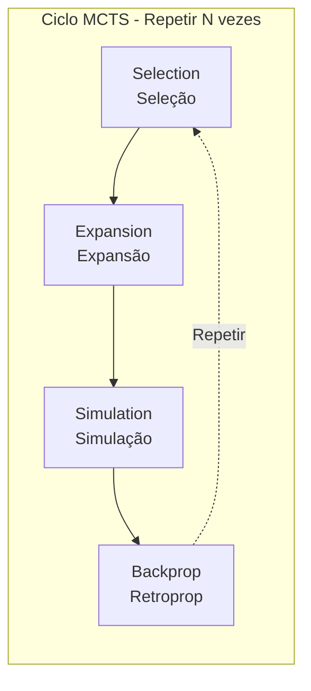
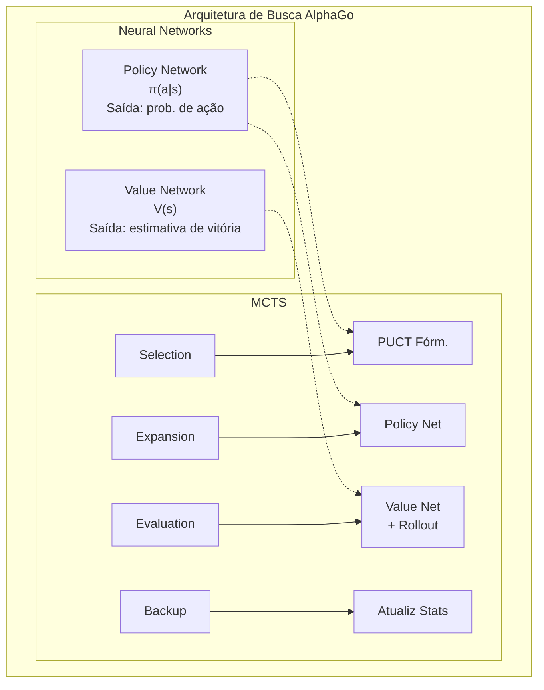

import { MCTSTree } from '@site/src/components/D3Charts';

# A Combinação de MCTS e Redes Neurais

Nos artigos anteriores, apresentamos separadamente as redes neurais (Policy Network e Value Network) e os conceitos de aprendizado por reforço. Agora, vamos explorar a inovação central do AlphaGo — **como combinar perfeitamente a Busca em Árvore de Monte Carlo (MCTS) com redes neurais**.

Esta combinação é a chave do sucesso do AlphaGo: as redes neurais fornecem "intuição", o MCTS fornece "raciocínio", e ambos se complementam.

---

## Revisão do MCTS Tradicional

### O que é MCTS?

**Monte Carlo Tree Search (MCTS)** é um algoritmo de busca baseado em amostragem aleatória, particularmente adequado para IA de jogos.

A ideia central do MCTS é: **em vez de enumerar todas as jogadas possíveis, é melhor simular aleatoriamente um grande número de partidas e usar estatísticas para estimar a qualidade de cada jogada**.

### Quatro Fases

O MCTS tradicional contém quatro fases que se repetem continuamente:



Vamos entender cada fase em detalhes:

### 1. Selection (Seleção)

A partir do nó raiz, descer pela árvore, selecionando o nó filho "mais promissor" até chegar a um nó folha.

O critério de seleção é a fórmula **UCB1 (Upper Confidence Bound)**:

$$\text{UCB1}(s, a) = \bar{X}_{s,a} + c \sqrt{\frac{\ln N_s}{N_{s,a}}}$$

Onde:
- $\bar{X}_{s,a}$: Retorno médio a partir do nó $(s, a)$ (**termo de exploração**)
- $\sqrt{\frac{\ln N_s}{N_{s,a}}}$: Bônus de exploração (**termo de exploração**)
- $N_s$: Número de visitas do nó pai
- $N_{s,a}$: Número de visitas do nó filho
- $c$: Constante que equilibra exploração e aproveitamento

A sabedoria desta fórmula está em:
- Nós com menos visitas recebem um bônus de exploração maior
- À medida que o número de visitas aumenta, a seleção tende cada vez mais para nós com valor real mais alto

### 2. Expansion (Expansão)

Ao chegar a um nó folha, escolher uma ação não explorada e criar um novo nó filho.

```
Antes da expansão:              Depois da expansão:
     ○ (raiz)                       ○ (raiz)
    /│\                            /│\
   ○ ○ ○                          ○ ○ ○
  /│              →              /│
 ○ ○                            ○ ○
   ↑                               \
   nó folha                         ● (novo nó)
```

### 3. Simulation (Simulação/Rollout)

A partir do novo nó, usar alguma estratégia (geralmente aleatória ou heurística simples) para completar rapidamente a partida e obter o resultado.

Esta é a origem do nome "Monte Carlo" — **usar simulação aleatória para estimar resultados**.

A estratégia de rollout do MCTS tradicional pode ser:
- **Puramente aleatória**: Escolher uniformemente entre as jogadas legais
- **Heurística leve**: Usar regras simples para filtrar jogadas claramente ruins

### 4. Backpropagation (Retropropagação)

Propagar o resultado da simulação (vitória/derrota) de volta pelo caminho, atualizando as estatísticas de cada nó:

```
Conteúdo da atualização:
- Contagem de visitas: N(s, a) ← N(s, a) + 1
- Valor acumulado: W(s, a) ← W(s, a) + z
- Valor médio: Q(s, a) = W(s, a) / N(s, a)
```

Onde $z$ é o resultado da simulação (+1 ou -1).

### Limitações do MCTS Tradicional

O MCTS tradicional tem desempenho limitado no Go, os principais problemas são:

1. **Baixa qualidade do Rollout**: A simulação aleatória frequentemente produz partidas irracionais
2. **Necessidade de muitas simulações**: Cada jogada pode exigir dezenas de milhares de simulações
3. **Avaliação imprecisa**: Dependendo apenas de estatísticas de vitória/derrota, a eficiência da utilização de informação é baixa
4. **Incapacidade de aproveitar padrões**: Recomeça a busca toda vez, não acumula experiência

Esses problemas foram elegantemente resolvidos no AlphaGo pelas redes neurais.

---

## Como as Redes Neurais Melhoram o MCTS

### Arquitetura Geral

O AlphaGo integra duas redes neurais no MCTS:



### O Papel da Policy Network

**A Policy Network atua na fase de Expansão**.

No MCTS tradicional, todas as ações não exploradas na expansão são consideradas igualmente importantes. Mas a Policy Network fornece **probabilidades a priori (prior probability)**:

$$P(s, a) = \pi_\theta(a|s)$$

Isso faz o MCTS explorar prioritariamente as jogadas que "parecem melhores", aumentando significativamente a eficiência da busca.

Por exemplo, em uma posição:
- "Tengen" pode ter apenas 0.01% de probabilidade
- "Joseki de canto" pode ter 15% de probabilidade
- "Ponto grande" pode ter 10% de probabilidade

O MCTS explorará prioritariamente as jogadas de alta probabilidade, em vez de desperdiçar tempo em escolhas claramente ruins.

### O Papel da Value Network

**A Value Network atua na fase de Avaliação**.

O MCTS tradicional precisa completar toda a partida para obter uma avaliação. Mas a Value Network pode avaliar diretamente a taxa de vitória de qualquer posição:

$$v(s) = V_\phi(s)$$

É como pedir a um mestre para avaliar a posição, em vez de deixar dois iniciantes jogarem toda a partida para ver o resultado.

A versão original do AlphaGo usa uma mistura de Value Network e Rollout:

$$V(s_L) = (1 - \lambda) \cdot v_\theta(s_L) + \lambda \cdot z_L$$

Onde:
- $v_\theta(s_L)$: Avaliação da Value Network
- $z_L$: Resultado do Rollout
- $\lambda$: Coeficiente de mistura (AlphaGo usa $\lambda = 0.5$)

### Visualização da Árvore de Busca

Vamos visualizar uma árvore de busca MCTS:

<MCTSTree width={700} height={450} showPUCT={true} interactive={true} />

Nesta visualização, você pode ver:
- O tamanho do nó reflete o número de visitas
- O caminho azul é o melhor caminho selecionado pelo MCTS
- Cada nó mostra o número de visitas N e o valor médio Q

---

## Detalhes do Processo de Busca

### Fluxo Completo

Vamos acompanhar uma simulação completa do MCTS:

```
Algoritmo: Simulação Única MCTS do AlphaGo

Entrada: nó raiz s_root, Policy Network π, Value Network V

1. Selection (Seleção)
   s = s_root
   caminho = []

   while s não é nó folha:
       # Usar fórmula PUCT para selecionar ação
       a* = argmax_a [Q(s,a) + U(s,a)]

       onde U(s,a) = c_puct · P(s,a) · √N(s) / (1 + N(s,a))

       caminho.append((s, a*))
       s = estado após executar ação a*

2. Expansion (Expansão)
   Se s não é estado terminal:
       # Usar Policy Network para calcular probabilidades a priori
       P(s, ·) = π(·|s)

       # Criar nós filhos para todas as ações legais
       for a in ações_legais:
           criar nó filho (s, a)
           definir P(s,a), N(s,a)=0, W(s,a)=0

3. Evaluation (Avaliação)
   # Misturar Value Network e Rollout
   v = V(s)                          # Avaliação da Value Network
   z = rollout(s)                    # Resultado do Rollout
   valor = (1-λ)·v + λ·z             # Mistura

   # AlphaGo Zero simplifica para usar apenas Value Network
   # valor = V(s)

4. Backpropagation (Retropropagação)
   for (s', a') in reverso(caminho):
       N(s', a') += 1
       W(s', a') += valor
       Q(s', a') = W(s', a') / N(s', a')
       valor = -valor                 # Alternar perspectiva
```

### Detalhes da Fase de Seleção

A fase de seleção usa a **fórmula PUCT** (que será discutida em detalhes no próximo artigo):

$$a^* = \arg\max_a \left[ Q(s,a) + c_{\text{puct}} \cdot P(s,a) \cdot \frac{\sqrt{N(s)}}{1 + N(s,a)} \right]$$

Esta fórmula equilibra:
- **Q(s,a)**: Valor médio conhecido (aproveitamento)
- **U(s,a)**: Bônus de exploração, combinando probabilidade a priori e contagem de visitas (exploração)

### Detalhes da Fase de Expansão

Ao chegar a um nó folha, usar a Policy Network para inicializar novos nós:

```python
def expand(state, policy_network):
    # Obter probabilidades para todas as ações legais
    action_probs = policy_network(state)

    # Filtrar ações ilegais e renormalizar
    legal_actions = get_legal_actions(state)
    legal_probs = action_probs[legal_actions]
    legal_probs = legal_probs / legal_probs.sum()

    # Criar nós filhos
    for action, prob in zip(legal_actions, legal_probs):
        child = create_node(
            state=apply_action(state, action),
            prior=prob,
            visit_count=0,
            value_sum=0
        )
        add_child(current_node, action, child)
```

### Detalhes da Fase de Avaliação

A versão original do AlphaGo usa duas avaliações misturadas:

**Avaliação da Value Network**:
- Entrada direta da posição, saída da taxa de vitória
- Cálculo rápido (uma inferência de rede neural)
- Fornece avaliação de perspectiva global

**Avaliação do Rollout**:
- Usar política rápida (Fast Rollout Policy) para completar a partida
- Cálculo mais lento mas fornece resultado completo da partida
- Pode descobrir algumas táticas que a rede neural pode ignorar

```python
def evaluate(state, value_network, rollout_policy, lambda_mix=0.5):
    # Avaliação da Value Network
    v = value_network(state)

    # Avaliação do Rollout
    current = state
    while not is_terminal(current):
        action = rollout_policy(current)
        current = apply_action(current, action)
    z = get_result(current)

    # Mistura
    return (1 - lambda_mix) * v + lambda_mix * z
```

O AlphaGo Zero removeu o Rollout, usando apenas a Value Network. Isso simplificou o sistema e aumentou a eficiência.

### Detalhes da Retropropagação

Propagar os resultados da avaliação de volta pelo caminho, atualizando estatísticas:

```python
def backpropagate(path, value):
    for state, action in reversed(path):
        # Atualizar contagem de visitas
        state.visit_count[action] += 1
        # Atualizar soma de valores
        state.value_sum[action] += value
        # Atualizar valor médio
        state.Q[action] = state.value_sum[action] / state.visit_count[action]
        # Alternar perspectiva (o benefício do oponente é minha perda)
        value = -value
```

Note o passo `value = -value`: Go é um jogo de soma zero, a vitória de um lado é a derrota do outro.

---

## Alocação de Recursos Computacionais

### Número de Simulações

O AlphaGo executa um grande número de simulações MCTS em cada jogada:

| Versão | Simulações por jogada | Tempo de reflexão |
|--------|----------------------|-------------------|
| AlphaGo Fan | ~100.000 | Minutos |
| AlphaGo Lee | ~100.000 | Minutos |
| AlphaGo Zero (treinamento) | 1.600 | Segundos |
| AlphaGo Zero (competição) | ~1.600 | Segundos |

O AlphaGo Zero alcança uma força maior com menos simulações, resultado da melhoria da qualidade da rede neural.

### Estratégia de Alocação de Tempo

Diferentes posições podem exigir diferentes tempos de reflexão:

```python
def allocate_time(game_state, remaining_time):
    # Alocação básica
    num_moves_remaining = estimate_remaining_moves(game_state)
    base_time = remaining_time / num_moves_remaining

    # Fatores de ajuste
    complexity = estimate_complexity(game_state)
    importance = estimate_importance(game_state)

    # Dar mais tempo para posições complexas ou importantes
    allocated_time = base_time * complexity * importance

    # Garantir que não exceda o tempo
    return min(allocated_time, remaining_time * 0.3)
```

Em competições reais, o AlphaGo investe mais tempo de reflexão em posições críticas (como momentos próximos à fronteira entre vitória e derrota).

### Busca Paralela

O MCTS é naturalmente adequado para paralelização:

**Técnica de Perda Virtual (Virtual Loss)**:

```
Quando um thread está explorando o caminho P:
1. Temporariamente assumir que este caminho já perdeu (virtual loss)
2. Outros threads tenderão a explorar outros caminhos
3. Quando o resultado retornar, atualizar estatísticas reais e remover virtual loss
```

Isso garante que múltiplos threads não explorem repetidamente o mesmo caminho.

```python
def parallel_mcts_simulation(root, num_threads=8):
    virtual_losses = {}

    def simulate(thread_id):
        # Fase de seleção (com virtual loss)
        path = []
        node = root
        while not node.is_leaf():
            action = select_with_virtual_loss(node, virtual_losses)
            add_virtual_loss(node, action, virtual_losses)
            path.append((node, action))
            node = node.children[action]

        # Expansão e avaliação
        value = expand_and_evaluate(node)

        # Retropropagação e remoção de virtual losses
        backpropagate(path, value)
        remove_virtual_losses(path, virtual_losses)

    # Executar múltiplas simulações em paralelo
    threads = [Thread(target=simulate, args=(i,)) for i in range(num_threads)]
    for t in threads:
        t.start()
    for t in threads:
        t.join()
```

### Processamento em Lote na GPU

A inferência de rede neural é mais eficiente na GPU com processamento em lote. O AlphaGo usa **avaliação em lote**:

```
Sem lote:
  Simulação 1 → Avaliação 1 → Simulação 2 → Avaliação 2 → ...
  Baixa utilização da GPU

Com lote:
  Coletar 32 posições para avaliar
  → Enviar todas de uma vez para a GPU avaliar
  → Retornar 32 resultados
  Alta utilização da GPU
```

Isso requer agendamento mais complexo, mas aumenta significativamente o throughput.

---

## Temperatura e Seleção Final

### Temperatura Durante o Treinamento

Durante o treinamento de auto-jogo, o AlphaGo usa **temperatura** para controlar a exploração:

$$\pi(a) = \frac{N(s,a)^{1/\tau}}{\sum_{a'} N(s,a')^{1/\tau}}$$

Onde $\tau$ é o parâmetro de temperatura.

- $\tau = 1$: Probabilidade proporcional à contagem de visitas (manter diversidade)
- $\tau \to 0$: Selecionar a ação com mais visitas (seleção determinística)

Estratégia do AlphaGo Zero:
- **Primeiras 30 jogadas**: $\tau = 1$, manter diversidade de abertura
- **Depois**: $\tau \to 0$, selecionar a melhor jogada

### Seleção Durante a Competição

Em competições reais, a seleção é geralmente determinística:

```python
def select_move(root, temperature=0):
    if temperature == 0:
        # Selecionar ação com mais visitas
        return argmax(root.visit_counts)
    else:
        # Amostrar pela distribuição de probabilidade ajustada pela temperatura
        probs = root.visit_counts ** (1 / temperature)
        probs = probs / probs.sum()
        return np.random.choice(actions, p=probs)
```

### Considerando Taxa de Vitória

Às vezes também se considera o valor médio em vez de apenas a contagem de visitas:

```python
def select_move_with_value(root, temperature=0):
    # Misturar contagem de visitas e valor
    scores = root.visit_counts * (1 + root.Q_values)
    scores = scores / scores.sum()

    if temperature == 0:
        return argmax(scores)
    else:
        probs = scores ** (1 / temperature)
        probs = probs / probs.sum()
        return np.random.choice(actions, p=probs)
```

---

## Comparação com Rede Neural Pura

### Por que Precisamos de Busca?

Uma pergunta natural é: **Se a rede neural já pode prever boas jogadas, por que ainda precisamos de busca?**

A resposta é: **A busca pode corrigir erros da rede neural e descobrir jogadas melhores**.

| Método | Vantagens | Desvantagens |
|--------|-----------|--------------|
| Rede neural pura | Rápida, intuitiva | Pode ter pontos cegos |
| MCTS puro | Pode analisar profundamente | Lento, precisa de avaliação |
| Rede neural + MCTS | Combina vantagens de ambos | Alto custo computacional |

### Evidências Experimentais

Experimentos da DeepMind mostram:

```
Policy Network pura: ~3000 Elo
Policy + pouco MCTS: ~3500 Elo
Policy + Value + MCTS: ~4500 Elo
```

A busca proporciona uma melhoria significativa na força do jogo.

### O Valor da Busca

A busca é particularmente valiosa nas seguintes situações:

1. **Cálculo tático**: Calcular ataques e capturas complexos
2. **Correção de viés**: Corrigir erros sistemáticos da rede neural
3. **Lidar com posições raras**: A rede neural pode não ter visto durante o treinamento
4. **Verificar intuição**: Confirmar que uma jogada que "parece boa" realmente é boa

---

## Diferenças Entre Versões do AlphaGo

### AlphaGo Fan/Lee

```
Arquitetura:
- SL Policy Network (aprendizado supervisionado)
- RL Policy Network (aprendizado por reforço)
- Value Network
- Fast Rollout Policy

Durante a busca:
- Usa probabilidades a priori da SL Policy Network
- Mistura avaliação da Value Network e Rollout
```

### AlphaGo Master

```
Arquitetura:
- Rede neural maior
- Mais dados de treinamento
- Características melhoradas

Durante a busca:
- Similar ao AlphaGo Lee
- Rede mais forte = menos necessidade de busca
```

### AlphaGo Zero

```
Arquitetura:
- Única ResNet de cabeça dupla
- Treinamento do zero
- Sem Rollout

Durante a busca:
- Cabeça de política fornece probabilidades a priori
- Cabeça de valor avalia diretamente
- Mais simples e mais forte
```

### Resumo da Evolução

```
AlphaGo Fan (2015)
    │
    │ + rede maior, mais treinamento
    ▼
AlphaGo Lee (2016)
    │
    │ + mais auto-jogo
    ▼
AlphaGo Master (2017)
    │
    │ + remoção de dados humanos, rede unificada, remoção de Rollout
    ▼
AlphaGo Zero (2017)
    │
    │ + generalização para outros jogos
    ▼
AlphaZero (2018)
```

---

## Considerações de Implementação

### Gerenciamento de Memória

A árvore MCTS pode ficar muito grande:

```
Suponha:
- Média de 200 ações legais por jogada
- Profundidade de busca 10
- Expansão completa: 200^10 ≈ 10^23 nós (impossível)

Abordagem real:
- Expandir apenas nós visitados
- Limpar periodicamente nós raramente visitados
- Reutilizar a árvore de busca da jogada anterior
```

### Reutilização da Árvore

Quando o oponente joga, parte da árvore de busca pode ser reutilizada:

```python
def reuse_tree(root, opponent_move):
    if opponent_move in root.children:
        new_root = root.children[opponent_move]
        # Limpar outros ramos desnecessários
        for action in root.children:
            if action != opponent_move:
                delete_subtree(root.children[action])
        return new_root
    else:
        # Oponente jogou uma jogada inesperada, precisa recomeçar
        return create_new_root()
```

### Cache da Rede Neural

A mesma posição pode ser avaliada múltiplas vezes, usar cache evita cálculos repetidos:

```python
class NeuralNetworkCache:
    def __init__(self, max_size=100000):
        self.cache = LRUCache(max_size)

    def evaluate(self, state, network):
        state_hash = hash(state)
        if state_hash in self.cache:
            return self.cache[state_hash]
        else:
            result = network(state)
            self.cache[state_hash] = result
            return result
```

### Utilização de Simetria

O tabuleiro de Go tem 8 simetrias que podem ser usadas para melhorar a busca:

```python
def evaluate_with_symmetry(state, network):
    # Gerar todas as transformações simétricas
    symmetries = generate_symmetries(state)  # 8 versões

    # Avaliar todas as versões
    values = [network(s) for s in symmetries]

    # Média (mais estável)
    return np.mean(values)
```

---

## Profundidade e Largura da Busca

### Ajuste Dinâmico

O MCTS equilibra automaticamente profundidade e largura:

- **Largura**: Controlada pelas probabilidades a priori da Policy Network
- **Profundidade**: Determinada pela precisão da Value Network

Quando a rede neural é boa:
- Jogadas de alta confiança são exploradas mais profundamente
- Jogadas de baixa confiança são rapidamente descartadas
- A busca naturalmente foca nos ramos importantes

### Comparação com Busca Tradicional

| Método | Controle de Profundidade | Controle de Largura |
|--------|--------------------------|---------------------|
| Minimax | Profundidade fixa | Poda Alpha-Beta |
| MCTS tradicional | Determinado por simulação | UCB1 |
| AlphaGo MCTS | Guiado por Policy + Value | PUCT + Policy |

A busca do AlphaGo é mais "inteligente" — ela sabe quais lugares valem a pena aprofundar e quais podem ser rapidamente ignorados.

---

## Correspondência de Animações

Conceitos centrais discutidos neste artigo e números de animação:

| Número | Conceito | Correspondência Física/Matemática |
|--------|----------|-----------------------------------|
| 🎬 C5 | Quatro fases do MCTS | Busca em árvore |

---

## Resumo

A combinação de MCTS com redes neurais é a inovação central do AlphaGo. Aprendemos:

1. **MCTS tradicional**: Selection, Expansion, Simulation, Backpropagation
2. **Melhorias das redes neurais**: Policy Network guia a expansão, Value Network substitui o Rollout
3. **Processo de busca**: Seleção PUCT, avaliação em lote, retropropagação
4. **Alocação de recursos**: Número de simulações, gerenciamento de tempo, busca paralela
5. **Seleção por temperatura**: Diferentes estratégias para treinamento e competição
6. **Detalhes de implementação**: Gerenciamento de memória, reutilização da árvore, cache

No próximo artigo, exploraremos os detalhes matemáticos da fórmula PUCT.

---

## Leitura Adicional

- **Próximo artigo**: [Fórmula PUCT em Detalhes](../puct-formula) — O princípio matemático da seleção MCTS
- **Artigo anterior**: [Auto-jogo](../self-play) — O mecanismo e efeito do auto-jogo
- **Relacionado**: [Detalhes da Policy Network](../policy-network) — Arquitetura da rede de políticas

---

## Referências

1. Silver, D., et al. (2016). "Mastering the game of Go with deep neural networks and tree search." *Nature*, 529, 484-489.
2. Silver, D., et al. (2017). "Mastering the game of Go without human knowledge." *Nature*, 550, 354-359.
3. Coulom, R. (2006). "Efficient Selectivity and Backup Operators in Monte-Carlo Tree Search." *Computers and Games*.
4. Kocsis, L., & Szepesvári, C. (2006). "Bandit based Monte-Carlo Planning." *ECML*.
5. Browne, C., et al. (2012). "A Survey of Monte Carlo Tree Search Methods." *IEEE TCIAIG*.
6. Rosin, C. D. (2011). "Multi-armed bandits with episode context." *Annals of Mathematics and Artificial Intelligence*.
