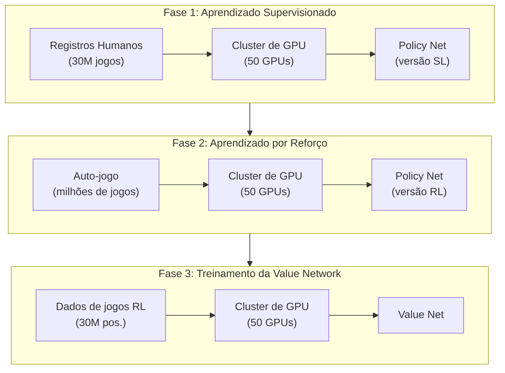
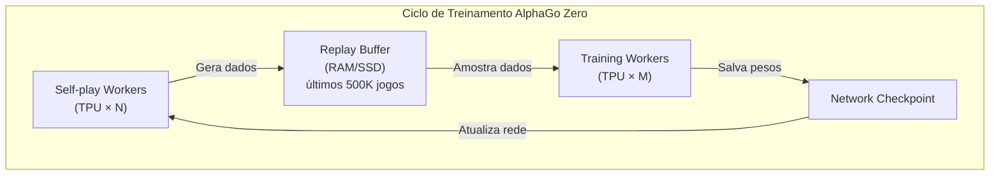
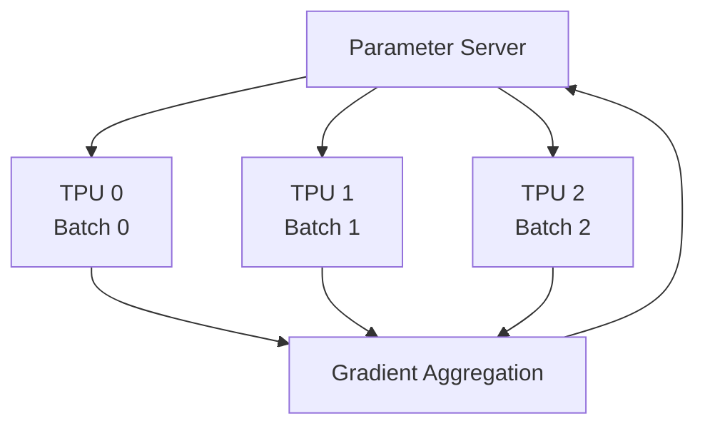
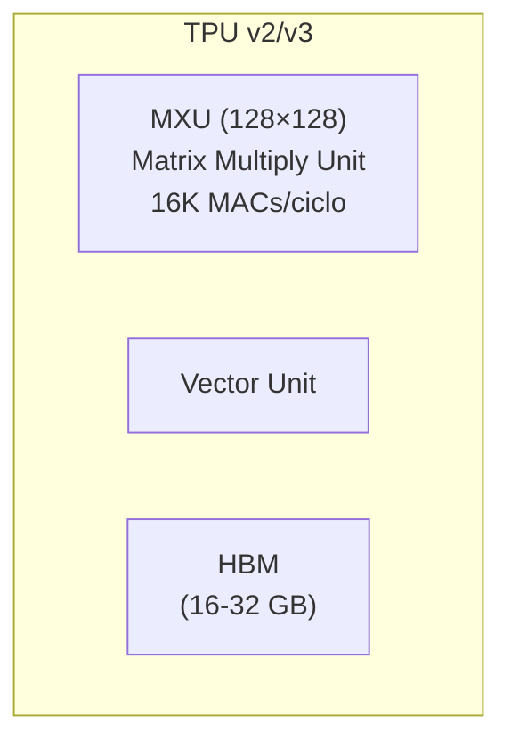
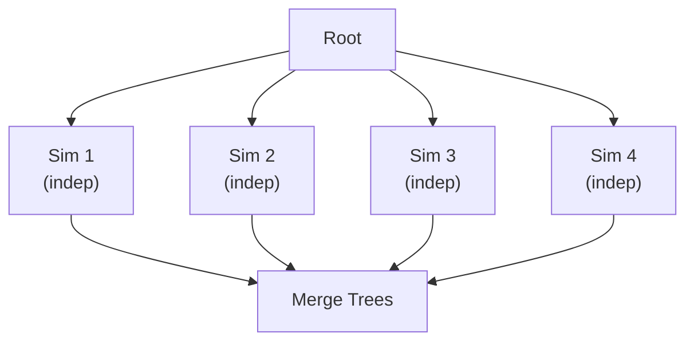
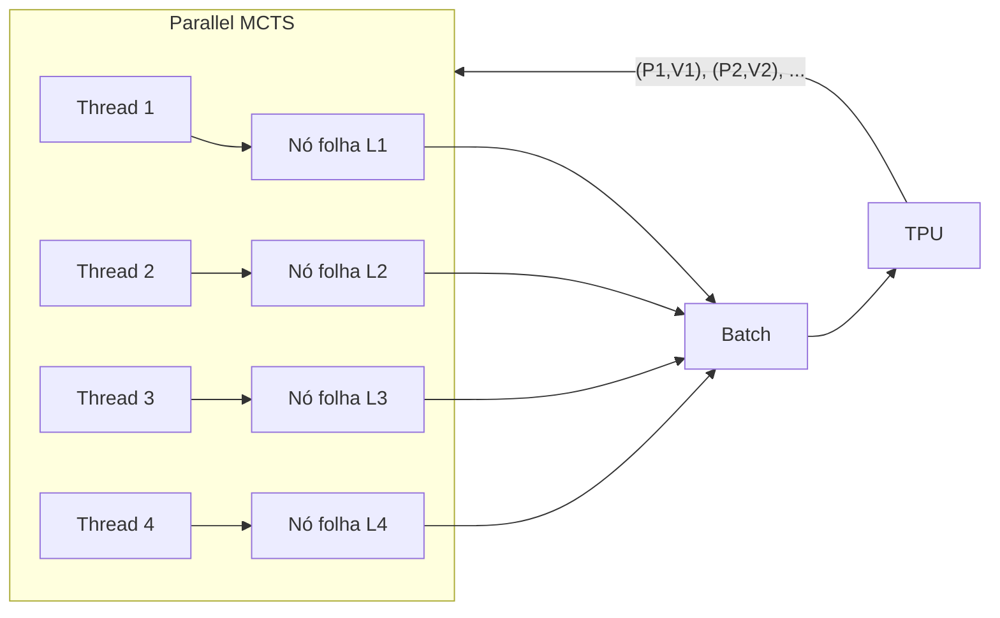
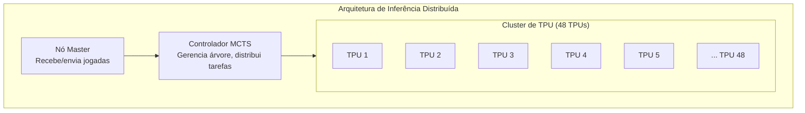

# Sistemas Distribuídos e TPU

O sucesso do AlphaGo não foi apenas uma vitória de algoritmos, mas também uma vitória de engenharia. Para treinar uma IA de Go que supera os humanos em tempo razoável, foi necessário um sistema distribuído cuidadosamente projetado e suporte de hardware especializado.

Este artigo analisará profundamente a arquitetura de sistemas por trás do AlphaGo, incluindo fluxo de treinamento, arquitetura de inferência, MCTS paralelo e o papel crucial das TPUs.

---

## Visão Geral da Arquitetura de Treinamento

### Arquitetura de Treinamento do AlphaGo Original

A arquitetura de treinamento do AlphaGo original (a versão que derrotou Lee Sedol) foi dividida em múltiplas fases, cada uma usando uma configuração de recursos diferente:



### Arquitetura de Treinamento do AlphaGo Zero

O AlphaGo Zero simplificou significativamente o processo de treinamento, usando um único ciclo de treinamento de ponta a ponta:



As vantagens desta arquitetura:

1. **Aprendizado contínuo**: Self-play e Training acontecem simultaneamente, sem necessidade de esperar
2. **Eficiência de recursos**: Todos os recursos estão fazendo trabalho útil
3. **Iteração rápida**: A rede atualizada é imediatamente usada para gerar novos dados

---

## Workers de Auto-Jogo (Self-play Workers)

### Distribuição de Tarefas

Os Self-play Workers são responsáveis por realizar auto-jogo com a rede mais forte atual, gerando dados de treinamento.

| Configuração | AlphaGo Zero |
|--------------|--------------|
| Número de Workers | Dezenas |
| Por Worker | 1-4 TPU |
| MCTS por jogo | 1600 simulações |
| Produção diária | ~100.000 jogos |

### Fluxo de Trabalho

O fluxo de trabalho de cada Self-play Worker:

```python
while True:
    # 1. Baixar os pesos da rede mais recente
    network = download_latest_checkpoint()

    # 2. Realizar múltiplos jogos de auto-jogo
    for game in range(batch_size):
        positions = []
        board = EmptyBoard()

        while not board.is_terminal():
            # Executar MCTS
            mcts = MCTS(network, board)
            policy = mcts.search(num_simulations=1600)

            # Selecionar jogada
            action = sample(policy)

            # Registrar
            positions.append((board.state, policy))

            # Jogar
            board = board.play(action)

        # 3. Obter resultado do jogo
        result = board.get_result()

        # 4. Fazer upload dos dados
        upload_to_replay_buffer(positions, result)
```

### Balanceamento de Carga

Múltiplos Workers precisam de balanceamento de carga:

- **Sincronização de rede**: Todos os Workers usam a mesma versão da rede
- **Balanceamento de dados**: Garantir que os dados de diferentes Workers sejam todos utilizados
- **Tratamento de falhas**: Falha de um único Worker não afeta o treinamento geral

---

## Workers de Treinamento (Training Workers)

### Distribuição de Tarefas

Os Training Workers são responsáveis por amostrar dados do Replay Buffer e treinar a rede neural.

| Configuração | AlphaGo Zero |
|--------------|--------------|
| Número de Workers | 1-4 |
| Por Worker | 4 TPU |
| Batch Size | 2048 (512 por TPU) |
| Passos de treinamento | Dezenas de milhares por dia |

### Treinamento Distribuído

O treinamento em larga escala usa **Paralelismo de Dados (Data Parallelism)**:



Cada TPU processa um mini-batch diferente, calcula o gradiente local e então agrega para atualizar os parâmetros globais.

### Atualização Síncrona vs. Assíncrona

| Modo de atualização | Vantagens | Desvantagens |
|---------------------|-----------|--------------|
| Síncrono | Estável, reproduzível | Workers precisam esperar pelo mais lento |
| Assíncrono | Alto throughput | Gradientes podem estar desatualizados |

O AlphaGo Zero usa **atualização síncrona** para garantir a estabilidade do treinamento.

---

## O Papel das TPUs

### O Que é uma TPU?

**TPU (Tensor Processing Unit)** é um acelerador projetado especificamente pela Google para deep learning:

| Característica | TPU | GPU | CPU |
|----------------|-----|-----|-----|
| Objetivo de design | Operações matriciais | Paralelismo geral | Computação geral |
| Precisão | Otimizado para FP16/BF16 | FP32/FP16 | FP64/FP32 |
| Consumo de energia | Relativamente baixo | Mais alto | Mais alto |
| Latência | Baixa | Média | Alta |

### Arquitetura da TPU

O núcleo da TPU é a **MXU (Matrix Multiply Unit)**:



A MXU pode executar 16K operações de multiplicação-acumulação por ciclo, o que é crucial para a multiplicação de matrizes em redes neurais.

### Por Que o AlphaGo Precisa de TPUs?

O gargalo computacional da IA de Go está na **inferência da rede neural**:

| Operação | Proporção |
|----------|-----------|
| Forward pass da rede neural | ~95% |
| Operações da árvore MCTS | ~4% |
| Outros | ~1% |

Cada passo do MCTS requer 1600 inferências da rede neural. O alto throughput das TPUs torna isso possível.

### Evolução do Uso de TPUs

| Versão | TPU para Treinamento | TPU para Inferência |
|--------|---------------------|---------------------|
| AlphaGo Lee | 50 GPU | 48 TPU (v1) |
| AlphaGo Master | 4 TPU (v2) | 4 TPU (v2) |
| AlphaGo Zero | 4 TPU (v2) | 4 TPU (v2) (escalável) |

O número de TPUs usadas pelo AlphaGo Zero diminuiu significativamente, graças a uma arquitetura mais eficiente e versões mais recentes das TPUs.

---

## MCTS Paralelo e Perda Virtual

### O Desafio da Paralelização

A implementação padrão do MCTS é **serial**:

```
for i in range(num_simulations):
    1. Selection: Selecionar da raiz para baixo
    2. Expansion: Expandir nó folha
    3. Evaluation: Avaliação da rede neural
    4. Backup: Propagar atualização para cima
```

Mas a avaliação da rede neural é uma **operação em batch** amigável para GPU/TPU. Como fazer múltiplas simulações ocorrerem simultaneamente?

### Paralelização de Folhas (Leaf Parallelization)

A forma mais simples de paralelização: executar múltiplas simulações completas simultaneamente, depois mesclar os resultados.



Problema: Cada simulação começa da raiz, e pode explorar repetidamente os mesmos caminhos.

### Perda Virtual (Virtual Loss)

A DeepMind adotou a técnica de **perda virtual** para implementar Paralelização de Árvore (Tree Parallelization).

#### Conceito Básico

Quando uma thread está explorando um determinado nó, reduz temporariamente o valor desse nó, fazendo com que outras threads escolham outros caminhos.

```
UCB normal: Q(s,a) + c * P(s,a) * sqrt(N(s)) / (1 + N(s,a))

Com perda virtual:
(Q(s,a) * N(s,a) - v * n_virtual) / (N(s,a) + n_virtual) + c * P(s,a) * sqrt(N(s)) / (1 + N(s,a) + n_virtual)
```

Onde:
- `n_virtual` é o número de threads explorando esse nó
- `v` é o valor da perda virtual (geralmente 1 ou o valor correspondente à taxa de vitória)

#### Fluxo de Operação

```
Tempo T1:
  Thread 1 seleciona caminho A → B → C
  Nó C recebe perda virtual -1

Tempo T2:
  Thread 2 seleciona caminho A → B → D (porque C foi "penalizado")
  Nó D recebe perda virtual -1

Tempo T3:
  Thread 1 completa avaliação, atualiza valor real de C, remove perda virtual
  Thread 3 agora pode escolher C (se o valor real for bom o suficiente)
```

#### Efeitos da Perda Virtual

| Aspecto | Efeito |
|---------|--------|
| Diversidade de exploração | Força exploração de diferentes caminhos |
| Eficiência de batch | Pode avaliar múltiplos nós folha simultaneamente |
| Convergência | Perda virtual é eventualmente substituída pelo valor real, não afeta convergência |

### Avaliação de Rede Neural em Batch

Através da perda virtual, múltiplos nós folha a serem avaliados podem ser coletados para **inferência em batch**:



A eficiência da inferência em batch da TPU é muito maior que a inferência individual, tornando o MCTS paralelo possível.

---

## Arquitetura de Inferência

### Configuração Durante Partidas

A arquitetura de inferência do AlphaGo durante partidas oficiais:

| Versão | Configuração de Hardware |
|--------|--------------------------|
| AlphaGo Fan | 176 GPU |
| AlphaGo Lee | 48 TPU + múltiplos servidores |
| AlphaGo Master | 4 TPU |
| AlphaGo Zero | 4 TPU (escalável) |

### Fluxo de Inferência Distribuída

Fluxo de inferência durante partidas (usando AlphaGo Lee como exemplo):



### Gerenciamento de Tempo de Reflexão

Estratégia de gerenciamento de tempo do AlphaGo:

| Posição | Tempo de Reflexão | Simulações MCTS |
|---------|-------------------|-----------------|
| Abertura (tem joseki) | Mais curto | ~10.000 |
| Meio-jogo (complexo) | Mais longo | ~100.000 |
| Posição simples | Mais curto | ~5.000 |
| Byoyomi | Fixo | ~1.600 |

Mais simulações MCTS geralmente significam jogadas de melhor qualidade.

---

## Comunicação e Sincronização

### Formato de Dados

Formato de transmissão de dados de treinamento:

```protobuf
message TrainingExample {
    // Estado do tabuleiro (17 × 19 × 19)
    repeated float board_planes = 1;

    // Resultado da busca MCTS (362)
    repeated float mcts_policy = 2;

    // Resultado do jogo (1 = jogador atual vence, -1 = jogador atual perde)
    float game_result = 3;
}
```

### Requisitos de Largura de Banda de Rede

| Fluxo de dados | Tamanho | Frequência |
|----------------|---------|------------|
| Amostras de treinamento | ~10 KB/amostra | Milhares de amostras/segundo |
| Pesos da rede | ~200 MB | Várias vezes/hora |
| Mensagens de controle | < 1 KB | Contínuo |

Requisito total de largura de banda: ~100 Mbps (rede interna é suficiente)

### Tratamento de Falhas

Tratamento de falhas em sistemas distribuídos:

| Tipo de falha | Forma de tratamento |
|---------------|---------------------|
| Worker caiu | Reinicia, continua usando checkpoint mais recente |
| Desconexão de rede | Buffer de dados, continua transmissão após reconexão |
| Falha de TPU | Troca automática para TPU reserva |
| Dados corrompidos | Descarta após verificação, regenera |

---

## Análise de Custos

### Estimativa de Custos de Hardware

Estimativa de custos de treinamento do AlphaGo Zero baseada nos preços de TPU do Google Cloud:

| Recurso | Quantidade | Preço/hora | Total/dia |
|---------|------------|------------|-----------|
| TPU v2 Pod | 4 | ~$32 | ~$3.000 |
| VM alta memória | Vários | ~$5 | ~$500 |
| Espaço de armazenamento | 10 TB | ~$0.02/GB | ~$200 |
| Rede | - | Incluído | - |

**Aproximadamente $3.700/dia**, treinamento completo (40 dias) aproximadamente **$150.000**.

Nota: Esta é uma estimativa de 2017, a DeepMind como subsidiária do Google pode ter descontos internos.

### Comparação com Treinamento Humano

| Aspecto | AlphaGo Zero | Jogador profissional humano |
|---------|--------------|----------------------------|
| Tempo para nível profissional | 2 dias | 10-15 anos |
| Custo de treinamento | ~$7.500 | Milhões (mensalidades, custo de vida, custo de oportunidade) |
| Custos contínuos | Eletricidade | Custo de vida |
| Replicabilidade | Réplica perfeita | Não replicável |

Claro, esta comparação não é totalmente justa — os humanos aprendem muito mais do que apenas Go durante seu treinamento.

### Custos de Inferência

Custos de inferência em partidas oficiais:

| Configuração | Custo por jogo |
|--------------|----------------|
| 48 TPU (AlphaGo Lee) | ~$500 |
| 4 TPU (AlphaGo Zero) | ~$50 |
| GPU única (KataGo) | ~$1 |

Os custos de inferência diminuíram significativamente com o avanço tecnológico.

---

## Evolução Tecnológica

### De AlphaGo a AlphaZero

| Aspecto | AlphaGo Lee | AlphaGo Zero | AlphaZero |
|---------|-------------|--------------|-----------|
| TPU de treinamento | 50+ GPU → TPU | 4 TPU | 4 TPU |
| TPU de inferência | 48 TPU | 4 TPU | 4 TPU |
| MCTS/jogada | ~100.000 | ~1.600 | ~800 |
| Tempo de treinamento | Meses | 40 dias | Horas a dias |

Melhoria de eficiência de aproximadamente 100 vezes.

### Impacto na Comunidade Open Source

A arquitetura do AlphaGo inspirou múltiplos projetos open source:

| Projeto | Características |
|---------|-----------------|
| Leela Zero | Treinamento distribuído comunitário, replica AlphaGo Zero |
| KataGo | Treinamento eficiente em GPU única, supera AlphaGo Zero |
| ELF OpenGo | Open source do Facebook, usa PyTorch |
| Minigo | Open source do Google, usa TensorFlow |

Esses projetos permitem que pesquisadores comuns também possam treinar IAs de Go poderosas.

---

## Correspondência com Animações

Os conceitos principais deste artigo e números de animação correspondentes:

| Número | Conceito | Correspondência Física/Matemática |
|--------|----------|-----------------------------------|
| 🎬 C9 | MCTS paralelo | Problema de N-corpos |
| 🎬 E9 | Treinamento distribuído | Computação distribuída |
| 🎬 C5 | Perda virtual | Potencial de repulsão |
| 🎬 D15 | Inferência em batch | Computação vetorizada |

---

## Leitura Adicional

- **Artigo anterior**: [O Processo de Treinamento do Zero](../training-from-scratch) — Análise detalhada da curva de treinamento
- **Próximo artigo**: [O Legado do AlphaGo](../legacy-and-impact) — O impacto profundo do AlphaGo no campo da IA
- **Artigo relacionado**: [A Combinação de MCTS e Redes Neurais](../mcts-neural-combo) — Conhecimentos básicos de MCTS

---

## Referências

1. Silver, D., et al. (2017). "Mastering the game of Go without human knowledge." *Nature*, 550, 354-359.
2. Jouppi, N., et al. (2017). "In-Datacenter Performance Analysis of a Tensor Processing Unit." *ISCA 2017*.
3. Dean, J., et al. (2012). "Large Scale Distributed Deep Networks." *NeurIPS 2012*.
4. Chaslot, G., et al. (2008). "Parallel Monte-Carlo Tree Search." *CIG 2008*.
5. Segal, R. (2010). "On the Scalability of Parallel UCT." *CIG 2010*.
