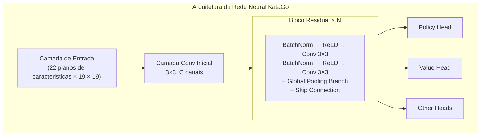
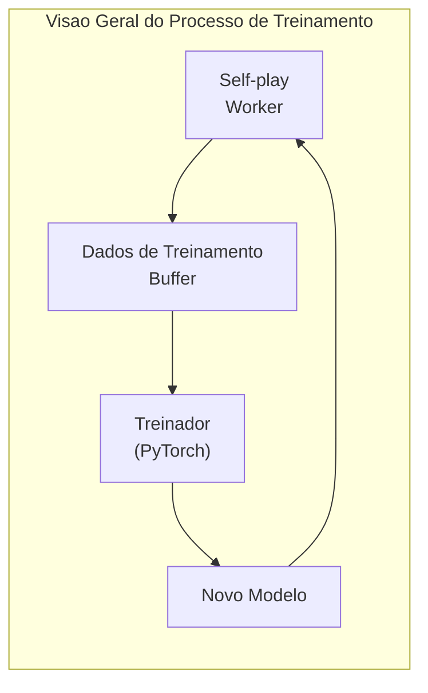

# Arquitetura do Codigo-fonte KataGo

Este artigo analisa profundamente a estrutura do codigo-fonte do KataGo, ajudando voce a entender sua implementacao interna. Seja para contribuir codigo, modificar funcionalidades ou aplicar sua tecnologia em seus proprios projetos, esta e uma referencia essencial.

## Estrutura de Diretorios do Projeto

```
KataGo/
├── cpp/                    # Codigo-fonte C++ principal
│   ├── main.cpp           # Ponto de entrada do programa principal
│   ├── command/           # Varios modos de execucao
│   ├── core/              # Classes utilitarias principais
│   ├── game/              # Regras e tabuleiro de Go
│   ├── search/            # Motor de busca MCTS
│   ├── neuralnet/         # Interface de rede neural
│   ├── dataio/            # I/O de dados
│   ├── configs/           # Exemplos de arquivos de configuracao
│   └── tests/             # Testes unitarios
├── python/                 # Codigo Python de treinamento
│   ├── train.py           # Programa principal de treinamento
│   ├── model.py           # Definicao do modelo
│   ├── data_processing_pytorch.py
│   └── configs/           # Configuracoes de treinamento
├── docs/                   # Documentacao
└── scripts/               # Scripts auxiliares
```

### Detalhes do Diretorio cpp/

```
cpp/
├── main.cpp                # Entrada do programa, analisa argumentos de linha de comando
├── command/
│   ├── gtp.cpp            # Implementacao do protocolo GTP
│   ├── analysis.cpp       # Implementacao do Analysis Engine
│   ├── benchmark.cpp      # Teste de benchmark
│   ├── genconfig.cpp      # Geracao de arquivo de configuracao
│   └── selfplay.cpp       # Self-play
├── core/
│   ├── global.h           # Constantes e configuracoes globais
│   ├── hash.h             # Hash Zobrist
│   ├── rand.h             # Geracao de numeros aleatorios
│   ├── logger.h           # Sistema de log
│   ├── config_parser.h    # Analise de arquivo de configuracao
│   └── threadsafe*.h      # Utilitarios thread-safe
├── game/
│   ├── board.h/cpp        # Representacao e operacoes basicas do tabuleiro
│   ├── rules.h/cpp        # Regras do Go
│   ├── boardhistory.h/cpp # Historico de jogos
│   └── graphhash.h/cpp    # Hash de posicao
├── search/
│   ├── search.h/cpp       # Classe principal do motor de busca
│   ├── searchnode.h/cpp   # No da arvore de busca
│   ├── searchparams.h     # Parametros de busca
│   ├── mutexpool.h        # Pool de locks
│   ├── searchresults.h    # Resultados de busca
│   └── asyncbot.h/cpp     # Bot assincrono
├── neuralnet/
│   ├── nninputs.h/cpp     # Caracteristicas de entrada da rede neural
│   ├── nneval.h/cpp       # Avaliacao da rede neural
│   ├── nninterface.h      # Interface abstrata de backend
│   ├── cudabackend.cpp    # Backend CUDA
│   ├── openclbackend.cpp  # Backend OpenCL
│   ├── eigenbackend.cpp   # Backend Eigen(CPU)
│   └── modelversion.h     # Gerenciamento de versao de modelo
└── dataio/
    ├── sgf.h/cpp          # Processamento de arquivo SGF
    ├── numpywrite.h/cpp   # Saida formato NumPy
    └── trainingwrite.h/cpp # Escrita de dados de treinamento
```

## Arquitetura da Rede Neural

### Visao Geral da Estrutura de Rede



### Caracteristicas de Entrada (nninputs.cpp)

KataGo usa 22 planos de caracteristicas como entrada:

```cpp
// Principais categorias de caracteristicas de entrada
enum {
  // Estado do tabuleiro
  INPUT_FEATURE_STONE_OUR,      // Nossas pedras
  INPUT_FEATURE_STONE_OPP,      // Pedras do oponente

  // Relacionado a liberdades (1-8 liberdades)
  INPUT_FEATURE_LIBERTIES_1,
  INPUT_FEATURE_LIBERTIES_2,
  // ...
  INPUT_FEATURE_LIBERTIES_8_OR_MORE,

  // Estado historico
  INPUT_FEATURE_LAST_MOVE,      // Posicao da ultima jogada
  INPUT_FEATURE_SECOND_LAST_MOVE,

  // Relacionado a regras
  INPUT_FEATURE_KOMI,           // Komi
  INPUT_FEATURE_RULES,          // Codificacao de regras
  // ...
};
```

### Branch de Global Pooling

Uma das inovacoes do KataGo e adicionar global pooling nos blocos residuais:

```cpp
// Conceito simplificado de implementacao de global pooling
class GlobalPoolingResBlock {
public:
  void forward(Tensor& x) {
    // Caminho residual padrao
    Tensor regular_out = regular_conv_path(x);

    // Caminho de global pooling
    Tensor global_mean = global_avg_pool(x);  // [batch, C]
    Tensor global_max = global_max_pool(x);    // [batch, C]
    Tensor global_features = concat(global_mean, global_max);

    // Processar caracteristicas globais
    global_features = dense_layer(global_features);  // [batch, C]

    // Broadcast de volta para dimensao espacial e combinar com caminho regular
    Tensor global_broadcast = broadcast_to_spatial(global_features);
    x = regular_out + global_broadcast;
  }
};
```

### Heads de Saida

```cpp
// Policy Head: Preve probabilidade de jogada
class PolicyHead {
  // Saida: 19x19+1 (incluindo pass)
  // Usa normalizacao softmax
};

// Value Head: Preve resultado do jogo
class ValueHead {
  // Saida: 3 (probabilidade de vitoria/derrota/empate)
  // Usa normalizacao softmax
};

// Score Head: Preve pontos
class ScoreHead {
  // Saida: Valor continuo (diferenca de pontos esperada)
};

// Ownership Head: Preve territorio
class OwnershipHead {
  // Saida: 19x19 (pertencimento de cada ponto, tanh)
};
```

## Implementacao do Motor de Busca

### Classes Principais do MCTS

```cpp
// search/search.h
class Search {
public:
  // Executar busca
  void runWholeSearch(Player pla);

  // Obter melhor jogada
  Loc getBestMove();

  // Obter resultados de analise
  AnalysisData getAnalysisData();

private:
  SearchParams params;          // Parametros de busca
  SearchNode* rootNode;         // No raiz
  NNEvaluator* nnEval;         // Avaliador de rede neural
  std::mutex* mutexPool;       // Pool de locks
};
```

### Estrutura do No de Busca

```cpp
// search/searchnode.h
struct SearchNode {
  // Estatisticas do no
  std::atomic<int64_t> visits;           // Numero de visitas
  std::atomic<double> valueSumWeight;    // Peso acumulado de valor
  std::atomic<double> valueSum;          // Soma acumulada de valor

  // Nos filhos
  std::atomic<int> numChildren;
  SearchChildPointer* children;          // Array de ponteiros para nos filhos

  // Cache de saida da rede neural
  std::shared_ptr<NNOutput> nnOutput;
};

struct SearchChildPointer {
  Loc moveLoc;                           // Posicao da jogada
  std::atomic<SearchNode*> node;         // Ponteiro para no filho
  std::atomic<int64_t> edgeVisits;       // Visitas da aresta
};
```

### Algoritmo de Selecao PUCT

```cpp
// Selecionar no filho para descer
int Search::selectChildToDescend(SearchNode* node, Player pla) {
  int bestIdx = -1;
  double bestValue = -1e100;

  for (int i = 0; i < node->numChildren; i++) {
    SearchChildPointer& child = node->children[i];

    // Calcular valor Q (exploitation)
    double q = getChildQ(child);

    // Calcular valor U (exploration)
    double prior = getPrior(node, child.moveLoc);
    double parentVisits = node->visits.load();
    double childVisits = child.edgeVisits.load();

    double u = params.cpuctExploration * prior *
               sqrt(parentVisits) / (1.0 + childVisits);

    // Formula PUCT
    double value = q + u;

    if (value > bestValue) {
      bestValue = value;
      bestIdx = i;
    }
  }

  return bestIdx;
}
```

### Implementacao de Busca Paralela

```cpp
void Search::runWholeSearch(Player pla) {
  // Iniciar multiplas threads de busca
  std::vector<std::thread> threads;
  for (int i = 0; i < params.numSearchThreads; i++) {
    threads.emplace_back([this, pla]() {
      runSingleSearchThread(pla);
    });
  }

  // Esperar todas as threads terminarem
  for (auto& t : threads) {
    t.join();
  }
}

void Search::runSingleSearchThread(Player pla) {
  while (!shouldStop()) {
    // Selecionar caminho
    std::vector<SearchNode*> path;
    SearchNode* leaf = selectAndDescend(rootNode, path);

    // Expandir no
    expandNode(leaf);

    // Avaliacao da rede neural
    NNOutput output = nnEval->evaluate(leaf->board);

    // Retropropagacao
    backpropagateValue(path, output.value);
  }
}
```

### Virtual Loss (Perda Virtual)

Usado para evitar que multiplas threads selecionem o mesmo caminho durante busca paralela:

```cpp
void Search::applyVirtualLoss(SearchNode* node) {
  // Reduzir temporariamente o valor de avaliacao deste no
  // Fazendo outras threads tenderem a selecionar caminhos diferentes
  node->virtualLoss.fetch_add(1);
}

void Search::removeVirtualLoss(SearchNode* node) {
  node->virtualLoss.fetch_sub(1);
}
```

## Visao Geral do Processo de Treinamento

### Geracao de Dados de Treinamento



### Self-play (cpp/command/selfplay.cpp)

```cpp
// Loop principal de Self-play
void runSelfPlayLoop() {
  while (true) {
    // Carregar modelo mais recente
    loadLatestModel();

    // Jogar um jogo
    GameData gameData = playSingleGame();

    // Salvar dados de treinamento
    writeTrainingData(gameData);
  }
}

GameData playSingleGame() {
  Board board;
  BoardHistory history;
  GameData gameData;

  while (!history.isGameOver()) {
    // Usar MCTS para escolher jogada
    Search search(board, history, params);
    search.runWholeSearch(history.currentPla);

    // Obter resultado MCTS como alvo de treinamento
    MoveData moveData;
    moveData.policyTarget = search.getPolicyDistribution();
    moveData.valueTarget = search.getValue();

    // Executar jogada
    Loc move = search.sampleMove();
    board.playMove(move, history.currentPla);

    gameData.moves.push_back(moveData);
  }

  // Preencher resultado final
  gameData.finalScore = history.finalScore();
  return gameData;
}
```

### Formato de Dados de Treinamento

```cpp
// dataio/trainingwrite.h
struct TrainingRow {
  // Caracteristicas de entrada
  float inputFeatures[NUM_FEATURES][BOARD_SIZE][BOARD_SIZE];

  // Alvos de treinamento
  float policyTarget[BOARD_SIZE * BOARD_SIZE + 1];  // Incluindo pass
  float valueTarget[3];                              // Vitoria/derrota/empate
  float scoreTarget;                                 // Pontos
  float ownershipTarget[BOARD_SIZE][BOARD_SIZE];    // Territorio

  // Metadados
  int turn;
  int rules;
  float komi;
};
```

### Programa de Treinamento Python (python/train.py)

```python
# Loop principal de treinamento (simplificado)
def train():
    model = KataGoModel(config)
    optimizer = torch.optim.SGD(model.parameters(), lr=config.lr)

    for epoch in range(config.num_epochs):
        for batch in data_loader:
            # Forward pass
            policy_pred, value_pred, score_pred, ownership_pred = model(batch.input)

            # Calcular perda
            policy_loss = cross_entropy(policy_pred, batch.policy_target)
            value_loss = cross_entropy(value_pred, batch.value_target)
            score_loss = mse_loss(score_pred, batch.score_target)
            ownership_loss = mse_loss(ownership_pred, batch.ownership_target)

            # Perda total (soma ponderada)
            total_loss = (
                policy_loss +
                config.value_weight * value_loss +
                config.score_weight * score_loss +
                config.ownership_weight * ownership_loss
            )

            # Backward pass
            optimizer.zero_grad()
            total_loss.backward()
            optimizer.step()

        # Salvar checkpoint
        save_checkpoint(model, epoch)
```

### Definicao do Modelo (python/model.py)

```python
class KataGoModel(nn.Module):
    def __init__(self, config):
        super().__init__()

        # Convolucao inicial
        self.initial_conv = nn.Conv2d(
            config.input_channels,
            config.trunk_channels,
            kernel_size=3, padding=1
        )

        # Blocos residuais
        self.blocks = nn.ModuleList([
            ResBlock(config.trunk_channels, use_global_pooling=True)
            for _ in range(config.num_blocks)
        ])

        # Heads de saida
        self.policy_head = PolicyHead(config)
        self.value_head = ValueHead(config)
        self.score_head = ScoreHead(config)
        self.ownership_head = OwnershipHead(config)

    def forward(self, x):
        # Rede backbone
        x = self.initial_conv(x)
        for block in self.blocks:
            x = block(x)

        # Cada head de saida
        policy = self.policy_head(x)
        value = self.value_head(x)
        score = self.score_head(x)
        ownership = self.ownership_head(x)

        return policy, value, score, ownership
```

## Estruturas de Dados Chave

### Board (game/board.h)

```cpp
class Board {
public:
  // Estado do tabuleiro
  Color stones[MAX_BOARD_AREA];    // Cor de cada ponto
  Chain chains[MAX_BOARD_AREA];    // Informacao de cadeia de pedras

  // Ko
  Loc koLoc;

  // Executar jogada
  void playMove(Loc loc, Color pla);

  // Verificacao de legalidade
  bool isLegal(Loc loc, Color pla) const;

  // Calculo de liberdades
  int getLiberties(Loc loc) const;
};

struct Chain {
  int liberties;                   // Numero de liberdades
  int numStones;                   // Numero de pedras
  Loc head;                        // Cabeca da lista encadeada
};
```

### BoardHistory (game/boardhistory.h)

```cpp
class BoardHistory {
public:
  std::vector<Board> boards;       // Estados historicos do tabuleiro
  std::vector<Move> moves;         // Historico de jogadas
  Rules rules;                     // Regras
  Player currentPla;               // De quem e a vez

  // Estado do jogo
  bool isGameOver() const;
  float finalScore() const;
};
```

### NNOutput (neuralnet/nneval.h)

```cpp
struct NNOutput {
  // Policy
  float policyProbs[MAX_BOARD_AREA + 1];  // Incluindo pass

  // Value
  float whiteWinProb;
  float whiteLossProb;
  float noResultProb;

  // Score
  float whiteScoreMean;
  float whiteScoreStdev;

  // Ownership
  float ownership[MAX_BOARD_AREA];  // -1 a 1
};
```

## Desenvolvimento e Depuracao

### Compilar Versao de Teste

```bash
cd cpp
mkdir build_debug && cd build_debug
cmake .. -DCMAKE_BUILD_TYPE=Debug -DUSE_BACKEND=OPENCL
make -j$(nproc)
```

### Executar Testes Unitarios

```bash
./katago runtests
```

### Metodos Comuns de Depuracao

```cpp
// 1. Usar log
#include "core/logger.h"
Logger::log("Debug message", value);

// 2. Usar comando GTP kata-debug-print
// Mostra informacao detalhada de busca

// 3. Habilitar sanitizers na compilacao
cmake .. -DCMAKE_CXX_FLAGS="-fsanitize=address"
```

### Analise de Desempenho

```bash
# Usar perf (Linux)
perf record ./katago benchmark -model model.bin.gz
perf report

# Usar Instruments (macOS)
instruments -t "Time Profiler" ./katago benchmark -model model.bin.gz
```

## Leitura Adicional

- [GitHub KataGo](https://github.com/lightvector/KataGo)
- [Artigo KataGo](https://arxiv.org/abs/1902.10565)
- [Discord KataGo](https://discord.gg/bqkZAz3) - Converse com desenvolvedores
- [KataGo Training](https://katagotraining.org/) - Ver progresso de treinamento

Apos entender a arquitetura do codigo-fonte do KataGo, voce ja tem capacidade de pesquisar profundamente ou contribuir para projetos de codigo aberto. Se quiser aprofundar mais, recomendamos ler diretamente o codigo-fonte no GitHub do KataGo e participar de discussoes da comunidade.

